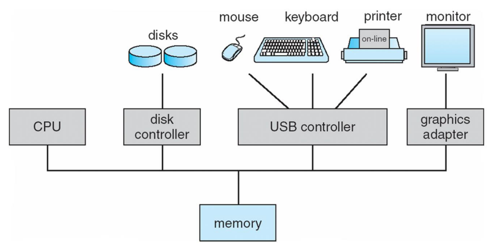
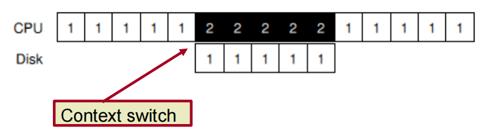
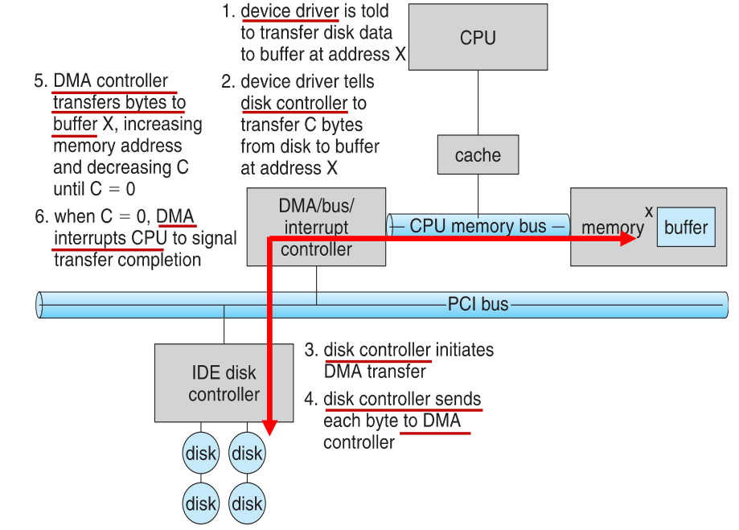
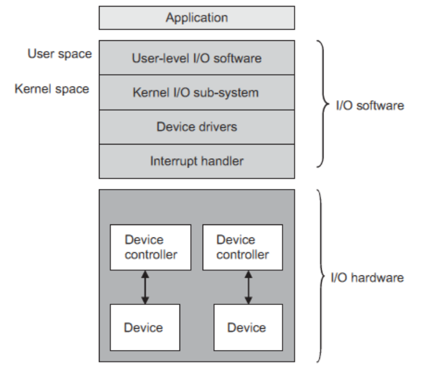
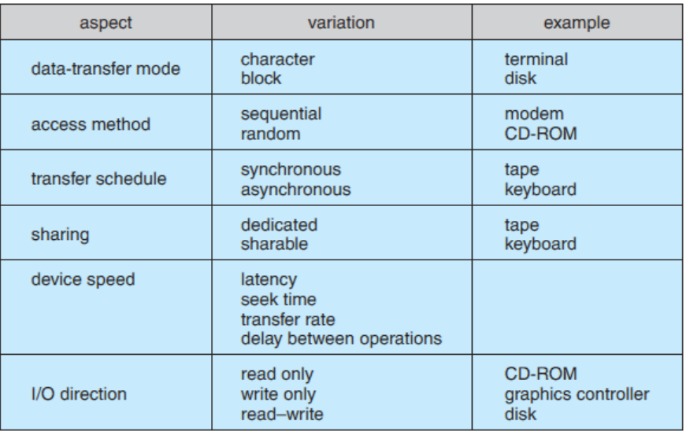
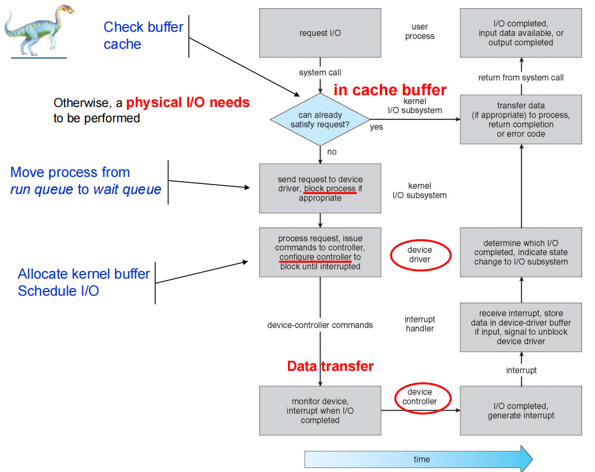

# I/O System I/O系统

## Overview

I/O management is a major component of operating system design and operation

I/O管理是操作系统设计和运行的一个重要组成部分

- Important aspect of computer operation

  计算机操作的重要方面

- I/O devices vary greatly

  I/O设备差别很大

- Various methods to control them

  各种方法来控制它们

- Performance management 

  表现管理

- New types of devices frequent

  新型设备

### The I/O devices are classified:

**Human-readable** and **machine-readable**: The human-readable devices are mouse, keyboard, and so on, and the machine-readable devices are sensors, controllers, disks, etc.

**人类可读**和**机器可读**:人类可读的设备是鼠标、键盘等，机器可读的设备是传感器、控制器、磁盘等。

**Transfer of data** 转移数据

- *character-oriented device* - accepts and delivers the data as a stream of **characters/bytes**

  *面向字符的设备* -作为字符/字节流接受并传送数据

- *block-oriented device* – accepts and delivers the data as **fixed-size blocks**

  *面向块的设备* -接受和传送数据作为固定大小的块

**Type of access** 访问类型

- **sequential device** such as a tape drive.

  顺序设备，如磁带机。

- **random access device**, such as a disk.

  *随机存取设备*，如磁盘。

**Network device** 网络设备

- to send or receive data on a network.

  在网络上发送或接收数据。

## I/O Hardware I/O硬件 

Common concepts – signals from I/O devices interface with computer

- **Port端口** – connection point for device 设备之间的连接点

- **Bus总线** - **daisy chain** or shared direct access 串联或共享直接访问

  - **PCI** bus common in PCs and servers, PCI Express (**PCIe**) **PCI**总线常见于pc和服务器，PCI Express (**PCIe**)

  - **expansion bus** connects relatively slow devices **扩展总线**连接相对较慢的设备

- **Controller** (**host adapter**) – electronics that operate port, bus, device

  **控制器**(**主机适配器**)-操作端口，总线，设备的电子设备

  - Sometimes integrated 有时是集成的

  - Sometimes separate circuit board (host adapter) 有时是单独电路板(主机适配器)

  - Contains processor, microcode, private memory, bus controller, etc 包含处理器，微码，私有存储器，总线控制器等

    - A controller could have its own processor, memory, etc. (E.g.: SCSI controller)

      控制器可以有自己的处理器、内存等(例如:SCSI控制器)。

  - 操作端口，总线和设备的集成电子器件或额外电路板。包含处理器和私有内存，能够通过总线控制器和内存与各种控制器对话。

处理器如何向控制器发送命令执行IO传输：

- Each controller has **registers** that are used for communicating with the CPU.

- There are **data buffer** that the operating system can read and write.
- Each I/O port (device) is identified by a **unique port address**

Each I/O port consists of 4 registers (1 to 4 bytes in size) : 每个I/O端口由4个寄存器(大小为1到4字节)组成:

- **data-in register数据输入寄存器**

- **data-out register数据输出寄存器**

  - data-in register and data-out register are to pass  data to the device or get data from

    数据输入寄存器和数据输出寄存器用于向设备传递数据或从设备获取数据

- **status register状态寄存器**-提供任务相关信息（是否完成，是否故障）

- **control register控制寄存器**-接受主机发送的命令

CPU如何与控制寄存器和设备缓存交流：

1. 直接IO指令-Direct I/O instructions
   每个寄存器被分配一个8bit或16bit的端号(Use different address space from memory)，然后CPU通过IO指令读写控制寄存器(Special I/O instructions, IN / OUT)

2. 内存映射IO-Memory-mapped I/O

   为设备预留特定的内存空间，把寄存器映射到内存空间，CPU通过标准数据传输指令(如MOV)进行访问

   - More efficient for large memory I/O (e.g. graphic card)

     更有效的大内存I/O(如显卡)

   - Vulnerable to accidental modification, error

     易受意外修改、错误影响

### I/O communication techniques

处于用户请求和设备之间的交流模式

### Polling 轮询

The **data transfer** is **initiated by the instructions written in a computer program.**

数据传输是由写入计算机的指令发起的程序

CPU executes a **busy-wait loop** – periodically **checking status of the device to see if it is time for the next I/O operation** (tests the channel status bit)

CPU执行一个忙碌等待循环——定期检查设备的状态，看是否到了下一个I/O操作的时间(测试通道状态位)

CPU stays in a loop until the I/O device indicates that it is ready for data transfer.

CPU一直处于循环状态，直到I/O设备指示它准备好进行数据传输。

Polling can be very fast and efficient, if both the device and the controller are fast and if there is significant data to transfer

如果设备和控制器都很快，并且有大量数据需要传输，那么轮询可以非常快速和有效

**Disadvantage**: It keeps the processor busy needlessly and leads to wastage of the CPU cycles

**缺点**:它使处理器不必要地忙碌，导致CPU周期的浪费

### Interruption I/O中断

In pooling the processor time is wasted => a **hardware mechanism = interrupt.**

在池中浪费处理器时间=> 一个**硬件机制=中断**

the CPU has an **interrupt-request line** that is sensed after every instruction.

CPU有一条中断请求线，它在每条指令之后都被感知。

**Interrupts** allow devices to notify the CPU when they have data to transfer or when an operation is complete. The CPU transfers control to the **interrupt handler.**

**中断**允许设备在有数据要传输或操作完成时通知 CPU。CPU 会将控制权转移给**中断处理程序**。

Two Interrupt-request lines:

- Non-maskable：非屏蔽中断用于严重错误情况
- Maskable：可屏蔽中断由设备控制器发起请求；CPU在关键处理期间可以暂时忽略的。

处理器如何知道I/O何时完成:

通过中断机制(参见中断驱动I/O周期)。

- when the operation is complete, the device controller generates an interrupt to the processor.

  当操作完成时，设备控制器对处理器产生一个中断。

- **NB**: the processor checks for the interrupt after every instruction cycle.

  **NB**:处理器在每个指令周期后检查中断。

- after detecting an interrupt, the processor will perform a *context switch*, by executing the appropriate **Interrupt Service Routine**.

  在检测到中断后，处理器将通过执行适当的中断服务程序来执行上下文切换。

- **Interrupt handler** receives interrupts the processor then performs the data transfer for the I/O operation.

  **中断处理程序**接收中断，然后为I/O操作执行数据传输。

与设备交互的基本协议：

- Wait for drive to be ready 等待驱动器准备好
- Write parameters to control registers 将参数写入控制寄存器
- Start the I/O 启动IO
- Data transfer 数据转移
- Handle interrupts-简单方法是块中断，更灵活的方法是当传输完成时抛出结束中断
- Error handling 异常处理

### **CPU – I/O control de transfer:** DMA 

**DMA = Direct Memory Access** 直接内存访问

- when the data are large, interrupt driven I/O is not efficient.

  当数据量较大时，中断驱动 I/O 的效率不高。

- instead of reading one character at a time through the processor, a **block of characters is read at a time**.

  每次读取处理器中的一个字符，而不是一次读取一个字符块。

- bypasses CPU to transfer data directly between I/O device and memory

  绕过 CPU 直接在 I/O 设备和内存之间传输数据

- DMA hardware generates an interrupt when the I/O transaction is complete

  当 I/O 事务完成时，DMA 硬件会产生中断请求

- requires **DMA** **controller**

  需要**DMA** **控制器**

- version that is aware of virtual addresses can be even more efficient - **Direct Virtual Memory Access** **DVMA**

  可感知虚拟地址的版本效率更高 - **直接虚拟内存访问** **DVMA**

To read or write a block, the processor sends the command to the DMA controller.

**The processor passes the following information to the DMA controller**:

处理IO由DMA完成，通知处理操作又CPU向DMA通知，CPU需要告知DMA以下内容:

- The type of request (read or write)

  请求的类型(读或写)

- The address of the I/O device to which I/O operation is to be carried out

  要对其进行I/O操作的I/O设备的地址

- The start address of the memory, where the data need to be written or read from, along with the total number of words.

  需要写入或读取数据的内存的起始地址，以及总字数(需要写入或读取的数据在内存中的空间)

- The DMA controller then copies this address and the word count to its registers

  然后，DMA 控制器会将该地址和字数复制到其寄存器中

Layered structure of I/O

## Appliance Of I/O Interface

User application access to a wide variety of different devices

用户应用程序访问各种不同的设备

设备驱动程序隐藏了IO控制器之间的差异: (上图的Application层)

1. Character-stream or block
2. Sequential or random-access
3. Synchronous or asynchronous (or both)
4. Sharable or dedicated
5. Speed of operation
6. Read-write, Read only, or Write only

**Characteristics of I/O devices:** I/O设备的特点:

### Block and Character Devices 块与字符设备

**Block devices** are accessed a block at a time **块设备**一次访问一个块

- include **disk drives** and **block-oriented devices**

  包括**磁盘驱动器**和**面向块的设备**

- commands include **read, write, seek** 

  - *Raw I/O* (accessing blocks on a hard drive directly),  生IO
  - *Direct I/O* (uses the normal filesystem access) 直接IO
  - *Memory-mapped file I/O* 内存映射

**Character devices** are accessed one byte at a time

- include **keyboards**, **mice, serial ports**
- commands include **get(), put()**
- supported by higher-level library routines

### Network Device 网络设备

Varying enough from block and character to have own interface 

从块和字符变化足够有自己的界面

*Linux*, *Unix*, *Windows* and many others include **socket interface** 

*Linux*， *Unix*， *Windows*和许多其他包括**套接字接口**

- *socket* acts like a cable or pipeline connecting two networked entities.

  socket就像连接两个网络实体的电缆或管道。

Approaches vary widely (pipes, FIFOs, streams, queues, mailboxes)

方法多种多样(管道、fifo、流、队列、邮箱)

### Clocks and Timers 时钟与定时器

Three types of time services are commonly needed in modern systems:

在现代系统中，通常需要三种时间服务:

- Get the current time of day. 获取当前时间。
- Get the elapsed time since a previous event. 获取自前一个事件以来经过的时间。
- Set a timer to trigger event X at time T. 设置定时器在时间T触发事件X。

A **Programmable Interrupt Timer** (PIT) is a hardware counter that generates an output signal when it reaches a programmed count.

可**编程中断定时器**（PIT）是一种硬件计数器，当达到编程计数时会产生输出信号。

### Blocking and Non-blocking I/O 阻塞与非阻塞I/O

都是针对发起IO请求的用户操作（进程）而言的：

**Blocking** – **process/app is suspended** (move it in the waiting queue) **until I/O completed**

**阻塞** - 需要内核IO操作彻底完成，才返回用户空间执行用户操作。用户空间操作在这期间被阻塞。

**Nonblocking** - the I/O request returns immediately, whether the requested I/O operation has (completely) occurred or not.

**非阻塞**-无论IO操作是否完全发生，IO请求都会立即返回到用户空间执行用户操作，允许进程检查可用的数据

Example:

接收键盘和鼠标输入，同时在屏幕上处理和显示数据的用户界面

### Vectored I/O

known as **scatter/gather I/O** 称为**分散/聚集I/O**

*Scatter/gather* refers to **the process of gathering data from, or scattering data into**, the given **set of buffers**.

*Scatter/gather*是指从**给定的**组缓冲区**中收集数据或将数据分散到**的过程。

- read from or write to multiple buffers at once

  一次从多个缓冲区读取或写入

- allows one system call to perform multiple I/O operations

  允许一个系统调用执行多个I/O操作

- For example, Unix **readve()** accepts a vector of multiple buffers to read into or write from.

  例如，Unix **readve()**接受一个由多个缓冲区组成的矢量，用于读取或写入。

## Kernel I/O Subsystem 内核I/O子系统

**The user interacts with this layer to access any device**. 

**用户与该层交互以访问任何设备**。

There are different functions:

- Uniform Interface

- Scheduling

- Buffering

- Caching

- Spooling and Device reservation 

- I/O protection

- Error Handling 

1. **Uniform Interface** - there are different device drivers for various devices. UI makes uniform the interface, such that **all the drivers’ interface through a common interface**

   **统一接口** -不同设备有不同的设备驱动程序。UI使接口统一，这样**所有的驱动程序的接口通过一个共同的接口**

2. **Scheduling** 调度

   - Some I/O request **ordering via per-device queue **一些I/O请求**通过每个设备队列**排序

   - Some OSs try fairness 有的会被公平对待

3. **Buffering** - **store data in memory while transferring between devices**
   - a buffer is an area where the data, being read or written, are copied in it, so  that the operation on the device can be performed with its own speed. 
   - **Single buffering**
     - kernel and user buffers
     - varying sizes
   - **Double buffering** – two copies of the data
     - permits one set of data to be used while another is collected.

4. **Caching** - region of **fast memory holding copy of data**

   **缓存** - **快速内存中保存数据副本的区域**

   - involves keeping a copy of data in a faster-access location than where the data is normally stored.

     是指在比通常存储数据更快的位置保存数据副本。

   - Buffering and caching use often the same storage space

     缓冲和缓存通常使用相同的存储空间

5. **Spooling** and **Device reservation** – (SPOOL = *Simultaneous Peripheral Operations On-Line)* *=* **buffers data for devices** that cannot support interleaved data streams.

   **假脱机**和**设备保留** - (SPOOL =*同时外设操作在线)* *=* **缓冲不支持交错数据流的设备**的数据。

   对于一次只支持一个请求的IO设备，将所有要输出的东西先脱机到一起，放在独立的磁盘文件上，然后添加输出结束时，假脱机系统将这个脱机文件发送到打印机。

   - device can serve only one request at a time

     设备一次只能处理一个请求

   - spool queues can be general or specific.

     假脱机队列可以是通用的，也可以是特定的。

   - i.e., printers

6. **I/O protection** - provides **exclusive access** to a device

   **I/O保护**提供对设备的**独占访问**

   - All I/O instructions defined to be privileged

     所有定义为特权的 I/O 指令

   - I/O must be performed via system calls that must be performed in kernel mode.

     I/O必须通过必须在内核模式下执行的系统调用来执行。

   - Memory-mapped and I/O port memory locations must be protected by the memory management system.

     内存映射和I/O端口内存位置必须由内存管理系统保护。

7. **Error Handling** – the I/O functions, when performed, may sometimes result in **errors**.

   **错误处理** - I/O功能，当执行时，有时可能会导致**错误**。

   - I/O requests can fail for many reasons, either momentary (buffers overflow) or permanent (disk crash).

     I/O请求失败的原因有很多，可能是暂时的(缓冲区溢出)，也可能是永久性的(磁盘崩溃)。

   - **Transient Errors** - temporary reasons that cause any I/O processing to fail

     **暂态错误** -导致任何I/O处理失败的临时原因

   - **Permanent Errors** - due to the failure of any device or wrong I/O request.

     **永久性错误** -由于任何设备失败或错误的I/O请求。

## Device Driver 设备驱动程序

Piece of software a **device driver** **knows in detail how a device works.**

**设备驱动程序** 可以详细了解设备的工作原理

The functions of a device driver are to: 设备驱动程序的功能包括:

- **accept** the I/O requests **from the kernel** I/O sub-system.

  **接受**内核**输入/输出子系统的**输入/输出请求。

- **control** the I/O operation. 

  **控制** I/O操作。

## Interrupt Handler 中断处理程序

The device driver **communicates** with the device controllers, and then the device, with the help of the **interrupt-handling mechanism.**

在中断处理机制的帮助下，设备驱动程序与设备控制器进行通信，然后与设备进行通信

The **Interrupt Service Routine** (ISR) is executed in order to handle a specific interrupt for an I/O operation.

**Transforming I/O Requests to Hardware Operations**

中断服务例程(ISR)是为了处理I/O操作的特定中断而执行的。

**将I/O请求转换为硬件操作**

## Streams 流

**STREAM** – a **full-duplex communication channel between a user level process and a device** in Unix System V and beyond

在Unix系统V和更高版本中，用户级进程和设备之间的全双工通信通道

A STREAM consists of: STREAM由以下的内容组成

- The user process interacts with the **stream head**. User processes communicate with the stream head using either **read( )** and **write( )**

  用户进程与流头交互。用户进程使用**read()**和**write()**与流头通信

- The device driver interacts with the **device end**.

  设备驱动程序与设备端交互。

- zero or more **stream modules** between

  零或多个流模块之间

Each module contains a **read queue** and a **write queue**

每个模块包含**读队列**和**写队列**

Message passing is used to communicate between queues

消息传递用于在队列之间进行通信

- **Flow control** can be optionally supported. Without flow control, data is passed along as soon as it is ready

  **流量控制**可选支持。如果没有流控制，数据一旦准备好就会被传递

## Improving Performance 改善空间

1. 减少上下文切换
2. 减少数据复制
3. 使用大型传输，智能控制器，轮询减少中断
4. 使用DMA
5. 使用更智能的硬件
6. 平衡CPU，内存，总线，IO性能以提高最高吞吐量
7. 将用户模式进程，守护进程移到内核线程