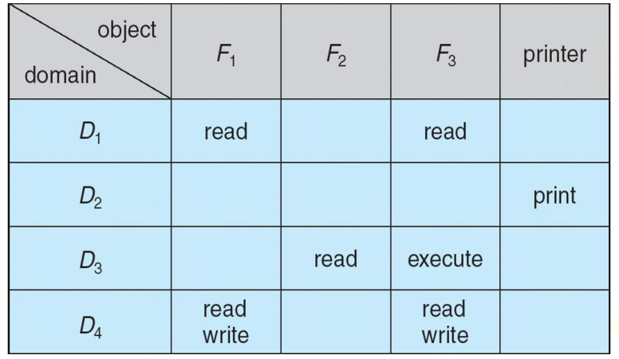
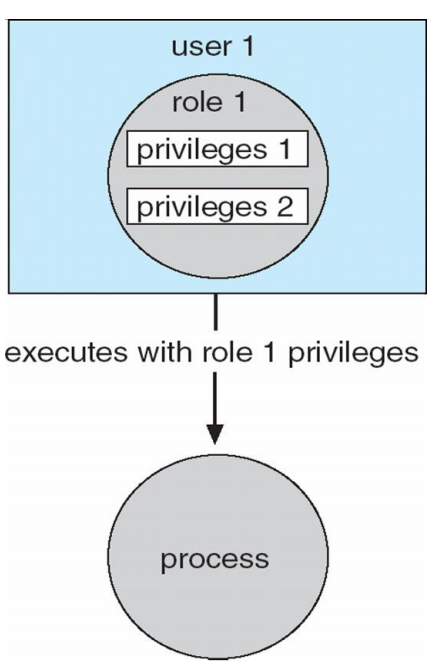
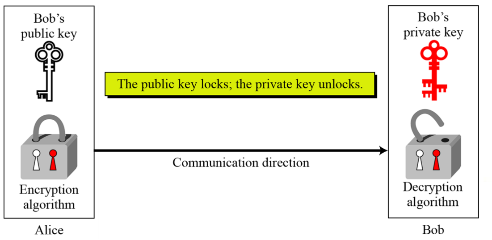
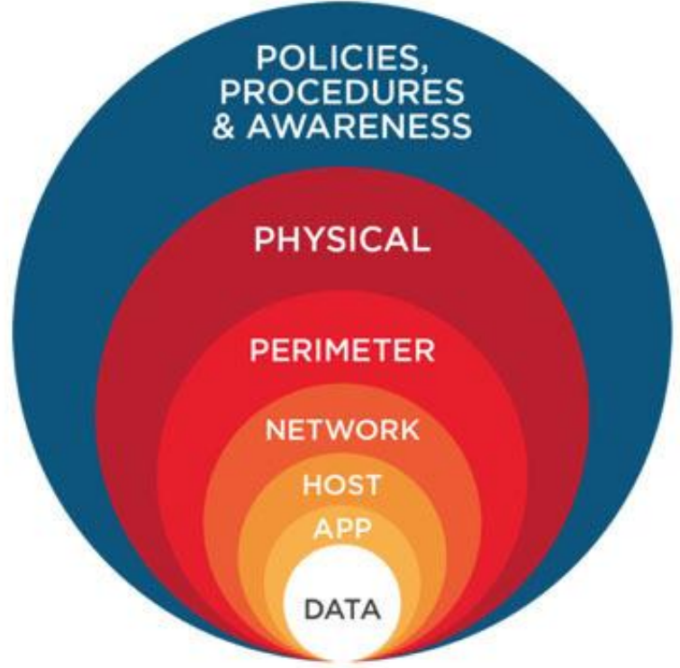

# Protection & Security

## Protection 保护

### Goals of Protection 保护的目标

Protection refers to a mechanism which controls the access of programs, processes, or users to the resources defined by a computer system.

保护是指一种控制程序、进程或用户访问计算机系统所定义资源的机制。

1. prevent the access of unauthorized users

   阻止未授权用户的访问

2. ensure that each active programs or processes in the system uses resources only as the stated policy

   确保系统内每个活动的程序按照策略使用资源

3. ensure that errant programs cause the minimal amount of damage possible

   将错误程序造成的伤害尽可能减少

4. improve reliability by detecting latent errors

   检测潜在错误以提高可靠性

### Principle of Protection 保护的原则

**Principle of least privilege：**

The principle of least privilege dictates that programs, users, and systems be given just enough privileges to perform their tasks.

最小权限原则规定，程序、用户和系统只需获得足够的权限即可执行其任务。

- the user account limited privileges

- the root account

Can be **static** (during life of system, during life of process)

可以是**静态**（在系统生命周期内，在流程生命周期内）

Or **dynamic** (changed by process as needed) – domain switching, privilege escalation

或 **动态**（根据需要由进程更改）--域切换、权限升级

### Domain of Protection 保护域
电脑可以看成进程和物体（软硬件）的集合。

准则之一：Need to know principle：
每个进程应该刚好被允许以访问足够完成任务的任务（不是自己需要的东西就不去请求）

### Domain Structure 域结构

- Protection domain：
  specifies the resources that a process may access
  告知进程它可以访问哪些资源（包含 对象set of objects 以及 操作权限types of operations）

- objects：所有计算机内对象：代码，数据，各种硬件
- Access right：访问/操作权限→the ability to execute an operation on an object
- Domain：被定义为对象和权限的集合，其内元素为< object, { access right set } >

### Access Matrix 访问控制矩阵

View protection as a matrix (**access matrix**) 将保护视为矩阵（**访问矩阵**）

**Rows** represent **domains** (a domain is a set of object and right pairs) **行**表示**域**（域是一组对象和权力对）

**Columns** represent **objects** (resources)  **列**代表**对象**（资源）

**Access(i, j)** is the **set of operations that a process executing in Domain i can invoke on Objectj**

**Access（i，j）**是域i中执行的进程可以在对象j上调用的**操作集**

在这张图中，有四个域和四个对象，即3个文件(F1, F2, F3)和一台打印机

执行在域D1中的进程可以读取文件F1和F3，执行在域D4中的进程与执行在域D1具有相同的特权，但是另外还可以写入文件F1和F3。打印机只能由执行在域D2中的进程来进行访问

**切换:**

当切换一个进程从一个域到另一个域时，我们为域内对象执行操作switch。通过采用访问矩阵对象的域，可以控制域的切换。要从域Di到域Dj的切换是允许的，当且仅当访问权限switch属于access()

### Access Control Policy 访问控制策略

**Role-based access control (RBAC)**  **基于角色的访问控制（RBAC）**

is a security feature for controlling user access to tasks that would normally be restricted to the root user

是一种安全功能，用于控制用户对通常仅限于root用户的任务的访问

**Role-Based Access Control**, RBAC, assigns first the roles and then all the permissions are assigned.

**基于角色的访问控制**，RBAC，首先分配角色，然后分配所有权限。

- A user can be assigned multiple roles.

  一个用户可以被分配多个角色。

- Multiple users can be assigned the same role.

  可为多个用户分配相同的角色。

- A role can have multiple access rights

  一个角色可以具有多个访问权限

## Security 安全

Security is the practice of the confidentiality, integrity, and availability of data.

安全性是指数据的机密性、完整性和可用性。

Security is a measure of confidence that the integrity of a system and its data will be preserved
安全性水平意味着保护系统及其数据的完整性的能力

### Security Violation Categories 安全违规类别

1. Breach of confidentiality 机密
   Unauthorized reading of data 未经授权读取
2. Breach of integrity 完整性
   Unauthorized modification of data 未经授权修改
3. Breach of availability 可用性
   Unauthorized destruction of data 未经授权销毁
4. Theft of service 窃取服务
   Unauthorized use of resources 未经授权使用资源
5. Denial of service (DOS) 拒绝服务
   Prevention of legitimate use 阻碍别人正常使用

### The Security Problem 安全问题

Concepts used in security:

- **Intruders** (**crackers**) attempt to breach security

  **入侵者**（**破解者**）试图破坏安全

- **Threat** is potential security violation

  **威胁**是潜在的安全违规行为

- **Attack** attempts to breach security

  **攻击**试图破坏安全

  - Attack can be accidental or malicious

    攻击可能是意外的，也可能是恶意的

  - Easier to protect against accidental than malicious misuse

    相比于故意的攻击行为更容易防范意外

### Security Violation Methods  安全违规方法

- Masquerading 伪装 (breach authentication破坏身份验证)
  pretending to be an authorized user to escalate privileges 伪装成受权用户进行攻击
- Replay attack 重放攻击
  attack in which the attacker delays, replays, or repeats data transmission between the user and the site. 阻碍正常的数据传输
- Man-in-the-middle attack 中间人攻击
  intruder sits in data flow, masquerading as sender to receiver and vice versa 伪装成发送者
- Session hijacking 会话劫持(cookie side-jacking)
  Intercept an already-established session to bypass authentication. 拦截会话
  Attackers can perform actions that the original user is authorized to do 然后可执行原本用户可执行操作

### Program Threats 程序威胁

- **Trojan Horse** - allows programs written by users to be executed by other users *(Spyware, pop-up browser windows, covert channels)*

  **木马** - 允许用户编写的程序被其他用户执行 *(间谍软件、弹出浏览器窗口、隐蔽渠道)*

- **Trap Door** - is when a hacker deliberately inserts a security hole that they can use later to access the system.

  **陷阱门** -当黑客故意插入一个安全漏洞，他们可以使用以后访问系统。

- **Logic Bomb** - is a piece of code intentionally inserted into a software system that will set off a malicious function when specified conditions are met.

  **逻辑炸弹**-是一段故意插入软件系统的代码，当满足特定条件时，它会引发恶意功能。

- **Stack** and **Buffer Overflow** exploits a bug in a program (overflow either the stack or heap buffers)

  **堆栈**和**缓冲区溢出**利用程序中的错误（溢出堆栈或堆缓冲区）

- **Viruses** - fragment of code embedded in an otherwise legitimate program, designed to replicate itself (by infecting other programs), and (eventually) wreaking havoc.

  **病毒**——嵌入合法程序中的代码片段，旨在复制自身（通过感染其他程序），并（最终）造成严重破坏。

### System and Network Threats 系统和网络威胁

- **Worm** - is a process that uses the fork process to make copies of itself in order to create chaos in a system. Worms consume system resources, often blocking out other, legitimate processes

  **蠕虫**--是一种利用分叉进程复制自身以在系统中制造混乱的进程。蠕虫会消耗系统资源，通常会阻塞其他合法进程

- **Port Scanning** is technically not an attack, but rather a search for vulnerabilities to attack.

  **端口扫描**从技术上讲不是攻击，而是搜索要攻击的漏洞。

- **Denial of Service ( DOS )** attacks that attempt to lock down systems so much that they can no longer be used for any useful activity. DOS attacks can also involve social engineering

  **拒绝服务(DOS)** 攻击，试图封锁系统，使其无法再用于任何有用的活动。DOS 攻击还可能涉及社会工程学

### Security Measure Levels 安全措施级别

To protect a system, we must take security measures at four levels: 为了保护系统，我们必须在四个层面采取安全措施：

- **Physical** 物理层面

  - Data centers, servers, connected terminals 数据中心、服务器、连接的终端

- **Human** 人为因素

  - Avoid *social engineering, phishing* (involves sending an innocent-looking e-mail), *dumpster diving* (searching the trash or other locations for passwords), *password cracking*.

    避免*社会工程、网络钓鱼*（包括发送看起来无辜的电子邮件）、*垃圾箱潜水*（在垃圾桶或其他位置搜索密码）、*密码破解*。

- **Operating System** 操作系统

  - System must protect itself from accidental or purposeful security breaches:*runaway processes* (DOS denial of service), *memory-access violations,* *stack overflow violations, the launching of programs with excessive* *privileges*, etc.

    系统必须保护自己不受意外或有目的的安全漏洞的影响：*进程失控*（DOS拒绝服务）、*内存访问违规、**堆栈溢出违规、使用过多**权限启动程序*等。

- **Network** 网络

  - protecting the network itself from attack and protecting the local system from attacks coming in through the network (intercepted communications, interruption, DOS, etc)

    保护网络本身免受攻击，并保护本地系统免受通过网络进入的攻击（截获的通信、中断、DOS等）

## CRYPTOGRAPHY AS A SECURITY TOOL 密码学作为一种安全工具

### Encryption 加密

Cryptography is a technique to hide  the  message  using *encryption*.

密码学是一种使用“加密”隐藏消息的技术。

*Encryption* is a process of encoding a message so that its meaning cannot be easily understood by unauthorized people.

*加密*是对消息进行编码的过程，因此未经授权的人无法轻易理解其含义。

#### Symmetric Encryption 对称加密

**Same key used to encrypt and decrypt** 使用同一个密钥(same key) 进行加密和解密

- **Data Encryption Standard (DES)** was most commonly used symmetric block encryption algorithm (created by US Govt)

  **数据加密标准（DES）**是最常用的对称块加密算法（由美国政府创建）

- **Triple-DES** considered more secure

  **三重DES**被认为更安全

- **Advanced Encryption Standard** (**AES**)

  **高级加密标准**（**AES**）

- **Rivest Cipher RC4** is most common symmetric stream cipher, but known to have  vulnerabilities

  **Rivest密码RC4**是最常见的对称流密码，但已知存在漏洞

#### Asymmetric Encryption 非对称加密

公开密钥加密数据只有用对应的私有密钥才能解密，反之亦然，私有密钥加密的数据只有公开密钥才能解密。通常，生成一对密钥后，将其中一把作为公钥公开给对方，自己收到对方使用公钥加密后的信息后使用自己保留的私钥解密。

**Public-key encryption** based on each user having **two keys**:

**公钥加密**基于每个用户拥有**两个密钥**：

- **public key** – published key used to encrypt data

  **公钥**–用于加密数据的已发布密钥

- **private key** – key known only to individual user used to decrypt data

  **私钥**–只有个人用户知道的用于解密数据的密钥

Most common is **RSA** (RSA = Ron Rivest, Adi Shamir and Leonard Adleman) based on prime numbers

最常见的是基于素数的**RSA**（RSA=Ron Rivest、Adi Shamir和Leonard Adleman）

### Digital Certificates 数字验证

解决公钥不安全的方法：digital certificate

*A digital certificate is a mechanism that allows users to verify the authenticity of a key / document.*

*数字证书是一种允许用户验证密钥/文档真实性的机制*

- Proof of who or what owns a public key

- **Public key** digitally signed a trusted party

- **Trusted party** receives proof of identification from entity and certifies that public key belongs to entity

- **Certificate authority** are trusted party – their public keys included with web browser distributions
  - They vouch for other authorities via digitally signing their keys

### Key Distribution Management 密钥分发管理

Keys in **Symmetric encryption** is a **major problem** 对称加密中的**密钥**是一个大问题

- One option is to send them **Out-of-band**, say via **paper** or a **confidential conversation or** **One-time pad**

  一种选择是发送**带外**，比如通过**纸**或**机密对话**或**一次性记事本**

Keys in **Asymmetric encryption** -  the public keys are not confidential.

**非对称加密**中的密钥-公钥不保密。

- the **key-ring** can be easily stored and managed (**key-ring** is simply a file with keys in it.)

  **钥匙圈**可以很容易地存储和管理（**钥匙圈***只是一个包含钥匙的文件。）

Even asymmetric key distribution needs care – *man-in-the-middle attack*

即使是非对称密钥分发也需要小心——*中间人攻击*

## USER AUTHENTICATION 用户认证

### Authentication

When a user logs into a computer, the OS needs to determine the identity of the user.

当用户登录到计算机时，操作系统需要确定用户的身份。

The user authentication has two steps:

- **Identification** - a unique identifier is specified to the user to authenticate.

  **标识**-为用户指定一个唯一的标识符以进行身份验证。

  - a **Signing function** - produces an **authenticator**: a value to be used to authenticate a user.

    a**签名函数**-生成一个**验证器**：用于对用户进行身份验证的值。

- **Verification of a user** - performed against the unique identifier, that is, it confirms the binding between the user and the identifier.

  **对用户**的验证——根据唯一标识符执行，即确认用户和标识符之间的绑定。

  - a **Verification function** - produces a value of "true" if the authenticator was created from the user, and "false" otherwise.

    a**验证函数**-如果验证器是从用户创建的，则生成值“true”，否则生成值“false”。

There are two main authentication algorithms: 有两种主要的身份验证算法：

- **Message Authentication Code (MAC)**: uses symmetric encryption.

  **消息身份验证码（MAC）**：使用对称加密。

  - a cryptographic checksum is generated from the message using a secret key.

    使用秘密密钥从消息生成密码校验和。

- **Digital-signature algorithm** - uses asymmetric encryption

  **数字签名算法**-使用非对称加密

  - A person can encrypt signature related data with the use of a private key

    个人可以使用私钥加密与签名相关的数据

  - One can give the public key to anyone who needs verification of the signer’s signature.

    可以将公钥提供给任何需要验证签名者签名的人。

### Common forms of user authentication  常见的用户认证形式

- **Passwords**

  - **Password Vulnerabilities** **密码漏洞**

  - **Securing Passwords** - modern systems do not store passwords in clear-text form.

    **密码安全** - 现代系统不会以明文形式存储密码。

  - **One-time passwords** resist shoulder surfing and other attacks .

    **一次性密码**可抵御肩冲和其他攻击。

- **Biometrics** involve a physical characteristic of the user.

  **生物识别**涉及用户的身体特征。

- **Multifactor authentication** is better **多因素身份验证**更好

## IMPLEMENTING SECURITY DEFENSES 实施安全防御

The major methods, tools, and techniques that can be used to improve security:

可用于提高安全性的主要方法、工具和技术：

- Security Policy 安全策略

- Vulnerability Assessment 脆弱性评估

- Intrusion Detection 入侵检测

- Virus Protection 病毒防护

- Auditing, Accounting, and Logging 审计、会计和日志记录

**Defense in depth** is most common security theory – **multiple layers of security**

**深度防御**是最常见的安全理论——**多层安全**

### Vulnerability Assessment 脆弱性评估

Periodically examine the system to detect vulnerabilities 定期检查系统以检测漏洞

- Port scanning. 端口扫描。

- Check for bad passwords. 检查是否有错误的密码。

- Unauthorized programs in system directories. 系统目录中未经授权的程序。

- Incorrect permission bits set. 设置了不正确的权限位。

- Program checksums / digital signatures which have changed. 对已更改的校验和/数字签名进行编程。

- Unexpected or hidden network daemons. 意外或隐藏的网络守护程序。

- New entries in startup scripts, shutdown scripts or other system scripts or configuration files.

  启动脚本、关闭脚本或其他系统脚本或配置文件中的新条目。

- New unauthorized accounts. 新的未经授权的帐户。