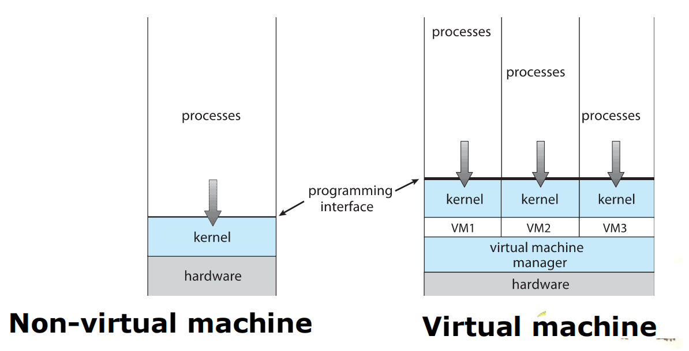
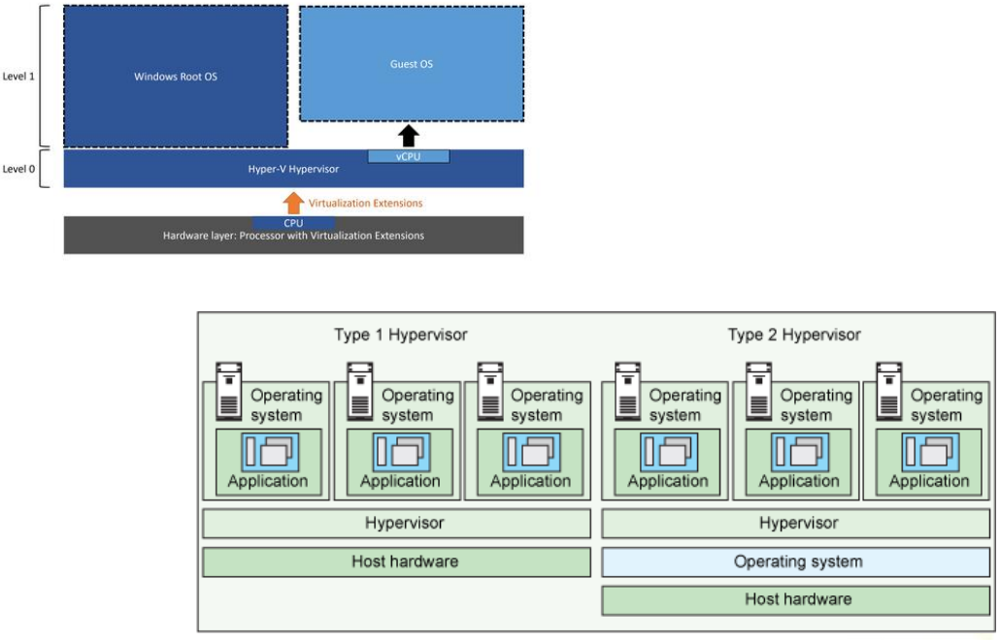
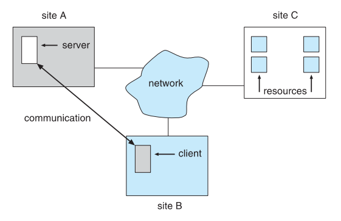

# Virtual Machine and Distributed System 虚拟机与分布式系统

## Virtual Machine 虚拟机

**Virtualization** is technology that allows to create multiple simulated environments or dedicated resources from a single, physical hardware system

**虚拟化**是一种允许从单个物理硬件系统创建多个模拟环境或专用资源的技术

Software called a **hypervisor** connects directly to that hardware and allows to split a system into separate, distinct, and secure environments known as **virtual machines (VMs).**

被称为**管理程序**的软件直接与硬件连接，可将系统分割成独立、不同和安全的环境，称为**虚拟机（VM）**。

**Virtual machine manager** (VMM) or **hypervisor** – creates and runs virtual machines by providing interface that is **identical** to the host (except in the case of paravirtualization)

**虚拟机管理器** (VMM)或**管理程序** -通过提供与主机**相同的**接口来创建和运行虚拟机(半虚拟化的情况除外)

Virtual machine implementations involve several components:

虚拟机实施涉及以下几个组件：

- **Host** – the physical hardware equipped with a hypervisor.

  主机 - 配备有管理程序的物理硬件。

- **Guest** – an operating system

  **Guest** -操作系统

- Single physical machine can run multiple operating systems concurrently, each in its own virtual machine

  单个物理机可以同时运行多个操作系统，每个操作系统都在其自己的虚拟机中

The hypervisor provides a **layer between the hardware (the physical host machine) and the Virtual Machines (guest machines).**

管理程序在硬件（物理主机）和虚拟机（客户机）之间提供了一个**层**。

### Implementation of VMMs VMM 的实现

Types of virtual machine manager VMMs:

- **Type 0 hypervisors** **-** *Hardware-based solutions* that provide support for virtual machine creation and management via firmware.

  **Type 0型管理程序** **-** *基于硬件的解决方案*，通过固件为虚拟机创建和管理提供支持。

  - IBM LPARs and Oracle LDOMs are examples

- **Type 1 hypervisors** **-** *Operating-system-like software* built, **is a layer of software run directly on the system hardware.**

  **Type 1虚拟机管理程序** **-** **类似操作系统的软件**构建，**是直接在系统硬件上运行的一层软件

  - Including VMware ESX, Joyent SmartOS, and Citrix XenServer
  - Including Microsoft Windows Server with HyperV and RedHat Linux wit KVM

- **Type 2 hypervisors** **- allows users to run multiple operating systems simultaneously on a single platform**

  **Type2虚拟机管理程序** **- 允许用户在单个平台上同时运行多个操作系统**

  - Including VMware Workstation and Fusion, Parallels Desktop, and Oracle VirtualBox

### Implementation of VMMs

## Benefit 好处

- the ability to share the same hardware yet run several different execution different operating systems concurrently

  能够共享相同的硬件，但同时运行几个不同的不同操作系统

- **Host system protected from VMs**, VMs protected from each other

  **主机系统受虚拟机保护**，虚拟机相互保护

  - against virus - less likely to spread 

    抗病毒--不易传播

  - each virtual machine is almost completely isolated from all other virtual machines

    每个虚拟机几乎与所有其他虚拟机完全隔离

  - **Disadvantage** of isolation is that it can prevent sharing of resources.

    隔离的**缺点**是会妨碍资源共享。

- a perfect for **operating-system research and development**.

  一个完美的**操作系统的研发**。

- virtualized workstation allows for rapid **porting and testing of programs in varying environments.**

  虚拟化工作站允许在不同环境中快速移植和测试程序。

- **Consolidation** involves taking two or more separate systems and running them in virtual machines on one system.

  **整合**涉及将两个或多个独立的系统，以虚拟机的形式运行在一个系统上。

- can improve resource utilization and resource management.

  可以提高资源利用率和资源管理水平。

- **Live migration** – move a running VM from one host to another.

  **实时迁移** - 将运行中的虚拟机从一台主机移到另一台主机。

## Distributed System 分布式系统

### Overview

**Distributed system** is a loosely-coupled architecture, wherein processors are inter-connected by a communication network.

**分布式系统**是一种松耦合架构，其中处理器通过通信网络相互连接。

Processors variously called **nodes, computers, machines, hosts**

处理器有多种称谓**节点、计算机、机器、主机**

The processors and their respective resources for a specific processor in a distributed system are *remote*, while its own resources are considered as *local*.

分布式系统中特定处理器的处理器及其各自的资源是*远程*的，而其自身的资源则被视为*本地*的。

### Reasons for Distributed Systems 选择分布式系统的原因

1. **Resource sharing**

   - Sharing and printing files at remote sites

     在远程站点共享和打印文件

   - Processing information in a distributed database

     处理分布式数据库中的信息

   - Using remote specialized hardware devices

     使用远程专用硬件设备

2. **Computation speedup**

   - *load sharing* or *job migration* *(*are distributed and run concurrently on various nodes on the system)

     *负载分担*或任务迁移*（*分布在系统的不同节点上并发运行）

3. **Reliability** 

   - detect and recover from site failure, function transfer, reintegrate failed site; may utilize an alternative path in the network, in case of any failure.

     检测和恢复站点故障、功能转移、重新整合故障站点；在出现任何故障时，可利用网络中的替代路径。

4. **Communication**

   - exchange information at geographically-distant nodes

     在地理距离较远的节点交换信息

5. **Economy** and **Incremental growth**

   - a number of cheap processors together provide a highly cost-effective solution for a computation intensive application. The DS may be increased with the introduction of any new hardware or software resources.

     在计算密集型应用中，多个廉价处理器共同提供了一个极具成本效益的解决方案。在引入任何新的硬件或软件资源后，DS 还可以增加。

### Types of Network-oriented OS  面向网络的操作系统类型

**Network Operating Systems** **网络操作系统**

- **Remote logging** into the appropriate remote machine (telnet, ssh)

  **远程登录**到相应的远程机器（telnet、ssh）

- **Remote File Transfer** - transferring data from remote machines to local machines, via the File Transfer Protocol (FTP) mechanism

  **远程文件传输** - 通过文件传输协议（FTP）机制将数据从远程机器传输到本地机器

- Users must establish a *session*

  用户必须建立*会话*

### Distributed Operating Systems 分布式操作系统

- **Data Migration** – transfer data by transferring entire file, or transferring only those portions of the file necessary for the immediate task

  **数据迁移** - 通过传输整个文件或仅传输当前任务所需的部分文件来传输数据

- **Computation Migration** – transfer the computation, rather than the data, across the system
  - **计算迁移** - 在系统间传输计算而非数据

- **Process Migration** – execute an entire process, or parts of it, at different sites
  - **流程迁移** - 在不同地点执行整个流程或部分流程
