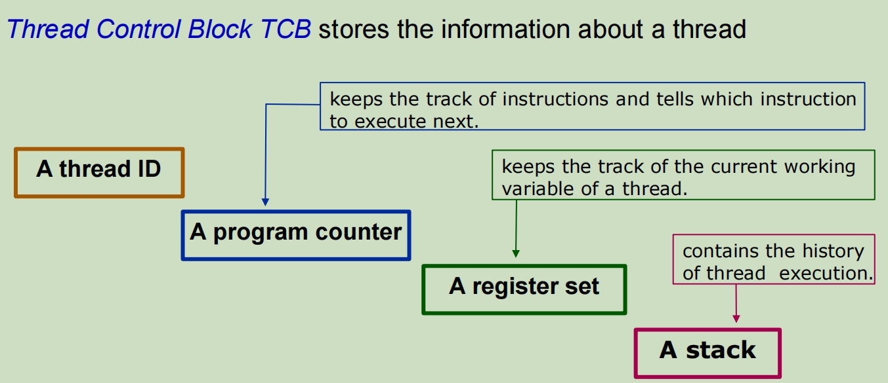
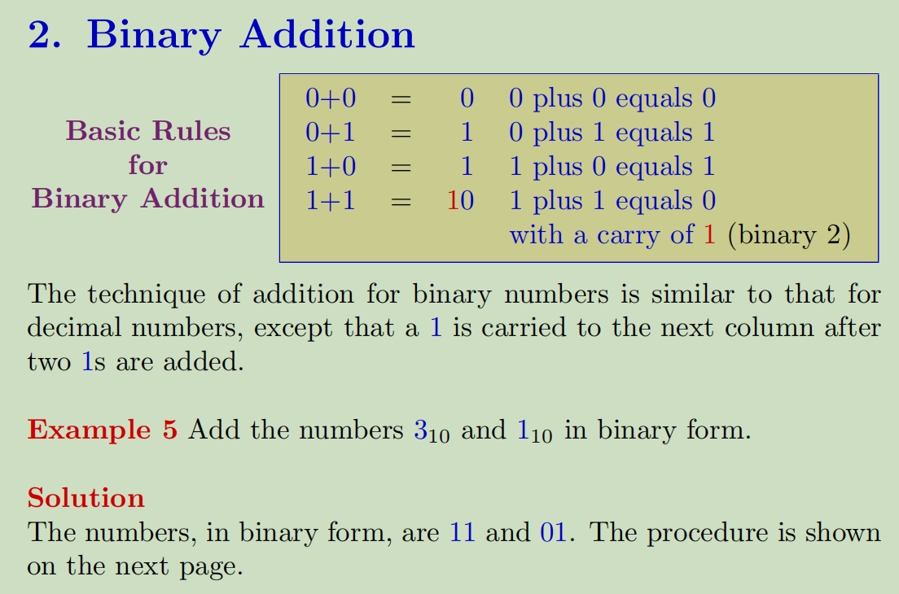
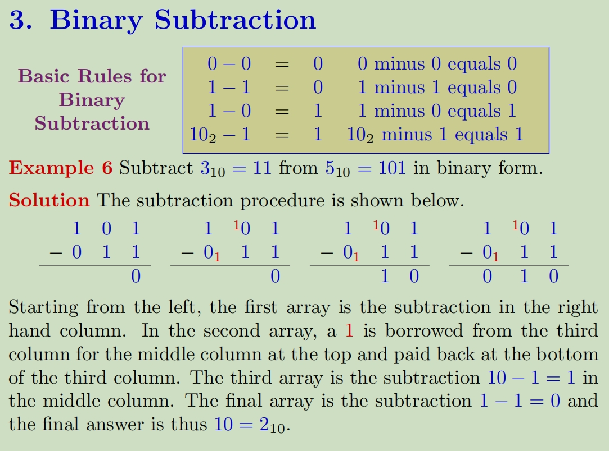
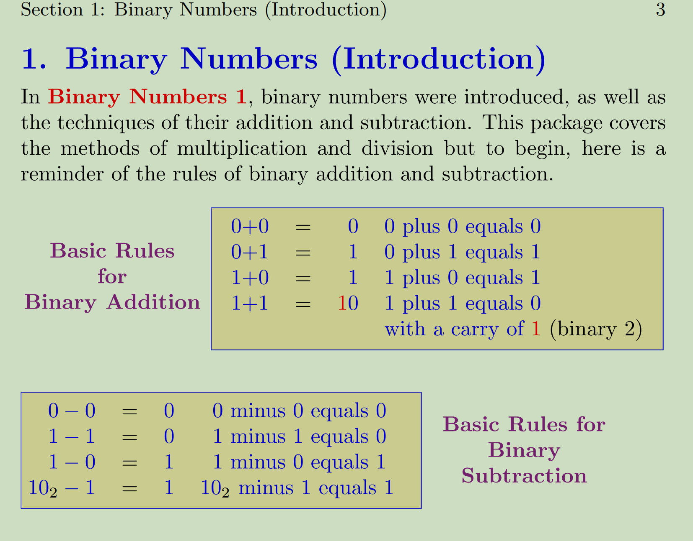
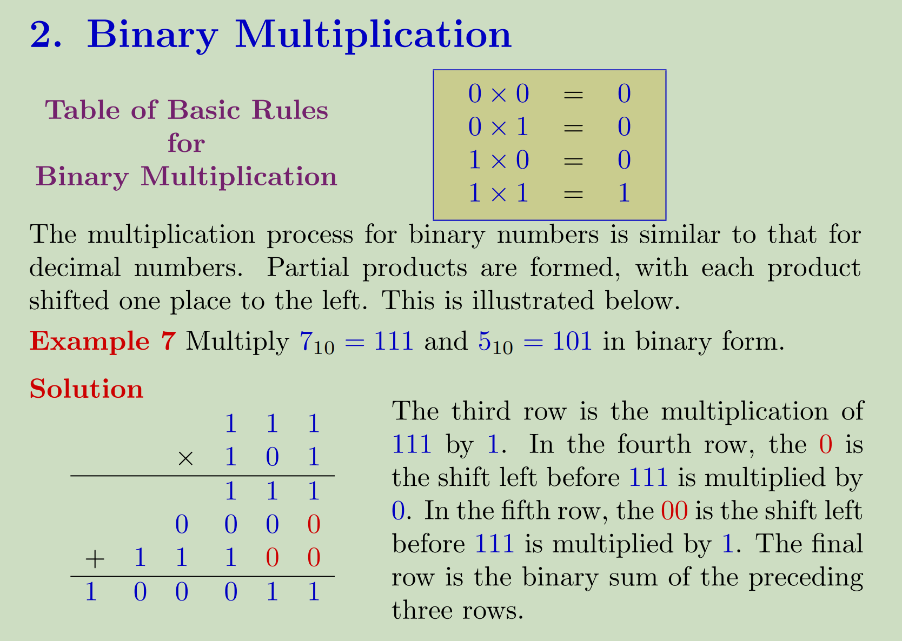
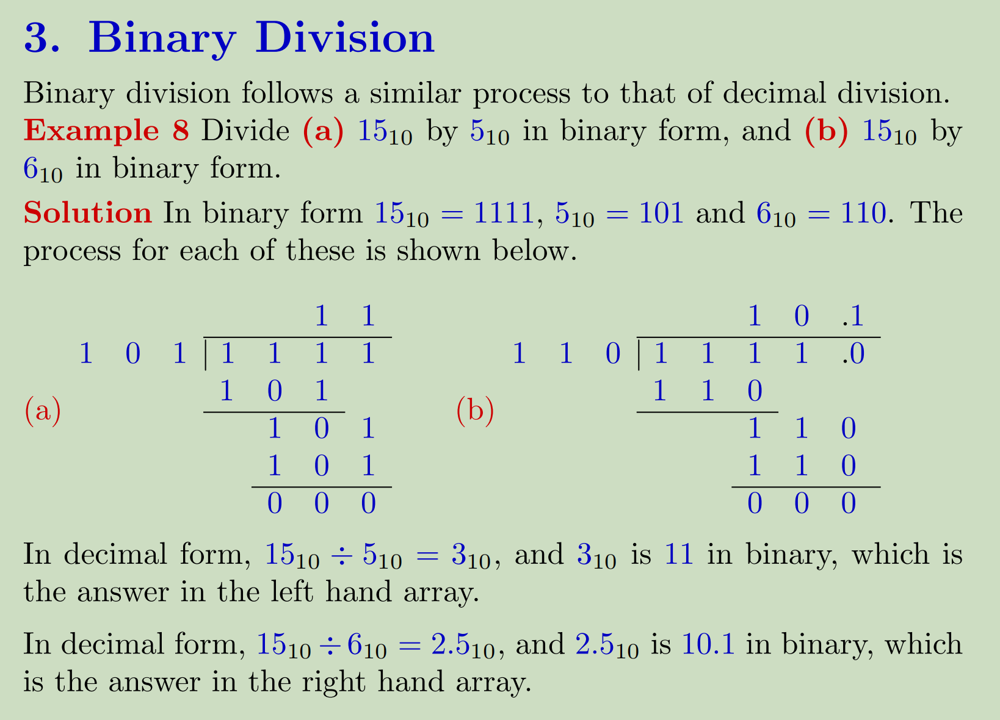

# Threads 线程

线程是进程的一部分

**Thread** of execution is the **smallest sequence of programmed instructions** that can be managed independently by a scheduler andexecuted by the CPU independently of the parent process.

执行的线程是编程指令的最小串行，可以由调度进程独立管理，并由 CPU 独立于父进程执行。

A thread is a *lightweight process* that can be managed independently bya scheduler.

线程是一个*轻量级进程*，可以由调度进程独立管理。

Executes a series of instructions in order (only one thing happens at a time)

按顺序执行一系列指令（一次只发生一件事）

线程运行的概念和进程类似，一个CPU一个时间片内只能运行一个线程，但是实现多线程的原理是一个线程的程序不一定都要执行完才去执行下一个，CPU会划分时间片，加入线程A和B同时运行一段代码，A处理到断点1的时候停止但是此时仍未结束，此时CPU开始执行线程B也是运行到断点1，然后再返回线程A

When there are multiple threads running for a process, the process provides common memory.

当一个进程有多个线程运行时，该进程将提供公共内存。

**Multiple tasks with the application can be implemented by separate threads**

**应用进程的多个任务可以由单独的线程实现**

Threads are scheduled on a processor, and each thread can execute a set of instructions independent of other processes and threads.

线程在处理器上调度，每个线程可以独立于其他进程和线程执行一组指令。

**O.S view**: A thread is the smallest unit of processing that can be performed in an OS.
**Software developer view**: Thread is a fundamental unit of CPU utilization that forms the basis of multithreaded computer systems

线程是计算机操作系统执行的基本单元，也是CPU使用的基本单元。线程也可以看成是简化的进程；
属于同一个进程的线程之间可以共享代码，数据，文件；线程能够帮助程序“同时”执行多个任务

一个线程主要包含：
线程ID，程序指针，寄存器集，栈

## Benefit of Threads 线程的好处

- Responsiveness 

  - Allows a program continue running if part of it is blocked or its is 

    允许进程在部分进程被阻止或被阻止时继续运行

  - performing a lengthy operation

    执行冗长的操作

- Resource Sharing and Economy 资源共享与经济

  - Threads share an address space, files, code, and data

    线程共享地址空间、文档、代码和数据

  - Avoid resource consumption

    避免资源消耗

  - Perform much a faster context switch

    执行更快的上下文切换

- Utilization of multiprocessor MP Architectures  利用多处理器 MP(Multiple Processor) 架构

  - Place code, files and data in the main memory.

    将代码、文档和数据放在主存储器中。

  - Distribute threads to each of CPUs, and

    将线程分发到每个 CPU，以及

  - Let them execute in parallel

    让它们并行执行

- Deadlock avoidance

  避免死锁

  因为如果当前运行的thread被锁给卡住了，那么处理器会直接继续运行接下来的线程，这样可能就会在后面的线程中释放掉锁住的资源

## Example

**User** types text in the Word editor -> **threads**:

- **open a file** in Word editor
- **typing the text** (one thread),
- **the text is automatically formatting** (another thread),
- **the text is automatically specifying the spelling mistakes** (another thread)
- **the file is automatically saved to disk** (another thread).

## Thread States 线程状态

**Thread Control Block (TCB)** contains:

**Execution State**: CPU registers, program counter, pointer to stack

**Scheduling info**: State, priority, CPU time

**Various Pointers** (for implementing scheduling queues)

**螺纹控制块 （TCB）** 包含：

**执行状态**：CPU 寄存器、进程计数器、指向堆栈的指针

**计划信息**：状态、优先级、CPU 时间

**各种指针**（用于实现调度队列）

状态切换:

未创建的线程处于undefined状态；

当线程就绪时，处于ready状态；

同一时刻只能有一个线程处于running状态

当线程被中断运行（suspend），处于suspended状态，随后可调用resume（）回归就绪状态

处于中断terminated状态的进程会被释放，随后处于销毁destroyed状态

## Concurrency VS Parallelism 并发和并行

**Concurrency并发**: 单核系统并发处理任务，进程一个一个开始，中间互相穿插运行，直到结束完成。（一会吃饭一会看手机）

**Parallelism并行**: 多核系统并行处理任务能够同时处理多个任务（一边吃饭一边看手机）

## Multithreading Models 多线程模型

1. **Kernel Mode** - executing code has **complete** and **unrestricted access** to the underlying hardware.

   **内核模式** 执行代码对底层硬件具有 **complete** 和 **unrestricted 访问权限**。

   - It can execute any CPU instruction and reference any memory address.

     它可以执行任何 CPU 指令并引用任何内存地址。

   - Kernel mode is generally reserved for the lowest-level, most trusted functions of the operating system.

     内核模式通常保留给操作系统的最低级别、最受信任的功能。

   - Crashes in kernel mode are catastrophic; they will halt the entire PC.
   
     内核模式下的崩溃是灾难性的;他们将停止整个 PC。

​	由计算机内核安排在CPU上执行的线程。此类线程管理通过OS内核控制。

2. **User Mode** - executing code has **no** ability to **directly access**hardware or reference memory.

   **用户模式**执行代码具有**否**直接访问硬件或引用内存的能力。
   
   - Code running in user mode must delegate to system APIs (*Application Programming Interface)* to access hardware or memory.
   
     在用户模式下运行的代码必须委托给系统 API（*应用进程编程接口）* 才能访问硬件或内存。
   
   - Crashes in user mode are always recoverable.
   
     用户模式下的崩溃始终是可恢复的。
   
   - Most of the code running on your computer will execute in user mode.
   
     计算机上运行的大多数代码都将在用户模式下执行。

​	由用户实现的执行单元，这些线程受内核支持但是内核不管理这些线程。**用户线程比系统线程快**。
​	通过使用**线程库thread library**来调度这些线程。

The processor switches between the two modes depending on what type of code is running on the processor. *Applications* run in user mode, and *core operating system* components run in kernel mode.

处理器根据处理器上运行的代码类型在两种模式之间切换。***应用进程*在用户模式下运行，*核心操作系统*组件在内核模式下运行**。

ULT的最后一条是因为multiprocessing是由processor控制的，但是ULT的级别不够控制System kernel因此也就没办法调节处理器，因此multi-threaded application无法从multiprocessing中获利

### Three types

#### Many-to-One

多个用户级线程映射map到一个核线程。
因为只映射到一个核线程，所以进程只能同时执行一个用户线程，而且当这个用户线程被阻塞，整个进程被阻塞。
Used on systems that do not support kernel threads.
用于不支持内核线程的系统

#### One-to-one

一个用户级线程映射到一个系统线程。
每次创建一个用户线程就会创建一个系统线程，提供了并发的可能，且当一个线程发生阻塞，其他线程依旧可以运行。
大部分主流操作系统用的这个

#### Many-to-many

多个用户线程映射到多个系统线程

Allows the operating system to create **a sufficient number of kernel threads**

Number of kernel threads may be specific to an either a particular application or a particular machine.

The user can create any number of threads and corresponding kernel level threads can run in parallel on multiprocessor

允许操作系统创建足够数量的内核线程

内核线程数可能特定于特定应用进程或特定计算机。

用户可以创建任意数量的线程，相应的内核级线程可以在多处理器上并行运行

## Thread Libraries 线程库

Threads can be created, used, and terminated via a set of functions that are part of a **Thread API** (a **thread library**).

线程可以通过一组函数创建、使用和终止，这些函数是 **Thread API**（**线程库**）的一部分。

1. 没有内核支持时，在用户空间中提供库（Library entirely in user space）。意味着库的所有代码和数据存放在用户空间，调用时不会使用系统调用。
2. 实现内核级别库（kernel-level library ），库和代码放在内核空间中，调用这些函数会使用系统调用。

三个主要的线程库：POSIX Pthreads，Win32，Java

## Managing Threads 管理线程

There are 2 categories: **Explicit** and **Implicit threading**.

**Explicit threading -** the *programmer* creates and manages threads**.**

**Implicit threading -** the *compilers and run-time libraries* create and manage threads

**显式线程 -** 由程序员手动创建和管理线程。

**隐式线程** - *编译器和运行时库* 创建和管理线程

## Three Approaches for Designing Multithreaded Programs

**Thread pool** - create a number of threads at process startup and place them into a pool, where they sit and wait for work.

**线程池** 在进程启动时创建多个线程，并将它们放入池中，它们在那里等待工作。

**OpenMP** is a set of compiler directives available for C, C++, and Fortran programs that instruct the compiler to automatically generate parallel code where appropriate.

**OpenMP** 是一组可用于 C、C++ 和 Fortran 进程的编译器指令，用于指示编译器在适当的情况下自动生成并行代码。

**Grand Central Dispatch (GCD)** - is an extension to C and C++ available on *Apple’s MacOS X* and *iOS* operating systems to support

parallelism.

**Grand Central Dispatch （GCD）** 是 C 和 C++ 的扩展，可在 *Apple 的 MacOS X* 和 *iOS* 操作系统上支持并行。

## Thread Issues 线程问题

1. fork（）和exec（）调用
   当fork（）被调用，会产生俩，一个父级，一个子级；他们俩的代码段，数据和堆栈完全相同。
   当exec（）被调用，当前线程执行的程序会被替换成另一个程序，进程ID未变，以别的程序替代了该线程的代码段，数据和堆栈。

2. 信号处理Signal handling
   Unix/Linux系统相应某个条件或操作而生成的中断或时间，由signal handler处理，且每个信号只处理一次，信号大致有以下几种：
   异步信号asynchronous signal：发信号后不等
   同步信号synchronous signal ：发送信号后死等

   What happens if thread never does any I/O, never waits, and  never yields control?

   如果线程从不执行任何 I/O、从不等待且从不放弃控制权，会发生什幺情况？

   Answer: Utilize External Events 利用外部事件

   - Interrupts: signals from hardware or software that stop the running code and jump to kernel

     中断：来自硬件或软件的信号，用于停止正在运行的代码并跳转到内核

   - Timer: like an alarm clock that goes off every (some) many milliseconds

     计时器：就像闹钟，每隔（一些）几毫秒就会响起一次

   How the signal would be delivered to the thread would be decided?

   如何决定将信号传递到线程？

   - asynchronous signal is generated from outside the process that receives it

     异步信号是从接收它的进程外部生成的

   - synchronous signal is delivered to the same process that caused the signal to occur

     同步信号被传送到导致信号发生的同一进程

3. 线程关闭Thread cancellation
   在线程完成之前关闭线程（如：加载页面时点击取消）
   能通过以下方式关闭：
   	· Asynchronous cancellation 异步取消：立即终止。
   	· Deferred cancellation 延期取消：允许目标线程检查然后自己终止。

## Binary Calculation

