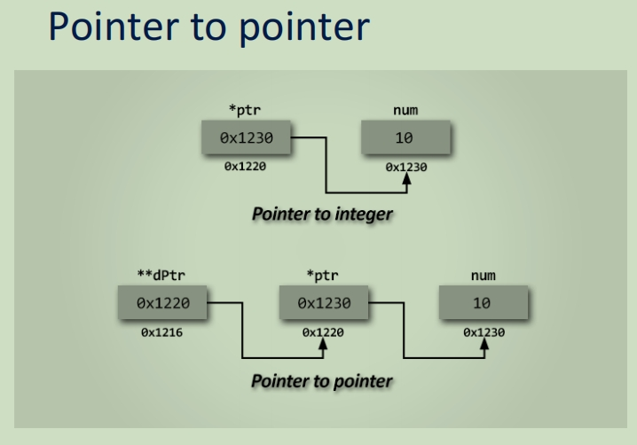
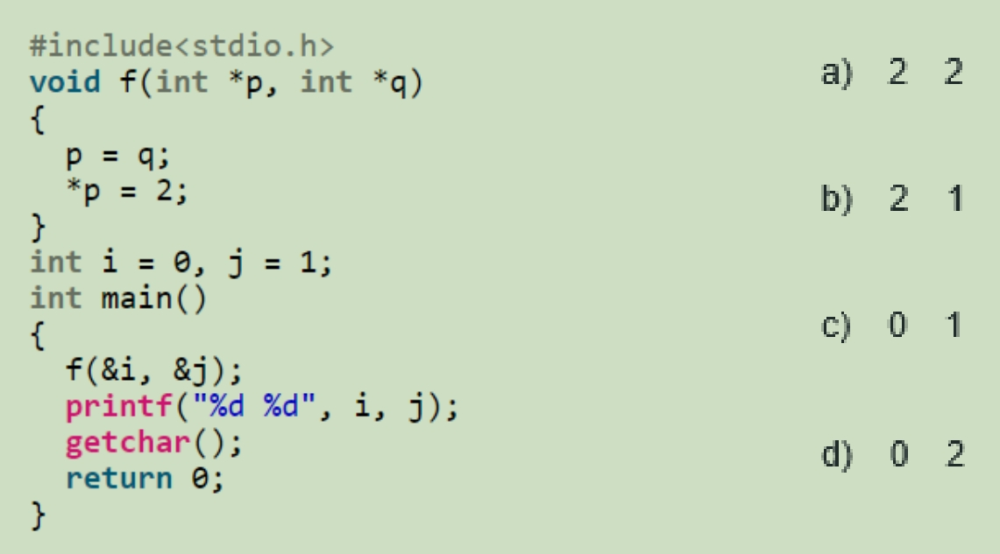
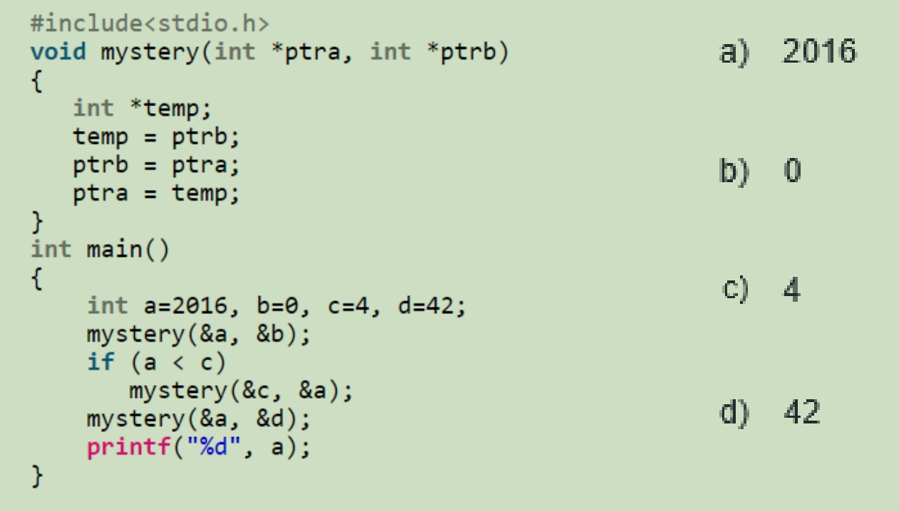
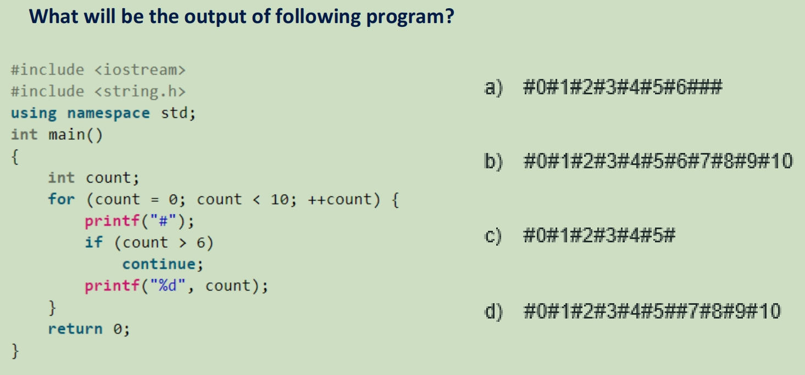
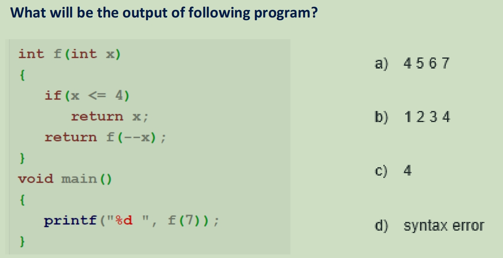

要记得在最后的printf中加"\n"

# Week 1

1. Write a program that reads a number and then print its multiplication table

   Test case 1 :

   Input:
   5 

   Output: 
   0x5 = 0
   1x5 = 5
   2x5 = 10
   3x5 = 15
   4x5 = 20
   5x5 = 25
   6x5 = 30
   7x5 = 35
   8x5 = 40
   9x5 = 45
   10x5 = 50

```c
#include <stdio.h>

int main(){
    int i,j;
    scanf("%d", &j);
    for (i=0; i<=10; i++){
        printf("%dx%d = %d\n", i, j, i*j);
    }
    return 0;
}
```

2. Write a program that reads an input character and displays the tree pattern

   Test case 1 :

   Input:
   \#

   Output:
   ++++#++++
   +++###+++
   ++#####++
   +#######+
   \#########

```c
#include <stdio.h>

int main(){
    char c1;
    scanf("%c", &c1);
    printf("++++%c++++\n", c1);
    printf("+++%c%c%c+++\n",  c1, c1, c1);
    printf("++%c%c%c%c%c++\n", c1, c1, c1, c1, c1);
    printf("+%c%c%c%c%c%c%c+\n", c1, c1, c1, c1, c1, c1, c1);
    printf("%c%c%c%c%c%c%c%c%c\n", c1, c1, c1, c1, c1, c1, c1, c1, c1);
    return 0;
}
```

3. Your program first read an integer indicating the number of grades to be averaged. 

   Next, read the grades one by one, all of which are integers as well. 

   Finally, calculate and print the average of the grades to two decimal places.

   您的进程首先读取一个整数，指示要平均的成绩数。

   接下来，逐个读取成绩，所有这些成绩也是整数。

   最后，计算并打印成绩的平均值到小数点后两位。 保留小数表示方式为 "%.2lf"

   Test case 1 :

   Input:
   3
   5
   10
   2

   Output:
   5.67

```C
#include <stdio.h>

int main() {
    int num_grades, grade, total = 0;
    float average;
    
    scanf("%d", &num_grades);
    
    for (int i = 0; i < num_grades; i++) {
        scanf("%d", &grade);
        total += grade;
    }
    
    average = (float) total / num_grades;
    
    printf("%.2lf\n", average);
    
    return 0;
}
```

# Week 2

Arrays

1. The hostel in which you plan to spend the night tonight offers very interesting rates, as long as you do not arrive too late. Housekeeping finishes preparing rooms by noon, and the sooner guests arrive after noon, the less they have to pay. Write a C program that calculates your price to pay based on your arrival time.

   您今晚计划过夜的旅馆提供非常有趣的价格，只要您不要太晚到达。客房服务在中午之前完成房间的准备工作，客人在中午之后越早到达，他们需要支付的费用就越少。编写一个 C 进程，根据您的到达时间计算要支付的价格。

   Your program will read an integer indicating the number of hours past noon of your arrival. For example, 0 indicates a noon arrival, 1 a 1pm arrival.

   您的进程将读取一个整数，指示您到达中午后的小时数。例如，0 表示中午到达，1 表示下午 1 点到达。

   The base price is 10 yuan, and 5 yuan are added for every hour after noon. Thankfully the total is capped at 53 yuan, so you'll never have to pay more than that.  Your program should print the price (an integer) you have to pay, given the input arrival time.

   基本价格为10元，中午后每小时加收5元。值得庆幸的是，总额上限为 53 元，因此您永远不必支付更多费用。 您的进程应打印您必须支付的价格（整数），给定输入到达时间。

   Test case 1 :
   Input:
   7
   Output:
   45

   Test case 2 :
   Input:
   10
   Output:
   53

```c
#include <stdio.h>
int main() {
    int delayTime;
    int sum = 0;
    int i;
    
    scanf("%d", &delayTime);
    // 循环住宿时间
    for (i=0; i<=delayTime; i++) {
        // 如果不延长就是直接付10
        if (i == 0) {
            sum = 10;
        } else {
            int temp = sum + 5;
            // 如果总价超过了53则将sum直接修改为53并结束循环
            if (temp > 53) {
                sum = 53;
                break;
            } else {
                sum = temp;
            }
        }

    }
    printf("%d\n", sum);
    
    return 0;
}
```

2. 数组练习

   our grandparents gave you a fantastic cookie recipe. There are 10 ingredients in the recipe and the quantities needed for each of them are given as input (in grams).

   Your program must read 10 integers (the quantities needed for each of the ingredients, in order) and store them in an array.  It should then read an integer which represents an ingredient's number (between 1 and 10), and output the corresponding quantity.

   创建一个长度为10的数组，里面存放内容为10种原料的重量，输入索引值返回对应列表中的数字

   Test case 1 :
   Input:
   200 180 650 15 600 36 420 1 370 2
   5
   Output:
   600

```c
#include <stdio.h>
int main() {
    int array[10];
    int i;
    int target;
    for (i=0; i<10; i++) {
        scanf("%d", &array[i]);
    }
    scanf("%d", &target);
    printf("%d\n", array[target - 1]);
    return 0;
}
```

3. Prior to the match the names and weights of the players are presented, alternating by team (team 1 player 1, team 2 player 1, team 1 player 2, and so on). There is the same number of players on each side. You record the player weights and calculate a total weight to inform your bet.

   在比赛之前，球员的姓名和体重被呈现出来，按球队交替出现（球队 1 球员 1、球队 2 球员 1、球队 1 球员 2 等）。每边都有相同数量的玩家。您记录玩家的重量并计算总重量以告知您的投注。

   Your program should first read an integer indicating the number of members per team. Then, the program should read the player weights alternating by team. 

   程序应首先读取一个整数，表示每个团队的成员数。然后，进程应按团队读取球员的重量。

   The program should then display which team has an advantage, that is, the team that has a greater total weight. Then, display the total weight for each team, as shown in Test case 1.

   然后，进程应显示哪个团队具有优势，即总权重更大的团队。然后，显示每个团队的总权重，如测试用例 1 中所示。

   **Test case 1** :
   Input:
   4
   110
   106
   113
   102
   112
   121
   117
   111
   Output:
   Team 1 has an advantage
   Total weight for team 1: 452
   Total weight for team 2: 440

```c
#include <stdio.h>
int main() {
    int members;
    int i;
    int team1 = 0;
    int team2 = 0;
    int weight1;
    int weight2;
    
    scanf("%d", &members);
    for (i=0; i<members; i++) {
        scanf("%d", &weight1);
        team1 = team1 + weight1;
        scanf("%d", &weight2);
        team2 = team2 + weight2;
    }
    if (team1 > team2){
        printf("Team 1 has an advantage\n");
    } else {
        printf("Team 2 has an advantage\n");
    }
    printf("Total weight for team 1: %d\n", team1);
    printf("Total weight for team 2: %d\n", team2);
    
    return 0;
}
```

4. You are responsible for a train of goods consisting of several boxcars.  You realize that some boxcars are overloaded and weigh too heavily on the rails while others are dangerously light.  So you decide to spread the weight more evenly so that all the boxcars have exactly the same weight without changing the total weight. You write a program which helps you in the distribution of the weight.

   您负责由几节棚车组成的一列货物。 您意识到有些棚车超载并且在铁轨上重量过重，而另一些则非常轻。 因此，您决定更均匀地分配重量，以便所有棚车的重量完全相同，而不会改变总重量。你编写一个进程来帮助你分配权重。

   Your program should first read the number of cars to be weighed (integer) followed by the weights of the cars (doubles).  Then your program should calculate and display how much weight to add or subtract from each car such that every car has the same weight.  The total weight of all of the cars should not change.  These additions and subtractions of weights should be displayed with one decimal place.

   您的程序应首先读取要称重的汽车数量（整数），然后是汽车的重量（双倍）。 然后，您的程序应该计算并显示从每辆车上增加或减去多少重量，以便每辆车具有相同的重量。 所有汽车的总重量不应改变。 这些权重的加减应以小数点后一位显示。

   You may assume that there are no more than 20 boxcars.

   Test case 1 :
   Input:
   5
   40.0
   12.0
   20.0
   5.0
   33.0
   Output:
   -18.0
   10.0
   2.0
   17.0
   -11.0

```c
#include <stdio.h>

int main() {
    
    int cars;
    int i, j, k;
    double sum = 0.0;
    scanf("%d", &cars);
    double array1[cars];
    double array2[cars];
    
    for (i=0; i<cars; i++) {
        // "%lf代表的是小数"
        scanf("%lf", &array1[i]);
        sum = sum + array1[i];
    }
    
    double average = sum / cars;
    
    for (j=0; j<cars; j++) {
        array2[j] = average - array1[j];
    }
    
    for (k=0; k<cars; k++){
        printf("%.1lf\n", array2[k]);
    }
    return 0;
}
```

# Week 3

While，Char，Function， Recursion

1. You want to calculate the total sum of expenses last year. 
   You are given a sequence of positive integers that ends with -1. 
   You have to display the sum.

   您要计算去年的费用总额。
   您将获得一个以 -1 结尾的正整数序列。
   您必须显示总和。

   Test case 1 :
   Input:
   2500 1000 1500 -1
   Output:
   5000

   Test case 2 :
   Input:
   -1
   Output:
   0

```C
#include <stdio.h>

int main() {
    
    int sum = 0;
    int temp = 0;
    while (temp != -1) {
        sum = sum + temp;
        scanf("%d", &temp);
        
    }
    printf("%d\n", sum);
    
    return 0;
}
```

2. "%s"代表是字符串，"%c"代表的是字符

   Write a program to read pairs of first and last names and display them in the order of last name followed by first name
   Assume that each first and last name has at most 10 characters and does not contain any spaces

   Your program should first read the total number of names (an integer)
   Next, your program should read a first name and last name and then display these names is one line, the last name followed by one space, followed by the first name

   编写一个进程来读取成对的名字和姓氏，并按姓氏后跟名字的顺序显示它们
   假设每个名字和姓氏最多有 10 个字符，并且不包含任何空格

   进程应首先读取名称总数（整数）
   接下来，你的进程应该读取名字和姓氏，然后显示这些名字是一行，姓氏后跟一个空格，后跟名字

   Test case 1 :

   Input:
   4
   Alan Turing
   Ada Lovelace
   Donald Knuth

   Claude Shannon

   Output:
   Turing Alan
   Lovelace Ada
   Knuth Donald
   Shannon Claude

```C
#include <stdio.h>
int main() {
    int num,i,n;
    char first_name[20];
    char last_name[20];
    scanf("%d",&num);
    for(i=0;i<num;i++){
        scanf("%s",first_name);
        scanf("%s",last_name);
        printf("%s %s\n",last_name,first_name);
    }
    return 0;
}
```

3. Complete the skeleton code that converts metric to imperial system measurements.
   Measurements are provided to your program in meters, grams or degrees Celsius and must be converted to feet, pounds and degrees Fahrenheit, respectively, where:

   完成将公制测量值转换为英制测量值的框架代码。
   测量值以米、克或摄氏度为单位提供给您的程序，并且必须分别转换为英尺、磅和华氏度，其中：

   - 1 meter = 3.2808 feet;
   - 1 gram = 0.002205 pounds;
   - temperature in degrees Fahrenheit = 32 + 1.8 × temperature in degrees Celsius.

   On the first input line you are given the number of conversions to be made.
   Each of the following lines contains a value to be converted as well as its unit: **m**, **g** or **c** (for meters, grams or degrees Celsius).

   在第一行输入中，您将获得要进行的转换次数。
   以下每行都包含要转换的值及其单位：**m**、**g** 或 **c**（米、克或摄氏度）。

   There will be a space between the number and the unit.
   Display the converted values with *2 decimal places*, followed by a space and their unit: **ft**, **lbs** or **f** (for feet, pounds or degrees Fahrenheit).

   数字和单位之间会有一个空格。
   用 *2 位小数*显示转换后的值，后跟一个空格及其单位：**ft**、**lbs** 或 **f**（表示英尺、磅或华氏度）。

   Test case 1 :

   Input:
   3
   36.4 c
   25 m
   987.321 g
   Output:
   97.52 f
   82.02 ft
   2.18 lbs

```C
#include <stdio.h>

// 要先在最开始定义方法的的名字，然后再在下面对方法进行实现
double meterToFeet(double);
double gramToPound(double);
double celsiusToFahrenheit(double);

int main() {
    int i;
    double num = 0.0;
    char unit;
    int counter;
    scanf("%d", &counter);
    for (i=0; i<counter; i++) {
        scanf("%lf %c", &num, &unit);
        if (unit == 'g') {
            printf("%.2lf lbs\n", gramToPound(num));
        } else if(unit == 'm'){
            printf("%.2lf ft\n", meterToFeet(num));
        } else {
            printf("%.2lf f\n", celsiusToFahrenheit(num));
        }
    }
    return 0;
}

double meterToFeet(double meter) {
    return 3.2808*meter;
}

double gramToPound(double gram) {
    return 0.002205*gram; 
}

double celsiusToFahrenheit(double celsius) {
    return 32 + 1.8 * celsius;
}

```

4. Fibonacci numbers are defined recursively as: 斐波那契数列递归实现

   - fibo(n) = 1,                     when n=0 or n=1
   - fibo(n) = fibo(n-1) + fibo(n-2)    when n>1

   **Complete the skeleton code** that computes the n-th fibonacci number **recursively**.
   Given an input integer n greater than or equal to 0, display the n-th fibonacci number.

   Do **not** use any loops.

   Test case 1 :
   Input:
   10
   Output:
   89

```C
#include <stdio.h>

// write the prototype below
// complete the function below
int fibo(int n) {
    
    // recursive step
    if (n == 0 || n == 1) {
        return 1;
    } else {
        return fibo(n - 1) + fibo(n - 2);
    }
    
}

// complete the main function to read input, call functions, and display output
int main() {
    int num;
    scanf("%d", &num);
    printf("%d\n", fibo(num));
    return 0;
}
```

# Week 4 Memory, Address, Pointer

如何定义指针变量

• Initializing a pointer to NULL:

​	int * ptr = NULL;

• Initializing a pointer to a variable:

​	int num = 10;

​	int * ptr = &num

• Initializing a pointer to a string: String算是char[]因此不需要加&

​	char * str = "Hello, world!";

• Initializing a pointer to an array: 数组不需要加&

​	int arr[] = {1, 2, 3, 4, 5};

​	int * ptr = arr;

​	or int * ptr  = &arr[0];

• Initializing a pointer to a structure:

​	struct struct_name *pointer_name;

如何使用指针打印数组:

printf("%d\n", *(ptr+2));

// or can be presented like:

printf("%d\n", ptr[2]);

指针的存储方式：

*变量 代表开辟一个内存，里面存储着的是存储着变量值的内存的地址




sizeof是一个操作符（operator）。其作用是返回一个对象或类型所占的内存字节数。

1） sizeof (object);     //sizeof (对象) (e.g., sizeof(int) == 4)

2） sizeof object;      //sizeof 对象

3） sizeof (type_name);     //sizeof (类型)

1. Given a list of the number of variables and their types, write a program to determine how much total memory space is needed to store them.

   给定变量数量及其类型的列表，编写一个进程来确定存储它们所需的总内存空间。

   Your program should first read an integer number indicating how many variables in the list.
   Next, for each successive variable, your program should read in the number of variables followed by a space and then the type of the variable ('i' for integer, 'd' for decimal, or 'c' for character).

   进程应首先读取一个整数，指示列表中有多少个变量。
   接下来，对于每个连续的变量，进程应该读取变量的数量，后跟一个空格，然后是变量的类型（“i”表示整数，“d”表示十进制，“c”表示字符）。

   Your program should display the total amount of space required to store all of the variables in bytes.
   However, if the user enters an incorrect type for any number of variables,
   the program should print 'invalid type' and exit.

   进程应显示存储所有变量所需的总空间量（以字节为单位）。
   但是，如果用户为任意数量的变量输入了不正确的类型，
   进程应打印“invalid type”并退出。

   Use the sizeof function.

   Test case 1 :
   Input:
   3
   15 i
   8 c
   10 d
   Output:
   148 bytes

   Test case 2 :
   Input:
   2
   75 x
   2 c
   Output:
   invalid type

```C
#include <stdio.h>

int main() {
    
    int count = 0;
    scanf("%d", &count);
    int num;
    int length = 0;
    char c;
    
    for (int j=0;j<count;j++) {
        scanf("%d %c", &num, &c);
        if (c == 'i') {
            length = length + num * 4;
        } else if (c == 'c') {
            length = length + num;
        } else if (c == 'd') {
            length = length + num * 8;
        } else {
            printf("invalid type\n");
            return 0;
        }
    }
    
    printf("%d bytes\n", length);
    
    return 0;
}
```

2. 指针训练

   定义指针的方式

   定义一个变量，例如：int age；

   定义一个指针指向该变量: int * ageptr = & age; （如果要将一个变量赋给一个指针，需要加上&， 如果传递的是数组或者字符串则不需要加&）

   print("%p", ageptr); 打印的是指针指向的内存地址

   print("%d", * ageptr); 打印的是指针指向的内存地址中存放的值

   Complete the skeleton code using **pointer** and **dereference** operator.
   Add ***a line of code*** after comment **// ... ... ... :**

   It simply reads an age, which an integer,
   and then simply display what was the age 5 years ago.

   Test case 1 :
   Input:
   25
   Output:
   You are now 25 years old
   Five years ago, you are 20 years olds.

```C
#include <stdio.h>

int main() {
    int age;

    // declare an integer pointer named ageptr :
    scanf("%d", &age);

    // store the address of age in ageptr :
    int *ageptr = &age;

    printf("You are now %d years old\n", *ageptr);

    // using only ageptr, lower the age by 5 years :
    *ageptr = *ageptr - 5;
    
    printf("Five years ago, you are %d years old\n", *ageptr);

    return 0;
}
```

3. 计算类型大小

   Write a program that displays how much **total memory** a set of variables of a certain type will use, using MB, KB and B, if necessary (see test cases)

   编写一个进程，显示一组特定类型的变量将使用多少**总内存**，如有必要，使用 MB、KB 和 B（请参阅测试用例）

   Your program should read a character that identifies the data type ('i' for int, 's' for short, 'c' for char, 'd' for double; where short, like int, also stores whole number)

   你的进程应该读取一个标识数据类型的字符（'i'表示int，'s'表示简称's'，'c'表示char，'d'表示double;其中short（如int）也存储整数）

   Next it should read an integer that indicates how many variables of the given type you wish to store

   接下来，它应该读取一个整数，该整数指示要存储多少个给定类型的变量

   Your program should then calculate the amount of memory required to store the given variables

   然后，进程应计算存储给定变量所需的内存量

   Finally, output the amount of space required by your variables to the screen, potentially with MB, KB and B, shown in the test cases,

   最后，将变量所需的空间量输出到屏幕，可能带有 MB、KB 和 B，如测试用例所示，

   where 1 MB = 1000000B, and 1 KB = 1000B

   You **must** use sizeof() function

   Test case 1 :
   Input:
   d 876543
   Output:
   7 MB and 12 KB and 344 B

```C
#include <stdio.h>

int main() {
    char unit;
    int mb;
    int kb;
    int b;
    int total, num = 0;
    
    scanf("%c %d", &unit, &num);
    if(unit=='i'){
        total = num * sizeof(int);
    }
    else if(unit=='s'){
        total = num * sizeof(short);
    }
    else if(unit=='c'){
        total = num * sizeof(char);
    }
    else {
        total = num * sizeof(double);
    }
    
    // 判断最大的单位
    // % 是求余数
    // 如果是两个int相除且结果最后需要接受一个int类型的数字，但是最后的答案不是整数，那么只会保留答案的整数部分也就是向下取整
    if (total >= 1000000) {
        mb = total / 1000000;
        kb = (total % 1000000) / 1000;
        b = (total % 1000000) % 1000;
        printf("%d MB and %d KB and %d B\n", mb, kb, b);
    } else if (total > 1000 & total < 1000000) {
        kb = total / 1000;
        b = total % 1000;
        printf("%d KB and %d B\n", kb, b);
    } else {
        b = total;
        printf("%d B\n", b);
    }
    
    
    return 0;
}
```

# Week 5 struct

struct调用方式

struct名.struct变量名

创建struct数组：struct 名字 变量名[length] （example: struct student arr[10]）

1. Create an **employee** structure and print it.

   Assign values to the components of an instance of struct employee

   \- **name:** John

   **-** **employee id:** 1120 and 

   **- salary:** 76909 using structure and then print the entered values.

   Output:

   Name: John

   ID: 1120

   Salary: 76909.00

```C
#include <stdio.h>
 
/*structure declaration*/
struct employee{
    char Name[30];
    int ID;
    double Salary;
    
};

int main()
{
    /*declare structure variable*/
    struct employee emp = {"John", 1120, 76909.0};
    
   /*print employee details*/
    printf("Name: %s\n", emp.Name);
    printf("ID: %d\n", emp.ID);
    printf("Salary: %.2f\n", emp.Salary);
    
    return 0;
}
```

2. Write a program to store information of students in structure and display it.

   创建struct数组来多组struct

   Print the students records.

   Input = 3

   John 145 78

   Robert 236 100

   Dan 765 89

   

   Output = 

   Displaying Information:

   Name: John

   ID: 145

   Marks: 78

   

   Name: Robert

   ID: 236

   Marks: 100

   

   Name: Dan

   ID: 765

   Marks: 89

```C
#include <stdio.h>
struct student
{
    char name[30];
    int id;
    int marks;

};

int main() {
    int i, j;
    int count;
    scanf("%d", &count);
    struct student arr[count];
    struct student stu;
    for(i=0;i<count;i++) {
        scanf("%s %d %d", stu.name, &stu.id, &stu.marks);
        arr[i] = stu;
    }
    
    printf("\nDisplaying Information:\n");
    for (j=0;j<count;j++) {
        printf("\nName: %s\nID: %d\nMarks: %d\n", arr[j].name, arr[j].id, arr[j].marks);
    }
    
    return 0;
}
```

3. 使用方法来初始化struct.通过指针传递struct也需要加&

   **Complete the skeleton code** to write two function prototypes, main function and two function definitions: readDate and printDate

   The function **readDate** should read 3 integers from the user input — the first integer is the year (a 4-digit number), the second integer is the month, and the third integer is the day of the date being read

   函数 **readDate** 应从用户输入中读取 3 个整数 — 第一个整数是年份（4 位数字），第二个整数是月份，第三个整数是读取日期的日期

   The function should store these three numbers in the appropriate components of the structure being passed into it

   该函数应将这三个数字存储在传递到它的结构的适当组件中

   The function **printDate** should print the date stored in the variable passed into it in the following format: dd/mm/yyyy with a new line afterwards
   the month should be printed with two digits (01, 02, 03, ..., 11, 12), 
   the day should be printed as two digits (01, 02, 03, ..., 30, 31),
   and the year should be printed as a 4-digit number

   Test case 1 :
   Input:
   2020 5 12
   Output:
   12/05/2020

```c
#include <stdio.h>

struct date{
    int day;
    int month;
    int year;
};

void readDate(struct date *);
void printDate(struct date );

int main() {
    struct date today;
    readDate(&today);
    printDate(today);
    
    return 0;
}

void readDate(struct date *todayptr){
    scanf("%d %d %d", &(*todayptr).year, &(*todayptr).month, &(*todayptr).day);
}

void printDate(struct date today) {
    printf("%02d/%02d/%04d\n", today.day, today.month, today.year);
}
```

4. Complete the function **void printStrLen(char input, int  num)** that given **an array of strings** (which are pointers to chars) and an integers num which indicates how many strings  in the array, print the length of each string in a separate line.

   完成函数 **void printStrLen（char input， int num）**，给定一个字符串数组（指向 char 的指针）和一个整数 num（指示数组中有多少个字符串），在单独的行中打印每个字符串的长度。

   Test:

   char * input[3] = {"x", "55", "ab34"};

   printStrLen(input, 3);

   Result:

   1 2 4

   ```c
   void printStrLen(char ** input, int num) {
       for (int i=0; i<num; i++) {
           int str_length = 0;
           while (*(*(input + i) + str_length) != '\0') {
               str_lenght++;
           }
           printf("%d\n", str_length);
       }
   }
   ```




Answer: 0, 2



Answer: 2016



Answer: #0#1#2#3#4#5#6###



Answer: 4


正确的结果应该是: printf("%d", F2->animals);

Answer: Compiler error

# Week 8 Fork

大于0的是父进程，等于0是子进程，通常是先运行父进程

1. Create new process in C program using **fork()** and **pid_t** data type.

   **Output:**

   "Hello from Parent!

   Hello from Child!"

```c
#include <stdio.h>
#include <sys/types.h>
#include <unistd.h>

int main(int argc, char *argv[]){
    
    pid_t pid;
    pid = fork();

    if (pid > 0) {
        printf("Hello from Parent!");
    } else {
        printf("\nHello from Child!\n");
    }
    
    return 0;
}
```

2. Write a C program using **wait()** system call function.

   The parent process executes first, and then it enters the **wait** state.

   When the parent process enters the **wait** state, the child process executes its assigned task. Once the child task is completed, the parent executes the remaining tasks.

   **Output：**

   Hello from child!

   Child work is completed and terminates

   Hello from parent!

   Parent has terminated.

```c
#include <stdio.h>
#include <sys/types.h>
#include <unistd.h>
#include <sys/wait.h>

int main() {
    pid_t pid;
    pid = fork();

    if (pid > 0) {
        // 这里就是先让父进程等待
        wait(NULL);
        printf("Hello from parent!\n");
        printf("Parent has terminated.\n");
    } else if (pid == 0) {
        printf("Hello from child!\n");
        printf("Child work is completed and terminates\n");
    }
    return 0;
}

```

3. 打印十遍CPT104

```c
#include <stdio.h>
#include <stdlib.h>
#include <unistd.h>
#include <sys/wait.h>

int main() {
    int i;
    
    // Loop to create 12 child processes
    for (i = 0; i < 12; i++) {
        pid_t pid = fork();
        
        if (pid > 0) {
            wait(NULL);
            continue;
        } else if (pid == 0) {
            printf("CPT104!\n");
            exit(EXIT_SUCCESS);
        }
    }

    return 0;
}
```

# Week 9&10 Pipe&Thread

Pipe:

```c
#include <unistd.h>
int pipe(int pipedes[2]);
```

**pipedes** takes an **integer descriptor array of size 2**, which performs the read and write  operations. 

**pipedes[1]** **writes** the content into the pipe, and 

**pipedes[0]** **reads** the content from the pipe. 


Thread:

```c
#include<stdio.h> // Standard I/O Routines Library
#include<unistd.h> // Unix Standard Library
#include<pthread.h> // POSIX Thread Creation Library
```

```C
void *ThreadFunction(){
	printf("Thread created by programmer.\n");
	return NULL;
}
```

Thread通过指针方法实现，返回头都是void *, 但是最后如果需要返回值则只能返回指针变量，如果不需要就直接写return NULL；

``` C
#include <sydio.h>
#include <unistd.h>
#include <pthread.h>

void * ThreadFunction(){
	printf("Thread created by programmer. \n");
	return NULL;
}

int main() {
    // 存储线程的变量，也可以是一个array
	pthread_t thread;
	// 根据上面的线程创建方法，创建一个线程并运行,此时会执行上面方法中的printf
	pthread_create(&thread, NULL, ThreadFunction, NULL);
    // 线程运行结束之后退出
	pthread_exit(NULL);
	
	return 0;
}

pthread_cancel(pthread_t thread) // 直接结束一个正在执行的线程
pthread_join() // 这个函数等待另一个线程的终止。它接受两个形参作为实参:第一个形参是要等待的线程，第二个形参是指向指针的指针，该指针本身指向线程的返回值。该函数返回整数类型，如果成功终止则返回0，如果失败则返回-1。
```

1. **Step 1.** Create a pipe using the *pipe()* system call.

   **Step 2**. Write the data into the pipe using a *write()* system call.

   **Step 3**. Once the write operation is done, the *read()* system call reads the data from the pipe.

   **Step 4.** Close the pipe.

```c
#include <stdio.h>
#include <unistd.h>

int main(int argc, char *argv[]) {
    // 声明一个长度为2的管道，其中pipedes[0]用来reads,pipedes[1]用来writes
    int pipedes[2];
    int returnstatus;
    // 文字变量
    char writemessage[20] = {"Operating Systems."};
    char readmessage[20];
    // 记录管道的返回状态，如果为-1则代表管道建立失败
    returnstatus = pipe(pipedes);

    if (returnstatus == -1) {
        printf("Unable to create pipe\n");
        return 1;
    }

    printf("Writing to pipe. The message is %s\n", writemessage);
    // 使用pipedes[1]来进行写操作，要传入的变量，和变量的size
    write(pipedes[1], writemessage, sizeof(writemessage));
    close(pipedes[1]);
    // 通过pipedes[0]来进行读取操作，readmessage是接收管道中的变量，然后是接收的变量的size
    read(pipedes[0], readmessage, sizeof(readmessage));
    printf("Reading from pipe. The message is %s\n", readmessage);
    close(pipedes[0]);
	// 读写操作结束后都要close
    
    return 0;
}
```

2. **Output** 这题主要是介绍pthread_join中添加返回指针

   First thread calculates a + b. The result 1 is: 120               

   Second thread calculates a * b. The result 2 is: 2000              

   Third thread calculates a - b. The result 3 is: 80                                                       

   Let's combine the results like this: result 1 + result 2 - result 3.      

   The final value is: 2040  

```C
#include <stdio.h>
#include <unistd.h>
#include <pthread.h>
#include <stdlib.h>

int a = 20;
int b = 100;

void* first_thread(void* arg){
    
  	int sum;
   	sum = a+b;
    
    
    // store the result in heap memory. 
    //need to allocate a block of memory in heap of a size equal to the size of an integer (4 Bytes). 
    
 	int *pointer1 = (int *)malloc(sizeof(int)); 
 	*pointer1 = sum;
    
	return pointer1;  // the function returns the result
}


void* second_thread(void* arg)
{
	int prod;
	prod = a*b;
    // 创建用于方法返回的指针对象
	int *pointer2 = (int *)malloc(sizeof(int));  // store the result in heap memory. 
	//need to allocate a block of memory in heap of a size equal to the size of an integer (4 Bytes). 
	
	*pointer2 = prod;
	// 返回指针
	return pointer2;  // the function returns the result
	}


void* third_thread(void* arg)
{
	int dif;
	dif = b-a;
	
	int *pointer3 = (int *)malloc(sizeof(int)); //store the result in heap memory. 
	//need to allocate a block of memory in heap of a size equal to the size of an integer (4 Bytes). 
	*pointer3 = dif;
	
	return pointer3;   // the function returns the result

}

int main()
{
    
 	int i;
 	pthread_t tid[i];
 	int *ptr1;
 	int *ptr2;
 	int *ptr3;
     
		// create the threads
		// 创建线程并执行
   	pthread_create(&tid[0], NULL, first_thread,  NULL);
	pthread_create(&tid[1], NULL, second_thread, NULL);
    pthread_create(&tid[2], NULL, third_thread,  NULL);
    
	// If the ending thread terminated with a return, the second parameter contains a pointer to the return value.	
   	// join轮流执行tid中的三个线程，并且每个线程结束之后的返回值存放在一个指针变量中
   	pthread_join(tid[0], (void*)&ptr1);
   	pthread_join(tid[1], (void*)&ptr2);
    pthread_join(tid[2], (void*)&ptr3);
	
	printf("First thread calculates a + b. The result 1 is: %d\n", *ptr1);      //pointer to the address where the result is stored
    printf("Second thread calculates a * b. The result 2 is: %d\n", *ptr2);
    printf("Third thread calculates a - b. The result 3 is: %d\n", *ptr3);


	// the threads outputs are used to get another value. Display the final value.

    printf("\nLet's combine the results like this: result 1 + result 2 - result 3.\nThe 			final value is: %d\n", *ptr1+*ptr2-*ptr3);
	
    return 0;
	
}
```

3. Pthread in C. 线程

   3 threads instances execute the multiplication by 2, 4 and 6 in parallel. 

```C
#include <stdio.h>
#include <unistd.h>
#include <pthread.h>

void* first_thread(void* arg)
{
	int i;
	
	printf("First thread:\n");
	for (i = 1; i <= 10; i++) {
		printf("2 X %d = %d\n", i, i*2);
		sleep(1);
	}
	pthread_exit(NULL);
}

void* second_thread(void* arg)
{
	int i;
	
	printf("\t\t\tSecond thread:\n");
	for (i = 1; i <= 10; i++) {
		printf("\t\t\t4 X %d = %d\n", i, i*4);
		sleep(1);
	}
	
	pthread_exit(NULL);
}

void* third_thread(void* arg)
{
	int i;
	
	printf("\t\t\t\t\t\tThird thread:\n");
	for (i = 1; i <= 10; i++) {
		printf("\t\t\t\t\t\t6 X %d = %d\n", i, i*6);
		sleep(1);
	}
	
	pthread_exit(NULL);
}

int main()
{
	pthread_t tid[3];
	
	
	pthread_create(&tid[0], NULL, first_thread, NULL);
	pthread_create(&tid[1], NULL, second_thread, NULL);
	pthread_create(&tid[2], NULL, third_thread, NULL);
	
	
	pthread_join(tid[0], NULL);
	pthread_join(tid[1], NULL);
	pthread_join(tid[2], NULL);
	
	printf("Finished threads execution!\n");
	return 0;
	
}
```


# Week 11 Scheduling Algorithm

1. Write a C program to simulate the **First-Come First-Served FCFS scheduling algorithm** to find **waiting time** and **turnaround time** for the above problem. Arrival time of all process is same 0.

   Process 1 : burst time = 4

   Process 2: burst time = 18

   Process 3: burst time = 9

   Process 4: burst time = 14

   output:

   Process 1 - the burst time: 4, the waiting time: 0, the turnaround time: 4

   Process 1 - the burst time: 4, the waiting time: 0, the turnaround time: 4

   Process 1 - the burst time: 4, the waiting time: 0, the turnaround time: 4

   Process 1 - the burst time: 4, the waiting time: 0, the turnaround time: 4

   ```java
   #include <stdio.h>
   #include <string.h>
   #include <stdlib.h>
   
   int main()
   {
     // 线程总数
   	int n;  //total number of process
   	int i;
     	// 每个线程的执行时间
       int bt[] = {4, 18, 9, 14}; // burst time
   	
     // 存储每个线程的等待时间
   	int wt[n];  // waiting time of each process
     // 存储每个线程的turnaround时间
   	int tat[n];   // turnaround time of each process
   	
     // 等待时间总和
   	double waiting_total; // sum of waiting times
   	double turn_around_total; //sum of turnaround times
   	
   	double avg_waiting_time;
   	double avg_turn_around_time;
   	
   	waiting_total=0;
   	turn_around_total=0;
   	
   	wt[0]=0;
   	n = 4;
   	
   	for(i=0;i<4;i++)
   	{
   		wt[i+1]=bt[i]+wt[i]; // waiting time
   	}
   	
   	
   	for(i=0;i<4;i++)
   	{
   		tat[i]=wt[i]+bt[i];   // turnaround time
   	}
   	
   
   	for(i=0;i<4;i++)
   	{
   		waiting_total+=wt[i]; // sum of wts
   		turn_around_total+=tat[i];  // sum of tat(s)
   	}
   
   
       avg_waiting_time = waiting_total/n;   // average waiting time
       avg_turn_around_time = turn_around_total/n;    // average tat
   
   	
   	for(i=0;i<4;i++)
   	{
   		printf("Process %d - the burst time: %d, the waiting time: %d, the turnaround time: %d\n",i+1,bt[i],wt[i],tat[i]);
   	}
   	printf("Average waiting time= %.2f\n",avg_waiting_time);    //2 decimals
   	printf("Average turnaround time= %.2f\n",avg_turn_around_time); 
   	return 0;
   }
   ```

2. Write a C program to implement the non-preemptive **Shortest-Job-First SJF scheduling algorithm** and to find turnaround time and waiting time. Arrival time of all process is same 0

   Output

   For SJF scheduling are:

   Process 0 - the burst time: 4

   Process 1 - the burst time: 18

   Process 2 - the burst time: 9

   Process 3 - the burst time: 12

   

   After Scheduling:

   Process 0 - burst time: 4

    the waiting time: 0, the turnaround time: 4

   

   Process 2 - burst time: 9

    the waiting time: 4, the turnaround time: 13

   

   Process 3 - burst time: 12

    the waiting time: 13, the turnaround time: 25

   

   Process 1 - burst time: 18

    the waiting time: 25, the turnaround time: 43

   

   Average waiting time = 10.50

   Average turnaround time = 22.25

```java
#include<stdio.h>

void main() {
    int n; // 进程总数
    int i, k;
    int bt[] = {4, 18, 9, 12}; // 各进程的突发时间
    int sum;
    int p[n];
    int wt[n]; // 各进程的等待时间
    int tt[n]; // 各进程的周转时间
    double waiting_total; // 总等待时间
    double turn_around_total; // 总周转时间
    double avg_waiting_time;
    double avg_turn_around_time;

    n = 4;
    wt[0] = 0;
    tt[0] = 0;

    printf("For SJF scheduling are:\n");

    // 打印初始的突发时间
    for(i = 0; i < 4; i++) {
        printf("Process %d - the burst time: %d\n", i, bt[i]);
    }

    // 初始化进程数组
    for(i = 0; i < n; i++) {
        p[i] = i;
    }

    // 按突发时间对进程排序
    for(i = 0; i < 4; i++) {
        for(k = i + 1; k < 4; k++) {
            if(bt[i] > bt[k]) {
                // 交换突发时间
                int temp = bt[i];
                bt[i] = bt[k];
                bt[k] = temp;
                
                // 交换进程标识
                temp = p[i];
                p[i] = p[k];
                p[k] = temp;
            }
        }
    }

    // 计算等待时间和周转时间
    for(i = 0; i < 4; i++) {
        wt[i + 1] = wt[i] + bt[i]; // 计算等待时间
        tt[i] = wt[i] + bt[i]; // 计算周转时间
    }

    // 打印调度后的突发时间、等待时间和周转时间
    printf("\nAfter scheduling...\n");
    for(i = 0; i < 4; i++) {
        printf("\nProcess %d - burst time: %d\n", p[i], bt[i]);
        printf(" the waiting time: %d, the turnaround time: %d\n", wt[i], tt[i]);
    }

    // 计算总等待时间和总周转时间
    waiting_total = 0;
    turn_around_total = bt[0];
    for(i = 0; i < 4; i++) {
        waiting_total += wt[i];
        turn_around_total += tt[i];
    }

    // 计算平均等待时间和平均周转时间
    avg_waiting_time = waiting_total / n;
    avg_turn_around_time = turn_around_total / n;

    // 打印平均等待时间和平均周转时间
    printf("\nAverage waiting time = %.2f\n", avg_waiting_time);
    printf("Average turnaround time = %.2f\n", avg_turn_around_time);
}

```

3. For priority scheduling algorithm, read the number of processes in the system, their CPU burst times, and the priorities. Arrival time of all process is same 0.

   Arrange all the processes in order with respect to their priorities. There may be two processes in queue with the same priority, and then FCFS approach is to be performed. Each process will be executed according to its priority. 

   Calculate and display *the waiting time* and *the turnaround time* of each of the processes accordingly.

   Calculate and display *the average waiting time* and *the average turnaround time* of the system.

   对于优先级调度算法，读取系统中的进程数、CPU突发时间和优先级。所有流程到达时间均为0。

   按照优先顺序安排所有流程。队列中可能有两个具有相同优先级的进程，这时需要执行FCFS方法。每个进程将根据其优先级执行。

   计算并显示每个工序的等待时间和周转时间。

   计算并显示系统的平均等待时间和平均周转时间。

   | Process | BurstTime | Priority |
   | ------- | --------- | -------- |
   | P0      | 4         | 1        |
   | P1      | 3         | 3        |
   | P2      | 2         | 4        |
   | P3      | 5         | 2        |

   ```java
   #include<stdio.h>
   
   int main() {
       int n; // 进程总数
       n = 4;
       int i, j;
       int temp;
       int process[n]; // 进程数组
       int burst_time[20] = {4, 3, 2, 5}; // 各进程的突发时间
       int priority[20] = {1, 3, 4, 2}; // 各进程的优先级
       int waiting_time[20]; // 各进程的等待时间
       int turnaround_time[20]; // 各进程的周转时间
       double average_wait_time;
       double average_turnaround_time;
       double waiting_total = 0; // 总等待时间
       double turn_around_total = 0; // 总周转时间
   
       // 初始化进程数组
       for(i = 0; i < n; i++) {
           process[i] = i;
       }
   
       // 根据优先级排序
       for(i = 0; i < n; i++) {
           for(j = i + 1; j < n; j++) {
               if(priority[i] > priority[j]) {
                   // 交换进程标识
                   temp = process[i];
                   process[i] = process[j];
                   process[j] = temp;
   
                   // 交换优先级
                   temp = priority[i];
                   priority[i] = priority[j];
                   priority[j] = temp;
   
                   // 交换突发时间
                   temp = burst_time[i];
                   burst_time[i] = burst_time[j];
                   burst_time[j] = temp;
               }
           }
       }
   
       // 初始化等待时间和周转时间
       waiting_time[0] = 0;
       turnaround_time[0] = burst_time[0];
       average_wait_time = 0;
       average_turnaround_time = burst_time[0];
   
       // 计算等待时间和周转时间
       for(i = 0; i < n; i++) {
           if (i > 0) {
               waiting_time[i] = waiting_time[i - 1] + burst_time[i - 1]; // 计算等待时间
           }
           turnaround_time[i] = waiting_time[i] + burst_time[i]; // 计算周转时间
           waiting_total += waiting_time[i];
           turn_around_total += turnaround_time[i];
       }
   
       // 计算平均等待时间和平均周转时间
       average_wait_time = waiting_total / n;
       average_turnaround_time = turn_around_total / n;
   
       // 打印调度结果
       printf("\nAfter scheduling...\n");
       for(i = 0; i < n; i++) {
           printf("\nProcess %d - priority: %d, burst time: %d\n", process[i], priority[i], burst_time[i]);
           printf(" the waiting time: %d, the turnaround time: %d\n", waiting_time[i], turnaround_time[i]);
       }
   
       // 打印平均等待时间和平均周转时间
       printf("\nAverage Waiting Time:\t%.2lf", average_wait_time);
       printf("\nAverage Turnaround Time:\t%.2lf\n", average_turnaround_time);
   
       return 0;
   }
   
   ```

# Week 12 Memory Allocation Algorithm

1. The **First Fit Memory Allocation Algorithm** allocates the smallest free partition available in the memory that is sufficient enough to hold the process within the system.

   Write a C program of implementation the First-Fit Memory Allocation algorithm.

   

   **input:**

   Enter the number of blocks:

    4

   Enter block size:

   123

   56

   14

   9

   Enter the number of processes:

    4

   Enter size of each process:

   122

   78

   34

   15

   **output:**

   Block no.	B-size		Process no.		P-size

   1		     123	          	1			122

   2		      56		          3			  34

   3		      14		       Not allocated

   4		       9		        Not allocated

   ```java
   #include <stdio.h>
   
   int main() {
       // 声明和初始化变量
       int blocksize[10]; // 存储内存块大小
       int process_size[10]; // 存储进程大小
       int block_no; // 内存块数量
       int process_no; // 进程数量
       int flags[10]; // 标记内存块是否被分配
       int allocate[10]; // 存储每个内存块分配的进程号
       int i, j;
   
       // 初始化标志和分配数组
       for(i = 0; i < 10; i++) {
           flags[i] = 0;
           allocate[i] = -1;
       }
   
       // 输入内存块数量和大小
       printf("Enter the number of blocks:\n");
       scanf("%d", &block_no);
   
       printf("Enter block size:\n");
       for(i = 0; i < block_no; i++) {
           scanf("%d", &blocksize[i]);
       }
   
       // 输入进程数量和大小
       printf("Enter the number of processes:\n");
       scanf("%d", &process_no);
   
       printf("Enter size of each process:\n");
       for(i = 0; i < process_no; i++) {
           scanf("%d", &process_size[i]);
       }
   
       // 首次适应算法分配内存
       for(i = 0; i < process_no; i++) {
           for(j = 0; j < block_no; j++) {
               if(flags[j] == 0 && blocksize[j] >= process_size[i]) {
                   allocate[j] = i; // 记录分配的进程号
                   flags[j] = 1; // 标记内存块已分配
                   break;
               }
           }
       }
   
       // 打印内存分配结果
       printf("Block no.\tB-size\t\tProcess no.\t\tP-size\n");
       for(i = 0; i < block_no; i++) {
           printf("%d\t\t%d\t\t", i + 1, blocksize[i]);
           if(flags[i] == 1) {
               printf("%d\t\t\t%d\n", allocate[i] + 1, process_size[allocate[i]]);
           } else {
               printf("Not allocated\n");
           }
       }
   
       return 0;
   }
   ```

2. The **Best-Fit Memory Allocation Algorithm** allocates the smallest free partition available in the memory that is sufficient enough to hold the process within the system with minimum wastage of memory.

   Write a C program of implementation the Best-Fit Memory Allocation algorithm.

   

   **Input** 

   5

   10

   15

   5

   9

   3

   4

   1

   4

   7

   12

   

   **Output** 

   Enter the number of blocks:

   Enter the size of the blocks:

   Block no.1:

   Block no.2:

   Block no.3:

   Block no.4:

   Block no.5:

   Enter the number of processes:

   Enter the size of the processes:

   Process no.1:

   Process no.2:

   Process no.3:

   Process no.4:

   

   Process no.	P-size	Block no.	B-size		Fragment

   1		      1		         5		      3		      2

   2		     4		          3		      5		      1

   3		     7		          4		      9		      2

   4		      12		       2		      15		    3

   ```java
   #include <stdio.h>
   
   // 内存管理方案 - 最佳适应算法
   
   int main() {
       // 声明和初始化变量
       int fragment[20]; // 存储碎片大小
       int b[20]; // 存储块大小
       int p[20]; // 存储进程大小
       int i, j, tem, low = 9999;
       int n_b; // 块的数量
       int n_p; // 进程的数量
       static int barray[20], parray[20]; // 标记块和进程是否被分配
   
       // 输入块的数量
       printf("Enter the number of blocks:\n");
       scanf("%d", &n_b);
   
       // 输入块的大小
       printf("Enter the size of the blocks:\n");
       for(i = 0; i < n_b; i++) {
           printf("Block no.%d:\n", i);
           scanf("%d", &b[i]);
       }
   
       // 输入进程的数量
       printf("Enter the number of processes:\n");
       scanf("%d", &n_p);
   
       // 输入进程的大小
       printf("Enter the size of the processes:\n");
       for(i = 0; i < n_p; i++) {
           printf("Process no.%d:\n", i);
           scanf("%d", &p[i]);
       }
   
       // 最佳适应算法分配内存
       for(i = 0; i < n_p; i++) {
           for(j = 0; j < n_b; j++) {
               if(barray[j] != 1) { // 块未被分配
                   tem = b[j] - p[i];
                   if(tem >= 0 && low > tem) {
                       parray[i] = j;
                       low = tem;
                   }
               }
           }
           fragment[i] = low; 
           barray[parray[i]] = 1;  
           low = 9999; // 重置low变量，用于下一个进程的分配
       }
   
       // 显示结果
       printf("\nProcess no.\tP-size\t\tBlock no.\tB-size\t\tFragment");
       for(i = 0; i < n_p && parray[i] != 0; i++) {
           printf("\n%d\t\t%d\t\t%d\t\t%d\t\t%d", i, p[i], parray[i], b[parray[i]], fragment[i]);
       }
   
       return 0;
   }
   ```

   The **Worst-Fit Memory Allocation Algorithm** allocates the smallest free partition available in the memory that is sufficient enough to hold the process within the system with minimum wastage of memory.

   Write a C program of implementation the Worst-Fit Memory Allocation algorithm.

   

   **Input**

   Enter the number of blocks:

   5

   Enter the size of the blocks:

   Block no.1:

   10

   Block no.2:

   15

   Block no.3:

   5

   Block no.4:

   9

   Block no.5:

   3

   Enter the number of processes:

   4

   Enter the size of the processes:

   Process no.1:

   1

   Process no.2:

   4

   Process no.3:

   7

   Process no.4:

   12

   

   **Output**

   Process no.	P-size		Block no.	B-size		Fragment

   1		      1		       2		       15		        14

   2		       4		       1		       10		         6

   3		       7		       4		        9		          2

   4		      12		       0		        0		         0

   ```java
   #include <stdio.h>
   
   // 内存管理方案 - 最差适应算法
   
   int main() {
       // 声明和初始化变量
       int fragment[20]; // 存储碎片大小
       int b[20]; // 存储块大小
       int p[20]; // 存储进程大小
       int i, j, tem, high = 0;
       int n_b; // 块的数量
       int n_p; // 进程的数量
       static int barray[20], parray[20]; // 标记块和进程是否被分配
   
       // 输入块的数量
       printf("Enter the number of blocks:\n");
       scanf("%d", &n_b);
   
       // 输入块的大小
       printf("Enter the size of the blocks:\n");
       for(i = 0; i < n_b; i++) {
           printf("Block no.%d:\n", i);
           scanf("%d", &b[i]);
       }
   
       // 输入进程的数量
       printf("Enter the number of processes:\n");
       scanf("%d", &n_p);
   
       // 输入进程的大小
       printf("Enter the size of the processes:\n");
       for(i = 0; i < n_p; i++) {
           printf("Process no.%d:\n", i);
           scanf("%d", &p[i]);
       }
   
       // 最差适应算法分配内存
       for(i = 0; i < n_p; i++) {
           for(j = 0; j < n_b; j++) {
               if(barray[j] != 1) { // 块未被分配
                   tem = b[j] - p[i]; // 计算块剩余大小
                   if(tem >= 0 && high < tem) {
                       parray[i] = j;
                       high = tem;
                   }
               }
           }
           fragment[i] = high; 
           barray[parray[i]] = 1;  
           high = 0; // 重置 high 变量，用于下一个进程的分配
       }
   
       // 显示结果
       printf("\nProcess no.\tP-size\t\tBlock no.\tB-size\t\tFragment");
       for(i = 0; i < n_p; i++) {
           printf("\n%d\t\t%d\t\t%d\t\t%d\t\t%d", i, p[i], parray[i], b[parray[i]], fragment[i]);
       }
   
       return 0;
   }
   
   ```

   
