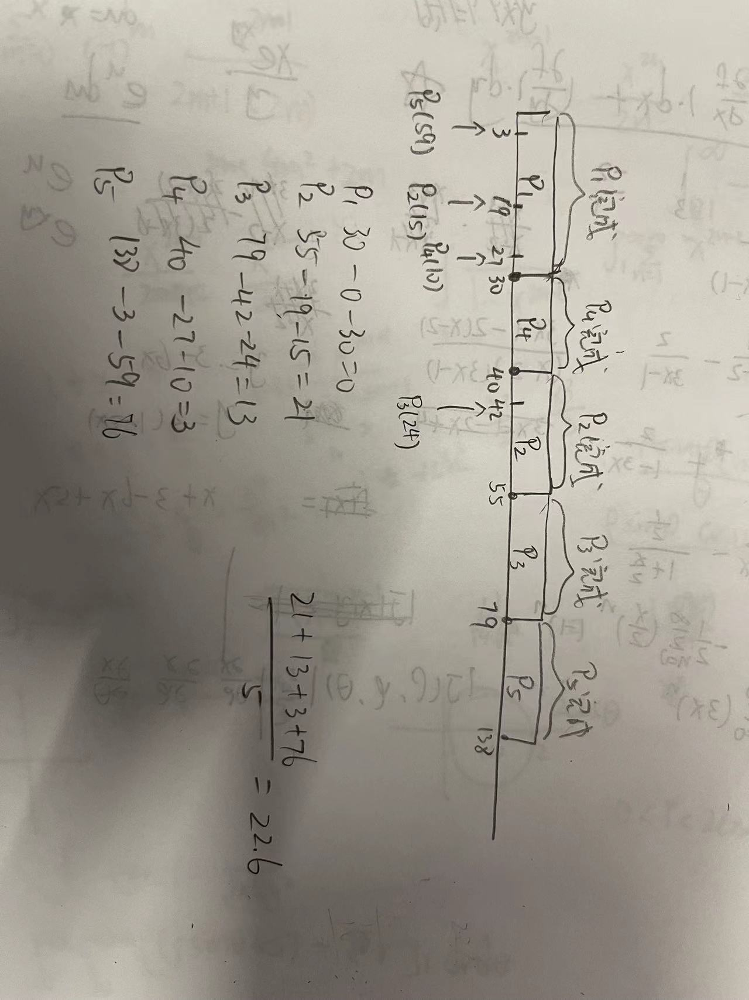
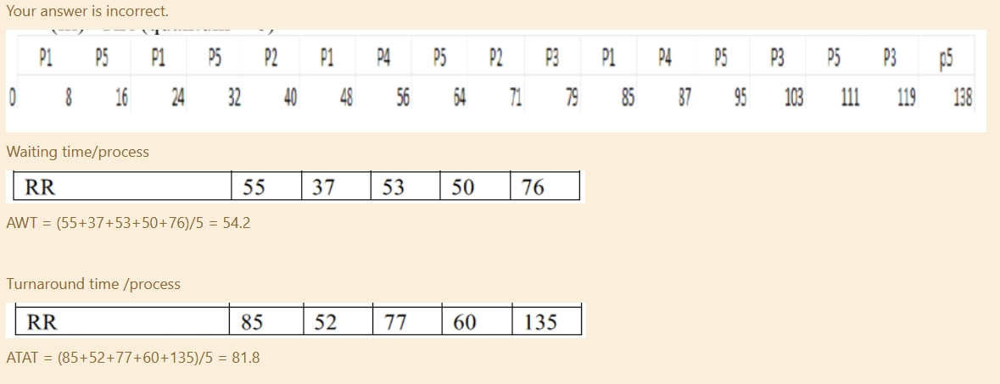

# 1. Process

1. Essential element from a process is?  进程的基本要素是？

   Process ID

2. Operating system's fundamental responsibility is to control the? 操作系统的根本职责是控制？

   Execution of Processes. 流程的执行

3. What is the ready state of a process? 流程的就绪状态是什幺？

   when process is scheduled to run after some execution. 当进程计划在执行某些操作后运行时

4. A process can be terminated due to __________? 进程可以因__________而终止

   normal exit 正常退出

   fatal error 报错

   killed by another process. 被其他进程终止

5. What is a Process Control Block? 什幺是PCB？

   Data Structure

6. In indirect communication between processes P and Q __________? 在进程 P 和 Q 之间的间接通信中 __________？

   there is a mailbox to help communication between P and Q. 有一个邮箱可以帮助 P 和 Q 之间的通信

7. What will happen when a process terminates? 当进程终止时会发生什幺？

   It is removed from all queues. 它从所有队列中被删除

8. If process is running currently executing, it is in running? 如果进程正在运行，当前正在执行，它正在运行的什么状态？

   State

9. The state of a process is defined by __________? 进程的状态由 __________决定？

   the current activity of the process. 进程的当前活动

10. Messages sent by a process __________? 进程__________发送的消息？

    can be fixed or variable sized 可以是固定的，也可以是可变的

11. Message passing system allows processes to __________?  消息传递系统允许进程__________？

    communicate with one another without resorting to shared data.  在不求助于共享数据的情况下相互通信。

12. A Process Control Block(PCB) does not contain which of the following? 过程控制块（PCB）不包含以下哪一项？

    a. Stack

    **b. Bootstarp program**

    c. Data

    d. Code

13. Information in proceeding list is stored in a data structure called?  进行列表中的信息存储在一个名为 ？

    Process Control Block   过程控制块

14. When a program is loaded into memory it is called as?  当一个进程被加载到内存中时，它被称为？

    Process

15. What is a short-term scheduler?  什幺是短期调度进程？

    It selects which process has to be executed next and allocates CPU.   它选择接下来必须执行的进程并分配 CPU

# 2. Thread

1. A process having multiple threads of control implies ____**A**_______ Select one:

   具有多个控制线程的进程意味着____A___选择一个：

   a. it can do more than one task at a time  它可以一次执行多个任务

   b. it can do only one task at a time, but much faster 它一次只能完成一项任务，但速度要快得多

   c. it has to use only one thread per process 每个进程只需使用一个线程

   d. none of the mentioned

2. If the kernel is single threaded, then any user level thread performing a blocking system call will:

   Select one: **A**

   如果内核是单线程的，则执行阻塞系统调用的任何用户级线程都将：

   a. cause the entire process to block even if the other threads are available to run

   导致整个进程阻塞，即使其他线程可以运行也是如此

   b. cause the entire process to run along with the other threads

   使整个进程与其他线程一起运行

   c. cause the thread to block with the other threads running

   导致线程阻塞，而其他线程正在运行

   d. none of these

3. Resource sharing helps:  **D**

   a. an application have several different threads of activity all within the same address space

   应用程序在同一地址空间中具有多个不同的活动线程

   b. share the memory and resources of the process to which the threads belong.

   共享线程所属进程的内存和资源。

   c. reduce the address space that a process could potentially use

   减少进程可能使用的地址空间

   d. all of these

4. _____**Process**___ is an entity corresponding to a user job or application that owns resources such as memory and open files.

   ______**Process**___是与拥有内存和打开文件等资源的用户作业或应用程序相对应的实体。

5. A thread is also called **Light Weight Process(LWS)** 

6. When a web page is loading, and the user presses a button on the browser to stop loading the page : **B**

   当网页正在加载时，用户按下浏览器上的按钮停止加载页面

   a. the thread loading the page is paused

   b. the thread loading the page is cancelled 当前加载线程直接取消

   c. the thread loading the page does not stop, but continues with another task

   d. the thread loading the page continues with the loading

7. Which of the following is FALSE? **A**

   a. Blocking one kernel level thread blocks all other related threads

   阻塞一个内核级线程会阻塞所有其他相关线程

   b. Related kernel level threads can be scheduled on different processors in a multiprocessor system

   可以在多处理器系统中的不同处理器上调度相关的内核级线程

   c. User level threads do not need any hardware support

   用户级线程不需要任何硬件支持

   d. Context switch time is longer for kernel level threads than for user level threads

   内核级线程的上下文切换时间比用户级线程的上下文切换时间长

8. A process can be **both single threaded and multithreaded**

   进程可以是单线程的，也可以是多线程的

9. If multiple threads are concurrently searching through a database and one thread returns the result then the remaining threads must be **cancelled**.

   如果多个线程同时搜索数据库，并且一个线程返回结果，则必须**取消**剩余的线程。

10. Multithreading on a multi – CPU machine **increases concurrency**

    多 CPU 机器上的多线程 **增加并发性**

11. The register context and stacks of a thread are deallocated when the thread **terminated**

    当线程**终止**时，线程的寄存器上下文和堆栈将被释放

12. A thread shares its resources (like data section, code section, open files) with **A**

    线程与以下人员共享其资源（如数据部分、代码部分、打开的文件）

    a. other threads that belong to the same process 属于同一进程的其他线程

    b. other process similar to the one that the thread belongs to 与线程所属进程类似的其他进程

    c. other threads that belong to similar processes 属于类似进程的其他线程

    d. all of the mentioned

13. Termination of the process terminates **all threads within the process**

    进程的终止将终止进程中的所有线程

14. Because the kernel thread management is done by the Operating System itself: **A**

    因为内核线程管理是由操作系统本身完成的

    a. kernel threads are slower to create than user thread

    内核线程的创建速度比用户线程慢

    b. kernel threads are faster to create than user threads

    内核线程的创建速度比用户线程快

    c. kernel threads are easier to manage as well as create then user threads

    内核线程更易于管理和创建，然后创建用户线程

    d. none of these

# 3. Sync

1. Select the correct statements regarding mutex lock to prevent race condition. **1 and 3**

   选择有关互斥锁的正确语句以防止争用条件

   I. a process must acquire the lock before entering a critical section;

   进程必须在进入关键部分之前获取锁;

   II. a process need not acquire the lock before entering a critical section;

   进程在进入关键部分之前不需要获取锁;

   III. it releases the lock when it exits the critical section

   当它离开关键部分时，它会释放锁

   IV. a process must acquire the lock when it exits the critical section.

   进程在退出关键部分时必须获取锁。

2. A semaphore S is an integer variable that, apart from initialization, is accessed only through two standard atomic operations: 

   信号量 S 是一个整数变量，除了初始化之外，只能通过两个标准原子操作访问：

   exec() and exit()

   exec() and signal()

   wait() and exit()

   **wait() and signal()**

3. If a process is executing in its critical section, then no other processes can be executed in their critical section. This condition is called **Mutual Exclusion**. Critical section of the process is shared between multiple processes. If this section is executed by more than one or all of them concurrently then the outcome of this is not as per desired outcome. For this reason the critical section of the process should not be executed concurrently.

   如果一个进程在它的临界区执行，那么没有其他进程可以在它们的临界区执行。这种情况被称为**互斥**。
   进程的关键部分在多个进程之间共享。
   如果这个部分是由多于一个或全部并发执行的，那么它的结果就不是预期的结果。
   由于这个原因，进程的关键部分不应该并发执行。

4. Mutual exclusion can be provided by the **both mutex locks and semaphoreores**

   互斥可以由**互斥锁和信号量**提供

   Mutual exclusion can be provided by both mutex locks and binary semaphore. Mutex is a short form of **Mut**ual **Ex**clusion. Binary semaphore also provides a mechanism for mutual exclusion. Binary semaphore behaves similar to mutex locks.

   互斥锁和二进制信号量都可以提供互斥。互斥是互斥的简称。二进制信号量还提供了一种互斥机制。二进制信号量的行为类似于互斥锁。

   **互斥锁**和**二进制信号量**之间的**主要区别**是锁定mutex锁（将值设置为**零**）的进程必须是解锁mutex锁的进程（将值设置为**1**）。相反，一个进程可以锁定二进制信号量，而另一个进程可以解锁它.

5. Which process can be affected by other processes executing in the system?

   哪个进程可能受到系统中执行的其他进程的影响

   init process

   child process

   parent process

   **cooperating process** 合作进程

   A cooperating process can be affected by other processes executing in the system. Also it can affect other processes executing in the system. A process shares data with other processes, such a process is known as a cooperating process.

   协作进程可能会受到系统中执行的其他进程的影响。此外，它还会影响系统中执行的其他进程。一个进程与其他进程共享数据，这种进程称为协作进程。

6. Each process has a segment of code, called a, in which the process may be changing common variables, updating a table, writing a file, and so on

   每个进程都有一段称为 a 的代码，其中进程可能正在更改公共变量、更新表、写入文件等

   None-critical section

   **Critical section**

   Exit Section

   Entry Section

7. Which of the following condition stands true for *Bounded Waiting*?

   以下哪项条件适用于 *Bounded Waiting*？

   A. When a thread is executing in its critical section, no other threads can be executing in their critical sections 

   当线程在其关键部分执行时，其他线程不能在其关键部分执行

   B. If no thread is executing in its critical section, and if there are some threads that wish to enter their critical sections, then one of these threads will get into the critical section.

   如果没有线程在其关键部分执行，并且如果有一些线程希望进入其关键部分，则其中一个线程将进入关键部分。

   C. Several processes access and manipulate the same data concurrently

   多个进程同时访问和操作相同的数据

   **D. After a thread makes a request to enter its critical section, there is a bound on the number of times that other threads are allowed to enter their critical sections, before the request is granted**

   **D.在线程发出进入其关键部分的请求后，在请求被授予之前，允许其他线程进入其关键部分的次数是有限制的**

8. Process synchronization can be done on **both hardware and software level**

   进程同步可以在硬件和软件层面完成

   Process synchronization can be done on both hardware and software level. Critical section problems can be resolved using hardware synchronization. But this method is not simple for implementation so software synchronization is mostly used

   进程同步可以在硬件和软件级别完成。关键部分问题可以使用硬件同步来解决。但这种方法实现起来并不简单，所以多使用软件同步

9. Peterson’s solution is restricted to **two** processes that alternate execution between their critical sections and remainder sections

   Peterson 的解决方案仅限于**两个**进程，这两个进程在其关键部分和其余部分之间交替执行

10. A solution to the critical-section problem must satisfy which of the following three requirements: **1,2,4**

    critical section问题的解决方案必须满足以下三个要求中的哪一个

    I. Mutual exclusion
    II. Progress
    III. Un-Bounded waiting
    IV. Bounded waiting

11. When several processes access the same data concurrently and the outcome of the execution depends on the particular order in which the access takes place is called **race condition**

    当多个进程同时访问相同的数据并且执行的结果取决于访问发生的特定顺序时，称为**竞争条件**

12. A semaphore is a shared integer variable **that cannot drop below 0**

    A semaphore is a shared integer variable that can not drop below zero. In binary semaphore, if the value of the semaphore variable is zero that means there is a process that uses a critical resource and no other process can access the same critical resource until it is released. In counting semaphore, if the value of the semaphore variable is zero that means there is no resource available.

    信号量是一个不能低于零的共享整数变量。在二进制信号量中，如果信号量变量的值为零，则表示存在使用关键资源的进程，并且在释放之前，没有其他进程可以访问相同的关键资源。在计算信号量时，如果信号量变量的值为零，则表示没有可用的资源。

13. Which of the following condition stands true for Progress?

    A. When a thread is executing in its critical section, no other threads can be executing in their critical sections.

    当线程在其关键部分执行时，其他线程不能在其关键部分执行。

    B. If no thread is executing in its critical section, and if there are some threads that wish to enter their critical Sections, then one of these threads will get into the critical section.

    如果没有线程在其关键部分执行，并且如果有一些线程希望进入其关键部分，则其中一个线程将进入关键部分。

    C. several processes access and manipulate the same data in the critical section

    多个进程访问和操作关键部分中的相同数据

    **D. All of the above** 

14. Which of the following condition stands true for Mutual Exclusion?

    以下哪个条件适用于互斥

    **A. No process access and manipulate the same data concurrently**

    没有导致进程并发访问并同时操作相同的数据

    B. If process Pi is executing in its critical section, then no other processes can be executing in their critical sections

    如果进程 Pi 在其关键部分执行，则其他进程不能在其关键部分执行

    C. several processes access and manipulate the same data concurrently

    多个进程同时访问和操作相同的数据

    D. None of above

15. In Spinlocks : 15. 在旋转锁中

    employed on multiprocessor systems

    用于多处理器系统

    **all of the mentioned**

    locks are expected to be held for short times 

    预计锁将保持短时间

    no context switch is required when a process must wait on a lock

    当进程必须等待锁定时，不需要上下文切换

# 4. Scheduling Algorithm

1. Which of the following scheduling algorithm is designed especially for time sharing systems?

   以下哪项调度算法是专门为分时系统设计的？

   Round-Robin Scheduling (RR)

2. In which of the following scheduling algorithm the ready queue is treated as a circular queue, and we again treat the ready queue as a FCFS queue of processes?

   在以下哪种调度算法中，就绪队列被视为循环队列，而我们再次将就绪队列视为进程的 FCFS 队列？

   Round-Robin Scheduling (RR)

3. The indefinite blocking, or starvation is a major problem related to which of the following scheduling algorithms?

   无限期阻塞或饥饿是与以下哪种调度算法相关的主要问题？

   Priority Scheduling

4. Consider the following set of processes, with the length of the CPU burst time given in milliseconds:

   

   | Process 进程 | Arrival Time(ms) 到达时间 | Burst Time(ms) 区间时间 |
   | ------------ | ------------------------- | ----------------------- |
   | P1           | 0                         | 30                      |
   | P2           | 19                        | 15                      |
   | P3           | 42                        | 24                      |
   | P4           | 27                        | 10                      |
   | P5           | 3                         | 59                      |

5. What is the statement of **Aging** **老化**的说法是什幺

   Aging involves gradually increasing the priority of processes that wait in the system for a long time

   老化涉及逐渐增加在系统中等待很长时间的进程的优先级

6. The next CPU burst of the newly arrived process may be shorter than what is left of the currently executing process. A ____**Shortest-Remaining-Time-First algorithm**____ will preempt the currently executing process.

   新到达的进程的下一次 CPU 突发可能比当前正在执行的进程的剩余时间短。____**Shortest-Remaining-Time-First算法**____将抢占当前正在执行的进程。

7. Which of the following Statement is TRUE for First-Come, First-Served Scheduling

   以下哪项声明对于先到先得的调用安排是正确的

   **1, 3**

   1. When a process enters the ready queue, its PCB is linked onto the tail of the queue. When the CPU is free, it is allocated to the process at the head of the queue
   2. FCFS scheduling algorithm is preemptive
   3. The implementation of the FCFS policy is easily managed with a FIFO (First In First Out) queue
   4. the average waiting time under the FCFS policy is often quite small

8. In Round-Robin scheduling algorithm, if the CPU burst of the currently running process is longer than *1 time quantum (time slice)*. then:

   在循环调度算法中，如果当前正在运行的进程的 CPU 突发时间长于 *1 时间量程（时间片）*。然后：

   The timer will go off and will cause an interrupt to the operating system. A context switch will be executed, and the process will be put at the **tail of the ready queue**. The CPU scheduler will then select the next process in the ready queue.

   计时器将关闭并导致操作系统中断。将执行上下文切换，并将该进程置于就绪队列的尾部。然后，CPU 调度进程将选择就绪队列中的下一个进程。

9. Which of the following statements are TRUE for Shortest-Job-First Scheduling (SJF)?

   对于最短作业优先调度 （SJF），以下哪项陈述是正确的？

   **1, 3, 4**

   1. The SJF algorithm is a special case of the general priority-scheduling algorithm
   2. it can be implemented at the level of short-term CPU scheduling
   3. A non-preemptive SJF algorithm will allow the currently running process to finish its CPU burst
   4. A preemptive SJF algorithm will preempt the currently executing process

10. Consider the following set of processes, with the length of the CPU burst time given in milliseconds:

| Process 进程 | Arrival Time(ms) 到达时间 | Burst Time(ms) 区间时间 |
| ------------ | ------------------------- | ----------------------- |
| P1           | 0                         | 30                      |
| P2           | 19                        | 15                      |
| P3           | 42                        | 24                      |
| P4           | 27                        | 10                      |
| P5           | 3                         | 59                      |

11. In which of the following algorithm the process that requests the CPU first is allocated the CPU first?

    在哪种算法中，首先请求 CPU 的进程首先被分配了 CPU？

    First-Come, First-Served Scheduling

12. In which of the following scheduling algorithm a priority is associated with each process, and the CPU is allocated to the process with the highest priority?

    在哪种调度算法中，优先级与每个进程相关联，并且 CPU 分配给优先级最高的进程？

    Priority Scheduling

13. Which of the following scheduling algorithm is non-preemptive?

    哪项调度算法是非抢占式的？

    **First-Come, First-Served Scheduling**

    Round-Robin Scheduling

    Priority Scheduling

    Shortest-Remaining Time-First Scheduling

14. A Round-Robin Scheduling algorithm will simply put the new process at ______**the tail of the ready queue**__

    循环调度算法将简单地将新进程置于 ______**就绪队列的尾部**__

15. Which of the following scheduling algorithm has two schemes: non-preemptive and preemptive.

    哪一种调度算法有两种方案：非抢占式和抢占式。

    Shortest-Job-First Scheduling

16. Which of the following scheduling algorithm the average waiting time for the process to start execution is often quite long?

    First-Come, First-Served Scheduling

17. Consider the following set of processes, with the length of the CPU burst time given in milliseconds:

    The execution of the processes is on the **Shortest-Job-First (SJF)** scheduling algorithm.

    Average Turnaround Time is: 50.2

    | Process 进程 | Arrival Time(ms) 到达时间 | Burst Time(ms) 区间时间 |
    | ------------ | ------------------------- | ----------------------- |
    | P1           | 0                         | 30                      |
    | P2           | 19                        | 15                      |
    | P3           | 42                        | 24                      |
    | P4           | 27                        | 10                      |
    | P5           | 3                         | 59                      |

# 5. CPU Scheduling II

1. In real time operating system _____**a task must be serviced by its deadline period**____

   实时操作系统_____**任务必须在其截止时间之前提供服务**

2. Earliest deadline first (EDF) is a dynamic priority scheduling algorithm used in real-time operating systems to place processes in a priority queue. **TRUE**

   最早的截止时间优先 （EDF） 是一种动态优先级调度算法，用于实时操作系统中将进程置于优先级队列中

3. Time duration required for scheduling dispatcher to stop one process and start another is known as __dispatch latency___

   调度调度进程停止一个进程并启动另一个进程所需的持续时间称为__dispatch latency___

4. A process P1 has a period of 50 and a CPU burst of t1 = 25, P2 has a period of 80 and a CPU burst of 35. The total CPU utilization is: 

   进程 P1 的周期为 50，CPU 突发为 t1 = 25，P2 的周期为 80，CPU 突发为 35。总 CPU 使用率为**0.94**

5. The CPU utilization or time-loading factor is a  __Measure of the percentage of non-idle processing__

6. In Real Time Operating System __a task must be serviced by its deadline period__

   在实时操作系统中__任务必须在其截止日期之前提供服务__

7. The most effective technique to keep dispatch latency low is to:  **Provide preemptive kernels**

   保持低调度延迟的最有效技术是： **提供抢占式内核**

8. In rate monotonic scheduling **shorter duration job has higher priority**

   在速率单调调度中，**持续时间较短的作业具有更高的优先级**

9. In which scheduling certain amount of CPU time is allocated to each process? **Proportional share scheduling**

   在哪个调度中，为每个进程分配了一定数量的 CPU 时间？**比例份额调度**

10. If the period of a process is ‘p’, then the rate of the task is: **1/p**

    如果进程的周期为“p”，则任务的速率为：**1/p**

11. In rate monotonic scheduling, a process with a shorter period is assigned: **a higher priority**

    在速率单调调度中，分配周期较短的进程：**更高的优先级**

12. **Minimizing the response time** let the Real-Time Operating Systems design philiosophy best

    **最小化响应时间**让实时操作系统设计理念最佳

13. Which of the following is example of Real-Time Operating System? 

    以下哪项是实时操作系统的示例？

    Inertial measurement system for an aircraft

    System used to control a set of traffic lights at a four-way traffic intersection

    System that controls all aspects of the bottling of jars of pasta sauce

14. A hard real-time system is one in which **Failure to meet a single deadline may lead to complete and catastrophic system failure**

    硬实时系统是指**未能满足单一截止日期可能导致完全和灾难性的系统故障**

15. For real time operating systems, interrupt latency should be **minimal**

    对于实时操作系统，中断延迟应为“最小”（最小）

16. In a Real-Time System the computer results:**Must be produced withing a specific deadline period.**

    在实时系统中，计算机结果：必须在特定的截止日期内生成。

17. A CPU-scheduling algorithm determines an order for the execution of its scheduled processes. Given *n* processes to be scheduled on one processor, how many different schedules are possible? Give a formula in terms of *n.*

    CPU 调度算法确定其调度进程的执行顺序。给定要在一个处理器上调度 *n* 个进程，可以有多少个不同的调度？给出一个公式，用 *n.* 表示。

    *n!* (*n* factorial = *n* × *n* – 1 × *n* – 2 × ... × 2 × 1).

18. Explain the difference between preemptive and nonpreemptive scheduling.

    解释抢占式计划和非抢占式调度之间的区别。

    Preemptive scheduling allows a process to be interrupted in the midst of its execution, taking the CPU away and allocating it to another process. Nonpreemptive scheduling ensures that a process relinquishes control of the CPU only when it finishes with its current CPU burst.

    抢占式调度允许进程在执行过程中中断，从而带走 CPU 并将其分配给另一个进程。非抢占式调度可确保进程仅在完成其当前 CPU 突发时才放弃对 CPU 的控制。

19. What advantage is there in having different time-quantum sizes at different levels of a multilevel queueing system?

    在多级排队系统的不同级别上具有不同的时间量子大小有什幺优势？

    Processes that need more frequent servicing, for instance, interactive processes such as editors, can be in a queue with a small time quantum. Processes with no need for frequent servicing can be in a queue with a larger quantum, requiring fewer context switches to complete the processing, and thus making more efficient use of the computer.

    需要更频繁维护的进程（例如，编辑器等交互式进程）可能位于时间量程较小的队列中。不需要频繁维护的进程可以位于具有更大量的队列中，需要更少的上下文切换来完成处理，从而更有效地利用计算机。

20. Explain the relation between given two things:

    1. Priority and SJF

       The shortest job has the highest priority

    2.  Multilevel feedback queues and FCFS

       The lowest level of MLFQ is FCFS.

    3.  Priority and FCFS

       FCFS gives the highest priority to the job having been in existence the longest.

    4. RR and SJF

       None.

21. Suppose that a scheduling algorithm (at the level of short-term CPU scheduling) favors those processes that have used the least processor time in the recent past. Why will this algorithm favor I/O-bound programs and yet not permanently starve CPU-bound programs?

    假设一种调度算法（在短期 CPU 调度层面）偏向于那些在近期使用处理器时间最少的进程。为什么这种算法有利于 I/O 绑定程序，而不会让 CPU 绑定程序永远处于饥饿状态？

    It will favor the I/O-bound programs because of the relatively short CPU burst request by them; however, the CPU-bound programs will not starve because the I/O-bound programs will relinquish the CPU relatively often to do their I/O.

    它将有利于 I/O 密集型进程，因为它们的 CPU 占用请求相对较短;但是，受 CPU 限制的进程不会挨饿，因为受 I/O 限制的进程会相对频繁地放弃 CPU 来执行其 I/O。

22. Distinguish between PCS and SCS scheduling.

    PCS scheduling is done local to the process. It is how the thread library schedules threads onto available LWPs. SCS scheduling is the situation where the operating system schedules kernel threads. On systems using either many-to-one or many-to-many, the two scheduling models are fundamentally different. On systems using one-to-one, PCS and SCS are the same.

    PCS 调度是在进程本地完成的。这是线程库将线程调度到可用 LWP 上的方式。SCS 调度是操作系统调度内核线程的情况。在使用多对一或多对多的系统上，这两种调度模型根本不同。在使用一对一的系统上，PCS 和 SCS 是相同的。

23. Assume that an operating system maps user-level threads to the kernel using the many-to-many model and that the mapping is done through the use of LWPs. Furthermore, the system allows program developers to create real-time threads. Is it necessary to bind a real-time thread to an LWP?

    假设操作系统使用多对多模型将用户级线程映射到内核，并且映射是通过使用 LWP 完成的。此外，该系统允许进程开发人员创建实时线程。是否有必要将实时线程绑定到 LWP？

    Yes, otherwise a user thread may have to compete for an available LWP prior to being actually scheduled. By binding the user thread to an LWP, there is no latency while waiting for an available LWP; the real-time user thread can be scheduled immediately.

    是的，否则用户线程可能必须在实际分配之前竞争可用的 LWP。通过将用户线程绑定到 LWP，在等待可用的 LWP 时不会出现延迟;可以立即安排实时用户线程。

# 6. Deadlocks

1. If no cycle exists in the resource allocation graph then **the system will be in a safe state**

   如果资源分配图中不存在循环，则系统将处于安全状态

2. Which one of the following is the deadlock avoidance algorithm? **banker’s algorithm**

3. For a Hold and wait condition to prevail? **A process must be holding at least one resource and waiting to acquire additional resources that are being held by other processes**

   要让“等待”条件占上风？**进程必须至少持有一个资源，并等待获取由其他进程持有的其他资源**

4. For Mutual exclusion to prevail in the system **at least one resource must be held in a non sharable mode**

   要使互斥在系统中占上风，**必须至少以一种不可共享的模式持有资源**

   1. 互斥 MUTUAL EXCLUSION
      资源同一时刻只能被一个进程访问

   2. 占有并等待 HOLD AND WAIT
      进程持有一些资源，又等待获取一些资源

   3. 非抢占 NO PREEMPTION
      进程不能抢占那些持有部分资源的进程

   4. 循环等待 CIRCULAR WAIT

      a等b，b等c，c等a。一个死循环存在于进程之间，例如两个进程之间互相掌握着至少一个另一组也需要执行的资源。

5. A system is in a safe state only if there exists a **safe sequence**

   仅当存在**安全串行**时，系统才处于安全状态

6. Which is required for a deadlock to be possible? 死锁需要哪些条件才能实现？

   mutual exclusion 互斥

   a process may hold allocated resources while awaiting assignment of other resources

   进程可以在等待其他资源分配的同时保留已分配的资源(死抓着自己的内容，不丢)

   no resource can be forcibly removed from a process holding it

   不能从保存资源的进程中强行删除任何资源 （没能力让别的进程释放资源给自己）

7. To ___roll back the process____ to a safe state, the system needs to keep more information about the states of processes.

   为了___roll back the process____到安全状态，系统需要保留有关进程状态的更多信息。

8. Given a priori information about the ___Maximum_____ number of resources of each type that maybe requested for each process, it is possible to construct an algorithm that ensures that the system will never enter a deadlock state.

   给定有关每个进程可能请求的每种类型的资源_____**Maximum**_____数量的先验信息，可以构建一种确保系统永远不会进入死锁状态的算法。

9. Which one of the following is a visual ( mathematical ) way to determine the deadlock occurrence? **resource allocation graph**

   以下哪一项是确定死锁发生的视觉（数学）方法？**资源分配图** Resource Allocation Graph

10. The number of resources requested by a process **must not exceed the total number of resources available in the system**

    进程请求的资源数**不得超过系统中可用资源的总数**

11. A state is safe, if **the system can allocate resources to each process in some order and still avoid a deadlock**

    如果系统可以按某种顺序为每个进程分配资源，并且仍能避免死锁，则状态是安全的

12. The two ways of aborting processes and eliminating deadlocks are：

    中止进程和消除死锁的两种方法是

    Abort one process at a time until the deadlock cycle is eliminated

    一次中止一个进程，直到消除死锁循环

    Abort all deadlocked processes

    中止所有死锁进程

13. Deadlock prevention is a set of methods：**to ensure that at least one of the necessary conditions cannot hold**

    死锁预防是一组方法：**确保至少一个必要条件不能成立**

14. For non sharable resources like a printer, mutual exclusion: **must exist**

    对于打印机等不可共享资源，互斥：**必须存在**

15. A deadlock avoidance algorithm dynamically examines the ___resource allocation state_______, to ensure that a circular wait condition can never exist.

    死锁避免算法动态检查___resource Allocation state_______，以确保循环等待条件永远不会存在。

16. Suppose that a system is in an unsafe state. Show that it is possible for the processes to complete their execution without entering a deadlock state.

    假设系统处于不安全状态。表明进程可以在不进入死锁状态的情况下完成其执行。

    |      | Max  | Current Allocation | Need |
    | ---- | ---- | ------------------ | ---- |
    | P0   | 10   | 5                  | 5    |
    | P1   | 4    | 2                  | 2    |
    | P2   | 9    | 3                  | 6    |

    An unsafe state may not necessarily lead to deadlock, it just means that we cannot guarantee that deadlock will not occur. Thus, it is possible that a system in an unsafe state may still allow all processes to complete without deadlock occurring. Consider the situation where a system has 12 resources allocated among processes *P*0, *P*1, and *P*2. The resources are allocated according to the following policy

    不安全的状态不一定会导致死锁，它只是意味着我们不能保证不会发生死锁。因此，处于不安全状态的系统可能仍可能允许所有进程在不发生死锁的情况下完成。考虑以下的情况情况：系统在进程 *P*0、*P*1 和 *P*2 之间分配了 12 个资源。资源根据以上策略进行分配

    Currently there are two resources available. This system is in an unsafe state as process *P*1 could complete, thereby freeing a total of four resources. But we cannot guarantee that processes *P*0 and *P*2 can complete. However, it is possible that a process may release resources before requesting any further. For example, process *P*2 could release a resource, thereby increasing the total number of resources to five. This allows process *P*0 to complete, which would free a total of nine resources, thereby allowing process *P*2 to complete as well.

​	目前有两种资源可用。当进程 *P*1 可以完成时，此系统处于不安全状态，从而总共释放了 4 个资源。但是我们不能保证进程 *P*0 和*P*2 	可以完成。但是，进程可能会在进一步请求之前释放资源。例如，进程 *P*2 可以释放一个资源，从而将资源总数增加到 5 个。这允	许进程 *P*0 完成，这将释放总共 9 个资源，从而也允许进程 *P*2 完成。

# 7. Main Memory

1. The offset ‘d’ of the logical address must be __between 0 and segment limit__

   逻辑地址的偏移量' d '必须是 __在0和段limit之间__

2. The size of a page is typically __power of 2__

   页面的大小通常是__2__的幂

3. The __page__ table contains the base address of each page in physical memory.

   __page__表包含物理内存中每个页面的基地址。

4. If the size of logical address space is 2 to the power of m, and a page size is 2 to the power of n addressing units, then the high order __m-n__ bits of a logical address designate the page number, and the __n__ low order bits designate the page offset.

   如果逻辑地址空间的大小是2的m次方，而页面大小是2的n次方寻址单元，那么逻辑地址的高阶__m-n__位指定页码，而低阶__n__位指定页面偏移量。

5. In a paged memory, the page hit ratio is 0.35. The required to access a page in secondary memory is equal to 100 ns. The time required to access a page in primary memory is 10 ns. The average time required to access a page is?

   in case of miss, the main memory access time must be added with secondary memory access time.

   Hit ratio = 0.35
   Time (secondary memory) = 100 ns
   T(main memory) = 10 ns
   Average access time = h(Tm) + (1 - h) (Ts)
   = 0.35 x 10 +(0.65) x 100
   = 3.5 + 65 
   = **68.5 ns**

6. If a page number is not found in the TLB, then it is known as a __TLB miss__

   如果在TLB中没有找到页码，则称为__TLB缺失__

7. A multilevel page table is preferred in comparison to a single level page table for translating virtual address to physical address because **it helps to reduce the size of page table needed to implement the virtual address space of a process**

   在将虚拟地址转换为物理地址时，多级页表比单级页表更可取，因为 **多级页表有助于减少实现进程虚拟地址空间所需的页表大小**。

8. To obtain better memory utilization, dynamic loading is used. With dynamic loading, a routine is not loaded until it is called. For implementing dynamic loading **user programs can implement dynamic loading without any special support from hardware or operating system**

   为了获得更好的内存利用率，可以使用动态加载。使用动态加载，一个例程在被调用之前不会被加载。为了实现动态加载**用户程序可以实现动态加载，而不需要任何硬件或操作系统的特殊支持**

9. When the entries in the segment tables of two different processes point to the same physical location **segments are shared**

   当两个不同进程的段表中的条目指向相同的物理位置时，段是共享的

10. Memory protection in a paged environment is accomplished by **protection bit with each page**

    分页环境中的内存保护是通过每个页面的**保护位**完成的

11. For larger page tables, they are kept in main memory and a **page table base register** points to the page table.

    分页环境中的内存保护是通过每个页面的**保护位**完成的

12. The operating system maintains a __frame__ table that keeps track of how many frames have been allocated, how many are there, and how many are available.

    操作系统维护着一个 __frame__ 表，该表记录着已分配的帧数，现有的帧数以及可用的帧数。

13. When there is a large logical address space, the best way of paging would be **a two level paging algorithm**

    当存在较大的逻辑地址空间时，最好的分页方式是采用两级分页算法

14. In paging the user provides only **one address** which is partitioned by the hardware into **page number** and __offset__

    在分页中，用户只提供**一个地址**，该地址由硬件划分为**页码**和__offset__

15. The run time mapping from virtual to physical addresses is done by a hardware device called the **Memory management unit**

    运行时从虚拟地址到物理地址的映射是由一个叫做内存管理单元的硬件设备完成的

# 8. Virtual Memory

1. In internal fragmentation, memory is internal to a partition and **is not being used**

2. In a system using the relocatable dynamic partitions scheme, given the following situation: 

   Job Q is loaded into memory starting at memory location **42KB**.

   Calculate the exact starting address for Job Q in **bytes**.

   solution:

   *1 Kilobytes = 1024 Bytes*

   42 KB = 42*1024 = 43008 = 43008 Bytes

   The correct answer is: 43008

3. In a system using the fixed partitions memory allocation scheme, given the following situation: 

   After Job J is loaded into a partition of size 50KB, the resulting fragmentation is 7168 bytes.

   What is the size of Job J in bytes?

   solution:

   50KB = 50 x 1024 = 51,200 bytes

   51200 - 7168 = 44,032 bytes

   The correct answer is: 44032

4. When the entries in the segment tables of two different processes point to the same physical location **segments are shared**
5. A solution to the problem of external fragmentation is **compaction**

6. If, in a fixed partition memory management system, the current value of the base register is 42993 and the current value of the limit register is 2031, compute the physical addresses that correspond to the following logical addresses:  104

   solution:

    42993 + 104 = 43097

   The correct answer is: 43097

7. The run time mapping from virtual to physical addresses is done by a hardware device called the **Memory management unit (MMU)**

8. The **Memory manager** swaps processes in and out of the memory.

9. The segment base contains the **starting physical address of the segment in memory**

10. The base register is also known as the **relocation register**

11. If a higher priority process arrives and wants service, the memory manager can swap out the lower priority process to execute the higher priority process. When the higher priority process finishes, the lower priority process is swapped back in and continues execution. This variant of swapping is sometimes called?

    如果有更高优先级的进程到来并需要服务，内存管理器就会将低优先级进程交换出去，以执行更高的优先级进程。当优先级较高的进程结束后，优先级较低的进程被换回并继续执行。这种交换变体有时被称为？

    **roll out, roll in**

# 9 Mass Storage

1. The process of dividing a disk into sectors that the disk controller can read and write, before a disk can store data is known as **low-level formatting**

   swap space creation

   partitioning

   none of the mentioned

   low-level formatting

2. Consider a disk queue with requests for I/O to blocks on cylinders

   **98, 183, 41, 122, 14, 124, 65, 67**.

   The **SSTF scheduling algorithm** is used. The head is initially at cylinder number **53** moving towards larger cylinder numbers on its servicing pass. The cylinders are numbered from 0 to 199.

   The total head movement (in number of cylinders) incurred while servicing these requests is **236**

   Details:

   The distance from 53 to 65 and to 41 is the same 12. So, there are 2 ways: 

   1. **53-65-67-41-14-98-122-124-183** , the total head movement = 236
   2. **53-41-65-67-98-122-124-183-14**, the total head movement = 323

   The first option provides less seek time

3. RAID level ___3___ is also known as memory style error correcting code (ECC) organization.

4. For most computers, the bootstrap is stored in **ROM**(Read Only Memory). A bootstrap is the program that initializes the operating system (OS) during startup.

5. The two steps the operating system takes to use a disk to hold its files are **partitioning** and **logical formatting**.
6. Virtual memory uses disk space as an extension of **main memory**

7. The technique of duplicating every disk is known as : **mirroring**

8. Magnetic tape drives can write data at a speed much **comparable to** disk drives.

9. Consider a disk queue with requests for I/O to blocks on cylinders

   **98, 183, 41, 122, 14, 124, 65, 67**.

   The **First Come First Served scheduling algorithm** is used. The head is initially at cylinder number **53** moving towards larger cylinder numbers on its servicing pass. The cylinders are numbered from 0 to 199.

   The total head movement (in number of cylinders) incurred while servicing these requests is: **632**

10. When a fixed amount of swap space is created during disk partitioning, more swap space can be added only by?

    **Both I and II**

    I) repartitioning of the disk

    II) adding another swap space elsewhere

11. In the **C-SCAN** algorithm, the disk head moves from one end to the other, servicing requests along the way. When the head reaches the other end, it immediately returns to the beginning of the disk without servicing any requests on the return trip.

12. In the **SCAN** algorithm, the disk arm starts at one end of the disk and moves toward the other end, servicing requests till the other end of the disk. At the other end, the direction is reversed and servicing continues.

13. RAID level **0** refers to disk arrays with striping at the level of blocks, but without any redundancy.

14. RAID level 3 does not have **storage overhead** as in RAID level 1.

15. Using swap space significantly **decreases** system performance.

16. SSTF algorithm **may cause starvation** of some requests.

# 10 File System

1. With a shared file: **the changes made by one person are reflected to the other**

2. To create a file: **allocate the space in file system & make an entry for new file in directory**

3. What will happens when a process closes the file? **system wide entry’s open count is decremented**

4.  File type can be represented by **file extension**

5. To create a new file application program calls **logical file system**

6.  What will happen in the two level directory structure?  **each user has his/her own user file directory**

7. In the sequential access method, information in the file is processed **one record after the other**

8. The operating system keeps a small table containing information about all open files called **open-file table**

9. Which one of the following explains the sequential file access method? **read bytes one at a time, in order**

10. Mapping of network file system protocol to local file system is done by **network file system**

11. When will file system fragmentation occur? unused space or single file are not contiguous

12. File attributes consist of **identifier, type, and name**

13. What is the mounting of file system?  **attaching portion of the file system into a directory structure**

14.  Which table contains the information about each mounted volume? **mount table, system-wide open-file table, per-process open-file table**

15. What will happen in the single level directory?  **All files are contained in the same directory**

16. A file control block contains the information about **file permissions, location of file contents, file ownership**

17. For a direct access file **there are no restrictions on the order of reading and writing**

18.  A tree structure **restricts** the sharing of files and directories.

19. In which type of allocation method each file occupy a set of contiguous block on the disk? continguous allocation 连续分配
20. **File identifier** is a unique tag, usually a number identifies the file within the file system.
