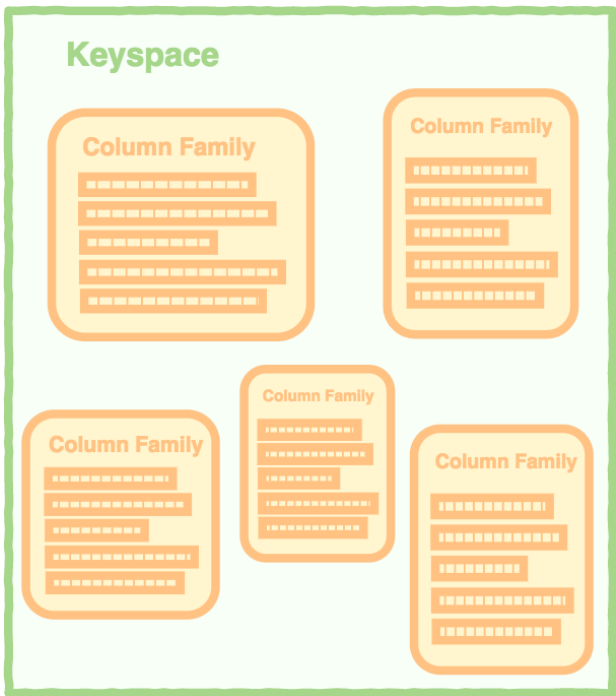
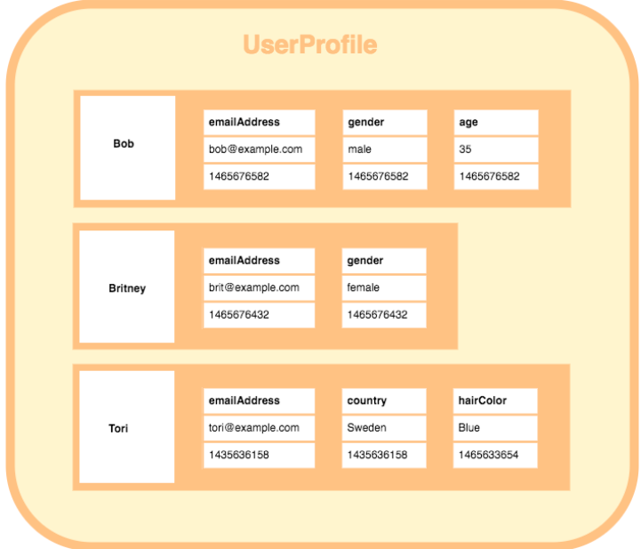
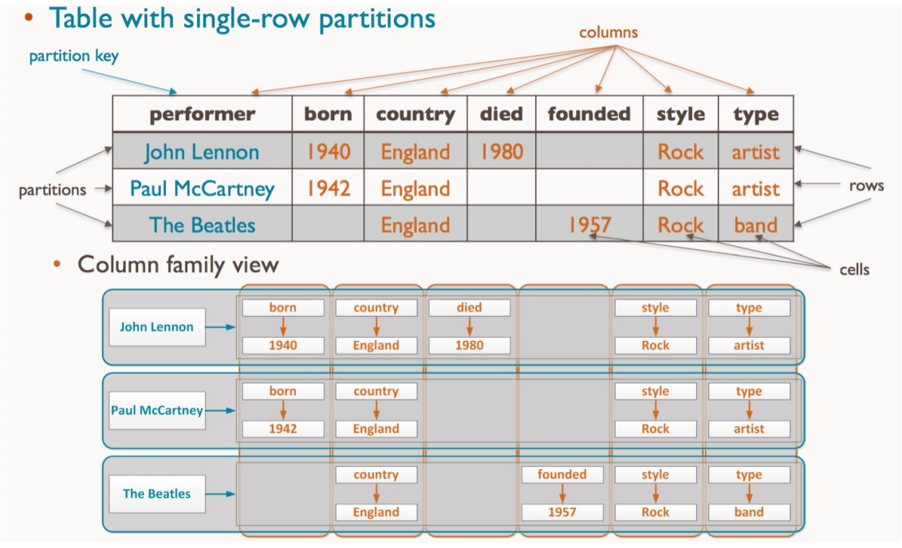
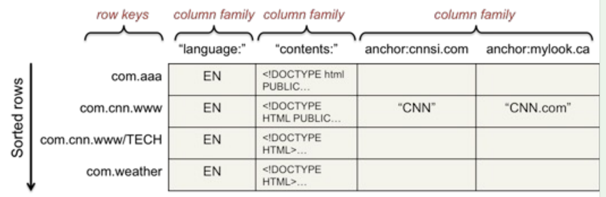
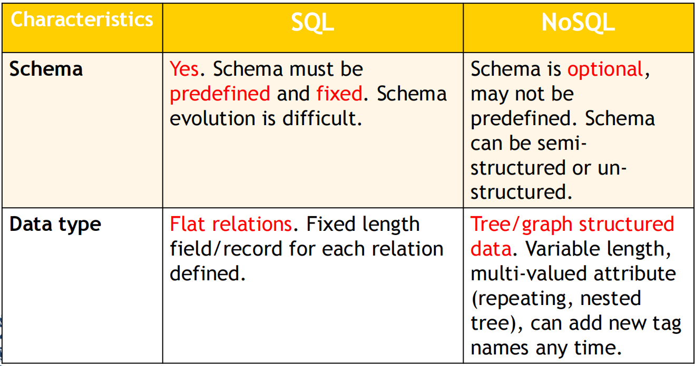
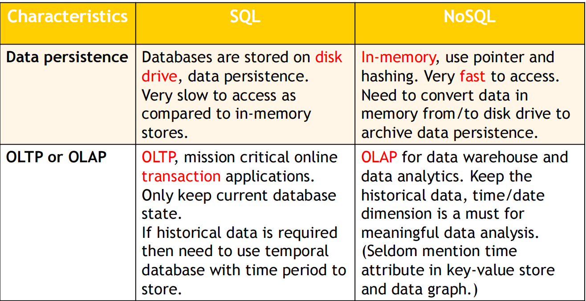
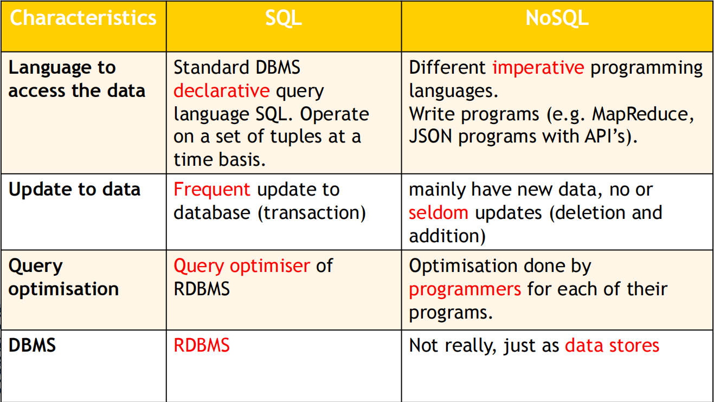
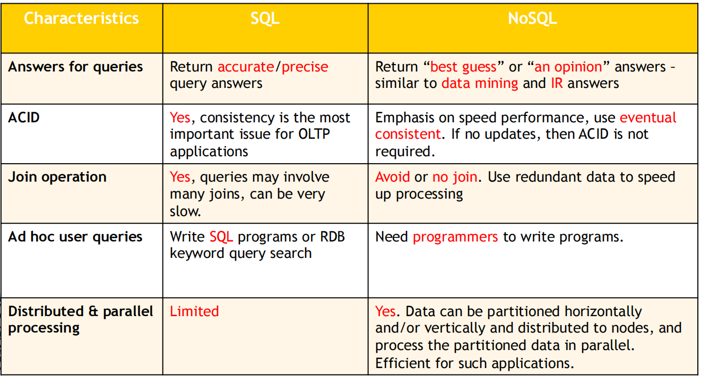
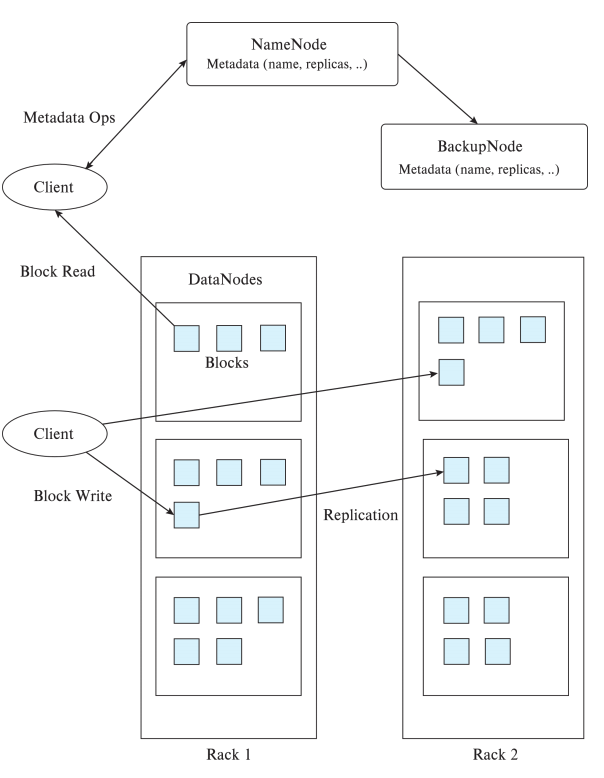

# Big Data

## Learning Outcomes

- Introduction to Big Data

- Issues and performance problems in RDBMS

- NoSQL and categories

- SQL vs NoSQL

- Big data storage

- MapReduce

- MapReduce vs database

## Introduction

- Big data is a broad term for data sets and it can be described by the following 3Vs characteristics:

  大数据是数据集的广义术语,可以通过以下3V特征来描述:

  - **Volume** (huge large amount of data: terabytes, petabytes, exabytes)

    **Volume** (巨大的数据量:TB、PB、EB)

  - **Velocity** (speed of data in and out: real-time, streaming)

    **速度**（数据进出速度：实时、流式）

  - **Variety** (range of data types and sources, non relational data such as nested relation,  documents, XML data, web data, graph,  multimedia, flexible schema or no schema)

    **多样性**(数据类型和来源的范围,非关系数据,如嵌套关系,文档,XML数据,Web数据,图形,多媒体,灵活的模式或无模式)

- Two more Vs

  两个Vs

  - **Veracity** (correctness and accuracy of information: data quality and reliability)

    **真实性**(信息的正确性和准确性:数据质量和可靠性)

  - **Value** (use machine learning, data mining, statistics, visualisation, decision analysis techniques to extract/mine/derive previously unknown insights from data and become actionable knowledge, business value)

    **价值**(使用机器学习、数据挖掘、统计、可视化、决策分析技术从数据中提取/挖掘/推导出以前未知的见解,并成为可操作的知识、商业价值)

- Traditional Relational database management systems (RDBMSs) using SQL are inadequate to handle big data efficiently.

  使用 SQL 的传统关系数据库管理系统 (RDBMS) 不足以有效地处理大数据。

### Database Models 数据库模型

- File system

- Hierarchical Model (IMS)

- Network Model (IDMS)

- Relational Model

- Nested Relational Model

- Entity-Relationship Approach

- Object-Oriented(OO) Data Model

- Deductive and Object-Oriented (DOOD)

- Object Relational Data Model

- Semi-structured Data Model (XML)

- RDF and Linked Data

## Issues and performance problems in RDBMS  RDBMS 中的问题和性能问题

- Normal forms in relational models are to remove redundancies and to reduce updating anomalies. Does data redundancy definitely incur updating anomalies?

  关系模型中的正常形式是删除冗余并减少更新异常。数据冗余肯定会产生更新异常吗?

  - Example 1: **supply (S#, Sname, P#, Pname, price)**. This supply relation is not even in 2NF. It has redundant information on Sname and Pname, but it does not suffer from updating anomalies as we don’t change Sname and Pname of suppliers and parts, resp.

    示例1:**供应(S#,Sname,P#,Pname,price)**。这种供应关系甚至不在2NF中。它具有关于Sname和Pname的冗余信息,但它不会受到更新异常的影响,因为我们不会更改供应商和零件的Sname和Pname。

  - Example 2: For **Sales transactions**, we can add and store the item name, price of item, amount for each item ordered (use the quantity ordered), and total amount of each sales transaction. They are all needed to print the receipts. These are redundant,  but they don’t incur updating anomalies as we don’t change the  transactions once they are done.

    示例 2:对于 **销售交易**,我们可以添加并存储每笔销售交易的商品名称、商品价格、每件订单的金额(使用订单数量)和总金额。这些都是打印收据所必需的。这些都是多余的,但它们不会产生更新异常,因为一旦交易完成,我们就不会更改交易。

  - This gives better performance for data analytics! No need to join  relations again.

    这为数据分析提供了更好的性能!无需再次加入关系。

- Adding redundancy in physical database design may not incur updating anomalies and instead may improve performance significantly, avoid joins.

  在物理数据库设计中添加冗余可能不会导致更新异常,而是可以显着提高性能,避免连接。

  - RDBMS cannot handle multi-valued attributes and composite attributes efficiently.

    RDBMS 无法有效地处理多值属性和复合属性。

  - Example: nested relation: employee (e#, name, sex, dob, hobby*, qualification(degree, university, year )* )

    示例:嵌套关系:员工(e#,姓名,性别,dob,爱好*,资格(学位,大学,年份 )* )

  - To store employee information, we need 3 normal form relations:

    为了存储员工信息,我们需要 3 种范式关系:

    - employee (e#, name, sex, dob) 

    - employee_hobby (e#, hobby) 

    - employee_qual (e#, degree, university, year)

  - To get information of an employee, we need to join the 3 relations, very inefficient and very slow and has a lot of redundant information as the joined relation is not in 4NF.

    为了获得员工的信息,我们需要连接三个关系,非常低效,非常慢,并且有很多冗余信息,因为连接的关系不在4NF中。

- RDBMS join operation is very **expensive**. So it may not be suitable for some applications.

  RDBMS 连接操作**非常昂贵**,因此可能不适合某些应用进程。

- ACID (Atomicity, Consistency, Isolation, Durability) is to ensure the consistency of data. 

  ACID (Atomicity, Consistency, Isolation, Durability) 是为了保证数据的一致性。

  - Two-Phase locking is required. But overhead for enforcing ACID (using locks) is extremely high for managing the locks.

    需要两相锁定。但是,强制使用ACID(使用锁)的开销对于管理锁具来说非常高。

  - Example: large data volume applications which don’t modify existing data or at most only add new data, don’t require ACID.

    例如:大数据量应用进程不修改现有数据或最多只添加新数据,则不需要 ACID。

## NoSQL  (not-only SQL)

- **Flexible** schema or **no** schema; avoidance of unneeded complexity, e.g. expensive object relational mapping.

  灵活的模式或没有模式;避免不必要的复杂性,例如昂贵的对象关系映射。

  - NoSQL databases are designed to store data structures that are either simple or more similar to the ones of object-oriented programming languages compared to relational data structures. 

    NoSQL 数据库被设计为存储简单或更类似于面向对象编程语言的数据结构, 而不是关系数据结构。

- Massive scalability/high throughput

  大规模可扩展性，高吞吐量

- Relaxed consistency for higher performance and availability

  放松一致性,实现更高的性能和可用性

- Quicker/cheaper to set up

  更快/更便宜的设置

- etc

### Eventual consistency  最终一致性 （重点）

- NoSQL softens the ACID properties in relational databases to allow horizontal scalability. 

  NoSQL 软化了关系数据库中的 ACID 属性,以实现横向可扩展性。

- BASE (proposed for Scalable systems) stands for **basically available, soft state, eventually consistent**.

  BASE(建议用于可扩展系统)代表**基本可用,软状态,最终一致**。

- focuses mainly on availability of a system, at the cost of loosening the consistency.

  主要关注系统的可用性,以降低一致性为代价。

- The eventual consistency property of a BASE system accepts periods where clients might read inconsistent (i.e. out-dated) data. 

  BASE 系统的最终一致性属性接受客户端可能读取不一致(即过时)数据的时期。

- Though, it guarantees that those periods will eventually end.

  但是,它保证了这些时期最终会结束。

- **Strong consistency**: after the update completes, any subsequent access will return the updated value.

  **强一致性**:更新完成后,任何后续访问都将返回更新的值。

- **Weak consistency**: a number of conditions need to be met before the updated value will be returned.

  **弱一致性**:在返回更新的值之前,需要满足许多条件。

- **Eventual consistency**: a consistency model used in distributed computing to achieve high availability that informally guarantees that, if no new updates are made to a given data item, eventually all accesses to that item will return the last updated value. (*Vogels, W. (2009. "Eventually consistent".* *Communications of the ACM. 52: 40.*)

  **最终一致性**:分布式计算中用于实现高可用性的一致性模型,非正式地保证,如果对给定数据项没有进行新的更新,最终对该项的所有访问都将返回最后更新的值。

### NoSQL categories

- NoSQL databases are categorised according to the way they store the data. 

  NoSQL 数据库根据其存储数据的方式进行分类。

- Four major categories for NoSQL databases:

  NoSQL 数据库的四个主要类别:

  - Key-value Stores

    Key-value 存储

  - Wide-Column Stores 

    Wide-Column 商店

  - Document Stores

    文档存储

  - Graph Database

    图数据库 Graph Database

### Key-value store  键值存储

- Key-value storage systems store large numbers (billions or even more) of small (KBMB) sized records

  键值存储系统存储大量(数十亿甚至更多)小(KBMB)大小的记录 -

- Records are partitioned across multiple machines

  记录被分区到多台机器上

- Queries are routed by the system to appropriate machines

  查询由系统路由到适当的机器

- Records are also replicated across multiple machines, to ensure availability even if a machine fails

  记录也复制到多台机器上,以确保即使机器发生故障也能保持可用性

  - Key-value stores ensure that updates are applied to all replicas, to ensure that their values are consistent

    键值存储确保更新应用于所有副本,以确保其值一致

- A key-value store is like associate array 

  键值存储就像关联数组

  - data is represented in the form of array[“key”] = value or hash table in main memory.

    数据以数组["键"] = 值或主内存中哈希表的形式表示。

- Each data/object is stored, indexed, and accessed using a key value to access the hash table or array.

  每个数据/对象都被存储、索引,并使用键值访问哈希表或数组。

- Value is a single opaque collection of objects or data items 

  值是一个对象或数据项的不透明集合

  - can be structured, semi-structured, or unstructured. It is just an un-interpreted string of bytes of arbitrary length.

    可以是结构化的、半结构化的或非结构化的,它只是一个任意长度的未解释的字节串。

- The meaning of the value in a key-value pair has to be interpreted by programmers. 

  键-值对中值的含义必须由程序员解释

- No concept of “foreign key”, no join

  没有"外键"的概念,没有加入

  - data can be horizontally partitioned and distributed

    数据可以横向分区和分布

Stored value typically can not be interpreted by the storage system.

存储值通常不能被存储系统解释。

"type: person; age:20"

- Key-value stores may store

  键值存储

  - **Un-interpreted bytes**, with an associated key

    未解释的字节,具有关联的密钥

    - e.g. Amazon S3, Amazon Dynamo

      例如:Amazon S3、Amazon Dynamo

  - **Wide-table** (can have arbitrarily many attribute names) with associated key

    宽表(可以有任意多个属性名)与相关键

    - Google BigTable, Apache Cassandra, Apache Hbase, Amazon DynamoDB

    - Allows some operations (e.g., filtering) to execute on storage node

      允许在存储节点上执行某些操作(例如,过滤)

  - **JSON**

    - MongoDB, CouchDB (document model)

      MongoDB、CouchDB(文档模型)

- Some key-value stores support multiple versions of data, with timestamps/version numbers

  一些键值存储支持多个版本的数据,带有时间戳/版本号

#### Data representation

example

```json
{
    "ID": "22222",
    "name": {
        "firstname: "Albert",
        "lastname: "Einstein"
    },
    "deptname": "Physics",
    "children": [
        { "firstname": "Hans", "lastname": "Einstein" },
        { "firstname": "Eduard", "lastname": "Einstein" }
    ]
}
```

<hr>

- Typical operations include (but no modification):

  典型的操作包括(但不修改):

  - **INSERT** new Key-Value pairs (or **put**)

    **INSERT** 新的键值对 (或 **put**)

  - **LOOKUP** value for a specified key (or **get**)

    **LOOKUP** 指定键的值(或 **get**)

  - **UPDATE** existing Key-Value pairs 

    **更新** 现有的键值对

  - **DELETE** key and the value associated with it

    **DELETE** 键和与之关联的值

- Some systems also support **range queries** on key values

  一些系统还支持对键值进行 **范围查询**

- Key value stores are not full database systems

  键值存储不是完整的数据库系统

  - Have no/limited support for transactional updates

    不支持/有限支持事务性更新

  - Applications must manage query processing on their own

    应用进程必须自己管理查询处理

- Not supporting above features makes it easier to build scalable data storage systems, 

  不支持上述功能使得构建可扩展的数据存储系统变得更加容易。

  - Also called **NoSQL** systems (this is from the textbook, a bit controversial)

#### Wide-Column Stores  Wide-Column 商店

- Data is stored as tables. A table has a row-key and a pre-defined set of column-family columns.

  数据以表的形式存储。表具有行键和一组预定义的列族列。

- Each row in the table is uniquely identified by a row key value.

  表中的每一行都由行键值唯一标识。

- Each column family has a large and flexible number of columns (i.e. the No of columns may change from row to row) 

  每个列族具有大量且灵活的列数(即列数可能逐行变化)

  - Each column has a name together with one or more values.

    每个列都有一个名称和一个或多个值。

- A column-oriented DBMS stores data tables as column families of data rather than as rows of data. 

  面向列的 DBMS 将数据表存储为数据列族,而不是数据行。

  - Better for data compression.

    更适合数据压缩。

- A keyspace in a wide-column store contains all the column families (like tables in the relational model), which contain rows, which contain columns.

  宽列存储中的键空间包含所有列族(如关系模型中的表),其中包含行,其中包含列。



- A column family containing 3 rows. Each row contains its own set of columns.

  包含 3 行列的列族。每行包含一组自己的列。





### Google’s BigTable

- A sparse, distributed, persistent multi-dimensional sorted map.

  一张稀疏、分布、持久的多维排序地图。

- Used by several Google applications such as web indexing, MapReduce, Google Maps, Google Earth, YouTube, Gmail, etc.

  被多个 Google 应用进程使用,如 Web 索引、MapReduce、Google 地图、Google 地球、YouTube、Gmail 等。

- The map is indexed by a row key, column key, and a timestamp; each value in the map is an uninterpreted array of bytes.

  该映射由行键、列键和时间戳进行索引;映射中的每个值都是未解释的字节数组。

  - For webpage, the row key value is a reversed url.

    对于网页,行键值为反向 URL。

  - BigTable maintains data in lexicographic order by row key. 

    BigTable 按照行键按词典顺序维护数据。

  - So webpages in the same domain are grouped together into contiguous rows.

    因此,同一域中的网页被分组为连续行。



#### Graph Database 图像数据库

- Best suited for representing data with a large number of interconnections

  最适合表示具有大量互连的数据

  - especially when information about those interconnections is at least as important as the represented data

    特别是当这些互连的信息至少与所表示的数据一样重要时

  - for example, social relations or geographic data.

    例如,社会关系或地理数据。

- Graph databases allow for queries on the graph structure, e.g. relations between nodes or shortest paths. 

  例如,社会关系或地理数据。

- Examples:

  例子:

  - RDF graph and linked data

    RDF 图和关联数据

  - Google knowledge graph

    Google 知识图谱

### Document Stores 存储文件

- Schema languages are not powerful to express Object- Relationship-Attribute semantics in ER model.

  模式语言无法在 ER 模型中表达 ObjectRelationship-Attribute 语义。

- Data is stored in so-called documents, i.e. arbitrary data in some (semi-)structured format. 

  数据存储在所谓的文档中,即以某种(半)结构化格式存储的任意数据。

  - JSON 

  - BSON 

  - XML 

- Data format is typically fixed, but the structure is flexible. 

  数据格式通常是固定的,但结构是灵活的。

  - in a JSON-based document store, documents with completely different sets of attributes can be stored together.

    在基于 JSON 的文档存储中,具有完全不同属性集的文档可以存储在一起。

## SQL VS. NoSQL









## Big Data Storage Systems  大数据存储系统

- Distributed file systems

  分布式文档系统

- Sharding across multiple databases

  跨多个数据库进行分片

- Key-value storage systems

  键值存储系统

  - The textbook categorises all the NoSQL storage systems as key-value stores

    该教科书将所有NoSQL存储系统归类为键值存储

- Parallel and distributed databases

  并行和分布式数据库

### Distributed File Systems 分布式文档系统

- A distributed file system stores data across a large collection of machines, but provides **single** filesystem view

  分布式文档系统将数据存储在大量机器上,但提供**单一**文档系统视图

- Highly scalable distributed file system for large data-intensive applications.

  用于大型数据密集型应用进程的高度可扩展的分布式文档系统。

  - e.g. 10K nodes, 100 million files, 10 PB

- Provides **redundant** storage of massive amount of data on cheap and unreliable computers

  在廉价且不可靠的计算机上为大量数据提供**冗余**存储

  - Files are replicated to handle hardware failure

    文档被复制以处理硬件故障

  - Detect failures and recovers from them

    检测故障并从中恢复

- Examples: 

  - Google File System (GFS)

  - Hadoop File System (HDFS)

### Hadoop File System Architecture Hadoop文档系统架构

- **Single** Namespace for entire cluster

  **整个集群的单一**命名空间

- Files are broken up into blocks

  文档被分解成块

  - Typically 64 MB block size

  - Each block replicated on multiple DataNodes

- Client

  - Finds location of blocks from NameNode

  - Accesses data directly from DataNode



- **NameNode**

  - Maps a filename to list of Block IDs

  - Maps each Block ID to DataNodes containing a replica of the block

    将每个块 ID 映射到包含该块副本的数据节点

- **DataNode**: Maps a Block ID to a physical location on disk

  **DataNode**:将块 ID 映射到磁盘上的物理位置

- Data Coherency

  数据一致性

  - **Write-once-read-many** access model

  - Client can only append to existing files

    客户端只能追加到现有文档

- Distributed file systems are good for millions of large files

  分布式文档系统对数百万个大文档很有用

  - But have very high overheads and poor performance with billions of smaller tuples

    但是具有非常高的开销和较差的性能,具有数十亿个较小的元组

### Sharding  分片

- **Sharding**: partition data across multiple databases

  **分片**:将数据分区到多个数据库

- Partitioning usually done on some **partitioning attributes** (also known as **partitioning keys** or **shard keys** e.g. user ID

  分区通常基于一些分区属性(也称为分区键或分片键,例如用户ID)

  - records with key values from 1 to 100,000 on database 1, records with key values from 100,001 to 200,000 on database 2, etc.

    数据库 1 中键值为 1 到 100,000 的记录,数据库 2 中键值为 100,001 到 200,000 的记录,等等。

- Application must track which records are on which database and send queries/updates to that database

  应用进程必须跟踪哪些记录在哪个数据库上,并向该数据库发送查询/更新

- Positives: scales well, easy to implement

  优点:规模大,易于实施

- Drawbacks:

  缺点:

  - Not transparent: application has to deal with routing of queries, queries that span multiple databases

    不透明：应用程序必须处理查询路由，查询跨越多个数据库

  - If a database is overloaded, moving part of its load out is not easy

    如果数据库过载,将部分负载移出并不容易

  - Chance of failure more with more databases

    更多数据库的失败机会更多

    - need to keep replicas to ensure availability, which is more work for application

      需要保留副本以确保可用性,这对于应用进程来说是更多的工作

### Parallel Databases and Data Stores  并行数据库和数据存储

- Supporting scalable data access

  支持可扩展的数据访问

  - Approach 1: memcache or other caching mechanisms at application servers, to reduce database access

    方法1:memcache或应用服务器上的其他缓存机制,以减少数据库访问

    - Limited in scalability

      可扩展性有限

  - Approach 2: Partition (“shard”) data across multiple separate database servers

    方法 2:在多个独立的数据库服务器上分区("分片")数据

  - Approach 3: Use existing parallel databases 

    方法三:利用现有的并行数据库

    - Historically: parallel databases that can scale to large number of machines were designed for decision support not OLTP

      历史上:可扩展到大量机器的并行数据库是为决策支持而非 OLTP 而设计的

  - Approach 4: Massively Parallel Key-Value Data Store

    方法 4：大规模并行键值数据存储

    - Partitioning, high availability etc. completely transparent to application

      分区、高可用性等对应用进程完全透明

Sharding systems and key-value stores don’t support many relational features, such as joins, integrity constraints, etc. across partitions.

分片系统和键值存储不支持跨分区的许多关系特征,如连接、完整性约束等。

### Parallel and Distributed Databases  并行和分布式数据库

- Parallel databases run multiple machines (cluser)

  并行数据库运行多台机器 (cluser)

  - Developed in 1980s, well before Big Data

    开发于 20 世纪 80 年代,远早于大数据

- Parallel databases were designed for smaller scale (10s to 100s of machines)

  并行数据库是为较小规模(10到100台机器)而设计的

  - Did not provide easy scalability

    没有提供简单的可扩展性

- **Replication** used to ensure data availability despite machine failure

  **复制**用于确保机器故障时的数据可用性

  - But typically restart query in event of failure

    但通常会在失败时重新启动查询

  - Restarts may be frequent at very large scale

    重启可能频繁且规模很大

  - Map-reduce systems (coming up next) can continue query execution, working around failures

    Map-reduce 系统(即将推出)可以继续查询执行,绕过故障

## The MapReduce Paradigm  MapReduce 范式

- Platform for reliable, scalable parallel computing

  可靠、可扩展的并行计算平台

- Abstracts issues of distributed and parallel environment from programmer

  从进程员抽象出分布式和并行环境的问题

  - Programmer provides core logic (via map() and reduce() functions)

    进程员提供核心逻辑(通过 map() 和 reduce() 函数)

  - System takes care of parallelisation of computation, coordination, etc.

    系统负责计算、协调等的并行化。

- Paradigm dates back many decades 

  范式可以追溯到几十年前

  - But very large scale implementations running on clusters with 10^3 to 10^4 machines are more recent

    但是,在具有 10^3 到 10^4 台机器的集群上运行的大规模实现是最近才出现的。

  - Google Map Reduce, Hadoop

- Data storage/access typically done using distributed file systems or key-value stores

  数据存储/访问通常使用分布式文档系统或键值存储

### Example

- Consider the problem of counting the number of occurrences of each word in a large collection of documents

  考虑计算大量文档中每个单词出现的次数的问题

- Solution:

  - Divide documents among workers

    在工人之间分配文档

  - Each worker parses document to find all words, map function outputs (word, count) pairs

    每个工作人员解析文档以查找所有单词,映射函数输出(单词,计数)对

  - Partition (word, count) pairs across workers based on word

    (字数、计数) 对跨基于字的工人

  - For each word at a worker, reduce function locally add up counts

    对于 worker 的每个单词,reduce 函数局部加起来计数

- Input: “One a penny, two a penny, hot cross buns.”

  输入:"一便士一个,两便士一个,热十字面包"。

  - Records output by the map() function would be
    - (“One”, 1), (“a”, 1), (“penny”, 1),(“two”, 1), (“a”, 1), (“penny”, 1), (“hot”, 1), (“cross”, 1), (“buns”, 1).
  - Records output by reduce function would be 
    - (“One”, 1), (“a”, 2), (“penny”, 2), (“two”, 1), (“hot”, 1), (“cross”, 1), (“buns”, 1)

### Pseudo-code of Word Count 伪代码

**map**(String record)**:** 

​	for each word in record 

​		emit(word, 1);

// First attribute of emit above is called **reduce key**

// 上面 emit 的第一个属性叫做 **reduce key**

// In effect, group by is performed on reduce key to create a list of values (all 1’s in above code). This requires **shuffle** **step** across machines

实际上,在reduce键上执行group by以创建值列表(上述代码中的所有1)。这需要**shuffle** **step**跨机器

// The reduce function is called on list of values in each group

// reduce 函数在每个组的值列表中被调用

**reduce(**String key, List value_list**):** 

​	String word = key

​	int count = 0; 

​	for each value in value_list: 

​		count = count + value

​	Output(word, count);

### MapReduce Programming Model  MapReduce 编程模型

- Inspired from map and reduce operations commonly used in functional programming languages like Lisp.

- Input: a set of key/value pairs

- User supplies two functions:

  - **map**(k,v) à list(k1,v1) 

  - **reduce**(k1, list(v1)) à v2

- (k1,v1) is an intermediate key/value pair

- Output is the set of (k1,v2) pairs 

- For our example, assume that system 

  - Breaks up files into lines, and 

  - Calls map function with value of each line
    - Key is the line number