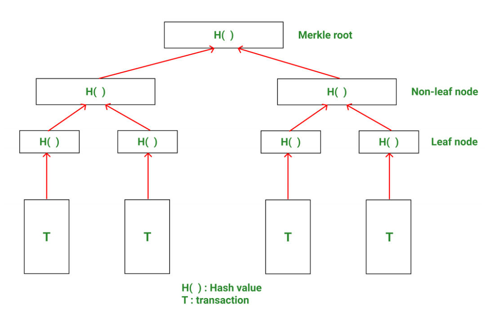
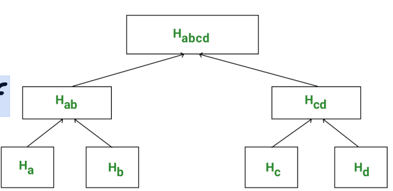

# Blockchain 区块链

- At the most basic level, a blockchain provides an alternative way for **storing data** in a database. 

  在最基本的层面上,区块链提供了一种在数据库中**存储数据**的替代方法。

- A major application of blockchain is in the creation of **decentralised digital ledgers**.

  区块链的一个主要应用是创建**分散的数字分类帐**。

- Blockchain-based distributed ledger maintains a ledger cooperatively among several parties

  基于区块链的分布式账本在多方之间合作维护账本

- Each transaction is digitally signed as proof of authenticity

  每笔交易都经过数字签名,作为真实性的证明

- Once entries are added, they cannot be deleted or modified by one party, without detection by others.

  一旦添加了条目,它们就不能被一方删除或修改,而不会被其他人发现。

- It can provide a **secure data-storage and data processing foundation** for business applications, without requiring complete trust in any one party.

  它可以为业务应用进程提供**安全的数据存储和数据处理基础**,而无需完全信任任何一方。

## Type of Blockchain

- Public

  - Anyone can download needed software and create a blockchain node

    任何人都可以下载所需的软件并创建一个区块链节点

  - No trust assumed among participating nodes

    参与节点之间没有信任假设

- Permissioned

  - Permission to run a blockchain node is granted by a permissioning authority

    运行区块链节点的许可由许可机构授予

  - Some degree of relaxation of assumptions of trust lessness and autonomy

    在一定程度上放宽对信任度和自主性的假设

- The type of blockchain influences choice of algorithms by which nodes agree on the next block to be added to the blockchain

  区块链的类型会影响选择算法,通过这些算法,节点同意将下一个块添加到区块链中

## Introduction

Linked list of blocks  区块链接列表

Each block contains a **pointer** to the previous block plus a **hash** of the previous block (except the first block which is called the **genesisp block**)

每个块都包含指向前一个块的指针以及前一个块的哈希值(除了称为创世块的第一个块)

- **Tamper resistance**

  **抗篡改性**

  - The inclusion of the hash of the previous block makes tampering difficult

    包含前一个块的哈希值使得篡改变得困难

    - Changing contents of a block means changes all newer blocks as well

      更改一个区块的内容意味着所有新区块的内容也随之改变。

  - Replication (by users) prevents **replacement** of the entire blockchain without gaining **majority** control

    复制(由用户)可以防止**替换**整个区块链,而不会获得**多数**控制权

- Node types

  节点类型

  - **Full** node – maintains copy of blockchain and participates in consensus process

    **完整**节点 - 维护区块链副本并参与共识过程

  - **Light** node – submits updates to blockchain but does not participate in the consensus process

    **轻型**节点 - 向区块链提交更新,但不参与共识过程

- **<u>Consensus</u>** algorithms to choose node to add the next block

  **Consensus** 选择节点添加下一个块的算法

  - A fork happens when a new block is added to a block other than the most recent one.

    当一个新的块被添加到与最近一个块不同的块时,就会发生分叉。

  - Forks are possible if agreed by majority of users (Consensus based)

    如果大多数用户同意,分叉是可能的(基于共识)

- **Digital signature**

  **数字签名**

  - Use public-key encryption (private key) to sign transactions.

    使用公钥加密(私钥)来签署交易。

  - Ensures that users cannot deny submitting a transaction, a property called **irrefutability**.

    确保用户无法拒绝提交交易,这种属性称为"不可反驳性"。

- **Anonymity**

  **匿名**

  - Users can remain anonymous unless there is a way to tie user’s ID (public key) to a real-world entity

    用户可以保持匿名,除非有办法将用户的ID(公钥)与现实世界的实体联系起来

## Blockchain Properties

Summary of blockchain properties

- **Decentralisation** – majority consensus with no central authority.

  **权力下放** - 多数共识,没有中央权威。

- **Tamper resistance** – infeasibility of changing the contents of blocks on the blockchain.

  **抗篡改性** - 改变区块链上区块内容的不可行性。

- **Irrefutability** – user cannot deny having submitted a transaction.

  **不可反驳性** - 用户不能否认提交过交易。

- **Anonymity** – IDs not directly tied to any real-world entity

  **匿名** - ID 不直接与任何现实世界的实体相关联

## Cryptographic Hash Functions 加密哈希函数

- Let *h* denote a cryptographic hash function. Then *h* must satisfy the following properties:

  *h* 表示加密哈希函数,那幺 *h* 必须满足以下属性:

  - **Collision resistant** – it is infeasible to find two distinct values *x* and *y* such that h(x) = h(y)

    **防碰撞** - 找到两个不同的值 *x* 和 *y* 使得 h(x) = h(y) 是不可行的

  - **Irreversible** – given h(x), it is infeasible to find x.

    **不可逆** - 给定 h(x),找到 x 是不可行的。

- **Infeasible** there is strong mathematical evidence, if not an actual proof, no approach to obtain an answer that is better than guessing from the set of all possibilities.

  **不可行** 有强有力的数学证据,如果不是实际的证明,没有办法获得比从所有可能性集合中猜测更好的答案。

- Use public key to encrypt a message

  使用公钥加密消息

- Use private key to sign a message

  使用私钥签署邮件

## Blockchain Transactions

- Transaction model is specific to each blockchain.

  交易模型是每个区块链特有的。

- Bitcoin 

  - Input transactions (whose output is to be spent by this transaction)

    输入交易(其输出将由该交易花费)

  - A set of outputs, each specifying recipient and amount

    一组输出,每个输出都指定收件人和金额

  - A digital signature from the user submitting the transaction

    用户提交交易的数字签名

  - Store a small amount of data on blockchain

    在区块链上存储少量数据

  - Specify a slightly more complex transaction using the Bitcoin scripting language

    使用 Bitcoin 脚本语言指定稍微复杂一点的交易

- Ethereum 以太坊

  - Maintains account balances, which are modified by transactions

    维护账户余额,这些余额会因交易而更改

  - Has more sophisticated, Turing-complete scripting language

    具有更复杂的图灵完备脚本语言

## Consensus  一致性

- All nodes must agree on additions to blockchain

  所有节点必须同意对区块链的添加

  - In a decentralised system like a blockchain, there is no central coordinator (unlike the case for 2PC and 3PC)

    在像区块链这样的去中心化系统中,没有中央协调者(与2PC和3PC的情况不同)

- Categorisation of **consensus algorithms**:

  对**共识算法**的分类:

  - **Proof of Work** (public blockchain)

    **工作量证明**(公共区块链)

    - Node needs to solve a cryptographic puzzle in order to add a block

      节点需要解决一个加密难题才能添加一个块

  - **Proof of Stake** (public blockchain)

    **股权证明**(公共区块链)

    - Node is chosen to add next block based on amount of currency held, with probability proportionate to stake

      根据持有的货币数量选择节点添加下一个区块,概率与赌注成比例

  - **Byzantine Consensus** (permissioned blockchain)

    **拜占庭共识**(许可区块链)

    - Node is chosen to add next block based on Byzantine consensus

      节点被选择基于拜占庭共识添加下一个块

### Proof of Work

- To add a block B, a node needs to find a **nonce**, *n*, such that the value of the hash function *h* applied to the concatenation of *n* and *B* (n || B) is less than some specified value.

  要添加一个块B,节点需要找到一个**nonce**,*n*,使得应用于*n*和*B*(nmto B)连接的哈希函数*h*的值小于某个指定值。

  - The function *h* must have the **puzzle-friendliness** property: given *k* and an *n*-bit value *y*, it is infeasible to find *x* such that h(x || k) = y in time significantly less than 2^n.

    函数 *h* 必须具有 **益智性** 属性:给定 *k* 和 *n* 位值 *y*,找到 *x* 使得 h(x✔ k) = y 的时间明显小于 2^n 是不可行的。

- Forks

  - If more than one node solves the puzzle around the same time, two blocks could be added after the most recent block, hence a fork

    如果不止一个节点同时解开谜题,则在最近一个块之后可以添加两个块,因此是分叉

  - Since nodes attempt to add to the most recent block of the longest chain, eventually blocks on shorter forks are orphaned

    由于节点试图添加到最长链的最近块中,最终较短分叉上的块是孤立的

### Proof of Stake

- To allow nodes holding a large stake in the currency of the blockchain to be chosen preferentially. 

  允许优先选择持有区块链货币大量股份的节点。

- Cannot be applied absolutely as a single largest stakeholder would control the chain. 

  不能绝对应用,因为单个最大的利益相关者将控制链条。

- **Probability** of mining success is made higher for nodes in **proportion to their stake**.

  **节点成功挖矿的概率**会根据其权益的比例提高。

- There are a wide variety of proof-of-stake schemes. 

  有各种各样的权益证明方案。

  - Not only of overall stake, but also the total time a stake has been held. 

    不仅是总的赌注,而且是持有赌注的总时间。

  - Stake or some fraction of it be held inactive for some period of time in the future.

    股权或其中的一部分在未来一段时间内保持不活跃。

### Byzantine Consensus  拜占庭共识

- Byzantine consensus is message-based system by achieving consensus via a majority vote

  拜占庭共识是通过多数投票达成共识的基于消息的系统

- **Byzantine failure**: a failed node can behave in an arbitrarily bad manner, including taking the exactly correct set of steps to sabotage the system

  **拜占庭式故障**:一个失败的节点可以以任意糟糕的方式表现,包括采取完全正确的一组步骤来破坏系统

- **Practical Byzantine Fault Tolerance**: achieving consensus with Byzantine failure that at most (n-1)/3 nodes fail, where *n* is the total number of nodes.

  **实用的拜占庭容错**:在拜占庭故障中达成共识,最多 (n-1) /3 个节点失败,其中 *n* 是节点总数。

  - Requires higher cost in number of messages sent to achieve agreement

    需要更高的发送消息数成本来达成一致

  - But acceptable (much lower than cost of PoW and PoS mining)

    但可以接受(远低于 PoW 和 PoS 挖矿的成本)

## Sybil Attacks

A **Sybil attack** is an attempt to overwhelm the consensus algorithm by adding a large number of nodes.

**Sybil 攻击** 试图通过添加大量节点来压倒共识算法。

Protection against Sybil attack:

防止Sybil攻击:

- Proof of work: **hard** for an attacker to control majority of computing power in a network, thus making it hard to dominate success in solving the cryptographic puzzle.

  工作量证明:攻击者很难控制网络中的大部分计算能力,因此很难在解决加密难题方面取得主导地位。

- Proof of stake: **costly** to acquire a majority of all outstanding currency.

  权益证明:**昂贵**,以获得所有未偿还货币的大部分。

- Byzantine consensus: **vulnerable** to attack unless there is a permissioning mechanism for new nodes:

  拜占庭共识:除非有针对新节点的许可机制,否则容易受到攻击:

  - Trusted permission-granting agent.

    信任的许可授予代理。

  - A decentralised trust-based feature in the protocol itself.

    协议本身中基于信任的去中心化功能。

## Data Management in a Blockchain  区块链中的数据管理

- Efficient **Lookup** in a Blockchain

  区块链中的**高效查找**

  - Without a good data structure, this step would be prohibitively costly.

    如果没有良好的数据结构,这一步将代价高昂。

  - On each node, maintain an index on all unspent transactions.

    在每个节点上,维护所有未使用交易的索引。

- Blockchains use **Merkle-tree** data structure:

  区块链使用 **Merkle-tree** 数据结构:

  - Allows a node to store just root-hash of Merkle tree for verification purposes, rather than entire blockchain.

    允许节点仅存储默克尔树的根哈希以用于验证目的,而不是整个区块链。

    - Particularly useful for light nodes since they need to retain only root hash for verification. 

      对于轻节点尤其有用,因为它们只需要保留根哈希来进行验证。

    - A full node can provide any needed data to light nodes, i.e. any data plus hashes needed for verification

      完整节点可以为轻节点提供任何所需的数据,即验证所需的任何数据加哈希

- Maintaining Blockchain State

  维护区块链状态

  - Ethereum maintains a state holding balance in each account.

    以太坊在每个账户中保持状态持有余额。

  - Transactions move currency units (**ether** ) among accounts.

    交易在账户之间移动货币单位(**ether**)。

  - A variant of Merkle-tree, called a **Merkle-Patricia-tree**, is used for this purpose

    默克尔树的一种变体,称为默克尔-帕特里夏树,用于此目的。

- Merkle-Patricia-tree structure:

  Merkle-Patricia-tree结构:

  - Patricia-tree structure allows efficient key-based search.

    帕特里夏树结构允许有效的基于键的搜索。

  - Insertion and deletion: updates performed by creating a new root that points to unchanged parts of the data structure.

    插入和删除:通过创建指向数据结构中未更改部分的新根来执行更新。

### Markle Tree

### Case Study: Merkle Proof of Membership

Task: to prove that transaction ‘a’ is part of this Merkle tree.

- Compute H(a) = Ha (assume transaction a has been tampered).

  计算H(a) = Ha(假设交易a被篡改)。

- The hash of Ha and Hb will be Hab, which will be stored in an upper level node.

  Ha 和 Hb 的哈希值将是 Hab,它将存储在上层节点中。

- Finally hash of Hab and Hcd will give Habcd. This is the **Merkle root computed.**

  Hab 和 Hcd 的散列最后会得到 Habcd。这是计算出来的 **默克尔根**。

- By comparing the obtained Merkle root and the Merkle root already stored within the block header, one can verify the presence of transaction ‘a’ in this block.

  通过比较获得的默克尔根和已经存储在块头中的默克尔根,可以验证该块中是否存在交易"a"。

- In order to verify the presence of ‘a’, ‘a’ does not have to be revealed nor do ‘b’, ‘c’, ‘d’ have to be revealed, only their **hashes** are sufficient.

  为了验证"a"的存在,"a"不需要被显示出来,"b"、"c"、"d"也不需要被显示出来,只有它们的**哈希**就足够了。

