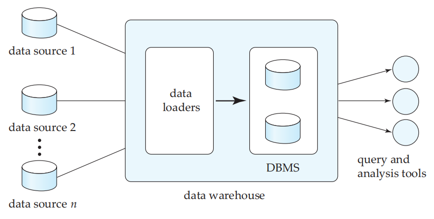
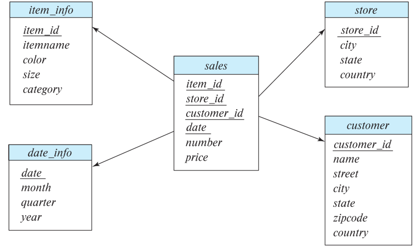
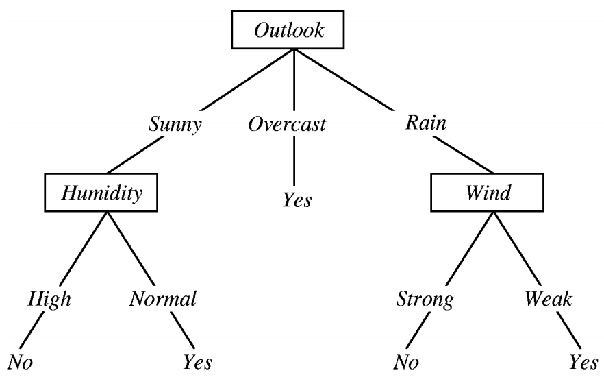
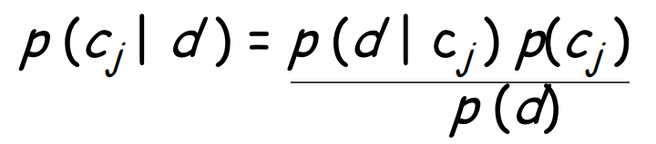
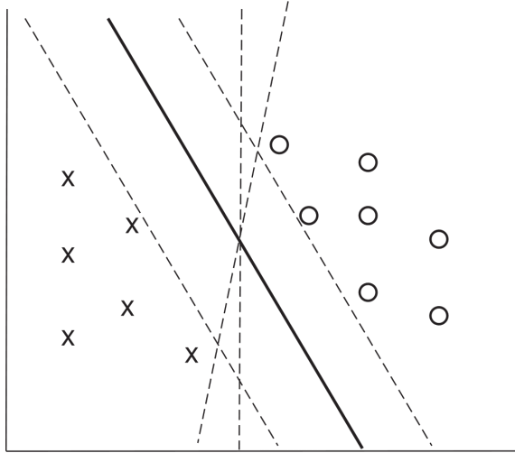
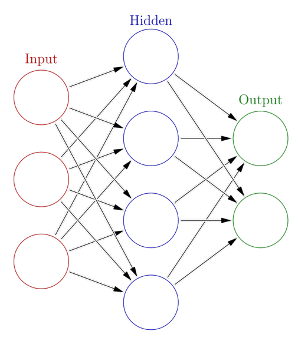

# Data Analytics  数据分析

## Overview of Data Analytics 总览

- Data Warehousing 

  数据仓库

- Online Analytical Processing

  在线分析处理

- Data Mining

  数据挖掘

- Classification

  分类

- Regression

  回归

- Association Rules

  结合

- Clustering

  聚类

- Self-supervised learning

  自我监督学习

### Overview

- **Data analytics** - processing of data to infer patterns, correlations, or models for prediction

  **数据分析** 数据处理以推断模式、相关性或预测模型

- Primarily used to make business decisions

  主要用于制定商业决策

  - Per individual customer

    每位客户

    - e.g. what product to suggest for purchase

      例如:建议购买什幺产品

  - Across all customers

    遍及所有客户

    - e.g. what products to manufacture/stock, in what quantity

      例如,生产/库存什幺产品,数量是多少

- Critical for business applications

  商业应用的关键

### Common steps in data analytics  数据分析中的常见步骤

- **Gather data** from multiple sources into one location 

  **从多个来源收集数据**到一个位置

  - Data warehouses also integrated data into common schema

    数据仓库还将数据集成到通用模式中

  - Data often needs to be extracted from source formats, transformed to common schema, and loaded into the data warehouse

    通常需要从源格式中提取数据，将其转换为通用架构，然后加载到数据仓库中

    - Can be done as ETL (extract-transform-load), or ELT (extractload-transform)

      可以作为 ETL （extract-transform-load） 或 ELT （extractload-transform） 完成

- **Generate aggregates and reports** summarising data

  **生成汇总和报告**汇总数据

  - Dashboards showing graphical charts/reports

    显示图形图表/报告的仪表板

  - Online analytical processing (OLAP) systems allow interactive querying

    在线分析处理 (OLAP) 系统允许交互式查询

  - Statistical analysis using tools such as R/SAS/SPSS

    使用R/SAS/SPSS等工具进行统计分析

    - Including extensions for parallel processing of big data

      包括大数据并行处理扩展

- **Build predictive models** and use the models for decision making

  **创建预测模型**并使用模型进行决策

### Predictive Models Examples

- Use customer profile features (e.g. income, age, gender, education, employment) and past history of a customer to predict likelihood of default on loan and to make loan decision.

  使用客户档案特征（例如收入、年龄、性别、教育程度、就业情况）和客户过去的历史记录来预测贷款违约的可能性并做出贷款决策。

- Use past history of sales (by season) to predict future sales, decide what/how much to produce/stock, and find target customers

  使用过去的销售历史记录（按季节）来预测未来的销售额，决定生产什幺/库存什幺/多少，并找到目标顾客

- Other examples of business decisions:

  其他商业决策的例子

  - What items to stock?

    库存哪些物品?

  - What insurance premium to change?

    保险费改什幺?

  - To whom to send advertisements?

    向谁发送广告?

### Related Terms  相关词条

- **Machine learning** techniques are key to finding patterns in data and making predictions

  **机器学习** 技术是在数据中寻找模式并做出预测的关键

  - Focus on algorithms

    聚焦算法(Focus on algorithms)

- **Data mining** extends techniques developed by machine-learning communities to run them on very large datasets

  **数据挖掘** 扩展了机器学习社区开发的技术，使其在非常大的数据集上运行

  - Focus on applications

    专注于应用进程

- The term **business intelligence** is a synonym for data analytics

  术语 **商业智能** 是数据分析的同义词

- The term **decision support** focuses on reporting and aggregation

  术语**决策支持**侧重于报告和汇总

## Data Warehousing  数据存储

- Data sources often store only current data, not historical data

  数据源通常只存储当前数据,而不是历史数据

- Corporate decision making requires a unified view of all organisational data, including historical data

  企业决策需要所有组织数据（包括历史数据）的统一视图

- A **data warehouse** is a repository (archive) of information gathered from **multiple** sources, stored under a **unified schema**, at a **single** site

  **数据仓库** 是从 **多个** 来源收集的信息的存储库（存档），存储在 **统一架构** 下，位于 **单个** 站点

  - Greatly simplifies querying, permits study of historical trends

    大大简化查询,允许研究历史趋势

  - Shifts decision support query load away from transaction processing systems

    将决策支持查询负载从事务处理系统中转移出去

### Data Warehouse Architecture  数据仓库架构

### Design Issues  设计问题

- When and how to gather data

  何时以及如何收集数据

  - Source driven architecture: data sources transmit new information to warehouse

    源驱动架构：数据源将新信息传输到仓库

    - either continuously or periodically (e.g. at night)

      连续或定期(例如夜间)

  - Destination driven architecture: warehouse periodically requests new information from data sources

    目标驱动架构：仓库定期从数据源请求新信息

  - Synchronous vs asynchronous replication

    同步复制与异步复制

    - Keeping warehouse exactly synchronised with data sources (e.g. using two-phase commit) is often too expensive

      保持 warehouse 与数据源完全同步（例如，使用两阶段提交）通常成本太高

    - Usually OK to have slightly out-of-date data at warehouse

      通常可以让仓库中的数据稍微过时

    - Data/updates are periodically downloaded form online transaction processing (OLTP) systems.

      数据/更新会定期从在线事务处理 （OLTP） 系统下载。

- What schema to use

  使用什幺模式

  - Schema integration

    Schema 集成

- Data transformation and data cleansing

  数据转换和数据清理

  - Correct mistakes in addresses (misspellings, zip code errors)

    更正地址错误(拼写错误、邮政编码错误)

  - Merge address lists from different sources and purge duplicates

    合并不同来源的地址列表并清除重复地址

- How to propagate updates

  如何传播更新

  - Warehouse schema may be a (materialised) view of schema from data sources

    Warehouse 架构可以是来自数据源的架构的（具体化）视图

- What data to summarise

  哪些数据要汇总

  - Raw data may be too large to store on-line

    原始数据可能太大而无法在线存储

  - Aggregate values (totals/subtotals) often suffice

    汇总值(总计/小计)通常足够

  - Queries on raw data can often be transformed by query optimiser to use aggregate values

    查询优化器通常可以转换对原始数据的查询以使用聚合值

### Data Warehouse Schema: Sales  数据仓库模式:销售

Example:

Data Warehouse Schema: Bio-Logical Intelligent Database  数据仓库模式:生物逻辑智能数据库

### Database Support for Data Warehouse  数据库支持数据仓库

- Data in warehouses usually **append** only, not updated

  数据仓库中的数据通常只是**附加**,而不是更新

- Data warehouses often use column-oriented storage 

  数据仓库通常使用面向列的存储

  - Arrays are compressed, reducing storage, IO and memory costs significantly

    数组经过压缩，可显着降低存储、IO 和内存成本

  - Queries can fetch only attributes that they care about, reducing IO and memory cost

    查询可以只获取它们关心的属性，从而降低 IO 和内存成本

- Data warehouses often use parallel storage and query processing infrastructure

  数据仓库通常使用并行存储和查询处理基础设施

  - Distributed file systems, Map-Reduce, Hive, etc

    分布式文档系统、Map-Reduce、Hive 等

### OLAP

- **Online Analytical Processing (OLAP)**: interactive analysis of data, allowing data to be summarised and viewed in different ways in an online fashion

  **在线分析处理 （OLAP）**：数据的交互式分析，允许以在线方式以不同的方式总结和查看数据

- Common operations

  常见操作

  - **Pivoting**: changing dimensions used in a cross-tab

    **Pivoting**:改变交叉标签中使用的尺寸

    - e.g. moving colors to item-names

      例如,将颜色移动到项目名称

  - **Slicing**: creating a cross-tab for fixed values only

    **切片**:只为固定值创建交叉选项卡

    - e.g. fixing color to white and size to small

      例如,将颜色固定为白色,将尺寸固定为小

    - Sometimes called **dicing**, particularly when values for multiple dimensions are fixed.

      有时称为 **切块**，特别是当多个维度的值是固定的时。

  - **Rollup**: moving from finer to coarser granularity

    **汇总**:从更精细到更粗糙的粒度

    - e.g. aggregating away an attribute

      e.g. 聚合一个属性

    - e.g. moving from aggregates by day to aggregates by month or year

      例如,从按日汇总到按月或按年汇总

  - **Drill down**: opposite operation of rollup - that of moving from coarser to finer granularity data

    **向下钻取**：与 rollup 的操作相反，即从较粗粒度的数据移动到较细的粒度数据

## Data Mining  数据挖掘

- **Data mining** is the process of (semi-) automatically analysing large databases to discover valid, novel, potentially useful, and ultimately understandable patterns in data.

  **数据挖掘** 是（半）自动分析大型数据库以发现数据中有效、新颖、可能有用且最终可理解的模式的过程。

  - Valid - patterns hold in general.

    模式保持一般

  - Novel - did not know the pattern beforehand.

    事先不知道这个模式。

  - Useful - can devise actions from the patterns.

    可以从模式中设计动作

  - Understandable - can interpret and comprehend the patterns.

    能够解释和理解模式

- Part of the larger area of **knowledge discovery in** **databases** (KDD).

  **数据库 （KDD） 中较大领域的** 知识发现的一部分。

- Knowledge is discovered with **machine learning** techniques on past data to form a model.

  通过**机器学习**技术对过去的数据发现知识以形成模型。

### Data Mining Tasks  数据挖掘任务

- **Classification**

  **分类**

  - Predict to which class a new instance belongs based on its attribute values and a trained model

    根据新实例的属性值和经过训练的模型预测新实例属于哪个类

- **Regression**

  回归

  - Predict the function result for a new parameter value

    预测新参数值的函数结果

- **Descriptive Patterns**

  **描述性模式**

  - **Association rules**

    **协会章程**

    - Find associations among items

      在物品之间寻找关联

  - **Clusters**

    **群集**

    - Identify groups of instances based on pre defined metrics

      根据预先定义的指标识别实例组

## Classification  分类

### Decision Tree Classifiers  决策树分类

- logical expression: *(Outlook=Sunny ^ Humidity=Normal) v* *(Outlook=Overcast) v (Outlook=Rain ^ Wind=Weak)* 
  - <Outlook=Sunny, Temp=Hot, Humidity=High, Wind=Strong> classified as **No**
- In general, decision trees are disjunctions of conjunctions of constraints on attribute values.

#### Decision Trees 决策树

- Each internal node of tree partitions data into groups based on a **partitioning attribute**, and a **partitioning condition**

  树的每个内部节点都根据 **partitioning 属性** 和 **分区条件** 将数据分区到多个组中

- Traverse tree from top to make a **prediction**

  从顶部穿过树,做出**预测**

- Variants: ID3, C4.5, and CART

  变体:ID3、C4.5、CART

- Often used as a base model for ensemble algorithms (leveraging collective wisdom)

  通常用作集成算法的基本模型（利用集体智能）

  - Bagging

    - Random forest - create a number of decision Trees to reduce overfitting and improve overall prediction

      随机森林创建许多决策树，以减少过度拟合并改进整体预测

  - Boosting: 

    - XGBoost - develop a series of decision Trees one after other to produce a reliable and accurate predictive model

      XGBoost 陆续开发了一系列决策树，以产生可靠且准确的预测模型

### Bayesian Classifiers 贝叶斯分类

Bayesian classifiers use **Bayes theorem**, which says

贝叶斯分类器使用 **贝叶斯定理**

where:

- p (c~j~ | d) = probability of instance d being in class c~j~ , 

- p (d | cj) = probability of generating instance d given class cj, 

- p (cj ) = probability of occurrence of class cj , and 

- p (d) = probability of instance d occuring

### Naïve Bayes Classifiers 朴素贝叶斯分类器

- Bayesian classifiers require

  贝叶斯分类器需要

  - computation of p (d | c~j~ )
  - precomputation of p (c~j~ )
  - p (d) can be ignored since it is same for all classes

- To simplify the task, **naïve Bayes classifiers** assume attributes have **independent** and **identical** distributions, and thereby estimate

  为了简化任务，**朴素贝叶斯分类器**假设属性具有**独立**和**相同**分布，从而估计

  p (d | c~j~ ) = p (d~1~ | c~j~ ) * p (d~2~ | c~j~ ) * ….* (p (d~n~ | c~j~ )

  - Each of the p (d~i~ | c~j~ ) can be estimated from a histogram on di values for each class c~j~

    每个 p （d~i~ | c~j~ ） 都可以从每个类 c~j~ 的 di 值的直方图中估计出来

    - histogram is computed from the **training** instances

      histogram 是根据 **training** 实例计算的

### Support Vector Machine

- SVM (2-dimensional case)

  SVM（二维案例）

  - Find a line (**maximum margin line**) - divides two classes, and distance from nearest points in either class is maximum

    查找一条线（**最大边距线**）将两个类划分为两个类，并且与任一类中最近点的距离都是最大的

- In *n*-dimensions points are divided by a **hyperplane**, instead of a line

  在 *n* 维中，点被 **超平面** 而不是一条线分割

- SVMs can be used as separators that are curves, not necessarily linear, by transforming points before classification

  SVM 可以用作曲线（不一定是线性）的分隔符，方法是在分类之前转换点

  - Transformation functions may be **non-linear** and are called **kernel** functions

    变换函数可以是 **非线性的**，称为 **内核** 函数

  - Separator is a hyperplane in the transformed space, but maps to curve in original space

    Separator 是变换空间中的超平面，但映射到原始空间中的曲线

- N-ary classification can be done by **N** binary classifications

  N-ary 分类可以通过 **N** 二进制分类来完成

### Neural Network 神经网络

- Neural network has multiple layers

  神经网络具有多层

  - Each layer acts as input to next later

    每一层都作为下一层的输入

- First layer has input nodes, which are assigned values from input attributes

  第一个图层具有输入节点，这些节点是从输入属性中分配的值

- Each node combines values of its inputs using some weight function to compute its value

  每个节点都使用一些权重函数来组合其输入的值来计算其值

  - **Weights** are associated with **edges**

    **重量**与**边缘**相关

- For classification, each output value indicates **likelihood** of input instance belonging to that class

  对于分类，每个输出值都表示属于该类的输入实例的 **可能性**

  - Pick class with **maximum** likelihood

    以**最大**的可能性选择班级

- Weights of edges are key to classification

  边缘的权重是分类的关键

  - Edge weights are **learned** during **training** phase

    边权重是在 **训练** 阶段 **学习的**

- Value of a node may be linear combination of inputs, or may be a non-linear function 

  节点的值可以是输入的线性组合，也可以是非线性函数

  - e.g. sigmoid function

    SIGMOID函数

- **Backpropagation algorithm** works as follows

  **反向传播算法**的工作原理如下

  - Weights are set randomly initially

    权重最初是随机设置的

  - Training instances are processed one at a time

    训练实例一次处理一个

    - Output is computed using current weights

      输出使用当前权重计算

    - If classification is wrong, weights are **tweaked** to get a higher score for the correct class

      如果分类错误，则 **调整** 权重以获得正确类的更高分数

#### Deep Neural Network 深度神经网络

- **Deep neural networks** have a large number of layers with large number of nodes in each layer

  **深度神经网络** 有大量的层，每一层都有大量的节点

- **Deep learning** refers to training of deep neural network on very large numbers of training instances

  **深度学习** 是指在非常大量的训练实例上训练深度神经网络 -

- Each layer may be connected to previous layers in different ways

  每一层可能以不同的方式连接到前一层

  - Convolutional networks used for image processing

    用于图像处理的卷积网络

  - Recurrent networks used for data with temporal dependency

    用于具有时间依赖性的数据的循环网络

  - More complex architectures (e.g. transformers) used for text processing, and machine translation, speech recognition, etc.

    用于文本处理、机器翻译、语音识别等的更复杂的架构（例如 Transformers）。

- Neural networks are a large area in themselves

  神经网络本身就是一个很大的领域

## Regression 回归

- Regression deals with the prediction of a **value**, rather than a class. 

  回归处理 **value** 的预测，而不是一个类的预测。

  - Given values for a set of variables, X1, X2, …, Xn, we wish to predict the value of a variable Y. 

    给定一组变量 X1， X2， ...， Xn 的值，我们希望预测变量 Y 的值。

- One way is to infer **coefficients** a0, a1, a1, …, an such that

  Y = a0 + a1 * X1 + a2 * X2 + … + an * Xn

- Finding such a linear **polynomial** is called **linear regression**

  找到这样的线性**多项式**称为**线性回归**

  - In general, the process of finding a curve that fits data is also called **curve fitting**.

    一般来说，找到适合数据的曲线的过程也称为 **曲线拟合**。

  - Nonlinear regression is much more complex.

    非线性回归要复杂得多。

- The fit may only be approximate, because of 

  拟合可能只是近似,因为

  - noise in the data, or 

    数据中的噪声,或

  - relationship is not exactly a polynomial

    关系并不完全是一个多项式

- Regression aims to find **coefficients** that give the best possible fit.

  回归旨在找到提供最佳拟合的 **系数**。

## Association Rules 关联规则

- Association rule mining tries to find interesting associations and relationships among large sets of data items.

  关联规则挖掘尝试在大型数据集数据项之间查找有趣的关联和关系。

  - Retail shops are often interested in **associations** between different bthat people buy. 

    零售商店通常对人们购买的不同商品之间的联系感兴趣

    - Someone who buys bread is quite likely also to buy milk

      买面包的人很可能也会买牛奶

    - A person who bought the book *Database* *System Concepts* is quite likely also to buy the book *Operating System Concepts*.

      买了 *数据库* *系统概念* 这本书的人很可能也会买 *操作系统概念* 这本书。

  - Association information can then be used. 

    然后可以使用关联信息。

    - e.g. when a customer buys a particular book, an online shop may suggest associated books.

      例如，当客户购买特定书籍时，在线商店可能会推荐相关书籍。

- Association rules examples

  关联规则示例

  - *bread* Þ *milk* 
  - *(DB-Concepts, OS-Concepts)* Þ Networks

- Left hand side is called **antecedent**, right hand side **consequent**

  左手边称为 **先行者**，右手边称为 **结果**

- An association rule must have an associated **population**; population consists of a set of **instances**

  关联规则必须具有关联的 **population**;population 由一组 **实例** 组成

  - e.g. each transaction (sale) at a shop is an instance, and set of all transactions is the population

    例如，商店的每笔交易 （销售） 都是一个实例，所有交易的集合是 POPULATION

- Rules have an associated **support** and **confidence**. 

  规则具有关联的 **support** 和 **confidence**。

- **Support** is a measure of what fraction of the population satisfies both antecedent and consequent of a rule.

  **支持** 是衡量总体中有多少部分同时满足规则的前因和结果的指标。

  - e.g. suppose only 0.001 percent of all purchases include both milk and screwdrivers. The support for the rule is *milk* ==> *screwdrivers* is low.

    例如，假设只有 0.001% 的购买包括牛奶和螺丝刀。对规则的支持是 *milk* ==> *螺丝刀* 很低。

- **Confidence** is a measure of how often consequent is true when antecedent is true. 

  **置信度** 是衡量当前因为真时结果为真的频率的指标。

  - e.g. the rule *bread* ==> *milk* has a confidence of 80 percent if 80 percent of the purchases that include bread also include milk.

    例如，如果 80% 的包含面包的购买也包含牛奶，那幺规则 *bread* ==> *milk* 的置信度为 80%。

## Clustering 聚类

- **Clustering** intuitively finds clusters of points in the given data such that similar points lie close to each other in the same cluster

  **聚类** 直观地在给定数据中查找点聚类，以便相似的点在同一聚类中彼此靠近

- Can be formalised using **distance metrics** in several ways

  可以使用**距离度量**以多种方式形式化

  - Group points into *k* sets (for a given *k*) such that average distance of points from **centroid** of their assigned group is minimised

    将点分组到 *k* 个集合中（对于给定的 *k*），以便点与所分配组的 **质心** 的平均距离最小化

  - Another metric: minimise average distance between every pair of points in a cluster

    另一个指标：最小化集群中每对点之间的平均距离

## Self-supervised Learning 自我监督学习

- **Self-supervised learning (SSL)**: learn using labels generated from the data without any manual or weak label sources.

  **自监督学习 （SSL）**：使用从数据生成的标签进行学习，无需任何手动或弱标签源。

- Key idea: 

  - Hide or modify part of the input;

    隐藏或修改部分输入;

  - Ask model to recover input or classify what changed.

    要求模型恢复输入或分类更改的内容。

- Examples of self-supervision in NLP

  NLP中自我监督的例子

  - Word embeddings (e.g. word2vec)

    词嵌入(例如 word2vec)

  - Generative language models (e.g. GPT-XXX)

    生成式语言模型(例如 GPT-XXX) -

  - Masked language models (e.g. BERT)

    掩码语言模型(如BERT)

- SSL underpins the great success in deep learning, NLP and CV.

  SSL 支撑了深度学习、NLP 和 CV 的巨大成功。

