# Indexing

数据库中文件索引的工作方式非常类似于书本的索引。为了根据给定的ID检索到一条指定的student记录，数据库会首先查找这个索引，找到相应记录所在的磁盘块，然后去除该磁盘快，得到所需的student记录。

To scatter records of a relation to different blocks is not efficient. 

将关系的记录分散到不同的块是没有效率的。

- SELECT * FROM C

  - problem: search all the blocks on the disk

    问题：搜索磁盘上的所有块

  - solution: keep records of a certain relation on adjacent cylinders

    解决方案：在相邻圆柱体上保留某种关系的记录

- SELECT * FROM C WHERE age = 10

  - problem: search all the blocks and check the condition

    问题： 搜索所有块并检查条件

  - solution: create indices on some attributes

    解决方案：在某些属性上创建索引

- Indexing mechanisms can speed up access to the desired data

  索引机制可以加快对所需数据的访问

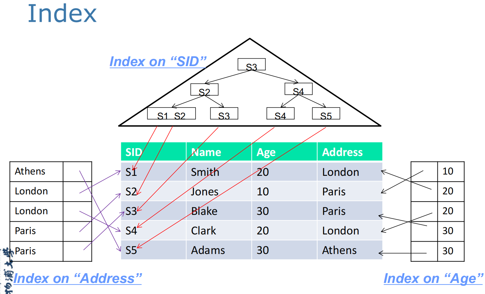

## The structure of Index  索引的结构

- **Search Key**: one or set of attributes used to look up records in a file.

  Search Key：用于在文档中查找记录的一个或一组属性。

- **Data file**: collection of blocks holding records on disk

  数据文档：在磁盘上保存记录的块的集合

- **Index file**: a data structure allowing the DBMS to find particular records in a data file more efficiently.

  索引文档：一种数据结构，允许 DBMS 更有效地在数据文档中查找特定记录。

  - An index file consists of records (called index entries) of the form: 

    索引文档由以下形式的记录（称为索引条目）组成：

    索引文档的结构： <u>**|search key 搜索码值 | pointer 指向具有该搜索码值的第一条数据记录的指针|**</u>

  - Index files are typically much smaller than the original file

    索引文档通常比原始文档小得多

- **Relationship**: a search key K in the index file is associated with a pointer to a data-file record that has search key K.

  关系：索引文档中的搜索码值 K 与指向具有搜索码值 K 的数据文档记录的指针相关联。

## Index Evaluation Metrics  索引评估指标

- Access types supported efficiently  有效支持访问类型

  - records with a specified **value** in the attribute, or (例如: name=Mark的值)

    属性中具有指定 **值** 的记录

  - records with an attribute value falling in a specified **range** (例如age between 10 and 20)

    属性值在指定 **范围** 内的记录

- Access （look up） time  访问时间

- Insertion time 插入时间

- Deletion time 删除时间

- Space overhead 空间开销

## Indexing Techniques  索引技术

Depending on the organisation of index file, an index can be:

根据索引文档的组织结构，索引可以是：

- an **ordered index** where index entries are sorted on the search key value. 

  一个**有序索引**，其中索引条目按 Search Key(搜索键) 值排序。

- a **hashing index** where hashing technique is employed to organize index entries.

  一个 **哈希索引** 其中使用哈希技术来组织索引条目。

  - There are many hashing applications, e.g. password verification, message digest/digital signature, cryptocurrency, data structures in database (hash file organization, hash index, hash join)

    有许多哈希应用进程，例如密码验证、消息摘要/数字签名、加密货币、数据库中的数据结构（哈希文档组织、哈希索引、哈希连接）

### Ordered index 顺序索引

- index entries in the index are sorted on the search key value. 

  索引中的索引项按 Search Key 值进行排序。

- An **ordered index** can be:

  有序索引可以是：

  - **Dense index**: index record appears for every search-key value in the file. 

    **稠密索引**： 索引记录将针对文档中的每个 search-key 值显示；

  - **Sparse index**: contains index records for only some search-key(搜索码) values.

    **稀疏索引**：仅包含某些搜索键值的索引记录；在稀疏索引中，只为搜索码的某些值建立索引项。只有当关系按搜索码顺序存储时才能使用稀疏索引。换句话说，只有索引是聚集索引时才能使用稀疏索引。

  - **Clustering Index （Primary index）** **聚集索引**: 排序与数据存储一致，只有一个，快速范围查询。**不一定非要是主键**，也可以使candidate key（候选键）

    一个索引，其搜索键指定文档的顺序。

    - **数据物理排序**：在聚集索引中，数据表中的行按照索引列的顺序进行物理排序。这意味着表中的数据实际存储顺序与聚集索引顺序一致。由于数据行按聚集索引的顺序排列，因此每个表只能有一个聚集索引。

    - **快速检索**：由于数据直接按照索引列排序，当查询基于聚集索引列时，检索速度非常快。适用于需要频繁排序或范围查询的列。

    - **示例**：假设你有一个包含用户信息的表，用户ID是主键，并且创建了聚集索引。数据表中的记录会按用户ID排序并存储。
    - can be sparse

  - **Nonclustering Index (Secondary index)** **非聚集索引**: 独立存储，多个索引可存在，适合多个查询优化。

    一个索引，其搜索键指定的顺序与文档的 Sequences 顺序不同。例如数据表的索引是根据id，但是你提供的search key是name

    - **独立存储**：非聚集索引则在数据表之外存储。它包含索引列的值和指向表中实际数据行的指针。因此，数据的物理存储顺序与非聚集索引顺序无关。一个表可以有多个非聚集索引。
    - **查找过程**：当使用非聚集索引列进行查询时，数据库先通过索引找到指针，然后再根据指针访问实际的数据行。这可能会稍慢于聚集索引，特别是在大数据集上。
    - **示例**：如果在同一个用户信息表中创建一个非聚集索引来优化查询用户的电子邮件地址，索引将包含电子邮件地址及其对应的指针，而数据仍按用户ID排序存储。
    - Can not be sparse

- 按聚集索引顺序对文件进行顺序扫描是非常有效的，因为文件中记录的物理存储顺序和索引顺序一直。但是我们不能（除了极少数情况外）使用存储文件的物理顺序既和聚集索引的搜索码顺序相同，又和辅助顺序的搜索码顺序相同。由于辅助码的顺序和物理码的顺序不同，因为如果我们想要按照辅助码的顺序进行扫描，那么没读一条记录都很有可能从磁盘读入一个新的块，这是很慢的。

- **Index-sequential file**: ordered sequential file with a primary index.

- **A typical example is one index entry per block**. *This assumption is used throughout this module*

  一个典型的例子是每个区块一个索引条目。

#### Dense Index 稠密索引

Dense index - index record appears for every search-key value in the file. 

对于文档中的每个搜索键值，都会显示稠密索引的索引记录。

在稠密索引中，文件中的每一个搜索值都有一个索引项。在稠密聚集索引中，索引项包换搜索码值以及指向具有该搜索码值的第一条数据记录的指针。具有相同搜索码值的其余记录顺序地存储在第一条数据记录之后，由于该索引是聚集索引，因此记录根据相同的搜索码值排序。

- e.g. index on *ID* attribute of instructor relation

  例如，讲师关系的 *ID* 属性上的索引

  例如我们要找ID为22222的教师记录，使用**稠密索引**，可以顺着指针直接找到第一条符合的记录。因为ID是主码（primary key），所以数据库中只存在一条这样的记录。于是搜索完成。

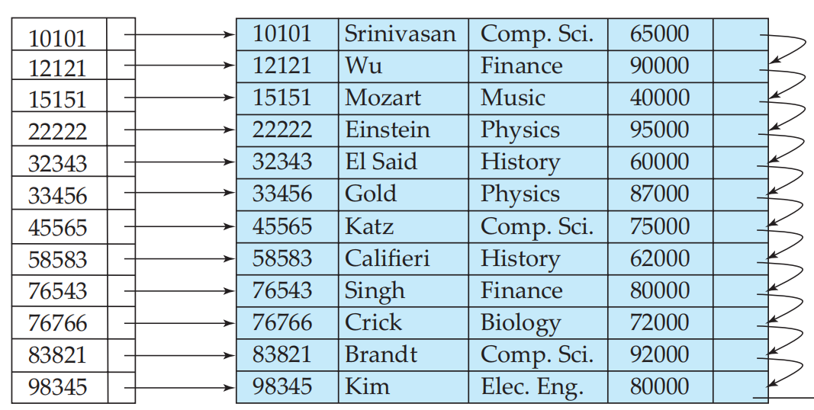

Dense index - index record appears for every search-key value in the file.

对于文档中的每个搜索键值，都可作为稠密索引的索引记录。

- e.g. Dense index on *dept_name*, with *instructor* relation sorted on *dept_name*

  例如：下面有关教师关系的表的**稠密索引**依赖的索引列属于department_name属性；这里属于是稠密索引的原因是这里使用了所有的dept_name。

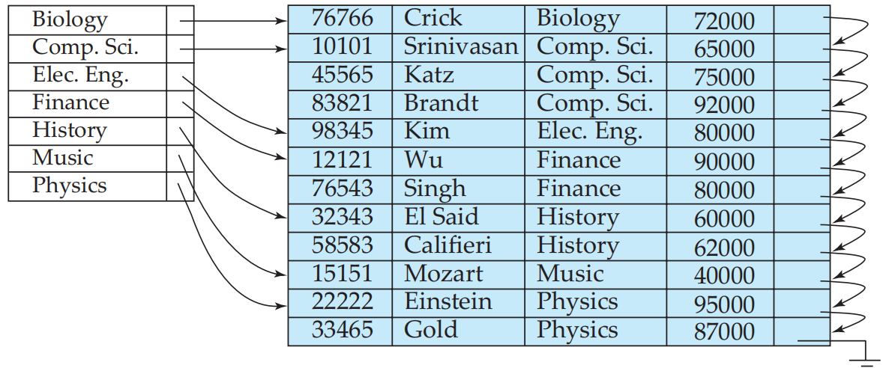

#### Sparse Index 稀疏索引

Sparse Index - contains index records for only some search-key values.

仅包含某些搜索键值的索引记录。

在稀疏索引中，只为搜索码的某些值建立索引项。只有当关系按照搜索码排列顺序存储的时候才能使用稀疏索引，换句话说，**只有索引是聚集索引时才能使用稀疏索引**。和稠密索引一样，每个索引项也包括一个搜索码值和指向具有该搜索码值的第一条记录的指针。为了定位一条记录，我们找到起最大的搜索码值小雨或者等于所差记录的搜索码值的索引项。然后从该索引项指向的记录开始，沿着文件中的指针查找，直到找到所需要的记录为止。

- Applicable when records are sequentially ordered on search-key

  当记录按搜索码顺序排序时适用

- To locate a record with search-key value **K** 

  查找搜索码值为 **K** 的记录

  - Find index record with largest search-key **value<K**

    查找具有最大搜索码的索引记录 value < K

  - Search file sequentially starting at the record to which the index record points

    从索引记录指向的记录开始按顺序搜索文档

- e.g. **稀疏索引**只包含某些索引项，因此如果提供的搜索码值符合表格中的数据，则可以直接通过指针找到对应的记录。如果不在搜索码值中，找到小于并且最接近的值，然后再在记录表中顺序向下搜索。

  例如下面，如果找22222老师，则没办法直接找到对应ID为22222的索引项，因此找22222之前的一项为10101， 然后循着该指针查找，然后按照顺序读取instructor文件，知道找到所需要的记录

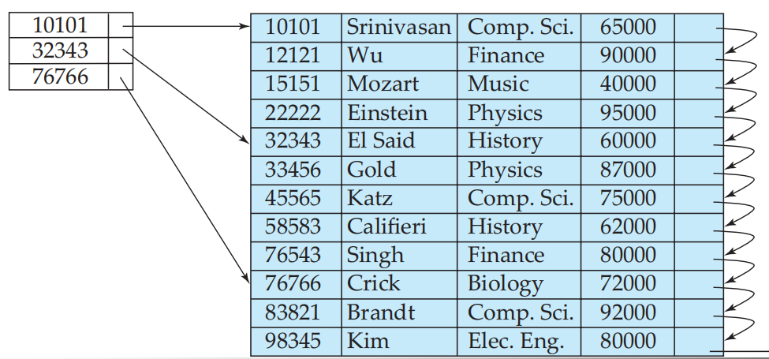

#### Dense Index VS. Sparse Index

- Index size  索引大小
  - Sparse index is smaller  稀疏索引较小

- Requirement on data file  对数据文档的要求

  - The data file must be sequential file for sparse index

    数据文档必须是稀疏索引的 sequential 文档

- Lookup  查找

  - Sparse index may fit in memory

    稀疏索引可能适合内存

  - Dense index can directly tell if a record exists

    密集索引可以直接判断记录是否存在

- Update  更新

  - Sparse index requires less space and maintenance for insertion and deletion

    稀疏索引需要更少的空间和插入和删除维护

- Good tradeoff: 更好地权衡

  - sparse index with an index entry for every block in file, corresponding to the least search-key value in the block.

    稀疏索引，文档中每个块都有一个索引条目，对应于块中最小的 search-key 值。

#### Secondary Indexing

对每个search key都有一个索引项，并且对文件中的每条记录都有一个指针。如果index file只存储部分的search key，两个有索引项的search key之间的search key所对应的记录可以存在于文件的任何地方，并且我们通常只能扫描整个文件才能找到它们。因为两个提供的search key之间所存储的entries并没有顺序。

- Index record points to a bucket that contains pointers to all the actual records with that particular search-key value.

  索引记录指向一个存储bucket，该存储bucket包含指向具有该特定 search-key 值的所有实际记录的指针。

- Secondary indices have to be dense

  **辅助索引（非聚集索引）必须只能搭配稠密索引**

  - Example: secondary index on *salary* field of instructor relation 按照工资属性作为表关系
  - 如果非聚集索引的search key不是一个候选码，仅仅具有指向每个search key的第一条记录的指针是不够的。具有同一个search key的其他记录可能分布在文件的任何地方，因为记录按聚集索引而不是辅助索引的search key存放。因此，非聚集索引必须包含指向每一条记录的指针。
  - 如下就是利用一个附加的间接指针层来实现非候选码的搜索码上的非聚集索引。在这样的非聚集索引中指针并不直接指向文件，而是指像一个包含文件指针的bucket。如下，数据表是按照index排列，因此在索引码salary上使用了一个附加的间接指针层。

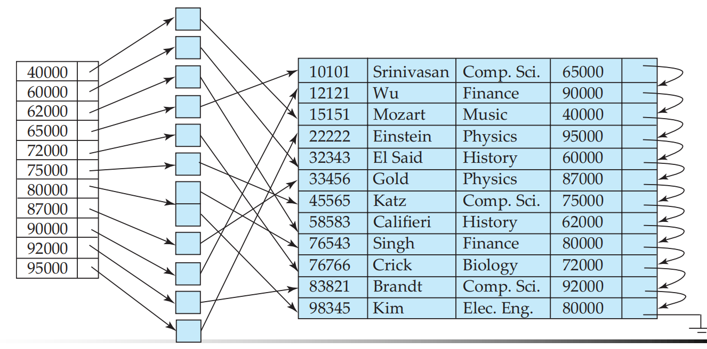

#### Primary key and Secondary Key

- **Updating** indices imposes overhead on database modification.

  更新索引会给数据库修改带来开销。

  - When a record is inserted or deleted, every index on the relation must be updated

    插入或删除记录时，必须更新关系上的每个索引

  - When a record is updated, any index on an updated attribute must be updated

    更新记录时，必须更新已更新属性上的任何索引

- Sequential scan 顺序扫描

  - Using a primary index is efficient

    使用主索引非常高效

  - Using a secondary index is expensive 

    使用二级索引的成本很高

    - Each record access may fetch a new block from disk

      每个记录访问都可以从磁盘获取一个新块

    - Block fetch requires about 5 to 10 milliseconds; versus about 100 nanoseconds for memory access

      区块获取大约需要 5 到 10 毫秒;而内存访问大约需要 100 纳秒

#### Multilevel Index (Index on index) 多码上的索引

- If primary index does not fit in memory, access becomes expensive.

  如果主索引不适合内存，则访问成本会变得很高。

- Solution: treat primary index kept on disk as a sequential file and construct a sparse index on it.

  解决方案：将保存在磁盘上的主索引视为顺序文档，并在其上构建稀疏索引。

  - outer index – a sparse index of primary index

    外部索引 – 主索引的稀疏索引

  - inner index – the primary index file

    内部索引 – 主索引文档

- If even outer index is too large to fit in main memory, yet another level of index can be created, and so on.

  如果外部索引太大而无法放入主内存，则可以创建另一级索引，依此类推。

- Indices at all levels must be updated on insertion or deletion from the file.

  从文档中插入或删除时，必须更新所有级别的索引。

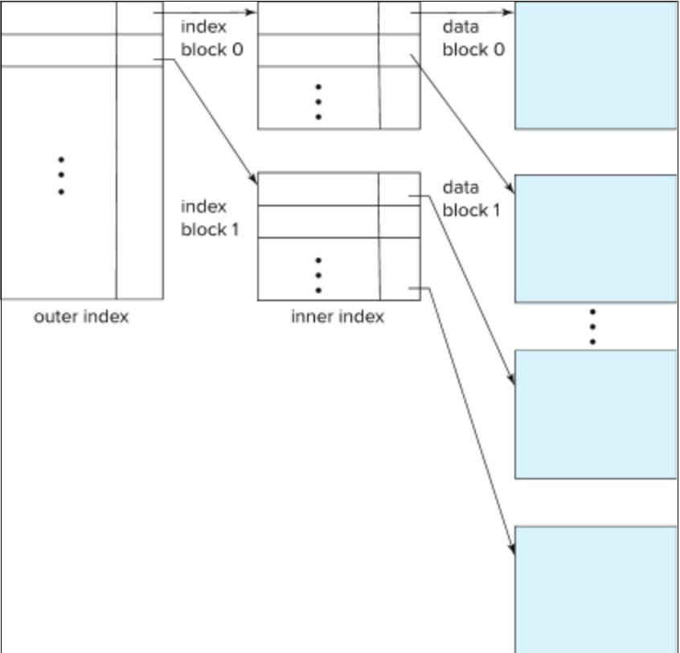

## Index Definition in SQL 

- Create an index

  - create index <index-name> on <relation-name> (<attribute-list>)

  - e.g. create index b-index on branch(branch_name)

- To drop an index 
  - drop index <index-name>

- Most database systems allow specification of type of index.

## B+ Tree

**假设n=3， ⌈n/2⌉=2（向上取整），  ⌊n/2⌋=1（向下取整）**

### Tree index

- Disadvantage of indexed-sequential files 索引顺序文档的缺点

  - Performance degrades as file grows, since many overflow blocks (new blocks for the index) get created. 

    性能会随着文档的增长而降低，因为会创建许多溢出块（索引的新块）

  - Periodic reorganization of entire file is required.

    需要定期重组整个文档。

- Advantage of B+ tree index files  B+ 树索引文档的优势

  - Automatically reorganizes itself with small, local changes, in the face of insertions and deletions. 

    在面对插入和删除时，通过较小的本地更改自动重新组织自身。

  - Reorganization of entire file is not required to maintain performance.

    不需要重组整个文档来保持性能。

- (Minor) disadvantage of B+ trees
  
  B+ 树的（次要）缺点
  
  - Extra insertion and deletion overhead, space overhead.
  
    额外的插入和删除开销、空间开销。
  
- Advantages of B+trees **outweigh** disadvantages  
  
  B + 树的优点 **大于** 缺点
  
  - B+ trees are used extensively
  
    B+ 树被广泛使用

### Properties

B+树索引结构是在数据插入和删除的情况下仍然能够保持其执行效率的几种使用最广泛地索引结构之一。B+树索引采用平衡树（Balancing tree或B tree）的结构，其中树根到树叶的每条路径的长度相同。树中每个非叶节点有[n/2] ~ n个子节点，其中n对特定的树是固定的。

在使用B+树结构的时候会增加文件插入和删除处理的性能开销，同时会增加空间开销。但是即使对更新频率较高的文件来说，这种开销也是可以接受的，因为这样能够减小文件重组的代价。

- B+-Tree is “short” and “Fat”

  - Disk-based: usually one node per block; large fan out

    基于磁盘：通常每个块一个节点;大扇形输出

  - Balanced (more or less): good performance guarantee.

    平衡（或多或少）：良好的性能保证。

- A typical B+Tree node  典型的 B+Tree 节点

  - Ki are the search-key values

  - Pi are pointers to children (for non-leaf nodes) or pointers to records or buckets of records (for leaf nodes)
  - B+树最多包含n-1个search key k1, k2, ..., kn-1，以及n个指针P1, P2, ...Pn。每个结点中的search key排序存放，因此，如果i < j，那么ki < kj (假设目前没有重复的码值)

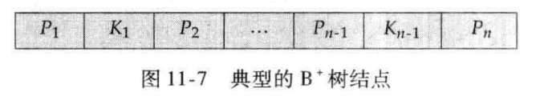

- In a B+ tree

  - **n** (or sometimes *N*) is the **number of pointers** in a node

    n（有时是 *N*）是节点中的**指针数**

  - Pointers: P1, P2, ...Pn

    一个叶节点中pointer最多可以存放n个

  - Search keys (no repetitive values): k1, k2, ..., kn-1

    一个叶节点中，search value最多可以存放n-1个

  - All paths (from root to leaf) have same length

    所有路径（从根到叶）的长度相同

  - **Root must have at least two children**

    **Root 必须至少有两个子项**

  - In each **non-leaf node** (inner node), at least ‘half’ (≥ ⌈n/2⌉) pointers must be used

    **在每个非叶节点（内部节点）中，至少使用 '一半' 既树中每个非叶节点有⌈n/2⌉ ~ n个子女**

  - Each **leaf node** must contain at least ⌈(n-1)/2⌉ keys 

    **每个叶节点必须至少包含  ⌈(n-1)/2⌉ 个search key**

- Special cases: 

  - If the root is not a leaf, it has at least 2 children.

    如果根不是叶，则它至少有 2 个子项。

  - If the root is a leaf (that is, there are no other nodes in the tree), it can have between 0 and (*n*–1) values.

    如果根是叶（即树中没有其他节点），则它可以具有介于 0 和 （*n*–1） 之间的值。

- Example: B+ tree with n = 3

  - All paths have same length.  所有路径的长度都相同。

  - Root has (at least) two children  Root 有（至少）两个子项

  - In each non-leaf node (inter node), at least half (≥ ⌈3/2⌉ =2) pointers are used  

    在每个非叶节点（节点间）中，至少使用一半 （≥ ⌈3/2=2⌉ ）个指针

  - Each leaf node contains at least 「(3-1)/2)「 =1 key  

    每个叶子节点至少包含⌈（3-1）/2）⌉ =1 个键

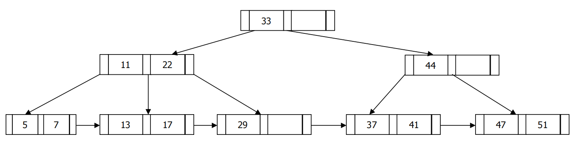

- Example2: B+-tree example with *n* = 6

  - Leaf nodes must have between 3 and 5 search key values , (「(*n*–1)/2「 and *n* –1, with *n* = 6).

    叶节点必须具有 3 到 5 个搜索键值 ，（「（*n*–1）/2「 和 *n* –1，其中 *n* = 6）。

  - Non-leaf nodes other than root must have between 3 and 6 children/pointers (「(*n*/2「 and *n* with *n* =6).

    除 root 以外的非叶节点必须具有 3 到 6 个子节点/指针（「（*n*/2「 和 *n* 与 *n* =6）。

  - Root must have at least 2 children.

    Root 必须至少有 2 个子项。

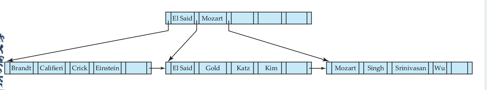

中文解释:

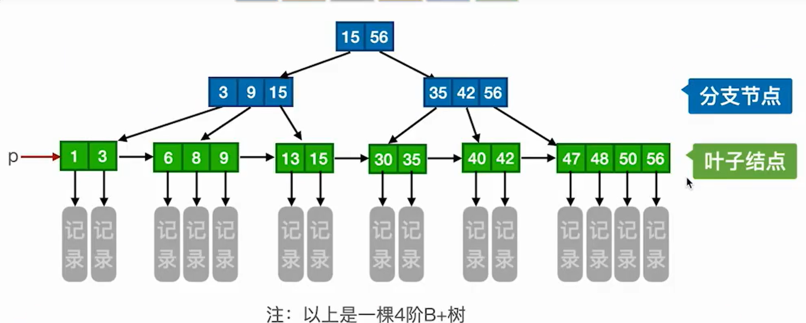

**一棵m阶的B+树需要满足以下条件**：

1. 每个分直接点最多有m课子树
2. 非叶根节点至少有两棵子树，其他每个分支节点至少有⌈m/2⌉棵子树
3. 节点的子树格式与关键字个数相等
4. 所有叶节点包含全部关键字及指向相应记录的指针，叶节点中将关键字按照大小顺序排列，并且相邻叶节点按照大小顺序相互链接起来
5. 所有分支节点中仅包含它的各个子节点中关键字的最大值及指向其子节点的指针

6. 节点中m个关键字代表m拥有m个子树

在B+树中，无论是查找成功还是查找失败，最终都是需要走到最下面的叶节点才能做出最终的判断。

### Queries on B+ Trees

- To find record with search-key value V.

  查找search key为 V 的记录。

  1. C=root

  2. While C is not a leaf node

     当 C 不是叶节点时

     2.1. Let i be least value such that V <= Ki .

     设 i 为最小值，使得 V <= Ki .

     2.2.  If no such i exists, set C = last non-null pointer in C

     如果不存在这样的 i，则设置 C = 最后一个非空指针 

     2.3.  Else { if (V = Ki ) Set C = Pi +1 else set C = Pi }

  3. Let i be least value such that Ki = V

     设 i 为最小值，使得 Ki = V

  4. If there is such a value i, follow pointer Pi to the desired record.

     如果有这样的值 i，则跟随指针 Pi 找到所需的记录。

  5. Else no record with search-key value V exists.

     否则，不存在搜索键值为 V 的记录。

- Example: to find search key '29'

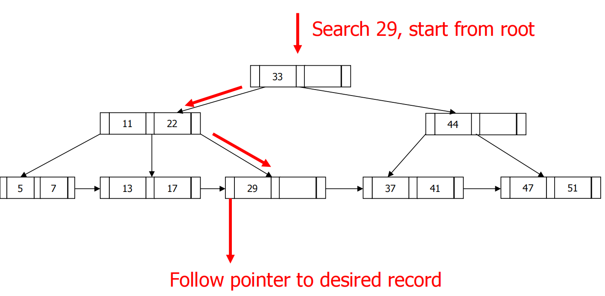

### Observations about B+ trees

- Since the inter-node connections are done by pointers, “logically” close blocks need not be “physically” close.

  由于节点间连接是通过指针完成的，因此“逻辑上”关闭的块不需要是“物理上”关闭的。

- The non-leaf levels of the B+-tree form a hierarchy of sparse indices.

  B+ 树的非叶级别形成稀疏索引的层次结构。

- If there are K search-key values in the file, The B+ tree height is **no more than** ⌈log⌈n/2⌉(K)⌉. 

  - Level below root has at least 2 values

    低于 root 的级别至少有 2 个值

  - Next level has at least 2* ⌈n/2⌉ values

    下一个级别至少有 2* ⌈n/2⌉ 的值

  - Next next level has at least 2* ⌈n/2⌉ * ⌈n/2⌉ values

    下一个级别至少有 2* ⌈n/2⌉ * ⌈n/2⌉ 值.....

- Searching can be conducted efficiently.

  可以有效地进行搜索。

  - a node is generally the same size as a disk block, typically 4 kilobytes

    节点的大小通常与磁盘块相同，通常为 4 KB

  - n is typically around 100 (40 bytes per index entry).

    n 通常约为 100（每个索引条目 40 字节）。

  - with 1 million search key values and n = 100

    具有 100 万个搜索键值且 n = 100

  - at most log50(1,000,000) = 4 nodes are accessed in a lookup.

    一次查找最多访问 log50（1,000,000） = 4 个节点。

- Insertion and deletion to the main file can also be handled efficiently, as the index can be restructured in logarithmic time.

  还可以有效地处理对主文档的插入和删除，因为索引可以在对数时间内进行重组。

### Updates on B+ Trees: Insertion

1. Find the leaf node in which the search-key value would appear

   查找 search-key 值所在的叶节点

2. If the search-key value is already present in the leaf node

   如果 search-key 值已存在于叶节点中

​	2.1. Add record to the file

​		将记录添加到文档

​	2.2. If necessary add a pointer to the bucket.

​		如有必要，请添加指向存储桶的指针。

3. If the search-key value is not present, then 

   如果 search-key 值不存在，则

​	3.1. add the record to the main file (and create a bucket if necessary)

​		将记录添加到主文档（并在必要时创建存储桶）

​	3.2. If there is room in the leaf node, insert (key-value, pointer) pair in the leaf node

​		如果叶子节点中有空间，则在叶子节点中插入 （key-value， pointer） 对

​	3.3. Otherwise, **split** the node (along with the new (key-value, pointer) entry) as discussed in the next slides.

​		否则，将 **拆分** 节点（以及新的 （key-value， pointer） 条目），如下一张幻灯片所述。

4. Splitting of nodes proceeds upwards till a node that is not full is found. 

   节点的分割会向上进行，直到找到未满的节点。

   - In the worst case the root node may be split, increasing the height of the tree by 1. 

     在最坏的情况下，根节点可能会被分割，从而将树的高度增加 1。

- **Splitting a leaf node**:

  - take the (search-key value, pointer) pairs and the one being inserted) in an in-memory area M in sorted order. Assume there are n search key values in total. 

    将 （search-key值， 指针） 对和入的对按排序顺序放入内存区域 M 中。假设总共有 n 个搜索键值。

  - Place the first ⌈n/2⌉ in the original node, and the rest in a new node.

    将第一个 ⌈n/2⌉ 放在原始节点中，其余的放在新节点中。

  - let the new node be p, and let k be the least key value in p. Insert (k,p) in the parent of the node being split. 

    让新节点为 p，让 k 为 p 中的最小键值。在要拆分的节点的父节点中插入 （k，p）。

  - If the parent is full, split it and propagate the split further up

    如果父项已满，则将其拆分并进一步向上传播拆分

- **Splitting a non-leaf node**: when inserting (k,p) into an already full internal node N

  - Copy N to an in-memory area M with space for n+1 pointers and n keys

  - Insert (k,p) into M in sorted order

  - Copy P1,K1, …, K⌈(n+1)/2⌉ -1,P⌈(n+1)/2⌉ from M back into node N

  - Copy P⌈(n+1)/2⌉+1, K⌈(n+1)/2⌉+1, …, Kn, Pn+1 from M into newly allocated node N’

  - Insert (K⌈(n+1)/2⌉,N’) into parent N

- Example of splitting a leaf node 分裂叶节点，假设此时父节点仍然有空位

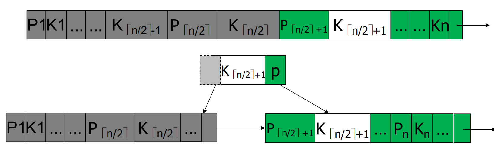

- Example of splitting a non-leaf node 分裂父节点

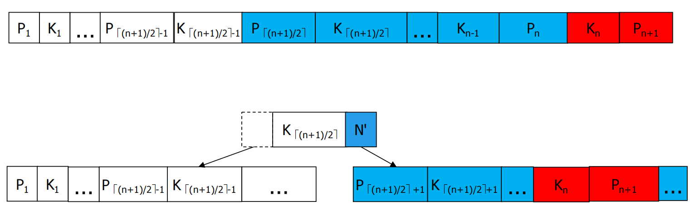

- Insertion example

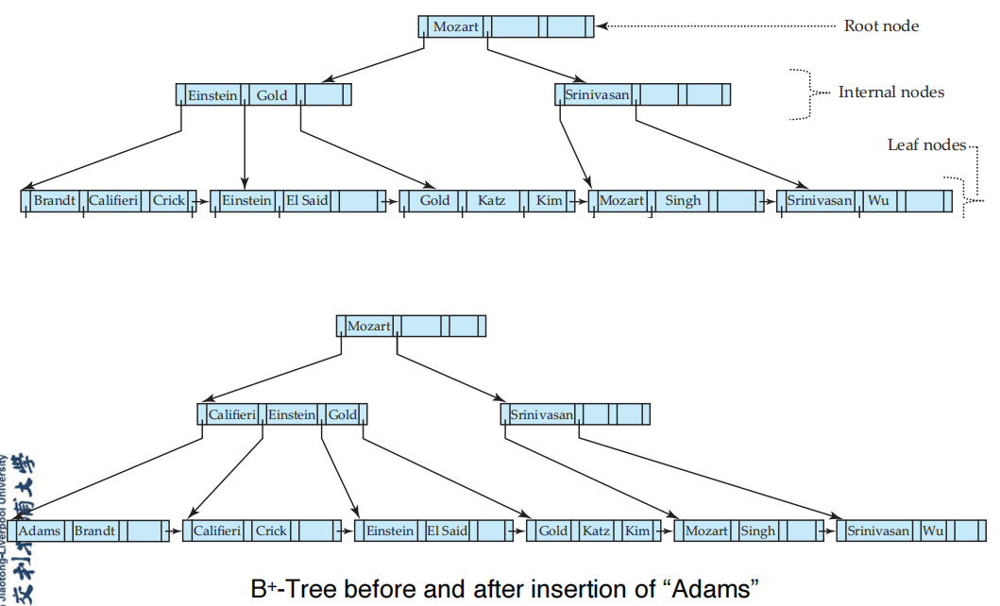

### Updates on B+ Trees: Deletion

- Find the record to be deleted, and remove it from the main file and from the bucket (if present).

  找到要删除的记录，然后将其从主文档和存储桶（如果存在）中删除。

- Remove (search-key value, pointer) from the leaf node if there is no bucket or if the bucket has become empty.

  如果没有存储桶或存储桶已为空，则从叶节点中删除 （search-key value， pointer）。

- If the node has too few entries due to the removal, and the entries in the node and a sibling fit into a single node, then **merge siblings**.

  如果节点由于删除而条目太少，并且节点和同级节点中的条目适合单个节点，则**合并同级节点**。

- Otherwise, if the node has too few entries due to the removal, but the entries in the node and a sibling do not fit into a single node, then **redistribute pointers**.

  否则，如果节点由于删除而具有太少的条目，但节点和同级节点中的条目不适合单个节点，则**重新分发指针**。

- The node deletions may cascade upwards till a node which has ⌈n/2⌉ or more pointers is found. 

  节点删除可能会向上级联，直到找到具有 ⌈n/2⌉ 或更多指针的节点。

- If the root node has only one pointer after deletion, it is deleted and the sole child becomes the root. 

  如果根节点在删除后只有一个指针，则会将其删除，唯一的子节点将成为根节点。

- *Perform* *merge siblings* *first and then* ***redistribute pointers**.* 

  先执行 *合并同级节点* 然后 **重新分配指针**。

- Merge Siblings - at Leaf Node
  - Merge siblings n1 and n2
  - Delete K (and the appropriate pointer) from parent P

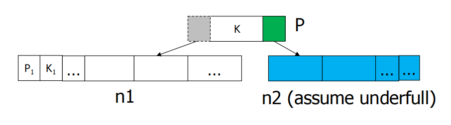

- Merge Sibling - at non Leaf Node
  - Merge siblings n1 and n2, and K
  - Delete K (and the appropriate pointer) from parent

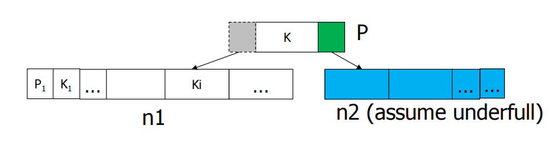

- Redistribute Pointers – at non Leaf Node
  - Copy K from parent P and add it to n2
  - Replace the old value K in parent P with Ki from n1
  - Delete Ki from n1

找到要删除的记录，并从主文件和bucket(如果存在)中删除它
如果没有bucket或bucket已为空，则从叶节点删除(搜索键值、指针)。
如果节点由于删除而有太少的条目，并且节点和同级节点中的条目可合并成单个节点(加起来不超过n-1) ，那么合并兄弟节点。
否则，如果该节点由于删除而有太少(非叶节点少于(n + 1) / 2，叶子节点少于(n - 1) / 2)的k，但该节点及其兄弟节点中的k(加起来超过n-1)不能合并单个节点，则重新分配指针向兄弟节点借一个相邻的k过来 。
需要注意更新父节点中的索引k
节点删除可以向上级联，直到找到一个具有[n/2]或更多指针的节点。
如果根节点在删除后只有一个指针，它将被删除，唯一的子节点成为根节点

- Delete Example1

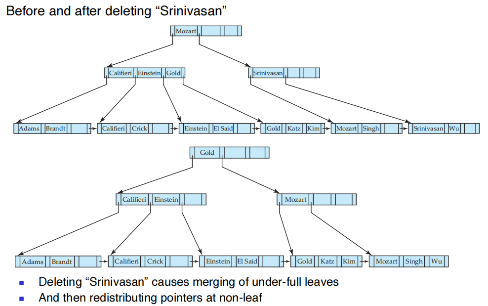

- Delete Example2

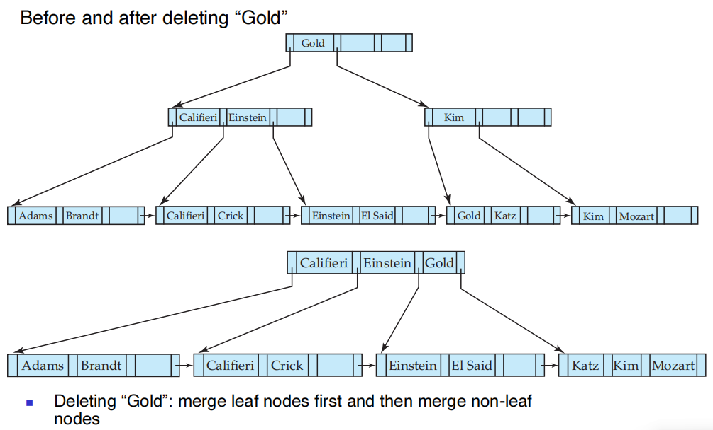

### B+ Tree construction example

Construct a B+ tree for the following set of key values for n=3. **( 2, 3, 5, 7, 11, 13, 17)**

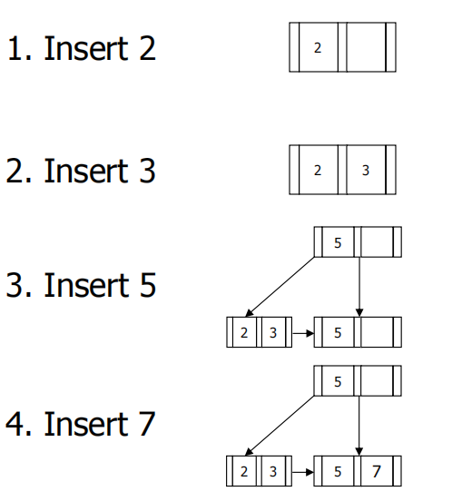

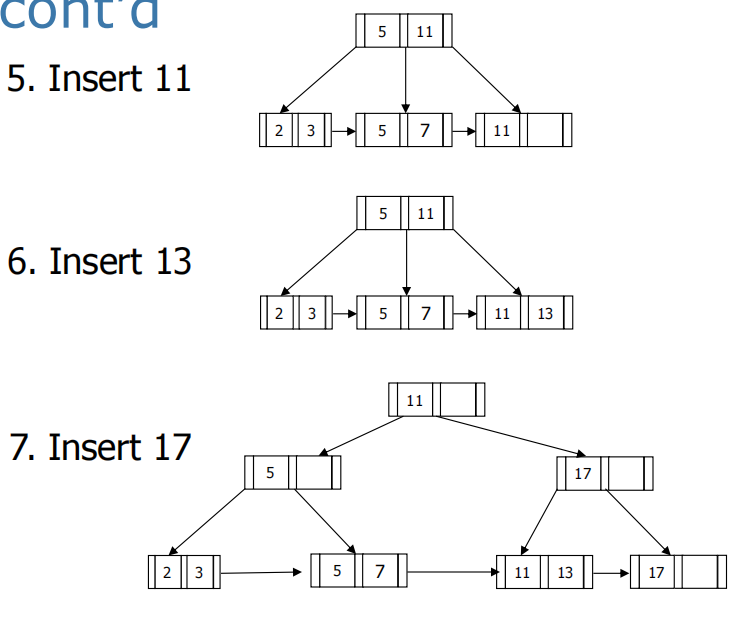

### Deletion Example

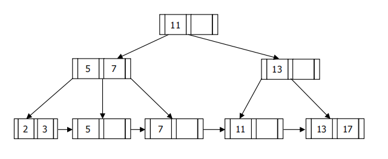

- Initial tree shown above

  - (1). Delete 5, then delete 11 from the above figure, what does the tree look like?

    从上图中删除 5，然后删除 11，树是什幺样子的？

    - Delete 5: merge with either left or right sibling.

      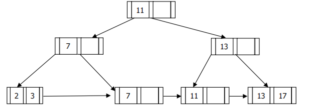

    - Then delete 11: merge sibling at leaf and then merge again at non-leaf.

      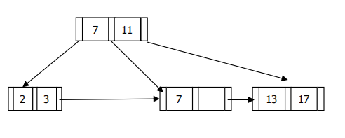

  - (2). With the initial tree, delete 11 from the above figure, what does the tree look like?

    对于初始树，从上图中删除 11，树是什么样子的？

    -  Delete 11: merge sibling at leaf and then redistribute pointer at non-leaf.

      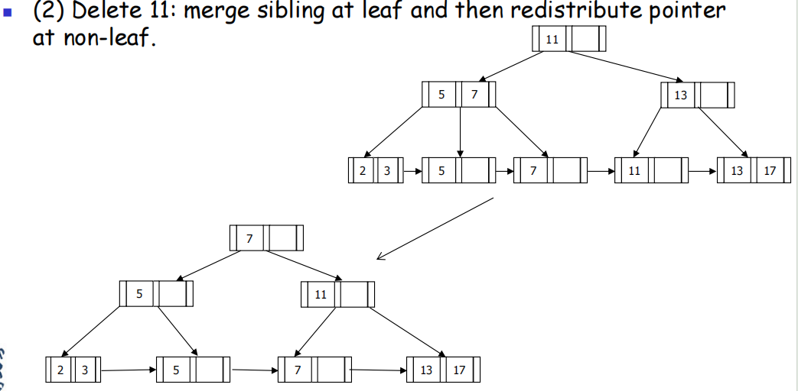

    - Note: redistribute pointer at the leaf also solves the problem. However, as the algorithm in the textbook suggests, perform merge sibling first.

      注意：在叶子上重新分发指针也可以解决这个问题。但是，正如教科书中的算法所建议的，首先执行 merge sibling。

### Insertion Example

-  Consider the following B+ tree. The number of pointers that fits in one node is 4. 

- Draw the trees after each of the following update operations is performed (Subsequent operations are performed based on the previous ones).

  1. Insert 33

  2. Insert 11

  3. Delete 25

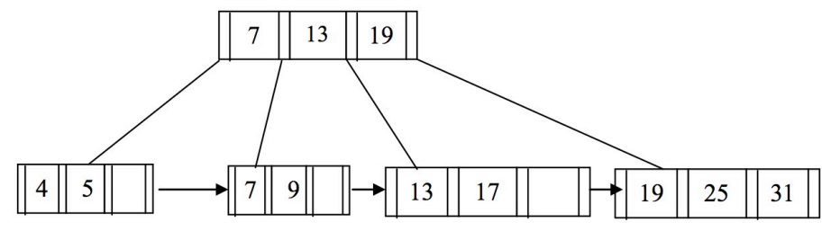

- Insert 33 (split at leaf and then split at non-leaf)

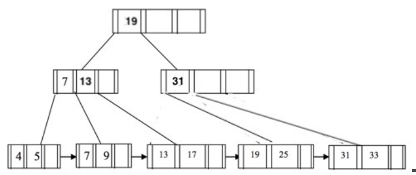

- Insert 11

- Delete 25 (merge siblings at leaf and then merge again at non-leaf)

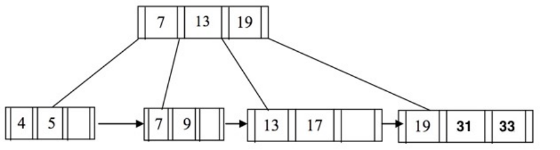
