# Introduction to Relational Model

**Six basic relational algebra operators：**

- select: σ

- project: ∏

- union: ∪

- set difference: –

- Cartesian product 笛卡尔乘积: x

- rename: ρ（rho）

**Additional Operations**

- Set intersection

- Natural join

- Division

- Assignment

## Relation Schema, Instance and Attributes 

- A<sub>1</sub>, A<sub>2</sub>, …, A<sub>n</sub> are attributes

- R = (A<sub>1</sub>, A<sub>2</sub>, …, A<sub>n</sub> ) is a relation schema 

  R = （A1， A2， ...， An ） 是一个关系架构

  - Example: instructor = (ID, name, dept_name, salary)

    示例：instructor = （ID， 姓名， dept_name， 薪水）

- A relation instance r defined over schema **R** is denoted by **r (R)**.

  在模式 R 上定义的关系实例 r 由 r （R） 表示。

- The current values in a relation are specified by a **table**

  关系中的当前值由 **table** 指定

- An element **t** of relation **r** is called a tuple and is represented by a **row** in a table

  关系 **r** 的元素 **t** 称为元组，由表中的 **row** 表示

- The set of allowed values for each attribute is called the **domain**of the attribute

  每个属性的允许值集称为属性的 **domain**

- Attribute values are (normally) required to be **atomic**; that is, indivisible

  属性值（通常）要求为 **atomic**;也就是说，不可分割

- The special value **null** is a member of every domain, indicating that the value is “unknown”

  特殊值 **null** 是每个域的成员，表示该值为 “unknown”

Example:

- Attributes 属性名: *ID, name, dept_name, salary*

- Schema 表名: *instructor* (*ID, name, dept_name, salary*)

- Instance 实例: rows in the relation

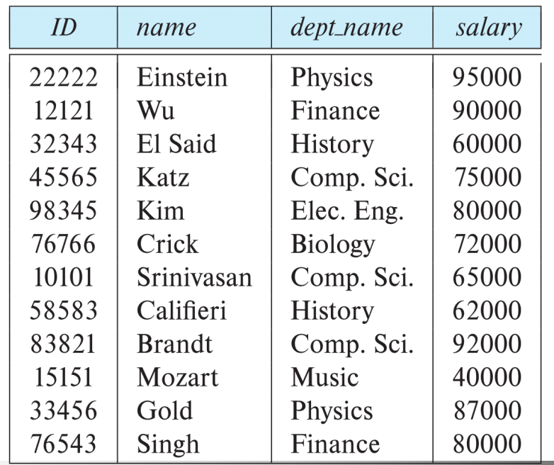

## Keys 键

- Let **K ⊆ R**

  键属于Scheme R，湿气重的一个特殊的attribute

- *K* is a **superkey** of *R* if values for *K* are sufficient to identify a unique tuple of each possible relation *r(R)*

  如果 *K* 的值足以标识每个可能关系 *r（R）* 的唯一元组，则 *K* 是 *R* 的 **超键**

  - Example: {*ID*} and {ID,name} are both **superkeys** of *instructor.*

    示例：{*ID*} 和 {ID，name} 都是 *instructor* 的 **超键**。

- Superkey *K* is a **candidate key** if *K* is minimal

  如果 *K* 最小，则超级键 *K* 是 **候选键**

  - Example: {*ID*} is a candidate key for *Instructor*

    示例：{*ID*} 是 *Instructor* 的候选键

  - One of the candidate keys is selected to be the **primary key**.

    选择其中一个候选键作为 **主键**。

- **Foreign key** constraint: value in one relation must appear in another

  **外键** 约束：一个关系中的值必须出现在另一个关系中

  - **Referencing** relation and **Referenced** relation

    **引用** 关系和 **引用** 关系

  - Example: **dept_name** in instructor is a foreign key from instructor referencing department

    示例：讲师中的 **dept_name** 是讲师引用部门的外键

## Relational Algebra 关系代数

Why & What

- Similar to normal algebra (as in 2+3*x-y), except we use relations as values instead of numbers, and the operations and operators are different. 

  与普通代数类似（如 2+3*x-y），不同之处在于我们使用关系作为值而不是数字，并且运算和运算符不同。

- Not used as a query language in actual DBMSs. (SQL instead.) 

  在实际 DBMS 中不用作查询语言。

- The inner, lower-level operations of a relational DBMS are, or are similar to, relational algebra operations. We need to know about relational algebra to understand query execution and optimisation in a relational DBMS. 

  关系 DBMS 的内部较低级别运算是或类似于关系代数运算。我们需要了解关系代数，才能理解关系 DBMS 中的查询执行和优化。

- Some advanced SQL queries requires explicit relational algebra operations, most commonly *outer join*. 

  一些高级 SQL 查询需要显式关系代数运算，最常见的是 *outer join*。

- Relations are seen as *sets of tuples*, which means that **no duplicates** are allowed. SQL behaves differently in some cases. Remember the SQL keyword distinct. 

  关系被视为 *元组集*，这意味着不允许重复。在某些情况下，SQL 的行为有所不同。请记住 SQL 关键字 distinct。

- SQL is ***declarative***, which means that you tell the DBMS *what* you want, but not *how* it is to be calculated. A C++ or Java program is *b*, which means that you have to state, step by step, exactly how the result should be calculated. Relational algebra is (more) procedural than SQL. (Actually, relational algebra is mathematical expressions.) 

  SQL 是 *声明性的*，这意味着你告诉 DBMS 你想要什幺，而不是 *如何计算*它。C++ 或 Java 进程是 *过程性的*，这意味着您必须逐步说明应该如何计算结果。关系代数比 SQL 更（更）过程化。（实际上，关系代数是数学表达式。）

## Concepts and Operations from Set Theory  集合论的概念和运算

- **Relations** in relational algebra are seen as **sets of tuple**s, so we can use basic **set operations**. 

  关系代数中的关系被视为元组集，因此我们可以使用基本的集合操作。

  - set 

    设置

  - element 

    元素

  - no duplicate elements (but: multiset = bag) 

    没有重复的元素（但是：multiset = bag）

  - no order among the elements (but: ordered set) 

    元素之间没有顺序（但是：有序集）

  - subset 

    子集

  - proper subset (with fewer elements) 

    适当的子集（元素较少）

  - superset 

    超集

  - union 

    并集

  - intersection 

    交集

  - set difference 

    设置差异

  - Cartesian product (cross-product)

    笛卡尔积（叉积）

## Relational Algebra Operations  关系代数运算

见开头

### Definition

A **basic expression** in the relational algebra consists of either one of the following:

关系代数中的 **基本表达式** 由以下任一内容组成：

- A relation in the database

  数据库中的关系

- A constant relation

  常数关系

Let *E<sub>1</sub>* and *E<sub>2</sub>* be relational algebra expressions; the following are **all** relational-algebra expressions:

设 *E1* 和 *E2* 是关系代数表达式;以下是 **所有** 关系代数表达式：

- *E<sub>1</sub>* ∪ *E<sub>2</sub>*

- *E<sub>1</sub>* – *E<sub>2</sub>*

- *E<sub>1</sub>* x *E<sub>2</sub>*

- σ<sub>p</sub> (*E<sub>1</sub>*), *p* is a predicate on attributes in *E<sub>1</sub>*

- ∏<sub>s</sub>(*E<sub>1</sub>*), *S* is a list consisting of some of the attributes in *E<sub>1</sub>*

- ρ<sub>x</sub>(*E<sub>1</sub>*), x is the new name for the result of *E<sub>1</sub>*

### Select Operation 查询操作

- Notation: σ<sub>p</sub>(*r*)

- *p* is called the **selection predicate**

  p称为 **选择谓词** （在数据库术语中，**selection predicate（选择谓词）**是用于指定查询条件的表达式，它决定了哪些记录（或元组）应被选择或保留在查询结果中，例如select * from employees where salary > 5000, 那么salary > 5000 就是一个选择谓词）

- Defined as:

  - *σ<sub>p</sub>*(**r**) = {*t* | *t* ∈ *r* **and** *p(t)*}

  - Where *p* is a formula in propositional calculus consisting of **terms** connected by :  ∧(**and**), ∨(**or**), ¬(**not**)

  - Each term is one of:

    <attribute>*op* (<attribute> or <constant>)

     *op* is one of: =, ≠, >, ≥, <, ≤

  - Example of selection:
    - σ<sub>branch_name=“Perryridge”</sub>(account)

- Example:

  - Relation r

    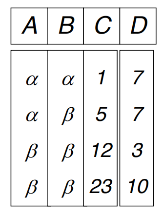

  - σ<sub>A=B ^ D > 5</sub>(r)

    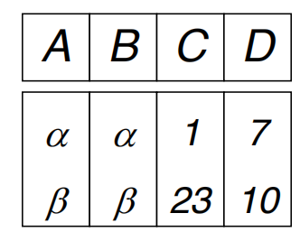

### Project Operation 投影操作

投影操作可以用来获取数据库中的指定信息，而无需获取所有的数据。它允许用户选择性地查看表中的某些列，从而简化数据的表示和分析。

- Notation:

  - ∏<sub>A<sub>1</sub>, A<sub>2</sub>, …, A<sub>k</sub></sub>(r)
  - where *A<sub>1</sub>, A<sub>2</sub>, …, A<sub>k</sub>* are attribute names and *r* is a relation(table) name.

- The result is defined as the relation of *k* columns obtained by **erasing** the columns that are not listed.

  结果定义为通过**擦除**未列出的列而获得的 *k* 列的关系。

- **Duplicate** rows removed from result, since relations are sets.

  从结果中删除 **重复** 行，因为关系是集合的。

- Example: to eliminate the *branch_name* attribute of *account* (branch_name, account_number, balance) 

  示例：要消除 *account* 的 *branch_name* 属性（branch_name、account_number、余额）**存疑！问一下**

  - ∏<sub>branch_name, balance</sub>(account)

- Example:

  - Relation r

    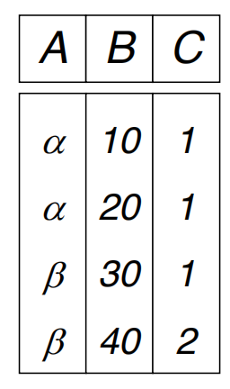

  - ∏<sub>A,C</sub> (*r*)

    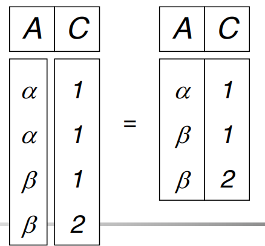

### Union Operation 合并操作

- Notation: r ∪ s

- Defined as:

  - r ∪ s = {*t* | *t* ∈ *r* **or** *t* ∈ *s*}

- **For *r* ∪ *s* to be valid.**

  1. *r, s* must have the *same* **arity** (same number of attributes)

     r， s 必须具有 *相同* **arity** （相同数量的属性）

  2. The attribute domains must be **compatible** (example: 2nd column of *r* deals with the same type of values as does the 2nd column of *s*)

     属性域必须 **兼容** （例如： *r* 的第 2 列与 *s* 的第 2 列处理相同类型的值）

- Example: to find all customers with either an account or a loan

  示例：查找具有帐户或贷款的所有客户

  - ∏<sub>customer_name</sub>(depositor) ∪ ∏<sub>customer_name</sub>(borrower)

- Example

  - Relation r, s:

    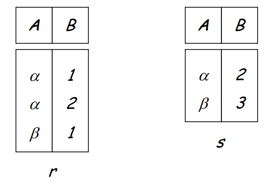

  - r ∪ s

    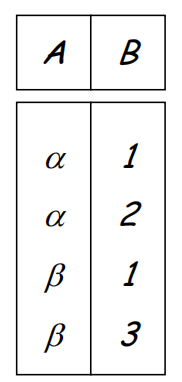

### Set difference Operation 集合差运算

集合差运算是指从一个集合中去掉另一个集合中所有元素后剩下的元素组成的集合。用数学符号表示，如果有两个集合r和s，那么r与s的差集（或称为r对s的差集）表示为r-s，其结果是一个新的集合，包含所有在r中但不在s中的元素，去掉r中与s共有的entry。

- Notation *r – s*

- Defined as:
  - *r – s* = {*t* | *t* ∈ *r* **and** t ∉ *s*}

- Set differences must be taken between **compatible** relations.

  必须在 **compatible** 关系之间取 set differences。 

  - *r* and *s* must have the **same arity**

    *r* 和 *s* 必须具有相同的 **arity**

  - attribute domains of *r* and *s* must be **compatible**

    属性域 *r* 和 *s* 必须 **兼容**

- Example

  - Relations *r*, *s*

    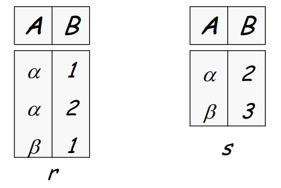

  - *r – s* 在r中但是不再s中集合

    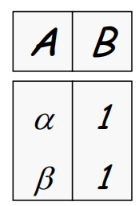

### Cartesian-Product Operation  笛卡尔积运算

笛卡尔积运算是指将两个或多个关系（表）中的记录进行组合，生成一个新的关系（表），其中新关系中的记录是原关系中所有记录的组合。具体来说，如果有两个关系r(A,B)和s(C,D)，那么r和s的笛卡尔积运算结果是一个新的关系，其属性为(A,B,C,D)，记录数为r的记录数乘以s的记录数。

- Notation *r* x *s*

- Defined as:
  - *r* x *s* = {*t q* | *t* ∈*r* **and** *q* ∈ *s*}

- Assume that attributes of r(R) and s(S) are **disjoint**, that is, *R* ∩ *S* = ∅.

  假设 r(R)和 s(S)的属性**互不相交**，即 *R* ∩ *S* = ∅。

- If attributes of *r(R)* and *s(S*) are not disjoint, then **renaming** must be used

  如果 *r（R）* 和 *s（S*） 的属性不相交，则必须使用 **renaming**

- Example

  - Relations *r, s*

    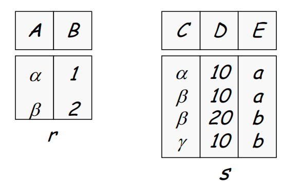

  - *r* x *s*

    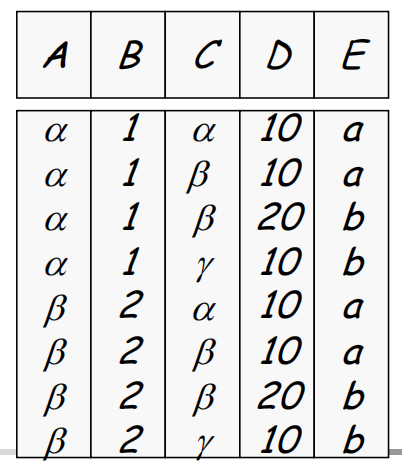

### Composition of Operations 组合运算

- Can build expressions using **multiple** operations

  可以使用 **multiple** 操作构建表达式

- Example: σ<sub>A=C</sub>(*r* x *s*)

  - *r* x *s*

    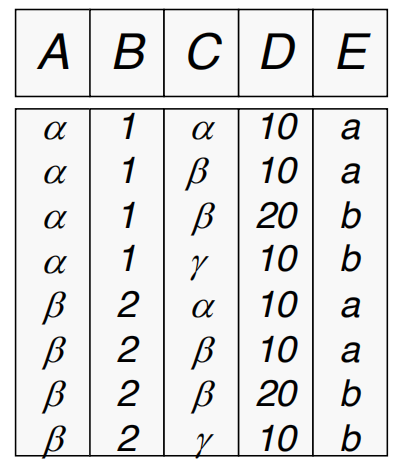

  - σ<sub>A=C</sub>(*r* x *s*)

    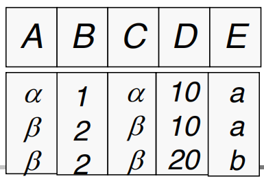


### Rename Operation 重命名操作

将数据库中的某个对象（如表、列等）的当前名称更改为新名称的操作。这种操作通常用于以下情况：

- 对象的当前名称不再准确反映其用途或内容。
- 需要提高数据库对象的可读性，以便更容易地理解和使用。
- 在数据库重构或优化过程中，需要调整对象名称以符合新的命名规范。

- Allows us to **rename**, and therefore to **refer to**, the results of relational algebra expressions.

  允许我们 **重命名**，因此 **引用** 关系代数表达式的结果。

- Allows us to refer to a relation by more than one name.

  允许我们用多个名称来引用一个关系。

- Example:
  - ρ x (E)
  - returns the expression *E* under the name *X*
- If a relational algebra expression *E* has arity *n*, then
  - ρ x <sub>(A<sub>1</sub>, A<sub>2</sub>, …, A<sub>k</sub>)</sub>(E)
  - returns the result of expression *E* under the name *X*, and with the attributes renamed to A<sub>1</sub>, A<sub>2</sub>, …, A<sub>k</sub>

示例：

```sql
ALTER TABLE table_name RENAME COLUMN old_column_name TO new_column_name;
```

### Banking Example

*branch (branch_name, branch_city, assets)*

*customer (customer_name, customer_street, customer_city)*

*account (account_number, branch_name, balance)*

*loan (loan_number, branch_name, amount)*

*depositor (customer_name, account_number)*

*borrower (customer_name, loan_number)*


### Queries Example

- Find all loans of over $1,200

  - σ<sub>*amount* > 1,200</sub> (*loan*)

- Find the names of all customers who have a loan at the Perryridge branch.

  - ∏<sub>customer_name</sub> (σ<sub>branch_name = “Perryridge”</sub> (

    σ<sub>borrower.loan_number = loan.loan_number</sub> (borrower x loan)))

  OR

  - ∏<sub>customer_name(sloan.loan_number = borrower.loan_number</sub> (

    (σ<sub>branch_name = “Perryridge”</sub> (loan)) x borrower))

- Find the largest account balance

  找到最大的账户余额

  - Strategy:

    - Find those balances that are *not* the largest

      找到那些 *不是* 最大的余额

      - Rename *account* relation as *d* so that we can compare each account balance with all others

        将 *account* 关系重命名为 *d*，以便我们可以将每个账户余额与所有其他账户余额进行比较
  
    - Use set difference to find those account balances that were *not* found in the earlier step.
    
      使用 set difference 来查找在前面的步骤中未找到的那些账户余额。
    
      - ∏<sub>*balance*</sub>(account) - ∏<sub>*account.balance*</sub>(∏<sub>*account.balance < d.balance*</sub> (*account x* *ρ<sub>d</sub>* *(account*)))
      

### Additional Operations

- Set intersection

- Natural join

- Division

- Assignment

### Set Intersection Operation

- Notation: *r* ∩ *s*

- Defined as:
  - *r* ∩ *s* = { *t* | *t* ∈ *r* **and** *t* ∈ *s* }

- Require: 

  - *r*, *s* have the *same* **arity**

  - attributes of *r* and *s* are **compatible**

- **Note: *r* ∩ *s* = *r* – (*r* – *s*)**

- Example

  - Relation *r, s*

    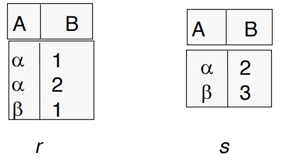

  - *r* ∩ *s*

    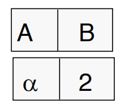

### Natural Join Operation

- Notation: r ⋈ s

  - Let *r* and *s* be relations on schemas *R* and *S,* respectively. Then, r ⋈ s is a relation on **schema *R* ∪ *S*** obtained as follows:

    设 *r* 和 *s* 分别是模式 *R* 和 *S，* 上的关系。然后，r ⋈ s 是架构 *R* ∪ *S*** 的关系，如下所示：

    - Consider each pair of tuples *t<sub>r</sub>* from *r* and t<sub>s</sub> from *s*. 

      考虑每对元组 *r* 的 *tr* 和 *s* 的 ts。

  - If t<sub>r</sub> and *t<sub>s</sub>* have the same value on each of the attributes in *R* ∩ *S*, add a tuple *t* to the result, where 

    如果 tr 和 *ts* 在 *R* ∩ *S* 中的每个属性上具有相同的值，则向结果中添加一个元组 *t*，其中

    - *t* has the same value as *t<sub>r</sub>* on *r*

      *t* 的值与 *r* 上的 *t<sub>r</sub>* 相同

    - *t* has the same value as *t<sub>s</sub>* on *s*

      t 的值与 *s* 上的 *t<sub>s</sub>* 相同

- Example:

  - *R* = (*A, B, C, D*)
  - *S* = (*E, B, D*)
  - Result schema = (*A, B, C, D, E*)
    - *r* ⋈*s* is defined as:
    - ∏<sub>*r.A, r.B, r.C, r.D, s.E*</sub> (σ<sub>*r.B = s.B* ∧ *r.D = s.D*</sub>  (*r* x *s*))

  - Relations r, s

    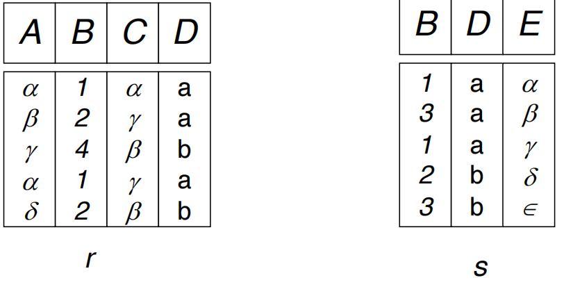

  - r ⋈ s

    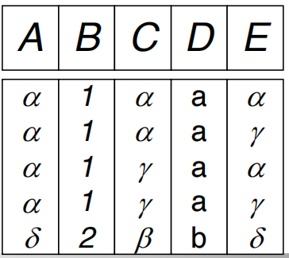

### Division Operation

Notation: 

- Often suited to queries that include the phrase “**for all**”.

  通常适用于包含短语 “**for all**” 的查询。

- Let *r* and *s* be relations on schemas *R* and *S,* respectively, where

  设 *r* 和 *s* 分别是模式 *R* 和 *S*上的关系，其中

- *R* = (A<sub>1</sub>, A<sub>2</sub>, …, A<sub>m</sub> , B<sub>1</sub>, B<sub>2</sub>, …, B<sub>m</sub> )

- *S* = (B<sub>1</sub>, B<sub>2</sub>, …, B<sub>m</sub>)

  The result of r ÷ s is a relation on schema

  *R* – *S* = (A<sub>1</sub>, A<sub>2</sub>, …, A<sub>m</sub>)

  ​      *r* ÷ *s* = { *t* | *t* ∈ ∏ <sub>*R-S*</sub> (*r*) ∧ ∀ *u* ∈ *s* ( *tu* ∈ *r* ) } 

  Where *tu* means the **concatenation** of tuples *t* and *u* to produce a single tuple.

  其中 *tu* 表示元组 *t* 和 *u* 的 **连接** 以生成单个元组。

- Example

  - Relations *r, s*

    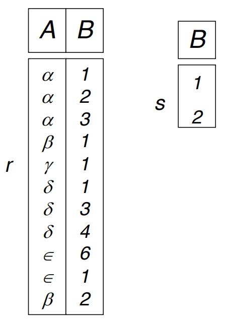

  - *r* ÷ *s*

    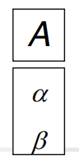

- Example 2:

  - Relations *r, s*

    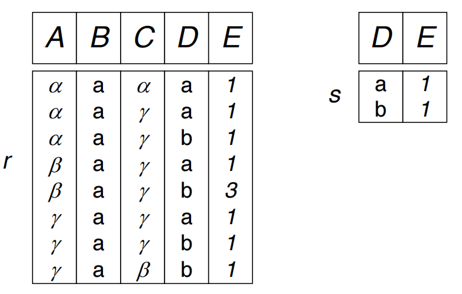

  - r ÷ *s*

    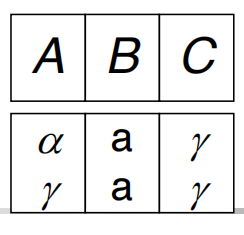

- Property 性质

  - Let *q = r* ÷ *s*

  - Then *q* is the **largest** relation satisfying *q* x *s* ∈ *r*

- Definition in terms of the basic algebra operation

  根据基本代数运算的定义

  Let *r(R)* and *s(S)* be relations, and let *S* ⊆ *R*

  *r* ÷ *s* = ∏<sub>*R-S*</sub> (*r* ) – ∏<sub>*R-S*</sub> ( ( ∏<sub>*R-S*</sub> (*r* ) x *s* ) – ∏<sub>*R-S,S*</sub>(*r* ))

  To see why

  - ∏<sub>*R-S,S*</sub> (*r*) simply reorders attributes of *r*

    - ∏<sub>*R-S*</sub> (*r* ) – ∏<sub>*R-S*</sub> ( ( ∏<sub>*R-S*</sub> (*r* ) x *s* ) – ∏<sub>*R-S,S*</sub>(*r* )) gives those tuples t in 

      ∏<sub>*R-S*</sub> (*r* ) such that for some tuple *u* ∈ *s, tu* not belongs to *r*.

### Theta join θ

A **Theta Join** is a type of join operation in relational databases where you combine two tables based on a **condition**. The condition can use comparison operators such as `=`, `>`, `<`, `>=`, `<=`, or `!=`. Essentially, Theta Join generalizes the concept of a join by allowing any kind of conditional predicate to be used.

**Theta Join** 是关系数据库中的一种联接操作，在这种操作中，您可以根据 **条件** 组合两个表。该条件可以使用比较运算符，例如 '='、'>'、'<'、'>='、'<=' 或 '！='。从本质上讲，Theta Join 通过允许使用任何类型的条件谓词来概括 Join 的概念。

Example 案例:

Here, `R` and `S` are two relations (tables), and `θ` represents the condition (e.g., `R.A = S.B`, or `R.A > S.B`).

这里，'R' 和 'S' 是两个关系（表），'θ' 代表条件（例如，'R.A = S.B' 或 'R.A > S.B'）。

### Assignment Operation

- The assignment operation (←) provides a convenient way to express complex queries. 

  赋值运算 （←） 提供了一种表达复杂查询的便捷方法。

  - Write query as a **sequential** program consisting of

    将查询编写为 **顺序** 进程，包括

    - a series of assignments 

      一系列任务

    - followed by an expression whose value is displayed as a result of the query.

      后跟一个表达式，其值将作为查询结果显示。

  - Assignment must always be made to a **temporary** relation variable

    必须始终对 **临时** 关系变量进行赋值

- Example: Write *r* ÷ *s* as 

  - *temp1* ¬ ∏*R-S* (*r* )

    *temp2* ¬ ∏*R-S* ((*temp1* x *s* ) – ∏*R-S,S* (*r* ))

    *result* = *temp1* – *temp2*

  - The result to the right of the ← is assigned to the relation variable on the left of the ←.

    ←右侧的结果将分配给←左侧的 relation 变量。

  - May use variable in subsequent expressions

    可以在后续表达式中使用变量

- Example of queries:

  - Find the names of all customers who have both a loan and an account at bank.

    查找在银行同时拥有贷款和帐户的所有客户的姓名。

    - ∏<sub>*customer_name*</sub> (*borrower*) ∩ ∏<sub>*customer_name*</sub> (*depositor*)

  - Find the name of all customers names, their load numbers and loan amount

    查找所有客户名称、他们的负载编号和贷款金额

    - ∏<sub>*customer_name,loan_number, amount*</sub> *(borrower ⋈ loan)*

  - Find names of all customers who have an account from both the “Downtown” and the “Uptown” branches.

    查找同时拥有 “Downtown” 和 “Uptown” 分支账户的所有客户的姓名。

    - ∏<sub>*customer_name*</sub> (σ<sub>*branch_name* = “Downtown”</sub> (*depositor ⋈ account* )) ∩ ∏<sub>*customer_name*</sub> (σ<sub>*branch_name* = “Uptown”</sub> (*depositor ⋈ account*))

  - Find names of all customers who have an account at all branches located in Brooklyn city

    查找在位于布鲁克林市的所有分行拥有账户的所有客户的姓名

    - ∏<sub>*customer_name, branch_name*</sub> (*depositor ⋈ account*) ÷ ∏<sub>*branch_name*</sub> (σ<sub>*branch_city* = “Brooklyn”</sub> (*branch*))


# Query Evaluation Basics

Query processing basics

查询处理基础知识

- Basic steps in query processing

  查询处理的基本步骤

- How to measure query costs

  如何衡量查询成本

## Query Processing

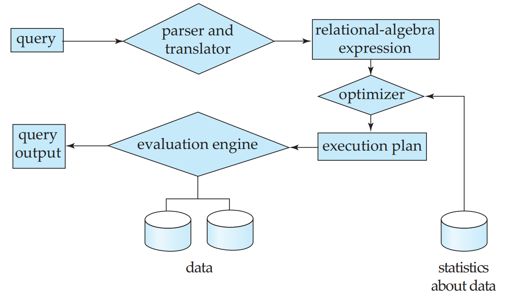

### Basic Steps in Query Processing

- Parsing and translation

  解析和翻译

- Optimisation

  最优

- Evaluation

  分析

#### Parsing and Translation 解析和翻译

- Translate the query into its internal form. 

  将查询转换为其内部形式。

- This is then translated into relational algebra.

  然后将其转换为关系代数。

  - (Extended) relational algebra is more compact, and differentiates clearly among the various different operations

    （扩展的）关系代数更加紧凑，并且清楚地区分了各种不同的运算

- Parser checks syntax and verifies relations

  解析器检查语法并验证关系

- This is a subject for **compilers**

  这是 **编译器** 的主题

#### Evaluation  评估

- The query-execution engine

  查询执行引擎

  - Takes an evaluation plan

    采用评估计划

  - Executes that plan

    执行该计划

  - Returns the answers to the query.

    返回查询的答案。

- The bulk of the problem lies in **how** to come up with good evaluation plans.

  大部分问题在于 **如何** 提出好的评估计划。

  - Query **optimization**!

    查询 **优化**！

#### Optimization 最优化

- A relational algebra expression may have **multiple** equivalent expressions, e.g. 

  关系代数表达式可能具有 **多个** 等效表达式，例如

  - σbalance*<2500(∏*balance(account))

  - ∏balance(σbalance<2500(*account))*

- Each relational algebra operation can be evaluated using several different algorithms

  每个关系代数运算都可以使用几种不同的算法进行评估

  - Correspondingly, a relational-algebra expression can be evaluated in many ways. 

    相应地，关系代数表达式可以通过多种方式进行计算。

- Annotated expression specifying detailed evaluation strategy is called an **evaluation plan**, e.g. 

  指定详细评估策略的注释表达式称为 **评估计划**，例如

  - Plan 1: use an index on *balance* to find accounts with balance < 2500,

    计划 1：使用 *balance* 上的索引来查找余额< 2500 的账户，

  - Plan 2: perform linear scan and discard accounts with balance ≥ 2500

    方案 2：执行线性扫描并丢弃余额≥ 2500 的账户

- **Query Optimisation**: amongst all equivalent evaluation plans, choose the one with the **lowest cost**. 

  **查询优化**：在所有等效评估计划中，选择成本最低的计划。

  - Cost is estimated using **statistical information** from the database catalog

    成本是使用数据库目录中的 **统计信息** 估算的

  - e.g. number of tuples in each relation, size of tuples, number of blocks in a relation, etc.

    例如，每个关系中的元组数、元组的大小、关系中的块数等。

- Issues to be covered:

  涵盖的问题：

  - How to measure query costs

    如何衡量查询成本

  - Algorithms for evaluating individual relational algebra operations

    用于评估单个关系代数运算的算法

  - How to combine algorithms for individual operations in order toevaluate a complete expression

    如何组合各个运算的算法以计算完整的表达式

  - How to optimise queries, that is, how to find an evaluation plan with lowest estimated cost

    如何优化查询，即如何找到估计成本最低的评估计划

## Measures of Query Cost

Disk cost can be estimated as:

磁盘成本可以估算为：

- Number of seeks (average-seek-cost)

  搜索次数 （average-seek-cost）

- Number of blocks read (average-block-read-cost)

  读取的数据块数 （average-block-read-cost）

- Number of blocks written (average-block-write-cost)

  写入的块数 （average-block-write-cost）

For simplicity, use the **number of block transfers** *from/to disk and the* **number of seeks** as the cost measures

为简单起见，使用 **块传输数**从/到磁盘和**查找数** 作为成本度量

- Assume for simplicity that write cost is ‘same’ as read cost

  为简单起见，假设写入成本与读取成本“相同”

- **t<sub>T</sub>** – time to transfer one block

  **tT** – 转移一个区块的时间

- **t<sub>S</sub>** – time for one seek

  **tS** – 一次搜索的时间

- Cost for **b** block transfers plus **s** seeks

  **b** 块转移加上 **s** 次 seek 的成本

  **b \* t<sub>T</sub>+ S \* t<sub>S</sub>**

*t<sub>S</sub>* and *t<sub>T</sub>* depend on where data is stored; with 4 KB blocks:

*tS* 和 *tT* 取决于数据的存储位置;具有 4 KB 块：

- High end magnetic disk: *t<sub>S</sub>* = 4 msec and *t<sub>T</sub>* =0.1 msec

  高端磁盘： *tS* = 4 毫秒 和 *tT* =0.1 毫秒

- SSD: *t<sub>S</sub>* = 20-90 microsec and *t<sub>T</sub>* = 2-10 microsec for 4KB

  SSD：*tS* = 20-90 微秒和 *tT* = 4KB 时为 2-10 微秒

- msec (**millisecond** or ms); microsec (**microsecond** or µs); 1ms=1,000µs

  毫秒（**毫秒**或毫秒）;微秒 （**微秒** 或 μs）;1毫秒=1,000微秒

