# Concurrency Control  竞争控制

- A database must provide a mechanism that will ensure that all possible schedules are 

  数据库必须提供一种机制，以确保所有可能的调度都是

  - either **conflict** or **view serialisable**, and 

    冲突或可串行化的视图,以及

  - are **recoverable** and preferably **cascadeless**

    可回收,最好是无级联

- A policy in which only one transaction can execute at a time generates serial schedules, but provides a **poor degree of concurrency**

  一次只能执行一个事务的策略会生成串行计划，但并发程度很差

  - Are serial schedules recoverable/cascadeless?

    串行时间表是否可恢复/无级联?

- Testing a schedule for serialisability **after** it has executed is too late!

  在执行计划之后测试计划的可串行化性为时已晚！

  - **Goal** – to develop concurrency control protocols that will assure **serialisability.**

    **目标** – 开发可确保可串行化性的并发控制协议。

## Lock-Based Protocols  基于锁的协议

- A **lock** is a mechanism to control concurrent access to a data item

  **锁**是一种机制,用于控制对数据项的并发访问

- Data items can be locked in two modes:

  数据项可以通过两种模式锁定:

  - **exclusive (X) mode**. Data item can be both read as well as written. X-lock is requested using **lock-X** instruction.

    **独占 （X） 模式**。数据项既可以读取，也可以写入。使用 lock-X指令请求 X-lock。

  - **shared (S) mode**. Data item can only be read. S-lock is requested using **lock-S** instruction.

    **共享 （S） 模式**。数据项只能被读取。使用 lock-S 指令请求 S-lock。

  - **共享锁【S锁】**
    又称读锁，若事务T对数据对象A加上S锁，则事务T可以读A但不能修改A，其他事务只能再对A加S锁，而不能加X锁，直到T释放A上的S锁。这保证了其他事务可以读A，但在T释放A上的S锁之前不能对A做任何修改。

  - **排他锁【X锁】**
    又称写锁。若事务T对数据对象A加上X锁，事务T可以读A也可以修改A，其他事务不能再对A加任何锁，直到T释放A上的锁。这保证了其他事务在T释放A上的锁之前不能再读取和修改A。

- Lock requests are made to **concurrency-control manager**. Transaction can proceed only after request is **granted**.

  向 concurrency-control manager 发出锁定请求。只有在 **请求被批准** 后，交易才能继续进行。

- Lock-compatibility matrix

  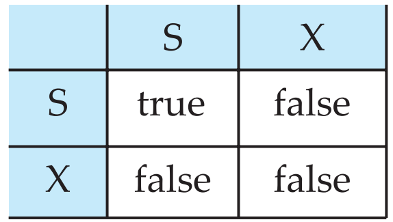

- A transaction may be granted a lock on an item if the requested lock is **compatible** with locks already held on the item by other transactions.

  如果请求的锁与其他事务已经持有的项上的锁兼容，则可以向事务授予对项的锁。

- Any number of transactions can hold shared locks on an item. 

  任何数量的交易都可以在一个项目上持有共享锁。

- But if any transaction holds an exclusive lock on the item no other transactions may hold any lock on the item.

  但是，如果任何事务持有该项目的独占锁，则其他事务不能持有该项目的任何锁。

- If a lock cannot be granted, the requesting transaction is made to **wait** till all incompatible locks held by other transactions are **released**. The lock is then **granted**.

  如果无法授予锁定,则请求的交易将被等待,直到其他交易持有的所有不兼容的锁定被释放。然后授予锁定。

- Example of a transaction performing locking:

  - lock-S(A);

  - read (A);

  - unlock(A);

  - lock-S(B);

  - read (B);

  - unlock(B);

  - display(A+B)

- A **locking protocol** is a set of rules followed by all transactions while requesting and releasing locks. 

  锁定协议是所有事务在请求和释放锁时遵循的一组规则。

- **Locking protocols restrict the set of possible schedules**.

  锁定协议限制了可能的时间表集。

  - Locking as above is **not sufficient** to guarantee serialisability.

    锁定如上并不足以保证可串行化。

### Pitfalls of Lock-Based Protocol 基于锁的协议的陷阱

- Consider the partial schedule

  考虑部分时间表

- Neither T3 nor T4 can make progress — executing **lock-S(B)** causes T4 to wait for T3 to release its lock on B, while executing **lock-X(A)** causes T3 to wait for T4 to release its lock on A.

  T3 和 T4 都无法进行 — 执行 **lock-S（B）** 会导致 T4 等待 T3 解除对 B 的锁定，而执行 **lock-X（A）** 会导致 T3 等待 T4解除对 A 的锁定。

- Such a situation is called a **deadlock**. 

  这种情况被称为**死锁**。

  - To handle a deadlock one of T3 or T4 must be rolled back and its locks released.

    要处理死锁，必须回滚 T3 或 T4 中的一个并释放其锁。

- The potential for deadlock exists in most locking protocols. Deadlocks are a necessary evil.

  大多数锁定协议都存在死锁的可能性。死锁是一种必要的邪恶存在。

- **Starvation** is also possible if concurrency control manager is badly designed. For example:

  如果并发控制管理器设计不当，也可能出现 **饥饿** 的情况。例如：

  - The most common solution to recover from deadlock is to **roll back** one or more transactions

    从死锁中恢复的最常见解决方案是回滚一个或多个事务

  - If a transaction is **repeatedly** chosen as the **victim**, it will never complete its task, hence **starvation**.

    如果一个交易被**反复选择为受害者**，它将永远无法完成其任务，从而导致**饥饿**。

- Concurrency control manager can be designed to prevent starvation.

  可以设计并发控制管理器来防止饥饿。

  - The most common solution is to include the **number of rollbacks** in the **cost factor** for selecting a **victim**. 

    最常见的解决方案是将回滚次数包含在选择牺牲对象的成本因子中。

### Two-Phase Locking Protocol  两阶段锁定协议

要避免和下一课的two phases transaction搞混！

- This is the basic protocol which ensures conflict **serialisable** schedules.

  这是确保冲突**可串行化调度**的基本协议

- Phase 1: Growing Phase

  第一阶段:成长阶段

  - transaction may obtain locks 

    交易可能获得锁定

  - transaction may not release locks

    交易可能不会释放锁

    - A transaction may acquire locks as needed but **cannot release any locks** during this phase.

      事务可以根据需要获取锁，但在此阶段**无法释放任何锁**。

    - In this phase, the transaction requests and is granted locks on the data items it needs to read or write.

      在此阶段，事务请求并被授予对它需要读取或写入的数据项的锁定。

    - Once a transaction starts releasing locks, it cannot acquire any new locks.

      一旦事务开始释放锁，它就无法获取任何新的锁。

- Phase 2: Shrinking Phase

  第二阶段:收缩阶段

  - transaction may release locks

    交易可能会释放锁

    - After acquiring all necessary locks, the transaction enters the shrinking phase by **releasing locks**.

      在获取了所有必要的锁后，事务通过 **释放锁** 进入收缩阶段。

  - transaction may not obtain locks

    交易可能无法获得锁定

    - In this phase, the transaction can only release locks and is no longer allowed to request new ones.

      在此阶段，事务只能释放锁，不再允许请求新的锁。

- It can be proved that the transactions can be serialised in the order of their **lock points** (i.e. the point where a transaction acquired its **final lock**). 

  可以证明交易可以按照它们的 **锁点** 的顺序进行串行化 （即交易获得其 **最终锁** 的点）。

- Basic two-phase locking does **not** ensure freedom from **deadlocks** (deadlock handling comes shortly).

  基本的两阶段锁定**不**确保没有 **死锁**（死锁处理很快就会推出）。

- **Cascading rollback** is **possible** under two-phase locking. To avoid this, follow a modified protocol called **strict two-phase locking**. 

  **级联回滚** 在两阶段锁定下是 **可能的** 。为避免这种情况，请遵循名为 **strict two-phase locking** 的修改协议。

  - Transaction must hold all its **exclusive** locks till it commits/aborts.

    事务必须持有其所有 **独占** 锁，直到提交/中止。

  - Ensures schedules recoverable and cascadeless

    确保时间表可恢复和无级联

- **Rigorous two-phase locking** is even stricter.

  **严格的两相锁定**甚至更严格。

  - Here all locks (including the shared locks) are held till commit/abort. 

    在这里，所有锁（包括共享锁）都被持有，直到提交/中止。

  - Transactions can be serialised in the order they commit.

    事务可以按其提交的顺序串行化。

### Lock Conversation 锁定对话

- Refinement to increase concurrency: two-phase locking with lock conversions:

  提高并发性的优化：使用锁转换的两阶段锁定：

  - First phase:

    - can acquire a lock-S on item

      可以在物品上获得一个锁S

    - can acquire a lock-X on item

      可以在物品上获得一个锁定X

    - can convert a lock-S to a lock-X (**upgrade**)

      可以将锁定-S转换为锁定-X(升级)

  - Second Phase

    - can release a lock-S

      可以释放锁定-S

    - can release a lock-X

      可以释放锁定-X

    - can convert a lock-X to a lock-S (**downgrade**)

      可以将锁定X转换为锁定S(降级)

- This protocol assures serialisability. 

  该协议确保了可串行性。

  - But relies on the programmer to insert the various locking instructions.

    但依赖于进程员插入各种锁定指令。

### Implementation of Locking 锁定的实现

- A **lock manager** can be implemented as a **separate process** to which transactions send lock and unlock requests.

  锁管理器可以作为事务发送锁和解锁请求的单独进程实现

  - Replies to a lock request by sending a **lock grant message**, or a message asking the transaction to **roll back**, in case of a deadlock.

    通过发送锁授予消息或请求事务回滚的消息（如果出现死锁）来回复锁请求。

  - The requesting transaction waits until its request is answered.

    交易请求会一直等待,直到其请求得到响应。

- The lock manager maintains a data structure called a **lock table** to record granted locks and pending requests.

  锁管理器维护一个称为锁表的数据结构，用于记录已授予的锁和待处理请求。

  - Lock table is usually implemented as an **in-memory hash table** indexed on the name of the data item being locked.

    Lock table 通常实现为内存中的哈希表，该哈希表根据被锁定的数据项的名称进行索引。

### Lock table 锁表

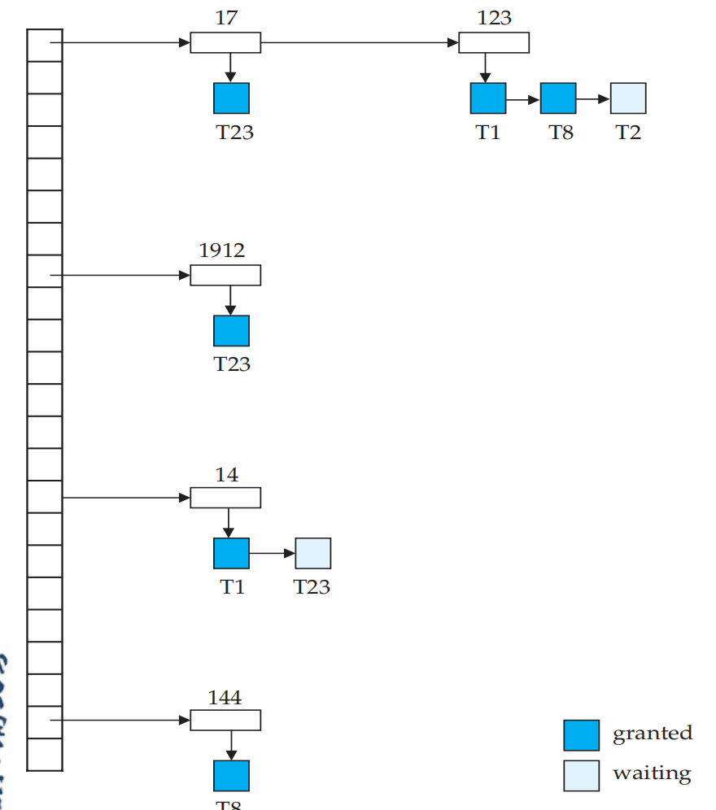

- Dark rectangles indicate granted locks, light ones indicate waiting requests

  深色矩形表示已授予的锁，浅色矩形表示等待请求

- Lock table also records the type of lock granted or requested

  锁表还记录了授予或请求的锁的类型

- New request is added to the end of the queue of requests for the data item, and granted if it is compatible with all earlier locks

  新请求将添加到数据项的请求队列的末尾，如果它与所有早期的锁定兼容，则授予新请求

- Unlock requests result in the request being deleted, and later requests are checked to see if they can now be granted

  解锁请求会导致请求被删除，并检查以后的请求以查看它们现在是否可以授予

- If transaction aborts, all waiting or granted requests of the transaction are deleted 

  如果事务中止，则删除事务的所有等待请求或已授权的请求

- Lock manager may keep a list of locks held by each transaction, to implement this efficiently

  锁管理器可以保留每个事务持有的锁列表，以有效地实现这一点

## Deadlock Handling 死锁处理

- System is **deadlocked** if there is a set of transactions such that every transaction in the set is waiting for another transaction in the set.

  如果存在一组事务，则系统处于死锁状态，使得该集合中的每个事务都在等待该集合中的另一个事务。

- Two approaches to handling deadlocks in 2PL:

  在2PL中处理死锁的两种方法:

  - **Deadlock prevention** protocols ensure that the system will never enter a deadlock state. 

    死锁预防协议可确保系统永远不会进入死锁状态。

  - **Deadlock detection methods** periodically check for deadlocks (usually with a background thread) and then make a decision on how to break them. 

    死锁检测方法会定期检查死锁（通常使用后台线程），然后决定如何打破死锁。

### Deadlock Prevention Strategies 死锁预防策略

- The following schemes use transaction **timestamp**s for the sake of deadlock prevention alone.

  以下方案使用事务时间戳仅用于防止死锁。

- **wait-die** scheme — non-preemptive

  等待方案 - 非先发制人

  - older transaction may wait for younger one to release data item. Younger transactions never wait for older ones; they are rolled back instead.

    较早的事务可能会等待较年轻的事务释放数据项。年轻的交易永远不会等待旧的交易;它们将被回滚。

  - a transaction may die several times before acquiring needed data item

    在获得所需数据项之前,交易可能会死几次

- **wound-wait** scheme — preemptive

  伤口等待方案 - 先发制人

  - older transaction *wounds* (forces rollback) of younger transaction instead of waiting for it. Younger transactions may wait for older ones.

    较旧的事务为较年轻的事务 wound（强制回滚） ，而不是等待它。较年轻的交易可能会等待较早的交易。

  - may be fewer rollbacks than *wait-die* scheme.

    可能会比"等死"方案减少回滚。

- Both in **wait-die** and **wound-wait** schemes, a rolled back transaction is restarted with its **original timestamp**. Older transactions thus have precedence over newer ones, and **starvation** is hence avoided.

  在 **wait-die** 和 **wound-wait** 方案中，回滚的事务都会使用其 **原始时间戳** 重新启动。因此，**较旧的事务优先于较新的事务**，因此避免了 **饥饿**。

  - But unnecessary rollbacks may occur in both schemes. 

    但是,在这两种方案中都可能出现不必要的回滚。

- Another approach is the **Lock Timeout-Based Schemes**:

  另一种方法是基于锁定超时的方案:

  - a transaction waits for a lock only for **a specified amount of time**; after that, the wait times out and the transaction is rolled back;

    事务仅等待锁定指定的时间;之后，等待超时，事务回滚;

  - deadlocks are not possible;

    死锁是不可能的;

  - simple to implement;

    易于实施;

  - starvation is possible (need to determine a good value of the timeout interval).

    饥饿是可能的（需要确定 timeout interval 的好值）。

### Deadlock Detection 死锁检测

- Deadlocks can be described as a **wait-for** graph, which consists of a pair G = (V,E), 

  死锁可以描述为一个 **等待** 图，它由一对 G = （V，E） 组成，

  - V is a set of vertices (all the transactions in the system)

    V是一组顶点(系统中的所有事务)

  - E is a set of edges (each element is an ordered pair Ti →Tj)

    E 是一组边（每个元素都是有序对 Ti →Tj）

- If Ti → Tj is in E, then there is a directed edge from Ti to Tj , implying that Ti is waiting for Tj to release a data item

  如果 Ti → Tj 在 E 中，则从 Ti 到 Tj 存在一条有向边，这意味着 Ti 正在等待 Tj 释放数据项

- When Ti requests a data item currently being held by Tj , then the edge (Ti ->Tj ) is inserted in the wait-for graph. This edge is removed only when Tj is no longer holding a data item needed by Ti .

  当 Ti 请求当前由 Tj 持有的数据项时，边缘 （Ti ->Tj ） 将插入到等待图中。仅当 Tj 不再保存 Ti时，这个条从Ti到Tj的边才会被去除。

- The system is in a deadlock state if and only if the wait for graph has a **cycle**. 

  当且仅当 wait for 图形具有 **cycle** 时，系统处于死锁状态。

  - Must invoke a deadlock-detection algorithm periodically to look for cycles

    必须定期调用死锁检测算法以查找周期

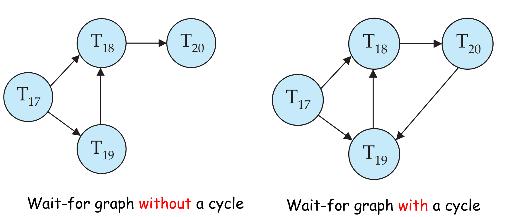

### Deadlock Recovery 死锁恢复

- When deadlock is detected, three actions need to be taken :

  当检测到死锁时,需要采取三种行动:

  - Some transaction will have to rolled back (made a victim) to break deadlock. Select the transaction as victim that will incur **minimum cost**.

    有些交易必须回滚(产生受害者)才能打破僵局。选择transaction作为受害者,将产生**最低成本**。

  - Rollback - determine how far to roll back transaction

    Rollback 确定回滚交易的距离

    - **Total rollback**: Abort the transaction and then restart it.

      **完全回滚**:中止交易,然后重新启动。

    - More effective to roll back transaction only as far as necessary to break deadlock.

      更有效的方法是在打破僵局时,仅在必要时回滚交易。

  - **Starvation** happens if same transaction is **always chosen as victim**. 

    如果同一笔交易总是被选为受害者,就会发生饥饿。

    - Include the **number of rollbacks** in the cost factor to avoid starvation.

      在成本因素中包括**回滚次数**,以避免饥饿。

## Graph-Based Protocols 基于图的协议 (Optional)

- Graph-based protocols are an alternative to **two-phase locking**

  基于图的协议是**两相锁定**的替代方案

- Impose a partial ordering → on the set D = {d1, d2 ,..., dh} of all data items.

  对所有数据项的集合 D = {d1, d2, ..., dh} 施加部分排序 →。

  - If di → dj then any transaction accessing both di and dj must access di before accessing dj .

    如果 di → dj ，则任何访问 di 和 dj 的事务都必须在访问 dj 之前访问 di 。

  - Implies that the set D may now be viewed as a directed acyclic graph, called a database graph.

    这意味着集合D现在可以被视为有向无环图,称为数据库图。

- The **tree-protocol** is a **simple kind of graph protocol**. 

  树协议是一种简单的图协议。

- The **tree protocol** ensures conflict serialisability as well as freedom from deadlock.

  **树协议**确保了冲突串行化以及免于死锁。

- Unlocking may occur earlier in the tree-locking protocol than in the two-phase locking protocol.

  在树锁定协议中,解锁可能比在两相锁定协议中更早发生。

  - shorter waiting times, and increase in concurrency

    等待时间缩短,并发性增加

  - protocol is deadlock-free, no rollbacks are required

    协议无死锁,无需回滚

- Drawbacks 缺点

  - Protocol does **not** guarantee recoverability or cascade freedom

    协议**不**保证可恢复性或级联自由

    - Need to introduce commit dependencies to ensure recoverability 

      需要引入提交依赖以确保可恢复性

  - Transactions may have to lock data items that they do not access.

    交易可能需要锁定他们无法访问的数据项。

    - increased locking overhead, and additional waiting time

      增加锁定开销,增加等待时间

    - potential decrease in concurrency

      潜在竞争力的下降

Schedules not possible under two-phase locking are possible under tree protocol, and vice versa.

在两相锁定下不可能的时间表在树协议下是可能的,反之亦然。

### Tree Protocol 树协议

- Only exclusive locks are allowed.

  只允许使用专属锁。

- The first lock by Ti may be on any data item. Subsequently, a data Q can be locked by Ti only if the parent of Q is currently locked by Ti .

  Ti 的第一个锁定可以针对任何数据项。随后,只有当 Q 的父项当前被 Ti 锁定时,才能通过 Ti 锁定数据 Q 。

- Data items may be unlocked at any time.

  数据项可能随时被解锁。

- A data item that has been locked and unlocked by Ti cannot subsequently be relocked by Ti

  一个被 Ti 锁定和解锁的数据项不能再被 Ti 重新锁定

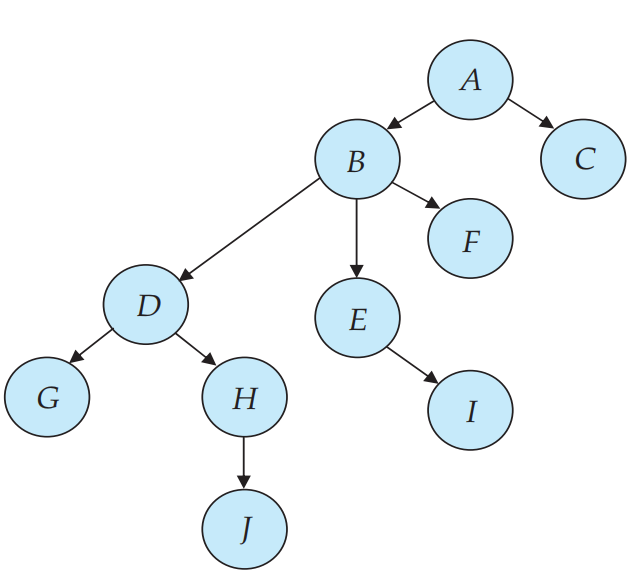

### Lock Granularities - Motivation 锁定粒度动机

- If a transaction wants to update one billion tuples, it has to ask the DBMS’s lock manager for a billion locks.

  如果一个事务想要更新 10 亿个元组,它必须向 DBMS 的锁管理器请求 10 亿个锁。

  - This will be slow because the transaction has to take latches in the lock manager’s internal lock table data structure as it acquires/releases locks.

    这会很慢,因为交易在获取/释放锁时,必须在锁管理器的内部锁表数据结构中进行锁存。

- To avoid this overhead, the DBMS can use to use a lock hierarchy that allows a transaction to take more coarse-grained locks in the system. 

  为了避免这种开销,DBMS 可以使用锁层次结构,允许事务在系统中采用更粗粒度的锁。

  - For example, it could acquire a single lock on the table with one billion tuples instead of one billion separate locks. 

    例如,它可以获得具有十亿个元组的表上的单个锁,而不是十亿个单独的锁。

  - When a transaction acquires a lock for an object in this hierarchy, it implicitly acquires the locks for all its children objects.

    当一个事务获取该层次结构中某个对象的锁时,它隐含地获取了其所有子对象的锁。

### Multiple Granularity 多粒度

- Allow data items to be of various sizes and define a hierarchy of data granularities, where the small granularities are nested within larger ones

  允许数据项具有各种大小,并定义数据粒度的层次结构,其中小粒度嵌套在较大粒度中

- Can be represented graphically as a tree (but don't confuse with tree-locking protocol)

  可以图形化地表示为一棵树(但不要与树锁定协议混淆)

- When a transaction locks a node in the tree **explicitly**, it **implicitly** locks all the node's descendants in the same mode.

  当一个事务锁定树中一个节点时,它 **明确地** 锁定该节点的所有后代。

- **Granularity of locking** (level in tree where locking is done):

  **锁定的粒度**(锁定所在树的级别):

  - **fine granularity** (lower in tree): high concurrency, high locking overhead

    **精细粒度**(在树中较低):高并发性,高锁定开销

  - **coarse granularity** (higher in tree): low locking overhead, low concurrency

    **粗粒度**(在树中较高):锁定开销低,并发性低

### Example of Granularity Hierarchy  粒度层次结构

- The levels, starting from the coarsest (top) level are

  - *database*

  - *area* 

  - *file*

  - *record*

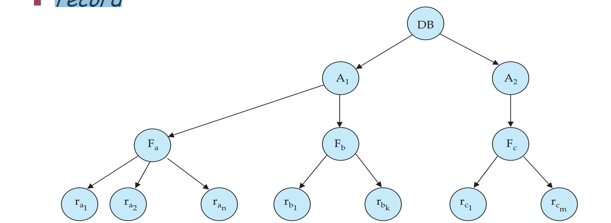

### Intention Lock Modes  意图锁定模式

- In addition to S and X lock modes, there are three additional lock modes with multiple granularity：

  除了 S 和 X 锁定模式外,还有三种具有多种粒度的锁定模式:

  - **intention-shared** (IS): indicates explicit locking at a lower level of the tree but only with shared locks.

    **intention-shared** (IS) :表示在树的较低级别明确锁定,但仅使用共享锁。

  - **intention**-**exclusive** (IX): indicates explicit locking at a lower level with exclusive or shared locks

    **intention**-**exclusive** (IX) :表示在较低级别使用独占或共享锁进行显式锁定

  - **shared and intention**-**exclusive** (SIX): the subtree rooted by that node is locked explicitly in shared mode and explicit locking is being done at a lower level with exclusive-mode locks.

    **共享和意图**-**排他**(SIX):该节点根植的子树在共享模式下被显式锁定,而显式锁定则在较低级别上通过排他模式锁定完成。

- Intention locks are put on all the ancestors of a node before that node is locked explicitly. 

  在明确锁定该节点之前,对节点的所有祖先进行意图锁定。

- Intention locks allow a higher level node to be locked in S or X mode without having to check all descendent nodes.

  意图锁允许在 S 或 X 模式下锁定更高级别的节点,而无需检查所有子节点。

### Compatibility Matrix with Intention Lock Modes 带有 Intention Lock 模式的兼容性矩阵

- The compatibility matrix for all lock modes is:   所有锁定模式的兼容性矩阵为:

  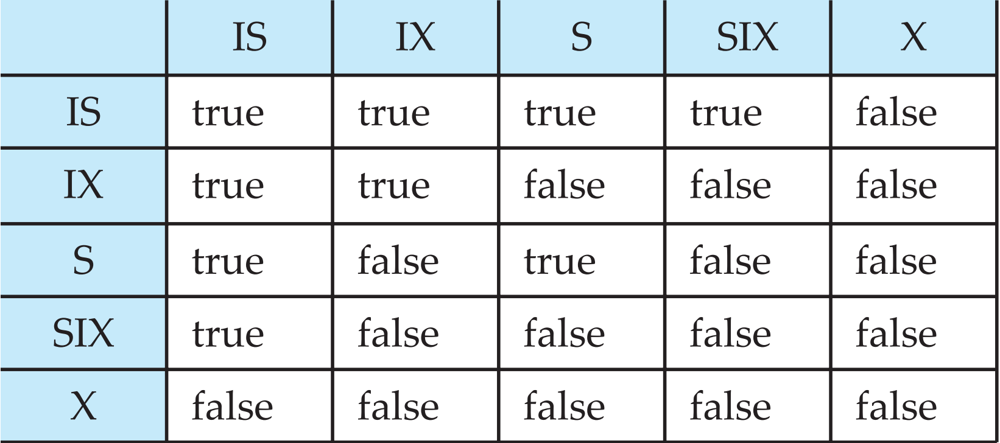

### Multiple Granularity Locking Scheme  多重粒度锁定方案

- Transaction Ti can lock a node Q, using the following rules:

  事务Ti可以使用以下规则锁定节点Q:

  - The lock compatibility matrix must be observed.

    必须遵守锁定矩阵。

  - The root of the tree must be locked first, and may be locked in any mode.

    树根必须首先锁定,并且可以在任何模式下锁定。

  - A node Q can be locked by Ti in S or IS mode only if the parent of Q is currently locked by Ti in either IX or IS mode.

    节点 Q 只能被 S 或 IS 模式下的 Ti 锁定,前提是 Q 的父节点当前被 IX 或 IS 模式下的 Ti 锁定。

  - A node Q can be locked by Ti in X, SIX, or IX mode only if the parent of Q is currently locked by Ti in either IX or SIX mode.

    只有当 Q 的父节点当前在 IX 或 SIX 模式下被 Ti 锁定时,才能在 X、SIX 或 IX 模式下通过 Ti 锁定节点 Q。

  - Ti can lock a node only if it has not previously unlocked any node (that is, Ti is two-phase).

    Ti只有在之前没有解锁任何节点的情况下才能锁定节点(即Ti是两相的)。

  - Ti can unlock a node Q only if none of the children of Q are currently locked by Ti .

    Ti 只能解锁 Q 节点,前提是 Q 的子节点目前没有被 Ti 锁定。

- Observe that locks are acquired in root-to-leaf order, whereas they are released in leaf-to-root order.

  观察锁以根到叶的顺序获得,而它们以叶到根的顺序释放。

- **Lock granularity escalation**: in case there are too many locks at a particular level, switch to higher granularity S or X lock

  锁定粒度升级:如果在特定级别上有太多的锁定,切换到更高粒度的 S 或 X 锁定

# Failure Recovery  失败的恢复

- Failure Classification

- Failure Recovery and Atomicity

- Log-Based Recovery Algorithm

## Failure Classification  故障分类

- **Transaction failure**:

  交易失败

  - **Logical errors**: transaction cannot complete due to some internal error condition

    **逻辑错误**:由于某些内部错误条件,交易无法完成

  - **System errors**: the database system must terminate an active transaction due to an error condition (e.g. deadlock)

    **系统错误**:数据库系统由于错误条件(例如死锁)而必须终止活动事务

- **System crash**: a power failure or other hardware or software failure causes the system to crash.

  系统崩溃:电源故障或其他硬件或软件故障导致系统崩溃。

  - **Fail-stop assumption**: non-volatile storage contents are assumed to not be corrupted by system crash

    **故障停止假设**:假设非易失性存储内容不会因系统崩溃而损坏

  - Database systems have numerous integrity checks to prevent corruption of disk data 

    数据库系统有许多完整性检查,以防止磁盘数据损坏

- **Disk failure**: a head crash or similar disk failure destroys all or part of disk storage

  **磁盘故障**:磁头崩溃或类似的磁盘故障会破坏全部或部分磁盘存储

  - Destruction is assumed to be detectable: disk drivers use checksums to detect failures

    破坏被认为是可检测的:磁盘驱动进程使用校验和来检测故障

### Failure Example 失败案例

- Consider transactionTi that transfers $50 from account A to account B

  考虑交易Ti将50美元从账户A转到账户B

  - Requires updates to A and B to the database. 

    需要更新数据库的 A 和 B。

  - A failure may occur after one of these modifications has been made but before both of them are made. 

    故障可能发生在其中一个修改完成之后,但在两个修改完成之前。

  - **Modifying** the database without ensuring that transaction commits may leave the database in an **inconsistent** state

    **修改**数据库而不确保事务提交可能会使数据库处于**不一致状态**

  - **Not modifying** the database may result in **lost updates** if failure occurs just after transaction commits

    **不修改**数据库可能会导致**丢失更新**,如果在事务提交后发生故障

## Recovery Algorithms 恢复算法

- Recovery algorithms have two parts:

  恢复算法有两个部分:

  - Actions taken **during normal transaction processing** to ensure **enough** information exists to recover from failures

    **在正常事务处理期间**采取的行动,以确保有足够的信息来从失败中恢复

  - Actions taken **after a failure** to recover the database contents to a state that ensures atomicity, consistency and durability.

    失败后采取的行动,将数据库内容恢复到确保原子性、一致性和持久性的状态。

### Storage Categories  存储类别

- **Volatile storage**:

  **易失性存储**:

  - does not survive system crashes

    不能在系统崩溃后幸存下来

  - examples: main memory, cache memory

    例子:主内存、高速缓存

- **Non-volatile storage**:

  **非易失性存储**:

  - survives system crashes

    系统崩溃后幸存

  - examples: disk, tape, flash memory, non-volatile (battery backed up) RAM 

    例如:磁盘、磁带、闪存、非易失性(电池备份)RAM

  - but may still fail, losing data

    但仍可能失败,丢失数据

- **Stable storage**:

  **稳定存储**:

  - a mythical form of storage that survives all failures

    一种在所有失败中幸存下来的神话存储形式

  - usually **approximated** by maintaining **multiple copies** on distinct nonvolatile media

    通常通过在不同的非易失性介质上维护多个副本来近似

### Data Access 数据访问

- **Physical blocks** are those blocks residing on the disk. 

  **物理块**是那些驻留在磁盘上的块

- **Buffer blocks** are the blocks residing temporarily in main memory.

  **缓冲块**是暂时驻留在主内存中的块。

- Block movements between disk and main memory are initiated through the following two operations:

  磁盘和主存储器之间的块移动通过以下两个操作启动:

  - **input**(*B*) transfers the physical block *B* to main memory.

    **input**(*B*)将物理块*B*传输到主内存。

  - **output**(*B*) transfers the buffer block *B* to the disk, and replaces the appropriate physical block there.

    **output**(*B*)将缓冲块*B*传输到磁盘,并在那里替换适当的物理块。

- We assume, for simplicity, that each data item fits in, and is stored inside, a single block.

  为了简单起见,我们假设每个数据项都适合并存储在单个块中。

- Each transaction Ti has its private work-area in which local copies of all data items accessed and updated by it are kept.

  每个事务 Ti 有其私人工作区域,其中保存其访问和更新的所有数据项的本地副本。

  - Ti 's local copy of a data item X is called xi .

    数据项 X 的 Ti 本地副本称为 xi 。

- Transferring data items between system buffer blocks and its private work-area done by:

  在系统缓冲块和其私人工作区域之间传输数据项,通过以下方式完成:

  - **read(X**) assigns the value of data item X to the **local** variable xi .

    **read(X**)将数据项 X 的值赋给 **local** 变量 xi 。

  - **write(X)** assigns the value of **local** variable xi to data item X in the **buffer** block.

    **write(X)** 将 **local** 变量 xi 的值赋给 **buffer** 块中的数据项 X。

  - **Note: output(BX)** need not immediately follow write(X). System can perform the **output** operation when it deems fit.

    **注意:输出(BX)** 不需要在写入(X)之后立即执行。系统可以在它认为合适的时候执行 **输出** 操作。

- Transactions 事务

  - Must perform **read(X)** before accessing X for the first time

    首次访问 X 之前必须执行 **read(X)**

  - **write(X)** can be executed at any time before the transaction commits

    **write(X)** 可在事务提交之前的任何时间执行

#### Example of Data Access

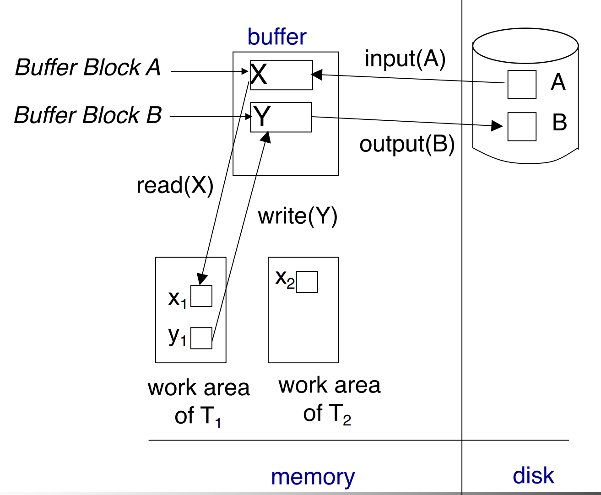

## Recovery and Atomicity  回收和原子性

- To ensure atomicity despite of failures, we first output information **describing the modifications** (e.g. **logs**) to stable storage without modifying the database itself

  为了确保在发生故障时仍保持原子性,我们首先将描述修改的信息(例如日志)输出到稳定存储,而不修改数据库本身

## Log-Based Recovery  基于日志的恢复

- A **log** is kept on stable storage. 

  - The log is a sequence of log records, and maintains a record of update activities on the database.

    日志是日志记录的串行,并保持数据库更新活动的记录。

  - When transaction Ti starts, it registers itself by writing a <Ti start> log record

    当事务Ti启动时,它通过写入一个日志记录来注册自己

  - Before Ti executes write(X), a log record <Ti , X, V1 , V2> is written, where V1 is the value of X before the write (the **old value**), and V2 is the value to be written to X (the **new value**).

    在 Ti 执行 write(X) 之前,写入日志记录 i , X, V1 , V2> ,其中 V1 是写入前 X 的值(旧值),V2 是写入 X 的值(新值)。

  - WhenTi finishes it last statement, the log record <Ti commit> or <Ti abort> is written.

    当 Ti 完成最后一个语句时,日志记录  或  被写入。

  - Two approaches using logs

    使用日志的两种方法

    - Deferred database modification

      延迟数据库修改

    - Immediate database modification

      立即数据库修改

### Immediate and Deferred Database Modification  即时和延迟数据库修改

- The **immediate-modification** scheme allows updates of an uncommitted transaction to be made to the buffer, or the disk itself, before the transaction commits.

  **立即修改**方案允许在事务提交之前对未提交事务的缓冲区或磁盘本身进行更新。

  - Update log record must be written *before* database item is written

    更新日志记录必须在写入数据库项之前写入

  - We assume that the log record is output directly to stable storage

    我们假设日志记录直接输出到稳定存储

  - Output of updated blocks to stable storage can take place at any time before or after transaction commit

    在交易提交之前或之后的任何时候,都可以将更新块输出到稳定存储

  - Order in which blocks are output can be different from the order in which they are written.

    块输出的顺序可能与它们被写入的顺序不同。

- The **deferred-modification** scheme performs updates to buffer/disk only at the time of transaction commit.

  **延迟修改**方案仅在事务提交时对缓冲区/磁盘执行更新。

  - Simplifies some aspects of recovery

    简化了恢复的某些方面

  - But has overhead of storing local copy

    但是存储本地副本有开销

### Transaction Commit  交易提交

- A transaction is said to have committed when its **commit log** record is output to stable storage. 

  当一个事务的提交日志记录被输出到稳定存储时,该事务就被称为已提交。

  - All previous log records of the transaction must have been output already.

    之前交易的所有日志记录必须已经输出。

- Writes performed by a transaction may still be in the buffer when the transaction commits, and may be output later.

  当事务提交时,事务执行的写操作可能仍在缓冲区中,并且可能会在稍后输出。

### Immediate and Deferred Database Modification Example  即时和延迟数据库修改示例

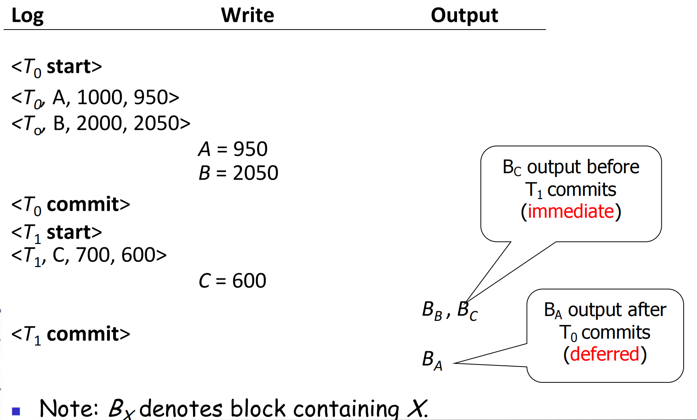

## Concurrency Control and Recovery 并发控制和恢复

- All concurrent transactions share a **single disk buffer and a single log**

  所有并发事务共享单个磁盘缓冲区和单个日志

  - A buffer block can have data items updated by one or more transactions

    一个缓冲块可以包含由一个或多个事务更新的数据项

- We assume using the **strict two-phase locking** protocol. i.e. if a transaction Ti has modified an item, no other transaction can modify the same item until Ti has committed or aborted.

  我们假设使用 **严格的两阶段锁定** 协议,即如果交易 Ti 修改了一个项目,在 Ti 提交或中止之前,其他交易不能修改相同的项目。

- Log records of different transactions may be interspersed in the log.

  不同交易的日志记录可能会在日志中穿插。

### Undo and Redo 不做和重做

- **Undo** of a log record <Ti , X, V1, V2> writes the old value V1 to X
- **Redo** of a log record <Ti , X, V1, V2> writes the new value V2 to X (again)

- **Undo and Redo of Transactions** 可以重新做或者回退整个事务

  - **undo **(Ti ) restores the values of all data items updated by Ti to their old values, going backwards from the last log record for Ti

    **undo **(Ti )将 Ti 更新的所有数据项的值恢复为旧值,从 Ti 的最后日志记录向后移动

    - each time a data item X is restored to its old value V, a special log record <Ti , X, V> is written out.
    - when undo of a transaction is complete, a log record <Ti abort> is written out.

  - **redo**(Ti ) sets the value of all data items updated by Ti to the new values, going forward from the first log record for Ti

    **redo**(Ti )将 Ti 更新的所有数据项的值设置为新值,从 Ti 的第一个日志记录开始

    - No additional logging is done in this case

### Undo and Redo on Recovering from Failure  从失败中恢复时的撤消和重做

- When recovering after **failure**:

  在 **失败** 后恢复时：

  - Transaction Ti needs to be **undone** if the log 

    事务Ti需要undone如果日志

    - contains the record <Ti start>,

      包含记录<Ti start>

    - but does not contain either the record <Ti commit> or <Ti abort>.

      但是不包含<Ti commit>或者<Ti abort>其中的任何一个

  - Transaction Ti needs to be **redone** if the log 

    事务Ti需要被redoen如果日志

    - contains the records <Ti start>
  
      包含<Ti start>
  
    - and contains the record <Ti commit> or <Ti abort>
  
      同时也包含记录<Ti commit>或者<Ti abort>其中一个
  
  - Note that if transaction Ti was undone earlier and the <Ti abort> record written to the log, and then a failure occurs, on recovery from failure Ti is **redone**
  
    请注意，如果事务 Ti 之前被撤消，并且 <Ti abort>记录写入日志，然后发生故障，则从故障中恢复时 Ti 是 **重做**
  
    - such a redo redoes all the original actions including the steps that restored old values
  
      此类重做将重做所有原始操作，包括恢复旧值的步骤
    
      - Known as **repeating history**
      
        被称为 **重复历史**
      
      - Seems wasteful, but **simplifies** recovery algorithm greatly
      
        看起来很浪费，但 **大大简化了** 恢复算法

### Recovery Example 恢复案例

Below we show the log as it appears at three instances of time. Assume that the failure occurs immediately after the last statement.

下面我们显示三个时间段的日志,假设故障发生在最后一条语句之后。

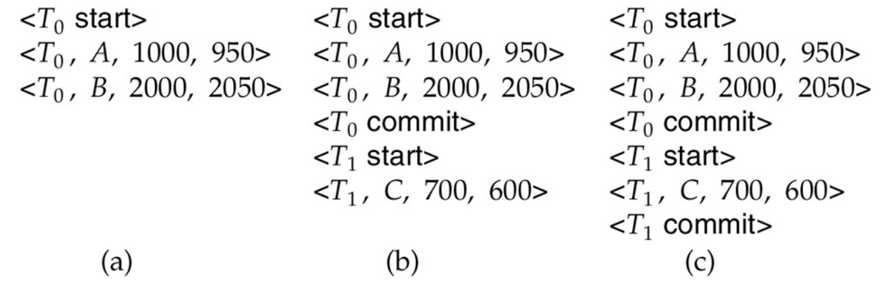

- Recovery actions in each case above are:

  - (a) **undo (T0)**: B is restored to 2000 and A to 1000, and log records <T0, B, 2000>, <T0, A, 1000>, <T0, abort> are written out

    （a） **撤销 (T0)**：将 B 恢复为 2000，将 A 恢复为 1000，并写出日志记录 <T0 abort>

  - (b) **redo (T0)** and **undo (T1)**: A and B are set to 950 and 2050 and C is restored to 700. Log records <T1, C, 700>, <T1, abort> are written out.

    (b) **重做(T0)**和 **撤销(T1)**:A 和 B 设置为 950 和 2050,C 恢复为 700。日志记录 、 被写出。 -

  - (c) **redo (T0)** and **redo (T1)**: A and B are set to 950 and 2050 respectively. Then C is set to 600. No additional log records need to be written out.

    (c) **重做 (T0) ** 和 **重做 (T1) **: A 和 B 分别设置为 950 和 2050。然后 C 设置为 600。不需要额外的日志记录写出来。

### Checkpoints 检查点

- Redoing/undoing all transactions recorded in the log can be very slow 

  重做/撤销日志中记录的所有交易可能非常缓慢

  - processing the entire log is time-consuming if the system has run for a long time

    处理整个日志是耗时的,如果系统已经运行了很长时间

  - we might unnecessarily redo transactions which have already output their updates to the database long time ago.

    我们可能会不必要地重做很久以前已经将更新输出到数据库的事务。

- Streamline recovery procedure by periodically performing **checkpointing**:

  通过定期执行**检查点**来简化恢复过程:

  - Output all log records currently residing in main memory onto stable storage.

    将当前驻留在主内存中的所有日志记录输出到稳定存储。

  - Output all modified buffer blocks to the disk.

    将所有修改的缓冲区块输出到磁盘。

  - Write a log record <**checkpoint** *L*> onto stable storage where *L*is a list of all transactions which are active at the time of checkpointing.

    将日志记录 <**checkpoint** *L*> 写入稳定存储,其中 *L* 是 checkpointing 时活动的所有事务的列表。

  - All updates are **stopped** while doing checkpointing.

    在执行检查点时,所有更新都会停止。

- During **recovery** we need to consider only the **most recent** transactions that **started before the checkpoint but not finished**, and **transactions that started after checkpoint**. 

  **在恢复**期间,我们只需要考虑**在检查点之前开始但尚未完成**的**最近**的交易,以及**在检查点之后开始的**交易。

  - Upon failure, scan backwards from end of log to find the most recent <**checkpoint** L> record 

    失败后,从日志末尾向后扫描,找到最近的"**检查点** L"记录

  - Only transactions that are in L or started after the checkpoint need to be redone or undone

    只有在 L 中或在检查点之后启动的交易才需要重做或撤消

  - Transactions that committed or aborted before the checkpoint already have all their updates output to stable storage (no need to consider them).

    在检查点之前提交或中止的事务已经将其所有更新输出到稳定存储(无需考虑它们)。

  - Some earlier part of the logs may be needed for undo operations

    一些较早的日志部分可能需要用于撤消操作

  - Continue scanning backwards till a record <Ti **start**> is found for every transaction Ti in L.

    继续向后扫描,直到在 L 中的每笔交易 <Ti **start**> 找到记录 i。

  - Parts of log prior to the earliest <Ti **start**> record above are not needed for recovery, and can be erased whenever desired.

    在上述最早的 <Ti **start**> 记录之前的日志部分不需要进行恢复,并且可以随时擦除。

#### Example of Checkpoints 检查点案例

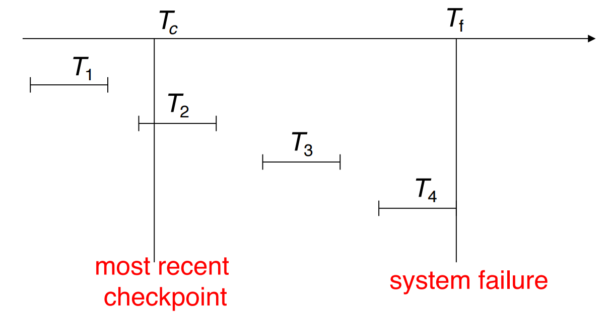

- T1 can be ignored (updates already output to disk due to checkpoint)

  T1可以忽略(由于检查点,更新已经输出到磁盘)

- T2 and T3 **redone**.

  T2 和 T3 **重做**。

- T4 **undone** (but all instructions in T4 up to the failure point need to be redone)

  T4 **撤销**当前所做的 (但T4中所有指令直至故障点需要重做)

## Recovery Algorithm 恢复算法

- **Logging** (during normal operation)

  日志记录(正常运行期间)

  - <Ti start> at transaction start

    <Ti start> 在交易开始时

  - <Ti , Xj , V1, V2> for each update, and 

    <Ti , Xj , V1, V2> 每次更新,以及

  - <Ti commit> at the end of transaction

    <Ti commit> 在交易结束时

- **Transaction rollback** (during normal operation)

  交易回滚(正常操作期间)

  - Let Ti be the transaction to be rolled back

    设 Ti 为要回滚的交易

  - Scan log backwards from the end, and for each log record of Ti of the form <Ti , Xj , V1, V2> 

    从末尾向后扫描日志,对于 Ti 的每条日志记录,其形式为 <Ti , Xj , V1 , V2>

  - perform the undo by writing V1 to Xj,

    执行撤销操作,将 V1 写入 Xj

  - write a log record <Ti , Xj, V1> 

    写一个日志记录 <Ti , Xj, V1>

  - such log records are called **compensation log records**

    这种日志记录称为补偿日志记录

  - Once the record <Ti start> is found stop the scan and write the log record <Ti abort> 

    一旦找到记录 <Ti start> 停止扫描并写入日志记录 <Ti abort>

- **Recovery from failure**: two phases

  **故障恢复**：两个阶段

  - **Redo phase**: replay updates of **all** transactions, whether they committed, aborted, or are incomplete, at and after checkpoint

    **重做阶段**：重做 **所有** 事务的更新，无论它们在检查点时和之后是已提交、中止还是未完成

  - **Undo phase**: undo all incomplete transactions

    **撤销阶段**：撤销所有未完成的事务

- **Redo phase**:

  **重做阶段**

  - Find last <checkpoint L> record, and set the **undo-list** to L (**undo-list = L**).

    找到最后一个"检查点 L"记录,并将撤销列表设置为 L(撤销列表 = L)。

  - Scan forward from above <checkpoint L> record

    从上方向前扫描 <检查点 L> 记录

    - Whenever a record <Ti , Xj, V1, V2> is found, redo it by writing V2 to Xj

      每当找到记录 <Ti , Xj , V1 , V2> 时,重做它,将 V2 写到 Xj 。

    - Whenever a log record <Ti start> is found, add Ti to undo-list

      每当发现日志记录 <Ti start> 时,将 Ti 添加到撤销列表

    - Whenever a log record <Ti commit> or <Ti abort> is found, remove Ti from undo-list

      每当发现日志记录 <Ti commit> 或 <Ti abort> 时,从撤销列表中删除 Ti

- **Undo phase:** 

  **撤销阶段**

  - Scan log backwards from the failure point

    - Whenever a log record <Ti , Xj , V1, V2> is found where Ti is in undo-list, perform same actions as for transaction rollback:

      每当发现日志记录 <Ti , Xj , V1 , V2> 在 Ti 在撤销列表中时,执行与事务回滚相同的操作:

      - perform undo by writing V1 to Xj.

        执行撤销,将 V1 写入 Xj。

      - write a log record <Ti , Xj, V1>

        写日志记录 <Ti , Xj, V1>

    - Whenever a log record <Ti start> is found where Ti is in undo-list:

      每当发现 Ti 在撤销列表中的日志记录  时:

      - Write a log record <Ti abort> 

        写一个日志记录 

      - RemoveTi from undo-list

        从撤销列表中删除Ti

    - Stop when undo-list is empty

      撤销列表为空时停止

      - 3i.e. <Ti start> has been found for every transaction in undo list

        即:在撤销列表中的每笔交易中都发现了"Ti start"

  - After undo phase completes, normal transaction processing can commence again.
  
    撤消阶段完成后，可以再次开始正常事务处理。

#### Example of Recovery

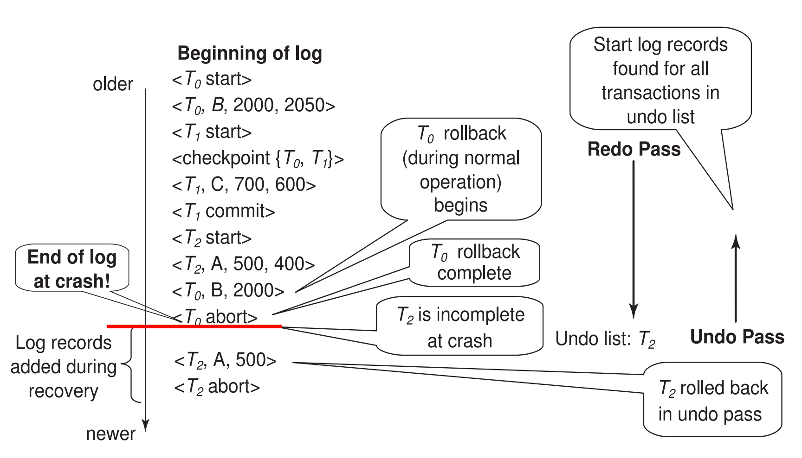

<Checkpoint {T0, T1}>：这里代表T0和T1还没有完成

这里在redo pass中，如果发现了<Ti commit>或者<Ti abort>，那么就直接将其从undo列表中删除，也就是log不会打印这些标签中的事务，并且在过程中，如果检测到记录<Ti , Xj , V1 , V2> 的时候，先将V2写入Xj。然后再执行undo pass，这个时候需要搭配redo过程中的形成的undo list来判断，如果是存在在此时undo list中的事务（例如上题中T1和T0都不在，只有T2在），然后还扫描到了在undo list中的<Ti , Xj , V1 , V2> ，那么此时将V1写入Xj，并且在扫描结束的时候打印<Ti abort>