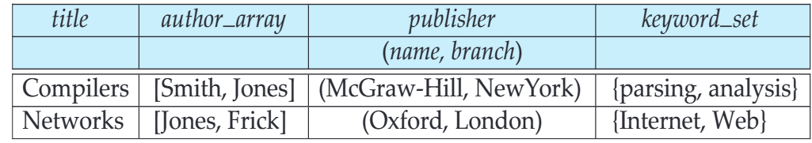
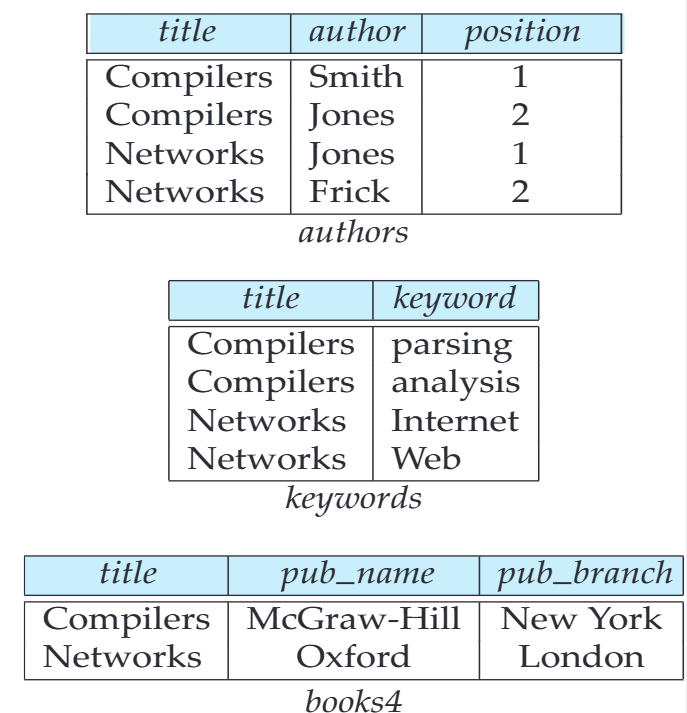
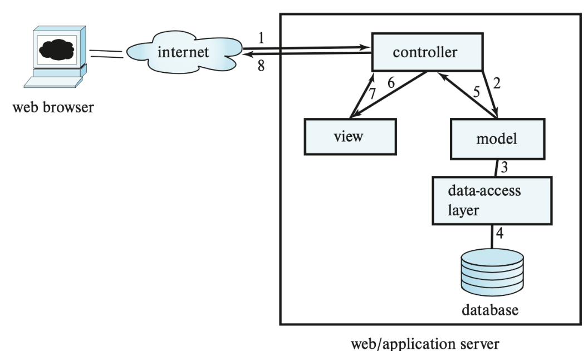

# Object Based Database  基于对象的数据库

## Learning Outcomes

- Complex Data Types and Object Orientation

  复杂数据类型和面向对象

- Object Relational Systems

  对象关系系统

  - Structured Data Types and Inheritance in SQL

    SQL中的结构化数据类型和继承

  - Table Inheritance

    表继承

  - Array and Multiset Types in SQL

    SQL中的数组和多集类型

- Object Relational Mapping Systems

  对象关系映射系统

- Comparison of Object Based Databases

  基于对象的数据库比较

## Complex Data Types 复杂数据类型

- Motivation:

  动机

  - Permit non-atomic domains (atomic ≡(恒等于) indivisible)

    允许非原子域（原子不可分割）

  - Example of non-atomic domain: set of integers, or set of tuples

    非原子域的示例：整数集或元组集

  - Allows more intuitive modeling for applications with complex data

    允许对具有复杂数据的应用程序进行更直观的建模

- Intuitive definition:

  直观的定义

  - allow relations whenever we allow atomic (scalar) values - relations within relations

    allow relations每当我们允许原子（标量）值时 - 关系中的关系

  - Retains mathematical foundation of relational model

    保留关系模型的数学基础

  - Violates first normal form (1NF)

    违反第一范式（1NF）

### Approaches 方法

- **Three** approaches for integrating object orientation with database systems:

  将面向对象与数据库系统集成的三种方法：

  1. **Object-relational database system**: adding object-oriented features to a relational database system.

     对象关系数据库系统：向关系数据库系统添加面向对象的功能。

  2. **Object-relational mapping**: converting data from the native object-oriented type system of the programming language to a relational representation for storage, and vice versa, automatically. （例如spring）

     对象关系映射：自动将数据从编程语言的本机面向对象类型系统转换为用于存储的关系表示，反之亦然

  3. **Object-oriented database system**: supporting natively an object-oriented type system

     面向对象数据库系统：原生支持面向对象类型系统。

<hr>

- We study the first two approaches.

  我们研究前两种方法

- The third approach, object-oriented database approach, has some benefits over the first two in terms of **language integration**, but has not seen much success for two reasons:

  第三种方法，面向对象的数据库方法，在**语言集成**方面比前两种方法有一些好处，但由于两个原因没有取得太大成功：

  - First, declarative querying is important for efficiently accessing data, but not supported by imperative (procedural) programming languages (e.g. Java, C++, and C#).

    首先，声明式查询对于有效地访问数据很重要，但命令式（过程式）编程语言（例如Java，C++和C）不支持。

    - 声明式查询：‌声明式查询是一种编程范式，它通过描述所需的结果，而不是描述如何达到这个结果，来执行查询操作。声明式查询语言（如SQL）允许用户指定想要的数据和条件，而不是编写具体的操作步骤。

    - 声明式查询和命令式查询的区别：声明式查询与命令式查询的主要区别在于它们对问题的描述方式不同。命令式编程（如C语言）要求程序员详细描述每一步操作，而声明式编程（如SQL）只需要描述最终目标，具体的执行细节由系统自动完成。例如，命令式编程可能需要编写多行代码来过滤和排序数据，而声明式查询只需一条SQL语句即可完成同样的任务‌

  - Second, direct access to objects via pointers resulted in increased risk of database corruption due to pointer errors.

    其次，通过指针直接访问对象会增加由于指针错误而导致数据库损坏的风险。

## Object-Relational Data Models 对象关系数据模型

- Extend the relational data model by including **object orientation** (constructs to deal with added data types).

  通过包含 **面向对象** （用于处理添加的数据类型的构造） 来扩展关系数据模型。

- Allow attributes of tuples to have complex types, including **non-atomic** values such as **nested relations**.

   允许元组的属性具有复杂类型，包括非原子值，如嵌套关系。

- **Preserve** relational foundations, in particular the declarative access to data, while extending modeling power.

  保留关系基础，特别是对数据的声明式访问，同时扩展建模能力。

- **Upward compatibility** with existing relational languages.

  与现有关系语言的向上兼容性。

#### Example of a Nested Relation  嵌套关系示例

- Example: library information system

  示例：图书馆信息系统

- Each book has

  每本书有

  - title,

    标题

  - a list (array) of authors (order matters),

    一个作者的列表（数组）（顺序很重要）

  - Publisher with subfields name and branch, and

    带有子字段的 出版商 和 分支

  - a set of keywords (set)

    一系列关键字 （集合）

- Non-1NF relation books

  非1NF关系



#### 4NF Decomposition of Nested Relation

- Suppose for simplicity that title uniquely identifies a book

  为简单起见，假设该标题唯一标识一本书

  - In real world ISBN is a unique identifier

    在现实世界中，ISBN 是唯一标识符

- Decompose books into 4NF using the schemas:

  使用schema将书籍分成4NF

  - ( title, author, position )

  - ( title, keyword )

  - ( title, pub-name, pub- branch )

- 4NF design requires users to include joins in their queries.

  4NF 设计要求用户在查询中包含join



### Structured Types and Inheritance in SQL  SQL 中的结构化类型和继承
Structured types (a.k.a. user-defined types) can be declared and used in SQL

结构化类型（也称为用户定义类型）可以在 SQL 中声明和使用

```sql
create type `Name` as
(
    firstname varchar(20),
	lastname varchar(20)
)
final

create type `Address` as
(
	street varchar(20),
	city varchar(20),
	zipcode varchar(20)
)
not final
```

- Note: **final** and **not final** indicate whether subtypes can be created

   final 和 not final 表示是否可以创建子类型

Structured types can be used to create tables with composite attributes

结构化类型可用于创建具有复合属性的表

```sql
create table person (
	name Name,
	address Address,
	dateOfBirth date 
)
```

- **Dot notation** used to reference components: `name.firstname`

  用于引用组件的点符号: `name.firstname`

#### Structured Type  结构化类型

- User-defined **row types**

  用于定义的行类型

```sql
create type PersonType as (
	name Name,
	address Address,
	dateOfBirth date
)
not final
```

- Can then create a table whose rows are a user-defined type create table person of PersonType

  然后可以创建一个表,其行是用户定义的类型

  create table `person` of `PersonType`

- Alternative using **unnamed row types**

  使用未命名行类型的替代方案创建表

```sql
create table person_r(
	name row(firstname varchar(20),lastname varchar(20)),
	address row(street varchar(20),city varchar(20),zipcode varchar(20)),
	dateOfBirth date
)
```

#### Methods 方法

- Can add a method declaration with a structured type.

  可以添加具有结构化类型的方法声明。

```sql
method `ageOnDate`(onDate date)
	return interval year
```

- Method body is given separately.

  方法主体单独给出。

```sql
create instance method ageOnDate (onDate date)
	returns interval year
	for CustomerType
	begin
		return onDate - self.dateOfBirth;
	end
```

- We can now find the age of each customer: select name.lastname, ageOnDate (current_date) from customer

  现在，我们可以找到每个客户的年龄：select name.lastname， ageOnDate （current_date） from customer

#### Constructor Functions 构造函数

- Constructor functions are used to create values of structured types

  构造函数用于创建结构化类型的值

```sql
create function Name(firstname varchar(20), lastname varchar(20))
returns Name
begin
	set self.firstname = firstname;
	set self.lastname = lastname;
end
```

- To create a value of type Name, we use 

  要创建 Name 类型的值，我们使用

  new Name(‘John’, ‘Smith’)

- Normally used in insert statements

  通常用于 insert 语句

```sql
insert into Person values (new Name(‘John’, ‘Smith), new Address(’20 Main St’, ‘New York’, ‘11001’), date ‘1960-8-22’);
```

#### Type Inheritance  类型继承

- Suppose that we have the following type definition for Person:

  假设我们有以下 Person 类型定义：

```sql
create type Person (name varchar(20), address varchar(20))
```

- Using inheritance to define the student and teacher types

  使用继承定义 Student 和 teacher 类型

```sql
create type Student under Person (degree varchar(20), department varchar(20))
create type Teacher under Person (salary integer, department varchar(20))
```

- Subtypes can redefine methods by using **overriding method** in place of method in the method declaration

  子类型可以通过在方法声明中使用**重写方法**代替原方法来重新定义方法

### Table Inheritance 表继承

- Tables created from subtypes can further be specified as **subtables**

  从子类型创建的表可以进一步指定为 **子表**

- E.g. 继承关系案例

```sql
create table people of Person;
create table students of Student under people;
create table teachers of Teacher under people;
```

- Tuples added to a subtable are automatically visible to queries on the supertable

  添加到子表的元组自动对超表上的查询可见

  - E.g. query on people also sees students and teachers.

    例如，对 people 的查询也会看到 students 和 teachers。

  - Similarly, updates/deletes on people also result in updates/deletes on subtables

    同样，对 people 的更新/删除也会导致对子表的更新/删除

  - To override this behaviour, use “only people” in query

    要覆盖此行为，请在 query 中使用 “only people”

- Conceptually, multiple inheritance is possible with tables

  从概念上讲，表可以进行多重继承

  - e.g. teaching_assistants under students and teachers

    例如，teaching_assistants 学生和教师

  - But is not supported in SQL currently

    但目前在 SQL 中不受支持

  - So we cannot create a person (tuple in people) who is both a student and a teacher

    因此，我们不能创建一个既是学生又是老师的 person（people 中的 tuples）

### Array and Multiset Types in SQL  SQL 中的数组和多集类型

- Example of array and multiset declaration:'

  数组和多集声明示例：

```sql
create type Publisher as (name varchar(20), branch varchar(20));
create type Book as (title varchar(20), 
                     author_array varchar(20) array [10], 
                     pub_date date, 
                     publisher Publisher, 
                     keyword-set varchar(20) multiset);
create table books of Book;
```

#### Creation of Collection Values  创建集合值

- Array construction

  数组构造

```array
array [‘Silberschatz’,`Korth’,`Sudarshan’]
```

- Multisets

  多重集

```sql
multiset [‘computer’, ‘database’, ‘SQL’]
```

- To create a tuple of the type defined by the books relation:

  要创建由 books 关系定义的类型的元组

```sql
(‘Compilers’, array[`Smith’,`Jones’],
new Publisher (`McGraw-Hill’,`New York’),
multiset [`parsing’,`analysis’ ])
```

- To insert the preceding tuple into the relation books

  将前面的元组插入到关系簿中

```sql
insert into books values (‘Compilers’, array[`Smith’,`Jones’], new Publisher (`McGraw-Hill’,`New York’), multiset [`parsing’,`analysis’ ]);
```

## Object-Relational Mapping  对象映射关系

between java and the daatabase，作为程序要要完成从面向对象编程语言到声明式数据库语言的映射

- Object-Relational Mapping (**ORM**) systems built on top of traditional relational databases

  构建在传统关系数据库之上的对象关系映射 （**ORM**） 系统

- Implementer provides a **mapping from objects to relations**

  实现者提供了一个从**对象到关系的映射**

  - 对象纯粹是暂时的,没有永久的对象身份

- Objects can be retrieved from database

  可以从数据库中检索对象

  - System uses mapping to fetch relevant data from relations and construct objects

    系统使用映射从关系中获取相关数据并构造对象

  - Updated objects are stored back in database by generating corresponding update/insert/delete statements

    通过生成相应的 update/insert/delete 语句，将更新的对象存储回数据库

### ORM Motivation 动机



### Model-View-Controller

- The **Model** is responsible for managing the data of the application. It responds to the request from the view and it also responds to instructions from the controller to update itself.

  Model 负责管理应用程序的数据。它响应来自视图的请求，也响应来自控制器的指令以更新自身

- The **View** means presentation of data in a particular format, triggered by a controller's decision. There are script-based templating systems like JSP, ASP, PHP (and very easy to integrate with AJAX technology).

  View 表示以特定格式呈现数据，由控制器的决策触发。有基于脚本的模板系统，如 JSP、ASP、PHP（并且非常容易与 AJAX 技术集成）。

- The **Controller** is responsible for responding to the user input and perform interactions on the data model objects. The controller receives the input, it validates the input and then performs the business operations that might modify the states of the data model.

  Controller 负责响应用户输入并对数据模型对象执行交互。控制器接收输入，验证输入，然后执行可能修改数据模型状态的业务操作。

### Data Access Layer  数据访问层

- Provides the interface between the business- logic layer and the underlying database.

  提供商业逻辑层和底层数据库之间的接口。

- Many applications use an object-oriented language to code the business-logic and data, while the underlying database is a relational database.

  许多应用进程使用面向对象的语言来编码业务逻辑和数据,而底层数据库是关系数据库。

- Data-access layer can automate:

  数据访问层可以自动执行

  - **mapping** of data in relations to in-memory objects (which are created on demand),

    将数据映射到内存中的对象（按需创建）

  - and reverse mapping to store updated objects back as relations in the database.

    以及反向映射，将更新后的对象作为关系存储回数据库中。

### Hibernate ORM

- The Hibernate ORM system is widely used

  Hibernate ORM 系统被广泛使用

  - An implementation of the Java Persistence API.

    Java 持久性 API 的实现。

  - Provides API to start/end transactions, fetch objects, etc

    提供 API 以启动/结束事务、获取对象等

  - Provides query language operating directly on object model

    提供直接在对象模型上运行的查询语言

    - queries translated to SQL

      转换为 SQL 的查询

- Limitations: overheads, especially for bulk updates

  限制：开销，尤其是对于批量更新

- In Hibernate, the mapping from each Java class to one or more relations is specified in a **mapping file**, which can specify, e.g.

  在 Hibernate 中，从每个 Java 类到一个或多个关系的映射是在 **映射文档** 中指定的，它可以指定，例如

  - A Java class called Student is mapped to the relation student, with the Java attribute ID mapped to the attribute student.ID,

    名为 Student 的 Java 类映射到关系 student，其中 Java 属性 ID 映射到属性 student.ID。

  - Information about the database, such as the host, username and password for connecting to the database, are specified in a properties file.

    有关数据库的信息（例如，用于连接到数据库的主机、用户名和密码）在属性文档中指定。

  - While entities in an E-R model naturally correspond to objects in an object- oriented language such as Java, relationships often do not. Hibernate supports the ability to map such **relationships as sets** associated with objects. For example, the takes relationship between student and module can be modelled by associating a set of modules with each student, and a set of students with each module.

    虽然 E-R 模型中的实体自然对应于面向对象语言（如 Java）中的对象，但关系通常不对应。Hibernate 支持将此类 **关系 映射为 sets** 与对象关联的功能。例如，可以通过将一组模块与每个学生相关联，并将一组学生与每个模块相关联来建模 student 和 module 之间的 takes 关系。

  - The program has to open a **session**, which sets up the connection to the database. Once the session is set up, a Student object stud created in Java can be stored in the database by invoking session.save(stud). The Hibernate code generates the SQL commands required to store corresponding data in the student relation.

    该进程必须打开一个 **session**，用于设置与数据库的连接。设置会话后，可以通过调用 session.save（stud） 将用 Java 创建的 Student 对象 stud 存储在数据库中。Hibernate 代码生成在 student 关系中存储相应数据所需的 SQL 命令。

### Comparison of Databases  数据库比较

- Relational systems

  关系系统

  - simple data types, powerful query languages, high protection.

    数据类型简单，查询语言强大，防护度高

- Persistent-programming-language-based OODBs

  基于持久编程语言的 OODB

  - complex data types, integration with programming language, high performance.

    数据类型复杂，与编程语言集成，高性能。

- Object-relational systems

  对象关系系统

  - complex data types, powerful query languages, high protection.

    数据类型复杂，查询语言强大，防护等级高。

- Object-relational mapping systems

  对象关系映射系统

  - complex data types integrated with programming language, but built as a layer on top of a relational database system

    与编程语言集成的复杂数据类型，但构建为关系数据库系统之上的层

- Note: Many real systems blur these boundaries.

  注意：许多实际系统模糊了这些界限。


## Multiple Type Inheritance 多重类型继承

- SQL:1999 and SQL:2003 do not support multiple inheritance

  SQL：1999 和 SQL：2003 不支持多重继承

- **If** our type system supports multiple inheritance, we can define a type for teaching assistant as follows

  如果我们的类型系统支持多重继承，我们可以为教学助理定义一个类型，如下所示

```sql
create type Teaching_Assistant under Student, Teacher
```

- To avoid a conflict between the two occurrences of department we can rename them

  为避免 department 的两次出现之间发生冲突，我们可以重命名它们

```sql
create type Teaching_Assistant under Student with (department as student_dept ), Teacher with (department as teacher_dept )
```

- Each value must have a **most-specific type**

  每个值都必须具有**最具体的类型**

## Consistency Requirements for Subtables 子表一致性要求

- Consistency requirements on subtables and supertables.

  子表和超表的一致性要求。

  - Each tuple of the supertable (e.g. people) can correspond to at most one tuple in each of the subtables (e.g. students and teachers)

    超表的每个元组（例如 people）最多可以对应于每个子表中的一个元组（例如 students 和 teachers）

  - Additional constraint in SQL:1999: All tuples corresponding to each other (that is, with the same values for inherited attributes) must be derived from one tuple (inserted into one table).

    SQL：1999 中的其他约束：所有彼此对应的元组（即，继承属性的值相同）必须从一个元组（插入到一个表中）派生。

    - Each entity must have a most specific type

      每个实体都必须具有最具体的类型

    - We cannot have a tuple in people corresponding to a tuple each in students and teachers

      我们不能让people中的元组对应于student和teacher中的元组

## Querying Collection-Valued Attributes   查询集合值属性
- To find all books that have the word “database” as a keyword,

  要查找所有关键字为“database”一词的书籍，

```sql
select title from books where ‘database’ in (unnest(keyword-set )
```

- We can access individual elements of an array by using indices

  我们可以使用 indices 访问数组的各个元素

  - E.g.: If we knew that a particular book has three authors, we could write:

    如果我们知道一本书有三个作者，我们可以这样写：

```sql
select author_array[1], author_array[2], author_array[3] from books where title = `Database System Concepts’
```

- To get a relation containing pairs of the form “title, author_name” for each book and each author of the book

  获取包含每本书和该书的每个作者的 “title， author_name” 形式的对的关系

```sql
select B.title, A.author from books as B, unnest (B.author_array) as A (author)
```

- To retain ordering information we add a with ordinality clause

  为了保留排序信息，我们添加了一个 with ordinality 子句

```sql
select B.title, A.author, A.position from books as B, unnest (B.author_array) with ordinality as A (author, position )
```

## Unnesting 取消嵌套

- The transformation of a nested relation into a form with fewer (or no) relation-valued attributes is called unnesting.

  将嵌套关系转换为具有较少（或没有）关系值属性的形式称为取消嵌套

- E.g.

```sql
select B.title, A.author, B.publisher.name as pub_name, B.publisher.branch as pub_branch, K.keyword 
from books as B, unnest(B.author_array ) as A (author), unnest (B.keyword_set ) as K (keyword )
```

- Result relation: flat_books


## Nesting

- Nesting is the opposite of unnesting, creating a collection-valued attribute

  嵌套与取消嵌套相反，它创建一个集合值属性

- Nesting can be done in a manner similar to aggregation, but using the function collect() in place of an aggregation operation, to create a multiset or array.

  嵌套可以以类似于聚合的方式完成，但使用函数 collect（） 代替聚合操作来创建 multiset 或数组。

- To nest the flat_books relation on the attribute keyword

  在 attribute 关键字上嵌套 flat_books 关系

  ```sql
  select title, author, Publisher (pub_name, pub_branch ) as publisher, 
  	collect (keyword) as keyword_set
  from flat_books 
  group by title, author, publisher
  ```

- To nest on both authors and keywords:

  要同时嵌套作者和关键字：

  ```sql
  select title, collect (author) as author_set, 
  	Publisher (pub_name, pub_branch) as publisher, 
  		collect (keyword) as keyword_set
  from flat_books 
  group by title, publisher
  ```

- Another approach to creating nested relations is to use subqueries in the select clause, starting from the 4NF relation books4

  创建嵌套关系的另一种方法是在 select 子句中使用子查询，从 4NF 关系簿4开始

  ```sql
  select B.title,
  	array (select author
  		from authors as A
  		where A.title = B.title
  		order by A.position) as author_array,
  	B.Publisher (pub-name, pub-branch) as publisher,
  	multiset (select keyword
  		from keywords as K
  		where K.title = B.title) as keyword_set 
  from books4 as B
  ```

## Object-Identity and Reference Types  对象标识和引用类型
- Define a type Department with a field name and a field head which is a reference to the type Person, with table people as scope

  定义一个具有字段名称和字段头的 Department 类型，该字段头是对类型 Person 的引用，表为 people 作为范围

  ```sql
  create type Department (name varchar (20), head ref (Person) scope people)
  ```

- We can then create a table departments as follows

  然后我们可以创建一个表 departments，如下所示

  ```sql
  create table departments of Department
  ```

- We can omit the declaration scope people from the type declaration and instead make an addition to the create table statement

  我们可以从类型声明中省略声明范围 people，而是对 create table 语句进行添加

  ```sql
  create table departments of Department (head with options scope people)
  ```

- Referenced table must have an attribute that stores the identifier, called the self-referential attribute

  引用的表必须具有存储标识符的属性，称为 self-referential 属性

  ```sql
  create table people of Person ref is person_id system generated;
  ```

## Initializing Reference-Typed Values 初始化引用类型的值
- To create a tuple with a reference value, we can first create the tuple with a null reference and then set the reference separately:

  要创建具有引用值的元组，可以首先使用空引用创建元组，然后分别设置引用

```sql
insert into departments values (`CS’, null)
update departments set head = (select p.person_id from people as p where name = `John’) where name = 'CS’
```

## User Generated Identifiers  用户生成的标识符

- The type of the object-identifier must be specified as part of the type definition of the referenced table, and

  对象标识符的类型必须指定为引用表的类型定义的一部分，并且

- The table definition must specify that the reference is user  generated

  表定义必须指定引用是用户生成的

```sql
create type Person (name varchar(20) address varchar(20)) 
ref using varchar(20) 
create table people of Person 
ref is person_id user generated
```

- When creating a tuple, we must provide a unique value for the  identifier:

  创建元组时，我们必须为 identifier 提供唯一值：

```sql
insert into people (person_id, name, address ) values (‘01284567’, ‘John’, `23 Coyote Run’)
```

- We can then use the identifier value when inserting a tuple into *departments*

  - Avoids need for a separate query to retrieve the identifier:

    无需单独的查询来检索标识符：

```sql
insert into `department` values(`CS’, `02184567’)
```

- Can use an existing primary key value as the identifier:

```sql
create type Person
(name varchar (20) primary key,
address varchar(20))
ref from (name)
create table people of Person
ref is person_id derived
```

- When inserting a tuple for *departments*, we can then use

```sql
insert into departments
values(`CS’,`John’)
```

## Path Expressions

- Find the names and addresses of the heads of all departments:

  查找所有部门负责人的姓名和地址：

```sql
select head –>name, head –>address
from departments
```

- An expression such as “head–>name” is called a **path expression**

  诸如 “head–>name” 之类的表达式称为 **path 表达式**

- Path expressions help avoid explicit joins

  路径表达式有助于避免显式联接

  - If department head were not a reference, a join of *departments* with *people* would be required to get at the address

    如果部门负责人不是参考，则需要将 *部门* 与 *人员* 连接起来才能到达该地址

  - Makes expressing the query much easier for the user

    使用户更容易表达查询

<hr>
