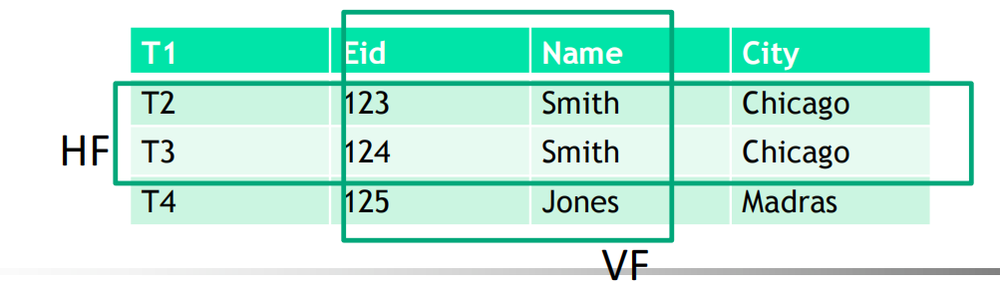
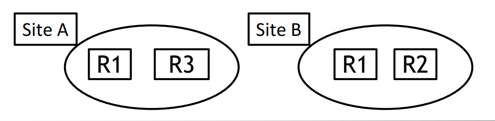
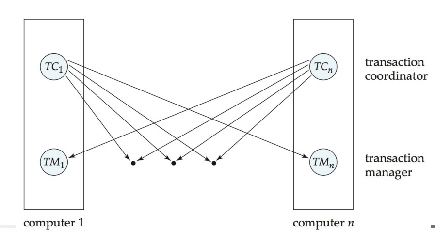
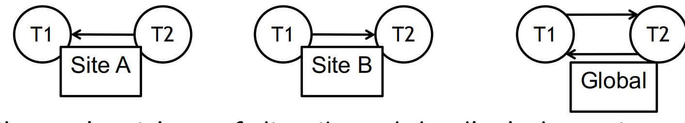

# Distributed Database 分布式数据库

## Learning Outcomes

- Distributed System Concepts 
- Distributed Data Storage
- Distributed Transactions
- Distributed Query Processing
- Concurrency Control in Distributed Databases
- Failure Recovery in Distributed Databases

## Introduction

- A distributed database system consists of **loosely coupled sites** that share no physical component;

  分布式数据库系统由松散耦合的站点组成，这些站点不共享任何物理组件;

- Database systems that run on each site are **independent** of each other;

  在每个站点上运行的数据库系统彼此独立;

- Transactions may access data at **one or more sites**.

  事务可以访问一个或多个站点的数据。

- The **location** of data on each individual sites impacts query optimisation, concurrency control and recovery.

  每个站点上的数据位置会影响查询优化、并发控制和恢复。

- Distributed data is **governed** by factors such as local ownership, increased availability, and  performance issues.

  分布式数据受本地所有权、可用性提高和性能问题等因素的约束。

<hr>

- **Distributed Data Independence**: Users should not have to know where data is located.

  **分布式数据独立性**: 用户不必知道数据的位置。

  - reference relations, copies or fragments of the relations.

    引用关系、关系的副本或片段。

  - extends Physical and Logical Data Independence principles

    扩展了物理和逻辑数据独立性原则

- **Distributed Transaction Atomicity**: Users should be able to write transactions that access and update data at several sites.

  **分布式事务原子性**：用户应该能够编写访问和更新多个站点数据的事务。

  - Transactions are atomic, all changes persist if the transaction commits, or rollback if transaction aborts.

    事务是原子的，如果事务提交，则所有更改都将保留，如果事务中止，则回滚。

<hr>

- If sites are connected by slow networks, these properties are **hard** to support efficiently.

  如果站点通过慢速网络连接，则很难有效地支持这些属性。

- Users have to be aware of where data is located, i.e. Distributed Data Independence and Distributed Transaction Atomicity are notsupported.

  用户必须知道数据的位置，即不支持分布式数据独立性和分布式事务原子性。

- For globally distributed sites, these properties may not even be desirable due to administrative overheads of making locations of data transparent.

  对于全球分布的站点，由于使数据位置透明化的管理开销，这些属性甚至可能并不可取。

### Types of Distributed Databases  分布式数据库的类型

- **Homogeneous** – data is distributed but all servers run the same DBMS software.

  **同构** – 数据是分布式的，但所有服务器都运行相同的 DBMS 软件。

- **Heterogeneous** – different sites run different DBMSs separately and are connected to enable access to data from multiple sites.

  **异构** – 不同的站点分别运行不同的 DBMS，并连接以允许访问来自多个站点的数据。

  - Gateway protocols - API that exposes DBMS functionality to external applications. 

    网关协议 API，用于向外部应用进程公开 DBMS 功能。

  - Examples: ODBC and JDBC

    示例：ODBC 和 JDBC

### Architecture 架构

- **Client/Server** – a system that has one or more client processes and one or more server processes. Client sends a query to a server, and the server processes the query returning the result to the client.

  **客户端/服务器** – 具有一个或多个客户端进程和一个或多个服务器进程的系统。客户端将查询发送到服务器，服务器处理查询，将结果返回给客户端。

- **Collaborating Server** - capable of running queries against local data and executes transactions across multiple servers. 

  **协作服务器** 能够对本地数据运行查询并跨多个服务器执行事务。

- **Middleware** – One database server can manage queries and transactions spanning across multiple servers. A layer that executes relational operations on data from other servers but does not maintain any data.

  **中间件** – 一个数据库服务器可以管理跨多个服务器的查询和事务。对来自其他服务器的数据执行关系操作但不维护任何数据的层。

## Storing data  存储数据

- Relations are stored across several sites. To reduce message-passing costs a relation maybe fragmented across sites.

  关系存储在多个站点中。为了降低消息传递成本，关系可能会跨站点分散。

- **Fragmentation**: breaks a relation to smaller relations and stores the fragments at different sites.

  **碎片化**：打破与较小关系的关系，并将碎片存储在不同的站点。

  - **Horizontal fragments** (HF) - rows of the original data.

    原始数据的 **水平片段** （HF） 行。

    - Selection queries, fragments by city

      选择查询,城市片段

    - **Disjoint union** of the HF must be equal to the original relation.

      HF 的 **不相交并集** 必须等于原始关系。

  - **Vertical fragments** (VF) - columns of the original data.

    原始数据的 **垂直片段** （VF） 列。

    - Projection queries, e.g. fragments of the first two columns

      投影查询，例如前两列的片段

    - Collection of VF must be a **loss-less join decomposition**.

      VF 的集合必须是 **无损联接分解**。（确保要能恢复原本的数据表）



<hr>

- **Replication** – storing several copies of a relation or fragment. Entire relation can be stored at one or more sites.

  **复制** – 存储关系或片段的多个副本。整个关系可以存储在一个或多个站点。

  - Increased Availability – If a site contains replicated data goes down, then we can use another site.

    提高可用性 – 如果一个站点包含复制的数据出现故障，那幺我们可以使用另一个站点。

  - Faster Query Evaluation – Queries are executed faster by using local copy of a relation instead of going to a remote site.

    更快的查询评估 – 通过使用关系的本地副本而不是转到远程站点，可以更快地执行查询。

- Two kinds of replication are **Synchronous** and **Asynchronous** replication (*more on this later*)

  两种复制是 **同步** 和 **异步** 复制 （*稍后会详细介绍*）



## Distributed Catalog Management  分布式目录管理

- Must keep track of how data is distributed across sites.

  必须跟踪数据在站点之间的分布方式。

- Must be able to give a **unique identifier** to each replica of each fragment/relation.

  必须能够为每个片段/关系的每个副本提供 **唯一标识符**。

  - Global relation name -  <local-name>, <birth-site>

  - Global replica name - *replica id* plus global relation name

- **Site catalog** - Describes all objects (fragments, replicas) at a site and keeps track of replicas of relations created at this site.

  **站点目录** 描述站点上的所有对象（片段、副本），并跟踪在此站点上创建的关系的副本。

  - To find a relation look up its birth-site catalog

    要查找关系，请查找其 birth-site 目录

  - Birth-site never changes even if the relation is moved

    即使关系被移动，birth-site 也不会改变

### Updating Distributed Data 更新分布数据

- Users should be able to update data without worrying where relations are stored.

  用户应该能够更新数据，而不必担心关系的存储位置。

- **Synchronous replication** – all copies of a modified relation are updated before the modifying transaction commits.

  **同步复制** – 在修改事务提交之前更新已修改关系的所有副本。

- **Asynchronous replication** – copies of modified relation are updated **over a period of time**, and a transaction that reads **different** copies of the same relation may see different values.

  **异步复制** – 修改后的关系的副本在一段时间内更新，并且读取同一关系的**不同**副本的事务可能会看到不同的值。

  - Widely used in commercial distributed DBMSs

    广泛应用于商业分布式 DBMS -

  - Users must be aware of distributed databases

    用户必须了解分布式数据库

### Synchronous Replication  同步复制

- **Voting technique** – a transaction must write a majorityof copies to modify an object; read at least enough copies to make sure one of the copies is current.

  **投票技术** – 交易必须写入大多数副本来修改对象;至少读取足够的副本，以确保其中一个副本是最新的。

  - For example, 10 copies, 7 are updatable, 4 are read

    例如，10 个副本，7 个可更新，4 个可读取

  - Each copy has a version number, the highest is the most current.

    每个副本都有一个版本号，最高版本号为最新版本。

  - Not attractive and efficient, because reading an object requires reading several copies. Objects are read more than updated.

    没有吸引力且效率不高，因为读取对象需要读取多个副本。对象读取的次数多于更新的次数。

- **Read-any-write-all technique** – a transaction can read only one copy, but must write to all copies.

  **Read-any-write-all 技术** – 一个事务只能读取一个副本，但必须写入所有副本。   -

  - Reads are faster than writes especially if it’s a local copy

    读取比写入更快，尤其是当它是本地副本时

  - Attractive when reads occur more than writes

    当读取发生率多于写入发生率时具有吸引力

  - Most common technique

    最常见的技术

#### Cost of Synchronous Replication  同步复制的成本

- For example, read-any-write-all cost - Before an update transaction can commit, it must **lock** all copies

  例如,读-写-所有成本 在更新事务提交之前,它必须**锁定**所有副本

  - Transaction sends **lock requests** to remote sites and waits for the locks to be granted, during a long period, it continues to hold all locks;

    事务向远程站点发送**锁请求**并等待锁被授予，在很长一段时间内，它继续持有所有锁;

  - If there is a site or communication **failure** then transaction cannot commit until all sites are recovered;

    如果其中有一个站点或通信**出现故障**, 那么在所有站点恢复之前,交易无法提交;

  - Committing creates several additional messages to be sent as part of a commit protocol.

    提交会创建几条附加消息，作为提交协议的一部分发送。

- Since synchronous replication is expensive, asynchronous replication is gaining popularity even though different copies can have different values.

  由于同步复制成本高昂，因此异步复制越来越受欢迎，即使不同的副本可能具有不同的值。

### Asynchronous Replication  异步复制

- Allows modifying transactions to commit before all copies have been changed.

  允许修改事务以在更改所有副本之前提交。

  - Users must be aware of which copy they are reading, and that copy may be out-of-sync for short period of time.

    用户必须知道他们正在读取哪个副本，并且该副本可能会在短时间内不同步。

- Two approaches: **Primary Site** and **Peer-to Peer** replication.

  两种方法：主站点和对等复制。

  - Difference lies in how many copies are “**updatable**’’ or “**master copies**’’.

    区别在于有多少副本是 “可更新” 或 “主副本” 。

#### Peer to Peer Asynchronous Replication  对等异步复制

- More than one copy can be designated as **updateable** (i.e. master copy).

  可以将多个副本指定为 **可更新**（即主副本）。

- Changes to a master copy must be **propagatedto** other copies somehow.

  对主副本的更改必须以某种方式 **传播到** 其他副本。

- **Conflict resolution** is used to deal with changes at different sites.

  **冲突解决**用于处理不同站点的变化。

  - Each master is allowed to update only one fragment of the relation, and any two fragments updatable by different masters are **disjoint**.

    每个 master 只允许更新关系的一个片段，并且任何两个可由不同 master 更新的片段都是 **disjoint**。

  - Updating rights are held by one master at a time.

    更新权限一次由一个 master 持有。

### Primary Site Replication  主站点复制

- **Primary site** – **one** copy of a relation is the **master copy**

  **主站点** – 关系的 **一个** 副本是 **主副本**

- **Secondary site**- replicas of the entire relation are created at other sites. They **cannot** be updated.

  **辅助站点**整个关系的副本在其他站点创建。它们 **不能** 更新。

- Users register/publish a relation at the primary site and subscribe to a fragment of the relation at the secondary site.

  用户在主站点注册/发布关系，并在辅助站点订阅关系的片段。

- Changes to the primary copy transmitted to the secondary copies are done in two steps.

  对传输到次副本的主副本的更改分两个步骤完成。

  - First **capture** changes made by committed transactions;

    首先 **捕获** 已提交的事务所做的更改;

  - Then **apply** these changes.

    然后 **应用** 这些更改。

#### Primary Site Asynchronous Replication - Capture  主站点异步复制捕获

- **Log Based Capture** - the log maintained for recovery is used to generate a **Change Data** Table (CDT)

  **基于日志的捕获** 为恢复而维护的日志用于生成**更改数据表** （CDT）

- **Procedural Capture** – A procedure that is invoked by the DBMS which takes a **snapshot** of the primary copy 

  **进程捕获** – 由 DBMS 调用的过程，用于拍摄主副本的**快照**

- Log based capture is generally better because it deals with changes to the data and not the entire database. However, it relies on log details which may be system specific.

  基于日志的捕获通常更好，因为它处理的是数据的更改，而不是整个数据库的更改。但是，它依赖于日志详细信息，这些详细信息可能是特定于系统的。

#### Primary Site Asynchronous Replication - Apply  主站点异步复制 应用

- The Apply process at the secondary site periodically obtains a snapshot of the primary copy or changes to the CDT table from the primary site, and updates the copy.

  辅助站点上的 Apply 进程会定期从主站点获取主副本的快照或对 CDT 表的更改，并更新副本。

  - Period can be timer or user’s application program based.

    周期可以基于计时器或用户的应用进程。

- Replica can be a view over the modified relation.

  Replica 可以是修改后的关系的视图。

- Log-Based Capture plus continuous Apply minimisesdelay in propagating changes.

  基于日志的捕获加上连续应用,最大限度地减少了传播更改的延迟。

- Procedural Capture plus application-driven Apply is the most flexible way to process updates.

  进程捕获加上应用进程驱动的应用是处理更新的最灵活方式。

  - Used in data warehousing applications

    用于数据仓库应用进程

## Distributed Queries  分布式查询

- Example query with a relation *S* (fragmented at Shanghai and Tokyo sites): 

  具有关系 *S* 的示例查询（在上海和东京站点各有一部分分段）：

SELECT AVG(S.age) 

FROM Sailors S 

WHERE S.rating > 3 AND S.rating < 7

- Horizontally Fragmented

  水平分段

  - Assume tuples with rating < 5 at Shanghai, >= 5 at Tokyo. When calculating average, must compute sum and count at both sites

    假设上海的元组评分为 < 5，东京的评分为 >= 5。计算平均值时，必须计算两个站点的 sum 和 count

  - If WHERE contained just S.rating > 6, just one site at Tokyo.

    如果 WHERE 仅包含 S.rating > 6，则只包含 Tokyo 的一个站点。

- Vertically Fragmented

  垂直碎片化

  - *sid* and *rating* at Shanghai, *sname* and *age* at Tokyo, *tid* at both.

    上海的 *sid* 和 *rating*，东京的 *sname* 和 *age*，两者兼而有之。

  - **Joining** two fragments by a common *tid* and execute the query over this **reconstructe**d relation

    通过一个通用的 *tid* 连接两个片段，并在这个重建的关系上执行查询

- Replicated

  复制

  - Since relation is copied to more than one site, choose a site based on local cost.

    由于关系被复制到多个站点,因此请根据本地成本选择站点。

### Distributed Joins  分布式联接

```sql
SELECT *
FROM Sailors S, Reserves R
WHERE S.sid = R.sid
```

- **Fetch as Needed**, i.e. ship needed blocks of Reserves to London and perform join with a join algorithm. 

  **按需获取**，即将所需的 Reserve 区块运送到伦敦，并使用 join 算法执行 join。

- **Ship to One Site** – Ship entire Reserves to London and perform join with a join algorithm.

  **运送到一个站点** – 将整个 Reserve 运送到伦敦，并使用加入算法执行连接。

- **Semi Joins** and **Bloom Joins** (**read textbook for detailed algorithms!**): assume that some tuples in Reserves do not join with any tuples in Sailors. 

  Semi Joins 和 Bloom Joins（**阅读教科书了解详细算法！**）：假设 Reserve 中的某些元组不与 Sailors 中的任何元组联接。

  - Need to identify Reserve tuples that guarantee **not** to join with any Sailors tuples.

    需要标识保证不与任何Sailors元组联接的Reserve元组。

  - Tradeoff the cost of computing and shipping projection for cost of shipping full Reserves relation.

    权衡计算成本和运输预测的成本与运输全部储备金关系的成本。

  - Bloom Join is similar to Semi Join but there is a bit-vector shipped in the first step instead of a projection.

    Bloom Join 类似于 Semi Join，但在第一步中提供了一个位矢量，而不是一个投影。

### Distributed Query Optimisation  分布式查询优化

- Consider all plans, pick cheapest; similar to centralised optimisation.

  考虑所有计划，选择最便宜的;类似于集中式优化。

  - Communication costs, if there are several copies of a relation, need to decide which to use. 

    如果一个关系有多个副本，则需要决定使用哪个通信成本。

  - If individual sites are running a different DBMS, autonomy of each local site must be preserved while doing global query planning.

    如果各个站点运行不同的 DBMS，则在进行全局查询规划时，必须保留每个本地站点的自主性。

  - Use new distributed join methods (e.g. bloom join and semijoin).

    使用新的分布式连接方法（例如 bloom join 和 semi join）。

- Query site constructs a **global plan**, with suggested local plans describing processing at each site. 

  查询站点构建一个 **全局计划**，其中包含描述每个站点处理的建议本地计划。    -

  - If a site can improve suggested local plan, free to do so.

    如果一个网站可以改进建议的本地计划，可以免费这样做。

## Distributed Transactions  分布式事务

- Transaction is submitted at **one** site but can access data at **other** sites. 

  事务在 **一个** 站点提交，但可以访问 **其他** 站点的数据。

- Each site has its own **local transaction manager** and **transaction coordinator**. （**Important**）

  每个站点都有自己的 **本地事务管理器** 和**事务协调器**。

- Function of the **transaction manager** is to ensure the **ACID** properties of those transactions that execute at that site, i.e. 

  事务管理器的功能是确保在该站点执行的那些事务的 **ACID** 属性，即

  - Maintaining a log for recovery purposes;

    维护日志以进行恢复;

  - Participating in an appropriate concurrency-control scheme to coordinate the concurrent execution of the transactions executing at that site;

    参与适当的并发控制方案，以协调在该站点执行的事务的并发执行;

  - Failure recovery;

    故障恢复;

  - etc

###  Transaction Coordinator  事务协调

- **Transaction coordinator** is responsible for:

  **交易协调员** 负责：

  - **Starting** the execution of the transaction;

    **开始** 交易的执行;

  - **Breaking** the transaction into a number of sub-transactions if needed;

    如果需要，将交易分解为多个子交易;

  - **Distributing** these sub-transactions to the appropriate sites for execution;

    将这些子交易分发到适当的站点执行;

  - **Coordinating** the termination of the transaction, which may result in the transaction being committed at all sites or aborted at all sites.

    **协调** 事务的终止，这可能会导致事务在所有站点提交或在所有站点中止。



## Distributed Locking Protocols  分布式锁定协议

- When locks are obtained and released is determined by the concurrency control protocol.

  何时获取和释放锁由并发控制协议决定。

- **Lock management** can be distributed across many sites:

  **锁管理** 可以分布在多个站点上：

  - Single-lock manager (Centralised) – One site does all the locking; vulnerable if one site goes down.

    单锁管理器（集中式） – 一个站点完成所有锁定;如果一个站点宕机，则容易受到攻击。

  - Primary Copy – Only one copy of each object is designated a primary copy, requests to lock/unlock are handled by lock manager at the primary site regardless where the copy is stored.

    主副本 – 每个对象只有一个副本被指定为主副本，无论副本存储在何处，锁定/解锁请求都由主站点的锁定管理器处理。

  - Distributed lock manager – Requests to lock/unlock a copy of an object stored at a site are handled by the lock manager at the site where the copy is stored.

    分布式锁管理器 – 锁定/解锁存储在站点上的对象副本的请求由存储副本的站点上的锁管理器处理。

### Distributed Deadlock  分布式死锁

- Each site maintains local waits-for graph, and a cycle in a local graph indicates a **deadlock**. 

  每个站点都维护本地等待图，本地图中的循环表示**死锁**。

- A global deadlock might exist even if the local graphs contain no cycles.

  即使局部图形不包含任何循环，也可能存在全局死锁。



- Three algorithms of distributed deadlock detection

  分布式死锁检测的三种算法

  - Centralised – send all local graphs to one site that is responsible for deadlock detection.

    集中化 – 将所有本地图形发送到负责死锁检测的站点。

  - Hierarchal – organise sites into a hierarchy and send local graphs to parent in the hierarchy.

    分层 - 将站点组织成层次结构,并将本地图发送到层次结构中的父节点。

  - Timeout – abort transaction if it waits too long.

    超时 – 如果事务等待时间过长，则中止事务。

### Distributed Recovery and Concurrency Control  分布式恢复和并发控制

- Recovery in distributed DBMSs is more complicated than in centralised DBMSs

  分布式 DBMS 中的恢复比集中式 DBMS 中的恢复更复杂

  - e.g. failure of communication links; failure of a remote site at which a sub transaction is executing.

    例如，通信链路故障；执行子事务的远程站点发生故障

  - All of the sub-transactions must commit or not commit at all. This must be guaranteed despite link failures. 

    **所有**子事务都必须提交或根本不提交。即使链路发生故障，也必须保证这一点。

  - Need a commit protocol – the most common one is **Two-Phase Commit protocol**.

    需要一个提交协议 – 最常见的是 **Two-Phase Commit protocol**。

- A log is maintained at each site, as in a centralised DBMS, and commit protocol actions are additionally logged.

  与集中式 DBMS 一样，每个站点都维护一个日志，并且额外记录提交协议操作。

### Commit Protocols: Two Phase Commit (2PC) 提交协议：两阶段提交

- The site at which the transaction originated is the **coordinator**. Other sites at which sub transactions are executed are **subordinates**.

  发起事务的站点是 **协调器**。执行 sub 事务的其他站点是 **subordinates**。

- When a user decides to commit, the command is sent to the coordinator, which initiates the **2PC**:

  当用户决定提交时，命令将发送到协调器，协调器将启动 **2PC**：

  - **Phase 1**: Coordinator sends a **prepare** message to each subordinate; when subordinate receives a prepare message, it decides to abort or commit its sub transaction; subordinate force-writes an **abort** or **ready** log record and sends a **no** or **yes** message to coordinator accordingly.

    阶段 1：Coordinator 向每个下属发送 prepare 消息;当 Subordinate 收到 Prepare 消息时，它决定中止或提交其 Sub 事务; Subordinate 强制写入 Abort 或 Ready 日志记录，并相应地向 Coordinator 发送 No 或 Yes 消息。

  - **Phase 2**: If coordinator receives a yes message from all subordinates, force writes a **commit** log record and sends commit message to all subordinates;else force-writes an **abort** log record and sends an abort message. Subordinates force-write **abort** or **commit** log record based on the message they receive.

    阶段 2：如果 coordinator 收到来自所有下属的 yes 消息，则强制写入提交日志记录并向所有下属发送提交消息; else 强制写入 Abort 日志记录并发送 Abort 消息。从属根据他们收到的消息强制写入、中止或提交日志记录。

  - *In some implementations, after the two phases, subordinates send acknowledgement message to coordinator; after coordinator receives ack messages from all subordinates it writes an end log for the transaction.*

    在某些实现中，在两个阶段之后，下属向 coordinator 发送确认消息;在 Coordinator 收到来自所有从属的 ACK 消息后，它会写入事务的结束日志。

## Recover After Failure  失败后恢复

- When a site comes back from a crash there is a recovery process that reads the log and processes all transactions which executed the commit protocol at the time of the crash.

  当站点从崩溃中恢复时，会有一个恢复过程来读取日志并处理在崩溃时执行提交协议的所有事务。

- **Failure of subordinate** 

  下属失败

  - Examine its own logs, if there is commit or abort log record for transaction T, then redo T.

    检查自己的日志,如果有事务 T 的提交或中止日志记录,则重做 T。

  - The log only contains a <ready T> record, repeatedly contact the coordinator or other active sites to find the status of T, then performs redo/undo accordingly and write commit/abort log records depending on coordinator’s response; 

    日志仅包含一条<ready T> 记录，反复联系协调器或其他活动站点以查找 T 的状态，然后相应地执行重做/撤消，并根据协调器的响应写入提交/中止日志记录;

  - The log contains no control records (abort, commit, ready) concerning T, undo.

    日志不包含有关 T、undo 的控制记录（abort、commit、ready）。

- **Failure of coordinator**

  协调者失败

  - Participating sites must decide the fate of T.

    参与站点必须决定 T 的命运。

  - If an active site contains a <commit T>/<abort T> record in its log, then T must be committed/aborted.

    如果活动站点的日志中包含 <commit T> 或者 <abort T> 的记录，则必须 提交/中止 T。

  - If some active site does not contain a <ready T>, abort T.

    如果某个活动站点不包含 ，请中止 T。

  - If active sites have a <ready T> record in their logs, but no additional control records (such as <abort T> or <commit T>), it is impossible to determine if a decision has been made and what that decision is, until the coordinator recovers. (**in-doubt transaction**)

    如果活动站点的日志中有<就绪的 T> 记录，但没有其他控制记录（例如 <abort T> 或 <commit T>），则在协调器恢复之前，无法确定是否已做出决策以及该决策是什幺。（**不确定交易**）

### Coordinator Failure - Blocking Problem 协调器故障阻塞问题

- If locking is used, an in-doubt transaction T may hold locks on data at active sites. Such a situation is undesirable, because it may be hours or days before coordinator is again active. This situation is called the **blocking** problem, because T is blocked pending the recovery of coordinator. 

  如果使用锁定，则不确定事务 T 可能会在活动站点上持有对数据的锁定。这种情况是不可取的，因为可能需要数小时或数天才能使 coordinator 再次处于活动状态。这种情况称为 **阻塞** 问题，因为 T 在 Coordinator 恢复之前被阻塞。

- Solution:

  - Use **<ready T,** **L**> log record, where **L** is a list of all write locks held by the transaction T when the log record is written. At recovery time, after performing local recovery actions, for every in-doubt transaction T, all the write locks noted in the <ready T, *L*> log record (read from the log) are reacquired.

    使用 日志记录 <ready T, L>，其中 **L** 是写入日志记录时事务 T 持有的所有写入锁的列表。在恢复时，在执行本地恢复操作后，对于每个不确定事务 T，将重新获取  日志记录 <ready T, L>（从日志中读取）中记录的所有写入锁。

  - Can also be solved using the 3-phase commit protocol (under certain situations)

    也可以使用 3 阶段提交协议来解决（在某些情况下）

### Recovery from Network Partitions  从网络分区中恢复

- The coordinator and all its participants remain in one **partition**. 

  协调器及其所有参与者都保留在一个 **分区** 中。

  - In this case, the failure has no effect on the commit protocol.

    在这种情况下，失败对提交协议没有影响。

- The coordinator and its participants belong to **several different partitions**. 

  协调器及其参与者属于 **几个不同的分区**。

  - From the viewpoint of the sites in one of the partitions, it appears that the sites in other partitions have failed. 

    从其中一个分区中的站点的角度来看，其他分区中的站点似乎已失败。

  - Sites that are not in the partition containing the coordinator simply execute the protocol to deal with failure of the coordinator. 

    不在包含协调器的分区中的站点只需执行协议来处理协调器故障。

  - The coordinator and the sites that are in the same partition: the coordinator follow the usual commit protocol, assuming that the sites in the other partitions have failed.

    协调器和位于同一分区中的站点：协调器遵循通常的提交协议，假设其他分区中的站点已失败。


partition 和 site的区别是什么？
