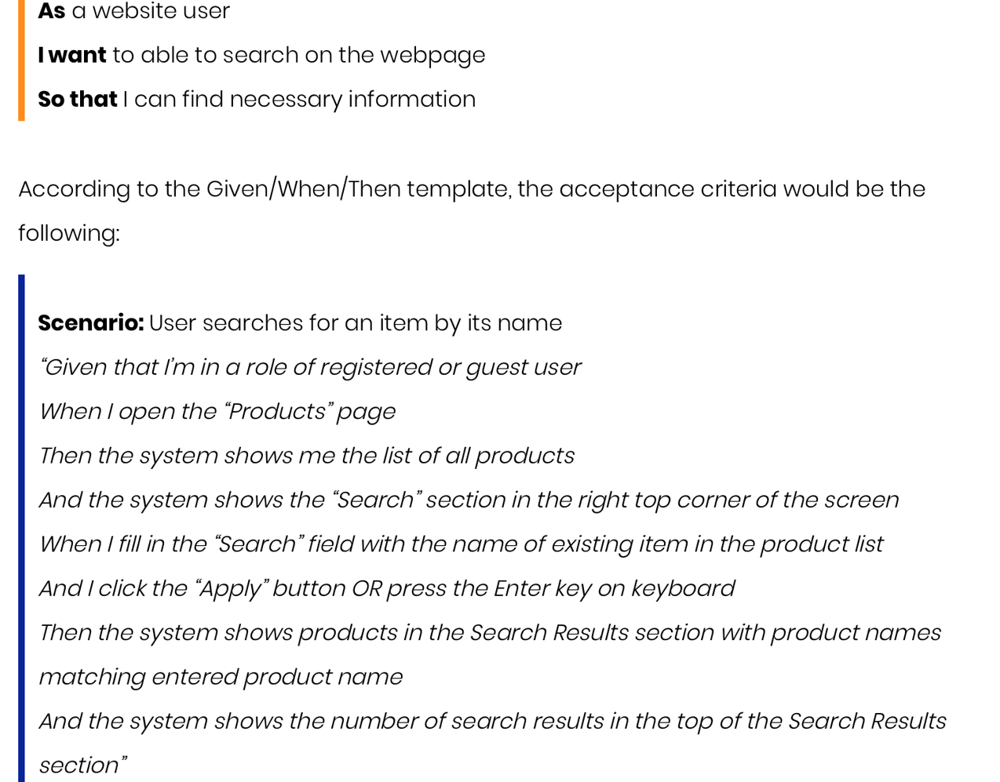

# Scrum Framework

- Epics > Features > Product Backlog Items > Tasks

## Epic

- Epic is a larger scope of requirement which can be divided into smaller requirements

  Epic 是一个较大的需求范围，可以分为更小的需求

- An Epic can be spread across sprints and even across agile teams

  Epic 可以分布在不同的 sprint 中，甚至可以分布在敏捷团队中

- An Epic can be a high-level description of what the client wants

  Epic 可以是客户端所需内容的高级描述

- Epics also allow teams to give high-level understanding of their work to stakeholders without getting into technical details.

  Epics 还允许团队向利益相关者提供对其工作的高级理解，而无需涉及技术细节。

### Example

- As a customer, I want to shop online so that I can purchase books from the online book store.

  作为客户，我想在线购物，以便我可以从在线书店购买书籍。

- As a store manager, I want to manage the store’s overall operation so that the store operation is smooth and the customer is satisfying with the service.

  作为店长，我想管理商店的整体运营，使商店运营顺畅，让客户对服务感到满意。

- As an administrator, I want to maintain the book store website so that the store is secure and reliable.

  作为管理员，我想维护书店网站，以便书店安全可靠。

- **All epics must be in a SLAP**
  - **S**ingle **L**evel of **A**bstraction **P**rinciples

## Epic >> Features

- Epic: 

  - As a customer, I want to shop online so that I can purchase books from the online book store.

    作为客户，我想在网上购物，这样我就可以从网上书店购买书籍。

- Features:

  - As a customer, I want to have wish lists so that I can come back to buy products later.

    作为客户，我希望有愿望清单，以便以后可以回来购买产品。

  - As a customer, I want to check my order status so that I know the delivery progress of my order.

    作为客户，我想查看我的订单状态，以便了解订单的配送进度。

## Feature > PBI > Tasks

- **Feature -** A requirement that the business wants. It represent of one the features broken down from an Epic.

  功能 - 企业想要的要求。它表示从 Epic 中分解的特征之一，通常比较宏观，然后可能实现的时候需要跨越多个sprint周期。

- **Product Backlog Item -** A detail requirement that we further defined from the Feature. It is something that is deliverable within a single sprint.

  产品积压工作项 - 我们从功能中进一步定义的详细需求。它是可以在单个 sprint 中交付的东西。

- **Tasks -** Steps need to be taken in order to fulfill the requirement stated in the PBI.

  任务 - 需要采取步骤才能满足 PBI 中规定的要求。

## Product Backlog  产品积压

### PBI

- PBI ID

- Priority

- Effort

- Title

- Story

- Acceptance Criteria

- Grooming Information

- Some organization includes the following: -

  - Discussion

  - Related PBI

#### PBI的大小

- Small enough to be completed within a Sprint.

  足够小，可以在 Sprint 中完成。

- A Sprint usually consisting of multiple PBIs.

  Sprint 通常由多个 PBI 组成。

- Small and simple to understand and implements.

  体积小，易于理解和实施。

- Consisting of single purpose.

  由单一用途组成。

#### Acceptance Criteria  验收标准

- **Acceptance Criteria** are a formal list that fully enumerates user requirements and all the product scenarios put into the account.

  **验收标准** 是一个正式的列表，它完整地列举了用户需求和放入帐户中的所有产品场景。

- It states the intent of the client and not the solution

  它陈述的是客户的意图，而不是解决方案

- describe achievable and sensible information

  描述可实现的合理信息

- provide the minimum level of functionality the product is to achieve

  提供产品要实现的最低功能水平

**Example**

- User story: As a registered user I want to see the membership expiry date on the billing page so that I know when I have to manually renew or enable auto-renew.

  用户故事：作为注册用户，我希望在账单页面上看到会员资格到期日期，以便知道何时必须手动续订或启用自动续订。

- Acceptance Criteria:

  - The membership expiry date is calculated.

    会籍到期日期是计算的。

  - The membership expiry date is displayed.

    此时将显示会员资格到期日期。

  - The date format is yyyy-mm-dd.

    日期格式为 yyyy-mm-dd。

  - Membership details (including expiry date) are not displayed if the user is not registered/authenticated.

    如果用户未注册/验证，则不会显示成员资格详细信息（包括到期日期）。

- **Formatted**: **GIVEN** the registered user is authenticated **WHEN** visiting the billing page **THEN** the system calculate and display expiry date in yyyy-mm-dd format.

  格式化：假设注册用户在访问结算页面时已经过身份验证，则系统会以 yyyy-mm-dd 格式计算并显示到期日期。

##### Given When Then

- (Given) some context

  （给定）一些背景

- (When) some action is carried out

  （何时）执行某些作

- (Then) a particular set of observable consequences should obtain

  （然后）一组特定的可观察结果应该得到

An example:

- Given my bank account is in credit, and I made no withdrawals recently,

  鉴于我的银行账户是信用的，并且我最近没有提款，

- When I attempt to withdraw an amount less than my card’s limit,

  当我尝试提取的金额少于我的卡限额时，

- Then the withdrawal should be complete without errors or warnings

  然后提款应该是完整的，没有错误或警告

##### More complex Acceptance Criteria

- More complex acceptance criteria can be achieved using AND clause

  使用 AND 子句可以实现更复杂的验收标准

- Given-When-Then-AND-When-Then……..

- Suitable for actions with consequences for a common context

  适用于对常见上下文具有后果的作

### PBI Grooming  PBI 梳理

- PBI Grooming is a process to refine the PBI so that it: -

  PBI 修饰是优化 PBI 的过程，以便

  - Covers as much important information as possible.

    涵盖尽可能多的重要信息。

  - Is in the right size.

    尺寸合适。

- During grooming, we also estimate the effort required to implement it. (You are not required to estimate the effort of your PBI in this project)

  在梳理过程中，我们还会估算实施它所需的工作量。（您不需要估算 PBI 在此项目中的工作量）

- Grooming is a team effort.

  梳理是一项团队努力。

- Covers as much important information as possible

  涵盖尽可能多的重要信息

  - Team members raise questions to gain more information that was missed out by the Product Owner.

    团队成员提出问题以获得产品负责人遗漏的更多信息。

  - Raise as many questions as possible to gain enough understanding so that you know what is required to develop.

    提出尽可能多的问题以获得足够的理解，以便您知道发展需要什么。

  - The Product Owner is responsible to answer all the questions.

    产品负责人 负责回答所有问题。

  - The questions and answers has to be recorded as part of the PBIs for future references.

    问题和答案必须作为 PBI 的一部分记录下来，以备将来参考。

#### When to start grooming

- Before starting Sprint 1: You need to groom enough PBIs with high priority.

  在开始 Sprint 1 之前：您需要整理足够多的高优先级 PBI。

- During Sprint: Groom enough PBIs for the future Sprint to continue.

  在 Sprint 期间：为未来的 Sprint 继续梳理足够的 PBI。

- DO NOT groom too many PBIs for the Sprints in far future

  不要为未来的的sprint准备太多的PBI

## Sprint:

- A Sprint is a time box

  Sprint 是一个时间盒

  - Usually 2 weeks. Begin on first workday of week 1, and end on the last workday of week 2.

    通常为 2 周。从第 1 周的第一个工作日开始，到第 2 周的最后一个工作日结束。

  - It may also be a 3-week or a 4-week Sprint.

    它也可能是为期 3 周或 4 周的 Sprint。

  - Consistent throughout the project

    在整个项目中保持一致

  - Within the 2-week time box, you will do the following: 

    在 2 周的时间框内，您将执行以下作： -

    - Sprint Planning

    - Sprint Execution

    - Sprint Review

    - Sprint Retrospective

按照如下的流程

- Begin with a Sprint Planning.

  从 Sprint 计划开始。

  - It is a meeting among all team members to produce a Sprint Backlog

    这是所有团队成员之间的会议，以产生 Sprint 待办事项列表

  - It takes less than 3 hours, depending on the experience of the developer and the difficulty of the project.

    所需时间不到 3 小时，具体取决于开发人员的经验和项目的难度。

- Follow by Sprint Execution. All team members begin the implementation following the Sprint Backlog.

  接下来是 Sprint 执行。所有团队成员都在 Sprint Backlog 之后开始实施。

  - Sprint Execution start from the 1st day of a Sprint after the Sprint Planning Meeting. Ends at the last day of the Sprint.

    Sprint 执行从 Sprint 计划会议之后的 Sprint 的第一天开始。在 Sprint 的最后一天结束。

  - Throughout the Sprint Execution, conduct a Daily Scrum (Stand up meeting. It takes about 15 minutes)

    在整个 Sprint 执行过程中，召开每日 Scrum（站立会议）。大约需要 15 分钟）

  - Participant in PBI grooming whenever is needed.

    在需要时参与 PBI 梳理。

- Sprint Review

  Sprint 回顾

- Sprint Retrospective

  Sprint 回顾

### Sprint Planning

- Sprint Planning is a meeting among all team members to produce a Sprint Backlog

  Sprint 计划是所有团队成员之间的会议，以生成 Sprint 积压工作

- In practice, the Product Owner will tell the team the overall goal for the current Sprint. For your project, you should discuss and agree among all members. Or the team leader should fix an overall goal.

  在实践中，产品负责人将告诉团队当前 Sprint 的总体目标。对于您的项目，您应该在所有成员之间讨论并达成一致。或者团队领导应该确定一个总体目标。

- According to the goal, select the PBIs to be implemented in this current Sprint.

  根据目标，选择要在此当前 Sprint 中实现的 PBI。

- For each PBI to be implemented, discuss and agree on the tasks involve in completing the PBI.

  对于要实施的每个 PBI，讨论并商定完成 PBI 所涉及的任务。

  - For each task, who will do it? How much time is required?

- Record all information on a Sprint Backlog (Refer to the template)

  记录 Sprint Backlog 上的所有信息（请参阅模板）

### Sprint Review

- In practice, Sprint Review is a meeting among the development team and the stakeholders to review the result (software product) of the current Sprint.

  在实践中，Sprint Review 是开发团队和利益相关者之间的会议，用于审查当前 Sprint 的结果（软件产品）。

- For your project, you have no actual stakeholders. Therefore, you can review the result among yourselves.

  对于您的项目，您没有实际的利益干系人。因此，您可以自己查看结果。

- It takes less than 2 hours, depending the on project. In your case, you can complete it within an hour or less.

  所需时间不到 2 小时，具体取决于项目。对于您来说，您可以在一个小时或更短的时间内完成它。

- The meeting start on the last day of the Sprint just before Sprint Retrospective.

  会议在 Sprint 的最后一天开始，就在 Sprint 回顾之前。

- The main objective of the review is to check how much the result fit the requirement of the stakeholders.

  审查的主要目的是检查结果在多大程度上符合利益相关者的要求。

- If not fit, you may propose to redo the PBI in the future Sprint.

  如果不适合，您可以提议在将来的 Sprint 中重做 PBI。

### Sprint Retrospective

- Sprint Retrospective is a meeting among development team members to review the process of the current Sprint.

  Sprint 回顾是开发团队成员之间的会议，旨在回顾当前 Sprint 的流程。

- Members can comment and suggest the current Sprint in the spirit of making the process better.

  成员可以本着使流程更好的精神对当前的 Sprint 进行评论和建议。

- Finalize all the comments and suggestions and decide three most important suggestions for enhancement in the next Sprint.

  完成所有评论和建议，并确定三个最重要的建议，以便在下一个 Sprint 中进行增强。

- The meeting should not run for more than 2 hours. You could control to make it less than 1 hour.

  会议的持续时间不应超过 2 小时。您可以控制使其少于 1 小时。

- It is the last thing to do in a Sprint.

  这是 Sprint 中要做的最后一件事。

