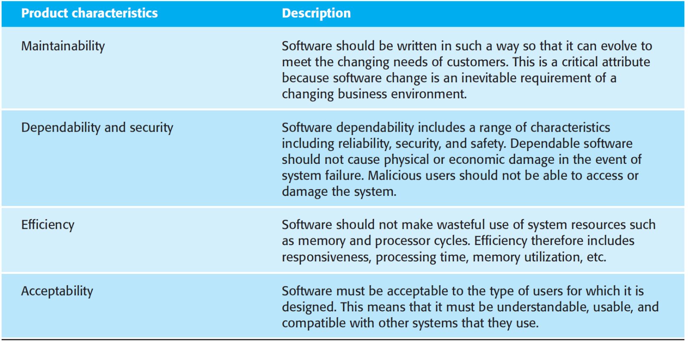
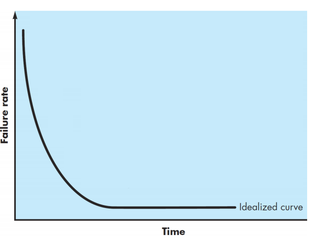
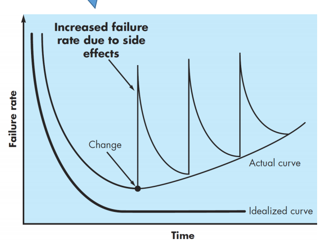

# Introduction

- **Software systems** are abstract and **intangible**. 

  软件系统是抽象的和无形的。

  - They are not constrained by the properties of materials, governed by physical laws, or by manufacturing processes.

    它们不受材料特性的约束，不受物理定律或制造过程的约束。

- Implication? (Benefits and drawback)

  蕴涵？（优点和缺点）

  - This simplifies software engineering, as there are no natural limits to the potential of software.

    这简化了软件工程，因为软件的潜力没有自然的限制。

  - However, because of the lack of physical constraints, software systems can quickly become extremely complex, difficult to understand, and expensive to change.

    但是，由于缺乏物理约束，软件系统很快就会变得极其复杂、难以理解且更改成本高昂。

- What is a **computer software**?

  - **Computer Software** is a collection of instructions, data, or computer programs that are used to run machines and carry out particular activities. Software products may be developed for a particular customer or may be developed for a general market.

    *计算机软件* 是用于运行机器和执行特定活动的指令、数据或计算机进程的集合。软件产品可能是为特定客户开发的，也可能是为一般市场开发的。

- What is **Software System**?

  什么是软件系统

  - A **software system** is a system that consists of a number of separate computer software, configuration files, system documentation and user documentation. (“Wikipedia, Software system”)

    软件系统是由许多独立的计算机软件、配置文档、系统文档和用户文档组成的系统。（“维基百科，软件系统”）

  - The term "software system" should be distinguished from the terms “computer software". The term computer software generally refers to a set of instructions that perform a specific task. However, a software system generally refers to a more encompassing concept with many more components. (“Wikipedia, Software system”)

    “软件系统”一词应与“计算机软件”一词区分开来。术语 计算机软件 通常是指执行特定任务的一组指令。但是，软件系统通常是指具有更多组件的更全面的概念。（“维基百科，软件系统”）

  - The use of the term software system is at times related to the application of system theory approaches in the context of software engineering

    软件系统一词的使用有时与系统论方法在软件工程背景下的应用有关

## Software Engineering

-  What is **software engineering**?

  什么是软件工程

  - Software engineering is an engineering discipline that is concerned with all aspects of software production.

    软件工程是一门涉及软件生产各个方面的工程学科。

  - As a software engineer, you apply software development process when developing a software system.

    作为软件工程师，您在开发软件系统时应用软件开发过程。

  - **Software engineering** is a systematic approach to the production of software that takes into account practical cost, schedule, and dependability issues, as well as the needs of software customers and producers.

    软件工程是一种系统化的软件生产方法，它考虑了实际成本、进度和可靠性问题，以及软件客户和生产商的需求。

  - How this **systematic approach** is actually implemented varies dramatically depending on: 

    这种系统方法的实际实施方式差异很大，具体取决于

    - The organization developing the software  开发软件的组织

    - The type of software  软件类型

    - The people involved in the development process  参与开发过程的人员

  - the most significant factor in determining which software engineering methods and techniques are most important is the **type of application** that is being developed.

    确定哪些软件工程方法和技术最重要的最重要因素是正在开发的应用进程类型

    -  Stand-alone applications
    - Interactive transaction-based applications
    - Embedded control systems
    - Batch processing systems
    - Entertainment systems
    - Systems for modeling and simulation
    - Data collection systems

- **Software Engineering Approaches 软件工程的方法**

  -  Also called **software process**

  - A software process is a sequence of activities that leads to the production of a software product. 

    软件流程是导致软件产品生产的一系列活动。

  - There are four fundamental activities that are common to all software processes:

    所有软件进程共有四个基本活动：

    - **Software specification**

    - **Software development**

    - **Software validation**

    - **Software evolution**

- **Fundamentals** of software engineering

  - Systems should be developed using a managed and understood development process.

    系统应使用托管和理解的开发流程进行开发。

  - Dependability and performance are important for all types of system. 

    可靠性和性能对于所有类型的系统都很重要。

  - Understanding and managing the software specification and requirements (what the software should do) are important. 

    了解和管理软件规范和要求 （软件应该做什幺） 很重要。

  - Where appropriate, you should reuse software that has already been developed rather than write new software. 

    在适当的情况下，您应该重用已开发的软件，而不是编写新软件。

- **Engineering discipline** - Engineers make things work. They apply theories, methods, and tools where these are appropriate. However, they use them selectively and always try to discover solutions to problems even when there are no applicable theories and methods. Engineers also recognize that they must work to organizational and financial constraints so they look for solutions within these constraints

  工程准则 - 工程师让事情顺利进行。他们在适当的地方应用理论、方法和工具。然而，他们有选择地使用它们，并且即使没有适用的理论和方法，也总是试图发现问题的解决方案。工程师还认识到，他们必须努力应对组织和财务限制，因此他们在这些限制中寻找解决方案

- **All aspects of software production** - Software engineering is not just concerned with the technical processes of software development. It also includes activities such as software project management and the development of tools, methods, and theories to support software production.

  软件生产的所有方面 - 软件工程不仅仅涉及软件开发的技术过程。它还包括软件项目管理以及支持软件生产的工具、方法和理论的开发等活动。

## Software Failure & Success

- Software engineering is criticized as inadequate for modern software development.

  软件工程被批评为不适合现代软件开发。

- Software failures are a consequence of two factors:

  软件故障是由两个因素共同造成的：

  - Increasing demands  不断增长的需求

  - Low expectations (you don’t expect the software to grow into a giant beast)  期望值低（你不会指望软件会成长为一头巨大的野兽）

- Of course, we still have problems developing complex software but, without software engineering, we would not have explored space, would not have the Internet or modern telecommunications.

  当然，我们在开发复杂的软件方面仍然存在问题，但如果没有软件工程，我们就不会探索太空，也不会有互联网或现代电信。

- Software engineering has contributed a great deal and its contributions in the 21st century will be even greater.

  软件工程已经做出了很大的贡献，它在 21 世纪的贡献将更大。

## Professional software development

- It includes techniques that support program specification, design, validation, and evolution.

  它包括支持进程规范、设计、验证和演变的技术。

- Professional software usually has the following properties: -

  专业软件通常具有以下属性

  - Strict user requirements 严格的用户要求

  - Required accuracy and data integrity  所需的准确性和数据完整性

  - Higher security standard  更高的安全标准

  - Stable performance for heavy load  重负载性能稳定

  - Required technical support, etc.  所需的技术支持等

| Product Characteristics    | Description                                                  |
| -------------------------- | ------------------------------------------------------------ |
| Maintainability            | Software should be written in such a way so that it can evolve to meet the changing need of customers. This is a critical attribute because software changing is an inevitable requirement of a changing business environment. 软件的编写方式应使其能够不断发展以满足客户不断变化的需求。这是一个关键属性，因为软件更改是不断变化的业务环境的必然要求。 |
| Dependability and Security | Software dependability includes a range of characteristics including reliability, security, and safety. Dependable software should not cause physical or economic damage in the event of system failure. Malicious users should not be able to access or damage the system 软件可靠性包括一系列特性，包括可靠性、安全性和安全性。在系统发生故障时，可靠的软件不应造成物理或经济损失。恶意用户不应能够访问或损坏系统 |
| Efficiency                 | Software should make wasteful use of system resources such as memory and processor cycles. Efficiency therefore includes responsiveness , processing time, memory utilization, etc. 软件应浪费系统资源，例如内存和处理器周期。因此，效率包括 响应性 、处理时间、内存利用率等。 |
| Acceptability              | Software must be acceptable to the type of users for which it is designed. This means that it must be understandable, usable, and compatible with other systems that they use. 软件必须为其设计所针对的用户类型所接受。这意味着它必须易于理解、可用并与他们使用的其他系统兼容 |

There are two kinds of software production **Generic software products** and **Customized software developments**

## Software Development Challenges

- Why does it take so long to get software finished?

- Why are development costs so high?

- Why can’t we find all errors before we give the software to our customers?

- Why do we spend so much time and effort maintaining existing programs?

- Why do we continue to have difficulty in measuring progress as software is being developed and maintained?

## Software Deteriorate 软件恶化

Software is a logical rather than a physical system element. Therefore, software has one fundamental characteristic that makes it considerably different from hardware: *Software doesn’t* **“wear out.**

软件是逻辑系统元素，而不是物理系统元素。因此，软件有一个基本特性，使其与硬件有很大不同： 软件不会 “磨损”。

Therefore,  the failure rate curve for software should take the form of the “idealized curve” shown in Figure

However, Software doesn’t wear out. But it does **deteriorate**. During its life, software will undergo change. As changes are made, it is likely that errors will be introduced, causing the failure rate curve to spike as shown in the “actual curve” 

但是，软件不会磨损。但它确实会**恶化**。在其生命周期中，软件将发生变化。随着更改的进行，很可能会引入错误，导致故障率曲线达到峰值，如下面的 “实际曲线” 所示

（Software engineering methods strive to reduce the magnitude of the spikes and the slope of the actual curve 软件工程方法努力减少尖峰的幅度和实际曲线的斜率）

Before the curve can return to the original steady-state failure rate, another change is requested, causing the curve to spike again.

在曲线可以恢复到原始稳态故障率之前，会请求另一次更改，从而导致曲线再次达到峰值。

- To reduce software changes:  减少软件更改

  - Work closely with the stakeholder to ensure requirements are correctly defined

    与利益相关者密切合作，确保正确定义需求

  - Improve requirement study approach to achieve better requirements study

    改进需求研究方法以实现更好的需求研究

- To reduce side effects after changes:

  减少更改后的副作用

  - The software should be modular so that changes will not have a lot of side effects to other part of the software

    该软件应该是模块化的，这样更改就不会对软件的其他部分产生很多副作用

  - The software must be maintainable

    软件必须是可维护的

  - Comprehensive testing should put in place to reduce errors.

    应进行全面测试以减少错误。

## Why software engineering important

- More and more, individuals and society rely on advanced software systems. We need to be able to produce reliable and trustworthy systems economically and quickly.

  个人和社会越来越依赖先进的软件系统。我们需要能够经济、快速地生产可靠且值得信赖的系统。

- It is usually cheaper, in the long run, to use software engineering methods and techniques for software systems rather than just write the programs as if it was a personal programming project. For most types of systems, the majority of costs are the costs of changing the software after it has gone into use.

  从长远来看，对软件系统使用软件工程方法和技术通常比仅仅像个人编程项目一样编写进程更便宜。对于大多数类型的系统，大部分成本是在软件投入使用后更改软件的成本。

## Web-BASED software engineering 基于 Web 的软件工程

The Web is now a platform for running application and organizations are increasingly developing web-based systems rather than local systems. Cloud computing is an approach to the provision of computer services where applications run remotely on the ‘cloud’.

Web 现在是运行应用进程的平台，组织越来越多地开发基于 Web 的系统，而不是本地系统。云计算是一种提供计算机服务的方法，其中应用进程在“云”上远程运行。

- **Software reuse** is the dominant approach for constructing web- based systems. 

  **软件重用** 是构建基于 Web 的系统的主要方法。

  - When building these systems, you think about how you can assemble them from pre-existing software components and systems. 

    在构建这些系统时，您需要考虑如何从预先存在的软件组件和系统中组装它们。

- Web-based systems should be developed and delivered **incrementally.** 

  基于 Web 的系统应以 **增量方式**开发和交付。

  - It is now generally recognized that it is impractical to specify all the requirements for such systems in advance. 

    现在普遍认为，提前指定此类系统的所有要求是不切实际的。

- User interfaces are constrained by the capabilities of web browsers. 

  用户界面受 Web 浏览器功能的限制。

  - Technologies such as AJAX allow rich interfaces to be created within a web browser but are still difficult to use. Web forms with local scripting are more commonly used. 

    AJAX 等技术允许在 Web 浏览器中创建丰富的界面，但仍然难以使用。使用本地脚本的 Web 表单更常用。

## Software development Risk  软件开发风险

- Many software development projects run into difficulties

  许多软件开发项目遇到困难

  - Does not work as expected

    未按预期工作

  - Over budget

    超出预算

  - Late delivery

    延迟交货

- Much of the functionalities in the software is wasted

  软件中的许多功能都被浪费了

  - Wrong requirement

    错误的要求

  - User dislike it

    用户不喜欢它

  - There are no customer

    没有客户

- Fully understand requirement

  充分了解需求

- Validate requirement

  验证需求

## Questions

- Which of the following are the activities when you are developing a software system?

  开发软件系统时，以下哪些活动是？

  **A. Test the software**

  **B. Write program**

  **C. Estimate the time needed to complete the program**

  **D. Write a user documentation**

- Which of the following are considered to be the causes to the failure of software engineering?

  以下哪些被认为是软件工程失败的原因？

  **A. Changing software requirements**

  B. Adding software budget

  **C. Starts software development immediately to save time**

- Software engineering include the following activities:

  软件工程包括以下活动：

  **A. Software team forming**

  **B. Software specification**

  **C. Software selection**

  **D. Software validation**

- Which of the following can be considered as a generic software?

  以下哪项可以被视为通用软件？

  **A. Image processing software like Adobe Photoshop**

  B. Logistics software for the Chinese Army

  **C. Language translation mobile app in the Apple Store**

- Why a web-based systems should be developed and delivered incrementally?

  为什幺应该逐步开发和交付基于 Web 的系统？

  A. It is normally run on a web browser

  **B. The user is normally diverse, requirements can be unpredictable**

  **C. To allow the developers to learn from the feedback as they are developing the system**

  **D. The web is too large** 