# Software Test 软件测试

这节课主要就是在讲要怎么提高测试的效率，具体怎么实现测试是在下节课

## 1. Testing

### 1.1 Notes

- From a general perspective, testing is part of a broader process of software verification and validation (**V & V**), checking that software being developed meets its **specification** and delivers the **functionality** expected by the people paying for the software. 

  从一般的角度来看，测试是更广泛的软件验证和确认过程的一部分，检查正在开发的软件是否满足其规格并提供支付软件的人所期望的功能。

- These checking processes start as soon as requirements become available and continue through all stages of the development process

  这些检查过程在需求已经初步被实现的时候就要立即开始，并持续到开发过程的所有阶段

- Two Techiniques:

  两种技术

  - **Static**: Inspections concerned with analysis of the static system representation to discover problems (e.g., check document and code analysis)

    **静态**：与分析静态系统表示有关以发现问题的检查（例如，检查文档和代码分析）

  - **Dynamic**: Testing concerned with exercising and observing product behaviour. The system is executed with test data and its operational behaviour is observed.

    **动态**： 与锻炼和观察商品行为有关的测试。使用测试数据执行系统，并观察其运行行为。

### 1.2 The Basics

- Testing, from a practical, execution-focused view, is intended to show that a program does what it is intended to do and to discover program defects before it is put into use.

  从实际的、以执行为中心的角度来看，测试旨在表明程序执行其预期操作，并在程序投入使用之前发现程序缺陷。

- When you test software, you execute a program using **artificial data**.

  当您测试软件时，您使用**人工数据**

- You check the results of the test run for errors, anomalies or information about the program’s non-functional attributes.

  您可以检查测试运行的结果，以查找错误、异常或有关程序的非功能属性的信息。

anomalies 异常

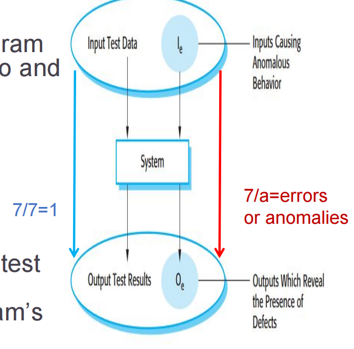

### 1.3 2 Goals 2个目标

- To demonstrate to the developer and the customer that the software meets its requirements, for **validation**

  为了向开发人员和客户证明软件满足其要求，以进行 **验证**

- For <u>custom software</u>, this means that there should be at least one test for every requirement in the requirements document.  For <u>generic software products</u>, it means that there should be tests for all of the system features, plus combinations of these features, that will be incorporated in the product release.

  对于 <u>用户软件</u>，这意味着需求文档中的每个需求都应该至少有一个测试。 对于 <u>generic 软件产品</u>，这意味着应该对所有系统功能以及这些功能的组合进行测试，这些功能将包含在产品版本中。

- To discover situations in which the behavior of the software is incorrect, undesirable or does not conform to its specification, for **finding defects**

  为了发现软件行为不正确、不受欢迎或不符合其规范的情况，用于 **查找缺陷**

  - It is concerned with rooting out undesirable system behavior such as system crashes, unwanted interactions with other systems, incorrect computations and data corruption.

    它关注的是根除不良的系统行为，例如系统崩溃、与其他系统不必要的交互、不正确的计算和数据损坏。

### 1.4 Stages of testing 测试阶段

- Development testing, where the system is tested during development to discover bugs and defects. 

  开发测试，在开发过程中对系统进行测试以发现错误和缺陷。

  - System designers and programmers are likely to be involved

    系统设计人员和进程员可能会参与其中

- Release testing, where a separate testing team test a complete version of the system before it is released to users. 

  发布测试，其中单独的测试团队在向用户发布系统的完整版本之前对其进行测试。

  - Check that the system meets the requirements of system stakeholders

    检查系统是否满足系统利益相关者的要求

- User testing, where users or potential users of a system test the system in their own environment. 

  用户测试，系统的用户或潜在用户在自己的环境中测试系统。

  - The ‘user’ may be an internal marketing group

    “用户”可能是内部营销组

  - Acceptance testing where the customer formally tests

    客户正式测试的验收测试

## 2. Development Test

### Basics

**From small level to large level, the d evelopment Testing tests 3 things:****从小到大，发展测试测试3件事：**

- **Unit Testing**: Where individuals program units or object classes are tested. United testing should focus on testing the functionality of objects or methods.

  **单元测试**：测试单个进程单元或对象类的地方。联合测试应侧重于测试对象或方法的功能。

- **Component testing**: where several individual units

  **组件测试**：其中几个单独的单元

- System test: where some or all of the components in a system is tested as a whole. System testing should focus on testing component interactions.

  系统测试：将系统中的部分或全部组件作为一个整体进行测试。系统测试应侧重于测试组件交互。

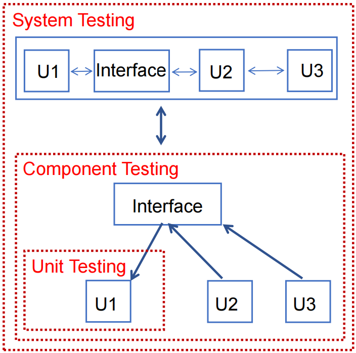

### 2.1 Unit Testing 单元测试

用图像只是帮助找到我们需要做什么以及具体的测试流程是什么样的，而不是展现测试的过程到底是什么实现的

#### 2.1.1 Example of a weather station example

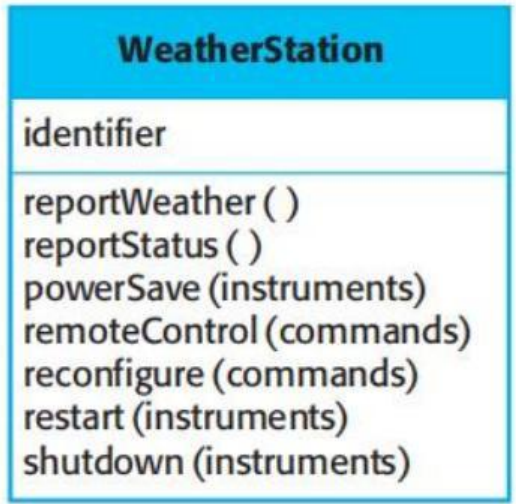

- It has a single attribute, which is its **identifier**. Only need a test that checks if it has been properly set up. 

  它只有一个属性，即其标识符。只需要一个测试来检查它是否已正确设置。

- Define **test cases for all of the methods** associated with the object such as reportWeather, reportStatus, etc.

  为与对象关联的所有方法定义测试用例，例如 reportWeather、reportStatus 等。 

- Ideally, you should test methods in isolation but, in some cases, some **test sequence**s are necessary (e.g., restart/shutdown).

  理想情况下，您应该孤立地测试方法，但在某些情况下，一些测试串行是必要的（例如，重新启动/关闭）。

通常情况下，最完美的情况就是程序员能找到一个测试流程，然后这个流程能够串起来所有的的state。但是大多数现实情况中，这是很难实现的，因此最常用的方法就是设计**多条**flow，然后这些所有的运行flow合并在一起能够包含所有的states。

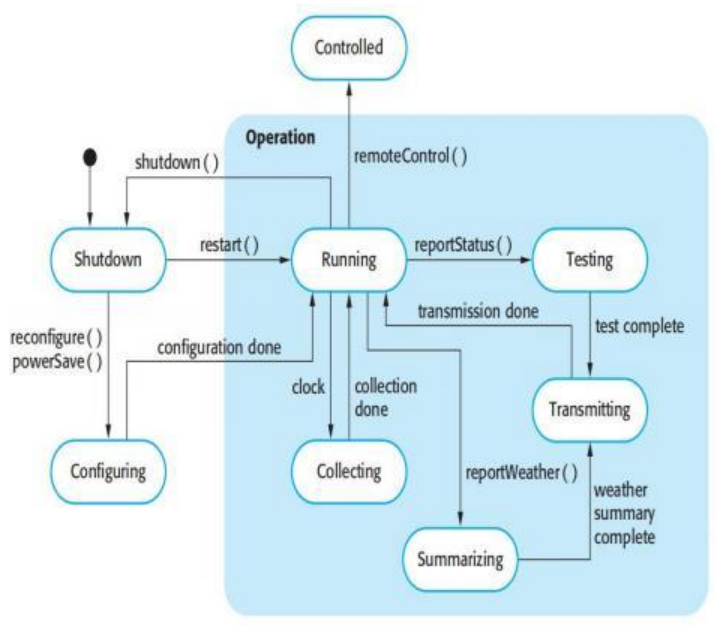

- Using a state model, identify flow of state transitions to be tested and the event sequences to cause these transitions

  使用状态模型，确定要测试的状态转换流以及导致这些转换的事件串行

- For example:

  - Shutdown -> Running-> Shutdown

  - Configuring-> Running-> Testing -> Transmitting -> Running

  - Running-> Collecting-> Running-> Summarizing -> Transmitting -> Running

#### 2.1.2 Another Example

Another simple example:

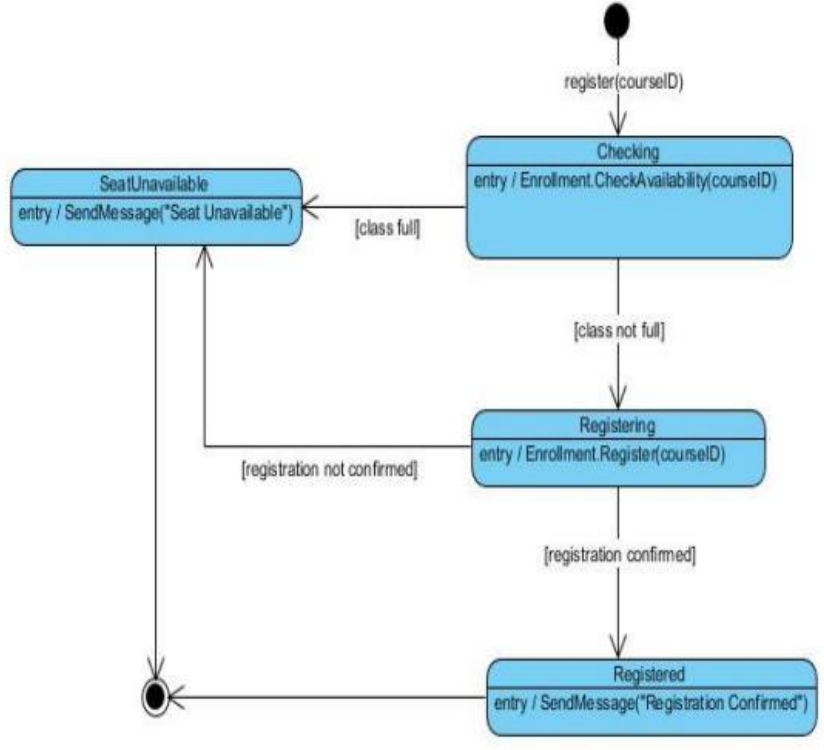

- Test Case 1: Start > Checking > SeatUnavailable > Terminate

- Test Case 2: Start > Checking > Registering > Registered \>Terminate

- Test Case 3: Start > Checking > Registering > SeatUnavailable > Terminate

或者也可以使用表格来表示

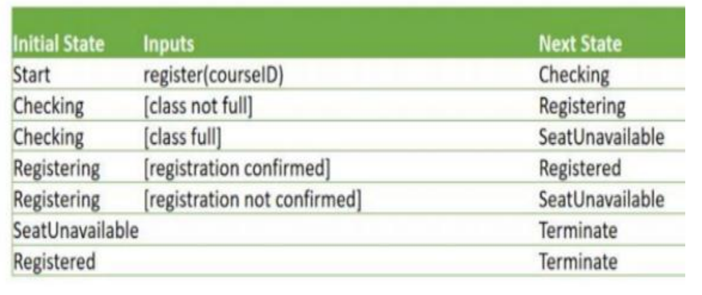

#### 2.1.3 Automated Unit Testing 自动化单元测试 (具体的测试方式在下节课)

- Whenever possible, unit testing should be automated so that tests are run and checked without manual intervention.

  应尽可能自动执行单元测试，以便在无需人工干预的情况下运行和检查测试

- In automated unit testing, you make use of a test automation framework (such as JUnit) to write and run your program tests.

  在自动化单元测试中，您可以使用测试自动化框架（如 JUnit）来编写和运行程序测试

- Unit testing frameworks provide generic test classes that you extend to create specific test cases. They can then run all of the tests that you have implemented and report, often through some GUI, on the success of otherwise of the tests.

  单元测试框架提供通用测试类，您可以扩展这些类以创建特定的测试用例。然后，他们可以运行您实施的所有测试，并通常通过一些 GUI 报告测试是否成功。

- A setup part, where you initialize the system with the test case (e.g., initialize the object under test)

  设置部分，用于使用测试用例初始化系统（例如，初始化被测对象）

- A call part, where you call the object or method to be tested.

  调用部分，用于调用要测试的对象或方法。

- An assertion part where you compare the result of the call with the expected result. If the assertion evaluates to true, the test has been successful if false, then it has failed.

  一个断言部分，您可以在其中将调用结果与预期结果进行比较。如果断言的计算结果为 true，则测试成功，如果为 false，则测试失败。

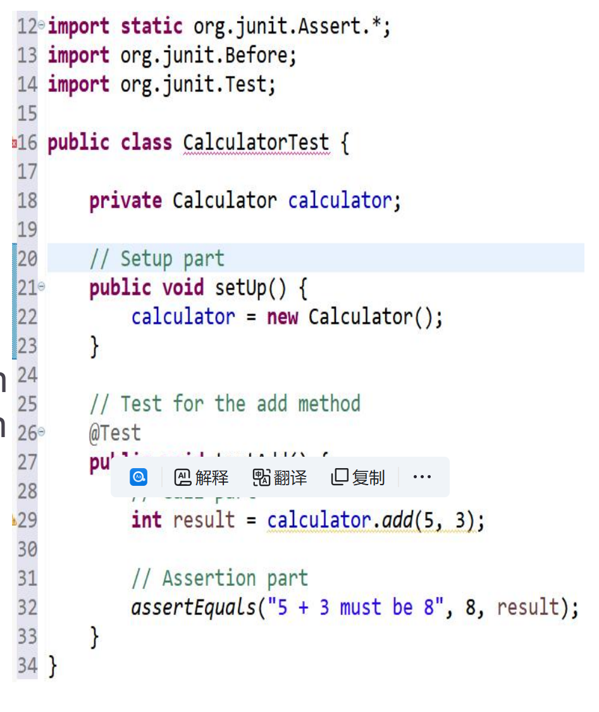

#### 2.1.4 Choosing a Test Case  选择一个测试用例

- Testing is expensive and time consuming, so it is important that you choose **effective unit test cases**. Effectiveness, in this case, means two things:

  测试成本高昂且耗时，因此选择**有效的单元测试**用例非常重要。在这种情况下，有效性意味着两件事：

  - The test cases should show that, when used as expected, the component that you are testing does what it is supposed to do.

    测试用例应显示，当按预期使用时，您正在测试的组件将执行它应该执行的操作。

  - If there are defects in the component, these should be revealed by test cases.

    如果组件中存在缺陷，则应通过测试用例来揭示这些缺陷。

- This leads to 2 types of unit test case:

  这导致了两种类型的单元测试用例：

  - The first of these should reflect normal operation of a program and should show that the component works as expected.

    第一个选项应反映程序的正常运行，并应显示组件按预期工作。（正常测试）

  - The other kind of test case should be based on testing experience of where common problems arise. It should use abnormal inputs to check that these are properly processed and do not crash the component.

    另一种测试用例应该基于常见问题出现位置的测试经验。它应该使用异常的 inputs 来检查这些 inputs 是否得到正确处理，并且不会使组件崩溃。（测试异常处理能力，需要对项目一定的了解和经验）

#### 2.1.5 Partition Strategy 分区策略

- Strategy 1: **Partition testing**： where you identify groups of inputs that have common characteristics and should be processed in the same way. You should choose tests from within each of these groups.

  策略 1：分区测试，在这里你识别出具有共同特征的输入组，并以相同的方式进行处理。您应该从每个组中选择测试。

- Each of these groups is an **equivalence partition** or domain where the program behaves in an equivalent way for each group member

  这些组中的每一个都是一个等价分区或域，其中程序对每个组成员的行为都是等价的

例如：

Partition-Positive Integer: 1, 2, 3, 4

Partition-Negative Integer: -1, -2, -3, -4

通过对相同数据类型的内容进行分组，这样你会大大减轻测试需要的花费。因为这样你只需要从每一组中取出一个或者取出少数几个案例进行测试，然后这些用例测试出来的结果往往能直接适用于它们属于的组中的其他的数据。

A good rule of thumb for test case selection is to choose test cases on the **boundaries of the partitions**, plus cases close to **the midpoint of the partition**.

测试用例选择的一个好的经验法则是选择**分区边界上的测试用例**，加上**靠近分区中点**的用例。这些用例更具有代表性凭借更容易导致错误。

You identify partitions by using the program specification or user documentation and from experience where you predict the classes of input value that are likely to detect errors.

您可以通过使用程序规范或用户文档来识别分区，并根据经验预测可能检测到错误的输入值类别。

Program accepts 4 to 10 inputs which are five-digit integers ranging from 10,000 to 99,999

进程接受 4 到 10 个输入，这些输入是从 10,000 到 99,999 的五位整数

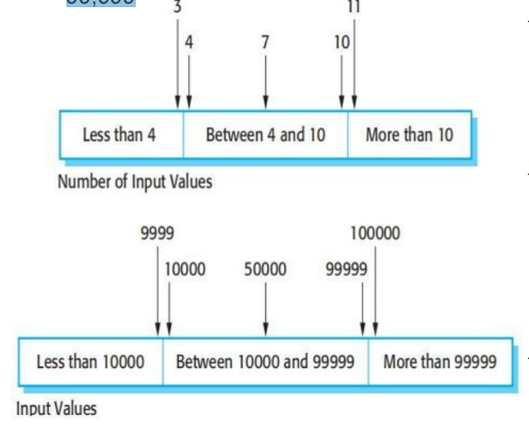

然后进行异常输入测试:

values less than 10000

values more than 99999

#### 2.1.6 Guideline Strategy  指导策略

- Strategy 2: **Guideline-based testing**: where you use testing guidelines to choose test cases. These guidelines reflect previous experience of the kinds of errors that programmers often make when developing component. 

  策略 2：**基于指南的测试**：使用测试指南来选择测试用例。这些准则反映了进程员在开发组件时经常犯的各种错误的经验。

  - Test software with sequences/arrays/list which have only a single value. 

    使用只有一个值的 sequences/arrays/list 测试软件。

    - Programmers naturally think of sequences as made up of several values and sometimes they embed this assumption in their programs. Consequently, if presented with a single-value sequence, a program may not work properly

      程序员自然而然地认为串行由多个值组成，有时他们会将此假设嵌入到他们的进程中。因此，如果呈现单值串行，则进程可能无法正常工作

  - Use sequences/arrays/list of different sizes in different tests. 

    在不同的测试中使用不同大小的 sequences/arrays/list。

    - [1], [1,2], [1,2,3] and so on

  - Derive tests so that the first, middle and last elements of the sequence are accessed. 

    派生测试，以便访问串行的第一个、中间和最后一个元素。

    - e.g., the partition strategy

      例如，分区策略

  - Test with sequences/arrays/list of zero length. 

    使用长度为零的 sequences/arrays/list 进行测试。

    - e.g., []

### 2.2 Component Testing  组件测试

- Software components are often composite components that are made up of several interacting units. 

  软件组件通常是由多个交互单元组成的复合组件。

- The functionality of the component is based on the these units interacting through interface. 

  该组件的功能基于这些单元通过接口进行交互。

- Testing composite components should therefore focus on showing that the component interface behaves according to its specification. 

  因此，测试复合组件应侧重于显示组件接口的行为符合其规范。

  - You can assume that unit tests on the individual objects within the component have been completed.

    您可以假定已完成对组件中各个对象的单元测试。

#### Testing Interface in the Component  在组件中测试接口

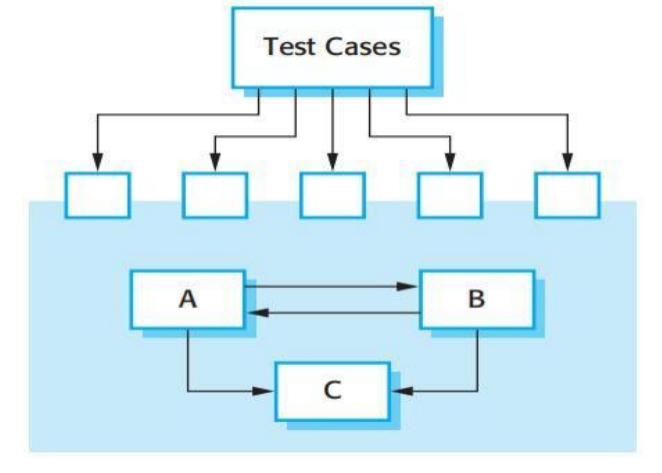

- Unit A, B, and C have been integrated to create a larger component or subsystem. 

  单元 A、B 和 C 已集成，以创建更大的组件或子系统。

- The test cases are **not applied to the individual units but rather to the interface of the composite component created** by combining these components.

  测试用例 不是应用于单个单元，而是应用于通过组合这些组件创建的复合组件的接口。

Note: Interface errors in the composite component may not be detectable by testing the individual objects because these errors result from interactions between the objects in the component

注： 通过测试单个对象，可能无法检测到复合组件中的接口错误，因为这些错误是由组件中对象之间的交互引起的

#### 2.2.2 Types of Interface Errors  接口错误的类型

misunderstanding：想叫A去做的事情，结果最终是命令B去做

- **Interface misuse**

  **接口误用**

  - A calling unit calls another unit and makes an error in its use of its interface. e.g. parameters in the wrong order. 

    让调用单元去调用另一个单元，并在使用其接口时出错。例如，参数的顺序错误。

- **Interface misunderstanding**

  **界面误区**

  - A calling unit embeds assumptions about the behaviour of the called unit which are incorrect. 

    调用单元嵌入了有关被调用单元行为的不正确的假设。

- **Timing errors**

  **时序错误**

  - The called and the calling unit operate at different speeds and out-of-date information is accessed.

    被叫和主叫单元以不同的速度运行，并且访问了过期的信息。

#### 2.2.3 General Guidelines for Interface Testing  接口测试的一般准则

- Design tests so that parameters to a called procedure are at the extreme ends of their ranges

  设计测试，使被调用过程的参数处于其范围的极端

- Always test pointer parameters with null pointers

  始终使用 null 指针测试指针参数

  - processCustomerData(*some para*) -> processCustomerData(NULL)

- Design tests which cause the component to fail

  设计导致组件失败的测试

  - parseDate(String dateStr) in format "YYYY-MM-DD” -> parseDate("2024- 31-02") or parseDate("02-2024-31")

- Use Stress stress testing

  使用压力测试

  - Test how the system handles high traffic and data load

    测试系统如何处理高流量和数据负载

- Where several components interact through shared memory, design tests that vary the order in which these components are activated

  当多个组件通过共享内存进行交互时，设计测试改变这些组件的激活顺序

  - In a multi-threaded application where T1, T2, T3 threads access and modify shared variables, write tests performing T1, T3, T2 or so

    在 T1、T2、T3 线程访问和修改共享变量的多线程应用进程中，编写执行 T1、T3、T2 等的测试

### 2. 3 System testing  系统测试

- System testing during development involves integrating components to create a version of the system and then testing the integrated system. 

  开发过程中的系统测试包括集成组件以创建系统版本，然后测试集成系统。

- The focus in system testing is testing the interactions between components. 

  系统测试的重点是测试组件之间的交互。

- System testing checks that components are compatible, interact correctly and transfer the right data at the right time across their interfaces.

  系统测试的重点是测试组件之间的交互。

#### 2.3.1 System v.s. Component Testing   系统与组件测试

- **System testing obviously overlaps with component testing** but there are two important differences

  系统测试显然与组件测试重叠，但有两个重要的区别

  - During system testing, reusable components that have been separately developed and off-the-shelf systems may be integrated with newly developed components. The complete system is then tested.

    在系统测试期间，单独开发的可重用组件和现成系统可以与新开发的组件集成。然后对整个系统进行测试。 

  - Components developed by different team members or sub teams may be integrated at this stage. System testing is a collective rather than an individual process. 

    由不同团队成员或子团队开发的组件可以在此阶段集成。系统测试是一个集体的过程，而不是单个过程。

    - In some companies, system testing may involve a separate testing team with no involvement from designers and programmers.

      在一些公司中，系统测试可能涉及一个单独的测试团队，设计人员和进程员没有参与。

#### 2.3.2 Use case-based Approach  基于用例的方法

- The use-case developed to identify system interactions canbe used as a basis for system testing.

  为识别系统交互而开发的用例可以用作系统测试的基础。

- Each use case usually involves several system components so testing the use case forces these interactins to occur.

  每个用例通常涉及多个系统组件，因此测试用例会强制发生这些交互。

- You can use the sequence diagrams to identify operations that will be tested and to help design the test cases to execute.

  您可以使用流程图来识别将要测试的操作，并帮助设计要执行的测试用例。

#### 2.3.3 System Testing Policies  系统测试策略

- Exhaustive system testing is impossible so testing policies, which define the required system test coverage, may be developed. 

  详尽的系统测试是不可能的，因此可以制定定义所需系统测试覆盖率的测试策略。

- Examples of testing policies:

  测试策略示例：

  - All system functions that are accessed through menus should be tested. 

    应测试通过菜单访问的所有系统功能。

    - e.g., Under the "File" menu, there are "Open", "Save", "Exit" buttons, ensure all these buttons interacting with users can work

      例如，在“文档”菜单下，有“打开”、“保存”、“退出”按钮，确保与用户交互的所有这些按钮都可以工作

  - Combinations of functions (e.g. text formatting) that are accessed through the same menu must be tested. 

    必须测试通过同一菜单访问的功能组合（例如文本格式）。

    - e.g., Selecting text and applying multiple formatting options together, e.g., **Bold** + *Italic =* **abc**, to ensure they can work in combination without issues

      例如，选择文本并同时应用多个格式选项，例如 **粗体** + *斜体 =* **abc**，以确保它们可以毫无问题地组合工作

  - Where user input is provided, all functions must be tested with both correct and incorrect input. 

    在提供用户输入的情况下，必须使用正确和错误的输入测试所有功能。

    - e.g., username + password

      例如，用户名 + 密码

## 3. Release testing 发布测试

- Release testing is the process of testing a particular release of a system that is intended for use outside of the development team. 

  发布测试是测试系统的特定版本的过程，该版本旨在供开发团队外部使用。

- The primary goal of the release testing process is to convince the supplier of the system that it is good enough for use. 

  发布测试这个过程的主要目标是让系统的供应商相信它足够好，可以使用。

  - Release testing, therefore, has to show that the system delivers its specified functionality, performance and dependability, and that it does not fail during normal use.

    因此，发布测试必须表明系统提供其指定的功能、性能和可靠性，并且在正常使用期间不会出现故障。

### 3.1 Release testing v.s System testing  发布测试 vs 系统测试

- Important differences:

  重要区别：

  - A separate team that has not been involved in the system development, should be responsible for release testing. 

    应由一个未参与系统开发的独立团队负责发布测试。

  - System testing by the development team should focus on discovering **bugs** in the system. The objective of release testing is to check that the system meets its **requirements** and is good enough for external use .

    开发团队的系统测试应侧重于发现系统中的错误。发布测试的目标是检查系统是否满足其要求，并且是否足够好，适合外部使用。

### 3.2 Requirements Based Approach  基于需求的方法

- Requirements-based approach involves examining each requirement and developing a test or tests for it.

  基于需求的方法包括检查每个需求并为其开发一个或多个测试。

Example:

MHC-PMS requirements:

- If a patient is known to be allergic to any particular medication, then presentation of that medication shall result in a warning message being issued to the system user.

  如果已知患者对一些特定药物过敏，则出示该药物将导致向系统用户发出警告消息。

- If a prescriber chooses to ignore an allergy warning, they shall provide a reason why this has been ignored.

  如果处方者选择忽略过敏警告，他们应提供忽略该警告的原因。

THEN SET TEST 接下来进行如下的测试

- Set up a patient record with no known allergies. 

  创建没有已知过敏症的患者记录。

- Set up a patient record with a known allergy. 

  设置已知过敏的患者记录。

- Set up a patient record in which allergies to one or more drugs are recorded.

  设置患者记录，其中记录对一个或多个药物的过敏情况。

- Prescribe two drugs that the patient is allergic to. 

  开出患者过敏的两种药物。

- Prescribe a drug that issues a warning and overrule that warning

  开出发出警告的药物并推翻该警告

#### 3.3 Scenario Approach  情景方法

- Scenario approach devises typical scenarios of use and use these to develop test cases for the system. 

  场景方法设计了典型的使用场景，并使用这些场景为系统开发测试用例。

- A scenario is a story that describes one way in which the system might be used. 

  场景是描述系统可能使用的一种方式的显示情况。

- Scenarios should be realistic and real system users should be able to relate to them.

  场景应该是真实的，并且真实的系统用户应该能够与之相关。

Kate 是一名专门从事心理健康护理的护士。她的职责之一是在家中探访患者，检查他们的治疗是否有效，以及他们是否没有药物副作用。咨询结束后，凯特回到诊所，将就诊患者的记录上传到数据库。该系统为 Kate 生成了一份患者通话清单，她必须联系这些患者以获取后续信息并进行临时预约。在家访日，Kate|登录 MHC-PMS 并使用它来打印她当天的家访时间表，以及有关要探访的患者的摘要信息。她要求将这些患者的记录下载到她的笔记本电脑上。系统会提示她输入关键短语，以识别笔记本电脑上的记录。她拜访的其中一位患者是 Jim，他正在接受抑郁症药物治疗。Jim 觉得这种药物对他有帮助，但认为它有让他夜不能寐的副作用。Kate 查找 Jim 的记录，并提示输入她的关键短语来解密记录。她检查了开的药，并询问是否为失眠是一种已知的副作用，因此她在吉姆的记录中记下了问题，并建议他去诊所换药。他同意了，所以凯特在回到诊所预约医生时立即给他打电话。她结束了咨询，系统重新加密了 Jim 的记录。

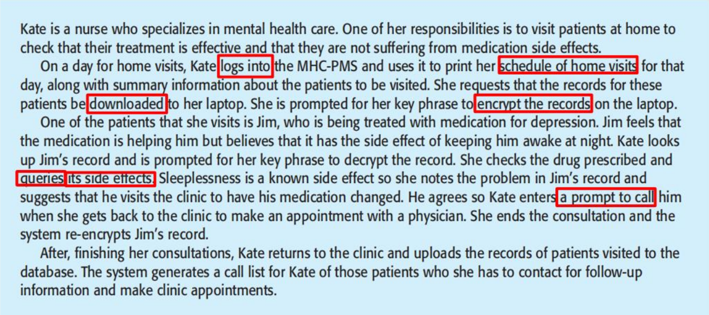

#### 3.4 Testing performance  测试性能

- Part of release testing may involve testing the emergent properties of a system, such as performance and reliability. 

  发布测试的一部分可能涉及测试系统的紧急属性，例如性能和可靠性。

- Performance tests usually involve planning a series of tests where the load is steadily increased until the system performance becomes unacceptable.

  性能测试通常涉及规划一系列测试，其中负载稳步增加，直到系统性能变得不可接受。

- To conduct performance test:

  要进行性能测试：

  - An operational profile: a set of tests that reflect the actual mix of work that will be handled by the system

    操作配置文档：一组测试，反映系统将处理的实际工作组合

  - Construct: If 90% of the transactions in a system are of type A; 5% of type B; and the remainder of types C, D, and E → design the operational profile so that the vast majority of tests are of type A

    构造：如果系统中 90% 的交易是 A 类型; B 型 5%; 其余类型 C、D 和 E → 设计操作配置文档，以便绝大多数测试都是 A 类型

- Stress testing

  压力测试

  - Stressing the system by making demands that are outside the design limits of the software. 

    通过提出超出软件设计限制的要求来强调系统。

  - Example: testing a transaction processing system that is designed to process up to 300 transactions per second. 

    示例：测试旨在每秒处理多达 300 个事务的事务处理系统。

    - Test with fewer 300 transaction

      使用较少的 300 个事务进行测试

    - Increase the load on the system until it fails 

      增加系统负载，直到系统发生故障

    - It is important because: 

      这很重要，因为：

      - It tests the failure behavior of the system. 

        它测试系统的故障行为。

      - It stresses the system and may cause defects to come to light that would not normally be discovered

        它会给系统带来压力，并可能导致通常不会发现的缺陷暴露出来

## 4. User testing  用户测试

- User or customer testing is a stage in the testing process in which users or customers provide input and advice on system testing. 

  用户或客户测试是测试过程中的一个阶段，用户或客户在该阶段提供有关系统测试的输入和建议。

- User testing is essential, even when comprehensive system and release testing have been carried out. 

  用户测试是必不可少的，即使已经进行了全面的系统和发布测试。

  - The reason for this is that influences from the user’s working environment have a major effect on the reliability, performance, usability and robustness of a system. These cannot be replicated in a testing environment.

    原因是用户工作环境的影响对系统的可靠性、性能、可用性和稳健性有重大影响。这些 API 无法在测试环境中复制。

### 4.1 Types of user testing  用户测试的类型

- Alpha testing

  Alpha 测试

  - Users of the software work with the development team to test the software at the developer’s site. 

    该软件的用户与开发团队合作，在开发人员的站点上测试该软件。

- Beta testing

  - A release of the software is made available to users to allow them to experiment and to raise problems that they discover with the system developers. 

    该软件的版本可供用户使用，以允许他们进行实验并向系统开发人员提出他们发现的问题。

- Acceptance testing

  验收测试

  - Customers test a system to decide whether or not it is ready to be accepted from the system developers and deployed in the customer environment. Primarily for custom systems.

    客户测试系统以决定它是否已准备好被系统开发人员接受并部署在客户环境中。主要用于自定义系统。

### 4.2 Alpha Testing

- In alpha testing, **users and developers work together** to test a system as it is being developed, becasue users can identify problems and issues that are not readily apparent to the development testing team

  在 Alpha 版测试中，用户和开发人员共同工作，在系统开发过程中对其进行测试，因为用户可以识别开发测试团队不易察觉的问题和问题

- **Testers** may be willing to get involved in the alpha testing process because this gives them early information about new system features that they can exploit. 

  **测试人员** 可能愿意参与 Alpha 测试过程，因为这为他们提供了有关他们可以利用的新系统功能的早期信息。

- **Benefits:**

  **好处：**

  - Early Detection of Issues: Problems that are subtle and context-specific are identified early by real users, preventing costly fixes post-launch. 

    早期发现问题:真正用户可以及早发现细微且特定环境的问题,从而防止在发布后进行昂贵的修复。

  - Early Adopter Engagement: Users involved in the alpha testing feel a sense of ownership and engagement with the product, making them likely support the product when it is on the market

    早期采用者参与度：参与 Alpha 测试的用户对产品有一种主人翁意识和参与度，这使他们有可能在产品上市时支持该产品

### 4.3 Beta Testing

- Beta testing takes place when **an early, sometimes unfinished, release** of a software system is made available to customers and users for evaluation. Beta testing is essential to discover interaction problems between the software and features of the environment where it is used.  Also a form of markerting. 

  当软件系统的 **早期（有时是未完成的） 版本可供客户和用户评估时，即进行 Beta 测试。Beta 测试对于发现软件与其使用环境的功能之间的交互问题至关重要。 也是一种标记形式。

- Beta testers may be a **selected group of customers** who are early adopters of the system. Alternatively, the software may be made publicly available for use by **anyone who is interested in it.** 

  Beta 测试人员可能是 **选定的客户组**，他们是系统的早期采用者。或者，该软件可以公开提供，供 **任何对它感兴趣的人使用。

- **Benefits**

  - Usability Feedback: It allows the developers to see how real users interact with the software, which can highlight usability issues that may not have been apparent before. 

    可用性反馈： 它允许开发人员看到真实用户如何与软件交互，这可以突出以前可能不明显的可用性问题。

  - Performance Issues: It helps identify performance bottlenecks and areas where th application may not scale well 

    性能问题：它有助于识别性能瓶颈和应用进程可能无法很好地扩展的区域

  - Marketing Insight: Gathering feedback from beta users helps ensure the product meets the expectations of its target market

    营销洞察：收集 Beta 版用户的反馈有助于确保产品满足目标市场的期望

### 4.4 Acceptance Testing  验收测试

- Acceptance testing is a critical phase in the software development lifecycle, focusing on evaluating whether the system meets the agreed-upon requirements an specifications set by the business or the end-users. 

  验收测试是软件开发生命周期中的一个关键阶段，侧重于评估系统是否满足业务或最终用户设定的商定要求和规范。

- It **verifies** that the software system meets all business and user requirements, **checks** compliance with regulations, standards, and other criteria agreed upon with the stakeholders, and **ensures** that the system is capable and ready for operational use and is satisfactory to the end-users.

  它 **验证** 软件系统是否满足所有业务和用户要求，**检查** 是否符合与利益相关者商定的法规、标准和其他标准，并 **确保** 系统能够并准备好运行使用，并且让最终用户满意。

#### 4.4.1 Steps

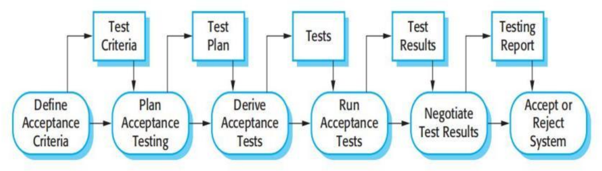

1. **Define acceptance criteria:** Ideally, it should take place early in the process before the contract for the system is signed. In practice, detailed requirements may not be available and there may be significant requirements change during the development process

   **定义验收标准：** 理想情况下，它应该在签署系统合同之前的早期进行。在实践中，详细需求可能不可用，并且在开发过程中可能会有重大需求变化

2. **Plan acceptance testing:** It involves deciding on the resources, time, and budget for acceptance testing and establishing a testing schedule. Discussion about (1) the required coverage of the requirements; (2) the order in which system features are tested; and (3) risks to the testing process and how to mitigate them.

   **计划验收测试：** 它涉及决定验收测试的资源、时间和预算，并创建测试计划。讨论 （1） 要求所需的覆盖范围;（2） 系统功能的测试顺序;（3） 检测过程的风险以及如何减轻这些风险。

3. **Derive acceptance tests:** Once acceptance criteria have been established, tests have to be designed to check whether or not a system is acceptable. Acceptance tests should aim to test both the functional and non-functional characteristics (e.g., performance) of the system

   **推导验收测试**：一旦创建了验收标准，就必须设计测试来检查系统是否可接受。验收测试应旨在测试系统的功能和非功能特征（例如，性能）

4. **Run acceptance tests:** The agreed acceptance tests are executed on the system. Ideally, take place in the actual environment where the system will be used.  Practically, a user testing environment may have to be set up to run these tests.

   **运行验收测试：** 商定的验收测试在系统上执行。理想情况下，在将使用系统的实际环境中进行。 实际上，可能必须设置用户测试环境来运行这些测试。

5. **Negotiate test results:** It is very unlikely that all of the defined acceptance tests will pass and that there will be no problems with the system. The developer and the customer have to negotiate to decide if the system is good enough to be put into use. They must also agree on the developer’s response to identified problems.

   **协商测试结果：** 所有定义的验收测试都不太可能通过，并且系统不会有问题。开发人员和客户必须协商，以确定系统是否足够好，可以投入使用。他们还必须就开发人员对已发现问题的响应达成一致。

6. **Reject/accept system:** This stage involves a meeting between the developers and the customer to decide on whether or not the system should be accepted. If the system is not good enough for use, then further development is required to fix the identified problems. Once complete, the acceptance testing phase is repeated.

   **拒绝/接受系统：** 此阶段涉及开发人员和客户之间的会议，以决定是否应接受系统。如果系统不够好，无法使用，则需要进一步开发以解决已发现的问题。完成后，将重复验收测试阶段。

   

