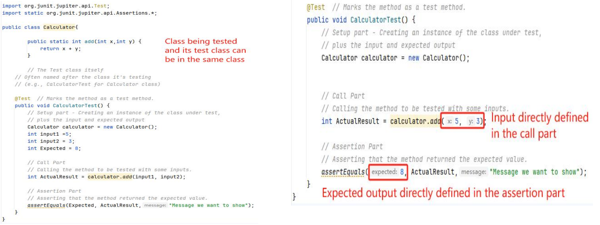

# JUnit

## 1. Unit Testing and JUnit  单元测试和 JUnit

### 1.1 Review - Unit Testing  单元测试

- Testing of an individual software unit

  单个软件单元的测试

  - usually a class & its helpers

    通常是一个班级及其帮手

- Focus on the functions of the unit

  专注于本单位的功能

  - functionality, correctness, accuracy

    功能性,正确性,准确性

- Usually carried out by the developers of the unit

  由该单位的开发人员进行

### 1.2 Review - Automated Framework  自动化框架

- A setup part, where you initialize the system with the testcase, namely the inputs and expected outputs.

  一个设置部分，您可以在其中使用测试用例初始化系统，即 inputs 和 expected outputs。

- call part, where you call the object or method to be tested.

  调用部分,您调用要测试的对象或方法的地方。

- n assertion part where you compare the result of the call with the expected result. If the assertion evaluates to true,the test has been successful if false, then it has failed.

  n assert 部分，您可以在其中比较调用结果与预期结果。如果断言的计算结果为 true，则测试成功，如果为 false，则测试失败。

### 1.3 JUnit

- JUnit is a framework for writing unit tests

  JUnit 是一个编写单元测试的框架

  - Designed for the purpose of writing and running tests on Java code

    专为编写和运行 Java 代码测试而设计

  - A unit test is a test of a single class, where a test case is a single test of a single method

    单元测试是单个类的测试，其中测试用例是单个方法的单个测试 -

  - Ensures individual test cases are executed in isolation, promoting more accurate results

    确保独立执行各个测试用例，从而获得更准确的结果

- Why Junit

  - Enhanced Code Quality

    提高代码质量

  - Java-based

    基于Java的

  - Integrates seamlessly with IDEs like Eclipse and build tools like Maven and Gradle

    与 Eclipse 等 IDE 以及 Maven 和 Gradle 等构建工具无缝集成

  - Free

#### 1.3.1 A JUnit Test Example  JUnit 测试示例

**Formally...**

Class that is being tested and its test class (where the test is implemented) are separated

正在测试的类及其测试类（实现测试的位置）是分开的

**Sometime...**

#### 1.3.2 JUnit Test Verdicts  JUnit 测试结果

A verdict is the result of executing a single test case.  判决是执行单个测试案例的结果。

**Pass**

- The test case execution was completed

  测试用例执行完成

- The function being tested performed as expected

  正在测试的功能按预期执行

**Fail**

- The test case execution was completed

  测试用例执行完成

- The function being tested did *not* perform as expected

  正在测试的功能 *没有* 按预期执行

**Error**

- The test case execution was not completed, due to

  测试用例执行未完成,由于

  - an unexpected event, exceptions, or

    意外事件、例外或

  - improper set up of the test case, etc.

    测试用例设置不当等。

If the tests run correctly, a test method does nothing but shows the results in **Green**

如果测试运行正确，则测试方法只会以**绿色**显示结果

If a test fails

If an error happens

### 1.4 JUnit Best Practices 最佳实践

- Tests need *failure atomically* (ability to know exactly what failed). 

  需要"原子式"的测试失败(能够准确地知道哪些测试失败了)。

  - Each test should have a clear, long, descriptive name. 

    每个测试都应该有一个清晰、长、有描述性的名称。

  - Assertions should always have clear messages to know what failed. 

    断言应该始终具有明确的信息,以了解失败的原因。

  - Write many small tests, not one big test. 

    写很多小测试,而不是一个大测试。

    - Each test should have roughly just 1 assertion at its end. 

      每个测试在结束时应该只有大约1个断言。

- Test for expected errors / exceptions. 

  测试预期错误/异常。

- Choose a descriptive assert method, not always `assertTrue`. 

  选择描述性的断言方法,而不是总是使用"assertTrue"。

- Choose representative test cases from equivalent input classes. 

  从等效输入类中选择有代表性的测试用例。

- Avoid complex logic in test methods if possible.

  如果可能的话,避免测试方法中的复杂逻辑。

### 1.5 Configure JUnit in Intellij

略

## 2. Assertion Methods  断言方法

### 2.1 AssertTrue/AssertFalse

- Assert a Boolean condition is true or false

  断言布尔条件为真或假

  assertTrue(*condition*)

  assertFalse(*condition*)

- Optionally, include a failure message

  可选地,包括一个失败消息

  assertTrue(*condition,* *message*)

  assertFalse(*condition,* *message*)

### 2.2 AssertSame/AssertNotSame

- Assert two object references are identical

  断言两个对象引用是相同的

  assertSame(*expected, actual*)

  - True if: expected == actual

    assertNotSame(*expected, actual*)

  - True if: expected != actual

- With a failure message

  带有失败消息

  assertSame(*expected, actual,* *(optional)* *message*)

  assertNotSame(*expected, actual,* *(optional)* *message*)

- Note: Compare if two objects are exactly the same one, NOT the value

  注意:比较两个对象是否完全相同,而不是值

### 2.3 AssertEquals/AssertNotEquals

- Assert two objects are equal to each regarding value/content

  断言两个对象在价值/内容方面相等

- It doesn't matter if expected and actual are the same object or different object; as long as their content is equal, the test will pass. 

  expected 和 actual 是同一个对象还是不同的对象并不重要;只要它们的内容相同，测试就会通过。

  assertEquals(expected, actual, *(optional)* *message*)

- Not only for int type, but also for other values (e.g., string, float, ...)

  不仅适用于 int 类型，还适用于其他值（例如，string、float 等）

### 2.4 AssertArrayEquals

- Assert two arrays are equal:

  断言两个数组相等:

  assertArrayEquals(expected, actual, *(optinal) message*)

  - arrays must have same length

    数组必须具有相同的长度

  - Recursively check for each valid index i,

    递归检查每个有效的索引i,

### 2.5 AssertThrows

- Used to test that a specific type of exception is thrown during the execution of a block of code

  用于测试在执行代码块期间是否抛出特定类型的异常

- assertThrows(expectedExceptionClass, executable)

  assertThrows(expectedExceptionClass,可执行文档)

  - expectedExceptionClass is the type of exception you expect

    expectedExceptionClass 是您期望的异常类型

  - executable is a *lambda expression* or a method reference that executes the code under test

    executable 是执行待测试代码的 *lambda 表达式* 或方法引用

- Particularly useful for negative test cases where you want to ensure that your code fails under certain conditions

  对于希望确保代码在某些条件下失败的否定测试用例特别有用

**Why use Lambda (Correct Approach):**  

**为什幺使用 Lambda(正确方法):**

- *assertThrows(ArithmeticException.class, () -> calculator.divide(10, 0));*

- This approach delays the execution of divide until assertThrows can catch the exception. 

  这种方法会延迟 divide 的执行，直到 assertThrows 可以捕获异常。

**Otherwise (Problematic):**

**否则(有问题):**

- *assertThrows(ArithmeticException.class, calculator.divide(10, 0));*

- In this case, divide is executed immediately, and if it throws an exception, it happens before assertThrows can catch it, leading to a test error.

  在这种情况下，divide 会立即执行，如果它抛出异常，则会在 assertThrows 捕获它之前发生，从而导致测试错误。

## 3. JUnit Test Cycle and Annotation   JUnit 测试周期和注释

### 3.1 Life Cycle

- Normally, a test class contains multiple test methods. JUnit manages the execution of each test method in form of a lifecycle.

  通常，一个测试类包含多个测试方法。JUnit 以生命周期的形式管理每个测试方法的执行 

- The complete lifecycle of a test case can be seen in three phases with the help of annotations.

  在注解的帮助下，测试用例的完整生命周期可以分为三个阶段。

### 3.2 Life Cycle Phases

1. **Setup**: This phase puts the test infrastructure in place. JUnit provides class level setup *(@BeforeAll)* and method level setup *(@BeforeEach)*.  Generally, heavy objects like database connections are created in class level setup while lightweight objects like test objects are reset in the method level setup. 

   **设置**：此阶段将测试基础设施部署到位。JUnit 提供类级设置 *（@BeforeAll）* 和方法级设置 *（@BeforeEach）*。 通常，像数据库连接这样的重对象是在类级设置中创建的，而像测试对象这样的轻量级对象是在方法级设置中重置的。

2. **Test Execution**: In this phase, the test execution and assertion happen.  The execution result will signify a success or failure. 

   **测试执行**：在此阶段，将执行和断言。 执行结果将表示成功或失败。

3. **Cleanup**: This phase is used to cleanup the test infrastructure setup in the first phase. Just like setup, teardown also happen at class level *(@AfterAll)* and method level *(@AfterEach).*

   **清理**：此阶段用于清理第一阶段的测试基础设施设置。就像 setup 一样，teardown 也发生在类级别 *（@AfterAll）* 和方法级别 *（*@AfterEach*）。

In the test life cycle, we will primarily need to have some annotated methods to setup and cleanup the test environment or test data on which the tests run. 

在测试生命周期中，我们主要需要一些带注释的方法来设置和清理运行测试的测试环境或测试数据。

In JUnit, by default, for each test method – a new instance of test is created. 

在 JUnit 中，默认情况下，对于每个测试方法，都会创建一个新的 test 实例。

1. @BeforeAll and @AfterAll annotations – clear by their name – should be called only once in the entire tests execution cycle. So they must be declared **static**. 

   @BeforeAll 和 @AfterAll 注解 – 通过其名称明确 – 在整个测试执行周期中只应调用一次。因此，它们必须声明为 **static**

2. @BeforeEach and @AfterEach are invoked for each instance of test so they should not be static.

   @BeforeEach 和 @AfterEach 为每个 test 实例调用，因此它们不应是静态的。

### 3.3 JUnit 5 Annotations  注解

#### 3.3.1 @DisplayName

- @DisplayName // to display meaningful name appear in the test report  显示有意义的名称出现在测试报告中

#### 3.3.2 @Timeout

- Useful for simple performance test

  适用于简单的性能测试

  - Network communication

    网络通信

  - Complex computation

    复杂的计算

- The @Timeout annotation

  @Timeout 注解

  - Time unit defaults to seconds (@Timeout (1)) but is configurable

    默认时间单位为秒 (@Timeout (1)) ,但可以配置

#### **3.3.3 @RepeatedTest**

- @*RepeatedTest* is used to mark a test method that should repeat a specified number of times with a configurable display name. 

  @*RepeatedTest* 用于标记应使用可配置的显示名称重复指定次数的测试方法。

- In the given example, the test method uses @RepeatedTest(3) annotation.  It means that the test will be executed 3 times. 

  在给定的示例中，测试方法使用 @RepeatedTest（3） 注解。 这意味着测试将执行 3 次。

- *@Test* would **NOT** be needed if we are using @*RepeatedTest*

  *如果我们使用 @*RepeatedTest*,则 **不需要** @Test*

- @*RepeatedTest* is used to mark a test method that should repeat a specified number of times with a configurable display name. 

  @*RepeatedTest* 用于标记应使用可配置的显示名称重复指定次数的测试方法。

- In the given example, the test method uses @RepeatedTest(3) annotation.  It means that the test will be executed 3 times. 

  在给定的示例中，测试方法使用 @RepeatedTest（3） 注解。 这意味着测试将执行 3 次。

- *@Test* would **NOT** be needed if we are using @*RepeatedTest*

  *如果我们使用 @*RepeatedTest*,则 **不需要** @Test*

