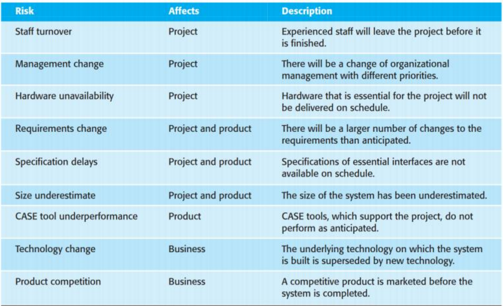
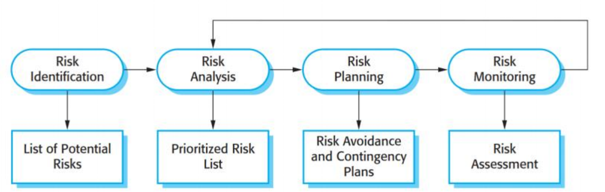
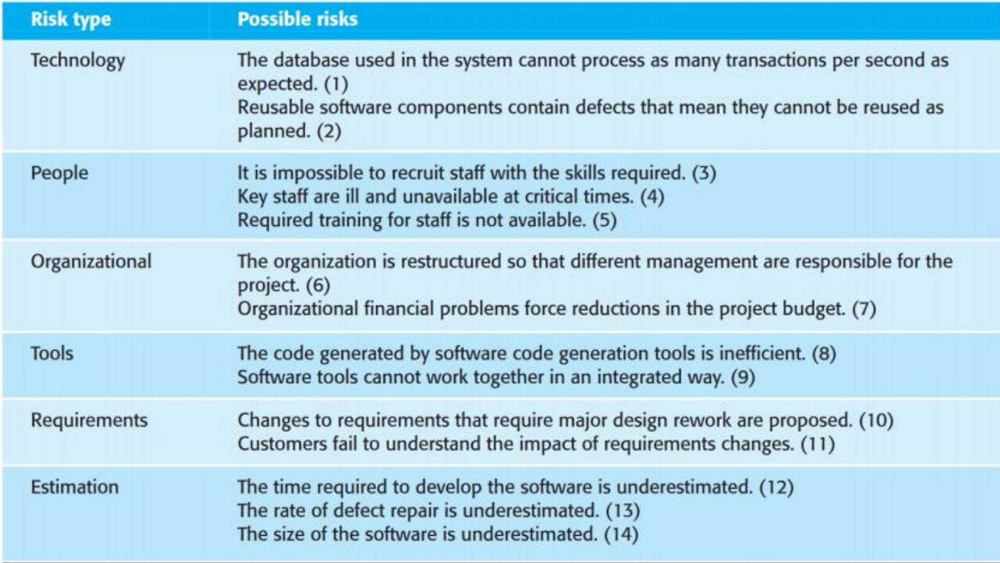
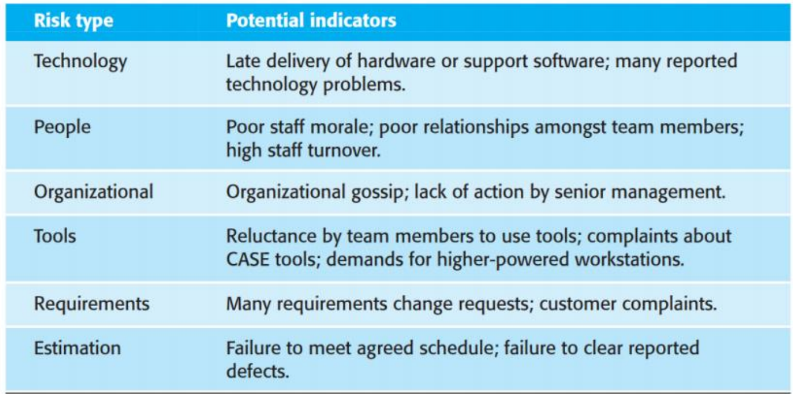

# Project Management 项目管理

## Outline

- Project Management Overview

- Risk Management

- Managing People

- Teamwork

## 1. Project Management Overview

### 1.1 Project Management Importance

- An essential part of software engineering
  
  软件工程的重要组成部分

  - Projects need to be managed because professional software engineering is always subject to organizational budget and schedule constraints
  
    需要管理项目，因为专业软件工程总是受组织预算和进度限制
  
  - Ensure that the software project meets and overcomes these constraints as well as delivering high-quality software. 
  
    需要管理项目，因为专业软件工程总是受组织预算和进度限制
  
- Good management cannot guarantee project success BUT a bad management may result:

  良好的管理不能保证项目的成功，但糟糕的管理可能会导致：

  - Late deliver

    延迟交付
  
  - Increase cost
  
    增加成本
  
  - Fail to meet the expectations of customers
  
    无法满足客户的期望

### 1.2 Criteria for Project Management  项目管理标准

- Deliver the software to the customer at the agreed time. 

  按照约定好的时间交付软件

- Keep overall costs within budget. 

- Deliver software that meets the customer’s expectations. 

- Maintain a happy and well-functioning development team.

### 1.3 Challenges in Project Management 项目管理中的挑战

- The product is intangible

  产品是无形的

  - Software cannot be seen or touched. 

    软件无法被看到或触摸。

- Large software projects are often ‘one-off’ projects

  大型软件项目通常是“一次性”项目 (可以这么理解，不同的应用场景可能要求都不同，因此需要重新设计，例如为银行和为超市设计的管理系统一定是完全不同的)

  - Lessons learned from previous projects may not be transferable to new projects. 

    从以前的项目中吸取的经验教训可能无法转移到新项目中。

- Software processes are variable and organization specific

  软件流程是可变的，并且特定于组织 （即使再有经验也会有难以预料到的问题）

  - software processes vary quite significantly from one organization to another -> cannot reliably predict when a particular software process is likely to lead to development problems.

    软件流程因组织而异 ->无法可靠地预测特定软件流程何时可能导致开发问题。

### 1.4 Manager’s Responsibilities  管理者的责任

- Project Planning

  为项目制定计划

  - Planning, estimating and scheduling project development, assigning people to tasks, and supervising them.  

- Reporting

  向领导做报告

  - Reporting on the progress of a project to customers and to the managers of the company developing the software. 

- Risk management 

  风险管理

  - Assess the risks that may affect a project, monitor these risks, and take action when problems arise 

- People management 

  人员管理

  - Choose people for their team and establish ways of working 

- Proposal writing

  提案撰写（招股书；招标书）

  - Writing a proposal to win a contract to carry out an item of work

### 1.5 Abilities of A Good Project Manager  优秀项目经理的能力

- **Motivation.** The ability to encourage (by “push or pull”) technical people to produce to their best ability. 

  **激励。** 鼓励（通过“推或拉”）技术人员发挥其最佳能力的能力。

- **Organization.** The ability to mold existing processes (or invent new ones) that will enable the initial concept to be translated into a final product.

  **组织**。塑造现有流程（或发明新流程）的能力，这将使初始概念能够转化为最终产品。

- **Ideas or innovation.** The ability to encourage people to create and feel creative even when they must work within bounds established for a particular software product or application

  鼓励人们创造并感到富有创造力的能力，即使他们必须在为特定软件、产品或应用进程设定的范围内工作

- **Problem solving.** An effective software project manager can diagnose the technical and organizational issues

  **解决问题。** 一个有效的软件项目经理可以诊断技术和组织问题

- **Managerial identity.** A good project manager must take charge of the project. They must have the confidence to assume control when necessary and the assurance to allow good technical people to follow their instincts.

  **管理者身份定位**。一个好的项目经理必须负责项目。他们必须有信心在必要时接管控制权，并保证让优秀的技术人员跟随他们的直觉。

- **Influence and team building.** An effective project manager must be able to “read” people; they must be able to understand verbal and nonverbal signals and react to the needs of the people sending these signals.

  **影响力和团队建设**。一个有效的项目经理必须能够“读懂”人;他们必须能够理解语言和非语言信号，并对发送这些信号的人的需求做出反应。不能只关注表面，更要了解员工的深层意识

## 2. Risk Management

### 2.1 Risk Management Details  风险管理细节

Risk management involves **anticipating risks** that might affect the project schedule or the quality of the software being developed, and then **taking action to avoid these risks.** 

风险管理包括**预测可能影响项目进度或正在开发的软件质量的风险**，然后**采取行动避免这些风险**。（例如突然有骨干离职，或者需要资金短缺）

Three related types of risks:

- **Project risks:** Risks that affect the project schedule or resources (e.g., loss of an experienced designer). 

  **项目风险：** 影响项目进度或资源的风险（例如，失去经验丰富的设计师）。

- **Product risks:** Risks that affect the quality or performance of the software being developed (e.g., failure of a purchased component to perform as expected). 

  **产品风险：** 影响正在开发的软件的质量或性能的风险（例如，购买的组件无法按预期运行；例如针对高并行而设计的网站，但是买了一个处理能力不强的服务器）。

- **Business risks:** Risks that affect the organization developing or procuring the software (e.g., a new product from competitors).

  **业务风险：** 影响开发或采购软件的组织的风险（例如，来自竞争对手的新产品；例如在你的产品上线之前，出现了相同的竞品，这个时候需要转变一些当前正在开发的项目的内容来实现差异化）。

### 2.2 Risk Management Process  风险管理过程

**Risk identification:** identify possible project, product, and business risks

**风险识别**：识别可能的项目、产品和业务风险

- **Risk analysis:** assess the likelihood and consequences of these risks

  **风险分析：** 评估这些风险的可能性和后果

- **Risk planning:** plans to address the risk, either by avoiding it or minimizing its effects on the project

  **风险规划：** 计划通过避免风险或尽量减少其对项目的影响来解决风险

- **Risk monitoring:** regularly assess the risk and your plans for risk mitigation and revise these when you learn more about the risk

  **风险监控：** 定期评估风险和风险缓解计划，并在您更多地了解风险时对其进行修改

#### 2.2.1 Risk Identification  风险识别

- Risk identification is the **first stage** of the risk management process. 

  风险识别是风险管理过程的**第一阶段**。

- It is concerned with identifying the risks that could pose a major threat to the software **engineering process**, the **software being developed**, and the development **organization**. 

  它关注于识别可能对软件**工程过程**、正在开发的**软件**和开发**组织**构成重大威胁的风险。

- Team process **and/or** project manager’s call

  团队流程**和/或**项目经理电话会议

#### 2.2.2. Risk Analysis  风险分析

- To consider each identified risk and make a judgment about the probability and seriousness of that risk

  考虑每个特定人物的风险，并且判断每种风险潜在的威胁程度

- Probability

  程度判断

  - Very low (<10%),

  - low (10–25%),

  - moderate (25–50%),

  - high (50– 75%), or very high (>75%)

- Seriousness

  严重性

  - catastrophic (threaten the survival of the project),

    灾难级（威胁生存）

  - serious (would cause major delays),

    严重级（严重拖累进度）

  - tolerable (delays are within allowed contingency),

    宽容（(可容忍的延误在允许的应急范围内）

  - insignificant

    无关紧要

#### Risk Planning  风险计划

- To consider each of the key risks that have been identified, and develops strategies to manage these risks

  考虑已确定的每个关键风险,并制定策略来管理这些风险

- To think of actions that you might take to minimize the disruption to the project if the problem identified in the risk occurs

  考虑如果风险中确定的问题发生,您可以采取哪些行动来最大限度地减少对项目的干扰

- To think about information that you might need to collect while monitoring the project so that problems can be anticipated

  考虑在监控项目时可能需要收集的信息,以便可以预测问题

- **Three categories of strategies**

  - **Avoidance strategies:** Following these strategies means that the probability that the risk will arise will be reduced. (e.g., Defective components)
    - Defective components: Replace potentially defective components with bought-in componentys of known reliability.

  - **Minimization strategies:** Following these strategies means that the impact of the risk will be reduced. (e.g., Staff illness)
    - Staff ilness: Reorganize team so that there is more overlap of work and people therefore unserstand each other's jobs.
  - Contingency plans: Following these strategies means that you are prepared for the worst and have a strategy in place to deal with is. (Organizational financial problems)
    - Organizational fiancial problem: Preprare ba briefing document for senior management showing how the project is making a very important contribution to the goals od the business and presenting reasons why cuts to the project budget would not be cost-effective.

#### 2.2.4 Risk Monitoring 风险监测

- Risk monitoring is the process of checking that your assumptions about the product, process, and business risks have not changed. 

  风险监控是检查您对产品、流程和业务风险的假设没有改变的过程。

- Regularly assess each of the identified risks to decide whether or not that risk is becoming more or less probable. (Probabilty) 

  逐一评估每个已识别的风险,以决定该风险的可能性是增加还是减少。

- Also think about whether or not the effects of the risk have changed. (Seriousness)

  还要考虑风险的影响是否发生了变化。 (严重性)

## 3. Managing People 人员管理

### 3.1. Why important 重要性

- People working in a software organization are its greatest assets

  在软件组织中工作的人是其最大的资产

  - Costs a lot to recruit and retain good people

    招聘和留住优秀人才的成本很高

  - Ensure that the organization gets the best possible return on its investment

    确保组织获得尽可能好的投资回报

### 3.2. 4 Criterias 4个标准

- Four critical factors in people management

  人事管理的四个关键因素

  - **Consistency:** People in a project team should all be treated in a comparable way. 

    **一致性**:项目团队中的人员都应该以类似的方式对待。

  - **Respect:** Different people have different skills and managers should respect these differences. 

    **尊重：** 不同的人有不同的技能，管理者应该尊重这些差异。

  - **Inclusion:** People contribute effectively when they feel that others listen to them and take account of their proposals. 

    **包容性:** 当人们感到他人倾听他们并考虑他们的建议时,他们就会有效地做出贡献。

  - **Honesty:** Should always be honest about what is going well and what is going badly in the team.

    **诚实**:应该始终诚实地了解团队中进展顺利和进展不顺利的地方。

### 3.3. Motivation  动机

- A project manager, you need to motivate the people that work with you so that they contribute to the best of their abilities. 

  作为一名项目经理,你需要激励与你一起工作的人,以便他们尽其所能做出贡献。

- Motivation means organizing the work and the working environment to encourage people to work as effectively as possible.

  激励意味着组织工作和工作环境,鼓励人们尽可能有效地工作。

- Personality type also influences motivation.

  人格类型也会影响动机。

  - **Task-oriented people**, who are motivated by the work they do. In software engineering, these are people who are motivated by the intellectual challenge of software development. 

    **以任务为导向的人**,他们受到自己工作的激励。在软件工程中,这些人受到软件开发智力挑战的激励。

  - **Self-oriented people,** who are principally motivated by personal success and recognition. They are interested in software development as a means of achieving their own goals. 

    **以自我为导向的人**,他们的主要动机是个人成功和认可。他们对软件开发感兴趣,以此作为实现自己目标的手段。

  - **Interaction-oriented people,** who are motivated by the presence and actions of co-workers. As software development becomes more user-centered, interaction-oriented individuals are becoming more involved in software engineering.

    **以交互为导向的人**,他们受到同事的存在和行为的激励。随着软件开发变得更加以用户为中心,以交互为导向的人越来越多地参与到软件工程中。

## 4. Teamwork 团队工作

### 4.1. Why Important 重要性

- It is clearly impossible for everyone in a large group to work together on a single problem, large teams are usually split into a number of groups

  很明显,一个大团队中的每个人都不可能就一个问题进行合作,大团队通常被分成多个小组

- Putting together a group that has the right balance of technical skills, experience, and personalities is a critical management task.

  组建一个在技术技能、经验和个性方面具有适当平衡的团队是一项关键的管理任务。

- In a cohesive group, members think of the group as more important than the individuals who are group members.

  在一个有凝聚力的群体中,成员认为群体比作为群体成员的个人更重要。

#### 4.1.2. Benefits  好处

- Benefits of creating a cohesive group:

  创建一个有凝聚力的团队的好处:

  - **The group can establish its own quality standards** Because these standards are established by consensus, they are more likely to be observed than external standards imposed on the group. 

    **集团可以制定自己的质量标准** 因为这些标准是协商一致制定的,所以它们比集团强制执行的外部标准更有可能得到遵守。

  - **Individuals learn from and support each other** People in the group learn from each other. Inhibitions caused by ignorance are minimized as mutual learning is encouraged. 

    **个人互相学习、互相支持** 团体中的人互相学习。由于鼓励互相学习,无知导致的抑制被最小化。

  - **Knowledge is shared** Continuity can be maintained if a group member leaves. Others in the group can take over critical tasks and ensure that the project is not unduly disrupted. 

    **知识是共享的** 如果小组成员离开,可以保持连续性。小组中的其他人可以接管关键任务,并确保项目不会受到不当干扰。

  - **Refactoring and continual improvement is encouraged** Group members work collectively to deliver high-quality results and fix problems, irrespective of the individuals who originally created the design or program.

    **鼓励重构和持续改进** 团队成员共同努力,提供高质量的结果并解决问题,无论最初创建设计或进程的人员是谁。

#### 4.1.3. Influencial Factors 影响因素

- Whether or not a group is effective depends, to some extent, on the nature of the project and the organization doing the work. 

  一个团队是否有效,在某种程度上取决于项目的性质和从事工作的组织。

- However, apart from project and organizational issues, there are three generic factors that affect team working:

  但是,除了项目和组织问题外,还有三个影响团队工作的通用因素:

  - The people in the group

    集团内的人

  - The group organization

    小组组织

  - Technical and managerial communications

    技术与管理交流

#### 4.1.4. A Team of Cohesiveness 一个有凝聚力的团队

- Good project managers should always try to encourage group cohesiveness

  优秀的项目经理应该始终努力鼓励团队凝聚力

  - Organize social events

    组织社交活动

  - Naming the group and establishing a group identity and territory

    命名群组并创建群组身份和领地

  - Explicit group-building activities such as sports and games

    明确的团体建设活动,如体育和游戏

  - Be Inclusive

    包容性

### 4.2. Selecting group members  挑选小组成员

- Many software engineers are motivated primarily by their work.  Software development groups, therefore, are often composed of people who have their own ideas about how technical problems should be solved. 

  许多软件工程师的动力主要来自他们的工作。因此,软件开发团队通常由对如何解决技术问题有自己的想法的人组成。

- A group that has complementary personalities may work better than a group that is selected solely on technical ability. 

  具有互补性格的团队可能比仅根据技术能力选择的团队效果更好。

  - People who are motivated by the work are likely to be the strongest technically. 

    那些被工作激励的人很可能是技术上最强的人。

  - People who are self-oriented will probably be best at pushing the work forward to finish the job. 

    以自我为导向的人可能最擅长推动工作完成工作。

  - People who are interaction-oriented help facilitate communications within the group

    以互动为导向的人有助于促进团队内的沟通

### 4.3. Group organization  集团组织

- The way that a group is organized affects the decisions that are made by that group, the ways that information is exchanged, and the interactions between the development group and external project stakeholders.

  组织团队的方式会影响该团队做出的决策、信息交换的方式以及开发团队与外部项目利益相关者之间的互动。

- Organizational Questions to be considered:

  需要考虑的组织问题:

  - Should the project manager be the technical leader of the group?

    项目经理应该成为团队的技术领导者吗?

  - Who will be involved in making critical technical decisions, and how will these be made?

    谁将参与制定关键技术决策,以及这些决策将如何制定?

  - How will interactions with external stakeholders and senior company management be handled?

    如何处理与外部利益相关者和公司高级管理层的互动?

  - How can groups integrate people who are not colocated?

    团体如何集成那些没有同处一地的人?

  - How can knowledge be shared across the group?

    如何在整个团队中共享知识?

### 4.4. Group communications  团队沟通

- It is absolutely essential that group members communicate effectively and efficiently with each other and with other project stakeholders.

  团队成员之间以及与其他项目利益相关者之间进行有效和高效的沟通是绝对必要的。

  - Group members must exchange information on the status of their work, the design decisions that have been made, and changes to previous design decisions. 

    小组成员必须就其工作状态、已做出的设计决策以及先前设计决策的更改交换信息。

  - They have to resolve problems that arise with other stakeholders and inform these stakeholders of changes to the system, the group, and delivery plans. 

    他们必须解决与其他利益相关者之间出现的问题,并将系统、团队和交付计划的变更告知这些利益相关者。

  - Good communication also helps strengthen group cohesiveness. Group members come to understand the motivations, strengths, and weaknesses of other people in the group.

    良好的沟通也有助于加强团体凝聚力。团体成员开始了解团体中其他人的动机、优点和缺点。

- The effectiveness and efficiency of communications is influenced by:

  沟通的有效性和效率受到以下因素的影响:

  - **Group size** As a group gets bigger, it gets harder for members to communicate effectively. 

    **群体大小** 当群体变大时,成员之间更难有效沟通。

  - **Group structure** People in informally structured groups communicate more effectively than people in groups with a formal, hierarchical structure. 

    **群体结构** 非正式结构群体中的人比正式层次结构群体中的人沟通更有效。

  - **Group composition** People with the same personality types may clash and, as a result, communications can be inhibited. 

    **群体构成** 具有相同性格类型的人可能会发生冲突,因此,沟通可能会受到抑制。

  - **The physical work environment** The organization of the workplace is a major factor in facilitating or inhibiting communications. 

    **物理工作环境** 工作场所的组织是促进或抑制沟通的主要因素。

  - **The available communication channels** face-to-face, e-mail messages, formal documents, telephone, and Web 2.0 technologies such as social networking and wikis.

    **可用的沟通渠道**面对面,电子邮件,正式文档,电话和Web 2.0技术,如社交网络和维基。

## 5. Continuous Imporvement 持续改进

### 5.1. Continuous Imporvement  持续改进

- **Definition of Continuous Improvement**

  **持续改进的定义**

  - Refers to the ongoing effort to enhance processes, products, or services incrementally over time or through breakthrough improvements. 

    是指不断努力,随着时间的推移或通过突破性的改进,逐步改进流程、产品或服务。

  - It is a systematic approach aimed at increasing efficiency, reducing waste, improving quality, and delivering greater value to customers. 

    它是一种系统性的方法,旨在提高效率,减少浪费,提高质量,并为客户提供更大的价值。

- **In the context of Software Engineering:**

  **在软件工程的背景下:**

  - Regularly evaluating and refining software development processes. 

    定期评估和改进软件开发流程。

  - Leveraging feedback from stakeholders, users, and system monitoring. 

    利用利益相关者、用户和系统监控的反馈。

  - Incorporating small, iterative changes or significant innovations to:

    将小的迭代变化或重大创新纳入:

    - Enhance code quality. 

      提高代码质量。

    - Optimize workflows. 

      优化工作流程。

    - Reduce technical debt. 

      减少技术债务。

    - Improve collaboration among team members.

      改善团队成员之间的协作。

### 5.2. Continuous Improvement Charateristics  持续改进的特点

- **Incremental Progress:** Focus on small, consistent changes that accumulate over time. 

  **渐进式进步:** 关注随着时间的推移而积累的小型一致性变化。

- **Feedback-driven:** Relies on feedback loops from testing, users, and monitoring. 

  **反馈驱动:**依靠来自测试、用户和监控的反馈循环。

- **Goal-oriented:** Targets measurable improvements in quality, performance, or team productivity. 

  **以目标为导向:**在质量、绩效或团队生产力方面实现可衡量的改进。

- **Collaborative:** Involves all stakeholders in the improvement process, promoting shared responsibility. 

  **以目标为导向:**在质量、绩效或团队生产力方面实现可衡量的改进。

- **Cyclic:** Improvement is an ongoing, iterative process rather than a one-time effort.

  **周期性:** 改进是一个持续的、迭代的过程,而不是一次性的努力。

### 5.3. Strategies for Continuous Improvement  持续改进战略

#### 5.3.1 Strategies for Continuous Improvement  持续改进战略

- **Agile Methodologies**

  **敏捷方法论**

  - Emphasizing iterative development,  collaboration, and responsiveness to change. Teams deliver small, incremental improvements through cycles called sprints or iterations. 

    强调迭代开发、协作和对变化的响应能力。团队通过称为冲刺或迭代的周期提供小的增量改进。

  - **Scrum:** Conduct sprint retrospectives to evaluate and improve team performance. 

    **Scrum:** 进行 Sprint 回顾,以评估和改进团队绩效。

    - Example: Use JIRA to identify unclear task descriptions and requriements in each Sprint

      示例:使用 JIRA 识别每个 Sprint 中不明确的任务描述和需求

  - Similarily: *Kanban -* Visualize tasks to identify bottlenecks

    类似的例子: *Kaban* 可视化任务以识别瓶颈

#### 5.3.2 Strategies for Continuous Improvement  持续改进战略

- **Continuous Integration and Continuous Delivery (CI/CD)** 

  **持续集成和持续交付 (CI/CD) ** -

  - CI/CD automates the process of integrating code changes (CI) and deploying them to production environments (CD), ensuring faster delivery and higher reliability. 

    CI/CD 自动化集成代码更改 (CI) 并将它们部署到生产环境 (CD) 的过程,确保更快的交付和更高的可靠性。

  - **Continuous Integration**: Developers frequently integrate their code changes into a shared repository. Automated builds and tests are triggered for each integration to ensure that the new changes do not break the existing codebase. 

    **持续集成**:开发人员经常将代码更改集成到共享存储库中。每次集成都会触发自动构建和测试,以确保新更改不会破坏现有代码库。

    - Example: Automated Builds - For a Java application, use Maven or Gradle to compile the project after each commit in the repository

      示例:自动构建 对于 Java 应用进程,在每次提交到存储库后,使用 Maven 或 Gradle 编译项目

  - **Continuous Delivery**: Continuous Delivery extends CI by automatically deploying code changes to a staging environment for further testing. It ensures that the application is always in a deployable state. 

    **持续交付:** 持续交付通过将代码更改自动部署到暂存环境中进行进一步测试来扩展 CI。它确保应用进程始终处于可部署状态。

  - Example: Deploy to Staging - Automatically deploy the build artifacts (e.g., Docker images) to a staging environment (pre-production environment that mimics the production setup). (暂时不需要了解Docker)

    示例:部署到 Staging 将构建工件(例如 Docker 映像)自动部署到 Staging 环境(模拟生产设置的预生产环境)。

#### 5.3.3 Strategies for Continuous Improvement  持续改进战略

- **Refactoring**

  **重构**

  - The process of restructuring existing code to improve its readability,  maintainability, and performance without changing its external behavior. 

    重构现有代码以提高其可读性、可维护性和性能的过程,而不改变其外部行为。

- **Monitoring and Feedback**

  重构现有代码以提高其可读性、可维护性和性能的过程,而不改变其外部行为。

  - Continuously tracking application performance, while feedback gathers user or system input to identify areas for improvement. (e.g.,  Track API response times and trigger alerts for anomalies and Collect insights from users about new features or bugs.)

    持续跟踪应用进程性能,同时反馈收集用户或系统输入,以确定需要改进的领域(例如,跟踪API响应时间并触发异常警报,并收集用户关于新功能或错误的见解)。

- **Knowledge Sharing**

  **知识分享**

  - Sharing best practices, lessons, and expertise within the team to improve skills and consistency

    在团队内分享最佳实践、经验教训和专业知识,以提高技能和一致性

- **A/B Testing**

  **A/B测试**

  - Compares two versions of a feature to determine which performs better based on user interaction. (e.g., evaluate "Add to Cart" vs. "Buy Now" buttons)

    比较两个版本的功能,根据用户交互确定哪个表现更好(例如,评估"添加到购物车"与"立即购买"按钮)

### 5.4 Metrics for Continuous Improvement  持续改进的指标

- **Metrics** help track the effectiveness of processes, identify areas for improvement, and measure the progress of continuous improvement

  **度量**有助于跟踪流程的有效性,确定需要改进的领域,并衡量持续改进的进展

- **For Development**

  **关于发展**

  - Time for Changes: Time taken from a code commit to deployment in production

    变更时间:从代码提交到生产部署所花费的时间

  - Cycle Time: Time taken from the start of work on a task to its completion

    时间周期:从开始工作到完成任务所花费的时间

  - Deployment Frequency: How often new code is deployed to production. 

    部署频率:新代码部署到生产环境的频率。

- **For Product Quality**

  **产品质量**

  - Defect Density: The number of defects per unit of code (e.g., defects per 1,000 lines of code)

    缺陷密度:每个代码单元的缺陷数量(例如,每 1,000 行代码的缺陷数)

  - Mean Time to Recovery: Average time taken to recover from a failure

    平均恢复时间:从故障中恢复的平均时间

  - Escaped Defects: Defects that are found after deployment to production

    逃逸缺陷:部署到生产后发现的缺陷

- **For Team Productivity**

  **关于团队生产力**

  - Velocity: The amount of work completed by a team during a sprint,  measured in story points or tasks. 

    速度:团队在冲刺期间完成的工作量,以故事点或任务来衡量。

  - Work in Progress: The number of tasks currently in progress

    Work in Progress:当前正在进行的任务数量

  - Flow Efficiency: The ratio of active time to total time (active + idle) spent on a task. 

    流程效率:活动时间与花在任务上的总时间(活动+空闲)的比率。

- **For Customer and User**

  **客户和用户**

  - Customer Satisfaction: A direct measure of customer satisfaction with a product or feature

    客户满意度:直接衡量客户对产品或功能的满意度

  - Net Promoter Score: Measures the likelihood of customers recommending the product to others

    净推荐值:衡量客户向他人推荐产品的可能性

  - Feature Adoption Rate: Percentage of users actively using a newly released feature

    功能采用率:积极使用新发布功能的用户百分比
