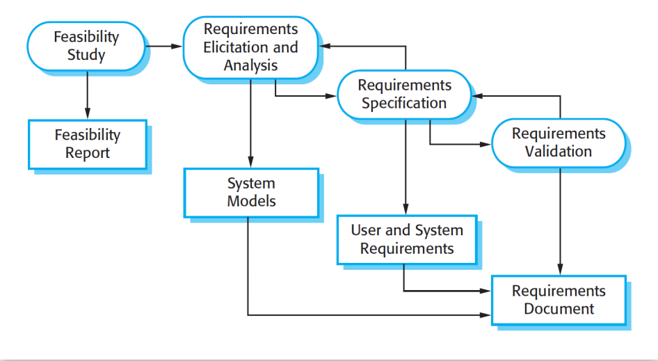
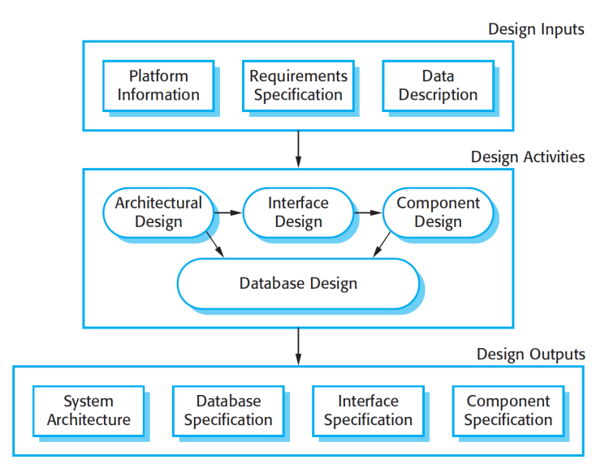
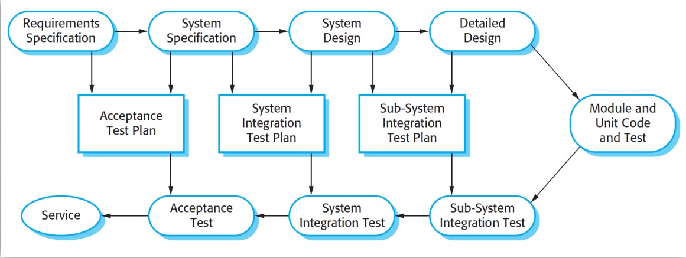
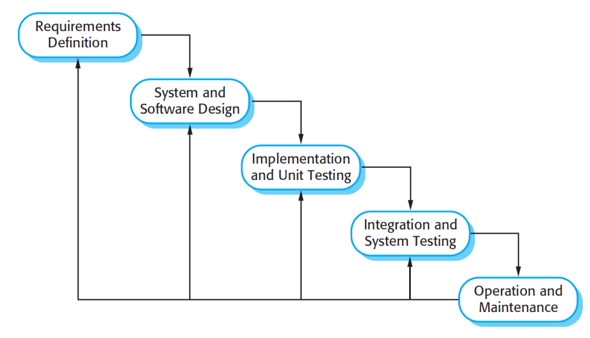
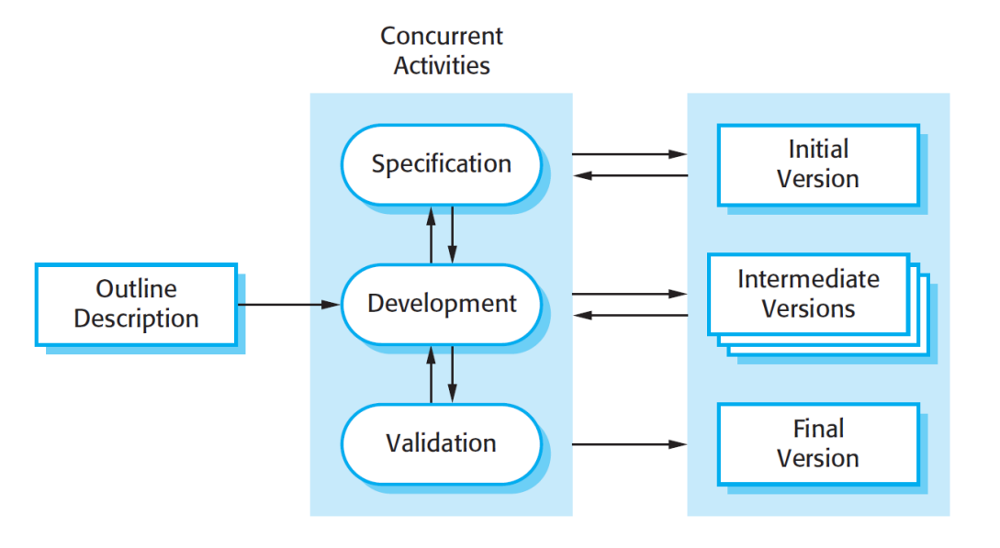
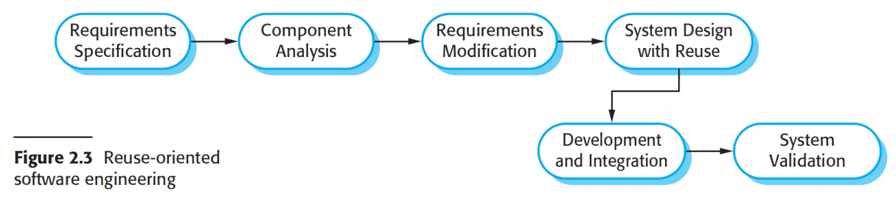

# Software Process  软件流程

## Objectives 目标

- Understand the concepts of software processes and software process models;

  了解软件流程和软件流程模型的概念;

- Introduced to three generic software process models and when they might be used;

  介绍了三种通用软件流程模型以及何时可以使用它们;

- Know about the fundamental process activities of software requirements engineering, software development, testing, and evolution;

  了解软件需求工程、软件开发、测试和演化的基本流程活动;

## Introduction 介绍

- A software process is a set of related activities that leads to the production of a software product. These activities may involve the development

  软件流程是导致软件产品生产的一组相关活动。这些活动可能涉及开发

  - of software from scratch

    从零开始的软件

  - by extending and modifying existing systems

    通过扩展和修改现有系统

  - by configuring and integrating off-the-shelf software or system components

    通过配置和集成现成的软件或系统组件

- A **software process** refers to the actual set of activities, methods, practices, and transformations that people use to develop and maintain software and its associated products (such as project plans, design documents, code, test cases, and user manuals). It is the real-world implementation of the steps involved in creating software.

  **软件过程** 是指人们用来开发和维护软件及其相关产品（比如项目计划、设计文档、代码、测试用例和用户手册）的实际活动、方法、实践和转换的集合。它是创建软件所涉及的步骤的实际实现。

## Software Process Activities  软件流程活动

- There are many different software processes, but all must include **four activities** that are fundamental to software engineering:

  有许多不同的软件流程，但都必须包括对软件工程**至关重要的四项活动**：

  - Software specification 

    软件规格

  - Software design and implementation 

    软件设计和实施

  - Software validation 

    软件验证

  - Software evolution

    软件提升进化

- In practice, they are complex activities in themselves and include sub-activities (Refer to appendix 1 for the sub-activities)

  在实践中，它们本身就是复杂的活动，包括子活动（子活动见附录 1）

- There are also supporting process activities such as documentation and software configuration management (Refer to appendix 2 for other supporting process activities)

  还有支持过程活动，例如文档和软件配置管理（有关其他支持过程活动，请参阅附录 2）

- The four basic process activities of specification, design and implementation, validation, and evolution are organized differently in different development processes.

  规范、设计和实现、验证和演化这四个基本流程活动在不同的开发流程中有不同的组织方式。

- In the waterfall model, they are organized in sequence

  在瀑布模型中，它们按顺序组织

- In incremental development they are interleaved

  在增量开发中，它们是交错的

### Software Specification 软件规格

- Software specification or requirements engineering is the process of understanding and defining

  软件规范或需求工程是理解和定义

  - what services are required from the system

    系统需要提供哪些服务

  - identifying the constraints on the system’s operation and development. 

    识别系统运行和发展的约束。

- Requirements engineering is a particularly critical stage of the software process as errors at this stage inevitably lead to later problems in the system design and implementation.

  需求工程是软件流程中一个特别关键的阶段，因为这个阶段的错误不可避免地会导致系统设计和实现中的后续问题。

- The activities of analysis, definition, and specification are **interleaved**

  分析、定义和规范的活动是 **交错的**

- The software specification process aims to produce an agreed requirements document that specifies a system satisfying stakeholder requirements.

  软件规范流程旨在生成一个商定的需求文档，该文档指定了满足利益相关者需求的系统。

- Requirements are usually presented at two levels of detail. 

  需求通常以两个详细级别表示。

  - End-users and customers need a high-level statement of the requirements; 

    最终用户和客户需要对需求进行简要说明;

  - system developers need a more detailed system specification.

    系统开发人员需要更详细的系统规范。

- There are four main activities in the requirements engineering process:

  需求工程流程中有四个主要活动：

  - Feasibility study  可行性研究

  - Requirements elicitation and analysis  需求获取和分析

  - Requirements specification  需求规范

  - Requirements validation  需求验证

### Software Design and Implementation 软件设计和实施

- The design and implementation stage (activity) of the software process is to convert a system specification into an executable system. 

  软件过程的设计和实现阶段（活动）是将系统规范转换为可执行系统。

- It always involves processes of software design and programming but, if an incremental approach to development is used, may also involve refinement of the software specification.

  它始终涉及软件设计和编程过程，但如果使用增量开发方法，则还可能涉及软件规范的改进。

- A software design is a description of the structure of the software to be implemented, the data models and structures used by the system, the interfaces between system components and, sometimes, the algorithms used. 

  软件设计是对要实现的软件结构、系统使用的数据模型和结构、系统组件之间的接口以及有时使用的算法的描述。

- Designers do not arrive at a finished design immediately but develop the design iteratively. They add formality and detail as they develop their design with constant backtracking to correct earlier designs.

  设计人员不会立即得出完成的设计，而是迭代开发设计。他们在开发设计时增加正式和细节，不断回溯以纠正早期设计。

- Design activities  设计活动

  - **Architectural design**, where you identify the overall structure of the system, the principal components (sometimes called sub-systems or modules), their relationships, and how they are distributed.

    体系结构设计，用于标识系统的整体结构、主要组件（有时称为子系统或模块）、它们的关系以及它们的分布方式。

  - **Interface design**, where you define the interfaces between system components. This interface specification must be unambiguous.

    接口设计，用于定义系统组件之间的接口。此接口规范必须明确。

- The detail and representation of the design output vary considerably. 

  设计输出的细节和表示差异很大。

  - For critical systems, detailed design documents setting out precise and accurate descriptions of the system must be produced. 

    对于关键系统，必须生成详细的设计文档，以准确描述系统。

  - If a **model-driven approach** is used, these outputs may mostly be diagrams.

    如果使用模型驱动的方法，这些输出可能主要是图表。

  - Where **agile methods** of development are used, the outputs of the design process may not be separate specification documents but may be represented in the code of the program.

    在使用敏捷开发方法的情况下，设计过程的输出可能不是单独的规范文档，但可以在进程的代码中表示。

### Software Validation  软件验证

- Software validation or, more generally, verification and validation (V&V) is intended to show that

  软件验证或更一般地说，验证和确认 （V&V） 旨在表明

  - a system both conforms to its specification

    系统既符合其规范

  - it meets the expectations of the system customer

    它满足了系统客户的期望

- Validation techniques:

  验证技术：

  - Program testing, where the system is executed using simulated test data, is the principal validation technique

    进程测试（使用模拟测试数据执行系统）是主要的验证技术

  - Validation may also involve checking processes, such as inspections and reviews, at each stage of the software process from user requirements definition to program development

    验证还可能涉及在软件流程的每个阶段（从用户需求定义到进程开发）的检查流程，例如检查和审查

- A three-stage testing process involved testing for system components then the testing for an integrated system and, finally, the testing of the system with the customer’s data

  测试过程分为三个阶段，包括系统组件测试，然后是集成系统测试，最后是使用客户数据对系统进行测试

- The stages in the testing process are:

  - **Development testing** - The components making up the system are tested by the people developing the system. Each component is tested independently, without other system components.

    **开发测试** 组成系统的组件由开发系统的人员进行测试。每个组件都经过独立测试，无需其他系统组件。

  - **System testing** - System components are integrated to create a complete system. This process is concerned with finding errors that result from unanticipated interactions between components and component interface problems.

    **系统测试** 系统组件集成以创建一个完整的系统。此过程涉及查找由组件之间的意外交互和组件接口问题导致的错误。

  - **Acceptance testing** - This is the final stage in the testing process before the system is accepted for operational use. The system is tested with data supplied by the system customer rather than with simulated test data

    **验收测试** 这是系统被接受运行使用之前的测试过程的最后阶段。系统使用系统客户提供的数据进行测试，而不是使用模拟测试数据

- Normally, component development and testing processes are interleaved. Programmers make up their own test data and incrementally test the code as it is developed. 

  通常，组件开发和测试过程是交错的。进程员编写自己的测试数据，并在开发代码时对其进行增量测试。

- If an incremental approach to development is used, each increment should be tested as it is developed, with these tests based on the requirements for that increment.

  如果使用增量开发方法，则应在开发每个增量时对其进行测试，这些测试基于该增量的要求。

- When a plan-driven software process is used (e.g., for critical systems development), testing is driven by a set of test plans. An independent team of testers works from these pre-formulated test plans

  当使用计划驱动的软件流程时（例如，用于关键系统开发），测试由一组测试计划驱动。独立的测试团队根据这些预先制定的测试计划工作

### Software Evolution

- Once a decision has been made to manufacture hardware, it is very expensive to make changes to the hardware design. However, changes can be made to software at any time during or after the system development. Even extensive changes are still much cheaper than corresponding changes to system hardware

  一旦决定制造硬件，更改硬件设计的成本就非常高。但是，可以在系统开发期间或之后随时对软件进行更改。即使是广泛的更改仍然比对系统硬件的相应更改便宜得多

- Historically, there has always been a split between the process of software development and the process of software evolution (software maintenance). 

  从历史上看，软件开发过程和软件进化过程（软件维护）之间一直存在分歧。

- People think of software development as a creative activity in which a software system is developed from an initial concept through to a working system. However, they sometimes think of software maintenance as dull and uninteresting

  人们将软件开发视为一种创造性活动，其中软件系统从初始概念开发到工作系统。然而，他们有时认为软件维护是枯燥乏味的

- Rather than two separate processes, it is more realistic to think of software engineering as an evolutionary process

  与其说是两个独立的过程，不如将软件工程视为一个进化的过程

## Type of Software Process  软件进程类型

- Software processes are complex and, there is **no ideal process**

  软件流程很复杂，没有理想的流程

- Most organizations have developed their own software processes that take advantage of the capabilities of the people in an organization and the specific characteristics of the systems that are being developed

  大多数组织都开发了自己的软件流程，这些流程利用了组织中人员的能力和正在开发的系统的特定特征

- For a **critical systems**, a very structured development process is required.

  对于关键系统，需要一个非常结构化的开发过程。

- For **non-critical systems**, with rapidly changing requirements, a less formal, flexible process is likely to be more effective

  对于非关键系统，随着需求的快速变化，不太正式、灵活的流程可能更有效

## Categories of Software Processes  软件进程的类别

- There are many software processes introduced to the industry. To better understand them, we categorized the software processes as follows.

  该行业引入了许多软件流程。为了更好地理解它们，我们将软件进程分类如下。

  - **Linear and Sequential Models:** Waterfall, V-Model

    线性和顺序模型：瀑布式、V 型

  - **Iterative and Incremental Models:** Incremental, Iterative, Spiral

    **迭代和增量模型：** 增量、迭代、螺旋

  - **Agile Models:** Scrum, Kanban, Extreme Programming (XP)

    **敏捷模型**：Scrum、看板、极限编程 （XP）

  - **Prototyping Models:** Throwaway Prototyping, Evolutionary Prototyping

    **原型模型：** 一次性原型、进化原型

  - **Component-Based Models:** Component-Based Development (CBD)

    **基于组件的模型**：基于组件的开发 （CBD）

  -  **Formal Methods:** Formal Specification, Model Checking

    **形式化方法：** 形式化规范、模型检查

  - **Hybrid Models:** Agile-Waterfall Hybrid, DevOps

    **混合模型**：敏捷-瀑布混合、DevOps

  - **Rapid Application Development (RAD) Models:** RAD Model, DSDM

    **快速应用进程开发 （RAD） 模型：** RAD 模型、DSDM

  - **Lean Models:** Lean Software Development

    **精益模型：** 精益软件开发

# Software Process Models

- A software process model is a simplified representation of a software process.

  软件流程模型是软件流程的简化表示形式。

- Discuss very general process models and present these from an architectural perspective, framework of the process rather than the details of specific activities.

  讨论非常通用的流程模型，并从架构角度、流程框架而不是特定活动的细节来呈现这些模型。

- These generic models are not definitive descriptions of software processes, they are **abstractions of the process** that can be used to explain different approaches to software development

  这些通用模型不是软件过程的明确描述，它们是过程的抽象，可用于解释软件开发的不同方法

- You can think of them as process frameworks that may be extended and adapted to create more specific software engineering processes.

  您可以将它们视为流程框架，这些框架可以扩展和调整以创建更具体的软件工程流程。

- While the software process is the actual execution of tasks and activities, the software process model provides the structured framework that guides this execution. 

  软件流程是任务和活动的实际执行，而软件流程模型则提供了指导此执行的结构化框架。

- The model ensures that best practices are followed, risks are managed, and quality is maintained, leading to more predictable, efficient, and successful software development projects.

  该模型可确保遵循最佳实践、管理风险并保持质量，从而实现更可预测、更高效和更成功的软件开发项目。

- These models are **not mutually exclusive** and are often used together, especially for **large systems development**.

  这些模型**并不互斥**，并且经常一起使用，尤其是对于大型系统开发。

## Models discusses

- **The waterfall model** - This takes the fundamental process activities of specification, development, validation, and evolution and represents them as separate process phases such as requirements specification, software design, implementation, testing, and so on.

  **瀑布模型** 它采用规范、开发、验证和演变等基本流程活动，并将它们表示为单独的流程阶段，例如需求规范、软件设计、实现、测试等。

- **Incremental development** - This approach interleaves the activities of specification, development, and validation. The system is developed as a series of versions (increments), with each version adding functionality to the previous version.

  **增量开发** 这种方法将规范、开发和验证活动交错在一起。该系统开发为一系列版本 （增量），每个版本都向以前的版本添加功能。

- **Reuse-oriented software engineering** - This approach is based on the existence of a significant number of reusable components. The system development process focuses on integrating these components into a system rather than developing them from scratch.

  **面向复用的软件工程** 这种方法基于大量可重用组件的存在。系统开发过程侧重于将这些组件集成到系统中，而不是从头开始开发它们。

### The Waterfall Model

- **Definition**: The Waterfall Model is a linear and sequential approach to software development. It progresses through distinct phases, each with specific deliverables and review processes.

  **定义**：瀑布模型是一种线性和顺序的软件开发方法。它经历不同的阶段，每个阶段都有特定的可交付成果和审查流程。

- **Historical Context**: Introduced by Dr. Winston W. Royce in a 1970 paper, it was one of the first formalized software development methodologies

  **历史背景**：由 Winston W. Royce 博士在 1970 年的一篇论文中介绍，它是最早正式化的软件开发方法之一

#### Phases of The Waterfall Model 瀑布模型的阶段

Because of the **cascade** from one phase to another, this model is known as the ‘waterfall model’ or software life cycle. The waterfall model is an example of a plan-driven process

由于从一个阶段到另一个阶段的**级联**，该模型被称为“瀑布模型”或软件生命周期。瀑布模型是计划驱动过程的一个示例

The principal stages of the waterfall model directly reflect the fundamental development activities:

瀑布模型的主要阶段直接反映了基本的开发活动：

- **Requirements analysis and definition**

  需求分析和定义

  - **Objective:** Gather and document all functional and non functional requirements.

    收集并记录所有功能和非功能需求。

  - **Deliverables**: Requirements Specification Document.

    **可交付成果**：需求规范文档。

  - **Activities**: Stakeholder interviews, surveys, and requirement workshops.

    **活动**：利益相关者访谈、调查和需求研讨会。

- **System and software design**

  系统和软件设计

  - **Objective**: Create a detailed design based on the requirements.

    **目标**： 根据需求创建详细设计。

  - **Deliverables**: System Architecture Document, Design Specifications.

    **可交付成果**：系统架构文档、设计规范。

  - **Activities**: Architectural design, database design, user interface design.

    **活动**：建筑设计、数据库设计、用户界面设计。

- **Implementation and unit testing**

  实现和单元测试

  - **Objective**: Translate design documents into actual code.

    **目标**： 将设计文档翻译成实际代码。

  - **Deliverables**: Source code, code documentation.

    **可交付成果**：源代码、代码文档。

  - **Activities**: Coding, unit testing, code reviews.

    **活动**：编码、单元测试、代码审查。

- **Integration and system testing**

  集成和系统测试

  - **Objective**: Integrate all modules and test the complete system.

    **目标**： 集成所有模块并测试整个系统。

  - **Deliverables**: Test plans, test cases, test reports.

    **可交付成果**：测试计划、测试用例、测试报告。

  - **Activities**: Integration testing, system testing, user acceptance testing

    **活动**： 集成测试、系统测试、用户验收测试

- **Operation and maintenance**

  运营和维护

  - **Objective**: Deploy the system to the production environment and provide ongoing support and enhancements.

    **目标**： 将系统部署到生产环境并提供持续的支持和增强。

  - **Deliverables**: Deployment plan, user manuals, maintenance reports, update patches.

    **可交付成果**：部署计划、用户手册、维护报告、更新补丁。

  - **Activities**: Installation, configuration, user training, bug fixes, performance improvements, feature updates.

    活动：安装、配置、用户培训、错误修复、性能改进、功能更新。

#### Characteristics of the Waterfall Model  瀑布模型的特征

- **Linear and Sequential**: Each phase must be completed before the next one begins.

  **线性和顺序**：每个阶段必须在下一个阶段开始之前完成。

- **Documentation-Driven**: Extensive documentation is produced at each stage.

  **文档驱动**：每个阶段都会生成大量文档。

- **Phase-Specific Deliverables**: Each phase has specific deliverables and milestones.

  **特定于阶段的可交付成果**：每个阶段都有特定的可交付成果和里程碑。

- **Review and Approval**: Each phase requires review and approval before proceeding to the next.

  **审核和批准**：每个阶段都需要审核和批准，然后才能进入下一个阶段。

- In principle, the result of each phase is one or more documents that are approved (‘signed off’). The following phase should not start until the previous phase has finished. In practice, these stages overlap and feed information to each other. The software process is not a simple linear model but involves feedback from one phase to another. Documents produced in each phase may then have to be modified to reflect the changes made

  原则上，每个阶段的结果是一个或多个文档获得批准（“signed off 签字”）。在前一阶段完成之前，不应开始下一阶段; 在实践中，这些阶段重叠并相互提供信息。软件过程不是一个简单的线性模型，而是涉及从一个阶段到另一个阶段的反馈。然后，可能必须修改每个阶段生成的文档以反映所做的更改

- During the **final life cycle phase** (operation and maintenance) the software is put into use. Errors and omissions in the original software requirements are discovered. Program and design errors emerge and the need for new functionality is identified. The system must therefore evolve to remain useful. Making these changes (software maintenance) may involve repeating previous process stages.

  在最后的生命周期阶段（运营和维护阶段），软件投入使用。发现原始软件要求中的错误和遗漏。进程和设计错误出现，并确定了对新功能的需求。因此，该系统必须不断发展以保持有用性。进行这些更改 （软件维护） 可能涉及重复前面的流程阶段。

- In the Waterfall Model, documentation is produced at each phase. This makes the process visible so managers can monitor progress against the development plan. Its major problem is the inflexible partitioning of the project into distinct stages.  Commitments must be made at an early stage in the process, which makes it difficult to respond to changing customer requirements. In principle, the waterfall model should **only be used when the requirements are well understood and unlikely to change radically during system development**

  在瀑布模型中，每个阶段都会生成文档。这使得流程可见，因此管理人员可以根据开发计划监控进度。它的**主要问题是不灵活地将项目划分为不同的阶段**。 必须在流程的早期阶段做出承诺，这使得难以响应不断变化的客户需求。原则上，**只有在充分理解需求并且在系统开发过程中不太可能发生根本性变化时**，才应使用瀑布模型

#### Strengths and Benefits 好处

1. **Simplicity and Ease of Use  简单易用** 

   - **Clear Structure**: The Waterfall Model is straightforward and easy to understand, making it simple to implement and manage.

     **清晰的结构**：瀑布模型简单明了且易于理解，使其易于实施和管理。

   - **Well-Defined Phases**: Each phase of the Waterfall Model has a defined start and end point, which helps in understanding the project’s progress and managing the workflow.

     **定义明确的阶段**：瀑布模型的每个阶段都有一个定义的起点和终点，这有助于了解项目的进度和管理工作流程。

2. **Predictability and Planning  可预测性和规划**  

   - **Detailed Planning**: The model allows for detailed planning at the beginning of the project, which can lead to more accurate estimates of costs, timelines, and resources.

     **详细规划**：该模型允许在项目开始时进行详细规划，这可以更准确地估计成本、时间表和资源。

   - **Predictable Outcomes**: With well-defined phases and deliverables, the outcomes are more predictable, which is beneficial for stakeholders and project managers.

     **可预测的结果**： 通过明确定义的阶段和可交付成果，结果更加可预测，这对利益相关者和项目经理都是有益的。

3. **Documentation  充分的开发手册** 

   - **Comprehensive Documentation**: Each phase requires thorough documentation, which can be useful for future maintenance and knowledge transfer. This documentation provides a clear record of the project’s development.

     **全面的文档**：每个阶段都需要完整的文档，这对未来的维护和知识转移很有用。此文档提供了项目开发的清晰记录。   -

   - **Traceability**: The documentation provides clear traceability of decisions and changes, making it easier to track the project’s history and understand the rationale behind design choices.

     **可追溯性**：该文档提供了决策和变更的清晰可追溯性，从而更容易跟踪项目的历史并了解设计选择背后的基本原理。

4. **Discipline and Control 规则与控制** 

   - **Structured Approach**: The linear and sequential nature of the Waterfall Model enforces a disciplined approach to software development

     **结构化方法**：瀑布模型的线性和顺序性质强制要求软件开发采用严格的方法

   - **Phase Completion**: The requirement to complete each phase before moving on ensures that all aspects of the project are thoroughly reviewed and approved.

     **阶段完成**： 在继续之前完成每个阶段的要求可确保项目的所有方面都得到彻底的审查和批准。

5. **Resource Management 资源管理**

   - **Resource Allocation**: The clear phases allow for better planning and allocation of resources.

     **资源分配**：清晰的阶段允许更好地规划和分配资源。

   - **Skill Utilization**: Teams can be organized based on the specific skills required for each phase.

     **技能利用率**：可以根据每个阶段所需的特定技能来组织团队。

6. **Milestones and Deliverables  清晰的阶段标志和交付结果**

   - **Clear Milestones**: Clear milestones and deliverables for each phase, making it easier to track progress and manage project timelines.

     **清除阶段标识**：清除每个阶段的里程碑和可交付成果，从而更轻松地跟踪进度和管理项目时间表。

   - **Client Approval**: Each phase can be reviewed and approved by the client, providing opportunities for feedback and ensuring that the project stays aligned with client expectations.

     **客户批准**：每个阶段都可以由客户审查和批准，提供反馈机会并确保项目与客户的期望保持一致。

7. **Risk Management 风险管理**

   - **Controlled Changes**: Changes are managed in a controlled manner, and any changes are thoroughly reviewed and documented

     **受控变更**：以受控方式管理变更，并且任何变更都经过彻底审查和记录

#### Weakness and Limitations 短板

1. **Inflexibility 不灵活**

   - **Rigid Structure**: The linear nature of the Waterfall Model makes it difficult to accommodate changes once a phase is completed. 

     **刚性结构**：瀑布模型的线性特性使得一旦一个阶段完成就很难适应变化。

   - **Sequential Progression**: Each phase must be completed before moving on to the next, which means that any delays or issues in one phase can impact the entire project timeline.

     **顺序进展**：每个阶段都必须完成，然后才能进入下一个阶段，这意味着一个阶段中的任何延迟或问题都可能影响整个项目时间表。

2. **Late Testing  延迟测试**

   - **Late Problem Detection**: Testing is conducted late in the development process, typically after the implementation phase. This means that defects and issues are often discovered late, making them more expensive and difficult to fix.

     **后期问题检测**：测试在开发过程的后期进行，通常在实施阶段之后。这意味着缺陷和问题往往被发现较晚，这使得它们更加昂贵且难以修复。

   - **Limited Iterative Feedback**: Since testing occurs at the end, there are limited opportunities for iterative feedback and improvements during the development process

     **有限的迭代反馈**：由于测试发生在最后，因此在开发过程中迭代反馈和改进的机会有限

3. **Risk Management 风险管理**

   - **High Risk**: The Waterfall Model does not inherently include risk management activities, making it less suitable for projects with high uncertainty or risk.

     **高风险**：瀑布模型本身不包括风险管理活动，因此不太适合具有高不确定性或风险的项目。

4. **Customer Involvement  客户参与度**

   - **Limited Feedback**: Customers typically do not see the product until the end of the development cycle, which can lead to a final product that does not fully meet their needs or expectations.

     **有限反馈**： 客户通常要到开发周期结束才能看到产品，这可能导致最终产品不能完全满足他们的需求或期望。

   - **Assumption of Perfect Requirements**: The model assumes that all requirements can be clearly defined at the beginning, which is often not the case in real-world projects. This can result in a misalignment between the final product and user needs

     **完美需求的假设**：该模型假设所有需求都可以在开始时明确定义，这在实际项目中通常不是这种情况。这可能导致最终产品与用户需求不一致

5. **Adaptability  适应性**

   - **Poor Adaptability**: The Waterfall Model is not well-suited for projects where requirements are expected to evolve or where iterative development is beneficial.

     **适应性差**：瀑布模型不太适合预期需求会演变或迭代开发有益的项目。

   - **Scope Creep**: Changes in scope can be difficult to manage and integrate, leading to potential delays and increased costs.

     **范围蔓延**： 范围的变化可能难以管理和集成，从而导致潜在的延迟和成本增加。

6. **Overhead and Documentation 开销和文档**

   - **Heavy Documentation**: The emphasis on documentation can be time-consuming and may lead to delays, especially in fast-paced projects. The extensive documentation required can also become outdated quickly if changes are made.

     **繁重的文档**：强调文档可能很耗时，并可能导致延迟，尤其是在快节奏的项目中。如果进行更改，所需的大量文档也可能很快过时

   - **Administrative Overhead**: Managing documentation and phase transitions can add administrative overhead, which may not be justified for smaller projects.

     **管理开销**：管理文档和阶段转换会增加管理开销，这对于较小的项目来说可能不合理。

7. **Resource Utilization  资源利用率**

   - **Idle Resources**: Resources may be underutilized during certain phases. For example, developers may be idle during the requirements and design phases, while analysts and designers may have less to do during the implementation phase.

     **空闲资源**：在某些阶段，资源可能未得到充分利用。例如，开发人员在需求和设计阶段可能处于空闲状态，而分析师和设计人员在实现阶段可能没有那幺多任务作要做。

   - **Sequential Resource Allocation**: The model does not easily allow for parallel workstreams, which can lead to inefficiencies in resource utilization.

     **顺序资源分配**：该模型不容易允许并行工作流，这可能会导致资源利用率低下。

8. **Longer Project Timelines**

   更长的项目时间表

   - **Extended Timelines**: The sequential nature of the Waterfall Model can lead to longer project timelines, as each phase must be completed before the next one begins.

     **延长的时间表**：瀑布模型的连续性可能会导致更长的项目时间表，因为每个阶段都必须在下一个阶段开始之前完成。

   - **Delayed Delivery**: The final product is delivered only at the end of the project, which can delay the realization of value for stakeholders and users

     **延迟交付**：最终产品仅在项目结束时交付，这可能会延迟利益相关者和用户的价值实现

### Incremental Model  增量模型

- **Definition**: The Incremental Model is an iterative approach to software development where the system is built incrementally. Each increment adds functional pieces to the system until the complete product is delivered.

  **定义**：增量模型是一种迭代的软件开发方法，其中系统是增量构建的。每个增量都会向系统中添加功能部分，直到交付完整的产品。

- **Historical Context**: Evolved from the need to address the limitations of the Waterfall Model by allowing more flexibility and iterative development.

  **历史背景**：通过允许更大的灵活性和迭代开发来解决瀑布模型限制的需要而演变而来。

#### Phases of the Incremental Model  增量模型的阶段

- **Outline Description and Planning 概要描述及规划**

  - **Objective**: Define the overall project scope and high-level requirements.

    **目标**：定义整体项目范围和高级要求。

  - **Deliverables**: Project plan, high-level requirements document.

    **Deliverables**：项目计划、高级需求文档。

  - **Activities**: Stakeholder interviews, requirement workshops, project planning.

    **活动**：利益相关者访谈、需求研讨会、项目规划。

- **Specification and Planning  规格与规划**

  - **Objective**: Plan the details for each increment, including specific requirements, design, and tasks.

    **目标**：规划每个增量的详细信息，包括特定要求、设计和任务。

  - **Deliverables**: Increment plan, detailed requirements for the increment.

    **Deliverables**：增量计划，增量的详细要求。

  - **Activities**: Requirement analysis, task breakdown, resource allocation.

    **活动**：需求分析、任务分解、资源分配。

- **Design and Development**

  - **Objective**: Design and develop the functionality for the specific increment.

    **目标**： 为特定增量设计和开发功能。

  - **Deliverables**: Design documents, source code, unit tests.

    **可交付成果**：设计文档、源代码、单元测试。

  - **Activities**: Architectural design, coding, unit testing, code reviews.

    **活动**：架构设计、编码、单元测试、代码审查。

- **Integration and Validation  集成和验证**

  - **Objective**: Integrate the new increment with the existing system and perform testing.

    **目标**：将新的增量与现有系统集成并执行测试。

  - **Deliverables**: Integrated system, test cases, test reports.

    **可交付成果**：集成系统、测试用例、测试报告。

  - • **Activities**: Integration testing, system testing, user acceptance testing.

    • **活动**：集成测试、系统测试、用户验收测试。   -

- **Deployment/Increment  部署/增量**

  - **Objective**: Deploy the increment to the production environment.

    **目标**：将增量部署到生产环境。

  - **Deliverables**: Deployed increment, user manuals.

    **可交付成果**：部署增量、用户手册。

  - **Activities**: Installation, configuration, user training.

    **活动**：安装、配置、用户培训。

- **Review and Feedback  审查和反馈**

  - **Objective**: Gather feedback from users and stakeholders for the deployed increment.

    **目标**：从用户和利益相关者那里收集对部署的增量的反馈。

  - **Deliverables**: Feedback reports, updated requirements.

    **可交付结果**：反馈报告、更新的要求。

  - **Activities**: User feedback sessions, requirement updates.

    **活动**：用户反馈会议、需求更新。

- **Next Increment Planning  下一个增量规划**

  - **Objective**: Plan the next increment based on feedback and updated requirements.

    **目标**： 根据反馈和更新的要求规划下一个增量。

  - **Deliverables**: Updated project plan, detailed requirements for the next increment.

    **可交付成果**：更新的项目计划，下一个增量的详细要求。

  - **Activities**: Requirement analysis, task breakdown, resource allocation.

    **活动**：需求分析、任务分解、资源分配。

#### Characteristics of the Incremental Model  增量模型的特征

- **Iterative Development**: The project is divided into smaller, manageable increments.

  **迭代开发**：项目被划分为更小、可管理的增量。

- **Early Delivery**: Functional pieces of the system are delivered early and frequently.

  **早期交付**：系统的功能部分尽早且频繁地交付。

- **User Feedback**: Regular feedback from users is incorporated into each increment.

  **用户反馈**：来自用户的定期反馈被纳入每个增量中。

- **Flexibility**: Easier to accommodate changes in requirements and feedback.

  **灵活性**： 更容易适应需求和反馈的变化。

- **Risk Management**: Early identification and mitigation of risks through iterative development.

  **风险管理**：通过迭代开发及早识别和降低风险。

- **Incremental development is based on the idea of developing an initial implementation**, exposing this to user comment and evolving it through several versions until an adequate system has been developed. **Specification, development, and validation activities are interleaved** rather than separate, with rapid feedback across activities. Incremental software development, which is a fundamental part of agile approaches, is better than a waterfall approach for most business, e-commerce, and personal systems (However, it is different from Agile approach. Check Appendix 3)

  增量开发基于开发初始实现的想法，将其公开给用户评论，并通过多个版本进行改进，直到开发出合适的系统。规范、开发和验证活动是交错的，而不是分开的，并在活动之间提供快速反馈。增量软件开发是敏捷方法的基本组成部分，**对于大多数业务、电子商务和个人系统来说，它比瀑布方法更好**（但是，它与敏捷方法不同。检查附录 3）

- By developing the software incrementally, it is cheaper and easier to make changes in the software as it is being developed. Each increment or version of the system incorporates some of the functionality that is needed by the customer. Generally, the early increments of the system include the most important or most urgently required functionality. This means that the customer can evaluate the system at a relatively early stage in the development to see if it delivers what is required. If not, then only the current increment has to be changed and, possibly, new functionality defined for later increments

  通过逐步开发软件，在开发软件时对其进行更改更便宜、更容易。系统的每个增量或版本都包含客户所需的一些功能。通常，系统的早期增量包括最重要或最迫切需要的功能。这意味着客户可以在开发的相对较早阶段评估系统，以查看它是否提供所需的功能。如果不是，则只需更改当前增量，并且可能为以后的增量定义新功能

#### Case Study: Incremental Model in Action

- **Project**: Development of an E-commerce Platform

- **Phases**: 

  - **Initial Planning**: Defined high-level requirements and project scope.

    **初始规划**：定义了高级要求和项目范围。

  - **Increment Planning** registration features. : Planned the first increment to include basic product listing and user registration features.

    **增量规划** 注册功能。：计划了第一个增量，以包括基本产品列表和用户注册功能。

  - **Design and Development** testing. : Designed and developed the first increment, performed unit testing

    **设计和开发**测试。： 设计开发第一个增量，进行单元测试

  - **Integration and Testing** performed system testing. : Integrated the first increment with the existing system, perform system testing.

    **集成和测试** 执行系统测试。：将第一个增量与现有系统集成，执行系统测试。

  - **Deployment**: Deployed the first increment to the production environment.

    **部署**：将第一个增量部署到生产环境。

  - **Review and Feedback** requirements. : Gathered feedback from users and stakeholders, updated requirements

    **审核和反馈** 要求。：收集用户和利益相关者的反馈，更新要求

  - **Next Increment Planning** checkout features. : Planned the next increment to include shopping cart and checkout features.

    **Next Increment Planning** 结帐功能。：计划了下一个增量，以包括购物车和结帐功能。

  - **Iterative Process** payment processing, order tracking, and user reviews. : Repeated the cycle for subsequent increments, adding features like payment processing, order tracking, and user reviews.

    **迭代流程** 付款处理、订单跟踪和用户评论。：对后续增量重复循环，添加付款处理、订单跟踪和用户评论等功能。

#### Strengths and benefits

1. **Early Delivery and Feedback  提前交付和反馈**

   - **Early Functional Delivery**: The Incremental Model allows for the delivery of functional parts of the system early in the development process. 

     **早期功能交付**：增量模型允许在开发过程的早期交付系统的功能部分。

   - **User Feedback**: Early increments can be reviewed by users, providing valuable feedback that can be used to refine subsequent increments. 

     **用户反馈**：用户可以查看早期增量，从而提供有价值的反馈，这些反馈可用于改进后续增量。

2. **Flexibility and Adaptability  灵活性和适应性**

   - **Accommodates Changes**: The model is flexible and can accommodate changes in requirements more easily than linear models. 

     **适应变化**：该模型很灵活，比线性模型更容易适应需求的变化。

   - **Iterative Development**: The iterative nature of the Incremental Model allows for continuous improvement and refinement of the system.

     **迭代开发**：增量模型的迭代性质允许持续改进和完善系统。

3. **Risk Management 风险管控**

   - **Reduced Risk**: By breaking the project into smaller increments, risks are reduced. Issues can be identified and addressed early in the development process, minimizing the impact on the overall project.

     **降低风险**：通过将项目分解为较小的增量，可以降低风险。可以在开发过程的早期发现并解决问题，从而最大限度地减少对整个项目的影响。

   - **Early Problem Detection**: Testing is performed at the end of each increment, allowing for early detection and resolution of defects and issues.

     **早期问题检测**： 在每个增量结束时执行测试，以便及早发现和解决缺陷和问题。

4. **Improved Resource Utilization  提高资源利用率**

   - **Parallel Development**: Different increments can be developed in parallel, optimizing the use of resources and reducing development time.

     **并行开发**：可以并行开发不同的增量，优化资源使用并缩短开发时间。

   - **Focused Efforts**: Teams can focus on developing and refining specific features or functionalities in each increment, leading to higher quality outputs.

     **集中精力**： 团队可以专注于在每个增量中开发和完善特定特性或功能，从而获得更高质量的输出。

5. **Better Planning and Estimation  更好的规划和估算**

   - **Shorter Planning Cycles**: Planning for smaller increments is more manageable and can be done more frequently, improving the accuracy of estimates and schedules.

     **更短的规划周期**： 小增量的规划更易于管理，并且可以更频繁地进行，从而提高估算和计划的准确性。

   - **Milestones and Deliverables**: Each increment provides clear milestones and deliverables, making it easier to track progress and manage the project.

     **里程碑和可交付成果**：每个增量都提供明确的里程碑和可交付成果，从而更容易跟踪进度和管理项目。

6. **Customer and Stakeholder Satisfaction  客户和利益相关者满意度**

   - **Regular Deliveries**: Regular deliveries of functional increments keep customers and stakeholders engaged and satisfied. They can see tangible progress and provide feedback throughout the development process.

     **定期交付**： 定期交付功能增量可以保持客户和利益相关者的参与度和满意度。他们可以看到切实的进展，并在整个开发过程中提供反馈。

   - **Alignment with Expectations**: Continuous user feedback ensures that the final product is more closely aligned with customer expectations and requirements.

     **符合期望**： 持续的用户反馈可确保最终产品更紧密地符合客户的期望和要求。

7. **Enhanced Quality  提高质量**

   - **Continuous Testing**: Each increment undergoes testing, ensuring that defects are identified and addressed early. This leads to a higher quality final product.

     **持续测试**： 每个增量都经过测试，确保及早发现和解决缺陷。这导致了更高质量的最终产品。

   - **Incremental Integration**: Integrating and testing smaller increments reduces the complexity of integration and helps maintain system stability

     **增量集成**：集成和测试较小的增量可降低集成的复杂性，并有助于维护系统稳定性

8. **Scalability  可扩展性**

   - **Scalable Approach**: The Incremental Model is scalable and can be applied to projects of varying sizes and complexities. It is particularly effective for large-scale projects where delivering the entire system at once is impractical.

     **可扩展方法**： 增量模型是可扩展的，可以应用于不同规模和复杂性的项目。对于一次交付整个系统不切实际的大型项目，它特别有效

#### Weakness and Limitation

1. **Complexity in Integration  集成的复杂性**

   - **Integration Challenges**: As multiple increments are developed and integrated over time, the complexity of integrating these increments can increase. Ensuring that all increments work seamlessly together can be challenging.

     **集成挑战**： 随着多个增量的开发和集成，集成这些增量的复杂性可能会增加。确保所有增量无缝地协同工作可能具有挑战性。

   - **Dependency Management**: Managing dependencies between increments can be difficult. Changes in one increment may impact others, requiring careful coordination and communication.

     **依赖项管理**：管理增量之间的依赖项可能很困难。一个增量的更改可能会影响其他增量，需要仔细协调和沟通。

2. **Incomplete Systems Early On  早期的不完整系统**

   - **Partial Functionality**: Early increments may deliver partial functionality, which may not provide immediate value to all stakeholders. 

     **部分功能**：早期增量可能会提供部分功能，这可能不会为所有利益相关者提供即时价值。

   - **Customer Dissatisfaction**: If early increments do not meet user expectations or provide limited functionality, it can lead to dissatisfaction and frustration.

     **客户不满意**： 如果早期增量不能满足用户期望或提供的功能有限，可能会导致不满意和沮丧。

3. **Resource Allocation 资源配置**

   - **Resource Constraints**: Allocating resources effectively across multiple increments can be challenging. Teams may need to balance working on new increments while maintaining and refining previous ones.

     **资源限制**： 在多个增量中有效分配资源可能具有挑战性。团队可能需要在处理添加量的同时维护和完善以前的增量之间取得平衡。

   - **Skill Requirements**: Different increments may require different skill sets, making it necessary to have a versatile team or to allocate specialized resources efficiently.

     **技能要求**：不同的增量可能需要不同的技能组合，因此有必要拥有一支多才多艺的团队或有效地分配专业资源。

4. **Planning and Coordination  规划和协调**

   - **Detailed Planning Required**: While the Incremental Model allows for flexibility, it still requires detailed planning and coordination to ensure that each increment aligns with the overall project goals and objectives.

     **需要详细规划**：虽然增量模型允许灵活性，但它仍然需要详细的规划和协调，以确保每个增量都与整体项目目标保持一致。

   - **Complex Scheduling**: Coordinating the development, testing, and integration of multiple increments can create complex scheduling challenges.

     **复杂的调度**： 协调多个增量的开发、测试和集成可能会带来复杂的调度挑战。

5. **Risk of Scope Creep  范围蔓延的风险**

   - **Uncontrolled Changes**: The flexibility to incorporate changes in each increment can lead to scope creep if changes are not carefully managed and controlled.

     **不受控制的更改**：如果不仔细管理和控制更改，在每个增量中纳入更改的灵活性可能会导致范围蔓延。

   - **Project Overruns**: If changes are frequent and significant, the project may experience cost and schedule overruns.

     **项目超支**： 如果变更频繁且重大，则项目可能会遇到成本和进度超支。

6. **Incremental Delivery  增量交付**

   - **Interdependent Increments**: Increments that are highly interdependent may require more effort to ensure that changes in one increment do not adversely affect others.

     **相互依赖的增量**： 高度相互依赖的增量可能需要付出更多努力，以确保一个增量的变化不会对其他增量产生不利影响。

   - **Delayed Full Functionality**: Users may not experience the full functionality of the system until the final increments are delivered, which can delay the realization of complete project benefits.

     **延迟的全部功能**：在交付最终增量之前，用户可能无法体验系统的全部功能，这可能会延迟实现完整的项目优势。

7. **Management Complexity  管理复杂性**

   - **Project Management**: Managing an incremental project can be more complex than managing a linear project. It requires careful planning, coordination, and monitoring to ensure that all increments align with the overall project goals.

     **项目管理**：管理增量项目可能比管理线性项目更复杂。它需要仔细规划、协调和监控，以确保所有增量都与总体项目目标保持一致。

   - **Stakeholder Management**: Keeping stakeholders engaged and informed throughout the development of multiple increments can be challenging, especially if their expectations are not met in early increments.

     **利益相关者管理**：在整个多增量的制定过程中，让利益相关者参与并了解情况可能具有挑战性，尤其是在早期增量没有达到他们的期望的情况下。

### Software Characteristics - Incremental Model VS. Waterfall Model  软件特性增量模型 VS.瀑布模型

Below is the detailed comparison of the software characteristics suitable for using the Incremental Model versus the Waterfall Model

以下是适合使用增量模型与瀑布模型的软件特性的详细比较

- **Requirement Stability  需求稳定性**

  - **Incremental Model**: Ideal for projects with evolving and flexible requirements. Allows for iterative refinement based on feedback.

    **增量模型**：非常适合具有不断发展和灵活需求的项目。允许根据反馈进行迭代优化。

  - **Waterfall Model**: Best for projects with stable and well-defined requirements that are unlikely to change.

    **瀑布模型**：最适合具有稳定且定义明确且不太可能更改的要求的项目。

- **Project Size and Complexity  项目规模和复杂性**

  - **Incremental Model**: Suitable for large, complex systems that can be broken down into smaller, manageable increments.

    **增量模型**：适用于可以分解为更小、可管理的增量的大型复杂系统。

  - **Waterfall Model**: More suitable for smaller, less complex projects or those with well-understood complexity.

    **瀑布模型**：更适合较小、不太复杂的项目或那些复杂性被充分理解的项目。

- **Early Delivery of Functionality**

  - **Incremental Model**: Enables early delivery of functional parts of the system, providing value to stakeholders sooner.

    **增量模型**：支持系统功能部分的早期交付，更快地为利益相关者提供价值。

  - **Waterfall Model**: Full functionality is delivered only at the end of the development cycle

    **瀑布模型**：仅在开发周期结束时提供完整的功能

- **Risk Management**

  - **Incremental Model**: High-risk projects benefit from early identification and mitigation of risks through iterative development.

    **增量模型**：高风险项目受益于通过迭代开发及早识别和降低风险。

  - **Waterfall Model**: Lower-risk projects or those with well-understood risks are more suited to the Waterfall approach.

    **瀑布模型**：风险较低的项目或那些有充分了解风险的项目更适合瀑布方法。

- **Stakeholder Involvement  利益相关者参与**

  - **Incremental Model**: Requires active and continuous stakeholder involvement and feedback throughout the development process.

    **增量模型**：需要在整个开发过程中利益相关者积极和持续的参与和反馈。

  - **Waterfall Model**: Limited stakeholder involvement is typically seen, primarily at the beginning and end of the project.

    **瀑布模型**： 通常可以看到利益相关者的参与有限，主要是在项目的开始和结束时。

- **Documentation and Audits  文档和审计**

  - **Incremental Model**: Continuous documentation and compliance checks with each increment ensure ongoing alignment with requirements.

    **增量模型**：每个增量的持续文档和合规性检查可确保与需求持续保持一致。

  - **Waterfall Model**: Extensive documentation is created upfront and at the end of each phase, which can be less adaptable to changes.

    **瀑布模型**：在每个阶段的前面和结束时创建大量文档，这可能不太适应更改。

- **Flexibility and Adaptability  灵活性和适应性**

  - **Incremental Model**: High flexibility to adapt to changes in requirements and feedback, making it suitable for dynamic environments.

    **增量模型**：高度灵活，可适应需求和反馈的变化，使其适用于动态环境。

  - **Waterfall Model**: Low flexibility; changes are difficult to incorporate once a phase is completed, making it less adaptable.

    **瀑布模式**：灵活性低；一个阶段完成后很难纳入变更，因此适应性较差。

- **Resource Availability  资源可用性**

  - **Incremental Model**: Suitable for projects with limited resources that can be allocated incrementally based on project needs.

    **增量模型**：适用于资源有限的项目，可以根据项目需求进行增量分配。

  - **Waterfall Model**: Best for projects with consistent resource availability throughout the lifecycle.

    **瀑布模型**：最适合在整个生命周期中具有一致资源可用性的项目。

- **Maintenance and Enhancement  维护和增强**

  - **Incremental Model**: Ideal for projects requiring ongoing maintenance and enhancements, as each increment can address new needs.

    **增量模式**：非常适合需要持续维护和改进的项目，因为每个增量都能满足新的需求。

  - **Waterfall Model**: More suitable for projects with minimal maintenance needs post-deployment.

    **瀑布模型**：更适合部署后维护需求最小的项目。

- **Time-to-Market  上市时间**

  - **Incremental Model**: Suitable for projects needing a quick time-to-market for core functionalities, allowing for early user adoption.

    **增量模型**：适用于需要快速将核心功能推向市场的项目，允许早期用户采用。

  - **Waterfall Model**: More suitable for projects where time-to-market is less critical.

    **瀑布模型**：更适合上市时间不太重要的项目。

- **Regulatory and Compliance Requirements  监管与合规要求**

  - **Incremental Model**: Projects in regulated industries benefit from continuous compliance verification and adjustments.

    **增量模式**：受监管行业的项目受益于持续的合规验证和调整。

  - **Waterfall Model**: Suitable for projects with well-understood regulatory requirements that are stable and unlikely to change.

    **瀑布模型**：适用于监管要求明确且稳定且不太可能更改的项目。

- **Parallel Development  并行开发**

  - **Incremental Model**: Supports parallel development of different increments or modules, enabling faster overall progress.

    **增量模型**：支持不同增量或模块的并行开发，从而加快整体进度。

  - **Waterfall Model**: Emphasizes sequential development with minimal parallel activities.

    **瀑布模型**：强调顺序开发，并行活动最少。

- **User-Centric Development  以用户为中心的开发**

  - **Incremental Model**: Ideal for projects where user feedback is critical for refining requirements and functionalities.

    **增量模型**： 非常适合用户反馈对于优化需求和功能至关重要的项目。

  - **Waterfall Model**: Best for projects with clearly defined user requirements from the outset.

    **瀑布模型**：最适合从一开始就明确定义用户需求的项目。

- **Integration Requirements**

  - **Incremental Model**: Suitable for projects requiring frequent integration of new features and components.

    **增量模型**：适用于需要频繁集成新功能和组件的项目。

  - **Waterfall Model**: More suitable for projects with minimal integration needs until the final stages.

    **瀑布模型**：更适合在最后阶段前集成需求最小的项目。

- **Market-Driven Development  **增量模型**： 非常适合用户反馈对于优化需求和功能至关重要的项目。**

  - **Incremental Model**: Competitive markets requiring regular feature updates and improvements benefit from incremental development.

    **增量模型**：需要定期功能更新和改进的竞争市场将从增量开发中受益。

  - **Waterfall Model**: More suitable for stable markets with less frequent need for updates.

    **瀑布模型** ：更适合更新需求较少的稳定市场。

### Real-world Examples of Software Projects

**Aerospace and Defense Systems**

**Example**: Software for avionics systems in aircraft. 

**Reason**: These projects require extensive upfront planning, stringent regulatory compliance, and thorough documentation. The Waterfall Model’s structured approach ensures that all requirements are met before moving to the next phase. 

**Medical Device Software**

**Example**: Software for MRI machines or patient monitoring systems.

**Reason**: Medical device software must adhere to strict regulatory standards and undergo rigorous testing and validation. The Waterfall Model’s sequential phases support comprehensive documentation and compliance checks

**E-commerce Platforms**

**Example**: Amazon, eBay.

**Reason**: E-commerce platforms need to continuously evolve to meet changing market demands and user expectations. The Incremental Model allows for regular updates and new feature releases.

**Banking and Financial Systems**

**Example**: Core banking systems or financial transaction processing systems.

**Reason**: These systems require high reliability, security, and regulatory compliance. The Waterfall Model ensures that all requirements are well-defined and met before the system goes live.

**Social Media Applications**

**Example**: Facebook, Twitter.

**Reason**: Social media platforms require frequent updates and new features to keep users engaged. The Incremental Model supports iterative development and continuous user feedback.\

**Mobile Applications**

**Example**: Fitness apps like Fitbit, or productivity apps like Evernote.

**Reason**: Mobile apps often start with core functionalities and then add new features based on user 

feedback and market trends. The Incremental Model allows for early releases and iterative improvements.

**Government Projects**

**Example**: National tax management systems or public safety systems.

**Reason**: Government projects often have fixed requirements and budgets, with a need for extensive 

documentation and compliance with regulatory standards. The Waterfall Model’s linear approach aligns well with these needs.

**Healthcare Management Systems**

**Example**: Electronic Health Record (EHR) systems like Epic or Cerner.

**Reason**: These systems need to adapt to changing healthcare regulations and user needs. The Incremental Model allows for iterative updates and compliance adjustments.

**Educational Software**

**Example**: Online learning platforms like Coursera or Khan Academy.

**Reason**: Educational software needs to continuously add new courses, features, and improvements based on user feedback. The Incremental Model allows for regular updates and enhancements.

**Infrastructure Software**

**Example**: Software for power grid management or water treatment facilities.

**Reason**: These projects require detailed upfront planning and rigorous testing to ensure reliability and safety. The Waterfall Model provides a structured approach to meet these requirements.

### Reuse-oriented Software Engineering

Reuse-oriented approaches rely on a large base of reusable software components and an integrating framework for the composition of these components.

以复用为导向的方法依赖于大量可复用的软件组件，以及用于组合这些组件的集成框架。

- There are three types of software component that may be used in a reuse-oriented process:

  在面向重用的流程中，可以使用三种类型的软件组件

  - Web services that are developed according to service standards and which are available for remote invocation.

    根据服务标准开发并可用于远程调用的 Web 服务。

  - Collections of objects that are developed as a package to be integrated with a component framework such as .NET or J2EE.

    作为包开发的对象集合，以便与 .NET 或 J2EE 等组件框架集成。

  - Stand-alone software systems that are configured for use in a particular environment.

    配置为在特定环境中使用的独立软件系统。

- Advantages:

  - reducing the amount of software to be developed and so reducing cost and risks.

    减少要开发的软件数量，从而降低成本和风险。

  - usually also leads to faster delivery of the software. 

    通常还会导致软件的更快交付。

- However, requirements compromises are inevitable, and this may lead to a system that does not meet the real needs of users.

  但是，需求妥协是不可避免的，这可能会导致系统无法满足用户的真正需求。

- Furthermore, some control over the system evolution is lost as new versions of the reusable components are not under the control of the organization using them.

  此外，由于新版本的可重用组件不受使用它们的组织的控制，因此失去了对系统演变的一些控制。

# Question

- Which of the below fundamental activities comprises of programming/coding?

​	A. Software specification

​	B. Software design and implementation

​	C. Software validation

​	D. Software evolution

- When you are developing a software following waterfall model, what should you do if you realize a missing requirement during the software validation stage?

  当您按照瀑布模型开发软件时，如果您在软件验证阶段意识到缺少需求，您应该怎幺做？

  

- Which of the following is an invalid software requirement?

  以下哪项是无效的软件要求？

  A. The cost of developing the software cannot exceed 5 million dollar

  B. We want our sales personnel to improve the annual sales by 25%

  C. The system must be able to cope with at least 10 million hits per minutes on 24th Dec

  D. I want to be able to notify customers upon completion of a process

## Appendix 1

- Fundamental Process Activities

  - **Specification -** Specification involves defining what the software should do. This phase includes the following sub-activities:

  - **Requirements Elicitation**: Gathering requirements from stakeholders through interviews, surveys, workshops, observation, and other techniques.

  - **Requirements Analysis**: Analyzing the gathered requirements to ensure they are complete, clear, and feasible. This may involve prioritizing requirements and resolving conflicts.

  - **Requirements Documentation**: Documenting the requirements in a structured format, often using requirements specification documents, user stories, or use cases.
  - **Requirements Validation**: Ensuring that the documented requirements accurately reflect the needs and expectations of stakeholders. This may involve reviews, inspections, and prototyping.

  - **Requirements Management**: Managing changes to the requirements as the project progresses, ensuring that all stakeholders are aware of the changes and their implications.

- **Design and Implementation -** Design and implementation involve creating the software architecture and writing the code. This phase includes the following sub-activities:

  - **Architectural Design**: Defining the high-level structure of the software, including the main components, their interactions, and the technologies to be used.

  - **Detailed Design**: Specifying the internal details of each component, including algorithms, data structures, and interfaces.

  - **Prototyping**: Creating prototypes to explore design options and validate design decisions with stakeholders.

  - **Coding**: Writing the actual source code for the software components.

  - **Code Reviews and Inspections**: Conducting formal and informal reviews of the code to identify and correct issues early in the development process.

  - **Unit Testing**: Testing individual components or units of code to ensure they work as intended.

  - **Integration**: Combining individual components into a cohesive system and ensuring they work together correctly.

  - **Build Management**: Automating the process of compiling and assembling the software.

- **Validation -** Validation involves ensuring that the software meets its requirements and is free of defects. This phase includes the following sub-activities:

  - **Test Planning**: Defining the scope, objectives, and approach for testing. Creating test plans that outline the testing strategy, resources, schedule, and deliverables.

  - **Test Case Development**: Creating detailed test cases that specify the inputs, expected results, and execution conditions for each test.

  - **Test Execution**: Running the test cases and recording the results.

  - **Defect Tracking**: Identifying, logging, and tracking defects found during testing. This may involve using defect tracking tools.

  - **Regression Testing**: Re-running previously conducted tests to ensure that changes or fixes have not introduced new defects.

  - **Acceptance Testing**: Conducting tests to ensure that the software meets the acceptance criteria defined by the stakeholders and is ready for deployment.

- **Evolution & Maintenance -** Maintenance involves making changes to the software after it has been deployed. This phase includes the following sub-activities:

  - **Corrective Maintenance**: Fixing defects and issues identified after the software is deployed.

  - **Adaptive Maintenance**: Modifying the software to adapt to changes in the environment, such as new operating systems, hardware, or third-party software.

  - **Perfective Maintenance**: Enhancing the software to improve performance, usability, or maintainability. This may involve refactoring code, optimizing algorithms, or improving the user interface.

  - **Preventive Maintenance**: Making changes to prevent future issues, such as updating libraries, improving security, or adding logging and monitoring capabilities.

  - **Release Management**: Planning and coordinating the release of updates and new versions of the software.

  - **User Support**: Providing support to users, including troubleshooting issues, answering questions, and providing training.

## Appendix 2

Supporting Process Activities

- **Project Management**
  - **Planning** Defining the scope, objectives, and resources required for the project. Creating a project plan with timelines and milestones. 
  - **Scheduling**: Allocating time and resources to different tasks and activities.
  - **Risk Management**: Identifying, analyzing, and mitigating risks that could affect the project.
  - **Monitoring and Control** adjustments as needed.: Tracking progress, ensuring that the project stays on schedule and within budget, and making adjustments as needed.
- **Configuration Management**
  - **Version Control**: Managing changes to the software code, documents, and other artifacts.
  - **Change Management** controlled manner. : Handling requests for changes to the software and ensuring that changes are implemented in a controlled manner.
  - **Build Management**: Automating the process of compiling and assembling the software.
- **Deployment**
  - **Release Management**: Planning and coordinating the release of the software to users.
  - **Installation and Configuration** environment. : Ensuring that the software is correctly installed and configured in the target environment.
  - **User Training and Support** software. : Providing training and support to users to ensure they can effectively use the software.

- **Documentation**

  - **User Documentation**: Creating manuals, guides, and help systems for end-users.

  - **Technical Documentation**: Documenting the design, architecture, and code for developers and maintainers.

- **Process Improvement**

  - **Process Assessment**: Evaluating the current software development process to identify strengths and weaknesses.

  - **Process Improvement Initiatives**: Implementing changes to improve the efficiency and effectiveness of the software development process

## Appendix 3

- Agile Methodologies and the Incremental Model are both iterative approaches to software development, but they have distinct philosophies, practices, and focuses.

- **Agile Methodologies** are highly flexible, emphasize customer collaboration, and adapt to changes quickly. They focus on delivering small, functional increments in short, time-boxed iterations with continuous customer feedback.

- The **Incremental Model** is more structured, with a focus on delivering functionality in planned increments. It allows for changes but is less adaptive compared to Agile, with more emphasis on documentation and planning.

- Both approaches aim to deliver functional software incrementally, but Agile methodologies place a stronger emphasis on flexibility, customer involvement, and iterative improvement.