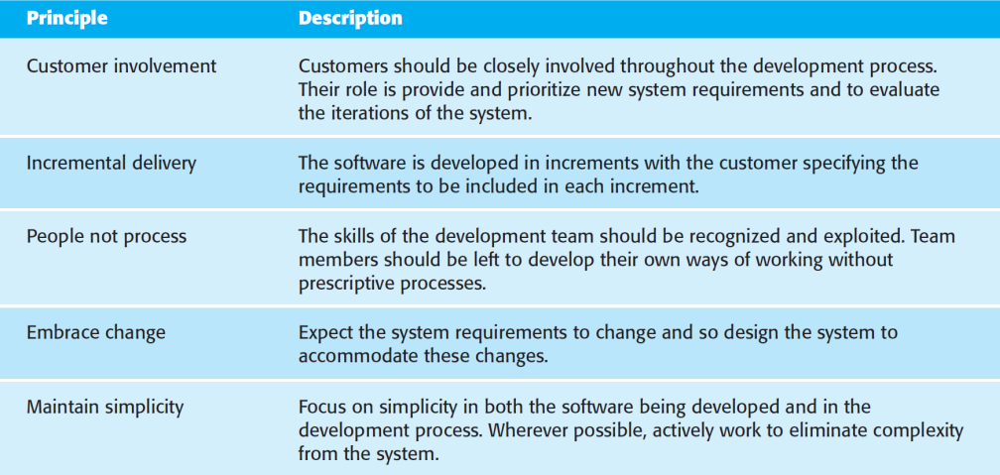
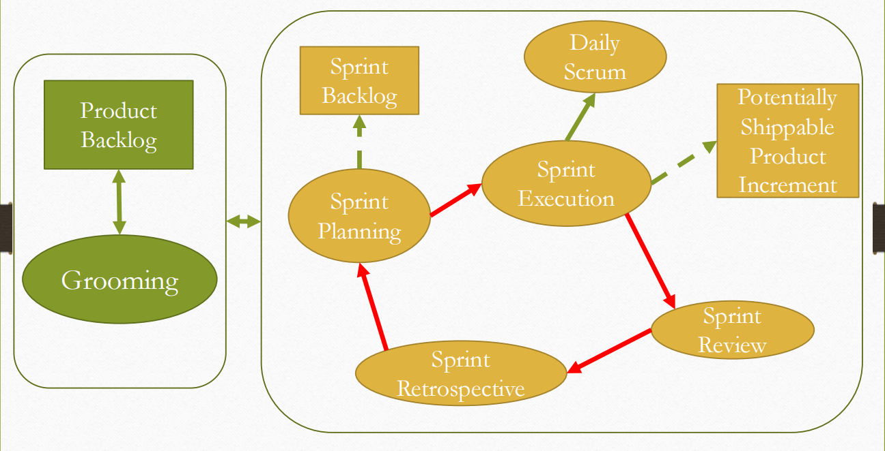
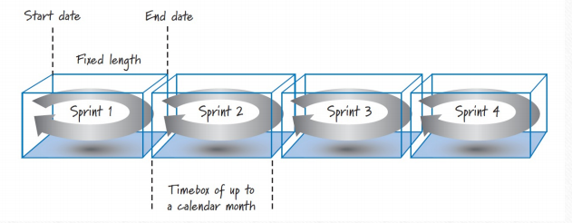
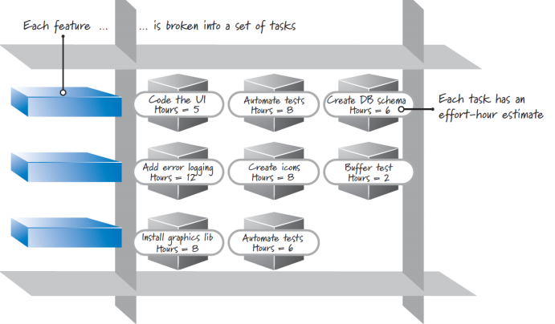

# Agile Method

## Backgrounds

Rapid Software development

- The software is not developed as a single unit but as a series of increments, with each increment including new system functionality. 

- Fundamental characteristics:  基本特性

  - The processes are interleaved.

    这些进程是交错的。

  - Minimum documentation

    最少量的手册

  - Developed in a series of versions, or increments, with system stakeholders involvement.

    在系统利益相关者的参与下，以一系列版本或增量进行开发。

  - System user interfaces are often developed using an interactive development system that allows the interface design to be quickly created

    系统用户界面通常使用交互式开发系统开发，该系统允许快速创建界面设计

- Other approaches to RAD includes:

  RAD 的其他方法包括： -

  - Adaptive software development

    自适应软件开发

  - Agile methodologies

    敏捷方法

  -  Spiral model

    螺旋模型

  - Unified software development process

    统一的软件开发流程

**Plan-driven Development Approach**

- Large, long lived software - careful project planning, formalized quality assurance, the use of analysis and design methods supported by CASE tools, and controlled and rigorous software development processes

  大型、存在时间长的软件 -- 需要仔细的项目规划、正式的质量保证、使用 CASE 工具支持的分析和设计方法，以及受控和严格的软件开发流程

**More details about agile method:**

- Agile allowed the development team to focus on the software itself rather than on its design and documentation

  敏捷使开发团队能够专注于软件本身，而不是其设计和文档

- universally rely on an incremental approach to software specification, development, and delivery. 

  普遍依赖于软件规范、开发和交付的增量方法。

- They are best suited to application development where the system requirements usually change rapidly during the development process

  它们最适合于系统要求通常在开发过程中快速变化的应用进程开发

- They are intended to deliver working software quickly to customers, who can then propose new and changed requirements to be included in later iterations of the system.

  它们旨在将工作软件快速交付给客户，然后客户可以提出新的和更改的需求，以包含在系统的后续迭代中

- The philosophy behind agile methods is reflected in the agile manifesto that was agreed on by many of the leading developers of these methods.

  敏捷方法背后的理念反映在敏捷宣言中，这些方法的许多领先开发人员都同意该宣言。

  - Individuals and interactions over processes and tools

    个人和交互胜过流程和工具

  - Working software over comprehensive documentation

    工作软件胜于全面的文档

  - Customer collaboration over contract negotiation

    客户协作胜于合同谈判

  - Responding to change over following a plan

    响应变化而不是遵循计划

**The challenges 挑战:**

- In practice, the principles underlying agile methods are sometimes difficult to realize:

  在实践中，敏捷方法的基本原则有时很难实现：

  - Its success depends on having a customer who is willing and able to spend time with the development team and who can represent all system stakeholders

    它的成功取决于拥有一个愿意并能够花时间与开发团队在一起并且能够代表所有系统利益相关者的客户——

  - Individual team members may not have suitable personalities for the intense involvement

    个别团队成员可能没有适合高强度参与的性格

  - Prioritizing changes can be extremely difficult, especially in systems for which there are many stakeholders

    确定更改的优先级可能非常困难，尤其是在有许多利益相关者的系统中

- Maintaining simplicity requires extra work

  保持简单性需要额外的工作

- It is difficult for some organization to accept informal processes defined by development teams

  某些组织很难接受开发团队定义的非正式流程

- The software requirements document is usually part of the contract between the customer and the supplier (software company)

  软件需求文档通常是客户与供应商（软件公司）之间合同的一部分

- Because incremental specification is inherent in agile methods, writing contracts for this type of development may be difficult.

  因为增量规范是敏捷方法中固有的，所以为这种类型的开发编写合同可能很困难。

- Agile methods must rely on contracts in which the customer pays for the time required for system development rather than the development of a specific set of requirements

  敏捷方法必须依赖于合同，在合同中，客户为系统开发所需的时间付费，而不是开发一组特定的需求

- If problems arise then there may be difficult disputes over who is to blame and who should pay for the extra time and resources required to resolve the problems.

  如果出现问题，那幺可能会有关于谁应该受到指责以及谁应该为解决问题所需的额外时间和资源付费的艰难争议。

**Maintenance 维护:**

- There are two questions that should be considered when considering agile methods and maintenance:

  在考虑敏捷方法和维护时，应考虑两个问题：

- Are systems that are developed using an agile approach maintainable, given the emphasis in the development process of minimizing formal documentation?

  鉴于开发过程中强调尽量减少正式文档，使用敏捷方法开发的系统是否可维护？

- Can agile methods be used effectively for evolving a system in response to customer change requests?

  敏捷方法能否有效地用于发展系统以响应客户变更请求？   -

- Formal documentation is supposed to ease system evolution and maintenance. In practice, however, formal documentation is often not kept up to date and so does not in system maintainability

  正式的文档应该简化系统演化和维护。然而，在实践中，正式的文档通常不会保持最新状态，因此系统可维护性也不会

- Agile methods supporters argue that it is a waste of time to write this out-of-date documentation

  敏捷方法的支持者认为，编写这些过时的文档是浪费时间

- The key to implementing maintainable software is to produce high-quality, readable code. 

  实现可维护软件的关键是生成高质量、可读的代码。

- The key document is the system requirements document, which tells the software engineer what the system is supposed to do

  关键文档是系统需求文档，它告诉软件工程师系统应该做什幺

-  The main difficulty after software delivery is likely to be keeping customers involved in the process.

  软件交付后的主要困难可能是让客户参与到流程中。

- The other problem that is likely to arise is maintaining continuity of the development team. Agile methods rely on team members understanding aspects of the system without having to consult documentation. 

  可能出现的另一个问题是保持开发团队的连续性。敏捷方法依赖于团队成员了解系统的各个方面，而无需查阅文档。

- If an agile development team is broken up, then this implicit knowledge is lost and it is difficult for new team members to build up the same understanding of the system and its components.

  如果敏捷开发团队解散，那幺这些隐性知识就会丢失，新的团队成员很难对系统及其组件创建相同的理解。

## Plan-driven and agile development

- Most software projects include practices from plan-driven and agile approaches. 

  大多数软件项目都包含来自计划驱动和敏捷方法的实践。

- To decide on the balance between a plan-based and an agile approach, you must answer a range of technical, human, and organizational questions:

  要决定在基于计划的方法和敏捷方法之间取得平衡，您必须回答一系列技术、人员和组织问题：

  - Detail specification and design needed?
  - Is incremental strategy realistic?
  - How large is the system?

  - What type of system being developed?

  - System life span?
  - Available technologies and tools?
  - Organization of the team?
  - Cultural issues?
  - Available skillsets?
  - External regulation?

# Scrum Framework  Scrum框架

## Overview

- Scrum is not a standardized process 

  Scrum 不是一个标准化的流程

- Scrum is a **framework** for organizing and managing work. 

  Scrum 是一个用于组织和管理工作的 **框架**。

- **Scrum是敏捷方法论中重要的框架之一**

- Imagine that the Scrum framework is like the foundation and walls of a building

  想象一下，Scrum 框架就像一栋建筑的地基和墙壁

- The Scrum values, principles, and practices would be the key structural components

  Scrum 价值观、原则和实践将是关键的结构组成部分

- You can customize inside the structure of Scrum, adding fixtures and features until you have a process that works for you

  您可以在 Scrum 的结构中进行自定义，添加固定装置和功能，直到您拥有适合您的流程

- Scrum is a simple, people-centric framework based on the values of honesty, openness, courage, respect, focus, trust, empowerment, and collaboration

  Scrum 是一个简单、以人为本的框架，基于诚实、开放、勇气、尊重、专注、信任、授权和协作等价值观

- The Scrum practices themselves are embodied in specific roles, activities, artifacts, and their associated rules

  Scrum 实践本身体现在特定的角色、活动、工件及其相关规则中

## Scrum Role

- Scrum development efforts consist of one or more **Scrum teams**

  Scrum 开发工作由一个或多个 **Scrum 团队** 组成

- Each made up of three Scrum roles: **product owner**, **ScrumMaster**, and the **development team**

  每个角色由三个 Scrum 角色组成：**产品负责人**、**ScrumMaster**和 **开发团队**

  - The **product owner** is responsible for what will be developed and in what order

    产品负责人负责将开发的内容和顺序

  - The **Scrum Master** is responsible for guiding the team in creating and following its own process based on the broader Scrum framework

    Scrum Master 负责指导团队根据更广泛的 Scrum 框架创建和遵循自己的流程

  - The **development team** is responsible for determining how to deliver what the product owner has asked for

    开发团队负责确定如何交付产品所有者所要求的内容

### Product Owner

- The single authority responsible for deciding which features and functionality to build and the order in which to build them

  负责决定构建哪些特性和功能以及构建它们的顺序的单一机构

- The product owner maintains and communicates to all other participants a clear vision of what the Scrum team is trying to achieve

  产品负责人维护并向所有其他参与者传达 Scrum 团队想要实现的目标的清晰愿景

- The product owner is responsible for the overall success of the solution being developed or maintained.

  产品所有者负责正在开发或维护的解决方案的整体成功。

- To make sure that the most valuable work is always performed

  确保始终执行最有价值的工作

- The product owner actively collaborates with the ScrumMaster and development team

  产品所有者与 ScrumMaster 和开发团队积极协作

- Must be available to answer questions soon after they are posed

  必须在问题提出后立即回答

### ScrumMaster

- Helps everyone involved understand and embrace the Scrum values, principles, and practices

  帮助所有相关人员理解并接受 Scrum 价值观、原则和实践

- Acts as a coach, providing process leadership and helping the Scrum team and the rest of the organization develop their own high performance, organization-specific Scrum approach

  充当教练，提供流程领导，并帮助 Scrum 团队和组织的其他成员开发他们自己的高绩效、特定于组织的 Scrum 方法

- The ScrumMaster helps the organization through the challenging change management process that can occur during a Scrum adoption.

  ScrumMaster 帮助组织完成 Scrum 采用期间可能发生的具有挑战性的变更管理流程。

### Development Team

- Scrum defines the role of a development team, which is simply a diverse, cross-functional collection of people who are responsible for designing, building, and testing the desired product

  Scrum 定义了开发团队的角色，开发团队只是负责设计、构建和测试所需产品的多元化、跨职能人员的集合

- The development team self-organizes to determine the best way to accomplish the goal set out by the product owner

- The development team is typically five to nine people in size

  开发团队自组织起来，以确定实现产品所有者设定的目标的最佳方式开发团队通常为 5 到 9 人

- Its members must collectively have all the skills needed to produce good quality, working software

  其成员必须共同具备生产高质量、可工作软件所需的所有技能

- For development efforts that require much larger team size, team members can be organized into several teams with each team nine or fewer team members

  对于需要更大团队规模的开发工作，可以将团队成员组织成多个团队，每个团队的团队成员不超过 9 人

## Scrum Activities and Artifacts  Scrum 活动和工件

### Product Backlog  产品积压

The product owner, with input from the rest of the Scrum team and stakeholders, is ultimately responsible for determining and managing the sequence of works (product backlog items) and communicating it in the form of a prioritized (or ordered) list known as the **product backlog**

产品负责人，根据 Scrum 团队其他成员和利益相关者的意见，最终负责确定和管理工作顺序（产品待办事项），并以称为**产品待办事项**的优先（或有序）列表的形式进行沟通

- On new-product development the product backlog items initially are features required to meet the product owner’s vision. 

  在新产品开发中，产品积压工作项最初是满足产品所有者愿景所需的功能。

- For ongoing product development, the product backlog might also contain new features, changes to existing features, defects needing repair, technical improvements, and so on.

  对于正在进行的产品开发，产品积压工作还可能包含新功能、对现有功能的更改、需要修复的缺陷、技术改进等。

- Product owner collaborates with internal and external stakeholders to gather and define the product backlog items

  产品负责人与内部和外部利益相关者协作，收集和定义产品积压工作项

- High-value items appear at the top of the product backlog and the lower value items appear toward the bottom. 

  高价值项目显示在产品积压工作的顶部，而低价值的项目显示在底部。

- The product backlog is a constantly evolving artifact. Items can be added, deleted, and revised by the product owner as business conditions change, or as the Scrum team’s understanding of the product grows

  产品积压工作是一个不断发展的工件。随着业务条件的变化，或者随着 Scrum 团队对产品的理解的增长，产品所有者可以添加、删除和修改项目

- In practice, many teams use a **relative size measure** such as **story points** or **ideal days** to express the item size

  在实践中，许多团队使用 **相对大小度量**（例如 **故事点** 或 **理想天数**）来表示项目大小

### Product Backlog Grooming

The activity of creating and refining product backlog items, estimating them, and prioritizing them is known as grooming

创建和优化产品积压工作项、估计它们并确定它们的优先级的活动称为梳理

### Sprint

- In Scrum, work is performed in iterations or cycles of up to a calendar month called **sprints** 

  在 Scrum 中，工作以迭代或周期的形式执行，最长一个日历月称为 **sprint**

- The work completed in each sprint should create something of tangible value to the customer or user

  每个 sprint 中完成的工作应该为客户或用户创造有形的价值

- Sprints are timeboxed so they always have a fixed start and end date, and generally

  Sprint 是有时间限制的，因此它们始终具有固定的开始和结束日期，并且通常

- They should all be of the same duration

  它们都应该具有相同的持续时间

- A new sprint immediately follows the completion of the previous sprint

  新的sprint 紧跟在上一个sprint之后

### Sprint Planning

- A product backlog may represent many weeks or months of work. To complete all the items in the product backlog, a series of sprints are to be carried out

  产品积压工作可能代表数周或数月的工作。为了完成产品积压工作中的所有项目，需要执行一系列的 sprint

- To determine the most important subset of product backlog items to build in the next sprint, the product owner, development team, and ScrumMaster perform **sprint planning**

  为了确定在下一个 sprint 中要构建的产品积压工作项的最重要子集，产品所有者、开发团队和 ScrumMaster 执行 **sprint 计划**

- During sprint planning, the product owner and development team agree on a **sprint goal** that defines what the upcoming sprint is supposed to achieve

  在 Sprint 规划期间，产品负责人和开发团队就 **sprint 目标**达成一致，该目标定义了即将到来的 sprint 应该实现的目标

- Based on the sprint goal, the development team reviews the product backlog and determines the high priority items that the team can realistically accomplish in the upcoming sprint while working at a **sustainable pace**

  根据 sprint 目标，开发团队审查产品积压工作，并确定团队在即将到来的 sprint 中可以实际完成的高优先级项目，同时以 **可持续的速度** 工作

- Many development teams break down each targeted feature into a set of tasks. The collection of these tasks, along with their associated product backlog items, forms a second backlog called the **sprint backlog**

  许多开发团队将每个目标功能分解为一组任务。这些任务的集合及其关联的产品积压工作项构成了第二个积压工作，称为 **冲刺积压工作**

- The team provides an estimate (typically in hours) of the effort required to complete each task

  团队提供完成每项任务所需工作量的估计值（通常以小时为单位）

- In summary: Select a product backlog item (whenever possible, the next most-important item as defined by the product owner), break the item down into tasks, and determine if the selected item will reasonably fit within the sprint (in combination with other items targeted for the same sprint). If it does fit and there is more capacity to complete work, repeat the cycle until the team is out of capacity to do any more work.

  总之：选择一个产品积压工作项（尽可能，由产品所有者定义的下一个最重要的项目），将该项目分解为任务，并确定所选项是否合理地适合 sprint（与针对同一 sprint 的其他项目组合）。如果它确实适合并且有更多能力来完成工作，请重复该周期，直到团队无法再做任何工作。

### Sprint Execution

- Once the Scrum team finishes sprint planning and agrees on the content of the next sprint, the development team performs all the task-level work necessary to get the features done

  一旦 Scrum 团队完成 sprint 计划并就下一个 sprint 的内容达成一致，开发团队就会执行完成功能所需的所有任务级工作

- “done” means there is a high degree of confidence that all the work necessary for producing good-quality features has been completed.

  “完成”意味着有高度的信心，即生成高质量功能所需的所有工作都已完成。   -

- Team members define their own task-level work and then self-organize in any manner they feel is best for achieving the sprint goal

  团队成员定义自己的任务级工作，然后以他们认为最适合实现 sprint 目标的任何方式进行自组织

### Daily Scrum

- Each day of the sprint, ideally at the same time, the development team members hold a timeboxed (15 minutes or less) **daily scrum** 

  冲刺的每一天，理想情况下在同一时间，开发团队成员举行一个有时间限制的（15 分钟或更短）**每日 Scrum**

- This inspect-and-adapt activity is sometimes referred to as the **daily stand****up** because of the common practice of everyone standing up during the meeting to help promote brevity

  这种检查和适应活动有时被称为 **每日站立****** up**，因为每个人在会议期间都会站起来以帮助促进简洁

- ScrumMaster facilitating and each team member taking turns answering three questions:

  ScrumMaster 引导，每个团队成员轮流回答三个问题：

  - What did I accomplish since the last daily scrum?

    自上次每日 Scrum 以来，我完成了什幺？

  - What do I plan to work on by the next daily scrum?

    我打算在下一次每日 Scrum 之前做什幺？

  - What are the obstacles or impediments that are preventing me from making progress?

    阻碍我取得进步的障碍或阻碍因素是什幺？

- The purpose is for everyone to understands the big picture of what is occurring, how they are progressing toward the sprint goal, any modifications they want to make to their plans for the upcoming day’s work, and what issues need to be addressed.

  目的是让每个人都了解正在发生的事情的大局，他们如何朝着 sprint 目标前进，他们想要对来天的工作计划进行的任何修改，以及需要解决哪些问题。

- Not a problem-solving activity

  不是解决问题的活动

- Talk about problems after the daily scrum and do so with a small group of interested member

  在每日 Scrum 之后讨论问题，并与一小群感兴趣的成员一起讨论

- Communicate the status of sprint backlog items among the development team members

  在开发团队成员之间传达 sprint 积压工作项的状态

- It is an inspection, synchronization, and adaptive daily planning activity that helps a self-organizing team do its job better.

  它是一个检查、同步和自适应的日常规划活动，可帮助自组织团队更好地完成其工作。

### Definition of Done

- sprint results as a **potentially shippable product increment**, meaning that whatever the Scrum team agreed to do is really done according to its agreed upon definition of done

  Sprint 结果为 **潜在可交付的产品增量**，这意味着 Scrum 团队同意做的任何事情实际上都是根据其商定的完成定义完成的

- This definition specifies the degree of confidence that the work completed is of good quality and is potentially shippable.

  此定义指定了已完成的工作质量良好且可能可交付的置信度。

- A bare-minimum definition of done should yield a complete slice of product functionality that is designed, built, integrated, tested, and documented

  完成的最低定义应该产生一个完整的产品功能切片，该部分是设计、构建、集成、测试和记录的

- “potentially shippable” does not mean that what got built must actually be shipped. 

  “可能可运输”并不意味着构建的内容必须实际运输。

- Shipping is a business decision, which is frequently influenced by things such as:

  运输是一项商业决策，经常受到以下因素的影响：

  - Do we have enough features or enough of a customer workflow to justify a customer deployment?

    我们是否有足够的功能或足够的客户工作流程来证明客户部署的合理性？

  - Can our customers absorb another change given that we just gave them a release two weeks ago?

    鉴于我们两周前刚刚发布了版本，我们的客户能否吸收另一个变化？

### Sprint Review

- At the end of the sprint there are two additional inspect-and-adapt activities, **sprint review** and **sprint retrospective**

  在 sprint 结束时，还有两个额外的检查和调整活动，**sprint review** 和 **sprint retrospective** -

- Sprint review is to inspect and adapt the **product** that is being built.

  Sprint 评审是检查和调整正在构建的 **产品**。

- Critical to this activity is the conversation that takes place among its participants, which include the Scrum team, stakeholders, sponsors, customers, and interested members of other teams. 

  这项活动的关键是参与者之间发生的对话，参与者包括 Scrum 团队、利益相关者、赞助商、客户和其他团队的相关成员。

- Focused on reviewing the just-completed features in the context of the overall development effort. 

  专注于在整个开发工作的上下文中查看刚刚完成的功能。

- Everyone in attendance gets clear visibility into what is occurring and has an opportunity to help guide the forthcoming development to ensure that the most business-appropriate solution is created.

  出席会议的每个人都可以清楚地了解正在发生的事情，并有机会帮助指导即将到来的开发，以确保创建最适合业务的解决方案。

### Sprint Retrospective

- The second inspect-and-adapt activity at the end of the sprint

  冲刺 （sprint） 结束时的第二个检查和调整活动

- Frequently occurs after the sprint review and before the next sprint planning

  经常发生在 sprint 评审之后和下一个 sprint 计划之前

- Sprint retrospective is an opportunity to inspect and adapt the **process**

  Sprint 回顾是一个检查和调整 **流程** 的机会

- The development team, ScrumMaster, and product owner discuss what is and is not working with Scrum and associated technical practices.

  开发团队、ScrumMaster 和产品负责人讨论哪些内容与 Scrum 一起工作，什幺不适合 Scrum 以及相关的技术实践。

- The focus is on the continuous process improvement

  重点是持续的流程改进

- At the end of a sprint retrospective the Scrum team should have identified and committed to a practical number of process improvement actions

  在 sprint 回顾结束时，Scrum 团队应该确定并致力于实际数量的流程改进行动
