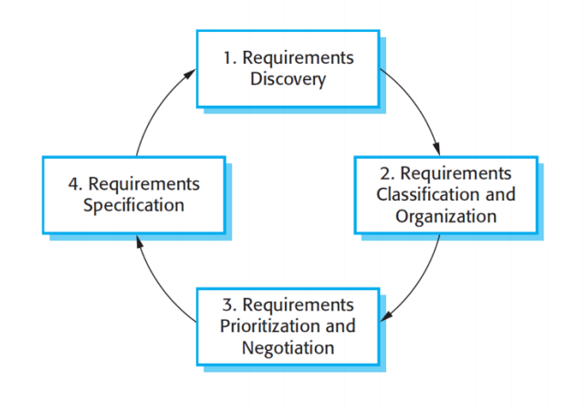
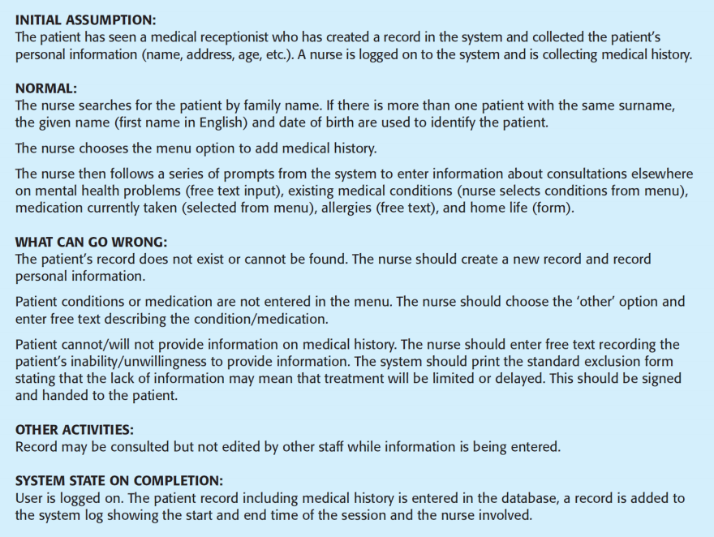

# Software Specification

上节课介绍的Software process中的四种活动的顺序为: Software specification → software design and implementation → software validation → software evolution

## Introduction

- **Definition**: Software specification is the process of detailing the functionalities, constraints, and interactions of a software system. It serves as a blueprint for the design and development phases.

  软件规范是详细说明软件系统的功能、约束和交互的过程。它用作设计和开发阶段的蓝图。

- **Purpose**: To ensure that all stakeholders have a clear understanding of what the software system is supposed to do and how it will perform.

  确保所有利益相关者都清楚地了解软件系统应该做什幺以及它将如何执行。

- **Output**: Software specification will produce Software Requirements Document which acts as an input to the next activity of the process.

  软件规范将生成软件需求文档，作为流程下一个活动的输入。

- The requirements for a system are the descriptions of what the system should do

  系统的要求是系统应该做什幺的描述

  - reflect the needs of customers for a system

    反映客户对系统的需求

- The process of finding out, analyzing, documenting and checking these needs and constraints is called software specification (sometimes requirement engineering)

  发现、分析、记录和检查这些需求和约束的过程称为软件规范（有时是需求工程）

- **Clarity and Understanding**: Provides a clear and detailed description of system requirements for all stakeholders.

  **清晰和理解**：为所有利益相关者提供清晰详细的系统要求描述。

- **Guidance for Development**: Acts as a roadmap for developers, ensuring that the system is built according to specified requirements.

  **开发指南**：作为开发人员的路线图，确保系统按照指定要求构建。

- **Basis for Testing**: Provides a reference for creating test cases and validating the system against requirements.

  **测试基础**：为创建测试用例和根据需求验证系统提供参考。

- **Risk Reduction**: Identifies potential issues and ambiguities early in the development process, reducing the risk of costly changes later

  **降低风险**：在开发过程的早期识别潜在问题和歧义，降低后期代价高昂的更改风险

### Process

- Four high-level activities

  四大高层次活动

  - Feasibility study: To determine whether the proposed system is technically, economically, and operationally feasible.

    可行性研究：确定拟议的系统在技术、经济和运营上是否可行。

    - **Outcome**: A feasibility report that provides a recommendation on whether to proceed with the project.

      **结果**：一份可行性报告，提供有关是否继续该项目的建议。

  - Requirements elicitation and analysis: To gather, analyze, and refine the requirements for the software system.

    需求获取和分析：收集、分析和提炼软件系统的需求。

    - **Outcome**: A comprehensive set of requirements that have been analyzed and refined to ensure clarity, completeness, and feasibility

      **结果**：一组全面的要求，经过分析和完善，以确保清晰度、完整性和可行性

  -  Requirements specification: To document the gathered and analyzed requirements in a clear and structured format.

    需求规范：以清晰和结构化的格式记录收集和分析的需求。

    - **Outcome**: A detailed Software Requirements Document (SRD) that provides a clear and comprehensive description of the system’s functionalities and constraints.

      **结果**：详细的软件需求文档 （SRD），对系统的功能和限制进行清晰全面的描述。

  - Requirements validation: To ensure that the documented requirements accurately reflect the needs and expectations of stakeholders.

    需求验证：确保记录的需求准确反映利益相关者的需求和期望。

    - **Outcome**: Validated requirements that have been reviewed and approved by stakeholders, ensuring they accurately reflect the desired system.

      **结果**：经过验证的需求，这些需求已经过利益相关者的审查和批准，确保它们准确反映了所需的系统。

**iterative process in which the activities are interleaved**

**活动交错的迭代过程**

## Road Map

- *User requirements and system requirements*

  *用户要求和系统要求*

- *Functional requirements and non-functional requirements*

  *功能需求和非功能需求*

- **Feasibility study**

  **可行性研究**

- **Requirements elicitation and analysis**

  **需求获取和分析**

- **Requirements specification**

  **需求规范**

- **Requirements validation**

  **需求验证**

## Clarity in Communication  沟通清晰

- The requirements can be described in a high-level, abstract statement of a service that a system should provide or a constraint on a system. At the other extreme, it is a detailed, formal definition of a system function

  这些需求可以用系统应该提供的服务的高级抽象声明或对系统的约束来描述。在另一个极端，它是系统函数的详细、正式定义

- When should an engineer write the requirements in high-level description and when in detail description?

  工程师何时应该在高级描述中编写需求，何时应在详细描述中编写需求？

- In high-level description when communicating with non-technical personnel such as end-users and business stakeholders

  在与非技术人员（如最终用户和业务利益相关者）通信时进行简要描述

- In detail description when communicating with technical personnel such as software developers, architects, and technical stakeholders

  与技术人员（如软件开发人员、架构师和技术利益相关者）沟通时的详细描述

## User requirements and system requirements  用户要求和系统要求

### User Requirements

- **What are User Requirements?**

  **用户要求是什幺？**

- **Definition**: User requirements describe what the users need from the system. They focus on the functionalities and features that will enable users to achieve their goals.

  定义：用户需求描述用户对系统的需求。他们专注于使用户能够实现其目标的功能和特性。

- User Requirement definition: The MHC-RMS shall generate monthly management reports showing the cost of drugs prescribed by each clinic during that month.

  MHC-RMS 应生成月度管理报告，显示各诊所当月的处方药成本。

- **Characteristics**: 

  **特性**：

  - **User-Centric**: Emphasize the needs and perspectives of the end-users.

    **以用户为中心**：强调最终用户的需求和观点。

  - **Functional**: Describe what the system should do in **high-level**.

    **功能**：在 **高级** 中描述系统应该做什幺。

  - **Non-Technical**: Typically written in a language understandable by users and stakeholders.

    **非技术性**：通常以用户和利益相关者可以理解的语言编写。

#### Examples of User Requirements  用户要求示例

Requirement should state what the system should do instead of how it should be done.

需求应该说明系统应该做什幺，而不是应该如何做。

- **E-commerce Platform**: 

  **电商平台**：

  - Users should be able to search for products.

    用户应该能够搜索产品。

  - Users should be able to add products to a shopping cart.

    用户应该能够将产品添加到购物车中。

  - Users should be able to complete a purchase using various payment methods.

    用户应该能够使用各种付款方式完成购买。

- **Social Media Application**: 

  **社交媒体应用**：

  - Users should be able to create and edit profiles.

    用户应该能够创建和编辑配置文档。

  - Users should be able to post updates and share content.

    用户应该能够发布更新和共享内容。

  - Users should be able to send and receive messages

    用户应该能够发送和接收消息

#### Role of Users in Defining User Requirements  定义用户要求中的用户角色

-  **Primary Contributors**: Users are the primary contributors to user requirements as they best understand their own needs and how the system should support their tasks.

  **主要贡献者**：用户是用户需求的主要贡献者，因为他们最了解自己的需求以及系统应如何支持他们的任务。

- **Techniques for Gathering User Requirements**: 

  **收集用户需求的技术**：

  - **Interviews**: Conduct one-on-one interviews with users to gather detailed insights.

    **访谈**：与用户进行一对一访谈，以收集详细的见解。

  - **Surveys and Questionnaires**: Use surveys to gather input from a larger audience.

    **调查和问卷**：使用调查从更多受众那里收集意见。

  - **Workshops and Focus Groups**: Facilitate collaborative discussions to gather diverse perspectives.

    **研讨会和焦点小组**：促进协作讨论以收集不同的观点。

  - **Observation**: Observe users in their natural environment to understand their workflows and challenges.

    **观察**：观察用户的自然环境，以了解他们的工作流程和挑战。

  - **User Stories and Use Cases**: Document requirements in the form of user stories and use cases to capture user interactions with the system.

    **用户故事和使用案例**：以用户故事和使用案例的形式记录需求，以捕获用户与系统的交互。

### System requirements

- **What are System Requirements?**

  **什幺是系统要求？**

- **Definition**: System requirements describe the technical specifications and constraints of the system. They focus on refining user requirements by adding technical details.

  定义：系统要求描述了系统的技术规范和约束。他们专注于通过添加技术细节来完善用户需求。

- **Characteristics**: 

  **特性**：

  - **System-Centric**: Emphasize the architecture, design, and technical details of the system.

    **以系统为中心**：强调系统的架构、设计和技术细节。

  - **Functional and Non-Functional**: Include both what the system should do and how it should perform.

    **功能性和非功能性**：包括系统应该做什幺以及它应该如何执行。

  - **Technical**: Written in a language understandable by developers and technical stakeholders.

    **技术**：以开发人员和技术利益相关者可以理解的语言编写。

#### System Requirements Specification 系统要求规范

1. One the last working day of each month, a summary of the drugs prescribed, their cost, and the prescribing clinics shall be generated.
2. The system shall automatically generate the report for printing after 17.30 on the last working day of the month.
3. A report shall be created for each clinic and shall list the individual drug names, the total number of prescriptions, the number of doses prescribed, and the total cost of the prescribed drugs.
4. If drug are available in different dose units (e.g. 10mg, 20mg) separate reports shall be created for each dose unit.
5. Access to all cost reports shall be restricted to authorized users listed on a management access control list.

#### Role of Engineers in Defining System Requirements  工程师在定义系统需求中的角色

- **Primary Contributors**: Engineers (including software developers, system architects, and technical experts) are the primary contributors to system requirements as they have the technical expertise to translate user needs into technical specifications.

  **主要贡献者**：工程师（包括软件开发人员、系统架构师和技术专家）是系统需求的主要贡献者，因为他们拥有将用户需求转化为技术规范的技术专业知识。

- **Techniques for Defining System Requirements**: 

  **定义系统要求的技巧**：

  - **Requirements Analysis**: Analyze user requirements to derive system requirements.

    **需求分析**：分析用户需求以得出系统需求。

  - **Technical Workshops**: Conduct workshops with technical stakeholders to define system specifications.

    **技术研讨会**：与技术利益相关者举办研讨会以定义系统规范。

  - **Modeling and Diagrams**: Use modeling techniques (e.g., UML, ER diagrams) to represent system requirements.

    **建模和图表**：使用建模技术（例如 UML、ER 图）来表示系统需求。

  - **Prototyping**: Create prototypes to validate system requirements and design choices.

    **原型设计**：创建原型以验证系统要求和设计选择。

  - **Traceability**: Ensure traceability between user requirements and system requirements to maintain alignment

    **可追溯性**：确保用户需求和系统需求之间的可追溯性，以保持一致性

In most cases, Software Requirements Document includes both User Requirements and System Requirements

在大多数情况下，软件需求文档包括用户需求和系统需求

## Functional & Non-functional requirements 功能和非功能要求

- Software requirements are often classified as functional requirements or nonfunctional requirements:

  软件需求通常分为功能性需求或非功能性需求

  - Functional requirements: describe the specific behaviors and functions that a system must perform. They detail what the system should do to meet the needs of its users.

    功能要求：描述系统必须执行的特定行为和功能。它们详细说明了系统应该做什幺来满足其用户的需求。

  - Non-functional requirements: describe the system’s operational qualities and constraints. They detail how the system should perform rather than what it should do. Non-functional requirements often apply to the system as a whole, rather than individual system features or services.

    非功能性需求：描述系统的运行质量和约束。它们详细说明了系统应该如何执行，而不是它应该做什幺。非功能性需求通常适用于整个系统，而不是单个系统功能或服务。

### Functional Requirements  功能要求

- When expressed as *user requirements*, functional requirements are usually described in an abstract way that can be understood by system users.

  当表示为 *用户需求* 时，功能需求通常以系统用户可以理解的抽象方式进行描述。

- More specific *functional system requirements* describe the system functions, its inputs and outputs, exceptions, etc., in detail.

  更具体的 *功能系统需求* 详细描述了系统功能、其输入和输出、异常等。

- The functional requirements specification of a system should be both complete and consistent. 

  系统的功能需求规范应既完整又一致。

  - Completeness means that all services required by the user should be defined.

    完整性意味着应定义用户所需的所有服务。

  - Consistency means that requirements should not have contradictory definitions.

    一致性意味着需求不应具有相互矛盾的定义。

- In practice, for large, complex systems, it is practically impossible to achieve requirements consistency and completeness.

  在实践中，对于大型复杂系统，几乎不可能实现需求的一致性和完整性。

  - it is easy to make mistakes and omissions when writing specifications for complex systems

    在为复杂系统编写规范时，很容易出错和遗漏

  - there are many stakeholders in a large system. Stakeholders have different and often inconsistent needs.

    一个大型系统中有许多利益相关者。利益相关者有不同的需求，而且往往是不一致的。

### Example

Sample requirement for MHC-PMS system:

MHC-PMS 系统的样品要求：

1. A user shall be able to search the appointments lists for all clinics.

   用户应能够搜索所有诊所的预约列表。

2. The system shall generate each day, for each clinic, a list of patients who are expected to attend appointments that day.

   系统应每天为每个诊所生成一份预计当天参加预约的患者名单。

3. Each staff member using the system shall be uniquely identified by his or her eight-digit employee number.

   使用该系统的每位员工都应由其八位数的员工编号进行唯一标识。

### Characteristics of Functional Requirements  功能需求的特点

- **Behavioral**: Focus on the actions and operations that the system must perform. 

  **行为**：专注于系统必须执行的操作和操作。

- **User-Centric**: Often derived from user needs and use cases. 

  **以用户为中心**：通常源自用户需求和使用案例。

- **Specific and Measurable**: Clearly defined and can be tested for correctness. 

  **具体且可衡量**： 定义明确，可测试正确性。

### Non-functional Requirements  非功能性要求

- Non-functional requirements, as the name suggests, are requirements that are not directly concerned with the specific service or operation delivered by the system to its users.

  顾名思义，非功能性需求是与系统向其用户提供的特定服务或操作不直接相关的需求。

- System properties such as reliability, response time, scalability, security, or availability.

  系统属性，例如可靠性、响应时间、可伸缩性、安全性或可用性。

- Usually specify constrain characteristics of the system as a whole

  通常指定整个系统的约束特性

- Often more critical than individual functional requirements

  通常比单个功能要求更关键

- failing to meet a non-functional requirement can mean that the whole system is unusable

  未能满足非功能性需求可能意味着整个系统不可用

- The implementation of non-functional requirements may be intricately dispersed throughout the system. 

  非功能性需求的实现可能错综复杂地分散在整个系统中。

  - They may affect the overall architecture of a system rather than the individual components.

    它们可能会影响系统的整体架构，而不是单个组件。

  - A single non-functional requirement may generate a number of related functional requirements.

    单个非功能性需求可能会生成许多相关的功能性需求。

### Characteristics of Non-functional Requirements  非功能性需求的特征

- **Quality Attributes**: Focus on performance, security, usability, reliability, scalability, and other attributes. 

  **质量属性**：关注性能、安全性、可用性、可靠性、可扩展性和其他属性。

- **System-Centric**: Often derived from technical and business constraints. 

  **以系统为中心**：通常源自技术和业务限制。

- **Measurable**: Can be quantified and tested for compliance. 

  **可衡量**： 可以量化并测试合规性。

### Classification of Non-functional Requirements 非功能性需要满足的三种要求

- *Product requirements* - These requirements specify or constrain the behavior of the software.

  *产品要求* 这些要求指定或约束软件的行为。

- *Organizational requirements* - These requirements are broad system requirements derived from policies and procedures in the customer’s and developer’s organization.

  *组织要求* 这些要求是从客户和开发人员组织中的策略和进程派生而来的广泛的系统要求。

- *External requirements* - This broad heading covers all requirements that are derived from factors external to the system and its development process

  *外部要求* 此宽泛标题涵盖从系统及其开发过程的外部因素派生的所有要求

### Examples

- Product Requirement
  
  产品要求
  
  - The MHC-PMC shall be available to all clinic during normal working hours (Mon-Fri, 08.30=17.30). Downtime within normal working hours shall not exceed five seconds in any one day.
  
    MHC-PMC 应在正常工作时间（周一至周五，08.30=17.30）提供给所有诊所。正常工作时间内的停机时间在任何一天不得超过 5 秒。
  
- Organization Requirement
  
  组织要求
  
  - Users of the MHC-PMS system shall authenticate themselves using their health authority identity card
  
    MHC-PMS 系统的用户应使用其卫生当局身份证进行自我认证
  
- External Requirement
  
  外部要求
  
  - The system shall implement patient privacy provisions as set our in HStan-03-2006-priv.
  
    该系统应执行我们在 HStan-03-2006-priv 中设定的患者隐私规定。

### Non-functional Requirements - Testability 操作性

- A common problem with non-functional requirements is that users or customers often propose these requirements as general goals, such as …

  非功能性需求的一个常见问题是，用户或客户经常将这些需求作为一般目标提出，例如......

  - The system should be easy to use by medical staff and should be organized in such a way that user errors are minimized.

    该系统应易于医务人员使用，并且应以最大程度减少用户错误的方式进行组织

    **VS**

  - Medical staff shall be able to use all the system functions after four hours of training. After this training, the average number of errors made by the trained users shall not exceed two per hour of system use.

    医务人员在经过 4 小时的培训后，应能够使用系统的所有功能。经过此培训后，受过培训的用户每小时犯的平均错误数不得超过每小时 2 个。

### Characteristics of Testable Non-Functional Requirements  可测试的非功能需求的特征

- **Specific**: Clearly defines what is expected.

  **具体**：明确定义预期内容。

- **Measurable**: Provides metrics that can be quantified.

  **可测量性**：提供可量化的指标。

- **Achievable**: Realistic and attainable within the project constraints.

  **可实现性**：在项目约束范围内现实且可实现。

- **Relevant**: Directly related to the system’s goals and objectives.

  **相关**：与系统的目标直接相关。

- **Context**: Specifies the context where the requirement should be met.

  **上下文**：指定应满足要求的上下文。

### Example of a Testable Non-Functional Requirement 非功能需求的测试案例

- **Performance**: “The system should process 1,000 transactions per second with a response time of less than 2 seconds under peak load conditions.” 

  **性能**： “在峰值负载条件下，系统应每秒处理 1,000 个事务，响应时间小于 2 秒。”

- **Testability**: This requirement is specific, measurable, achievable, context, and can be tested using performance testing tools.

  **可测试性**：此要求是具体的、可衡量的、可实现的、上下文的，并且可以使用性能测试工具进行测试。

### Example of a Non-Testable Non-Functional Requirement

- **Usability**: “The system should be user-friendly and intuitive.” 

  **可用性**： “系统应该是用户友好和直观的。”

- **Testability**: This requirement is vague and subjective. It does not provide specific criteria or metrics that can be tested.

  **可测试性**：这个要求是模糊和主观的。它不提供可以测试的特定标准或指标。

- **Vagueness**: The term “user-friendly and intuitive” is subjective and open to interpretation. Different users may have different opinions on what constitutes user-friendliness.

  **模糊性**： 术语“用户友好和直观”是主观的，可以自由解释。不同的用户可能对什幺是用户友好性有不同的看法。

- **Lack of Specific Metrics**: The requirement does not provide specific, measurable criteria that can be used to evaluate usability.

  **缺少具体指标**： 该要求未提供可用于评估可用性的具体、可衡量的标准。

- **Ambiguity**: The requirement is not clear about what aspects of the system should be user-friendly or how intuitiveness should be measured.

  **歧义性**：要求不清楚系统的哪些方面应该是用户友好的，或者应该如何衡量直观性。

### Improved, Testable Non-Functional Requirement 声明需要更精炼

- **Original Statement**: “The system should be user-friendly and intuitive.”

  **原始声明**： “该系统应该是用户友好和直观的。

- **Refined Statement**: “The system should achieve a System Usability Scale (SUS) score of at least 80% based on user feedback surveys conducted with a sample size of at least 50 users.”

  **精炼声明**： “根据样本量至少为 50 个用户进行的用户反馈调查，系统应达到至少 80% 的系统可用性量表 （SUS） 分数。

  - **Specific**: Defines the use of usability metric (SUS score), user feedback surveys.

    **具体**：定义可用性指标（SUS 分数）和用户反馈调查的使用。

  - **Measurable and achievable**: Provides a target score (80%).

    **可衡量和可实现**： 提供目标分数 （80%）。

  - **Context**: Sample size of at least 50 users.

    **上下文**：样本量至少 50 个用户。

- **Original Statement**: “The system should be user-friendly and intuitive.”

  **原始声明**："系统应方便用户，直观易用"。

- **Refined Statement**: “Users should be able to complete the primary tasks (e.g., placing an order) within 3 minutes on their first attempt, with no more than two errors.”

  **精炼声明**： “用户应该能够在第一次尝试的 3 分钟内完成主要任务（例如，下订单），并且错误不超过两个。”

  - **Specific**: Complete the primary tasks (e.g., placing an order).

    **具体**：完成主要任务（例如，下订单）。

  - **Measurable and achievable**: Specify the limit of 3 minutes and no more than 2 errors.

    **可衡量和可实现的**：指定 3 分钟的限制，且错误数不超过 2 个。

  - **Context**: Complete the primary tasks on their first attempt.

    **上下文**：在第一次尝试时完成主要任务。

## Emergent System Properties 紧急情况属性

- **Definition**: Emergent system properties are characteristics that arise from the interactions and collective behavior of the system components. These properties are not attributable to any single component but emerge from the system as a whole.

  **定义**： 紧急系统属性是由系统组件的交互和集体行为产生的特征。这些属性不归因于任何单个组件，而是从整个系统中出现。

- **Examples**: 

  - **Performance**: Overall speed and efficiency of the system.

    **性能**：系统的整体速度和效率。

  - **Reliability**: The system’s ability to function correctly over time and under varying conditions.

    **可靠性**：系统在一段时间内和不同条件下正常运行的能力。

  - **Security**: The system’s ability to protect data and resist attacks.

    **安全性**：系统保护数据和抵御攻击的能力。

  - **Scalability**: The system’s ability to handle increased load without degrading performance.

    **可扩展性**：系统能够在不降低性能的情况下处理增加的负载。

### Importance of Highlighting Emergent System Properties

- **Highlighting Non-Functional Requirements Related to Emergent System Properties**

  **突出显示与紧急系统属性相关的非功能性需求**

  - **System-Wide Impact**: Emergent properties affect the entire system and are critical to its overall success.

    **系统范围的影响**：紧急属性会影响整个系统，对其整体成功至关重要。

  - **Visibility and Awareness**: Explicitly highlighting these requirements ensures that all stakeholders are aware of their importance and impact.

    **可见性和意识**：明确强调这些要求可确保所有利益相关者都了解它们的重要性和影响。

  - **Design Considerations**: Non-functional requirements related to emergent properties often influence architectural and design decisions.

    **设计考虑**：与新兴属性相关的非功能性需求通常会影响建筑和设计决策。

  - **Testing and Validation**: These requirements need specific testing strategies to ensure that the system meets the desired performance and reliability standards.

    **测试和验证**：这些要求需要特定的测试策略，以确保系统满足所需的性能和可靠性标准。

  - **Risk Management**: Identifying and addressing these requirements early helps mitigate risks associated with system performance and reliability.

    **风险管理**：及早识别和解决这些要求有助于降低与系统性能和可靠性相关的风险。

## Feasibility Study  可行性研究

- **Technical Feasibility**: 

  **技术可行性**：

  - **Assessment**: Evaluate the technology stack, technical resources, and skills required. 

    **评估**：评估所需的技术堆栈、技术资源和技能。

  - **Challenges**: Identify potential technical challenges and risks. 

    **挑战**：识别潜在的技术挑战和风险。

  - **Outcome**: Determine if the project is technically achievable. 

    **结果**：确定项目在技术上是否可实现。

- **Economic Feasibility**: 

  **经济可行性**：

  - **Cost-Benefit Analysis**: Compare the estimated costs with the expected benefits. 

    **成本效益分析**：将估计成本与预期收益进行比较。

  - **Budgeting**: Assess the financial resources required and available. 

    **预算**：评估所需和可用的财务资源。

  - **Outcome**: Determine if the project is financially viable. 

    **结果**：确定项目在财务上是否可行。

- **Operational Feasibility**: 

  **运营可行性**：

  - **Organizational Fit**: Evaluate how well the system fits within the organization’s operations. 

    **组织契合度**：评估系统与组织运营的契合程度。

  - **Support and Maintenance**: Assess the organization’s ability to support and maintain the system. 

    **支持和维护**：评估组织支持和维护系统的能力。

  - **Outcome**: Determine if the project is operationally feasible. 

    **结果**：确定项目在运营上是否可行。

## Requirements Elicitation and Analysis  需求获取和分析

 Software engineers work with customers and system end-users to find out about

软件工程师与客户和系统最终用户合作，了解

- the application domain

  应用进程域

- what services the system should provide

  系统应该提供什幺服务

- the required performance of the system

  系统所需的性能

- hardware constraints, and so on

  硬件约束等

may involve a variety of different kinds of people in an organization include:

可能涉及组织中各种不同类型的人员，包括：

- end users who will interact with the system 

  将与系统交互的最终用户

- anyone else in an organization who will be affected by it

  组织中将受其影响的任何其他人

- engineers who are developing or maintaining other related systems

  正在开发或维护其他相关系统的工程师

- business managers

  业务经理

- domain experts

  领域专家

- trade union representatives.

  工会代表。

Requirements elicitation and analysis is an iterative process with continual feedback from each activity to other activities

需求获取和分析是一个迭代过程，每个活动都会持续反馈给其他活动

- Requirements discovery - This is the process of interacting with stakeholders of the system to discover their requirements

  需求发现 这是与系统的利益相关者交互以发现他们的需求的过程

- Requirements classification and organization - This activity takes the unstructured collection of requirements, groups related requirements, and organizes them into coherent clusters. 

  需求分类和组织 此活动采用非结构化的需求集合，将相关需求分组，并将它们组织到连贯的集群中。

- The most common way of grouping requirements is to use a model of the system architecture to identify sub-systems and to associate requirements with each sub-system

  对需求进行分组的最常见方法是使用系统架构模型来识别子系统并将需求与每个子系统相关联

- Requirements prioritization and negotiation - When multiple stakeholders are involved, requirements will conflict. This activity is concerned with prioritizing requirements and finding and resolving requirements conflicts through negotiation.

  需求优先级和协商 当涉及多个利益相关者时，需求将发生冲突。此活动涉及确定需求的优先级，以及通过协商查找和解决需求冲突。

- Requirements specification - The requirements are documented and input into the next round of the spiral.

  需求规范 需求被记录下来并输入到下一轮螺旋中。

### Challenges 挑战

- Eliciting and understanding requirements from system stakeholders is a difficult process for several reasons:

  从系统利益相关者那里获得和理解需求是一个困难的过程，原因如下：

  - Stakeholders often don’t know what they want from a computer system except in the most general terms; they may find it difficult to articulate the requirements; they may make unrealistic demands because they don’t know what is and isn’t feasible.

    利益相关者通常不知道他们希望从计算机系统获得什幺，除非是最一般的术语;他们可能会发现很难阐明这些要求;他们可能会提出不切实际的要求，因为他们不知道什幺是可行的，什幺是不可行的。

  - Stakeholders in a system express requirements in their own terms and with implicit knowledge of their own work.

    系统中的利益相关者以他们自己的方式表达需求，并隐含地了解他们自己的工作。

- Eliciting and understanding requirements from system stakeholders is a difficult process for several reasons:

  从系统利益相关者那里获得和理解需求是一个困难的过程，原因如下：

  - Different stakeholders have different requirements and priorities, and they may express these in different ways, some of these requirements have commonalities and conflict.

    不同的利益相关者有不同的要求和优先事项，他们可能会以不同的方式表达这些，其中一些要求具有共性和冲突。

  - Political factors may influence the requirements of a system. 

    政治因素可能会影响系统的要求。

  - The economic and business environment in which the analysis takes place is dynamic. It changes during the analysis process.

    进行分析的经济和商业环境是动态的。它在分析过程中会发生变化。

### Requirements Discovery  需求发现

- Requirements discovery is the process of gathering information about the required system and existing systems, and distilling the user and system requirements from this information. 

  需求发现是收集有关所需系统和现有系统的信息，并从此信息中提取用户和系统需求的过程。

- Sources of information during the requirements discovery phase include documentation, stakeholders, and specifications of similar systems.

  需求发现阶段的信息来源包括文档、利益相关者和类似系统的规范。

  - interviews

  - observation 

  - scenarios 

  - prototypes

- Stakeholders range from end-users of a system through managers to external stakeholders such as regulators

  利益相关者包括系统的最终用户、管理人员和外部利益相关者（如监管机构）

- Stakeholders for the mental healthcare patient information system include:

  精神保健患者信息系统的利益相关者包括：

  - Patients

  - Doctors

  - Nurses

  - Medical receptionists

  - IT staff

  - Medical ethics manager
  - Healthcare managers
  - Medical records staff

requirements may also come from the application domain and from other systems that interact with the system

需求也可能来自应用进程域以及与系统交互的其他系统

#### Interview 访谈

- mal or informal interviews with system stakeholders

  与系统利益相关者进行 MAL 或非正式访谈

- The requirements engineering team puts questions to stakeholders about the system that they currently use and the system to be developed. 

  需求工程团队向利益相关者提出有关他们当前使用的系统和要开发的系统的问题。

- Requirements are derived from the answers to these questions.

  要求是从这些问题的答案中得出的。

- Interviews may be of two types:

  面谈可以分为两种类型：

  - Closed interviews - where the stakeholder answers a pre-defined set of questions.

    封闭式访谈，利益相关者回答一组预定义的问题。

  - Open interviews - no pre-defined agenda. The requirements engineering team explores a range of issues with system stakeholders

    公开面试 没有预先设定的议程。需求工程团队与系统利益相关者一起探讨一系列问题

- Interviews are good for: -

  - getting an overall understanding of what stakeholders do

    全面了解利益相关者的工作

  - how they might interact with the new system

    他们如何与新系统交互

  - the difficulties that they face with current systems

    他们在使用当前系统时面临的困难

- It can be difficult to elicit domain knowledge through interviews for two reasons:

  通过访谈获取领域知识可能很困难，原因有两个：

  - All application specialists use terminology and jargon that are specific to a domain. They normally use terminology in a precise and subtle way that is easy for requirements engineers to misunderstand.

    所有应用进程专家都使用特定于域的术语和行话。他们通常以精确和微妙的方式使用术语，这很容易让需求工程师误解。

  - Some domain knowledge is so familiar to stakeholders that they either find it difficult to explain or they think it is so fundamental that it isn’t worth mentioning

    一些领域知识对于利益相关者来说非常熟悉，以至于他们要幺觉得难以解释，要幺认为它非常基础，不值得一提

- Not an effective technique for eliciting knowledge about organizational requirements and constraints because there are subtle power relationships between the different people in the organization.

  这不是获取有关组织要求和约束的知识的有效技术，因为组织中的不同人员之间存在微妙的权力关系。

  - most people are generally reluctant to discuss political and organizational issues that may affect the requirements

    大多数人通常不愿意讨论可能影响需求的政治和组织问题

- Effective interviewers have two characteristics:

  有效的面试官有两个特点：

  - They are open-minded, avoid pre-conceived ideas about the requirements, and are willing to listen to stakeholders.

    他们思想开放，避免对需求有先入为主的想法，并愿意听取利益相关者的意见。

  - They prompt the interviewee to get discussions going using a springboard question, a requirements proposal, or by working together on a prototype system. 

    它们促使受访者使用跳板问题、需求提案或共同开发原型系统来进行讨论。

Information from interviews supplements other information about the system from documentation describing business processes or existing systems, user observations, etc.

访谈信息补充了有关系统的其他信息，这些信息来自描述业务流程或现有系统的文档、用户观察等。

#### Scenarios 场景

- System user can understand and criticize a scenario of how they might interact with a software system.

  系统用户可以理解和批评他们如何与软件系统交互的方案。

- Use the information gained from the discussion based on a scenario to formulate the actual system requirements.

  使用从基于场景的讨论中获得的信息来制定实际的系统需求。

- A scenario is the descriptions of example interaction sessions. Each scenario usually covers one or a small number of possible interactions

  场景 是示例交互会话的描述。每个方案通常涵盖一个或少量可能的交互

- A scenario starts with an outline of the interaction. During the elicitation process, details are added to this to create a complete description of that interaction.

  方案从交互的大纲开始。在引出过程中，将详细信息添加到此内容中，以创建该交互的完整描述。

- Scenario-based elicitation involves working with stakeholders to identify scenarios and to capture details to be included in these scenarios. 

  基于情景的启发涉及与利益相关者合作，以确定情景并捕获要包含在这些情景中的详细信息。

- Scenarios may be written as text, supplemented by diagrams, screen shots, etc. 

  场景可以写成文本，并辅以图表、屏幕截图等。

- Alternatively, a more structured approach such as event scenarios or use cases may be used

  或者，可以使用更结构化的方法，例如事件场景或用例

#### Use cases 用户案例

- Use cases are a requirements discovery technique. In their simplest form, a use case identifies the actors involved in an interaction and names the type of interaction

  用例是一种需求发现技术。在最简单的形式中，用例标识交互中涉及的参与者并命名交互的类型

- It is supplemented by additional information describing the interaction with the system.

  它由描述与系统交互的附加信息补充。

  - Textual description

    文本描述

  - one or more graphical models

    一个或多个图形模型

- Use cases are documented using a high-level use case diagram. The set of use cases represents all of the possible interactions that will be described in the system requirements.

  使用高级用例图记录用例。这组用例代表了系统要求中描述的所有可能的交互。

  - each use case is a single scenario; 

    每个用例都是一个场景;

  - encapsulate a set of scenarios in a single use case diagram.

    将一组场景封装在单个用例图中。

- Use cases identify the individual interactions between the system and its users or other systems. 

  用例标识系统与其用户或其他系统之间的个人交互。

- Each use case should be documented with a textual description. 

  每个用例都应记录文本描述。

- A use case can then be linked to other models in the UML that will develop the scenario in more detail

  然后，可以将用例链接到 UML 中的其他模型，这些模型将更详细地开发场景

- Setup Consultation Use Case 

  - Setup consultation allows two or more doctors, working in different offices, to view the same record at the same time. One doctor initiates the consultation by choosing the people involved from a drop-down menu of doctors who are online. The patient record is then displayed on their screens but only the initiating doctor can edit the record. In addition, a text chat window is created to help coordinate actions. It is assumed that a phone conference for voice communication will be separately set up

    设置咨询允许在不同办公室工作的两个或多个医生同时查看同一记录。一位医生通过从在线医生的下拉菜单中选择相关人员来启动咨询。然后，患者记录将显示在他们的屏幕上，但只有发起的医生才能编辑记录。此外，还创建了一个文本聊天窗口来帮助协调操作。假设将单独设置用于语音通信的电话会议

- Use case focus on interactions with the system, they are not as effective for eliciting: -

  用例侧重于与系统的交互，它们在引发以下方面并不那幺有效： -

  - constraints 

    限制

  - high-level business 

    高级业务

  - nonfunctional requirements 

    非功能性需求

  - domain requirements.

#### Ethnography 民族志研究

是一种通过观察和记录用户在其实际工作环境中如何使用系统的研究方法。

- Systems are used in a social and organizational context and software system requirements may be derived or constrained by that context

  系统用于社会和组织环境，而软件系统需求可能由该环境派生或受其约束

- Satisfying these social and organizational requirements is often critical for the success of the system.

  满足这些社会和组织要求通常对于系统的成功至关重要。

- Ethnography is an observational technique that can be used to understand operational processes and help derive support requirements for these processes. 

  人种学是一种观察技术，可用于了解操作流程并帮助得出这些流程的支持要求。

- An analyst immerses himself or herself in the working environment to observe the actual tasks in which participants are involved.

  分析师将自己沉浸在工作环境中，以观察参与者参与的实际任务。

- Helps discover implicit system requirements that reflect the actual ways that people work

  帮助发现反映人们实际工作方式的隐含系统要求

- Ethnography is particularly effective for discovering two types of requirements: -

  人种学对于发现两种类型的需求特别有效： -

  - Requirements that are derived from the way in which people actually work, rather than the way in which process definitions say they ought to work

    这些需求源自人们实际的工作方式，而不是流程定义所说的他们应该的工作方式

  - Requirements that are derived from cooperation and awareness of other people’s activities.

    这些要求源自合作和对他人活动的认识。

- Ethnography focuses on the end-user, this approach: -

  民族志侧重于最终用户，这种方法： -

  - is not always appropriate for discovering organizational or domain requirements

    并不总是适合于发现组织或域要求

  - cannot always identify new features that should be added to a system.

    无法始终识别应添加到系统中的新功能。

## Requirements Specification  需求规范

- The process of writing down the **user and system requirements** in a requirements document.

  在需求文档中写下 **用户和系统需求** 的过程。

- The user and system requirements should be clear, unambiguous, easy to understand, complete, and consistent.

  用户和系统要求应清晰、明确、易于理解、完整且一致。

- Stakeholders interpret the requirements in different ways and there are often inherent conflicts and inconsistencies in the requirements.

  利益相关者以不同的方式解释需求，并且需求中经常存在固有的冲突和不一致。

- The user requirements for a system should describe the **functional and nonfunctional requirements** in a way they are understandable by system users who don’t have detailed technical knowledge

  系统的用户需求应以没有详细技术知识的系统用户能够理解的方式描述 **功能性和非功能性需求**

- Specify only the external behavior of the system. 

  仅指定系统的外部行为。

- Should not include details of the system architecture or design

  不应包括系统架构或设计的详细信息

- Write user requirements in natural language, with simple tables, forms, and intuitive diagrams.

  使用简单的表格、表单和直观的图表，以自然语言编写用户需求。 -

- System requirements are expanded versions of the user requirements

  系统要求是用户要求的扩展版本

- System requirements add detail and explain how the user requirements should be provided by the system

  系统要求添加详细信息并说明系统应如何提供用户要求

- System requirements may be used as part of the contract for the implementation of the system

  系统要求可用作系统实施合同的一部分

- Describe the external behavior of the system and its operational constraints. They should not be concerned with how the system should be designed or implemented

  描述系统的外部行为及其操作约束。他们不应该关心应该如何设计或实施系统

- System requirements may be written in natural language, but other notations based on forms, graphical system models, or mathematical system models can also be used.

  系统要求可以用自然语言编写，但也可以使用基于表单、图形系统模型或数学系统模型的其他表示法。

- Graphical models are most useful when you need to show how a state changes or when you need to describe a sequence of actions.

  当您需要显示状态如何变化或需要描述一系列操作时，图形模型最有用。

- it is practically impossible to exclude all design information. There are several reasons for this:

  几乎不可能排除所有设计信息。这有几个原因：

  - You may have to design an initial architecture of the system to help structure the requirements specification. The system requirements are organized according to the different sub-systems that make up the system.

    您可能必须设计系统的初始体系结构，以帮助构建需求规范。系统需求根据构成系统的不同子系统进行组织。

  - Systems may interoperate with existing systems, which constrain the design and impose requirements on the new system.

    系统可以与现有系统互操作，这会限制设计并对新系统提出要求。

  - The use of a specific architecture to satisfy non-functional requirements may be necessary.

    可能需要使用特定的体系结构来满足非功能性需求。

### Natural Language Specification  自然语言规范

- It is expressive, intuitive, and universal. 

  它富有表现力、直观性和普遍性。

- It is also potentially vague, ambiguous, and its meaning depends on the background of the reader

  它也可能是模糊的、模棱两可的，其含义取决于读者的背景

- To minimize misunderstandings when writing natural language requirements:

  为了在编写自然语言要求时尽量减少误解：

  - Invent a standard format and ensure that all requirement definitions adhere to that format. Standardizing the format makes omissions less likely and requirements easier to check

    发明一种标准格式，并确保所有需求定义都遵循该格式。标准化格式可以减少遗漏的可能性，并且更容易检查要求

  - Use language consistently to distinguish between mandatory and desirable requirements

    始终使用语言来区分强制性要求和理想要求

  - Use text highlighting to pick out key parts of the requirement.

    使用文本突出显示来挑选需求的关键部分。

  - Do not assume that readers understand technical software engineering language.

    不要假设读者理解技术软件工程语言。

  - Associate a rationale with each user requirement. The rationale should explain why the requirement has been included

    将基本原理与每个用户需求相关联。理由应解释为何包含该要求

### Structured Specification  结构化规范

- Structured natural language is a way of writing system requirements in a predefined structure or template using natural language

  结构化自然语言是一种使用自然语言在预定义结构或模板中编写系统需求的方法

- user requirements can be written on cards, one requirement per card. 

  用户要求可以写在卡片上，每张卡片一个要求。

  - a number of fields on each card, such as:

    每张卡上的多个字段，例如：

  - requirements rationale

    需求理由

  - dependencies on other requirements

    对其他要求的依赖

  - the source of the requirements

    需求的来源

  - supporting materials, and so on

    支持材料等

- Overcome the limitation of natural language using tables or graphical models to show computations, system state changes, system interaction, execution sequences

  使用表格或图形模型来显示计算、系统状态更改、系统交互、执行串行，从而克服自然语言的限制

- Tables are particularly useful when there are a number of possible alternative situations

  当存在许多可能的替代情况时，表格特别有用

### Software Requirements Document  软件需求文档

- **Definition**: A Software Requirements Document (SRD) is a formal document that captures and specifies the functional and nonfunctional requirements of a software system. It serves as a blueprint for the development team and other stakeholders.

  定义：软件需求文档 （SRD） 是捕获和指定软件系统的功能和非功能要求的正式文档。它是开发团队和其他利益相关者的蓝图。

- **Purpose**: 

  **目的**：

  - **Communication**: Facilitates clear communication between stakeholders, including clients, developers, and testers.

    **沟通**：促进利益相关者（包括客户、开发人员和测试人员）之间的清晰沟通。

  - **Guidance**: Provides a detailed guide for the design, development, and testing of the software.

    **指导**：提供软件的设计、开发和测试的详细指南。 -

  - **Agreement**: Acts as a contractual agreement between stakeholders on the expected functionalities and constraints of the system.

    **协议**：充当利益相关者之间关于系统预期功能和约束的合同协议。

- Requirements documents are essential when an outside contractor is developing the software system

  当外部承包商开发软件系统时，需求文档是必不可少的

- Suitable for business systems where requirements are stable;

  适用于需求稳定的业务系统;

- Agile development methods argue that requirements change so rapidly that a requirements document is out of date as soon as it is written.

  敏捷开发方法认为，需求变化如此之快，以至于需求文档一写就过时了。

  - However, it is still useful to write a short supporting document that defines the business and dependability requirements for the system;

    但是，编写一个简短的支持文档来定义系统的业务和可靠性要求仍然很有用;

### Importance of Software Requirements Document  软件需求文档的重要性

- **Clarity and Understanding**: Ensures that all stakeholders have a clear and shared understanding of the system requirements.

  **清晰和理解**：确保所有利益相关者对系统要求有清晰和共同的理解。

- **Project Planning**: Aids in project planning, including resource allocation, timeline estimation, and risk management.

  **项目规划**：协助项目规划，包括资源分配、时间表估计和风险管理。

- **Scope Management**: Helps in managing project scope and preventing scope creep by clearly defining what is included and excluded.

  **范围管理**：通过明确定义包含和排除的内容，帮助管理项目范围并防止范围蔓延。

- **Basis for Testing**: Provides a foundation for creating test cases and validating that the system meets the specified requirements.

  **测试基础**：为创建测试用例和验证系统是否满足指定要求提供基础。

- **Change Management**: Facilitates the management of changes to requirements throughout the project lifecycle.

  **变更管理**：促进在整个项目生命周期中管理需求变更。

### Best Practices for Creating a Software Requirements Document 创建软件需求文档的最佳实践

- **Engage Stakeholders**: Involve all relevant stakeholders in the requirements gathering process to ensure comprehensive coverage.

  **让利益相关者参与**：让所有相关利益相关者参与需求收集过程，以确保全面覆盖。

- **Be Clear and Unambiguous**: Use clear and precise language to avoid misunderstandings.

  **清晰明确**：使用清晰准确的语言以避免误解。

- **Prioritize Requirements**: Identify and prioritize critical requirements to ensure that the most important aspects are addressed first.

  **确定要求的优先级**： 确定关键要求并确定其优先级，以确保首先解决最重要的方面。

- **Use Multiple Techniques**: Combine different techniques (e.g., interviews, surveys, workshops) to gather requirements comprehensively.

  **使用多种技术**：结合不同的技术（例如，访谈、调查、研讨会）来全面收集需求。

- **Validate and Verify**: Continuously validate and verify requirements with stakeholders to ensure accuracy and completeness.

  **验证和验证**：与利益相关者一起持续验证和验证需求，以确保准确性和完整性。

- **Maintain Traceability**: Ensure that each requirement can be traced back to its source and throughout the development process.

  **保持可追溯性**：确保每个需求都可以追溯到其源头并贯穿整个开发过程。

- **Iterative Refinement**: Refine the requirements iteratively based on feedback and testing results.

  **迭代优化**：根据反馈和测试结果迭代优化需求。

### Level of detail 细节程度

- Specifying the right level of detail in a Software Requirements Document (SRD) is critical for ensuring clarity, effective communication, and successful project outcomes. The SRD should provide sufficient detail to guide development while remaining clear and manageable.

  在软件需求文档 （SRD） 中指定适当的详细级别对于确保清晰、有效沟通和成功的项目结果至关重要。SRD 应提供足够的细节来指导开发，同时保持清晰和可管理。

- Balancing Detail and Manageability

  平衡细节和可管理性

  - **Avoid Over-Specification**: Providing too much detail can make the document cumbersome and difficult to manage.

    **避免过度规格**： 提供太多细节会使文档变得繁琐且难以管理。

  - **Avoid Under-Specification**: Providing too little detail can lead to misunderstandings and gaps in the requirements.

    **避免规格不足**： 提供太少的详细信息可能会导致误解和需求差距。

  - **Use Visual Aids**: Use diagrams, models, and tables to convey complex information more clearly.

    **使用视觉辅助工具**：使用图表、模型和表格更清晰地传达复杂信息。

  - **Iterative Refinement**: Continuously refine the requirements based on feedback and testing results.

    **迭代优化**：根据反馈和测试结果不断优化需求。

### Factors Influencing the Level of Detail  影响细节层次的因素

- **Project Complexity**: More complex projects typically require more detailed requirements.

  **项目复杂性**：更复杂的项目通常需要更详细的要求。

- **Stakeholder Needs**: Different stakeholders may require varying levels of detail based on their roles and responsibilities.

  **利益相关者需求**：不同的利益相关者可能会根据他们的角色和职责要求不同级别的详细信息。

- **Development Methodology**: The chosen development methodology (e.g., Agile, Waterfall) can influence the level of detail needed.

  **开发方法**：所选的开发方法（例如，敏捷、瀑布）会影响所需的详细程度。

- **Regulatory and Compliance Requirements**: Projects subject to regulatory requirements may need more detailed documentation.

  **监管和合规要求**： 受监管要求约束的项目可能需要更详细的文档。

- **Risk Management**: High-risk projects may require more detailed requirements to mitigate potential issues.

  **风险管理**： 高风险项目可能需要更详细的要求来缓解潜在问题。

## Requirements Validation  需求验证

- Requirements validation is the process of checking that requirements correctly define the system that the customer really wants

  需求验证是检查需求是否正确定义了客户真正想要的系统的过程

- It is important because errors in the Software Requirements Document (SRD) can lead to extensive rework costs when these problems are discovered during development or after the system is in service.

  这一点很重要，因为在开发过程中或系统投入使用后发现这些问题时，软件需求文档 （SRD） 中的错误可能会导致大量的返工成本。

- During the requirements validation process, different types of checks should be carried out on the requirements in the SRD. These checks include:

  在需求验证过程中，应对 SRD 中的需求进行不同类型的检查。这些检查包括：

  - *Validity checks* - The functions proposed by stakeholders should be aligned with what the system needs to perform. You may find later that there are additional or different functions are required instead.

    *有效性检查* 利益相关者提出的功能应与系统需要执行的功能保持一致。稍后您可能会发现需要其他或不同的功能。

  - *Consistency checks* - Requirements in the document should not conflict. That is, there should not be contradictory constraints or different descriptions of the same system function

    *一致性检查* 文档中的要求不应冲突。也就是说，同一系统功能不应存在相互矛盾的约束或不同的描述

- *Completeness checks* - The requirements document should include requirements that define all functions and the constraints intended by the system user.

  *完整性检查* 需求文档应包括定义所有功能和系统用户预期约束的要求。

- *Realism checks* - Using knowledge of existing technology, the requirements should be checked to ensure that they can be implemented realistically.

  *现实性检查* 利用现有技术的知识，应检查需求以确保它们可以现实地实施。

- *Verifiability* - To reduce the potential for dispute between customer and contractor, system requirements should always be written so that they are verifiable

  *可验证性* 为了减少客户和承包商之间发生争议的可能性，应始终编写系统要求，以便它们可验证

-  There are a number of requirements validation techniques that can be used individually or in conjunction with one another:

  有许多需求验证技术可以单独使用，也可以相互结合使用：

  - *Requirements reviews* - The requirements are analyzed systematically by a team of reviewers who check for errors and inconsistencies.

    *需求审查* 需求由审查员团队系统地分析，他们检查错误和不一致之处。

  - *Prototyping* - In this approach to validation, an executable model of the system in question is demonstrated to end-users and customers

    *原型设计* 在这种验证方法中，向最终用户和客户演示相关系统的可执行模型

  - *Test-case generation* - Requirements should be testable. If the tests for the requirements are devised as part of the validation process, this often reveals requirements problems. If a test is difficult or impossible to design, this usually means that the requirements will be difficult to implement and should be reconsidered

    *测试用例生成* 需求应该是可测试的。如果需求测试是作为验证过程的一部分设计的，这通常会揭示需求问题。如果测试难以或不可能设计，这通常意味着需求将难以实现，应重新考虑

#### Best Practices for Software Specification  软件规范的最佳实践

- **Engage Stakeholders**: Involve all relevant stakeholders throughout the process to ensure comprehensive coverage and buy-in.

  **让利益相关者参与**：在整个过程中让所有相关利益相关者参与进来，以确保全面覆盖和支持。

- **Use Multiple Techniques**: Combine different elicitation and analysis techniques to gather and refine requirements.

  **使用多种技术**：结合不同的提取和分析技术来收集和细化需求。

- **Communicate Clearly**: Use clear and precise language to avoid misunderstandings.

  **清晰沟通**：使用清晰准确的语言以避免误解。

- **Prioritize Requirements**: Identify and prioritize critical requirements to ensure that the most important aspects are addressed first.

  **确定要求的优先级**： 确定关键要求并确定其优先级，以确保首先解决最重要的方面。

- **Validate Continuously**: Continuously validate requirements with stakeholders to ensure accuracy and completeness.

  **持续验证**：与利益相关者一起持续验证需求，以确保准确性和完整性。

- **Document Thoroughly**: Maintain comprehensive and clear documentation of all requirements and analysis activities.

  **彻底记录**：维护所有需求和分析活动的全面和清晰的文档。

- **Iterate and Refine**: Refine requirements iteratively based on feedback and testing results

  **迭代和优化**：根据反馈和测试结果迭代优化需求

## Questions

1. Which of the following is true?

   - User requirements can be further devised into system requirements.

     用户需求可以进一步设计为系统需求。 

     True

   - Engineers collect system requirements before they discovered the related user requirements.

     工程师在发现相关的用户需求之前收集系统需求。

     False

   - User requirements are defined by the users, while system requirements are defined by the engineers.

     用户需求由用户定义，而系统需求由工程师定义。

     False

   - User requirements are more general, while system requirements are more details and specific.

     用户要求更通用，而系统要求更详细和具体。
     
     True

2. Which of the following is true?

   - Functional requirements = user requirements.

     功能要求 = 用户要求。

     False

   - Functional requirements specify the services or operations a system should provides to its users.

     功能要求指定系统应为其用户提供的服务或操作。

     True

   - Functional requirements has to be described in general term.

     功能需求必须用一般术语来描述。
     
     False

3. Which of the following are the external behaviours of the systems?

   以下哪些是系统的外部行为？

   - The system must generate a monthly reports in a timely manner.

     系统必须及时生成月度报告。

     External behavior

   - The monthly commission must be calculated on the last day of the month.

     每月佣金必须在当月的最后一天计算。

     External behavior

   - To improve respond time, the configuration data should be pre-loaded into the in-memory cache.

     为了缩短响应时间，应将配置数据预加载到内存缓存中。
     
     Internal behavior

4. For each of the following project, MORE detailed or LESS detailed is required?

   对于以下每个项目，都需要 MORE detailed 还是 LESS detail？

   - Mission critical systems

     任务关键型系统

     Detail

   - Outsource baby sitter hiring web app project

     外包保姆招聘 Web 应用进程项目

     Detail

   - In-house software development

     内部软件开发

     Less detail is required

   - Mobile app using Agile development process (通常情况下，敏捷开发不注重文档)

     使用敏捷开发流程的移动应用进程

     Less detail
   
   - Medical instrument control system
   
     医疗器械控制系统
   
     mission critical, more detail
   
   - Social media platform
   
     社交媒体平台
     
     less detail

