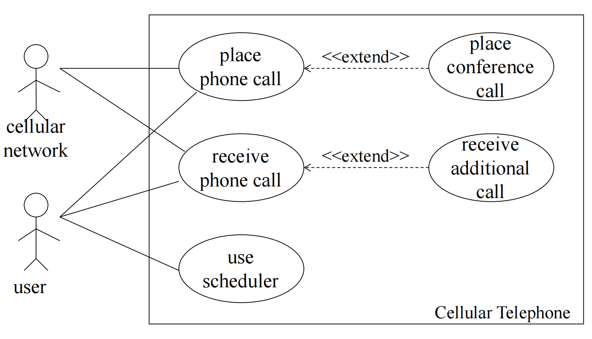
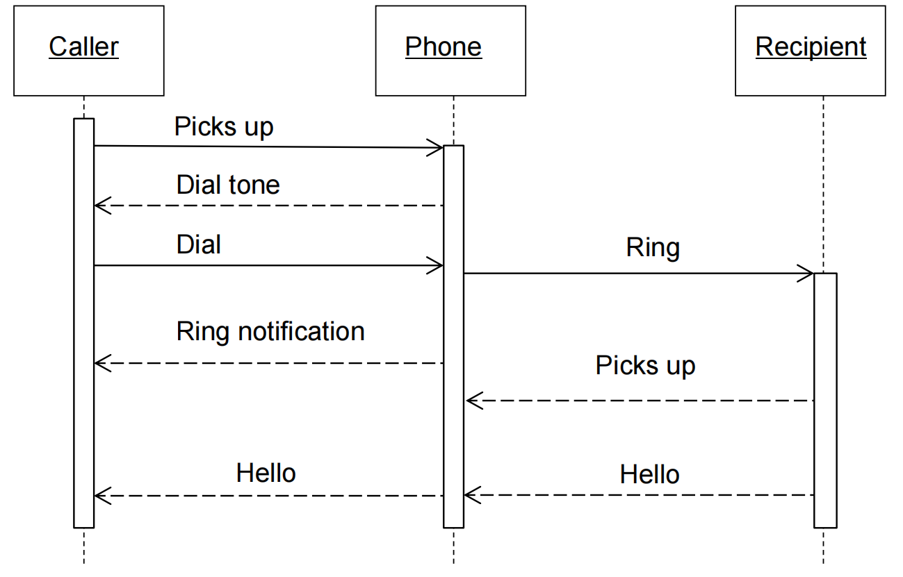

# Case Diagram

## Description

- A picture 

  一张图片

  - describes how actors relate to use cases

    描述 Actor 与用例的关系

  - and use cases relate to one another

    和用例彼此相关

- Diagrams are not essential

  图表不是必需的

- They are helpful in giving an overview, but only secondary in importance to the textual description

  它们有助于提供概述，但与文本描述相比，它们的重要性是次要的

- They do not capture the full information of the actual use cases

  它们不会捕获实际用例的完整信息

- In contrast, text **is** essential

  相比之下，文本 **是** 必不可少的

**Use Case Diagram Objective**

- Built in early stages of development 

  在开发的早期阶段构建

- Purpose 

  目的

  - Specify the context of a system 

    指定系统的上下文

  - Capture the requirements of a system 

    捕获系统的要求

  - Validate a systems architecture 

    验证系统架构

  - Drive implementation and generate test cases 

    推动实施并生成测试用例

  - Developed by analysts and domain experts 

    由分析师和领域专家开发

Example:

A standard form of use case diagram is defined in the Unified Modeling Language.

使用案例图的标准格式在 Unified Modeling Language 中定义。

## What is an Actor?

- Include all user roles that interact with the system

  包括与系统交互的所有用户角色

- Include system components only if they responsible for initiating/triggering a use case.

  仅当系统组件负责启动/触发用例时，才包含系统组件。

  - For example, a timer that triggers sending of an e-mail reminder

    例如，触发发送电子邮件提醒的计时器

- **primary** - a user whose goals are fulfilled by the system

  **primary** 系统实现其目标的用户

  - importance: define user goals

    重要性： 定义用户目标

- **supporting** - provides a service (e.g., info) to the system

  **supporting** -  为系统提供服务（例如，信息）

  - importance: clarify external interfaces and protocols 

    重要性：阐明外部接口和协议

- **offstage** - has an interest in the behavior but is not primary or supporting, e.g., government

  **offstage** - 对行为感兴趣，但不是主要或支持者，例如政府

  - importance: ensure all interests (even subtle) are identified and satisfied

    重要性：确保所有利益（即使是细微的）**都得到识别和满足**

### Finding Actors 参与者:

**Example 1:**

**External objects that produce/consume data:**

**产生/消费数据的外部对象：**

- Must serve as sources and destinations for data 

  必须用作数据的源和目标

- Must be external to the system

  必须在系统外部

- Human, Machines, External systems, Organizational Units, Sensors

**Example2:**

**Ask the following questions:  询问以下问题：**

- Who are the system’s primary users?

  谁是系统的主要用户？

- Who requires system support for daily tasks? 

  谁需要系统支持来完成日常任务？

- Who are the system’s secondary users? 

  谁是系统的二级用户？

- What hardware does the system handle? 

  系统处理哪些硬件？

- Which other (if any) systems interact with the system in question? 

  哪些其他 （如果有） 系统与相关系统交互？

- Do any entities interacting with the system perform multiple roles as actors? 

  是否有任何与系统交互的实体作为参与者扮演多个角色？

- Which other entities (human or otherwise) might have an interest in the system's output? 

  哪些其他实体（人类或其他实体）可能对系统的输出感兴趣？

## Elements of use case diagram  用例图的要素

### use case

- System function (process – automated or manual). 

  系统功能（过程 - 自动或手动）。

- Named by verb.Do something

  用动词命名。做点什幺

- **Each Actor must be linked to a use case, while some use cases may not be linked to actors.**

  **每个 Actor 都必须链接到一个用例，而某些用例可能未链接到 Actor。**

| USER/ACTOR            | USER GOAL = USER CASE                                     |
| --------------------- | --------------------------------------------------------- |
| Order Clerk           | Look up item availability; Create new order; Update order |
| Shipping clerk        | Record order fulfillment; Record back order               |
| Merchandising manager | Create special promotion; Produce catalog activity report |

### Other Details

## Linking Use Cases

- *Association* relationships 

  *关联* 关系

- *Generalization* relationships

  *泛化* 关系

  - One element (child) "is based on" another element (parent) 

    一个元素（子元素）“基于”另一个元素（父元素）

- *Include* relationships 

  *包括* 关系

  - One use case (base) includes the functionality of another (inclusion case) 

    一个用例 （base） 包含另一个 （包含案例） 的功能

  - Supports re-use of functionality 

    支持功能重用

- *Extend* relationships 

  *扩展* 关系

  - One use case (extension) extends the behavior of another (base) 

    一个用例（扩展）扩展了另一个用例（基本）的行为

### Use Case Levels

### 1. Generalization 归纳

- The child use case inherits the behavior and meaning of the parent use case.
  子用例继承了父用例的行为和含义。

- The child may add to or override the behavior of its parent.

  子项可以添加或覆盖其父项的行为。

more about generalization:

**Example:**

- The actor Order Registry Clerk can instantiate the general use case Place Order. 

- Place Order can also be specialized by the use cases Phone Order or Internet Order.

### 2. Include 包含

- The base use case explicitly incorporates the behavior of another use case at a location specified in the base.

  基本用例在基本用例中指定的位置显式合并了另一个用例的行为。

- The included use case never stands alone. It only occurs as a part of some larger base that includes it.

  包含的使用案例从来都不是孤立的。它仅作为包含它的某个更大基础的一部分出现。

**More about Include:**

Enables us to avoid describing the same flow of events several times by putting the common behavior in a use case of its own.

通过将常见行为放在其自己的用例中，使我们能够避免多次描述相同的事件流。

#### Include relationship 包含关系

- Include relationship – a standard case linked to a **mandatory** use case.

  包括关系 – 链接到 **matory** 使用案例的标准案例。

- Example: to *Authorize Car Loan* (standard use case),  a clerk must run *Check Client’s Credit History* (include use case). 

  示例：要 *授权汽车贷款*（标准用例），职员必须运行 *检查客户的信用记录*（包括用例）。

- The standard UC include**s** the mandatory UC (use the verb to figure direction arrow).

  标准 UC 包括强制性 UC（使用动词来表示方向箭头）。

- Standard use case can NOT execute without the include case **tight coupling** .

  标准用例在没有 include case **tight coupling** 的情况下无法执行。

#### Reading use case diagram with Include relationship

#### Include Example

### 3. Extend

- The base use case implicitly incorporates the behavior of another use case at certain points called extension points.

  基本用例隐式地合并了另一个用例在某些点（称为扩展点）的行为。

- The base use case may stand alone, but under certain conditions its behavior may be extended by the behavior of another use case.

  基本用例可以独立存在，但在某些情况下，其行为可能会因另一个用例的行为而扩展。

**More about Extend**

- Enables to model optional behavior or branching under conditions.

  启用以对条件下的可选行为或分支进行建模。

#### Extend Relationship

- **Extend** relationship – linking an **optional** use case to a standard use case.

  **扩展** 关系 – 将 **可选** 使用案例链接到标准使用案例。

- Example: *Register Course* (standard use case) may have *Register for Special Class* (extend use case) – class for non-standard students, in unusual time, with special topics, requiring extra fees…). 

  示例：*注册课程*（标准用例）可能有 *注册特殊课程*（扩展用例）——非标准学生的课程，在不寻常的时间，有特殊主题，需要额外费用......

- The optional UC extend**s** the standard UC

  可选的 UC 扩展了标准 UC

- Standard use case can execute without the extend case loose coupling.

  标准用例可以在没有扩展案例松散耦合的情况下执行。

#### Extend Example 1

### Relationships between Use Cases and Actors  用例和参与者之间的关系

Actors may be connected to use cases by associations, indicating that the actor and the use case communicate with one another using messages.

参与者可以通过关联连接到用例，这表明参与者和用例使用消息相互通信。

#### Example 1

# Sequence Diagram Tutorial  序列图教程

- A **use case** is a collection of interactions between external actors and a system

  **用例** 是外部参与者和系统之间交互的集合

- In UML, a use case is “the specification of a sequence of actions, including variants, that a system (or entity) can perform, interacting with actors of the system.” 

  在 UML 中，用例是“系统（或实体）可以执行的一系列操作（包括变体）的规范，与系统的参与者交互”。

- Typically each **use case** includes a primary **scenario** ( or main course of events) and zero or more secondary **scenarios** that are alternative courses of events to the primary **scenario**.

  通常，每个 **用例** 包括一个主要 **场景**（或事件的主要过程）和零个或多个次要 **场景**，它们是主要 **场景** 的替代事件过程。

- In RUP (Rational Unified Process), user requirements are captured as **use** **cases** that are refined into **scenarios**.

  在 RUP （Rational Unified Process） 中，用户需求被捕获为 **使用** **案例** ，这些案例被提炼为 **场景**。

- **Then**: A **scenario** is one path or flow through a **use case** that describes a sequence of events that occurs during one particular execution of a system.

  **然后**：**场景** 是通过 **用例** 的一条路径或流，它描述了在系统的特定执行期间发生的一系列事件。

## UML Sequence Diagrams  UML 串行图

- Describe the flow of messages, events, actions between objects

  描述对象之间的消息、事件、操作流

- Show concurrent processes and activations

  显示并发进程和激活

- Show time sequences that are not easily depicted in other diagrams

  显示其他图表中不易描述的时间串行

- Typically used during analysis and design to document and understand the logical flow of your system

  通常在分析和设计期间用于记录和了解系统的逻辑流程

**Emphasis on time ordering!** 

**强调时间排序**

## Sequence Diagram Key Parts  串行图关键部件

- **participant**: object or entity that acts in the diagram

  **参与者**：在图中操作的对象或实体

  - diagram starts with an unattached "found message" arrow

    图表以未附加的 “found message” 箭头开头

- **message**: communication between participant objects

  **message**：参与者对象之间的通信

- the **axes** in a sequence diagram:

  串行图中的 **axes**：

  - **horizontal**: which object/participant is acting

    **水平**：哪个对象/参与者正在操作

  - **vertical**: time (down -> forward in time)

    垂直”：时间（时间下降 -> 前进）

### Sequence Diagram (make a phone call)

## Representing Objects  表示对象

Squares with object type, optionally preceded by "*name* :"

具有对象类型的正方形，可选择以 “*name* ：” 开头

- write object's name if it clarifies the diagram

  write object's name（如果它阐明了图表）

- object's "life line" represented by dashed vert. line

  对象的“生命线”由虚线表示

## Messages Between Objects  对象之间的消息

**messages** (method calls) indicated by arrow to other object

**messages** （方法调用） 由箭头指示到其他对象

- write message name and arguments above arrow

  将消息名称和参数写在箭头上方

**messages** (method calls) indicated by arrow to other object

**messages** （方法调用） 由箭头指示到其他对象

- dashed arrow back indicates return

  虚线箭头向后表示返回

- different arrowheads for normal / concurrent (asynchronous) calls

  正常/并发（异步）调用的不同箭头

## Indicating method calls  指示方法调用

**activation**: thick box over object's life line; drawn when object's method is on the stack

激活 （Activation）：对象生命线上的厚框;当 Object 的方法位于堆栈上时绘制

- either that object is running its code,or it is on the stack waiting for another object's method to finish

  该对象正在运行其代码，或者它正在堆栈上等待另一个对象的方法完成

- nest activations to indicate recursion

  嵌套激活以指示递归

## Selection and loops

**frame**: box around part of diagram to indicate if or loop

**frame**：框框的一部分，用于指示 if 或 循环

- if -> (opt) [condition]

- if/else -> (alt) [condition], separated by horizontal dashed line

- loop -> (loop) [condition or items to loop over]

## Sequence diagram from use case scenario  用例场景中的串行图

## Why not just code it?

- Sequence diagrams can be somewhat close to the code level. 

  串行图可以在某种程度上接近代码级别。

- So why not just code up that algorithm rather than drawing it as a sequence diagram?

  那幺，为什幺不直接编写该算法，而不是将其绘制为串行图呢？

  - a good sequence diagram is still a bit above the level of the real code (not all code is drawn on diagram)

    一个好的串行图仍然比实际代码的水平高一点（并非所有代码都绘制在图上）

  - sequence diagrams are language-agnostic (can be implemented in many different languages

    串行图与语言无关（可以用许多不同的语言实现

  - non-coders can do sequence diagrams

    非编码人员可以制作串行图

  - easier to do sequence diagrams as a team

    作为一个团队更容易制作串行图

  - can see many objects/classes at a time on same page (visual bandwidth)

    可以在同一页面上同时看到多个对象/类（视觉带宽）

 