# Activity Diagram

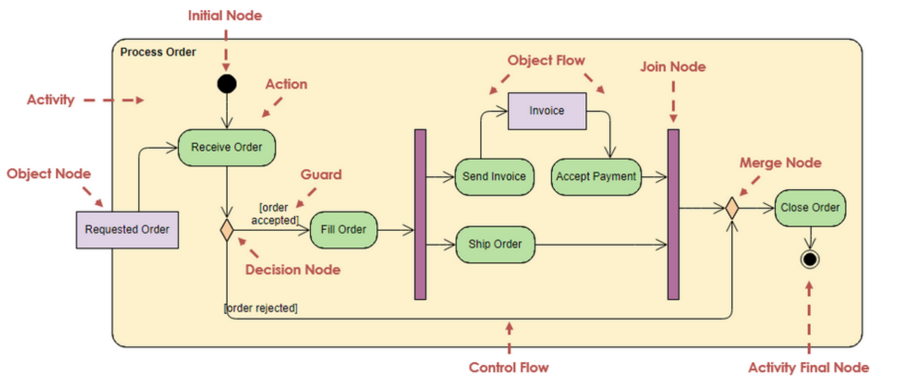

## Basic

- An **action** represents an operation, a step in a business process, or an entire business process.

  **操作** 表示一个操作、业务流程中的一个步骤或整个业务流程。

- Action is a named element which represents a **single atomic step within activity** i.e. that is **not further decomposed within the activity**.

  Action 是一个命名元素，它表示 Activity 中的 **单个原子步骤** 即 ** 在 Activity 中 ** 不进一步分解。

- Arrow represents the transition from one activity to the next

  箭头表示从一个 Activity 到下一个 Activity 的过渡

- Filled circle represent start, bull’s eye represent an endpoint

  实心圆圈代表起点，bull's eye 代表终点

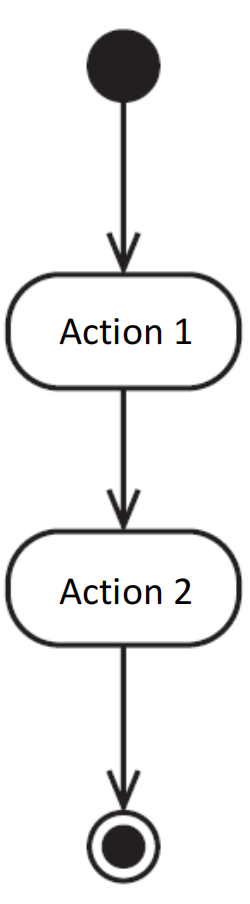

## Decision

- Both are valid

  两者都是有效的

- Label the condition with a squared bracket

  用方括号标记条件

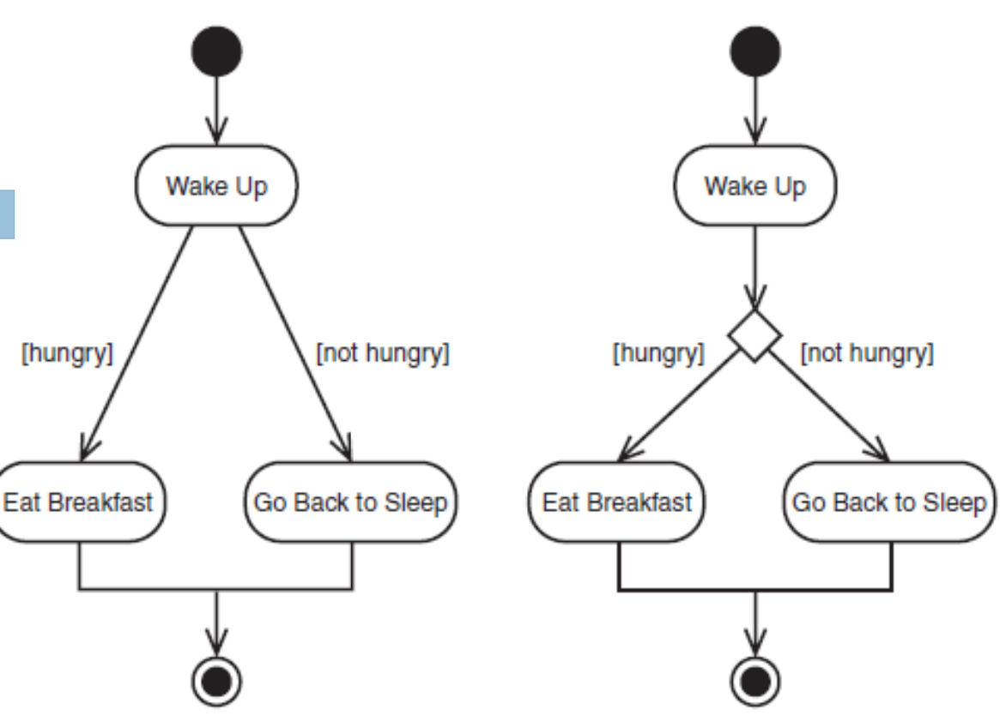

## Concurrent Paths  并发路径

- When two or more concurrent paths running at the same time

  当两个或多个并发路径同时运行时

- Use solid bold line to split the transition arrow into multiple concurrently executing paths

  使用粗实线将过渡箭头拆分为多个并发执行的路径

- Solid bold line also used to merge the concurrent p

  粗实线也用于合并并发 p

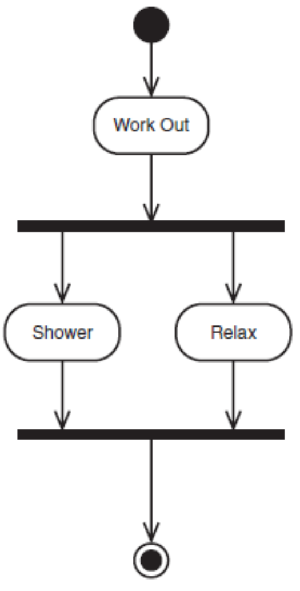

## Sending and Receiving Signal 发送和接收信号

- There will be situation when your process need to send or receive signal

  在某些情况下，您的进程需要发送或接收信号

- Convex polygon –sending signal / output event

  凸多边形 – 发送信号/输出事件

- Concave polygon –receiving signal / input event

  凹多边形 – 接收信号/输入事件

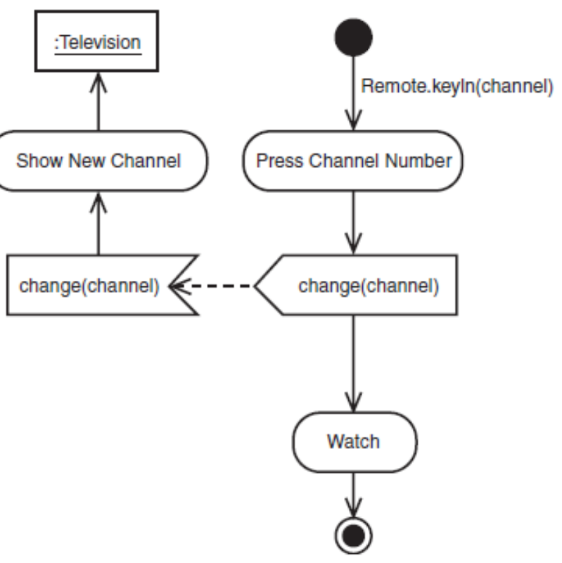

## Swimlanes  泳道

- Use swimlanes to show who responsible for each activity in a process

  使用 swimlanes 显示流程中每个活动的负责人

- Separate the diagram into parallel segments called swimlanes

  将图表分成称为泳道的平行段

- Each swimlane shows the name of a role at the top

  每个泳道的顶部都显示一个角色的名称

- Transitions can take place from one swimlane to another

  可以从一条泳道过渡到另一条泳道

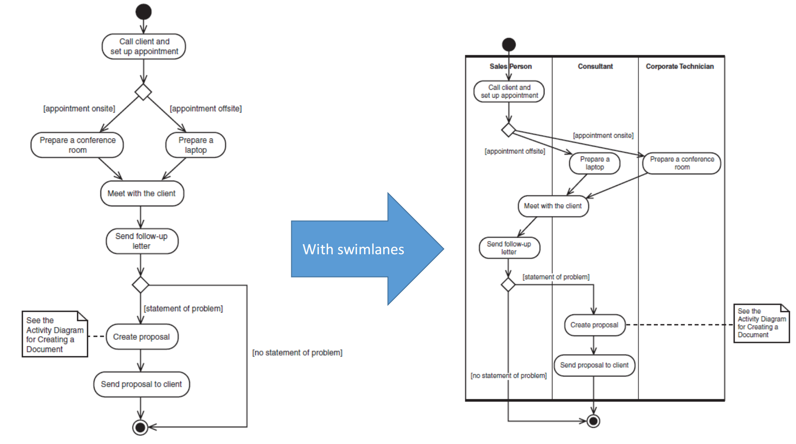

## Taking parameters  获取参数

- What is the problem with this notation?

  这种表示法有什幺问题呢？

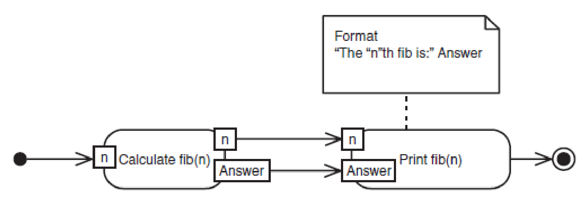

- Simplification 简化

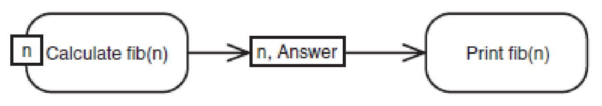

## Exception Handling  异常处理

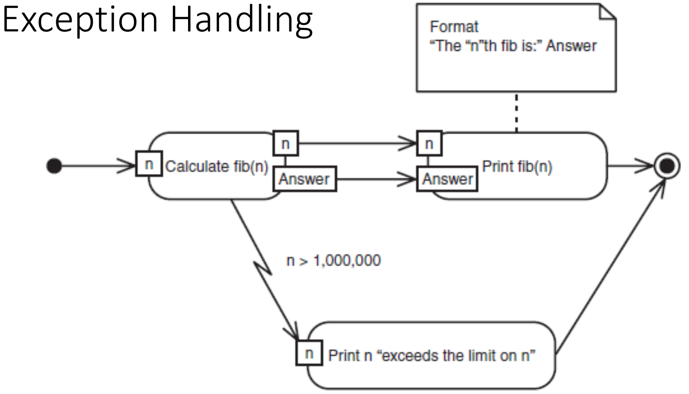

## Flow Final Node

- Not Activity Final Node

  Not Activity 最终节点

- UML 2.0 has an additional control node type called Flow Final that is used as an alternative to the Activity Final node to terminate a flow. 

  UML 2.0 有一个称为 Flow Final 的附加控制节点类型，该节点类型用作 Activity Final 节点的替代项，用于终止流。

- It is needed because in UML 2.0, when control reaches any instance of Activity Final node, the entire activity (including all flows) is terminated. The Flow Final simply terminates the flow to which it is attached.

  这是必需的，因为在 UML 2.0 中，当控制权到达 Activity Final 节点的任何实例时，整个活动（包括所有流）都会终止。Flow Final 只是终止它所附加到的流。

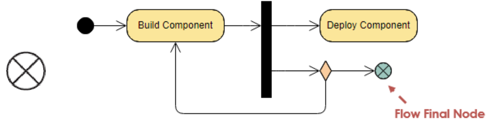

## Time Event  时间事件

- Time event flows when the time expression is true

  当时间表达式为 true 时，时间事件流

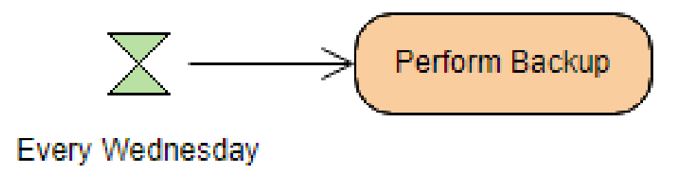

## Flow Final Node & Time Event - Example

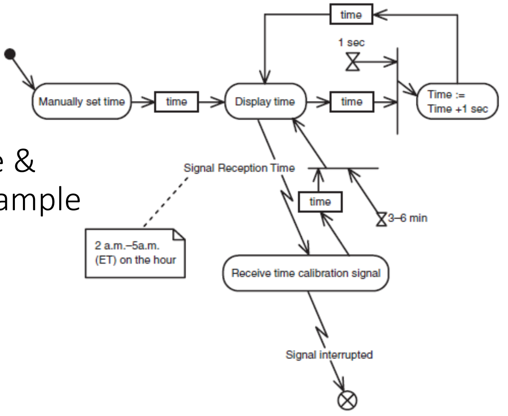

## Merge Node vs. Join Node

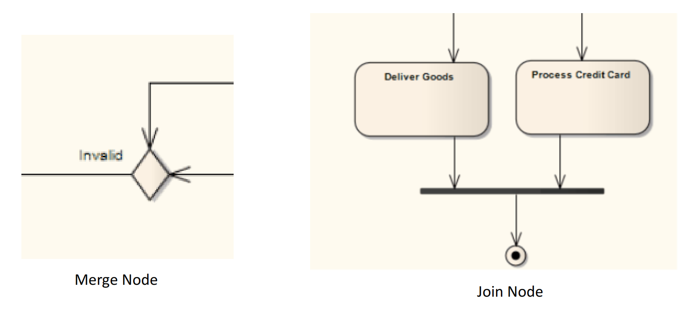

## Merge Example

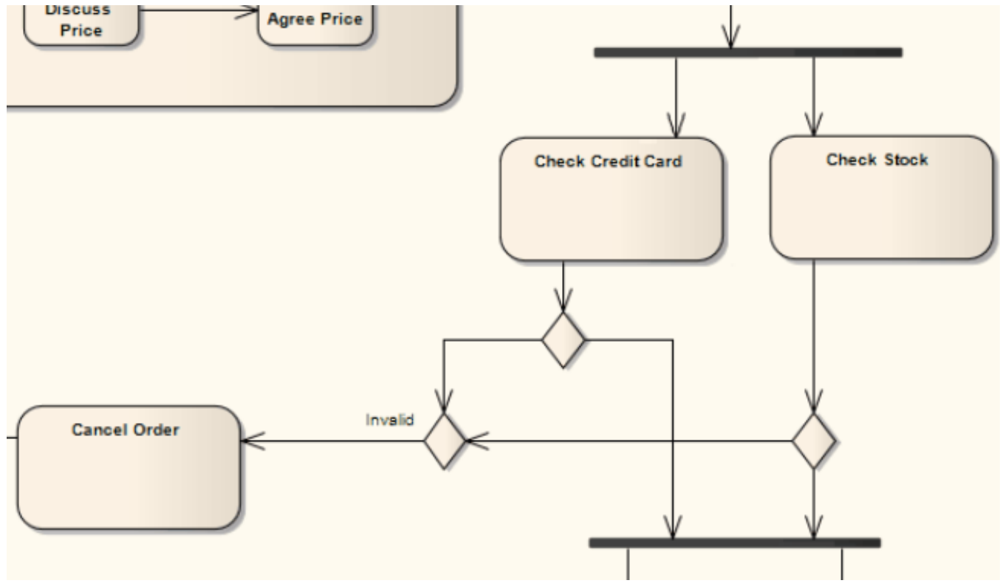

## Example

Think of the activities that go into using an office software suite to create a document. Open possible sequence of activities is:

想想使用 Office 软件套件创建文档的活动。打开可能的活动顺序为：

1. Open the word processing package.

   打开文本处理包。

2. Create a file

   创建文档

3. Save the file under a unique name within its directory

   将文档保存在其目录中的唯一名称下

4. Type the document

   键入文档

5. If graphics are necessary, open the graphics package, create the spreadsheet, and paste the spreadsheet into the document

   如果需要图形，请打开 Graphics 包，创建电子表格，然后将电子表格粘贴到文档中

6. Save the file

   保存文档

7. Print a hard copy of the document

   打印文档的硬拷贝

8. Print a hard copy of the document

   打印文档的硬拷贝

9. Exit the office suite

   退出办公套件

### Suggested Answer

- Modify the suggested answer to include the use of Convex polygon and Concave polygon for the “Print Hard Copy” action.

  修改建议的答案，以包括对“Print Hard Copy”（打印硬拷贝）操作使用 Convex polygon（凸多边形）和 Concave polygon（凹多边形）。

  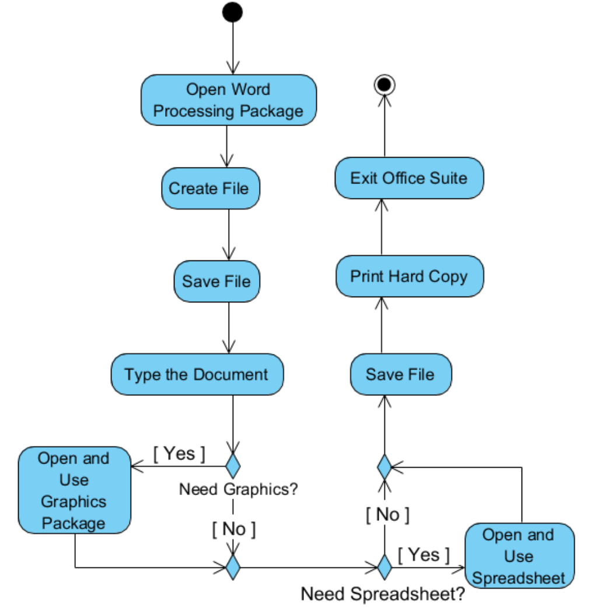

## Modified the Example

Using send signal and receive signal to achieve actual printing task  使用发送信号和接收信号实现实际打印任务

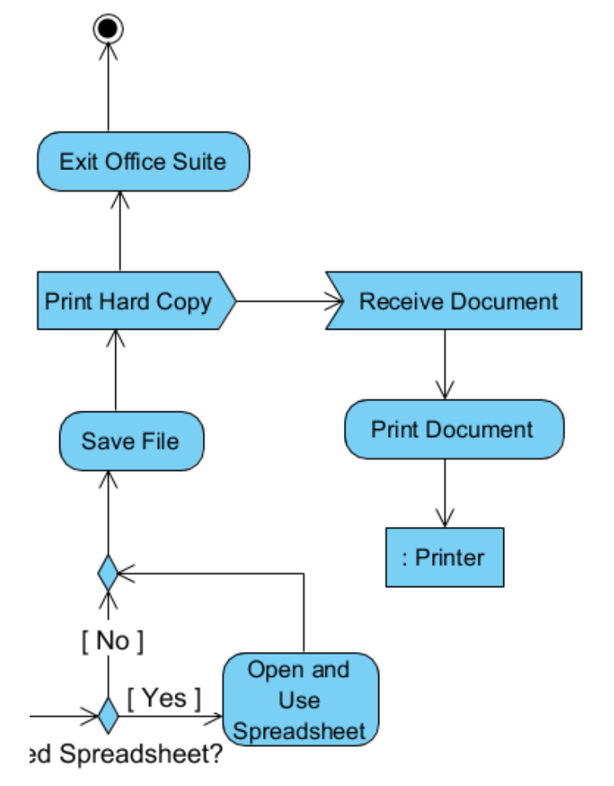