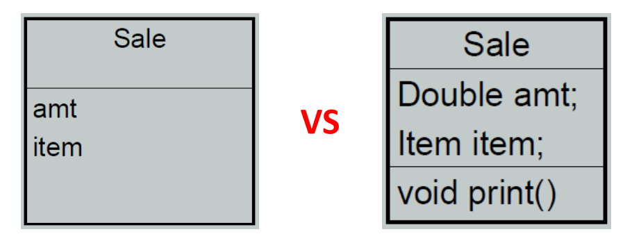
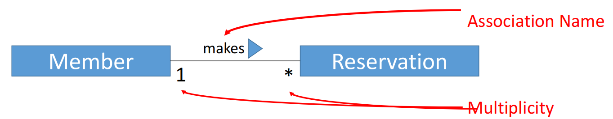
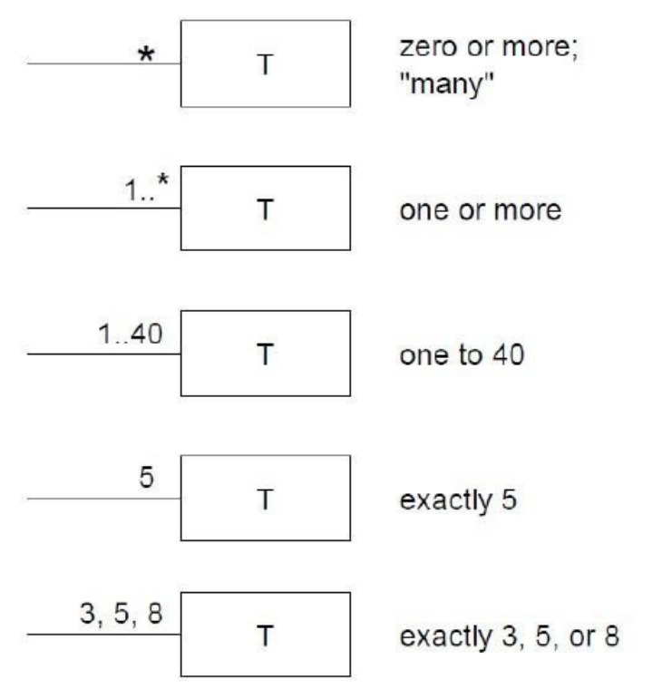
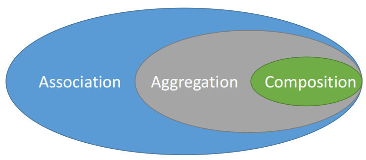
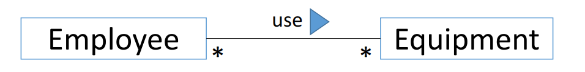
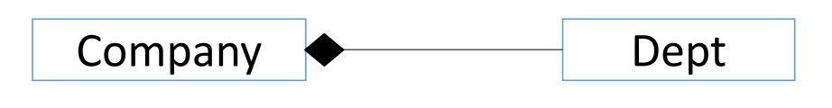
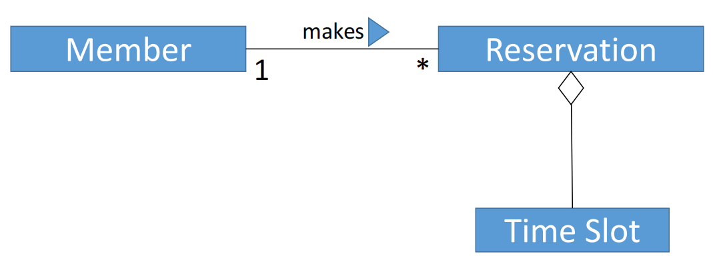

# Class Diagram 类图

类与类之间不能有多对多的关系

## What is a Domain Model? 什幺是域模型？

- Illustrates meaningful conceptual classes in problem domain 

  说明问题域中有意义的概念类

- Represents real-world concepts, not software components 

  表示实际概念，而不是软件组件

## Why domain model?  为什幺选择域模型

- Gives a conceptual framework of the things in the problem space 

  给出问题空间中事物的概念框架

- Helps you think – focus on semantics 

  帮助您思考 – 专注于语义

- It is a static view - meaning it allows us convey time invariant business rules 

  它是一个静态视图，这意味着它允许我们传达时间不变的业务规则

- Foundation for modelling 

  建模基础

- Based on the defined structure, we can describe the state of the problem domain at any time. 

  根据定义的结构，我们可以随时描述问题域的状态。

## Features of a domain model  域模型的功能

- **Domain classes** – each domain class denotes a type of object. 

  **Domain classes** – 每个域类表示一种对象类型。

- **Attributes** – an attribute is the description of a specified type in a domain class; each instance of the class separately holds a value. 

  **Attributes** – 属性是域类中指定类型的描述;类的每个实例单独包含一个值。

- **Associations** – an association is a relationship between two (or more) domain classes that describes links between their object instances. Associations can have roles, describing the multiplicity and participation of a class in the relationship. 

  **Associations** – 关联是两个（或多个）域类之间的关系，用于描述其对象实例之间的链接。关联可以具有角色，用于描述类在关系中的多重性和参与

## Steps to Create a Domain Model  创建域模型的步骤

- Identify candidate conceptual classes 

  确定候选概念类

- Draw them in a UML as a Class Diagram

  在 UML 中将它们绘制为类图

- Add associations necessary to record the relationships that must be retained 

  添加必要的关联以记录必须保留的关系

- Add attributes necessary for information to be preserved 

  添加要保留的信息所需的属性

## Domain classes 域类

- Each domain class denotes a type of object. It is a descriptor for a set of things that share common features. Classes can be:

  每个域类都表示一种对象类型。它是一组具有共同特征的事物的描述符。类可以是

  - External entities  外部实体

  - Things  事物

  - Occurrences or events  事件或事件

  - Roles  角色

  - Organizational units  组织单元

  - Places  地点

  - Structures  结构

## Identifying Classes  标识类

- Identify, classify, and define objects, ideas, and events as **Classes** by examining the usage scenarios developed in the use case model, glossary, and other diagrams.

  通过检查用例模型、词汇表和其他图表中开发的使用场景，将对象、想法和事件识别、分类和定义为 **类**。

- Methods:  方法

  - Reuse an existing domain model 

    重用现有域模型

  - Use a conceptual class category list

    使用概念类类别列表 

  - Identify noun phrases

    识别名词短语

## Conceptual Class Category List  概念类类别列表

- Physical or tangible objects
  - Register, Airplane

- Specifications, or descriptions of things 
  - Product Specification, Flight Description

- Places
  - Store, Airport

- Transactions
  - Sale, Payment, Reservation

- Transaction Items
  - Sales Line Items

- Roles
  - Cashier, Pilot

- Containers of other things
  - Store, Airplane, Cinema

- Things in a container
  - Item, Passenger, Audience

- Catalogs
  - Product Catalogs, Part Catalogs

- Organizations
  - Department, Class

## Identifying Noun Phrases  识别名词短语

- Classes are determined by underlining each noun or noun phrase and entering it into a simple table.

  通过为每个名词或名词短语添加下划线并将其输入到一个简单的表格中来确定类别。

- Synonyms should be noted. Beware of ambiguity.

  应注意同义词。当心歧义。

- If the class (noun) is required to implement a solution, then it is part of the solution space; otherwise, if a class is necessary only to describe a solution, it is part of the problem space.

  如果实现解决方案需要类 （名词），那幺它是解决方案空间的一部分;否则，如果一个类只是描述解决方案所必需的，那幺它是问题空间的一部分。

## Potential classes

| Potential Class          | General Classification              |
| ------------------------ | ----------------------------------- |
| Homeowner                | Role/external entity                |
| Sensor                   | External entity                     |
| Control panel            | External entity                     |
| Installation             | Event / occurence                   |
| System / security system | Thing                               |
| Number. type             | Not object, attributes of sensor    |
| mastrer password         | Thing                               |
| Telephone number         | Thing                               |
| Sensor event             | Event / occurence                   |
| Audible alarm            | External entity                     |
| Monitoring service       | Organization unit / external entity |

## Class selection characteristics  类选择特征

- Use six selection characteristics to select classes for the analysis model: 

  使用六个选择特征为分析模型选择类

  1. Retained information - if information about the class must be remembered so that the system can function

     如果必须记住有关类的信息，以便系统能够正常运行，则保留信息

  2. Needed services - the potential class must have a set of identifiable operation that is needed by the system to operate

     Needed services 潜在类必须具有系统操作所需的一组可识别操作

  3. Multiple attributes – a class with a single attribute may, in fact, be useful during design, but is probably better represented as an attribute of another class during the analysis activity

     多个属性 – 实际上，具有单个属性的类在设计过程中可能很有用，但在分析活动期间可能更好地表示为另一个类的属性

  4. Common attributes - A set of attributes can be defined for the potential class and these attributes apply to all instances of the class.

     公共属性 可以为潜在类定义一组属性，这些属性适用于该类的所有实例。

  5. Common operations - A set of operations can be defined for the potential class and these operations apply to all instances of the class.

     常见操作 可以为 potential 类定义一组操作，这些操作适用于该类的所有实例。

  6. Essential requirements - External entities that appear in the problem space and produce or consume information essential to the operation of the system

     基本要求 出现在问题空间中并生成或使用对系统运行至关重要的信息的外部实体

| Potential Class          | Selection Characteristics          |
| ------------------------ | ---------------------------------- |
| Homeowner                | Failed 1, 2                        |
| Sensor                   | Passed                             |
| Control panel            | Passed                             |
| Installation             | Passed                             |
| System / security system | Passed                             |
| Number. type             | Failed 3. attributes of the sensor |
| mastrer password         | Failed 3. attributes of the system |
| Telephone number         | Failed 3. attributes of the system |
| Sensor event             | Passed                             |
| Audible alarm            | Passed                             |
| Monitoring service       | Failed 1, 2                        |

## Class Names

- **Class Name** creates the vocabulary of our analysis

  **类名** 创建我们分析的词汇表 

  - Use nouns as class names 

    使用名词作为类名

  - Verbs can also be made into nouns 

    动词也可以变成名词

- Use pronounceable names 

  使用可发音的名称

  - If you cannot read aloud, it is not a good name 

    如果你不能大声朗读，那就不是一个好名字

- Use CamelCasing

  使用 CamelCasing

  - E.g., CardReader rather than CARDREADER or card_reader

    例如，使用 CardReader 而不是 CARDREADER 或 card_reader

- Avoid obscure, ambiguous abbreviations 

  避免晦涩、模棱两可的缩写 -

  - E.g., is TermProcess something that terminates or something that runs on a terminal? 

    例如，TermProcess 是终止的东西还是在终端上运行的东西？

- Try *not* to use digits within a name, such as CardReader2

  尝试 *not* 在名称中使用数字，例如 CardReader2

## Associations 关联

- Association is the relationship between 2 separate classes (“has a”).

- For example:
  - Member class is associated to Reservation.

## Association Name and Multiplicity  关联名称和重数

- Association can be further defined to indicate multiplicity.

  可以进一步定义关联以指示多重性。

- Multiplicity indicate the number of instances exist in an association

  multiplicity 表示关联中存在的实例数

- For example:

  - Each Member **makes** none or many Reservation; Each Reservation belongs to 1 Member

    每位会员 **进行** 无或多次预订;每次预订属于 1 位会员

- Use verbs as the Association Name

  使用动词作为关联名称

- Use arrow to aid the reading of the Association Name

  使用箭头帮助读取 Association Name

## Examples of Multiplicity  多重性示例

## Association, Aggregation, Composition  关联、聚合、组合

- **Composition** and **Aggregation** are the two forms of association (object made up of another object)

  **组合** 和 **聚合** 是两种形式的关联 （对象由另一个对象组成）

### Association 关联

- **Association 协会**

  - Relationship among objects

    对象之间的关系

  - The objects merely aware of each other

    对象只是彼此感知

  - One object can call the methods of the other object

    一个对象可以调用另一个对象的方法

  - The lifecycle of both objects are independent of each other

    这两个对象的生命周期彼此独立

### Aggregation  聚集

- **Aggregation**

  - Special type of Association

    特殊类型的关联

  - One object “containing” or “owning” the other object

    一个对象 “包含” 或 “拥有” 另一个对象

  - “has a” relationship

    “has a” 关系

  - The lifecycle of both objects are independent of each other

    这两个对象的生命周期彼此独立

  - E.g. If I close the Dept, the Employee can still exist

    例如，如果我关闭了 Dept，则 Employee 仍然可以存在

  - Employee can work for many departments (non-unique relationship)

    员工可以为多个部门工作（非唯一关系）

### Composition  组成

- **Composition**

  - A special type of Association, “Strong Association”• “part of” relationship

    一种特殊类型的关联，“强关联”• “部分”关系

  - The containing object, the Company, exclusively “own” the Dept object

    包含对象 Company 以独占方式 “拥有” Dept 对象

  - When containing object ended it’s lifecycle, the Dept object end with in

    当包含对象结束其生命周期时，Dept 对象以 in 结尾

## Implementation in Java  在 Java 中实现

- Association

  - One object aware of the other object by maintaining a reference to the object

    一个对象通过维护对另一个对象的引用来识别另一个对象

  - Creation and destruction of the reference object is not the major concern

    创建和销毁引用对象不是主要问题

- Aggregation

  - Containing object has the contained object(s) as one of the object properties

    包含对象 将包含的对象作为对象属性之一

  - **Not responsible** for the creation and destruction of the contained object(s)

    **不对所包含对象的创建和销毁负责**

- Composition

  - Containing object has the contained object(s) as one of the object properties

    包含对象 将包含的对象作为对象属性之一

  - **Responsible** for the creation and destruction of the contained object(s)

    **负责**创建和销毁所包含的对象

## Identifying relationship  识别关系

- member can make reservation

  会员可预订

- confirm his reservation for the preferred time slot

  确认他对首选时间段的预订

- reservation may consisting several time slots

  预订 可能由多个时间段组成

- The clerk will reserve a badminton court

  店员将预订一个羽毛球场

## Classes with relationship  类与关系

## Class Attribute  类属性

- Attributes describe an object

  属性描述对象

- Study use case to select the attribute belonging to a particular class

  研究用例，用于选择属于特定类的属性

  - What data items fully define the class in the domain problem?

    哪些数据项完全定义了域问题中的类？

  - What information needs to be retained for the system to function as required?

    需要保留哪些信息才能使系统按要求运行？

- According to the HomeSafe requirements, which attributes are required for the System class?

  根据 HomeSafe 要求，System 类需要哪些属性？

  - Master password

    主密码

  - Telephone number

    电话号码

  - Delay time

    延迟时间

  - Dialing delay, dialing retry

    拨号延迟、拨号重试

  - System status

    系统状态

- Some of the attributes are the compounded attribute that you may or may not want to break it down to elementary attributes, and vice versa.

  一些属性是复合属性，你可能想也可能不想把它分解成基本属性，反之亦然。

- In the modeling for requirement analysis, data type and access scope of the attributes are not required

  在需求分析的建模中，不需要属性的数据类型和访问范围

## Class operations  类操作

- Operations define the behavior of an object.

  操作定义对象的行为。

- 4 broad categories. Operations that:

  4 大类。以下操作：

  - manipulate data

    操作数据

  - Perform computation

    执行计算

  - Inquire about the state of an object

    查询对象的状态

  - Monitor an object for the occurrence of event

    监控对象是否发生事件

- Operations act on class attributes and/or associations

  操作作用于类属性和/或关联

## Identifying class operation  识别类操作

- examining the usage scenarios developed in the use case model.

  检查在用例模型中开发的使用场景。

- Verbs used in the scenario is the potential operations for classes.

  方案中使用的动词是类的潜在操作。

- Example: 

  - *arming* and *disarming* the system

    *布防* 和 *解除* 系统

  - PC is used to *program* and *configure* the system

    PC 用于编程和配置系统

- arm() and disarm() operations will be applied to the System class

  arm（） 和 disarm（） 操作将应用于 System 类

- Some operations are too broad and should be divided into sub-operations.

  有些操作过于宽泛，应该分为子操作。

- configure() operation for the system class can be divided into:

  system类的configure（）操作可以分为

  - configure()

  - addSensor()

- Decisions on which operations should each classes be responsible is the concern in the design phrase

  决定每个类应该负责哪些操作是设计短语中关注的问题

- Design concept involving modularity and coupling

  涉及模块化和耦合的设计理念

