# Design Concepts 设计概念

## Outline

1. Design in the Software Engineering (SE) context

2. Quality control in the design process

3. Design concepts

4. Elements in design model

## Design in the Software Engineering context  在软件工程环境中进行设计

### The Basics

Software Design encompasses the set of

软件设计包括

- **principles**

  **原则**

- **concepts**

  **概念**

- **practices**

  **实践**

that lead to the development of a high-quality system or product. 

从而开发出高质量的系统或产品。

The goal of design is to produce a model or representation that exhibits:

设计的目标是生成一个模型或表示，该模型或表示具有以下特点：

- **Firmness (no bugs)**

  **硬度(无bug)**

- **Commodity (useful or valuable)**

  **商品 （有用或有价值）**

- **Delight (pleasurable experience)**

  **愉悦（愉快的体验）**

### From Requirement to Design  从需求到设计

Software design is:

软件设计是：

- The last software engineering action within the modelling activity and sets the stage for construction (code generation and testing). 

  建模活动中的最后一个软件工程操作，为构建（代码生成和测试）设置舞台。

- A process to transform user requirements into some suitable form, which helps the programmer in software coding and implementation.

  将用户需求转换为某种合适形式的过程，这有助于进程员进行软件编码和实现。

<u>**Requirement -> Design -> Coding**</u>

- In practice requirements and design are **interrelated**. In particular, working onthe design often clarifies the requirements.

  在实践中，需求和设计是 **相互关联的**。特别是，进行设计通常会澄清需求。

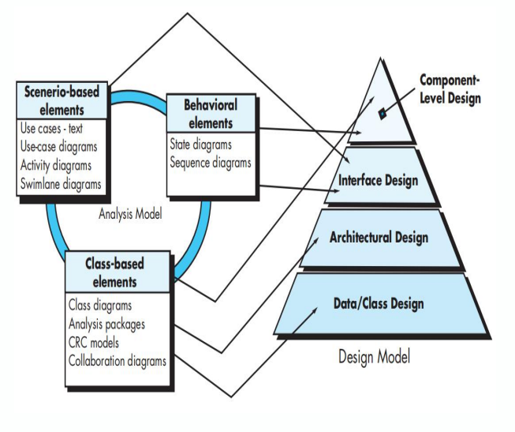

**Component-level design:** transforms structural elements of the software architecture into a procedural description of software components. 

**组件级设计**：将软件架构的结构元素转换为软件组件的进程描述。

**Interface design**: describes how the software communicates with systems that interoperate with it, and with humans who use it

**接口设计**：描述软件如何与与之互操作的系统以及使用它的人进行通信

**Architectural design**: defines the relationship between major structural elements of the software, the architectural styles and patterns that can be used to achieve the requirements defined for the system, and the constraints that affect the way in which architecture can be implemented. 

**架构设计**：定义软件的主要结构元素之间的关系，可用于实现为系统定义的需求的架构样式和模式，以及影响架构实现方式的约束。

**Data design/class design:** transforms class models into design class realizations and there requisite data structure required to implement it.

**数据设计/类设计：** 将类模型转换为设计类实现，以及实现它所需的必要数据结构。

## Quality control in the design process  设计过程中的质量控制

### The Goal of it

- Three goals of a design in good quality:

  高质量设计的三个目标：

  - The design should **implement all of the explicit requirements** contained in the requirements model, and it must accommodate all of the implicit requirements desired by stakeholders.

    设计应该 **实现需求模型中包含的所有显式需求**，并且它必须容纳利益相关者所期望的所有隐含需求。

  - The design should be a **readable, understandable guide** for those who generate code and for those who test and subsequently support the software. 

    该设计应该是 **可读、可理解的指南**，适用于生成代码的人以及测试并随后支持软件的人。

  - The design should provide **a complete picture of the software**, addressing the data, functional, and behavioral domains from an implementation perspective

    设计应提供 **软件的完整图片**，从实现的角度处理数据、功能和行为领域

### Why it matters 为什么重要

- The importance of software design can be stated with a single word – **quality**. 

  软件设计的重要性可以用一个词来表达——**质量**。

  - **Defect Prevention:** Implementing quality control early in the design phase helps identify and address potential issues before they go into later stages of development. 

    **缺陷预防：** 在设计阶段的早期实施质量控制有助于在潜在问题进入开发后期阶段之前识别和解决它们。

  - **Cost Efficiency:** Fixing defects during the design phase is generally much less expensive than addressing them after coding or, worse, after deployment. \

    **成本效益：** 在设计阶段修复缺陷通常比在编码后或更糟糕的是在部署后解决缺陷的成本要低得多。

  - **Improved User Satisfaction:** A well-designed software product that undergoes quality control is more likely to meet user needs and expectations. 

    **提高用户满意度：** 经过质量控制且设计精良的软件产品更有可能满足用户的需求和期望。

  - **AND:** Enhanced Reliability, Compliance and Standards Adherence,Documentation and Traceability and so on

    **以及：** 增强的可靠性、合规性和标准遵守性、文档和可追溯性等

### What to be considered

- Five quality attributes (FURPS):

  五个质量属性 （FURPS）：

  - **Functionality** is assessed by evaluating the feature set and capabilities of the program, the generality of the functions that are delivered, and the security of the overall system. 

    **功能** 通过评估进程的功能集和功能、所交付功能的通用性以及整个系统的安全性来评估。

  - **Usability** is assessed by considering human factors, overall aesthetics, consistency, and documentation. 

    **可用性** 是通过考虑人为因素、整体美学、一致性和文档来评估的。

  - **Reliability** is evaluated by measuring the frequency and severity of failure, the accuracy of output results, the mean-time-to-failure (MTTF), the ability to recover from failure, and the predictability of the program. 

    **可靠性** 是通过测量故障的频率和严重性、输出结果的准确性、平均故障时间 （MTTF）、从故障中恢复的能力以及进程的可预测性来评估的。

  - **Performance** is measured using processing speed, response time, resource consumption, throughput, and efficiency. 

    **性能** 是使用处理速度、响应时间、资源消耗、吞吐量和效率来衡量的。

  - **Supportability** combines extensibility, adaptability, and serviceability. These three attributes represent a more common term, maintainability— and in addition, testability, compatibility, configurability, the ease with which a system can be installed, and the ease with which problems can be localized

    **可支持性** 结合了可扩展性、适应性和可服务性。这三个属性代表了一个更常见的术语：可维护性，此外还有可测试性、兼容性、可配置性、系统安装的容易程度，以及问题定位的容易程度

### Guidelines 指导

- Eight technical criteria for good design:

  优秀设计的八大技术标准：

  1. A design should exhibit an architecture that (1) has been created using recognizable architectural styles or patterns, (2) is composed of components that exhibit good design characteristics, and (3) can be implemented in an evolutionary fashion, thereby facilitating implementation and testing. 

     设计应展示的架构满足以下条件：（1） 使用可识别的架构样式或模式创建，（2） 由表现出良好设计特征的组件组成，以及 （3） 可以以渐进的方式实现，从而促进实现和测试。

  2. A design should be modular; that is, the software should be logically partitioned into elements or subsystems. 

     设计应该是模块化的;也就是说，软件应该在逻辑上划分为元素或子系统。

  3. A design should contain distinct representations of data, architecture, interfaces, and components. 

     设计应包含数据、架构、接口和组件的不同表示形式。

  4. A design should lead to data structures that are appropriate for the classes to be implemented and are drawn from recognizable data patterns.

     设计应该产生适合于要实现的类的数据结构，并从可识别的数据模式中绘制

  5. A design should lead to components that exhibit independent functional characteristics. 

     设计应导致组件表现出独立的功能特征。

  6. A design should lead to interfaces that reduce the complexity of connections between components and with the external environment. 

     设计应导致能够降低组件之间以及与外部环境连接复杂性的接口。

  7. A design should be derived using a repeatable method that is driven by information obtained during software requirements analysis. 

     设计应使用可重复的方法派生，该方法由软件需求分析期间获得的信息驱动。

  8. A design should be represented using a notation that effectively communicates its meaning.

     设计应使用能够有效传达其含义的符号来表示。

## Design Concepts  设计概念

### What it is

The idea/principles the **foundational ideas and principles that guide the creation and organization of software systems**

理念/原则 指导软件和组织软件系统的 **基本理念和原则**

It encompasses the guiding principles and methodologies used to **ensure the software meets functional requirements, maintains high quality, and adapts to future changes**. 

它包含用于 **确保软件满足功能要求、保持高质量并适应未来变化** 的指导原则和方法。 

**It inform decisions** related to architecture, component interactions, and user experience, ultimately shaping the system's effectiveness and usability

它为与架构、组件交互和用户体验相关的决策提供信息，最终塑造系统的有效性和可用性

### Key ones 要点

- Some general design concepts:

  一些一般的设计概念：

  - Abstraction

    抽象化

  - Modularity

    模块性

  - Functional Independence

    功能独立性

    - Coupling

      耦合

    - Cohesion

      内聚力

  - Object-oriented design

    面向对象的设计

### Abstraction 抽象化

- Abstraction is a design concept that focuses on simplifying complex systems by highlighting essential features while hiding unnecessary details. 

  抽象是一种设计概念，它侧重于通过突出基本功能同时隐藏不必要的细节来简化复杂系统。

- The higher the level, the less the detail. 

  级别越高，细节越少。

- At the highest level of abstraction, a concept/approach/solution is stated in broad terms using the language of the problem environment. 

  在最高抽象级别，概念/方法/解决方案使用问题环境的语言以广义术语表示。

- At lower levels of abstraction, a more detailed description of the concept/approach/solution is provided

  在抽象的较低层次上，提供了概念/方法/解决方案的更详细描述

- From high to low: A car -> a Xiaomi Su7 -> a Xiaomi Su7 Ultra

  从高到低：一辆车 -> 一辆小米 Su7 -> 一辆小米 Su7 Ultra

#### Data Abstraction 数据抽象

- **A data abstraction** is a named collection of data that describes a data object.

  **数据抽象** 是描述数据对象的命名数据集合。

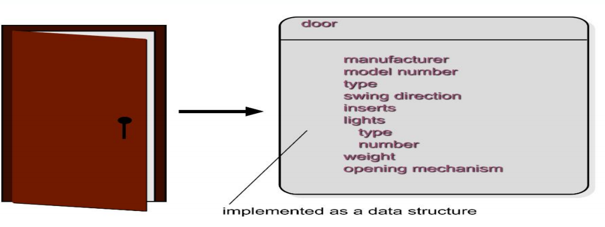

#### Procedural Abstraction 过程抽象

- **A procedural abstraction** refers to a sequence of instructions that have a specific and limited function. The name of a procedural abstraction implies these functions, but specific details are omitted.

  **过程抽象** 是指具有特定和有限功能的指令串行。过程抽象的名称暗示了这些函数，但省略了具体细节。

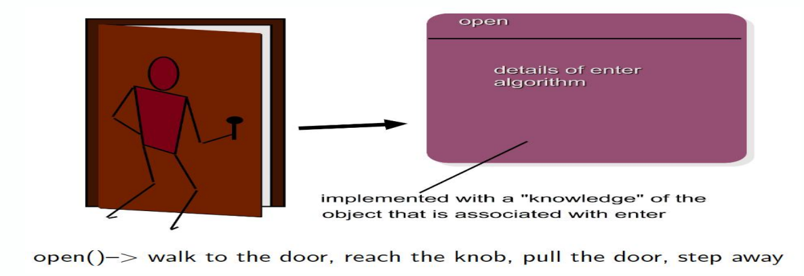

### Modularity 模块化

- Modular design helps us to better organize complex system. 

  模块化设计帮助我们更好地组织复杂的系统。

- It basically clusters similar or relative functions together, sets up boundaries and provides interfaces for communication

  它基本上将相似或相对的功能聚集在一起，设置边界并提供通信接口

- mobile phone as an complex system that is modularized

  手机是一个模块化的复杂系统

- modularity increases manufacture efficiency and save time

  模块化提高了制造效率并节省了时间

- Modularity allows the possibility of the development of system parts to be carried out independently of each other, therefore reducing development time. 

  模块化允许系统部件的开发彼此独立进行，从而缩短开发时间。

- However, too many modules in a system increase the complexity of modules integration

  但是，系统中过多的模块会增加模块集成的复杂性

- Given the same set of requirements, more modules means smaller individual size. However, as the number of modules grows, the effort (cost) associated with integrating the modules also grows. These characteristics lead to a total cost or effort curve shown in the figure.

  在相同的要求下，更多的模块意味着更小的单个尺寸。但是，随着模块数量的增加，与集成模块相关的工作量（成本）也会增加。这些特征导致总成本或工作量曲线如图所示。

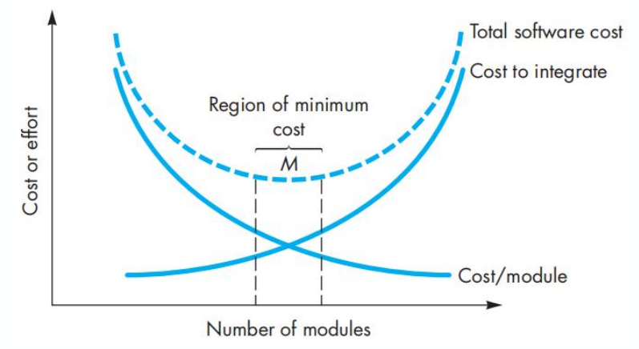

### Function Independence 功能独立性

- **Functional Independence** refers to the degree to which a software module or component can operate independently of other modules or components within a system. It is characterized by two key attributes:

  **功能独立性** 是指软件模块或组件可以独立于系统内的其他模块或组件运行的程度。它的特点是两个关键属性：

  - **Low Coupling:** The module has minimal dependencies on other modules, allowing it to function without needing to interact heavily with external components. This means that changes in one module are less likely to impact others

    **低耦合性：** 该模块对其他模块的依赖性最小，使其无需与外部组件进行大量交互即可运行。这意味着一个模块中的更改不太可能影响其他模块

  - **High Cohesion:** The module is focused on a single, well-defined task or responsibility, ensuring that its internal elements work together closely and contribute to a common purpose.

    **高凝聚力：** 该模块专注于一个单一的、定义明确的任务或责任，确保其内部元素紧密协作并为共同目标做出贡献。

#### Coupling 耦合

- Coupling refers to **the degree of interdependence between different modules or components**. 

  耦合是指 **不同模块或组件之间的相互依赖程度**。

- To solve and modify a module separately, we would like the modules to be **loosely coupled**

  要分别求解和修改模块，我们希望模块是 **松散耦合的**

- Low coupling means that modules are largely independent of each other and often interact through well-defined interfaces.

  低耦合意味着模块在很大程度上彼此独立，并且通常通过定义明确的接口进行交互。

- **Tight coupling (bad!)**

  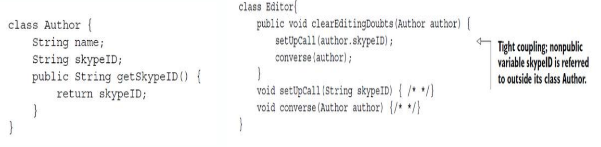

  What happens, if a programmer changes the name of the variable **skypeID** in class Author to **skypeName**?

- **Solution** 

  Use the public method getSkypeID() in class Editor (changes in bold)

  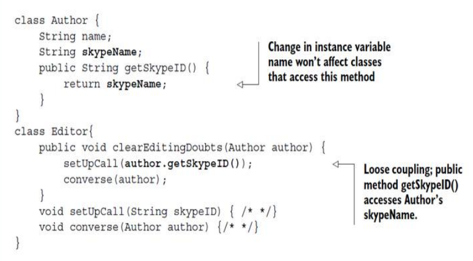

#### Cohesion 内聚力

- Cohesion refers to **how closely related and focused** the responsibilities of a single module or component are.  

  内聚性指的是单个模块或组件的职责之间的密切关系和集中程度。

- High cohesion within a module **also** contributes to functional independence by ensuring that the module is focused and self- contained. It usually means that the elements within a module work together to **perform a single task or function**. 

  模块内的高内聚性 **还** 通过确保模块集中和自包含来促进功能独立性。这通常意味着模块中的元素协同工作以 **执行单个任务或功能**。

- **Types:**

  - Method Cohesion

    方法内聚

  - Class Cohesion

    类凝聚力

  - Module Cohesion

    模块内聚

  - Component Cohesion

    组件内聚

- **Method cohesion:** A method that implements a clearly defined function, and all statements in the method contribute to implementing this function.

  **方法内聚：** 实现明确定义的函数的方法，并且该方法中的所有语句都有助于实现此函数。

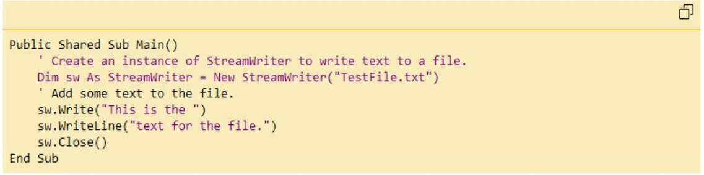

- The above method performs a sequence of tasks such as opening a file, write to a file, and close a file. 

  上述方法执行一系列任务，例如打开文档、写入文档和关闭文档。

- How about adding a function **sw.Read()**?

  添加一个函数 **sw 怎幺样。Read（）**？

- **Class cohesion**

  - A high class cohesion is the class that implements a single concept or abstraction with all elements contributing toward supporting this concept. 

    高类内聚是实现单个概念或抽象的类，其中所有元素都有助于支持此概念。

  - Highly cohesive classes are usually more easily understood and more stable.

    高度内聚的类通常更容易理解且更稳定。

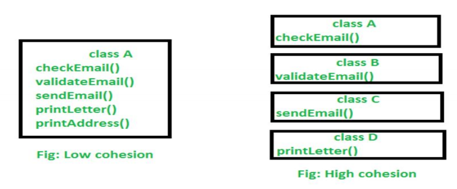

### Object Orient Design 面向对象设计

- Object-Oriented Design is a software design approach that **organizes a system as a collection of interacting objects**, each representing an instance of a class within a specific domain. 

  面向对象设计是一种软件设计方法，它将系统组织为交互对象的集合，每个对象代表特定域中一个类的实例。

- **These objects encapsulate both data (attributes) and behavior (methods)**, promoting modularity, reusability, and scalability.

  这些对象封装了数据（属性）和行为（方法），促进了模块化、可重用性和可伸缩性。

- A case: We want to create a system for managing books in a library. This system should:

  案例：我们想创建一个管理系统来管理图书馆中的书籍。该系统应该：

  1. Allow users to search for and borrow books. 

     允许用户搜索和借阅书籍。

  2. Track which books are borrowed and which are available. 

     跟踪哪些书是借的，哪些书是可用的

  3. Allow administrators to add new books to the library. 

     允许管理员向书库添加新书籍。

- We do:

  1. **Identify Classes** (i.e., Book, User, Library)

     **识别类**（即书籍、用户、图书馆） 2.

  2. **Define Relationships** (e.g., A Library contans many Book objects, etc)

     **定义关系**（例如，A Library 包含许多 Book 对象等）

  3. **Define Attributes and Methods** (e.g., A Book object should have attributes like Title, author, etc; it should also have methods including  borrow(), returnBook(), etc)

     定义属性和方法（例如，Book 对象应该具有 Title、author 等属性;它还应该具有包括 borrow（）、returnBook（） 等在内的方法）

- Object-Oriented Design Principles

  面向对象设计原则

  - **Encapsulation:** Each class encapsulates its data and methods, allowing controlled access to its attributes (e.g.,  Book controls access to isAvailable). 

    **封装**：每个类都封装了其数据和方法，允许对其属性进行受控访问（例如，Book 控制对 isAvailable 的访问）。

  - **Inheritance:** In a more complex system, we might have classes like DigitalBook and PhysicalBook that inherit from Book. 

    **继承：** 在一个更复杂的系统中，我们可能有像 DigitalBook 和 PhysicalBook 这样的类，它们继承自 Book。

  - **Polymorphism:** Different types of books or users might override methods for specific behaviors, if necessary.

    **多态性：** 如有必要，不同类型的书籍或用户可能会覆盖特定行为的方法。

## Elements in Design Model  设计模型中的元素

### What is it

We can see the **Design Model** as a detailed framework, a set of approaches, that guide the development of a software system from analysis to implementation. It include the following elements (aspects):

我们可以将 **设计模型** 视为一个详细的框架，一组方法，指导软件系统从分析到实施的开发。它包括以下要素 （方面）：

- Data design elements

  数据设计元素

- Architectural Design Elements

  架构设计元素

- Interface Design Elements

  界面设计元素

- Component-Level Design Elements

  组件级设计元素

- Deployment-Level Design Elements

  部署级设计元素

### Data Design Elements  数据设计元素

- Like other software engineering activities, **data design** (sometimes referred to as data architecting) creates a model of data and/or information that is represented at a high level of abstraction (the customer/user’s view of data). 

  与其他软件工程活动一样，**数据设计**（有时称为数据架构）创建一个数据和/或信息模型，该模型以高抽象级别（客户/用户的数据视图）表示。

- It is then refined progressively into more implementation-specific representations that can be processed by the computer-based system, based on the following level (e.g., e-commerce system):

  然后，它逐渐细化为更多特定于实现的表示形式，这些表示可以由基于计算机的系统基于以下级别（例如，电子商务系统）进行处理：

- **Business level:** Define high-level goals (increase sales, optimize inventory, enhance satisfaction) and identify required data (product, customer, order, inventory).

  **业务层面：** 定义高级目标（增加销售额、优化库存、提高满意度）并确定所需数据（产品、客户、订单、库存）。 

- **Application level:** Design data usage for core functionality (product catalog, order processing, inventory management, recommendation engine). 

  **应用进程级别：** 为核心功能（产品目录、订单处理、库存管理、推荐引擎）设计数据使用。

- **Program-component level:** Implement data structures (Product, Customer, Order, Inventory, RecommendationEngine - all as **Var**)

  **进程组件级别：** 实现数据结构（Product、Customer、Order、Inventory、RecommendationEngine 全部为 **Var**）

### Architectural Design Elements  架构设计元素

- The architectural design for software is the equivalent to the floor plan of a house. The floor plan depicts the overall layout of the rooms; their size, shape, and relationship to one another; and the doors and windows that allow movement into and out of the rooms. 

  软件的架构设计相当于房屋的平面图。平面图描绘了房间的整体布局;它们的大小、形状和彼此之间的关系;以及允许进出房间的门窗。

- The floor plan gives us an overall view of the house.  Architectural design elements give us an overall view of the software. 

  平面图为我们提供了房子的整体视图。 建筑设计元素为我们提供了软件的整体视图。

- **Three sources:**  

  - Information about the application domain for the software to be built;

    有关要构建的软件的应用进程域的信息;

  - Specific requirements model elements such as use cases or analysis classes, their relationships and collaborations for the problem at hand; and

    特定的需求模型元素，如用例或分析类，它们之间的关系和手头问题的协作；和

  - The availability of architectural styles and patterns

    架构样式和模式的可用性

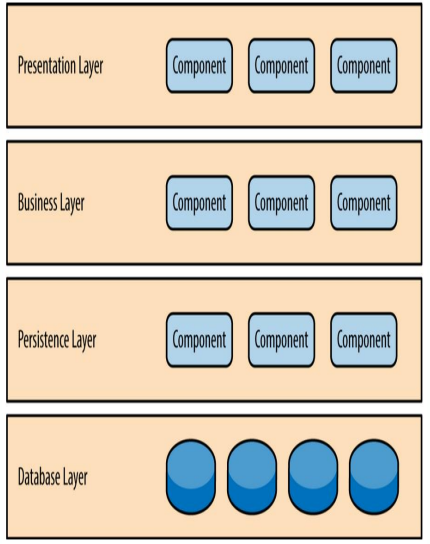

### Interface Design Elements 接口设计元素

- The interface design for software is similar to a set of detailed drawings (and specifications) for the doors, windows, and external utilities of a house. 

  软件的界面设计类似于房屋的门、窗和外部公用设施的一组详细图纸（和规格）。

- The interface design elements for software depict information flows into and out of a system and how it is communicated among the components defined as part of the architecture. 

  软件的界面设计元素描述了流入和流出系统的信息，以及它如何在定义为架构一部分的组件之间进行通信。

- **Three important elements:**

  **三大重要要素：**

  - The user interface (UI),

    用户界面 （UI）、

  - External interfaces to other systems, devices, networks, or other producers or consumers of information, and

    与其他系统、设备、网络或其他信息生产者或消费者的外部接口，以及

  - Internal interfaces between various design components.

    各种设计组件之间的内部接口。

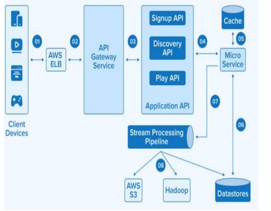

### Component-Level Design Elements 组件级设计元素

- The component-level design for software is the equivalent to a set of detailed drawings (and specifications) for each room in a house. 

  软件的组件级设计相当于房屋中每个房间的一组详细图纸（和规格）。

- The component-level design for software fully describes the internal detail of each software component (e.g., an object). 

  软件的组件级设计完全描述了每个软件组件（例如，对象）的内部细节。

- In software engineering, a component is represented in UML diagrammatic form. 

  在软件工程中，组件以 UML 图的形式表示。

- The design details of a component can be modeled at many different levels of abstraction

  组件的设计细节可以在许多不同的抽象级别进行建模

  - e.g., Flowchart or box diagram -> detailed procedural flow for a component. 

    例如，流程图或箱形图>组件的详细过程流程。

  - Or, the figure on the right

    或者，右侧的数字

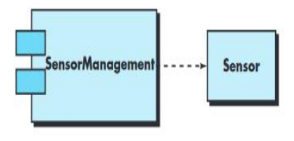

- Deployment-level design elements indicate how software functionality and sub-systems will be allocated within the physical computing environment that will support the software

  部署级设计元素指示如何在支持软件的物理计算环境中分配软件功能和子系统

  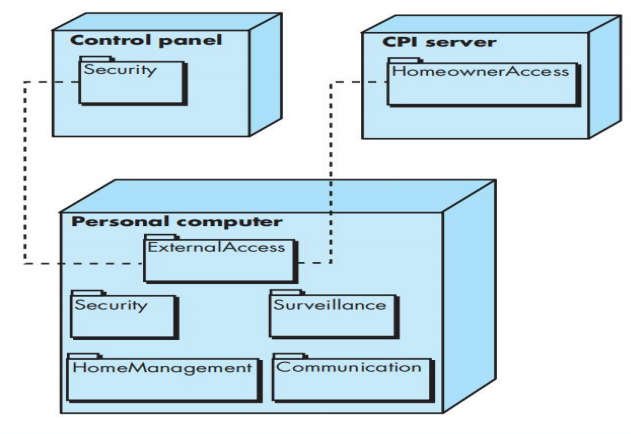