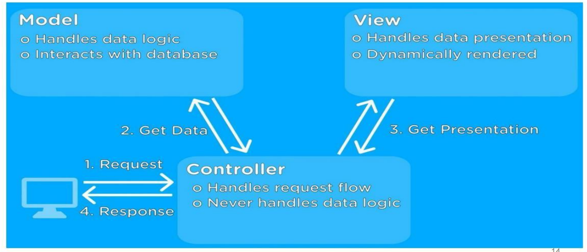

# Software Design 软件设计模式

这门课主要关注于Architecture in small (不太关注Architecture in large)

在创建四中不同的view图像时，都需要考虑-People，-Hardware，-Software，-Network

## Outline

1. Architecture Design

   架构设计

2. Component-level Design

   组件级设计

3. User Interface Design

   用户界面设计

## Architecture Design 架构设计

### 1.1 The basics

- Architectural design is concerned with understanding how a system should be organized and designing the overall structure of the system.

  架构设计涉及理解系统应该如何组织和设计系统的整体结构。

- It is the first stage in the software design process, and the critical link between design and requirements engineering.

  它是软件设计过程的第一阶段，也是设计和需求工程之间的关键环节。

- It identifies the main structural components in a system and the relationships between them.

  它标识系统中的主要结构组件以及它们之间的关系。

- The output of this design process is a description of the software architecture.

  此设计过程的输出是软件体系结构的描述。

- Design software architectures at **two levels of abstraction:**

  在 **两个抽象级别设计软件架构：**

  - **Architecture in the small**(主要关注) is concerned with the architecture of individual programs.  At this level, we are concerned with the way that an individual program is decomposed into components. This chapter is mostly concerned with program architectures. 

    **小型架构** 关注单个进程的架构。 在这个级别上，我们关注的是单个进程分解为组件的方式。本章主要关注进程体系结构。

  - **Architecture in the large** is concerned with the architecture of complex enterprise systems that include other systems, programs, and program components. These enterprise systems are distributed over different computers, which may be owned and managed by different companies

    **大型架构** 关注复杂企业系统的架构，包括其他系统、进程和进程组件。这些企业系统分布在不同的计算机上，这些计算机可能由不同的公司拥有和管理

### 1.2 Why it is matter

- Software architecture affects performance, robustness, disreputability, and maintainability

  软件架构会影响性能、健壮性、声誉和可维护性

- Individual component – implement functional requirements

  单个组件实现功能需求

- System architecture – fulfill non-functional requirement

  系统架构 – 满足非功能性需求

- Stakeholder communication

  利益相关者沟通

  - Architecture may be used as a focus of discussion by system stakeholders. 

    架构可以用作系统利益相关者讨论的焦点。

- System analysis

  系统分析

  - Means that analysis of whether the system can meet its non-functional requirements is possible. 

    意味着可以分析系统是否能够满足其非功能性需求。

- Large-scale reuse

  大规模再利用

  - The architecture may be reusable across a range of systems

    该架构可以在一系列系统中重用

  - Product-line architectures may be developed.

    可以开发产品线架构。

### 1.3 Different Views 不同视图

- A **logical view**, which shows the key abstractions in the system as objects or object classes. 

  **逻辑视图**，它将系统中的关键抽象显示为对象或对象类。

- A **process view,** which shows how, at run-time, the system is composed of interacting processes. 

  **进程视图**，它显示系统在运行时如何由交互进程组成。

- A **development view**, which shows how the software is decomposed for development. 

  **开发视图**，显示如何分解软件以进行开发。

- A **physical view**, which shows the system hardware and how software components are distributed across the processors in the system.

  **物理视图**，显示系统硬件以及软件组件如何在系统中的处理器之间分布。

接下来提供四个有关自动售票机运作和结构的四种类型图

#### 1.3.1 Logical View  逻辑视图

#### 1.3.2 Process View 进程视图

#### 1.3.3 Development View 开发视图

#### 1.3.4 Physical View 物理视图

### 1.4 Architecture Patterns  架构模式

- Patterns are means of representing, sharing and reusing knowledge. 

  模式是表示、共享和重用知识的手段。

- An architectural pattern is a stylized description of good design practice, which has been tried and tested in different environments. 

  架构模式是对良好设计实践的程序化描述，它已经在不同的环境中进行了尝试和测试。

- Patterns should include information about when they are and when the are not useful. 

  模式应包括有关它们何时有用以及何时无用的信息。

- Patterns may be represented using tabular and graphical descriptions.

  模式可以使用表格和图形描述来表示。

#### 1.4.1 The MVC pattern  MVC 模式

- Model-View-Controller (MVC pattern)

  模型 - 视图 - 控制器 （MVC 模式）

- This pattern is the basis of interaction management in many web-based systems.

  此模式是许多基于 Web 的系统中的交互管理的基础。

- It includes three major interconnected components:

  它包括三个主要的互连组件：

  - **Model:** central component of the pattern that directly manages the data, logic and rules of the application

    **模型：** 模式的中心组件，直接管理应用进程的数据、逻辑和规则

  - **View:** can be any output representation of information, such as a chart or a diagram. 

    视图：可以是信息的任何输出表示形式，例如图表或图表。

  - **Controller:** accepts input and converts it to commands for the model or view, enables the interconnection between the views and the model

    控制器：接受输入并将其转换为模型或视图的命令，实现视图与模型之间的互连

| Name          | MVC                                                          |
| ------------- | ------------------------------------------------------------ |
| Description   | Separates presentation and interaction from the system data. The system is structured into three logical components that interact which each other. The Model component massages the system data and associated operations on that data. The View component defines and manages how the data is presented to the user. The Controller component manages user interactions (e.g. key presses, mouse click, etc.) and passes these interactions to the View and the Model.   将表示和交互与系统数据分开。该系统被构造成三个逻辑组件，它们相互交互。Model 组件对系统数据以及对该数据的相关操作进行处理。View 组件定义和管理数据呈现给用户的方式。Controller 组件管理用户交互（e.g. key按下、鼠标点击等），并将这些交互传递给 View 和 Model。 |
| Example       | See figures below                                            |
| When used     | Used when there are multiple ways to view and interact with data. Also used when the future requirements for interaction and presentation of data are unknown.   当有多种方式查看数据并与之交互时使用。当交互和数据表示的未来要求未知时，也使用。 |
| Advantages    | Allows the data to change independently of its representation and vice versa. Supports presentation of the same data in different ways with changes made in one representation shown in all them.   允许数据独立于其表示形式进行更改，反之亦然。支持以不同的方式表示相同的数据，并在所有表示中显示一个表示中所做的更改 |
| Disadvantages | Can involve additional code and code complexity when the data model and interactions are simple.  当数据模型和交互简单时，可能涉及额外的代码和代码复杂性。 |

#### 1.4.2 The Layered Pattern  分层模式

- Layered Pattern: the system functionality is organized into separate layers and each layers only relies on the facilities and services offered by the layer immediately beneath it.

  分层模式：系统功能被组织成单独的层，每一层仅依赖于其正下方的层提供的设施和服务。

- This layered approach supports the incremental development of systems. As a layer is developed, some of the services provided by that layer may be made available to users. 

  这种分层方法支持系统的增量开发。随着层的开发，该层提供的某些服务可能会提供给用户。

- Performs poorly in the high-performance applications, because it is not efficient to go through multiple layers to fulfil a business request. It is a good choice for situations with a very tight budget and time constraints.

  在高性能应用进程中性能不佳，因为通过多个层来满足业务请求效率不高。对于预算和时间非常紧张的情况，这是一个不错的选择。

| Name          | Layered architecture                                         |
| ------------- | ------------------------------------------------------------ |
| Description   | Organizes the system into layers with related functionality associated with each layer. A layer provides services to the layer above it so the lowest-level layers represent core services that are likely to be used throughout the system.   将系统组织到多个层中，每个层具有与每个层关联的相关功能。层为其上方的层提供服务，因此最低级别的层表示可能在整个系统中使用的核心服务。 |
| Example       | See above                                                    |
| When used     | Used when building new facilities on top of existing systems; When the development is spread across several teams with each team responsibility for a layer of functionality; When there is requirement for multi-level security.  在现有系统之上建造新设施时使用;当开发分散在多个团队中，每个团队负责一层功能时;当需要多级安全性时 |
| Advantages    | Allows replacement of entire layers so long as the interface is maintained. Redundant facilities (e.g. authentication) can be provided in each layer to increase the dependability of the system.  只要界面保持，就允许替换整个层。可以在每一层提供冗余设施（例如身份验证），以提高系统的可靠性。 |
| Disadvantages | In practice, providing a clean separation between layers if often difficult and a high-level layer may have to interact directly with lower-level layers rather than through the layer immediately below it. Performance can be a problem because of multiple levels of interpretations of a service request as it is processed at each layer.   在实践中，如果在层之间提供清晰的分离（如果通常很困难）和高级层可能必须直接与较低级别的层交互，而不是通过其正下方的层进行交互。性能可能是一个问题，因为在每一层处理服务请求时，对服务请求有多个级别的解释。 |

#### 1.4.3 The Repository Pattern  存储库模式

| Name          | Repository                                                   |
| ------------- | ------------------------------------------------------------ |
| Description   | All data in a system is managed in a central repository that is accessible to all system components. Components do not interact directly, only through the repository   系统中的所有数据都在一个中央存储库中进行管理，所有系统组件都可以访问该存储库。组件不直接交互，只能通过存储库进行交互 |
| Example       | see above                                                    |
| When used     | You should use this pattern when you have a system in which large volumes of information are generated that has to be stored for a long time. You may also use it in data-driven system where the inclusion of data in the repository triggers an action or tool.  当您的系统生成了大量信息并且必须长时间存储时，您应该使用此模式。您也可以在数据驱动系统中使用它，其中将数据包含在存储库中会触发操作或工具 |
| Advantages    | Components can be independent-they do not need to know of the existence of other components. Changes made by one component can be propagated to all components. All data can be managed consistently (e.g. backups done at the same time) as it is all in one place  组件可以是独立的 - 它们不需要知道其他组件的存在。一个组件所做的更改可以传播到所有组件。所有数据都可以一致地管理（例如，同时完成备份），因为它们都在一个地方 |
| Disadvantages | The repository is a single point of failure so problems in the repository affect the whole system. May be inefficiencies in organizing all communication through the repository. Disturbing the repository access several computers may be difficult.  存储库是单点故障，因此存储库中的问题会影响整个系统。在组织通过存储库的所有通信时，效率可能很低。干扰存储库访问多台计算机可能很困难。 |

#### The Client-server Pattern  CS模式

| Name          | Client-Server                                                |
| ------------- | ------------------------------------------------------------ |
| Description   | In a client-server architecture, the functionality of the system is organized into services, with each service delivered from a separate server. Clients are users of these services and access servers to make use of them.  在客户端-服务器体系结构中，系统的功能被组织为服务，每个服务都由单独的服务器提供。客户端是这些服务的用户，并访问服务器以使用它们。 |
| Example       | See above                                                    |
| When used     | Used when data in a shared database has to be accessed from a range of locations. Because servers can be replicated, may also be used when the load on a system is variable.  当必须从一系列位置访问共享数据库中的数据时使用。由于服务器可以复制，因此当系统上的负载可变时，也可以使用服务器。 |
| Advantages    | The principal advantage of this model is that servers can be distributed across a network. General functionality (e.g. printing service) can be available to all clients and does not need to be implemented by all services.  此模型的主要优点是服务器可以分布在网络中。常规功能（例如打印服务）可供所有客户端使用，不需要由所有服务实现。 |
| Disadvantages | Each services is a single point of failure so susceptible to denial of service attacks of sever failure. Performance maybe unpredictable because it depends on the network as well as the system. May be management problem is servers are own by different organizations.  每个服务都是单点故障，因此容易受到服务器故障的拒绝服务攻击。性能可能无法预测，因为它取决于网络和系统。可能是管理问题是服务器由不同的组织拥有。 |

#### 1.4.5 The pipe and Filter Pattern 管道和过滤器模式

| Name         | Pipe and Filter                                              |
| ------------ | ------------------------------------------------------------ |
| Description  | The processing of the data in a system is organized so that each processing component (filter) is discrete and carries out one type of data transformation. The data flows (as in pipe) from on component to another for processing.   系统中数据的处理是组织的，以便每个处理组件（过滤器）都是离散的，并执行一种类型的数据转换。数据 （如管道） 从一个组件流向另一个组件进行处理。 |
| Example      |                                                              |
| When used    | Commonly used in data processing applications (both batch-and transaction-based) where inputs are processed in separate stages to generate related outputs.  通常用于数据处理应用进程（基于批处理和基于事务），其中输入在单独的阶段进行处理以生成相关输出。 |
| Advantage    | Easy to understand and supports transformation reuse. Workflow style matches the structure of many business processes. Evolution by adding transformation is straightforward. Can be implemented as either a sequential or concurrent system.  易于理解并支持转换重用。工作流样式与许多业务流程的结构相匹配。通过添加转换进行进化非常简单。可以作为顺序或并发系统实现。 |
| Disadvantage | The format of data transfer has to be agreed upon between communicating transformations. Each transformation must parse its input and unparse its output to the agreed form. This increase system overhead and may mean that it is impossible to reuse functional transformations that use incompatible data structures.   数据传输的格式必须在通信转换之间达成一致。每个转换都必须解析其输入，并将其输出取消解析为约定的形式。这会增加系统开销，并且可能意味着无法重用使用不兼容数据结构的功能转换 |

## Component Level Design  组件级设计

### 2.1 The basics

- **Component-level design** occurs after the first iteration of architectural design has been completed. 

  **组件级设计** 发生在架构设计的第一次迭代完成后。

- A complete set of software components is defined during architectural design. 

  在架构设计过程中定义了一组完整的软件组件。

- Component-level design defines the data structures, algorithms, interface characteristics, and communication mechanisms allocated to each software component. 

  组件级设计定义了分配给每个软件组件的数据结构、算法、接口特征和通信机制。

- A component-level design can be represented using some intermediate representations (e.g. graphical, tabular, or text-based) that can be translated into source code.

  组件级设计可以使用一些可以转换为源代码的中间表示形式（例如图形、表格或基于文本）来表示。

- **A software component** is a modular building block for computer software. 

  **软件组件** 是计算机软件的模块化构建块。

- It can be used to review for correctness and consistency with other components. 

  它可用于检查正确性以及与其他组件的一致性。

- It can be used to access whether data structure, interfaces and algorithms will work

  它可用于访问数据结构、接口和算法是否有效

- It should provide sufficient information to guide implementation.

  它应该提供足够的信息来指导实施。

### 2.2 Different View 不同的视图

- Three different view of a component

  组件的三种不同视图

  - An object-oriented view

    面向对象的视图

  - A conventional view

    传统观点

  - A process view

    流程视图

#### 2.2.1 Object-Oriented View 面向对象视图

- **Focus:** Centers on objects as the fundamental building blocks of software. An object encapsulates both data and behavior, representing entities or concepts. 

  **专注：** 以对象为中心，作为软件的基本构建块。对象封装数据和行为，表示实体或概念。

- **Key Concepts:** Includes encapsulation, inheritance, polymorphism, and abstraction. Classes define the structure and behavior of objects. 

  **关键概念：** 包括封装、继承、多态性和抽象。类定义对象的结构和行为。

- **Advantages:** Promotes reusability, modularity, and maintainability. It's particularly effective for complex systems where real-world modeling is beneficial. 

  **优点：** 促进可重用性、模块化和可维护性。它对于真实世界建模有益的复杂系统特别有效。

- **Usage:** Widely adopted in modern software development, especially for applications requiring extensive data manipulation and complex interactions.

  **用途：** 在现代软件开发中得到广泛采用，特别是对于需要大量数据处理和复杂交互的应用进程。

Example:

Consider you're working on a component named **"Customer Profile Management"**

假设您正在处理一个名为 **“客户档案管理”** 的组件

Object-Oriented View - Classes & Objects:  面向对象的视图类和对象：

- **CustomerProfile**: Represents a customer's profile.

  客户简介: 代表客户的个人资料。

  - Attributes include customerID, name, contactDetails, purchaseHistory. 

    属性包括客户ID、姓名、联系方式、购买历史。

  - Methods might include updateContactDetails(), addPurchaseRecord(). 

    方法可能包括updateContactDetails(),addPurchaseRecord()。

- **ProfileManager**: Handles operations related to customer profiles.

  **管理员资料**:处理与客户档案相关的操作。

  - Attributes include ManagerID, name, contactDetails, Position. 
  
    属性包括经理ID、姓名、联系方式、职位。
  
  - Methods include createProfile(CustomerProfile), updateProfile(customerID, CustomerProfile), getProfile(customerID)

#### 2.2.2 Traditional View 传统视图

Traditional View (Structured or Procedural View):

传统视图（结构化或进程视图）：

- **Focus:** Emphasizes a top-down approach to software design, focusing on functions or procedures and the flow of data between them. 

  **重点：** 强调自上而下的软件设计方法，专注于功能或进程以及它们之间的数据流。

- **Key Concepts:** Software is structured into functions or procedures that perform specific tasks. It relies on sequence, selection, and iteration in programming constructs. 

  **关键概念：** 软件被构建为执行特定任务的功能或进程。它依赖于编程结构中的串行、选择和迭代。

- **Advantages:** Simplicity and straightforwardness, particularly effective for linear and less complex applications. It's easier to follow for small-scale projects. 

  **优点：** 简单明了，特别适用于线性和不太复杂的应用。对于小型项目，它更容易遵循。

- **Usage:** More prevalent in earlier stages of software development history, suitable for applications with a clear sequence of operations like batch processing.

  **用法：** 较普遍于软件开发历史的早期阶段，适用于批处理等操作顺序明确的应用。

Example:

Consider you're working on a component named **"Customer Profile Management"**

假设您正在处理一个名为 **“客户档案管理”** 的组件

Traditional View - Procedures/Functions:

- createCustomerProfile(customerID, name, contactDetails): Creates a new customer profile. 

  创建新的客户配置文档。

- updateCustomerProfile(customerID, updatedDetails): Updates an existing customer profile. 

  更新现有客户配置文档。

- retrieveCustomerProfile(customerID): Retrieves the details of a specific customer profile.

  检索特定客户配置文档的详细信息。

#### 2.2.3 Process-related View  流程相关视图

- **Focus:** Concerned with the runtime behavior of software components. It looks at how components operate during execution, particularly in terms of processes and threads. 

  **关注点**：关注软件组件的运行时行为。它着眼于组件在执行过程中的运行方式，特别是在进程和线程方面。

- **Key Concepts:** Includes process management, inter-process communication, concurrency, synchronization, and resource management. 

  **关键概念：** 包括进程管理、进程间通信、并发、同步和资源管理。

- **Advantages:** Essential for understanding system performance, scalability, and reliability. Critical for systems where real-time processing, concurrency, and resource management are key concerns. 

  **优点：** 对于了解系统性能、可扩展性和可靠性至关重要。对于实时处理、并发和资源管理是关键关注点的系统至关重要。

- **Usage:** Relevant for complex, distributed, or real-time systems where understanding the dynamic behavior is crucial for system performance and reliability.

  **用途：** 适用于复杂、分布式或实时系统，在这些系统中，了解动态行为对于系统性能和可靠性至关重要。

Example:

Consider you're working on a component named **"Customer Profile Management"**

假设您正在处理一个名为 **“客户档案管理”** 的组件

Runtime Processes:

- Initialization Process: Loads the product catalog and user data when the system starts. 

  初始化过程：在系统启动时加载产品目录和用户数据。

- Order Processing Workflow: Involves validating the shopping cart, calculating the total cost, and initiating the payment process. 

  订单处理工作流程： 涉及验证购物车、计算总成本和启动付款流程。

- Payment Processing: Handles authorization, validation of payment details, and confirmation of payment. Must manage concurrency for simultaneous transactions. 

  付款处理：处理授权、付款详细信息验证和付款确认。必须管理同时事务的并发。

- Notification and Logging: Sending order confirmation to the customer and updating the system logs for each transaction.

  通知和日志记录：向客户发送订单确认并更新每笔交易的系统日志。

#### 2.2.4 Summary of the three views  三种观点的总结

- **The object-oriented view** focuses on modeling the system as a set of interacting objects, each encapsulating data and behavior relevant to online shopping. 

  **面向对象的视图** 侧重于将系统建模为一组交互对象，每个对象都封装了与在线购物相关的数据和行为。

- **The traditional view** structures the system as a series of procedures or functions that perform specific tasks like adding products, placing orders, and processing payments. 

  **传统视图** 将系统构建为一系列进程或功能，用于执行特定任务，例如添加产品、下订单和处理付款。

- **The process view** looks at the system in terms of its runtime behavior, particularly how it handles the flow of orders and payments, and manages concurrency and system resources.

  **流程视图** 根据系统的运行时行为来查看系统，特别是它如何处理订单和付款流，以及管理并发和系统资源。

## Interface Design  界面设计

### 3.1 The basics

- User interface design creates an effective communication medium between a human and a computer. 

  用户界面设计在人和计算机之间创造了一种有效的通信媒介。

- Why is it important?

  为什幺它很重要？

  - A poorly designed user interface will force user to commit mistakes. 

    设计不佳的用户界面将迫使用户犯错误。

  - Users can get easily frustrated using a poorly designed interface regardless of computational power or content.

    无论计算能力或内容如何，用户都很容易使用设计不佳的界面感到沮丧。

### 3.2 Interface Design - The Golden Rules  网页界面设计 - 黄金法则

- The golden rules  黄金法则

  - **Place the user in control**

    **将用户置于控制中**

    - Define interaction modes in a way that does not force a user into unnecessary or undesired actions

      以不强迫用户执行不必要或不需要的操作的方式定义交互模式

    - Provide for flexible interaction. Because different users have different interaction preferences, choices should be provided.

      提供灵活的交互。由于不同的用户具有不同的交互偏好，因此应提供选择。

    - Allow user interaction to be interruptible and undoable. Interrupt sequence of steps without losing work that had been done

      允许用户交互可中断和撤消。中断步骤串行，而不会丢失已完成的工作

    - Allow user interaction to be interruptible and undoable. 

      允许用户交互可中断和撤消。

      - Make actions reversible – be forgiving- Undo

        使操作可逆

      - ‘Undo’ can be extremely helpful when users choose system function by mistake. In this case, the undo function serves as an ’emergency exit,’  allowing users to leave the unwanted state.

        当用户错误地选择系统功能时，“撤消”可能非常有用。在这种情况下，撤消功能充当“紧急出口”，允许用户离开不需要的状态。

      - Design for direct interaction with object that appear on the screen.

        设计能在屏幕上直接进行交互的对象

      - Show the visibility of system status. 

        显示系统状态的可见性。

      - Users are much more forgiving when they have information about what is going on and are given periodic feedback about the status of the process.

        当用户了解正在发生的事情并定期获得有关流程状态的反馈时，他们会更加宽容和具有容忍性。

  - **Reduce the user’s memory**

    **减少用户的记忆**

    - Reduce demand on short-term memory. 

      减少对短期记忆的需求。

    - The interface should be designed to reduce the requirement to remember past actions, input and results.

      界面的设计应减少对记住过去操作、输入和结果的要求。

    - Establish meaningful defaults. 

      创建有意义的默认值。

      - Default should be what the majority of your users will want. 

        Default 应该是大多数用户想要的。

      - Use smart defaults(geolocation, automatic calculation)

        使用智能默认值（地理位置、自动计算）

      - Don’t use defaults for input fields that require user attention such as signing up to newsletters or accepting terms of use.

        不要对需要用户注意的输入字段（例如注册新闻通讯或接受使用条款）使用默认值。

    - The visual layout of the interface should be based on a real-world metaphor. 

      界面的视觉布局应基于现实世界的隐喻。

    - Using metaphors in UI design allows users to create a connection between the real world and digital experiences.

      在 UI 设计中使用隐喻允许用户在现实世界和数字体验之间创建联系。

  - **Make the interface consistent**

    **使界面一致**

    - All visual information is organized according to design rules that are maintained throughout all screen displays.

      所有视觉信息都根据设计规则进行组织，这些规则在所有屏幕显示中保持不变。

### 3.3 Interface Design Process  界面设计过程

The analysis and design process for user interfaces is iterative and can be represented using a spiral model.

用户界面的分析和设计过程是迭代的，可以使用螺旋模型表示。

### 3.4 Interface Design Issues  界面设计问题

- Response time: System response time has 2 important characteristics: length and variability. 

  响应时间：系统响应时间有 2 个重要特征：长度和可变性。

- Help facilities: Help must be available for all system functions. Include help menus, print documents. 

  帮助工具：帮助必须可用于所有系统功能。包括帮助菜单、打印文档。

- Error handling: describe the problem in a language the user can understand. Never blame the user for the error that occurred. 

  错误处理：以用户能够理解的语言描述问题。永远不要因为发生的错误而责怪用户。

- Application accessibility: especially for the physically challenged. 

  应用进程可访问性：特别适合身体不便的人。

- Internationalization: The Unicode standard has been developed to address the daunting challenge of managing dozens of natural languages with hundred of characters and symbols.

  国际化：Unicode 标准的开发是为了解决管理具有数百个字符和符号的数十种自然语言的艰巨挑战。

#### 3.4.1 Response Time Issues  响应时间问题

- Response time 响应时间

  - **Length:** It’s reported that 47% of consumers expect a web page to load in two seconds or less. Users are easily frustrated with performance and usability issues like load times, small images, and network availability. 

    **长度：** 据报道，47% 的消费者希望网页在 2 秒或更短的时间内加载。用户很容易对性能和可用性问题（如加载时间、小图像和网络可用性）感到沮丧。

  - **Variability:** Variability refers to the deviation from average response time, and in many ways, it is the most important response time characteristic.

    **可变性：** 可变性是指与平均响应时间的偏差，在许多方面，它是最重要的响应时间特征。

#### 3.4.2 Help Facilities Issues  帮助设施问题

Help facilities: Help must be available for all system functions. Include help menus, print documents

帮助工具：帮助必须可用于所有系统功能。包括帮助菜单、打印文档

#### 3.4.3 Error Handing Issues 错误信息处理

- Error handling: every error message or warning produced by an interactive system should have the following characteristics. 

  错误处理：交互式系统生成的每条错误消息或警告都应具有以下特征。

  - Describes the problem in jargon that the user can understand. 

    用用户可以理解的行话描述问题。

  - Provides constructive advice for recovering from the error. 

    提供从错误中恢复的建设性建议。

  - Indicates any negative consequences of the error (e.g., potentially corrupted data files) so that the user can check to ensure that they have not occurred or correct them if they have

    指示错误的任何负面后果（例如，可能损坏的数据文档），以便用户可以检查以确保它们没有发生，或者如果有，则进行更正

#### 3.4.4 Accessibility Issues  辅助功能问题

- Smartphone has small displays and small virtual keyboards

  智能手机有小显示屏和小虚拟键盘

- Some apps rely on speech or other sound signals

  一些应用进程依赖于语音或其他声音信号

- People with poor eyesight, color blindness, hearing loss, or clumsy fingers may have difficulty using your application.

  视力不佳、色盲、听力损失或手指笨拙的人可能会在使用您的应用进程时遇到困难。

#### 3.4.5 Internationalization Issues 国家化

User interfaces should be designed to accommodate a generic core of functionality that can be delivered to all who use the software.

用户界面的设计应适应可交付给所有使用该软件的人的通用功能核心。

### 3.5 User Interface Design Evaluation  用户界面设计评估

Once you create an operational user interface prototype, it must be evaluated to determine whether it meets the needs of the user.

创建操作用户界面原型后，必须对其进行评估以确定它是否满足用户的需求。

How to measure usability  如何衡量可用性

- Effectiveness:
  
  有效性:
  
  - The accuracy and completeness with which users achieve certain goals
  
    用户实现某些目标的准确性和完整性
  
  - Measures: quality of solution, error rates
  
    衡量标准:解决方案质量、错误率
  
- Efficiency
  
  效率
  
  - The relation between the effectiveness and the resources expanded in achieving them
  
    有效性与为实现这些目标而扩展的资源之间的关系
  
  - Measure: task completion time, learning time, number of clicks
  
    测量:任务完成时间、学习时间、点击次数
  
- Stratification
  
  分层
  
  - The users' comfort with and positive attitudes towards the use of the system
  
    用户对使用系统的舒适度和积极态度
  
  - Measure: attitude rating scales
  
    测量:态度评分量表

