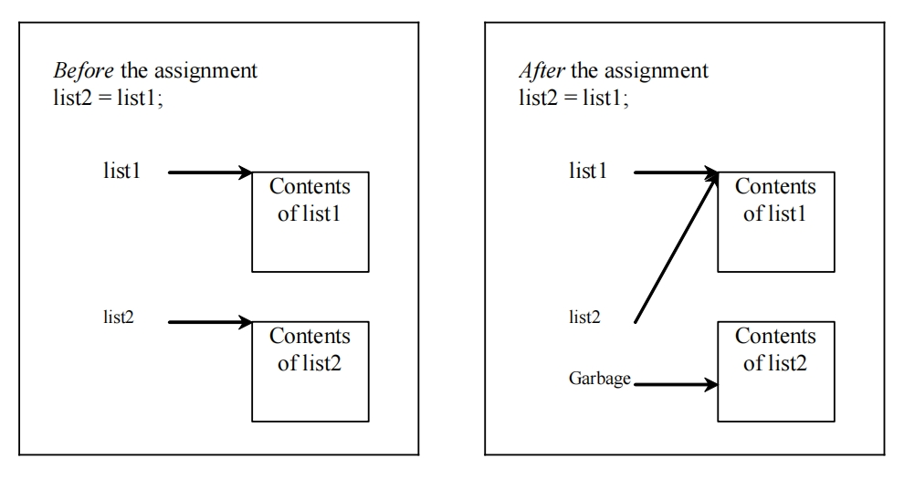
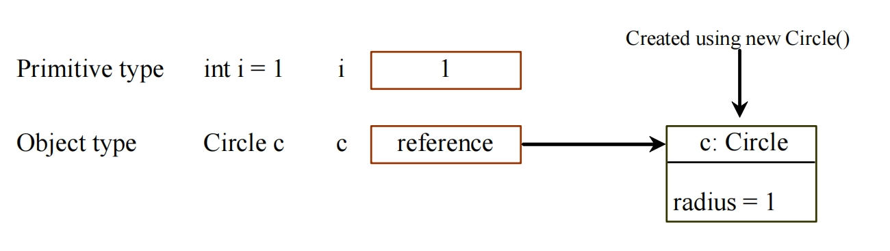
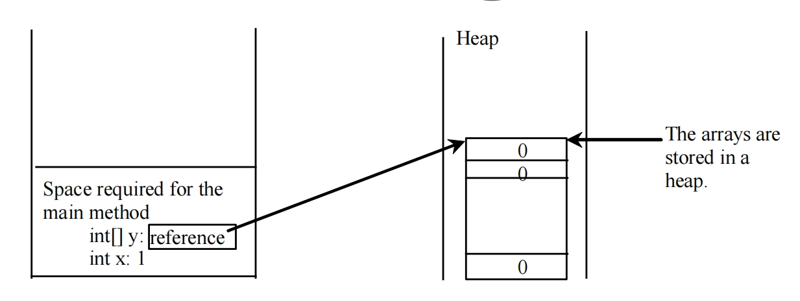
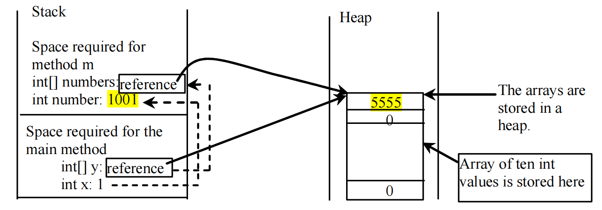
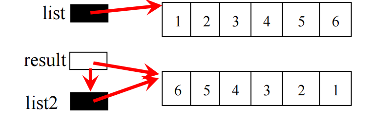
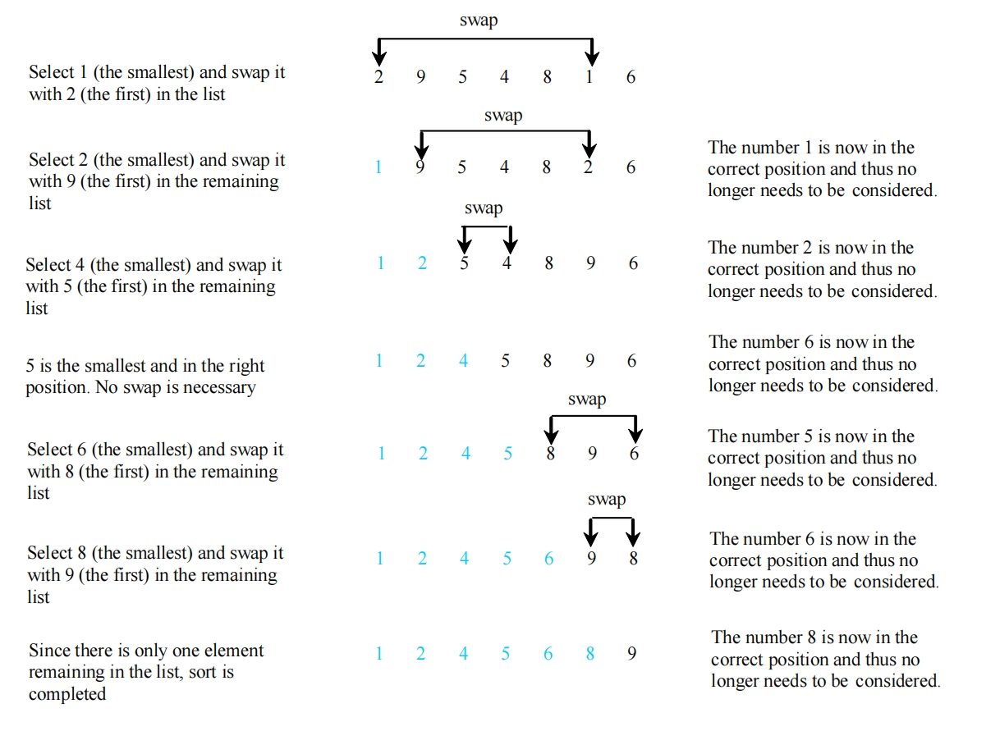
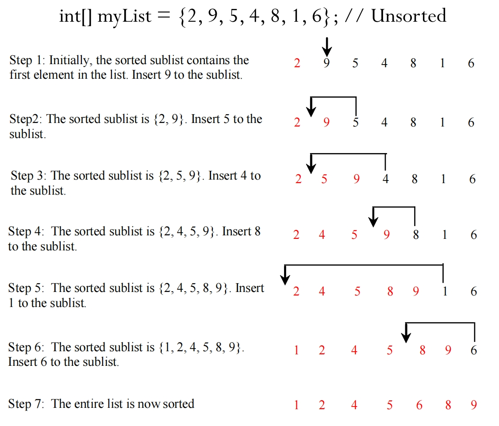

# 1.1 Arrays 数组

## Opening Problem

读取 100 个数字（例如，温度、销售量），计算它们的平均值，并找出高于平均值的数字数量

步骤：

- you need to read all the numbers before you can compute the average and compare them

  你需要在计算平均值之前先读取这些数字

- storing 100 numbers

  对这100个数字进行排序

- variables with one number each?

  但是不能给每一个数字都专门存一个变量，正确的方法是通过一个数组来存放这些数字

```java
import java.util.Scanner;
public class Test {
    public static void main(String[] args) {
        // 存放所有读取到的数字的数组
        double[] myList;
        int n = 100;
        myList = new double[n];
        // 读取输入的数字，这里是直接一次性输入了100个数字
        Scanner input = new Scanner(System.in);
        System.out.print("Enter "+myList.length+" doubles: ");
        double sum = 0;
        for (int i = 0; i < myList.length; i++) {
            myList[i] = input.nextDouble();
            sum += myList[i];
        }
        double avg = sum / myList.length;
        int counter = 0;
        for (double v : myList)
            if (v > avg)
                counter++;
        System.out.println(counter +" are greater than the average "+avg);
    }
}
```

数组可以存储相同类型的数据

## Introduction 数组介绍

数组变量声明方式：

```java
double[] myList = new double[10];

// 在声明时直接初始化数组
int[] arr = {1, 2, 3, 4, 5};
// or
int[] arr = new int[] {1, 2, 3, 4, 5};
```

Old syntax: 老语法（不推荐）

```java
double myList[] = new double[10];
```

- 数组的长度一旦被确定，该数组变量的长度就无法再被更改

- 数组变量获取长度: arrayVariable.**length**
- The array indices are **0-based**, i.e., it starts from **0** to **arrayRefVar.length - 1**.

- Each element in the array is represented using the following syntax, known as an **indexed variable**

After an array is created, an **indexed variable** can be used in the same way as a **regular variable**.

创建数组后，**索引变量** 可以像使用 **常规变量** 一样使用。

### Java默认值

在Java中，不同类型的数据的 **默认值** 如下：

1. **整数类型**（如`int`, `long`, `byte`, `short`）：默认值是`0`。
2. **浮点类型**（如`float`, `double`）：默认值是`0.0`。
3. **布尔类型**（`boolean`）：默认值是`false`。
4. **字符类型**（`char`）：默认值是`\u0000`（即ASCII码中的NUL字符）。
5. **引用数据类型** ( `reference`)：默认值是`null`；

### 搭配系统输入 Scanner 来创建数组

```java
// Declare array variable values, create an array, and assign its reference to values
// 声明数组变量，创建数组，并将其引用分配给该数组
double[] myList = new double[10]; 

Scanner input = new Scanner(System.in);
System.out.print("Enter " + myList.length + " values: ");
for (int i = 0; i < myList.length; i++) {
    // 这里是根据输入的存储来填充数组
    myList[i] = input.nextDouble();
    // 如果想要使用随机数，则需要通过 Math.random(), 其输入反馈是[0, 1），因此需要添额外*上实际想达到的数字范围
}
```

**Math.random() * (i + 1)**;  返回一个从0到i的随机数 [0,i]; 若不+1 则不会包括i

### 数组变化训练

**整体向左移动，或者整体向右移动。**

> 需要注意的是，开始的时候是闭区间，结束的时候是开区间

```java
// shifting left
// 将所有的元素都向左移动一位，然后最左侧的元素移到最后一位
double temp = myList[0]; // Retain the first element 保留第一个元素
for (int i = 1; i < myList.length; i++) {
	myList[i - 1] = myList[i];
}
// Move the first element to fill in the last position
// 将原本保留的第一个元素 temp 填充到数组最后的位置
myList[myList.length - 1] = temp;

// Shifting right
// 将所有的元素都向右移动一位，然后最右侧的元素移到第一位
double temp = myList[myList.length - 1]; // Retain the last element 保留最后一个元素
for(int i=myList.length-1; i>0; i--) { 
    myList[i] = myList[i-1];
}
// Move the last element to fill in the first position
// 将最后一个元素放到数组的第一个位置
myList[0] = temp;
```

**随机洗牌**

```java
// 这段代码在特定情况下可能会导致元素被重复交换
for (int i = 0; i < myList.length; i++) {
    // Generate an index j randomly
    // 注意random生成的数字是在[0, 1)之间的随机小数，所以要乘上当前列表的长度,int会向下取整
    int j = (int)(Math.random() * myList.length);
    // Swap myList[i] with myList[j]
    // 交换
    double temp = myList[i];
    myList[i] = myList[j]; 
    myList[j] = temp;
}

// 第二种从最后一个元素开始洗牌
public static double[] shuffle2(double[] d){
    for (int i = d.length - 1; i >= 0; i--) {
        int j = (int)(Math.random() * (i + 1));
        double temp = d[i];
        d[i] = d[j];
        d[j] = temp;
    }
    return d;
}
```

### 增强for循环

Note: You still have to use an index variable if you wish to traverse the array in a different order or change the elements in the array.

注意：如果您希望以**不同的顺序**遍历数组或**更改数组中的元素**，您仍然必须使用**索引变量**。

```java
double[] myList = new double[10];
double total = 0;

// for循环
for (inti = 0; i < myList.length; i++) {
    total += myList[i];
}

// forEach循环 （需要搭配Java的集合类数据类型才能使用）
// 使用增强 for 循环不需要知道当前的数组中有多少元素
for (double d : myList) {
	total += d;
}
```

### 复制Arrays

在Java中不能简单地只使用 **=** 来复制一个对象的内容给另一个。使用 **=** 的含义是复制当前指向**存储该对象的地址** (re-directing the pointer)。



**正确的数组复制方式**是创建一个新的数组对象，然后循环地将原对象中的值赋值进去

```java
int[] sourceArray={2, 3, 1, 5, 10};
int[] targetArray=new int[sourceArray.length];
for (int i = 0; i < sourceArray.length; i++) {
    targetArray[i] = sourceArray[i];
}
```

#### Java复制工具 arraycopy utility

可以通过使用 `System.arraycopy(被赋值的数组，从哪个位置开始赋值，目标数组，从哪个位置放入被复制的值，要复制的长度)`

```java
System.arraycopy(sourceArray, src_pos, targetArray, tar_pos, length);
// Example 1
int[] sourceArray={2, 3, 1, 5, 10};
int[] targetArray=new int[sourceArray.length];
System.arraycopy(sourceArray, 0, targetArray, 0, sourceArray.length);
// result: targetArray = {2, 3, 1, 5, 10}

// Example 2
int[] sourceArray={2, 3, 1, 5, 10};
int[] targetArray=new int[sourceArray.length]; // 这里长度是5
System.arraycopy(sourceArray, 1, targetArray, 0, sourceArray.length - 1); // 这里只复制了4个
// result: targetArray = {3, 1, 5, 10, 0}
```

## Pass By Value 传值或传引用

### Passing arrays to Method 将数组传递给方法

```java
// 假设需要传递一个array进入该方法
public static void printArray(int[] array) {
    for (int i = 0; i < array.length; i++) {
    	System.out.print(array[i] + " ");
    }
}

// 两种传递方式，一种是传入一个声明好的数组变量
int[] list = {3, 1, 2, 6, 4, 2};
printArray(list);
// 另一种是直接传入一个匿名数组
printArray(new int[]{3, 1, 2, 6, 4, 2});
```

There is no explicit reference variable for the array. Such array is called an **anonymous array**.

数组没有显式引用变量。这样的数组称为 **匿名数组**。

---

Java uses **pass by value** to pass arguments to a method.  

Java是**值传递**类型的语言。

- For a parameter of an **array** reference type, the value of the parameter contains a **reference** to an array; this reference is passed to the method.
  
  对于 **array** 引用类型的参数，参数的值包含对数组的引用; 此引用将会被传递给方法。
  
  - Any changes to the array that occur inside the method body **will affect the original array** that was passed as the argument.
  
    在方法体内部**对数组的任何更改**都将**影响作为参数传递的原始数组**。
  
- **传递引用数据类型（引用传递）**
  
  - **传递的是对象的引用**（内存地址），即将对象在内存中的地址传递给方法。
  
  - 在方法中通过引用修改对象的属性或调用方法会影响到原始对象。
  
- Different from a parameter of a **primitive type value** where the actual value is passed.
  
  与传递实际值的 **原始数据类型** 的参数不同。
  
  - Changing the value of the local parameter inside the method **does not affect the value of the variable** outside the method
  
    更改方法内部的 local 参数的值 不会影响方法外部的变量的值
  
- **传递基础数据类型（值传递）**
  
  - **传递的是值的副本**，即将变量的**值复制一份**传递给方法。
  
  - 在方法中对值的副本参数的修改**不会影响**原始变量的值。




```java
// 案例
public class Test {
    public static void main(String[] args) {
        int x = 1; // x represents an int value；c代表一个整数
        int[] y = new int[10]; // y represents an array of int values；y代表包含10个元素的列表
        m(x, y); // Invoke m with arguments x and y
        System.out.println("x is " + x); // 1；原始数据没有被修改
        System.out.println("y[0] is " + y[0]); // 5555 原始数组被修改了
    }
    
    public static void m(int number, int[] numbers) {
        // 基本数据类型在方法内被修改之后不会影响外部
        number = 1001; // Assign a new value to number
        // 引用数据类型在被传入的方法内更改之后，外部也会被修改
        numbers[0] = 5555; // Assign a new value to numbers[0]
    }
}
```

### 堆与栈

JVM 将数组和对象存储在称为 **堆（HEAP）** 的内存区域中，该区域用于动态内存分配，其中内存块以任意顺序分配和释放。



When invoking m(x, y), the values of x and y are passed to number and numbers. Since y contains the reference value to the array, numbers now contains the same reference value to the same array.

调用 m（x， y） 时，x 和 y 的值将传递给 number 和 numbers。由于 y 包含数组的引用值，因此 numbers 现在包含同一数组的相同引用值。



#### Java内存结构补充信息

**JVM (java virtual machine) 动态分配内存**

- Java虚拟机（JVM）是Java程序的运行环境。它是一个虚拟的计算机，可以在各种平台上运行Java字节码（.class文件）。
- JVM负责将Java源代码编译成字节码，并在运行时执行字节码。它处理内存管理、垃圾回收、线程管理等任务，使得Java程序能够独立于底层硬件和操作系统。

- JVM动态分配内存：数组存储在堆内存顶部，数组里的值存储在下面的内存中，栈内存中数组的变量存储堆内存中数组所在的地址。

**堆内存（Heap Memory）：**

- 堆内存是Java程序中用于存储对象的主要区域。所有通过 new 关键字创建的对象都存储在堆内存中。
- JVM在运行时会动态地分配和管理堆内存。当程序需要创建一个新对象时，JVM会在堆内存中分配一块合适大小的内存空间来存储该对象。
- 堆内存的大小可以通过启动JVM时的 -Xms 和 -Xmx 参数来指定，分别表示堆内存的初始大小和最大大小。

**栈内存（Stack Memory）：**

- 栈内存用于存储方法调用和局部变量。每个线程在执行时都会有自己的栈帧，用于存储方法调用的参数、局部变量和返回地址等信息。
- JVM会为每个线程分配一个独立的栈内存。栈内存的大小可以通过启动JVM时的 -Xss 参数来指定。

**JDK是Java开发工具包（Java Development Kit）的缩写。**

- 它是一种Java开发环境，提供了用于开发Java应用程序的工具和库。
- JDK包括：Java编译器（javac）：
  1. 用于将Java源代码编译成字节码文件（.class文件），这些字节码文件可以在Java虚拟机（JVM）上运行。
  2. Java运行时环境（JRE）：包括Java虚拟机（JVM）和Java类库，用于执行Java程序。
  3. Java类库：一组Java标准库，包括各种类和接口，提供了丰富的功能和工具，用于开发Java应用程序。
  4. 开发工具：除了编译器外，JDK还提供了其他开发工具，如调试器、JavaDoc工具（用于生成API文档）、JAR打包工具等。

### Reverse the list

>  方法1： 生成一个新的数组并且承接翻转之后的老数组

```java
int[] list1 = new int[] {1, 2, 3, 4, 5, 6};
int[] list2 = new int[list1.length];

public int[] reverse(int[] list) {
    // 使用方法内创建的 result 数组来接受翻转过来的值
    int[] result = new int[list.length];
    // 分别从正序和倒序两头开始
    for (int i = 0, j = result.length - 1; i < list1.length; i++, j--) {
        result[j] = list[i];
    }
    
    return result;
}
```



> 方法2：直接在原数组上进行更改

```java
public static void reverse(int[] list) {
    int temp;
    for (int i = 0, j = list.length - 1; i < list.length/2; i++, j--) {
        temp = list[j];
        list[j] = list[i];
        list[i] = temp;
    }
}
int[] list1 = new int[]{1, 2, 3, 4, 5, 6};
reverse(list1);
System.out.print(Arrays.toString());
// [6, 5, 4, 3, 2, 1] 原本的数组直接变成了倒序
```

## Algorithm 数据相关算法

**Searching** is a process of looking for a specific element in an array

搜索是在数组中查找特定元素的过程

### Binary Search 二分查找 O(logn)

二分查找的前提条件是只能在**有序**的数组内寻找

持续比较中间的大小，每次都会取其中的一半

1. 如果 key 小于 middle 元素，则只需搜索数组前半部分的 key。 
2. 如果 key 等于 middle 元素，则搜索以匹配项结束。 
3. 如果 key 大于中间元素，则只需要在数组的后半部分搜索 key。

high >= low 是为了确保当搜索范围缩小到只有一个元素是也可以被搜索，否则可能会导致最后一个元素就是我们要查找的元素

```java
/** Use binary search to find the key in the list */
public static int binarySearch(int[] list, int key) {
	int low = 0;
	int high = list.length - 1;
	int mid;
    // 这里使用的策略是左闭右闭的区间
	while (high >= low) {
        mid = (low + high) / 2;
		if (key < list[mid])
			high = mid - 1;
		else if (key == list[mid])
			return mid;
		else
			low = mid + 1;
    }
	return -1 - low;
}
```

Time complexity: O(logn)

Java内置方法:

> Arrays.binarySearch(list, targetNumber);

### Selection Sort  选择排序 O(n<sup>2</sup>)



```java
public static void selectionSort(double[] list) {
    // 外层循环
	for (int i = 0; i < list.length; i++) {
		// Find the minimum in the list[i..list.length-1]
        // 找到当前list当中的最小值
		double currentMin = list[i];
		int currentMinIndex = i;
        // 内层循环
		for (int j = i + 1; j < list.length; j++) {
			if (currentMin > list[j]) {
				currentMin = list[j];
				currentMinIndex = j;
			}
		}
		// Swap list[i] with list[currentMinIndex] if necessary;
        // 如果此时最小数的索引不是当前索引到的i，那么就交换位置
		if (currentMinIndex != i) {
			list[currentMinIndex] = list[i];
			list[i] = currentMin;
		}
	}
}
```

Time complexity: O(n<sup>2</sup>)

### Insertion Sort 插入排序 O(n) ~ O(n<sup>2</sup>)

The technique used to repeatedly insert an unsorted element into a sorted sublist until the whole list is sorted

向当前索引到的数字的前面查找，直到找到前面第一个比该数字小的数，然后插入在这个被找到的数的后面



```java
public static void insertionSort(int[] a){
	for(int i=1; i<a.length; i++){
		int temp = a[i];
		if(temp < a[i-1]) {
			int j;
			for(j = i-1; j >= 0; j--){
                if(temp < a[j])
					a[j+1] = a[j];
				else
					break;
            }
			a[j+1] = temp;
		}
	}
}
```

Time complexity: O(n) ~ O(n<sup>2</sup>)

### Java内置的排序方法 Array.Sort()

可以拍数字，也可以根据字母顺序排，默认是正序的，但是这里排序的对象需要 implements Comparable

```java
double[] numbers = {6.0, 4.4, 1.9, 2.9, 3.4, 3.5};
java.util.Arrays.sort(numbers);

char[] chars = {'a', 'A', '4', 'F', 'D', 'P'};
java.util.Arrays.sort(chars);

// 对于引用数据类型，可以使用 Collections.reverseOrder() 来更改为倒序排序
// 使用 Collections.reverseOrder() 进行倒序排序
Integer[] numbers = {5, 2, 8, 1, 9, 4};
Arrays.sort(numbers, Collections.reverseOrder());
System.out.println("倒序排序后 (Integer[]): " + Arrays.toString(numbers)); // 输出: [9, 8, 5, 4, 2, 1]

```

## Questions 练习题

1. What is the output of the following code:

   ```java
   int[] numbers = {1, 2, 3, 4, 5};
   for (int num : numbers) {
   	num *= 2;
   }
   System.out.println(numbers[2]);
   ```

​	输出的结果是: **3**，因为并没有将计算之后的结果赋值给numbers[i]，通常需要修改数组中存放的元素的值用 index traversal

2. Which of the folliwng is a valid way to initialize an array in Java?

   ```java
   int[] arr = new int {1, 2, 3, 4, 5}; // 不对，int[] arr = new int[] {1, 2, 3, 4, 5}
   int arr[5] = {1, 2, 3, 4, 5}; // 不对, 定义长度只能是 new int[5]
   int[] arr = {1, 2, 3, 4, 5}; // 对，这是数组定义的简化方法
   int[5] arr = {1, 2, 3, 4, 5}; // 不对，不能在变量类型里定义长度
   ```

   Answer: **C**