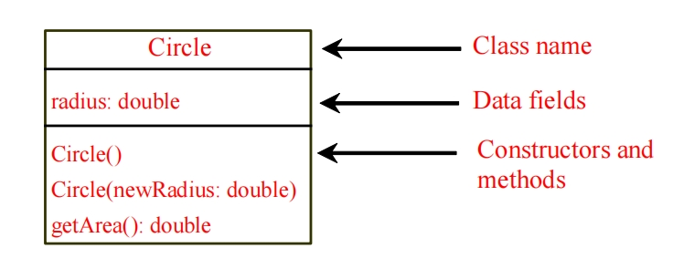
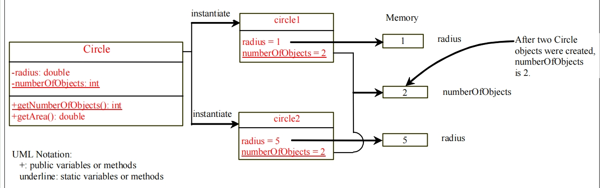
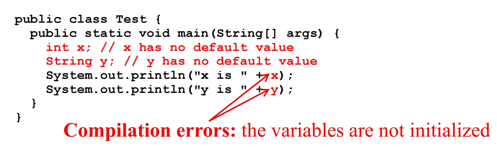
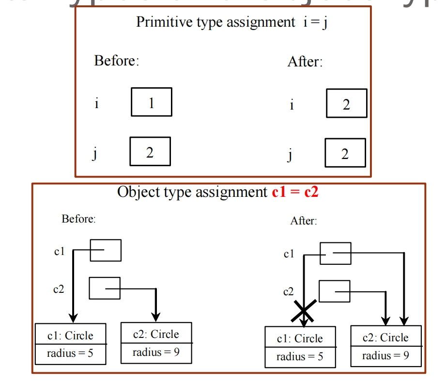
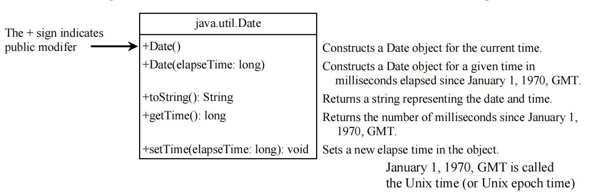
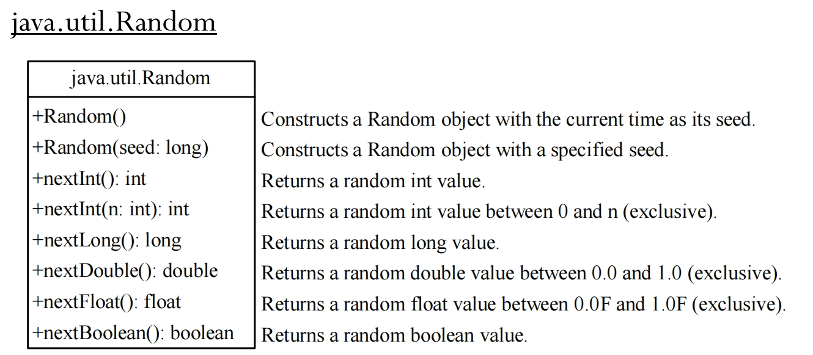
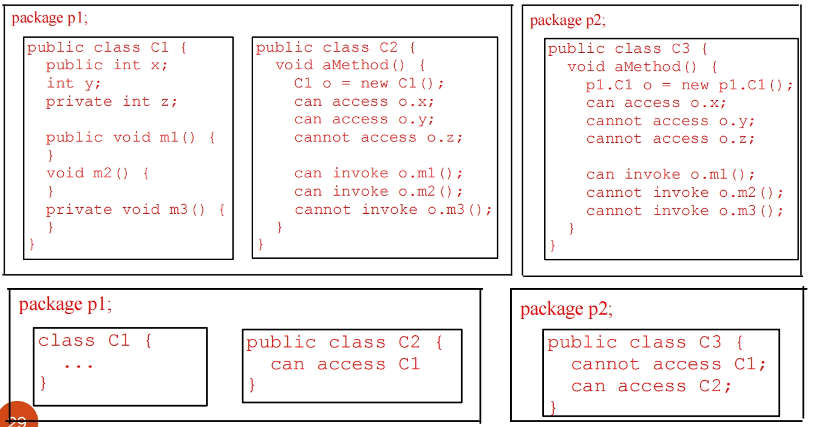
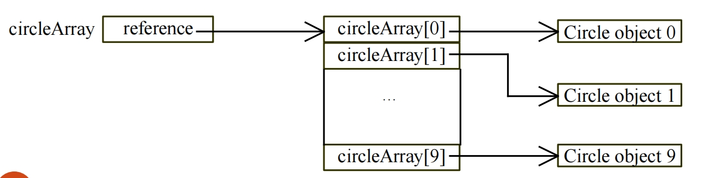

# 1.2 Object and Class 对象与类

## Object-Oriented Programming Concept 面向对象的编程概念

An object represents an entity in the real world that can be distinctly identified from a **class/templates of objects with common properties**.

对象表示现实世界中的实体，可以从具有公共属性的对象的 **类/模板** 中明确识别。

- An **object** has a unique **state** and **behavior**:

  **对象**具有唯一的**状态**和**行为**:

  - the **state** of an object consists of **a set of data fields (properties) with their current values**

    对象的状态由一组数据**字段(属性)**及其**当前值**组成

  - the **behavior** of an object is defined by **a set of instance methods**

    对象的**行为**由一组**实例方法**定义
  
  - 实例方法 (Instance Method)
  
    - **定义位置：** 可以在**类**中定义，也可以在**接口**中（在 Java 8 之前，接口中只能有抽象的实例方法；Java 8 及之后，可以有 `default` 实例方法， 也可以有 private instance method）。
    - **调用方式：** 必须通过一个**对象实例**来调用。
    - **访问权限：** 可以访问该对象实例的**实例变量**和**实例方法**。
    - 在接口中的表示：
      - **抽象实例方法：** 在 Java 8 之前，接口中的所有方法都是抽象的实例方法（不需要 `abstract` 关键字，默认就是）。它们没有方法体，必须由实现类提供实现。
      - **非抽象实例方法：** 在 Java 8 及之后，接口可以通过 `default` 关键字提供带方法体的实例方法。
  
  - 默认方法 (Default Method)
  
    - **定义位置：** **只能在接口中定义**。
    - **关键字：** 必须使用 `default` 关键字。
    - **方法体：** 必须有方法体（非抽象）。
    - **调用方式：** 必须通过一个**对象实例**来调用（就像普通的实例方法一样）。
    - **访问权限：** 可以访问该对象实例的**实例变量**（如果接口中允许定义实例变量，但 Java 接口不允许）和该接口的其他实例方法（包括抽象方法和默认方法）。
    - **目的：** 主要为了在 Java 8 之后，在不破坏已实现该接口的现有类的情况下，向接口添加新功能。实现类可以选择重写默认方法，也可以直接使用接口提供的默认实现。

## Classes 类

In Java， **classes** are **templates** that define **objects of the same type**

在Java中, **类**是定义**相同类型对象**的**模板**

- A Java class uses:

  - **non-static/instance variables** to define **data fields**

    **非静态/实例变量**, 用于定义**数据字段**

  - **non-static/instance methods** to define **behaviors**

    **非静态/实例方法**，用来来定义**行为**

- A class provides a special type of methods called **constructors** which are invoked to construct objects from the class

  类提供了一种称为"**构造器**" 的特殊方法，调用这些方法以**从类构造对象**

> Object Oriented Design: The **Unified Modeling Language** (**UML**) is a general-purpose modeling language in the field of software engineering that is intended to provide a standard way to visualize the design of a object-oriented system.
>
> 面向对象设计：统一建模语言（UML）是软件工程领域的一种通用建模语言，旨在提供一种标准方法来可视化面向对象的系统的设计。
>
> 

### Constructor 构造器

- Constructors must have the same name as the class itself.

  **构造函数必须具有与类本身相同的名称**。

- Constructors do not have a return type—not even **void**.

  **构造函数没有返回类型**, 甚至连 void 都没有。

- Constructors are invoked using the **new** operator when an object is created – they initialize objects to **reference variables**:

  创建对象时使用 **new** 运算符调用构造函数 – 它们将对象初始化为 **引用变量**：

  - **ClassName o = new ClassName();**

- Example:
  - **Circle myCircle = new Circle(5.0);**

- A class may be declared without constructors: a no-arg **default constructor** with an empty body is **implicitly** declared in the class

  可以在没有构造函数的情况下声明类：在类中通常会**隐式声明**具有空正文的 **no-arg default constructor (无参数构造器)**

## 静态变量和非静态变量

- Static variables and constants:

  静态变量和常量：

  > static int count = 0;
  >
  > static final double PI = 3.141592;

  - global variables for the entire class: for all objects instances of this class

    整个类的**全局变量**：对于该类的**所有对象实例**

- Non-static/instance variables are date fields of objects:

  非静态/实例变量是**每个对象的属性**：

  > int radius;	
  >
  > double d1 = myCircle.radius;
  >
  > double d2 = yourCircle.radius;

  - Non-static/instance methods must be invoked from an object

    必须从**对象**调用非静态/实例方法

**Static variables are shared by all the instances of the class:**

**静态变量由类的所有实例共享：**



### 不同变量是否有默认值

Java assigns **no default value** to a **local variable** inside a method

**Java 不为方法内的局部变量分配默认值，所以如果需要使用局部变量，需要先进行实例化**，否则会报 compilation error.



**Data fields** have default values (**数据字段 (data field)**（也称为 **成员变量**、**属性** 或 **实例变量**）是类中用于存储对象状态的变量。它们定义了对象所具有的特征和数据。)

**数据字段**有默认值

**注意**：如果引用类型的数据字段不引用任何对象，则该数据字段保存一个特殊的文字值：null。

```java
public class Student {
    String name; // name has default value null String的默认值是null
    int age; // age has default value 0 int的默认值是0
    boolean isScienceMajor; // isScienceMajor has default value false 布尔的默认值是false
    char gender; // c has default value '\u0000' char的默认值是 '\u0000'
}
public class Test {
    public static void main(String[] args) {
        Student student = new Student();
        System.out.println("name? " + student.name); // null
        System.out.println("age? " + student.age); // 0
        System.out.println("isScienceMajor? " + student.isScienceMajor); // false 
        System.out.println("gender? " + student.gender); // 当 student.gender 是 '\u0000' 时，它会被转换为字符串 " "（空字符），因此最终输出为：gender? 
        // Note: If a data field of a reference type does not reference any object,the data field holds a special literal value: null.
        
    }
}
```

### Copying Variables of Primitive Data Types and Object Types

**复制原始数据类型和对象类型的变量**



- The object previously referenced by c1 is no longer referenced, it is called **garbage**

  之前被 c1 引用的对象不再被引用，它被称为 **垃圾**

- Garbage is automatically collected by the JVM, a process called **garbage collection**

  垃圾由 JVM 自动收集，此过程称为 **垃圾回收**

- In older languages, like C and C++, one had to explicitly deallocate/delete unused data/objects

  在较旧的语言中，如 C 和 C++，必须显式释放/删除未使用的数据/对象

## Example Classes in Java

### Date class 时间类

Java provides a system-independent encapsulation of date and time in the **java.util.Date** class.

Java 在 java.util.Date 类中提供了独立于系统的日期和时间封装。

The **toString** method returns the date and time as a string

toString 方法以字符串形式返回日期和时间



```java
java.util.Date date = new java.util.Date();
System.out.println(date.toString());
```

### Random class 随机类



```java
Random random1 = new Random(3); // 指定专门的随机种子
for (int i = 0; i < 10; i++)
	System.out.print(random1.nextInt(1000) + " ");
```

## Visibility Modifiers and Accessor/Mutator Methods 可见性修饰符和访问器/修改器方法

By default, the class, variable, or method can be accessed by any class in the same package.

默认情况下，类、变量或方法可以由同一包中的任何类访问。

- public (+ in UML)

  - The class, data, or method is visible to any class in any package.

    类、数据或方法对任何包中的任何类都是可见的。

- private (- in UML)

  - The data or methods can be accessed only by the declaring class - To protect data!

    数据或方法只能通过声明类来访问： 保护数据！

- getField (accessors) and setField (mutators) methods are used to read and modify private properties.

  getField（accessors）和setField（mutators）方法用于读取和修改私有属性。

### Packages and modifiers

- The private modifier restricts access to within a class

  private 修饰符限制对类内的访问

- The default modifier restricts access to within a package

  default 修饰符限制对包内的访问

- public – unrestricted access

  公众无限制访问



### Array of Objects 存储对象的数组

An array of objects is an **array of reference variables** (like the multi-dimensional arrays seen before)

对象数组是 **引用变量数组** （就像前面看到的多维数组一样）

```java
Circle[] circleArray = new Circle[10];
circleArray[0] = new Circle();
circleArray[1] = new Circle(5);
```



## Exception 异常类

### 编译时错误 (Compile-time Errors)

**编译时错误**是指在程序被编译器（如 Java 的 `javac`）翻译成机器可执行代码（如 Java 字节码）的过程中发现的错误。如果存在编译时错误，程序就无法成功编译，也就无法运行。编译器会指出错误发生的文件和行号，通常还会给出错误描述。

**主要类型：**

1. **语法错误 (Syntax Errors):**
   - **定义：** 违反编程语言的语法规则，就像自然语言中的语法错误。编译器无法理解代码的结构。
   - 示例：
     - 缺少分号 (`;`)。
     - 括号、大括号或方括号不匹配或缺失 (`(`, `)`, `{`, `}`, `[`, `]`)。
     - 关键字拼写错误 (例如，将 `public` 写成 `Public`)。
     - 非法字符或未声明的变量。
   - **特点：** 编译器通常会清晰地指出错误位置和类型，相对容易修复。
2. **类型错误 (Type Errors) / 类型不匹配 (Type Mismatch Errors):**
   - **定义：** 当你试图对某个类型的数据执行不兼容的操作，或者将一种类型的值赋给不兼容的变量时发生。
   - 示例：
     - 尝试将一个字符串赋值给一个整型变量：`int num = "hello";`
     - 对不同类型进行不合法的运算：`"abc" / 2;`
     - 方法调用时传入的参数类型与方法声明的参数类型不匹配。
     - 缺少 `return` 语句，而方法声明了返回类型。
   - **特点：** 编译器能够检测到数据类型使用上的不一致性。
3. **引用错误 (Reference Errors):**
   - **定义：** 试图使用一个尚未声明、初始化或超出作用域的变量或方法。
   - 示例：
     - 使用一个未声明的变量：`System.out.println(myVar);` 而 `myVar` 没有声明。
     - 在一个方法中声明的局部变量在方法外部被引用。
   - **特点：** 编译器不知道你引用的符号是什么。
4. **可达性错误 (Reachability Errors):**
   - **定义：** 代码中的某些语句在任何执行路径下都无法被执行到（“死代码”）。
   - **示例：** 在 `return` 语句之后还有其他代码。
   - **特点：** 编译器会警告你这部分代码是多余的。

### 运行时错误 (Runtime Errors)

**运行时错误**是在程序已经成功编译并开始执行后才发生的错误。这些错误通常是由于程序逻辑、数据处理不当或与外部环境（如文件、网络）交互时出现问题导致的。编译器无法预测这些错误，因为它们依赖于程序运行时的具体状态和输入。当发生运行时错误时，程序通常会崩溃或异常终止。

**主要类型：**

1. **逻辑错误 (Logic Errors):**

   - **定义：** 程序按照语法规则正确执行，但结果不符合预期或完成的任务是错误的。这是最难发现和调试的错误类型，因为程序不会报错，只是行为不正确。
   - 示例：
     - 循环条件写错导致死循环或提前结束。
     - 计算公式写错，导致结果不准确：`a - b` 写成 `a + b`。
     - 算法步骤颠倒或遗漏，导致功能不正常。
   - **特点：** 程序能编译和运行，但结果不对。编译器和 JVM 都无法直接检测到，需要通过测试、调试和人工检查来发现。

2. **算术错误 (Arithmetic Errors):**

   - **定义：** 进行无效的数学运算。
   - 示例：
     - **除以零 (Division by Zero):** `10 / 0` (在 Java 中会抛出 `ArithmeticException`)。
     - 数值溢出 (Integer Overflow)：当计算结果超出数据类型所能表示的最大范围时。
   - **特点：** 多数编程语言会为此类错误抛出特定的运行时异常。

3. **空指针错误 (Null Pointer Errors):**

   - **定义：** 尝试对一个 `null` 引用（没有指向任何对象的引用）进行操作，例如调用方法或访问成员变量。

   - 示例：

     Java

     ```
     String str = null;
     System.out.println(str.length()); // 会抛出 NullPointerException
     ```

   - **特点：** 这是 Java 中最常见的运行时错误之一，通常会抛出 `NullPointerException`。

4. **数组/集合越界错误 (Index Out of Bounds Errors):**

   - **定义：** 尝试访问数组、列表或字符串中不存在的索引位置。

   - 示例：

     Java

     ```
     int[] arr = new int[5];
     System.out.println(arr[5]); // 会抛出 ArrayIndexOutOfBoundsException
     ```

   - **特点：** 在 Java 中会抛出 `ArrayIndexOutOfBoundsException` 或 `IndexOutOfBoundsException`。

5. **文件/I/O 错误 (File/I/O Errors):**

   - **定义：** 在进行文件读写或网络通信时发生的问题。
   - 示例：
     - 尝试打开一个不存在的文件。
     - 没有写入文件的权限。
     - 网络连接中断。
   - **特点：** 通常会抛出 `IOException` 或其子类。

6. **类型转换错误 (Class Cast Errors):**

   - **定义：** 试图将一个对象强制转换为它实际上不是的类型。

   - 示例：

     Java

     ```
     Object obj = "hello";
     Integer num = (Integer) obj; // 会抛出 ClassCastException
     ```

   - **特点：** 编译器无法在编译时完全检查所有类型转换的有效性，因此可能在运行时抛出 `ClassCastException`。

7. **内存错误 (Memory Errors):**

   - **定义：** 程序耗尽可用内存。
   - 示例：
     - **`OutOfMemoryError`：** 创建了过多对象，或者递归调用层级过深（导致栈溢出 `StackOverflowError`）。
   - **特点：** 表示 JVM 无法为程序分配更多内存，通常是致命错误。

### OOP 的三个特性

#### 1. 封装 (Encapsulation)

**定义：** 封装是将对象的数据（属性/字段）和操作这些数据的方法（行为/方法）捆绑在一起，形成一个独立的单元（类）。它同时还意味着**隐藏**对象的内部实现细节，只通过公共接口暴露必要的功能。

**核心思想：**

- **数据隐藏 (Data Hiding)：** 对象的内部状态（数据字段）通常被设为 `private` 或 `protected`，外部只能通过对象提供的 `public` 方法（getter 和 setter）来访问和修改这些数据，而不是直接操作。
- **职责单一：** 一个类应该只负责一项任务或一组相关的任务。
- **信息隐藏 (Information Hiding)：** 外部用户只需要知道如何使用对象的公共接口，而不需要关心其内部是如何实现这些功能的。

**好处：**

- **提高安全性：** 防止外部代码随意修改对象的内部状态，确保数据的一致性和有效性。
- **降低复杂性：** 简化了对象的使用，因为用户只需关注接口。
- **提高可维护性：** 当内部实现发生变化时，只要公共接口不变，就不会影响到外部使用该类的代码。
- **增加模块化：** 每个对象都是一个相对独立的模块。

**示例：** 一个 `Car` 类有 `speed`（速度）属性，但你不能直接修改 `car.speed = 1000`。而是通过 `car.accelerate(50)` 这样的方法来改变速度。`accelerate` 方法内部会检查速度是否超速，确保逻辑正确。

#### 2. 继承 (Inheritance)

**定义：** 继承允许一个类（**子类/派生类**）从另一个类（**父类/基类/超类**）**继承**其属性和方法。子类可以重用父类的代码，并在此基础上添加新的功能或修改（重写）已有的行为。

**核心思想：**

- **代码重用：** 避免编写重复的代码，提高了开发效率和代码的可维护性。
- **建立层次结构：** 模拟现实世界中的“is-a”关系（例如，“狗是一种动物”，“经理是一种员工”）。
- **特化与泛化：** 父类是更通用（泛化）的概念，子类是更具体（特化）的概念。

**好处：**

- **减少代码冗余：** 共享通用代码。
- **提高可扩展性：** 添加新功能时，只需创建新的子类，而不需要修改现有代码。
- **促进多态性：** 继承是实现多态的基础。

**示例：** `Animal` 是父类，拥有 `eat()`、`sleep()` 方法。`Dog` 和 `Cat` 是 `Animal` 的子类，它们继承了 `eat()`、`sleep()`，并且可以有自己特有的方法（如 `bark()` 或 `meow()`）或重写父类的方法（如 `eat()`）。

#### 3. 多态 (Polymorphism)

**定义：** 多态意味着“多种形态”或“多种形式”。在 OOP 中，它指的是一个对象可以在不同上下文中呈现出不同的行为，或者说，一个接口（或父类引用）可以引用不同类型（实现该接口或继承该父类）的对象，并根据实际对象的类型执行相应的方法。

**核心思想：**

- **一个接口，多种实现：** 允许使用统一的接口（父类类型或接口类型）来处理不同类型的对象。
- **运行时绑定 (Dynamic Binding/Late Binding)：** 实际调用的方法是在运行时根据对象的实际类型来确定的，而不是在编译时。

**好处：**

- **提高灵活性和可扩展性：** 可以编写更通用的代码，无需为每种具体类型编写不同的逻辑。
- **简化代码：** 减少条件判断（如大量的 `if-else if` 或 `switch` 语句）。
- **易于维护：** 添加新的子类时，现有代码无需修改。

**多态的两种主要形式：**

- **编译时多态 (Compile-time Polymorphism)**：也称为**静态多态**或**方法重载 (Method Overloading)**。在编译时根据方法签名（方法名和参数列表）确定调用哪个方法。
- **运行时多态 (Runtime Polymorphism)**：也称为**动态多态**或**方法重写 (Method Overriding)**。子类重写父类的方法，在运行时根据引用变量指向的实际对象类型来调用相应的方法。这是 OOP 多态的真正体现。

**示例：** 如果 `Animal` 有一个 `makeSound()` 方法，并且 `Dog` 和 `Cat` 分别重写了它。

```java
Animal myAnimal1 = new Dog();
Animal myAnimal2 = new Cat();

myAnimal1.makeSound(); // 调用 Dog 的 bark()
myAnimal2.makeSound(); // 调用 Cat 的 meow()
```

这里，`myAnimal1` 和 `myAnimal2` 都是 `Animal` 类型的引用，但在运行时，它们调用了不同对象（`Dog` 和 `Cat`）的特定 `makeSound()` 实现。

### 深复制

#### 什么是深复制 (Deep Copy)？

**深复制** 创建一个**全新**的对象，并且这个新对象的所有**引用类型字段**也都是独立的**副本**，而不是共享原始对象的引用。换句话说，深复制后的对象与原对象在内存中是完全独立的，修改其中一个不会影响另一个。

**与浅复制 (Shallow Copy) 的区别：**

- **浅复制：** 只复制对象本身以及其中**基本数据类型**的字段。对于**引用数据类型**的字段，它只复制**引用地址**，而不是被引用的对象本身。这意味着新旧对象会共享相同的内部引用对象。
  - `obj1.refField` 和 `obj2.refField` 指向同一个对象。
  - `Object.clone()` 方法默认执行的就是浅复制。
- **深复制：** 复制对象本身，并且递归地复制其内部所有**引用类型字段所指向的对象**。
  - `obj1.refField` 和 `obj2.refField` 指向不同的对象，即使它们的内容相同。

#### 为什么需要深复制？

当对象内部包含可变（mutable）的引用类型（如 `List`、`Set`、`Map`、自定义类的实例等）时，如果你不进行深复制，修改副本的引用字段可能会意外地影响到原始对象，这会导致难以追踪的 bug，并破坏对象的封装性和不变性。

#### 实现深复制的常用方法

深复制没有 Java 内置的单一通用方法，通常需要根据对象的结构手动实现，或者借助序列化机制。

#### 方法一：手动实现深复制（最常见和推荐，控制力最强）

这是最直接的方法，你需要在需要深复制的类中，手动为所有可变的引用类型字段创建副本。

**模板：**

1. **实现 `Cloneable` 接口：** 虽然它只提供标记，但按照惯例，这是使用 `clone()` 方法的前提。
2. 重写 `clone()` 方法：
   - 首先调用 `super.clone()` 来获取对象的**浅拷贝**。
   - 然后，对于每个**可变**的引用类型字段，手动创建它的副本，并将副本赋值给新创建的对象（`super.clone()` 返回的那个对象）。
   - 对于不可变（immutable）的引用类型（如 `String`、`Integer`、`final` 集合等），可以直接复制引用，因为它们不会被修改。
   - 对于基本数据类型，`super.clone()` 已经处理了。
3. **处理 `CloneNotSupportedException`：** `super.clone()` 会抛出这个异常，通常在重写的 `public clone()` 方法中将其捕获并包装为 `RuntimeException`，或者直接声明抛出。

**案例：`Book` 类包含一个 `Author` 对象和出版年份**

假设有一个 `Author` 类（可变），和 `Book` 类。我们希望在复制 `Book` 时，它的 `Author` 对象也是一个独立的副本。

```java
import java.util.Objects; // 用于 Objects.hash() 和 Objects.equals()

// Author 类（假设是可变的，例如可以修改姓名）
class Author implements Cloneable {
    private String name;
    private int yearBorn;

    public Author(String name, int yearBorn) {
        this.name = name;
        this.yearBorn = yearBorn;
    }

    // Getter 和 Setter (为了演示可变性)
    public String getName() { return name; }
    public void setName(String name) { this.name = name; }
    public int getYearBorn() { return yearBorn; }
    public void setYearBorn(int yearBorn) { this.yearBorn = yearBorn; }

    @Override
    public String toString() {
        return "Author{" + "name='" + name + '\'' + ", yearBorn=" + yearBorn + '}';
    }

    // 如果 Author 也需要被深复制，它也需要实现 Cloneable 并重写 clone()
    @Override
    public Author clone() {
        try {
            // 默认的 Object.clone() 是浅拷贝
            return (Author) super.clone();
        } catch (CloneNotSupportedException e) {
            // 这不应该发生，因为我们实现了 Cloneable 接口
            throw new AssertionError("Author cloning failed: " + e.getMessage());
        }
    }

    // 为了Set/Map的正确行为，重写equals和hashCode
    @Override
    public boolean equals(Object o) {
        if (this == o) return true;
        if (o == null || getClass() != o.getClass()) return false;
        Author author = (Author) o;
        return yearBorn == author.yearBorn && Objects.equals(name, author.name);
    }

    @Override
    public int hashCode() {
        return Objects.hash(name, yearBorn);
    }
}

// Book 类，需要深复制其 Author 字段
class Book implements Cloneable {
    private String title;
    private Author author; // 引用类型字段，需要深复制
    private int publicationYear;
    private List<String> genres; // 假设也是引用类型字段，也需要深复制

    public Book(String title, Author author, int publicationYear, List<String> genres) {
        this.title = title;
        this.author = author;
        this.publicationYear = publicationYear;
        // 在构造函数中也要注意防御性拷贝，避免表示泄露
        this.genres = new ArrayList<>(genres); // 复制列表内容
    }

    // Getter
    public String getTitle() { return title; }
    public Author getAuthor() { return author; } // Getter也应返回防御性拷贝，防止外部修改内部 Author 对象
    public int getPublicationYear() { return publicationYear; }
    public List<String> getGenres() { return Collections.unmodifiableList(genres); } // 返回不可修改的视图，防止外部修改列表

    // 假设需要一个方法来获取可修改的 Author 对象，但要小心
    public Author getMutableAuthor() {
        return author.clone(); // 返回作者的副本，防止外部直接修改内部作者
    }

    // --- 实现深复制 ---
    @Override
    public Book clone() {
        try {
            // 1. 调用 Object.clone() 进行浅拷贝
            Book clonedBook = (Book) super.clone();

            // 2. 对所有需要深复制的可变引用类型字段进行手动复制
            //    克隆 Author 对象
            clonedBook.author = this.author.clone(); // 确保 Author 类也实现了 Cloneable 并重写了 clone()

            //    克隆 genres 列表 (如果列表是可变的，并且你需要一个独立的列表副本)
            //    List<String> 是可变的，但 String 是不可变的，所以复制 List 即可。
            clonedBook.genres = new ArrayList<>(this.genres);

            return clonedBook;
        } catch (CloneNotSupportedException e) {
            // 这不应该发生，因为 Book 实现了 Cloneable
            throw new AssertionError("Book cloning failed: " + e.getMessage());
        }
    }

    @Override
    public String toString() {
        return "Book{" +
               "title='" + title + '\'' +
               ", author=" + author +
               ", publicationYear=" + publicationYear +
               ", genres=" + genres +
               '}';
    }
}

public class DeepCopyManualExample {
    public static void main(String[] args) {
        Author originalAuthor = new Author("Jane Austen", 1775);
        List<String> originalGenres = new ArrayList<>(Arrays.asList("Romance", "Classic"));
        Book originalBook = new Book("Pride and Prejudice", originalAuthor, 1813, originalGenres);

        System.out.println("原始书: " + originalBook);
        System.out.println("原始作者对象哈希码: " + originalAuthor.hashCode());
        System.out.println("原始 genres 列表哈希码: " + originalGenres.hashCode());

        // 执行深复制
        Book clonedBook = originalBook.clone();

        System.out.println("\n克隆书: " + clonedBook);
        System.out.println("克隆作者对象哈希码: " + clonedBook.getAuthor().hashCode()); // 预期与原始作者不同
        System.out.println("克隆 genres 列表哈希码: " + clonedBook.getGenres().hashCode()); // 预期与原始 genres 不同

        // --- 验证深复制：修改克隆对象的内部引用字段 ---
        System.out.println("\n--- 验证深复制 (修改克隆对象) ---");
        clonedBook.getAuthor().setName("Jane A."); // 修改克隆书的作者姓名 (通过其getter返回的引用，或者直接修改克隆内部author)
                                                    // 注意：如果getAuthor()没有返回防御性拷贝，这里修改的是同一个author对象
                                                    // 但因为clone()里做了深拷贝，所以这里的修改是针对克隆出的Author对象

        // 要修改克隆出的Author对象，需要通过clonedBook的内部author字段（如果有setter）或者通过clonedBook.getAuthor()再进行一次修改
        // 为了清晰演示，我们通过clone方法返回的对象来修改其克隆出的作者
        clonedBook.getAuthor().setName("Jane A."); // 假设getAuthor()返回的是其内部author的引用，且author对象本身是可变的
        // 正确的修改方式：
        Author clonedAuthorToModify = clonedBook.getAuthor(); // 这里的getAuthor()应该返回一个副本，否则修改的还是原始作者
        // 为了演示，我们假设存在一个setter或者直接通过访问来修改克隆对象内部的作者实例
        // 如果getAuthor()返回的是原始author的引用，且originalAuthor没有做防御性拷贝，那么这里修改的是同一个Author对象。
        // 但我们在clone()里已经做了clonedBook.author = this.author.clone(); 所以这两个Author对象是独立的了。
        // 那么clonedBook.getAuthor()无论如何，它会返回一个对象。如果getter也返回副本，那么这里就有点绕。
        // 简化起见，我们直接操作clonedBook内部的author字段（通过一个假设的setter或反例）。
        // 最直接的验证是比较哈希码：
        Author authorFromClonedBook = clonedBook.getAuthor(); // 假设这个getter返回的是内部author的引用
        authorFromClonedBook.setName("Jane A."); // 修改了克隆作者的姓名

        // 尝试修改克隆书的 genres 列表（需要获取可修改的列表，如果 getter 返回不可修改视图则不能）
        // 假设有一个方法可以获取可修改的 genres 列表
        // clonedBook.getGenres().add("Fantasy"); // 如果 getGenres 返回的是 Collections.unmodifiableList，这会抛异常

        System.out.println("原始书 (修改克隆书后): " + originalBook); // 预期：作者姓名未变
        System.out.println("克隆书 (修改克隆书后): " + clonedBook);   // 预期：作者姓名已变

        // 再次比较哈希码以确认独立性
        System.out.println("原始作者对象哈希码 (修改克隆书后): " + originalAuthor.hashCode());
        System.out.println("克隆作者对象哈希码 (修改克隆书后): " + clonedBook.getAuthor().hashCode()); // 预期与原始作者不同，且修改后与修改前克隆作者的hashCode可能不同
    }
}
```

**注意：** 在上面的 `Book` 类中，`getAuthor()` 方法**也应该返回 `author` 字段的防御性拷贝** (`return this.author.clone();`)，或者返回一个不可变视图，以防止外部代码通过 Getter 获取引用后直接修改 `Book` 对象的内部 `Author` 实例。我已在代码中注释说明。`getGenres()` 返回 `Collections.unmodifiableList()` 也是一种防御性策略。

## Questions

1. What is the correct code to print the value of x ?

   ```java
   public class InClassQuiz{
       int x = 5;
       static int y = 10;
       public static void main(String[] args) {
           System.out.println(???);
       }
   }
   ```

   答案应该是输入: new InClassQuiz().x。因为x是非静态变量，需要通过对象来调用

2. What is the correct code to print the value of y ?

   ```java
   public class InClassQuiz{
       int x = 5;
       static int y = 10;
       public static void main(String[] args) {
           System.out.println(???);
       }
   }
   ```

   答案是应该输入：InClassQuiz.y。因为y是静态变量，可以直接通过类名获取

3. What is the output of the following code?

   ```java
   public class Example {
       public int x;
       
       public static void main(String[] args) {
           Example obj1 = new Example();
           obj1.x = 5;
           Example obj2 = obj1;
           obj2.x = 10;
           System.out.println(obj1.x);
       }
   }
   ```

   应该输出: 10, 因为obj2的当前引用的对象地址和obj1相同，因此obj2做出的更改实际上obj1也会看到
