# 10 Graphs and Applications 

## Objective 目的

- To model real-world problems using graphs

  使用图形对现实世界的问题进行建模

- To describe the graph terminologies: **vertices (nodes), edges, directed/ undirected, weighted/unweighted, connected graphs, loops,parallel edges,simple graphs,cycles,subgraphs** and **spanning tree**

  描述图术语：顶点（节点）、边、有向/无向、加权/未加权、连通图、循环、平行边、简单图、循环、子图 和 生成树

- To **represent vertices and edges** using **edge arrays**, **edge objects**, **adjacency matrices**, **adjacency vertices list** and **adjacency edge lists**

  使用 **边数组、边对象、邻接矩阵、邻接顶点列表** 和 **邻接边列表** 表示顶点和边

- To model graphs using the **Graph** interface and the **Unweighted Graph** class

  使用 **Graph** 接口和 **Unweighted Graph** 类对图形进行建模

- To design and implement **depth-first search**

  设计和实现 **深度优先搜索**

- To design and implement **breadth-first search**

  设计和实现 **广度优先搜索**

- Applications:

  - the problem to find the least number of flights between two cities is to find a shortest path between two vertices in a graph

    找到两个城市之间最少航班数量的问题是找到图中两个顶点之间的最短路径

  - Social MediaAnalysis (e.g., modelling social network)

    社交媒体分析（例如，社交网络建模）

  - Computer chip design

    计算机芯片设计

  - Search Engine Algorithms

    搜索引擎逻辑

## Basic Graph Terminology

- A **graph** **G = (V, E),** where **V** represents a set of vertices (or nodes) and **E** represents a set of edges (or links). 

  A图**G=（V，E）**，其中**V**表示一组顶点（或节点），**E**表示一系列边（或链接）。

- A graph may be **undirected** (i.e., if (x,y) is in E, then (y,x) is also in E) or **directed**

  图形可以是 **无向的**（即，如果 （x，y） 在 E 中，则 （y，x） 也在 E 中）或 **有向的**

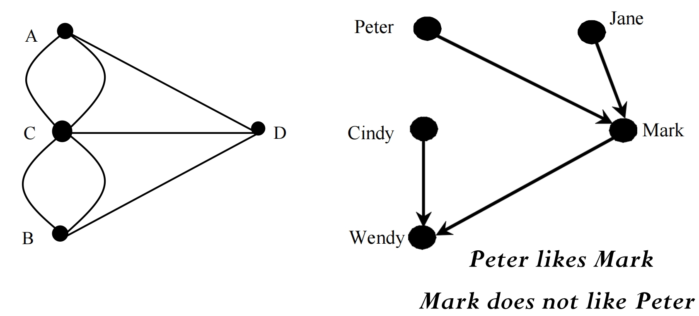

- Two vertices in a graph are said to be **adjacent** (or **neighbors**) if they are connected by an edge

  如果图形中的两个顶点由边连接，则称它们为 **adjacent**（或 **neighbors**）

  - An edge in a graph that joins two vertices is said to be **incident** to both vertices

    在图形中连接两个顶点的边被称为 **incident** 到两个这两个顶点

  - For example, A and B are adjacent

    例如，A 和 B 相邻

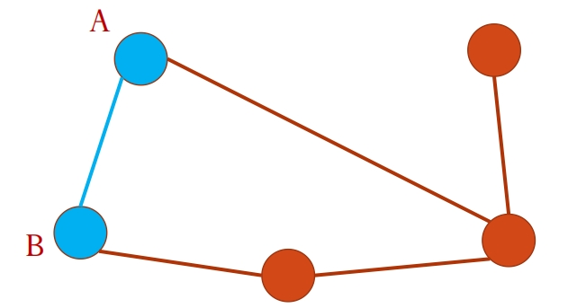

- The **degree** of a vertex is the number of edges incident to it:

  顶点的**度**是指与其相交的边的数量：

  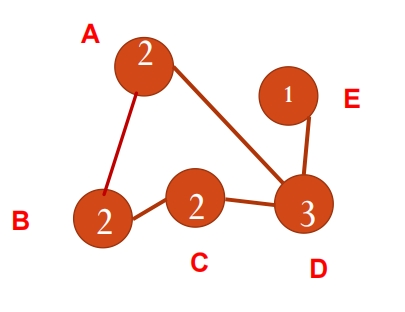

- **Complete graph** represents every two pair of vertices id directly connected

  **完全图**表示每两对顶点是直接连通的

  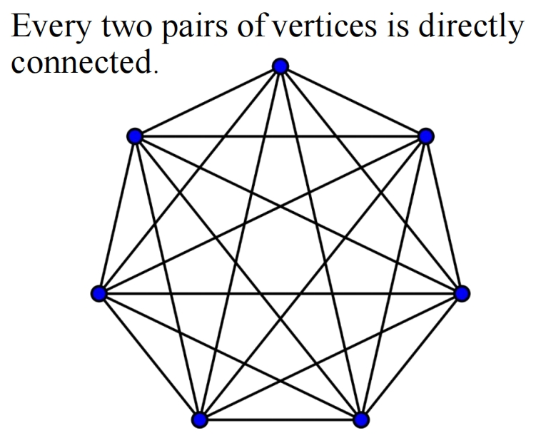

- **Incomplete graph**

  存在至少一对顶点，两个顶点之间没有之间连接的边
  
  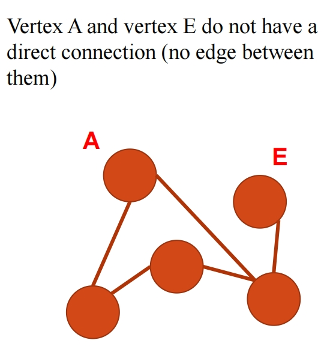

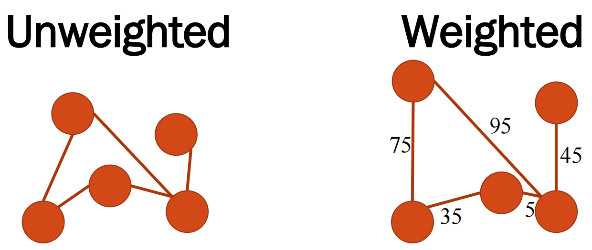

If two vertices are connected by two or more edges, these edges are called **parallel edges**

如果两个顶点由两条或多条边连接，则这些边称为 **平行边**

A **loop** is an edge that links a vertex to itself

**循环** 是将顶点链接到其顶点的边。

 A **simple graph** is one that has **doesn’t have any** parallel edges or loops

**简单图** 则代表是一个没有任何平行边或循环的图

### Cycles

- A **closed path** is a path where all vertices have 2 edges incident to them

  **闭合路径** 是所有顶点都有2条边与之相交的路径

- A **cycle** is a closed path that starts from a vertex and ends at the same vertex

  **循环** 是一个从顶点开始并在同一顶点结束的闭合路径

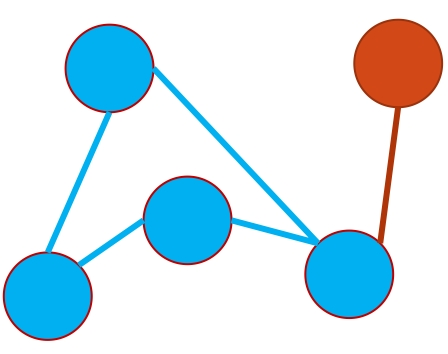

### Connected graph

- A graph is **connected** if there exists a **path** between any two vertices in the graph

  一个图是 **连通的** ，对于图中任意两个不同的顶点，都存在 **路径**

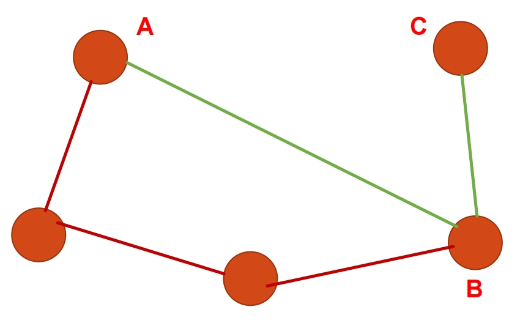

### Tree

- A **connected** graph is a **tree** but **does not have cycles (there is no way to loop back to where we started)**

  **连接** 图是一棵 **树** 但 **没有循环** （无法循环回到我们开始的地方）
  
  - connected
  - ascyclic graph (无环图，不包含任何回路)
  - undirected

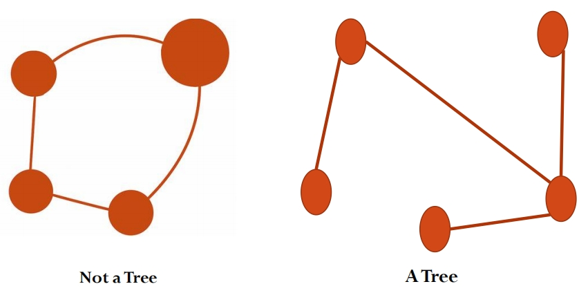

### Subgraphs

A **subgraph** of a graph G is a graph whose vertex set is a subset of that of G and whose edge set is a subset of that of G

图G的 **子图A** 是指其顶点集是图G顶点集的子集，边集是G边集的子集的图

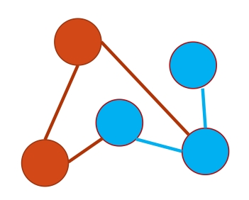

## Representing Graphs 表示图

> G = (V, E)

- Representing Vertices

  表示顶点

- Representing Edges: Edge Array

  表示边：边数组

- Representing Edges: Edge Objects

  表示边：边对象

- Representing Edges: Adjacency Matrices

  表示边：邻接矩阵

- Representing Edges: Adjacency Lists

  表示边：邻接列表

## Representing Vertices 表示顶点

- Example 1: 使用 array 来保存便
  - String[] vertices = {"Seattle", "San Francisco" , "Los Angles", "Denver" , "Kansas City" , …};
- Example 2: 使用 List 来保存边
  - List<String> vertices; vertices.add("Seattle");…

**A more object-oriented approach** 更面向对象的方式

- **Example 3**: 使用对象来存储城市信息

```java
public class City {

    // define the attributes (e.g., private String cityName;)
    // define the constructor (public City(String cityName,...){})
    // getter and setter methods (public String getCityName(),...)

}

City city0 = new City("Seattle")
City city1 = new City("San Francisco");
City[] vertices = {city0, city1,...}
```

## Representing Edges: Edge Array  表示边：边数组

- The edges can be represented using a **two-dimensional array** of all the edges:

  可以使用所有边的**二维数组**来表示边：

```java
int[][] edges = {
    {0, 1}, {0, 3}, {0, 5}, // edges from vertex 0
    {1, 0}, {1, 2}, {1, 3}, // edges from vertex 1
    {2, 1}, {2, 3}, {2, 4}, {2, 10},
    {3, 0}, {3, 1}, {3, 2}, {3, 4}, {3, 5},
    {4, 2}, {4, 3}, {4, 5}, {4, 7}, {4, 8}, {4, 10},
    {5, 0}, {5, 3}, {5, 4}, {5, 6}, {5, 7},
    {6, 5}, {6, 7}, ... };
```

- **Each line indicates the edges from a particular vertex.** 

  每条线表示来自特定顶点的边

- **Each pair, e.g.,{0,1}, means there is an edge from vertex 0 to vertex 1**

  每对，例如{0,1}，意味着从顶点0到顶点1有一条边

- **In the case of unweighted graph,{0,1} and {1,0} are the same edge**

  在未加权图的情况下，{0,1} 和 {1,0} 是相同的边

## Representing Edges: Edge Objects 表示边：边对象

```java
public class Edge {
    // Define u and v to the two endpoints of an edge
    int u, v;
    // The rest codes
    // e.g., constructor, getter, setter and so on
}
List<Edge> list = new ArrayList();
list.add(new Edge(0, 1));
list.add(new Edge(0, 3));
```

- Storing **Edge** objects in an **ArrayList** is useful if you don ’t know the number of edges in advance

  如果您事先不知道**边**的数量，则将Edge对象存储在**ArrayList**中非常有用，可以直接用内置方法获取到size之类的内部信息

## Representing Edges: Adjacency Matrix 表示边：邻接矩阵

- Knowing that the graph has **N** vertices and we can use a two-dimensional **N** * **N** matrix to represent the existence of edges, where we use 1 to indicate an edge, and 0 when there is no edge.

  知道图有**N**个顶点，我们可以使用二维 **N * N** 矩阵来表示边的存在，其中我们使用1表示边，当没有边时使用0。

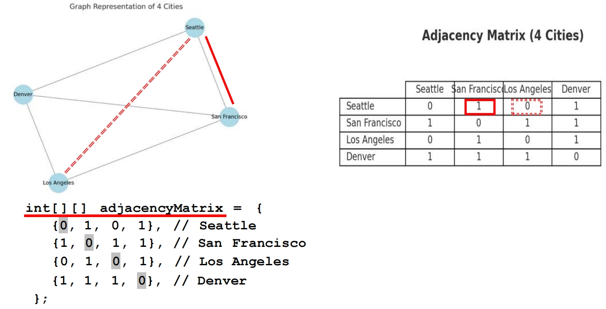

## Representing Edges: Adjacency Vertex List  表示边：邻接顶点列表

```java
// Create an array of 12 integer lists, each list representing a city
// 创建一个包含 12 个整数列表的数组，每个列表代表一个城市
List<Integer>[] neighbors = new List[12];

// Add integer (i.e, the city index) to the neighbor class, representing neighboring cities connected to the current city
// 将整数（即城市索引）添加到 neighbor 类中，表示连接到当前城市的相邻城市
neighbors[0].add(1); // 表示和保存在neighbors[0]中的城市的相邻城市，San Francisco
neighbors[0].add(3); // Denver
neighbors[0].add(5); // Chicago

neighbors[1].add(0); // Seattle
neighbors[1].add(2); // Los Angeles
neighbors[1].add(3); // Denver
```


## Representing Edges: Adjacency Edge List 迭代列表

```java
List<Edge>[] neighbors = new List[12];
```

```java
public class Edge {
    int u; // from vertex
    int v; // to vertex
    public Edge(int u, int v) {
        this.u = u;
        this.v = v;
    }
}

List<Edge>[] neighbors = new List[12];
neighbors[0].add(new Edge(0, 1)); // Seattle → San Francisco
neighbors[0].add(new Edge(0, 3)); // Seattle → Denver
neighbors[0].add(new Edge(0, 5)); // Seattle → Chicago
```

## Modeling Graphs 建模图

- We will define an interface named **Graph** that contains all the common operations of graphs. 

  我们将定义一个名为 **Graph** 的接口，其中包含图的所有常见操作。

- The concrete graphs classes (e.g., **UnweightedGraph and WeightedGraph**) implement the graph interface.

  具体的图形类（例如，**UnweightedGraph** 和 **WeightedGraph**）实现了图形接口。

  - They define **internal data structures** to store graph information, such as the list or adjacent list of vertices. 

    它们定义了 **内部数据结构** 来存储图形信息，例如顶点列表或相邻列表。

  - They provide **multiple constructors** to allow users to initialize graphs from various types of input, such as arrays, lists of vertices, or edge sets

    它们提供 **多个构造函数**，允许用户从各种类型的输入（如数组、顶点列表或边集）初始化图形

  - They **implement the abstract methods** declared in the Graph interface by providing concrete logic for operations

    它们通过为操作提供具体逻辑来  **实现Graph接口中声明的抽象方法** 

  - 例如构建一个图，无权值图和有权值图之间的继承关系：**Graph <----- UnweightedGraph <----- WeightedGraph**

## UnweightedGraph.java 详见代码 Lab10_code

- Declare and initialize the essential **data structures** used to store vertices and edges in the graph.

  声明并初始化用于在图中存储顶点和边的**基本数据结构**。

- Provide **multiple constructors** to allow users to initialize graphs from various types of input

  提供 **多个构造函数**，允许用户从各种类型的输入初始化图形

- **Implement the abstract methods** declared in the Graph interface by providing concrete logic for operations.

  通过为操作提供具体逻辑 （@Override），实现 Graph 接口中声明的抽象方法。

### Graph Traversals 图形遍历

- **Graph traversal** is the process of visiting **each vertex** in the graph exactly **once.**

   **图遍历**  是指对图中的  每个顶点  **只访问**  一次的过程。

- There are two popular ways to traverse a graph: **depth first search (DFS) and breadth-first search (BFS)**

  有两种流行的遍历图的方法：**深度优先搜索（DFS）** 和 **广度优先搜索（BFS）**

-  Both traversals result in **a spanning tree,** which is a subgraph of the whole graph, containing **ALL** vertices

  两次遍历都会产生一个 **生成树**，它是整个图的一个子图，包含 **所有** 个顶点

### Depth-first Search 深度优先搜索

The **depth-first search** of a graph starts from a vertex in the graph and visits all vertices in the graph as far as possible before backtracking. Using **stack**

图的**深度优先搜索**从图中的一个顶点开始，在回溯之前尽可能地访问图中的所有顶点，通常通过 stack 来实现

**伪代码 Logic：**

```java
Input: G = (V, E) and a starting vertex v
Output: a DFS tree rooted at v

Tree dfs(vertex v) {
    // 标记当前顶点 v 为已访问
    // 这通常通过一个布尔数组或集合来完成，避免重复访问和死循环。
    visit v; 

    // 遍历当前顶点 v 的每一个邻居 w
    // 对于图而言，这意味着检查所有与 v 直接相连的顶点。
    for each neighbor w of v
        // 检查这个邻居 w 是否还没有被访问过
        // 如果 w 已经访问过，则跳过，避免重复处理和陷入环路。
        if (w has not been visited) {
            // 在搜索树中，将 v 设置为 w 的父节点
            // 这有助于重建从起始点到任何节点的路径，或构建实际的 DFS 树/森林。
            set v as the parent for w;

            // 递归地访问邻居 w
            // 这是 DFS 的核心：沿着当前路径尽可能深入地探索。
            // 每次递归调用都会在调用栈上创建一个新的帧，模拟了栈的行为。
            dfs(w); 
        }
}
```

#### Time Complexity of DFS O(|E| + |V|)

Since each edge and each vertex is visited only once, the **time complexity** of the dfs method is **O(|E| + |V|)**, where |E| denotes the number of edges and |V| the number of vertices

由于每条边和每个顶点只访问一次，dfs方法的**时间复杂度**为**O（|E|+|V|）**，其中**|E|表示边的数量，|V|表示顶点的数量**

#### Implementation of DFS 实现DFS

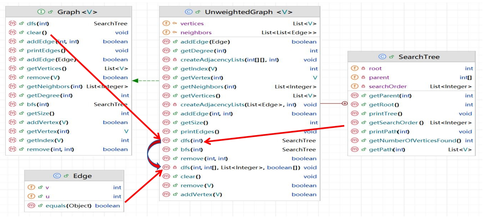

1. The dfs(int) method in the interface is implemented by the **public dfs(int) method** in the UnweightedGraph

   接口中的 dfs（int） 方法由 UnweightedGraph 中的 public dfs（int） 方法 实现

2. Inside the public dfs(int) method, a **private recursive dfs()** method is called to perform the actual dfs operation

   在public dfs（int）方法中，调用私有递归dfs（）方法来执行实际的dfs操作

3. The **Edge class** supports the DFS operation by providing the edge object represented by u (starting vertex) and v (ending vertex). 

   **Edge 类** 通过提供由 **u（起始顶点）**和 **v（结束顶点）**表示的 edge 对象来支持 DFS 操作。

4. **SearchTree (inner class)** serves as a container for storing and printing the results of a DFS traversal.

   **SearchTree （内部类）** 用作存储和打印 DFS 遍历结果的容器。

**代码实现**

- This class stores the index of the starting point u and the index of the endpoint v, allowing the graph to be represented as a list of such edges. e.u corresponds to the current vertex v (the one we're expanding),  and e.v represents a neighbor of that vertex.

  此类存储起点 u 的索引和端点 v 的索引，允许将图形表示为此类边的列表。e.u 对应于当前顶点 v（我们正在扩展的那个），e.v 表示该顶点的邻居。

```java
public class Edge {
    public int u; // starting point index
    public int v; // endpoint index
    public Edge(int u, int v) {
        this.u = u;
        this.v = v;
    }
    public boolean equals(Object o) {
        return u == ((Edge)o).u && v == ((Edge)o).v;
    }
}
```

- (In unweightedGraph.java) The SeachTree class serves as a container for storing and printing the results of a DFS traversal. It define the 1. root (the starting vertex), 2. parent (an array storing the parent of each vertex), and 3.  searchOrder (a list showing the order in which vertices were visited) It also construct a tree based on these 3 variables.

  (In unweightedGraph.java）SeachTree类用作存储和打印DFS遍历结果的容器。它定义了

  1. 根（起始顶点），
  2. parent（一个数组，存储每个顶点的父节点），以及
  3. searchOrder（显示顶点访问顺序的列表）它还基于这3个变量构建一棵树。

```java
public class SearchTree {
    private int root; // The root of the tree 树的根
    private int[] parent; // Store the parent of each vertex // 保存每个顶点的父节点
    private List<Integer> searchOrder; // Store the search order 保存搜索的顺序
    /** Construct a tree with root, parent, and searchOrder */
    // 构造一个具有 root、parent 和 searchOrder 的树
    public SearchTree(int root, int[] parent,
                      List<Integer> searchOrder) {
        this.root = root;
        this.parent = parent;
        this.searchOrder = searchOrder;
    }
    /**
	* Return the root of the tree
	*/
    // 返回树的根
    public int getRoot() {
        return root;
    }
    (and so on...)
```

- (In unweightedGraph.java) A public method named dfs, returning a SearchTree object.  It does:

  （在unweightedGraph.java中）一个名为dfs的公共方法，返回一个SearchTree对象。它做了：

  1. Initializes variables, 

     初始化变量

  2. calls the recursive DFS method, 

     调用 DFS 的递归方法

  3. returns a SearchTree.

     返回 SearchTree 对象

```java
/**
     * 实现深度优先搜索 (DFS) 的公共入口方法。
     * 从指定的起始顶点 v 开始执行 DFS 遍历。
     *
     * @param v DFS 遍历的起始顶点。
     * @return 一个 SearchTree 对象，包含 DFS 树的根、每个顶点的父节点以及遍历顺序。
     */
    @Override // 表明此方法重写了父类或接口中的方法
    public SearchTree dfs(int v) {
        // searchOrder: 一个列表，用于记录顶点被访问的顺序。
        // 这将按照 DFS 的深度优先特性来记录访问路径。
        List<Integer> searchOrder = new ArrayList<>();

        // parent: 一个整数数组，用于存储在 DFS 遍历树中每个顶点的父节点。
        // parent[i] = j 表示在 DFS 树中，j 是 i 的父节点。
        // 数组大小为图中顶点的总数。
        int[] parent = new int[vertices.size()];
        // 初始化 parent 数组：所有节点的父节点都设为 -1，表示它们尚未被访问或没有父节点。
        for (int i = 0; i < parent.length; i++) {
            parent[i] = -1; // 初始化父节点为 -1
        }

        // isVisited: 一个布尔数组，用于标记每个顶点是否已经被访问过。
        // 这在 DFS 遍历中非常重要，可以避免重复访问节点和陷入图中的循环。
        // 数组大小为图中顶点的总数。
        boolean[] isVisited = new boolean[vertices.size()];

        // 执行递归的 DFS 遍历。
        // 调用私有的 dfs 辅助方法，它将进行实际的递归遍历，并填充 parent、searchOrder 和 isVisited 数组。
        dfs(v, parent, searchOrder, isVisited);

        // 返回一个 SearchTree 对象，封装了 DFS 遍历的结果。
        // SearchTree 包含了起始顶点 (根)、每个顶点的父节点信息和顶点的访问顺序。
        return new SearchTree(v, parent, searchOrder);
    }
```

- (In unweightedGraph.java) This method performs the actual recursive depth-first search, marking each visited vertex, recording its parent,  and maintaining the visit order

  （在unweightedGraph.java中）此方法执行实际的递归深度优先搜索，标记每个访问的顶点，记录其父顶点，并维护访问顺序

```java
/**
     * 深度优先搜索 (DFS) 的私有递归辅助方法。
     * 该方法会递归地探索图，填充父节点信息和访问顺序。
     *
     * @param v           当前正在访问的顶点。
     * @param parent      存储 DFS 树中每个顶点父节点的数组。
     * @param searchOrder 存储顶点访问顺序的列表。
     * @param isVisited   标记顶点是否已访问的布尔数组。
     */
    @Override // 表明此方法重写了父类或接口中的方法 (如果它有父类或接口定义了这样的抽象方法)
    private void dfs(int v, int[] parent, List<Integer> searchOrder, boolean[] isVisited){
        // 将当前顶点 v 添加到访问顺序列表中。
        // 这是记录访问顺序的第一步。
        searchOrder.add(v);

        // 标记当前顶点 v 为已访问。
        // 设为 true 表示该顶点已被探索。
        isVisited[v] = true;

        // 遍历当前顶点 v 的所有邻居。
        // `neighbors.get(v)` 返回顶点 v 的邻接列表（或边的列表）。
        // 列表中的每个 `Edge e` 代表一条从 v 出发的边。
        for (Edge e : neighbors.get(v)) { // 注意：这里 e.u 是 v (即边的起点是当前顶点 v)
            // `e.v` 代表这条边的目标顶点，也就是 v 的一个邻居。
            // 如果这个邻居 (e.v) 尚未被访问过
            if (!isVisited[e.v]) { // 如果邻居 e.v 尚未被访问
                // 将当前顶点 v 设置为邻居 (e.v) 在 DFS 树中的父节点。
                // 这用于重建 DFS 遍历的路径或树结构。
                parent[e.v] = v;

                // 递归地对未访问的邻居 (e.v) 进行 DFS exploring 也就是向下探查。
                // DFS 会沿着这条路径尽可能地深入。
                dfs(e.v, parent, searchOrder, isVisited);
            }
        }
    }
```

#### Application of the DFS 深度搜索的应用

- Detecting whether a graph is **connected**

  检测图形是否属于**连接图**

  - Search the graph starting from any vertex

    从任意顶点开始搜索图形

  - **If the number of vertices searched is the same as the number of vertices in the graph, the graph is connected**. Otherwise, the graph is not connected.

    如果搜索的顶点数量与图中的顶点数量相同，则图是连通的。否则，图形未连接。

- Finding all connected components

  查找所有连通子图

- Detecting whether there is a path between two vertices AND find it (not the shortest)

  检测两个顶点之间是否存在路径并找到它（不是最短的）

  - Case: From 0 to 2

  - Shortest should be: 0-2

  - In DFS Result: 0-1-2

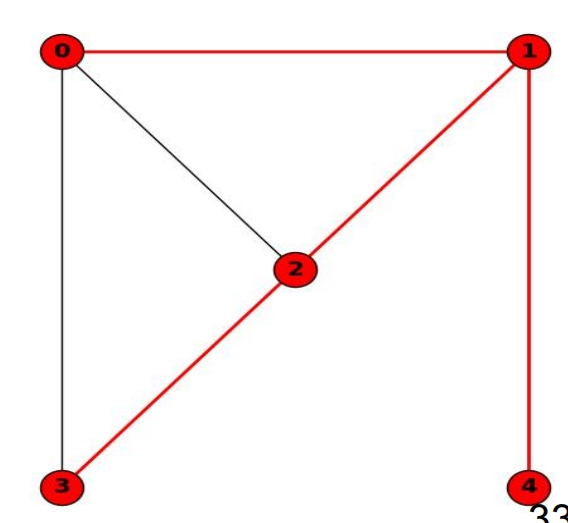

DFS 实现测试 connected graph

```java
import java.util.ArrayList;
import java.util.HashMap;
import java.util.List;
import java.util.Map;
import java.util.Arrays; // 用于打印数组

// 辅助类：表示图中的一条边
class Edge {
    int u; // 起始顶点
    int v; // 结束顶点

    public Edge(int u, int v) {
        this.u = u;
        this.v = v;
    }

    @Override
    public String toString() {
        return "(" + u + "," + v + ")";
    }
}

// 辅助类：表示 DFS 搜索树的结果
class SearchTree {
    int root;
    int[] parent;
    List<Integer> searchOrder;

    public SearchTree(int root, int[] parent, List<Integer> searchOrder) {
        this.root = root;
        this.parent = parent;
        this.searchOrder = searchOrder;
    }

    @Override
    public String toString() {
        StringBuilder sb = new StringBuilder();
        sb.append("DFS 搜索树 (根: ").append(root).append(")\n");
        sb.append("访问顺序: ").append(searchOrder).append("\n");
        sb.append("父节点关系:\n");
        for (int i = 0; i < parent.length; i++) {
            if (parent[i] != -1) {
                sb.append("  ").append(parent[i]).append(" -> ").append(i).append("\n");
            } else if (i == root) {
                sb.append("  ").append(i).append(" (根节点)\n");
            }
        }
        return sb.toString();
    }
}

// 图类：包含 DFS 实现和连通性检测
public class Graph {
    private List<Integer> vertices; // 图中所有顶点的集合（这里用List表示，索引即为顶点编号）
    private Map<Integer, List<Edge>> neighbors; // 图的邻接列表，存储每个顶点的邻居边

    /**
     * 构造函数，用于创建图。
     *
     * @param numberOfVertices 图中顶点的数量。顶点编号从 0 到 numberOfVertices - 1。
     */
    public Graph(int numberOfVertices) {
        this.vertices = new ArrayList<>(numberOfVertices);
        for (int i = 0; i < numberOfVertices; i++) {
            this.vertices.add(i); // 填充顶点，例如 0, 1, 2...
        }
        this.neighbors = new HashMap<>();
        for (int i = 0; i < numberOfVertices; i++) {
            this.neighbors.put(i, new ArrayList<>()); // 初始化每个顶点的邻接列表
        }
    }

    /**
     * 向图中添加一条无向边。
     *
     * @param u 边的第一个顶点。
     * @param v 边的第二个顶点。
     */
    public void addEdge(int u, int v) {
        // 对于无向图，添加两条有向边
        if (u >= 0 && u < vertices.size() && v >= 0 && v < vertices.size()) {
            neighbors.get(u).add(new Edge(u, v));
            neighbors.get(v).add(new Edge(v, u)); // 无向图的特性
        } else {
            System.err.println("警告: 添加边时顶点索引无效: (" + u + ", " + v + ")");
        }
    }

    /**
     * 实现深度优先搜索 (DFS) 的公共入口方法。
     * 从指定的起始顶点 v 开始执行 DFS 遍历。
     *
     * @param v DFS 遍历的起始顶点。
     * @return 一个 SearchTree 对象，包含 DFS 树的根、每个顶点的父节点以及遍历顺序。
     */
    public SearchTree dfs(int v) {
        // searchOrder: 一个列表，用于记录顶点被访问的顺序。
        List<Integer> searchOrder = new ArrayList<>();

        // parent: 一个整数数组，用于存储在 DFS 遍历树中每个顶点的父节点。
        int[] parent = new int[vertices.size()];
        // 初始化 parent 数组：所有节点的父节点都设为 -1。
        for (int i = 0; i < parent.length; i++) {
            parent[i] = -1;
        }

        // isVisited: 一个布尔数组，用于标记每个顶点是否已经被访问过。
        boolean[] isVisited = new boolean[vertices.size()];

        // 执行递归的 DFS 遍历。
        dfsRecursive(v, parent, searchOrder, isVisited);

        // 返回一个 SearchTree 对象，封装了 DFS 遍历的结果。
        return new SearchTree(v, parent, searchOrder);
    }

    /**
     * 深度优先搜索 (DFS) 的私有递归辅助方法。
     * 该方法会递归地探索图，填充父节点信息和访问顺序。
     *
     * @param v           当前正在访问的顶点。
     * @param parent      存储 DFS 树中每个顶点父节点的数组。
     * @param searchOrder 存储顶点访问顺序的列表。
     * @param isVisited   标记顶点是否已访问的布尔数组。
     */
    private void dfsRecursive(int v, int[] parent, List<Integer> searchOrder, boolean[] isVisited) {
        // 将当前顶点 v 添加到访问顺序列表中。
        searchOrder.add(v);
        // 标记当前顶点 v 为已访问。
        isVisited[v] = true;

        // 遍历当前顶点 v 的所有邻居。
        // `neighbors.get(v)` 返回顶点 v 的邻接列表（即与 v 相连的边）。
        for (Edge e : neighbors.get(v)) {
            // `e.v` 代表这条边的目标顶点，也就是 v 的一个邻居。
            // 如果这个邻居 (e.v) 尚未被访问过
            if (!isVisited[e.v]) {
                // 将当前顶点 v 设置为邻居 (e.v) 在 DFS 树中的父节点。
                parent[e.v] = v;
                // 递归地对未访问的邻居 (e.v) 进行 DFS 探索。
                dfsRecursive(e.v, parent, searchOrder, isVisited);
            }
        }
    }

    /**
     * 检测图是否是连通的。
     * 从任意一个顶点开始进行 DFS 遍历，如果所有顶点都被访问到，则图是连通的。
     *
     * @return 如果图是连通的，则返回 true；否则返回 false。
     */
    public boolean isConnected() {
        int numberOfVertices = vertices.size();
        if (numberOfVertices == 0) {
            return true; // 空图被认为是连通的
        }

        // 使用一个独立的 isVisited 数组进行连通性检查，不影响 DFS 树的构建
        boolean[] isVisitedForConnectivity = new boolean[numberOfVertices];
        List<Integer> tempSearchOrder = new ArrayList<>(); // 临时列表，用于存储访问顺序，不重要

        // 从第一个顶点 (0) 开始 DFS 遍历。如果图是连通的，所有顶点都应该被访问到。
        dfsRecursive(0, new int[numberOfVertices], tempSearchOrder, isVisitedForConnectivity);

        // 检查所有顶点是否都被访问过
        for (int i = 0; i < numberOfVertices; i++) {
            if (!isVisitedForConnectivity[i]) {
                return false; // 存在未访问的顶点，图不连通
            }
        }
        return true; // 所有顶点都被访问到，图是连通的
    }

    // --- 主方法用于测试 ---
    public static void main(String[] args) {
        System.out.println("--- 连通图测试 ---");

        // 示例 1: 连通图
        // 0 -- 1
        // |  /
        // 2 -- 3
        Graph graph1 = new Graph(4); // 4 个顶点
        graph1.addEdge(0, 1);
        graph1.addEdge(0, 2);
        graph1.addEdge(1, 2);
        graph1.addEdge(2, 3);
        System.out.println("图 1 是否连通: " + graph1.isConnected()); // 预期: true
        SearchTree dfsResult1 = graph1.dfs(0);
        System.out.println("图 1 DFS 结果 (从 0 开始):\n" + dfsResult1);

        System.out.println("\n--- 非连通图测试 ---");

        // 示例 2: 非连通图 (两个独立的连通分量)
        // 0 -- 1    2 -- 3
        Graph graph2 = new Graph(4); // 4 个顶点
        graph2.addEdge(0, 1);
        graph2.addEdge(2, 3);
        System.out.println("图 2 是否连通: " + graph2.isConnected()); // 预期: false
        SearchTree dfsResult2 = graph2.dfs(0); // 从 0 开始 DFS，只会访问 0 和 1
        System.out.println("图 2 DFS 结果 (从 0 开始):\n" + dfsResult2); // 访问顺序只包含 0, 1

        System.out.println("\n--- 单个顶点图测试 ---");
        Graph graph3 = new Graph(1); // 1 个顶点
        System.out.println("图 3 (单个顶点) 是否连通: " + graph3.isConnected()); // 预期: true
        SearchTree dfsResult3 = graph3.dfs(0);
        System.out.println("图 3 DFS 结果 (从 0 开始):\n" + dfsResult3);

        System.out.println("\n--- 空图测试 ---");
        Graph graph4 = new Graph(0); // 0 个顶点
        System.out.println("图 4 (空图) 是否连通: " + graph4.isConnected()); // 预期: true
        // 注意：对空图调用 dfs(0) 可能需要额外的错误处理，因为 0 索引不存在。
        // 对于 isConnected 而言，空图是连通的。
    }
}
```

### Breadth-First Search (BFS) 广度搜索

- Breadth-first search (BFS) visits the graph layer by layer. using **Queue**

  广度优先搜索 （BFS） **逐层访问图形**。通常通过 **队列** 实现

- It starts from the root, then visits all its neighbors (children), then the neighbors ’ neighbors (grandchildren), and so on — moving outward layer by layer.

  它从根开始，然后访问所有邻居（子），然后访问邻居的邻居（孙），依此类推-逐层向外移动。

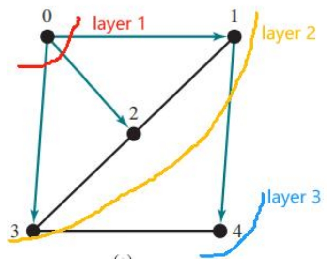

**伪代码 Logic:**

```java
Input: G = (V, E) and a starting vertex v
// 输入：图 G（包含顶点集 V 和边集 E）以及一个起始顶点 v
Output: a BFS tree rooted at v
// 输出：以 v 为根的 BFS 树

bfs (vertex v) {
    // 从给定的顶点开始，将其添加到队列中，并将其标记为已访问
    // 这一步是 BFS 遍历的起点，将起始顶点放入待探索的队列中。
    create an empty queue for storing vertices to be visited; // 创建一个空队列，用于存储待访问的顶点
    add v into the queue;                                  // 将起始顶点 v 加入队列
    mark v visited;                                        // 将顶点 v 标记为已访问（避免重复处理）

    // 当队列不为空时，它会出列（提取）一个顶点，
    // 访问其所有未访问的邻居，标记这些邻居为已访问，记录它们的父节点，并将它们添加到队列中。
    // 这个循环是 BFS 的核心，逐层探索图。
    while the queue is not empty { // 只要队列中还有待处理的顶点，就继续循环
        dequeue a vertex, say u, from the queue; // 从队列中取出（出队）一个顶点 u。u 是当前层级已被访问的顶点。
        
        // 遍历顶点 u 的每一个邻居 w。
        // 这意味着检查所有与 u 直接相连的顶点。
        for each neighbor w of u
            // 如果邻居 w 还没有被访问过
            // 检查 w 是否已被访问是避免重复处理和陷入图中的循环的关键。
            if w has not been visited {
                add w into the queue; // 将未访问的邻居 w 加入队列，等待在下一层级进行处理
                set u as the parent for w; // 将 u 设置为 w 的父节点。这用于构建 BFS 搜索树，记录路径。
                mark w visited;         // 将邻居 w 标记为已访问
            }
    }
}
```

#### Time Complexity of BFS O(|E| + |V|)

Since each edge and each vertex is visited only once, the time complexity of the dfs method is **O(|E| + |V|)**, where |E| denotes the number of edges and |V| the number of vertices.

由于每条边和每个顶点只访问一次，因此 dfs 方法的时间复杂度为 **O（|E|  |V|）**，其中 |E|表示边数， |V|顶点数。

#### Implementation of BFS 实现BFS

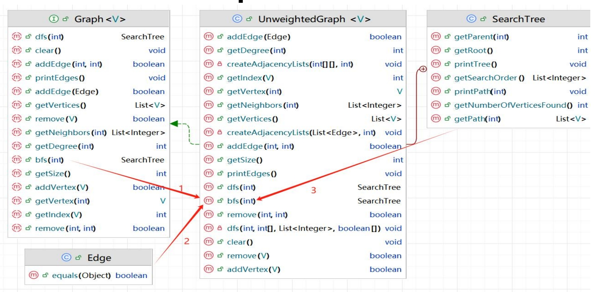

1. The bfs method in UnweightedGraph implements the bfs method in the interface

   UnweightedGraph 中的 bfs 方法在接口中实现了 bfs 方法

2. Edge class provides the edge objects to BFS for operation

   Edge类将边缘对象提供给BFS进行操作

3. SearchTree (inner class) serves as the container and printer of the BFS results

   SearchTree（内部类）用作BFS结果的容器和打印机

#### Applications of the BFS 广度搜索的应用

- Detecting whether a graph is connected (i.e., if there is a path between any two vertices in the graph)

  检测图是否属于连接图（即图中任意两个顶点之间是否存在路径）

  - check is the size of the spanning tree is the same with the number of vertices

    检查生成树的大小是否与图的顶点数相同

- Detecting whether there is a path between two vertices

  检测两个顶点之间是否存在路径

  - Compute the BFS from the first vertex and check if the second vertex is reached

    从第一个顶点计算BFS，并检查是否到达第二个顶点

- Finding all connected components

  查找所有连通子图

- Finding a **shortest path** between two vertices (in unweighted graph case)

  在两个顶点之间找到最短路径（在未加权图的情况下）

  - Because BFS explores all vertices with 1 edge away, then 2 edges away, etc., it guarantees that the first time we reach a vertex, it is through the shortest possible edge count

    因为 BFS 先探索第一层所有顶点，然后探索第二层所有的边，以此类推，所以它可以保证我们第一次到达顶点时，是通过尽可能短的边数

## Weighted Graph 加权边

- A graph is a **weighted graph** if each edge is assigned a weight (value). 

  如果为每条边分配了**权重（值）**，则该图是**加权图**。

- For example: assume that the edges represent the driving distances among the cities

  例如：假设边表示城市之间的行驶距离

三种通过数据结构形式表现加权边的方法

1. Using **Edge Array**
2. Using **adjacency matrices**
3. Using **adjacency list**

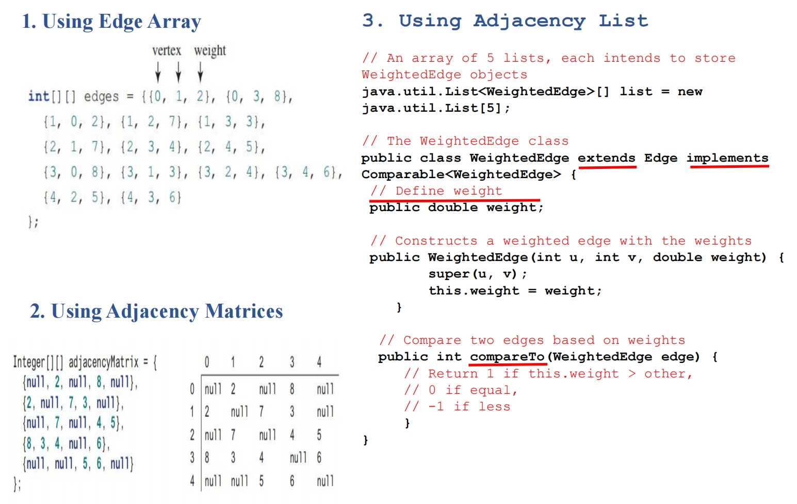

### Modeling Weighted Graphs 有权图模型

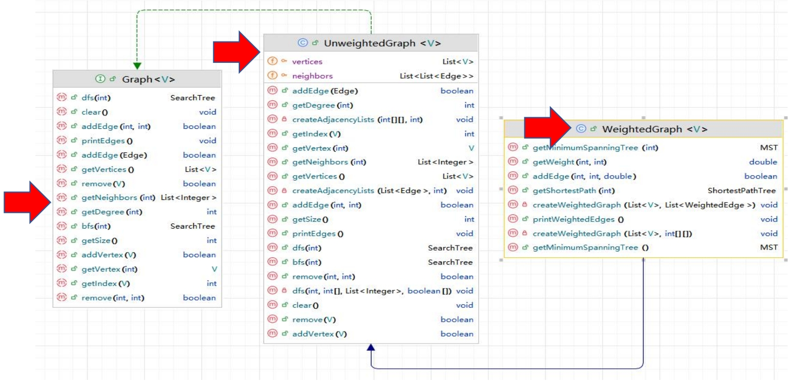

- **Graph<V>** is an interface that defines the common behavior of a graph. 

  Graph<V> 是一个定义图的公共行为的接口。

- **UnweightedGraph<V>** implements the **Graph<V>** interface, focusing on dealing with unweighted graphs. 

  UnweightedGraph<V> 实现了 Graph<V> 接口，专注于处理未加权的图。

- **WeightedGraph<V>** extends **UnweightedGraph<V>** to reuse foundational methods and data structures, while introducing additional capabilities for handling weighted graphs

  WeightedGraph<V> 扩展了 UnweightedGraph<V> 以重用基础方法和数据结构，同时引入了处理加权图的额外功能

### Minimum Spanning Tree 最小生成树

- A **spanning tree** of a graph G is a **connected subgraph** of G and the subgraph **is a tree that contains ALL vertices in G**

  图G的生成树是G的 **连通子图**，子图是 **包含G中所有顶点的树**

- A **minimum spanning tree** is a spanning tree **with the minimum total weight**

  **最小生成树** 是 **总权重最小的生成树**

- A graph may have many minimum spanning trees

  一个图可以有许多最小生成树

- Application example: a company wants to create the Internet lines to connect all the customers together

  应用程序示例：一家公司希望创建 Internet 线路以将所有客户连接在一起 

  - There are many ways (i.e., streets) to connect all customers together

    有多种方法（即街道）可以将所有客户连接在一起

  - Different lines have different cost (e.g., length)

    不同的线路具有不同的成本（例如，长度）

  - The cheapest way is to find a spanning tree with the minimum total cost

    最便宜的方法是找到总成本最低的生成树

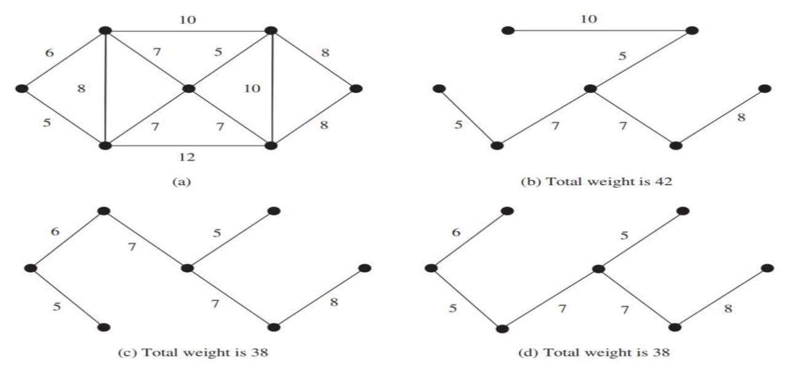

#### Prim’s Minimum Spanning Tree Algorithm Prim的最小生成树算法

初始**伪代码**： 

```java
Input: G = (V, E)
Output: a MST

MST getMinimumSpanningTree(s) {
    Let V denote the set of vertices in the graph;
    Let T be a set for the vertices in the spanning tree;
    Initially, add the starting vertex to T;
    while (size of T < n) {
        find u in T and v in V – T with the smallest weight on the edge (u, v), as shown in the figure;
        add v to T;
    }
}
```

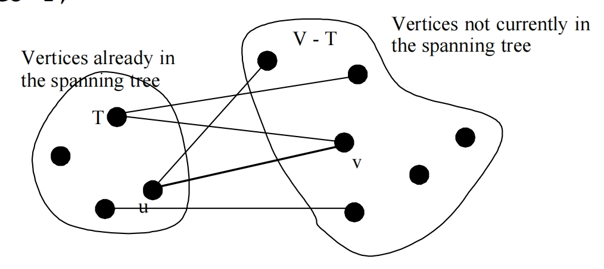

#### Refined Version of Prim’s MST Algorithm  Prim MST算法的改进版本

优化过后的**伪代码：**

```java
MST getMinimumSpanningTree (s) {
    // Input: G = (V, E), weighted graph; s = starting vertex (任选一个起始顶点)
    // 输入：加权图 G（包含顶点集 V 和边集 E），以及一个起始顶点 s
    // Output: 最小生成树 (MST)

    // 初始化 T = [在生成树中的顶点集合]; V = [图中所有顶点]
    // cost[s] = 0; cost[v] (将顶点 v 添加到生成树 T 的成本) = 无限大 (♾️)
    // 初始时，将所有顶点到生成树的“连接成本”设置为无穷大，只有起始顶点 s 到自身的成本为 0。

    // T 是一个集合，包含在生成树中的顶点；初始时 T 为空。
    Let T be a set that contains the vertices in the spanning tree; Initially T is empty;
    // 设置起始顶点 s 连接到生成树的成本为 0；对于 V 中所有其他顶点 v，设置其连接成本为无穷大。
    // 这个 cost[v] 表示将顶点 v 连接到当前已构建的 MST 的最短边的权重。
    Set cost[s] = 0; and cost[v] = infinitely for all other vertices in V;
    // 此外，还需要一个数组来记录每个顶点的“父节点”，即哪条边将其连接到 MST。
    // 通常会有一个 parent[v] 数组，初始设置为 -1 或 null。

    // 当 T 集合中的顶点数量小于图的总顶点数时，循环继续。
    // 这意味着还需要将更多的顶点添加到生成树中。
    while (size of T < n) { // n 是图中顶点的总数量
        // 在所有尚未包含在 T 集合中的顶点中，找到一个具有最小 cost[u] 的顶点 u。
        // 这个顶点 u 是当前最便宜的、可以从已构建的 MST 扩展出去的顶点。
        Find u not in T with the smallest cost[u];

        // 将找到的顶点 u 添加到 T 集合中。
        // 这表示 u 现在是 MST 的一部分了。
        Add u to T;

        // 遍历顶点 u 的所有邻居边 (u, v)。
        // 这一步是为了检查通过 u 连接邻居是否能提供更低的成本。
        for (each (u, v) in E) // E 是边的集合，w(u, v) 是边 (u, v) 的权重
            // 如果邻居 v 尚未包含在 T 集合中（即它还不是 MST 的一部分），
            // 并且通过边 (u, v) 连接 v 的成本（w(u, v)）小于当前记录的 cost[v]（即有更便宜的连接方式）。
            if (v not in T && cost[v] > w(u, v)) {
                // 更新 cost[v] 为更低的成本 w(u, v)。
                // 这意味着找到了从 MST 到 v 的更短的边。
                cost[v] = w(u, v);
                // 将 u 设置为 v 的父节点。
                // 这条边 (u, v) 将是 v 连接到 MST 的那条边。
                parent[v] = u;
            }
    }
    // (伪代码中没有显式返回 MST，但通常会根据 parent 数组来构建并返回 MST 的边集)
}
```

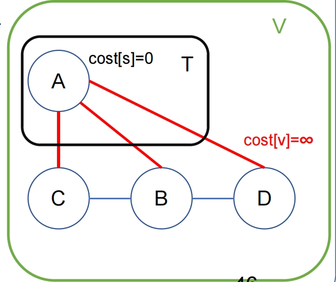

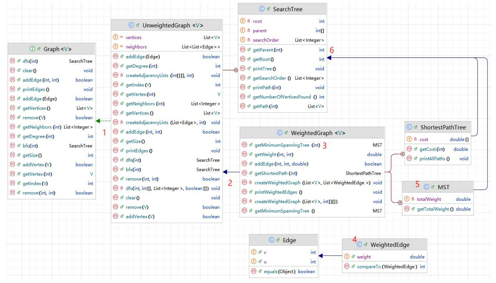

1. UnweightedGraph implements Interface

   UnweightedGraph 实现接口

2. WeightedGraph extends the UnweightedGraph (for methods/data structures reuse)

   WeightedGraph 扩展了 UnweightedGraph（用于方法/数据结构重用）

3. WeightedGraph defines the getMinimumSpanningTree method

   WeightedGraph 定义了 getMinimumSpanningTree 方法

4. WeightedEdge extends Edge (for reuse) to provide weighted edge objects to MST operation. 

   WeightedEdge 扩展了Edge（用于重用），为MST操作提供加权边对象。

5. MST method serves as the container and printer for the MST results

   MST方法用作MST结果的容器和打印

6. MST extends SearchTree (for reuse)

   MST扩展了SearchTree（用于重用）

**MST 实例代码：**

```java
/**
 * 获取以顶点0为根的最小生成树
 * @return 最小生成树对象
 */
public MST getMinimumSpanningTree() {
    return getMinimumSpanningTree(0); // 默认从顶点0开始构建最小生成树
}

/**
 * 获取以指定顶点为根的最小生成树（Prim算法实现）
 * @param startingVertex 起始顶点索引
 * @return 最小生成树对象
 */
public MST getMinimumSpanningTree(int startingVertex) {
    // cost数组记录将顶点v加入生成树的最小代价
    double[] cost = new double[getSize()];
    // 初始化所有顶点的代价为无穷大
    for (int i = 0; i < cost.length; i++)
        cost[i] = Double.POSITIVE_INFINITY;
    cost[startingVertex] = 0; // 起始顶点的代价设为0
    
    // parent数组记录每个顶点在生成树中的父节点
    int[] parent = new int[getSize()];
    parent[startingVertex] = -1; // 起始顶点作为根节点，父节点设为-1
    
    double totalWeight = 0; // 生成树的总权重
    List<Integer> T = new ArrayList<>(); // 已加入生成树的顶点集合
    
    // 扩展生成树，直到包含所有顶点
    while (T.size() < getSize()) {
        // 在未加入的顶点中寻找代价最小的顶点u
        int u = -1; // 待确定的顶点
        double currentMinCost = Double.POSITIVE_INFINITY;
        for (int i = 0; i < getSize(); i++) {
            if (!T.contains(i) && cost[i] < currentMinCost) {
                currentMinCost = cost[i];
                u = i;
            }
        }
        
        T.add(u); // 将顶点u加入生成树
        totalWeight += cost[u]; // 累加生成树的总权重
        
        // 更新与u相邻且未加入生成树的顶点的最小代价
        for (Edge e : neighbors.get(u)) {
            if (!T.contains(e.v) && cost[e.v] > ((WeightedEdge)e).weight) {
                cost[e.v] = ((WeightedEdge)e).weight; // 更新最小代价
                parent[e.v] = u; // 设置父节点
            }
        }
    }
    
    // 返回最小生成树对象，包含起始顶点、父节点数组、顶点集合和总权重
    return new MST(startingVertex, parent, T, totalWeight);
}
```

**MST 测试代码：**

```java
public class TestMinimumSpanningTree {
    public static void main(String[] args) {
        String[] vertices = {"Seattle", "San Francisco", "Los Angeles",
                             "Denver", "Kansas City", "Chicago", "Boston", "New York",
                             "Atlanta", "Miami", "Dallas", "Houston"};
        int[][] edges = {
            {0, 1, 807}, {0, 3, 1331}, {0, 5, 2097}, {1, 0, 807}, {1, 2, 381}, {1, 3, 1267},
            {2, 1, 381}, {2, 3, 1015}, {2, 4, 1663}, {2, 10, 1435},
            {3, 0, 1331}, {3, 1, 1267}, {3, 2, 1015}, {3, 4, 599}, {3, 5, 1003},
            {4, 2, 1663}, {4, 3, 599},{4, 5, 533},{4, 7, 1260},{4, 8, 864}, {4, 10, 496},
            {5, 0, 2097}, {5, 3, 1003}, {5, 4, 533}, {5, 6, 983}, {5, 7, 787},
            {6, 5, 983}, {6, 7, 214},
            {7, 4, 1260}, {7, 5, 787}, {7, 6, 214}, {7, 8, 888},
            {8, 4, 864}, {8, 7, 888}, {8, 9, 661}, {8, 10, 781}, {8, 11, 810},
            {9, 8, 661}, {9, 11, 1187},
            {10, 2, 1435}, {10, 4, 496}, {10, 8, 781}, {10, 11, 239},
            {11, 8, 810}, {11, 9, 1187}, {11, 10, 239}
        };
        
        WeightedGraph<String> graph1 = new WeightedGraph<>(vertices, edges);
        WeightedGraph<String>.MST tree1 = graph1 .getMinimumSpanningTree();
        System. out. println( " Total weight is " + tree1 . getTotalWeight( ) ) ;
        tree1 .printTree();
        
        edges = new int[][]{
            {0, 1, 2}, {0, 3, 8},
            {1, 0, 2}, {1, 2, 7}, {1, 3, 3},
            {2, 1, 7}, {2, 3, 4}, {2, 4, 5},
            {3, 0, 8}, {3, 1, 3}, {3, 2, 4}, {3, 4, 6},
            {4, 2, 5}, {4, 3, 6}
        };
        
        WeightedGraph<Integer> graph2 = new WeightedGraph<>(edges, 5);
        WeightedGraph<Integer>.MST tree2 = graph2 .getMinimumSpanningTree(1);
        System.out.println("\nTotal weight is " + tree2 .getTotalWeight());
        tree2 .printTree();
    }
}
```

### Shortest Path 最短路径

- Find shortest path between two vertices in the graph

  查找图形中任意两个顶点之间的最短路径

  - The **shortest path** between two vertices is a path with the **minimum total weight**

    两个顶点之间的最短路径是**总权重最小的路径**

- Dijkstra 是找起始点到其他每个点的最短路径

#### Single Source Shortest Path Algorithm  单源最短路径算法

Input: a graph G = (V, E) with non-negative weights

输入：具有非负权重的图G=（V，E）

Output: a shortest path tree with the source vertex s as the root

输出：以源顶点 s 为根的最短路径树

Shortest Path **伪代码：** 

```java
ShortestPathTree getShortestPath(s) {
    // Input: G = (V, E), weighted graph with non-negative edge weights; s = starting vertex
    // 输入：加权图 G（包含顶点集 V 和边集 E），所有边的权重必须是非负数；s 为起始顶点
    // Output: 从起始顶点 s 到图中所有其他顶点的最短路径树 (ShortestPathTree)

    // 初始化 T = [其到起始点s的路径已经确定的顶点集合]; V = [图中所有顶点]
    // cost[s] = 0; cost[v] (从起始点 s 到顶点 v 的当前最短路径成本) = 无限大 (∞)
    // 初始时，所有顶点到起始顶点 s 的路径成本都设为无穷大，只有起始顶点 s 到自身的成本为 0。

    // T 是一个集合，包含到 s 的最短路径已知的顶点；初始时 T 为空。
    Let T be a set that contains the vertices whose paths to s are known; Initially T is empty;
    // 设置起始顶点 s 到自身的成本为 0；对于 V 中所有其他顶点 v，设置其到 s 的成本为无穷大。
    // 这个 cost[v] 将在算法执行过程中不断更新，记录从 s 到 v 的当前发现的最短路径长度。
    Set cost[s] = 0; and cost[v] = infinity for all other vertices in V;
    // 此外，通常还需要一个 parent[v] 数组来记录每个顶点在其最短路径树中的前驱节点，
    // 以便在算法结束后能够重建从 s 到 v 的最短路径。初始时 parent[v] 可以设为 -1 或 null。
    // parent[v] 数组通常会在循环内部被更新。

    // 当 T 集合中的顶点数量小于图的总顶点数时，循环继续。
    // 这意味着还需要找到更多顶点到 s 的最短路径。
    // 当顶点在 T 集合之外时，找到一个具有最小成本的顶点，将其添加到 T 集合，并更新其邻居的成本（为了下一轮）。
    while (size of T < n) { // n 是图中顶点的总数量
        // 在所有尚未包含在 T 集合中的顶点中，找到一个具有最小 cost[u] 的顶点 u。
        // 这个顶点 u 是当前所有“待定”顶点中，到起始点 s 路径最短的顶点。
        Find u not in T with the smallest cost[u];

        // 将找到的顶点 u 添加到 T 集合中。
        // 这表示 u 到起始点 s 的最短路径已经确定，u 及其到 s 的最短路径边成为最短路径树的一部分。
        Add u to T;

        // 遍历顶点 u 的每一个邻居边 (u, v)。
        // 这一步是 Dijkstra 算法的核心：尝试通过顶点 u “松弛”它的所有邻居的路径成本。
        for (each (u, v) in E) // E 是边的集合，w(u, v) 是边 (u, v) 的权重
            // 如果邻居 v 尚未包含在 T 集合中（即 v 到 s 的最短路径尚未确定），
            // 并且通过顶点 u 到达 v 的新路径成本 (cost[u] + w(u, v)) 小于当前记录的 cost[v]（即找到了更短的路径）。
            if (v not in T and cost[v] > cost[u] + w(u, v)) {
                // 更新 cost[v] 为更低的成本 (cost[u] + w(u, v))。
                // 这意味着通过 u 找到了从 s 到 v 的更短的路径。
                cost[v] = cost[u] + w(u, v);
                // 将 u 设置为 v 在最短路径树中的前驱节点。
                // 这条边 (u, v) 是 v 最短路径上的最后一条边。
                parent[v] = u;
            }
    }
    // (伪代码中没有显式返回 ShortestPathTree，但通常会根据 parent 和 cost 数组来构建并返回结果)
}
```

### Prim vs. Dijkstra

Both of them initialize an **empty T** set to keep track of the processed vertices and **cost[s]=0**, **cost[v]=∞**

它们都初始化了一个空T集来跟踪处理过的顶点，cost[s]=0，cost=∞，从点E开始。

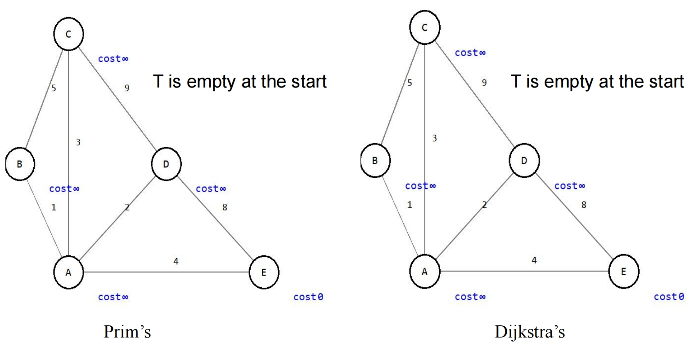

Both of them iteratively use the **while-for loop** structure to

两者都迭代地使用 **while-for** 循环结构

- Select the **minimum cost[v] not in T**, and add it to T set

  选择**不在T 中的最小 cost [v]**，并将其添加到T集合中

- **Update** cost[v] and parent[v]

  更新 cost[v] 和 parent [v]

```java
While (vertices outside T){
    // find min cost[v] and add to T
    for (each (u,v) in E)
        if (conditions){
            //update the cost[v], parent[v]
        }
}
```

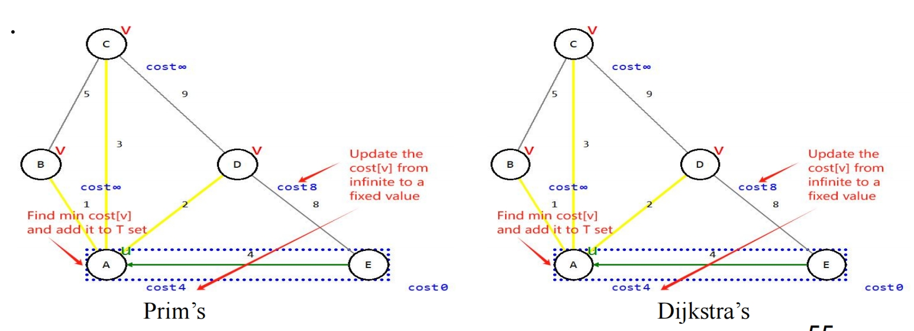

BUT:

- The cost[v] in **Prim’s algorithm** is the cost to the T set

  Prim算法  中的cost[v]是**T集**的cost

  - cost[B] = 1, because **cost[v] = w(u, v)**. 

  - Because w(A,B)=1, cost[B]=1. 

- The cost[v] in **Dijkstra’s algorithm** is the cost to the source (the very first starting vertex)

  Dijkstra算法中的cost[v]是**源**（第一个起始顶点）的cost

  - cost[B] = 5, because **cost[v] = w(u, v) + cost[u]**. 

  - Because w(A,B)=1, cost[u]=4, cost[B]=1+4=5.

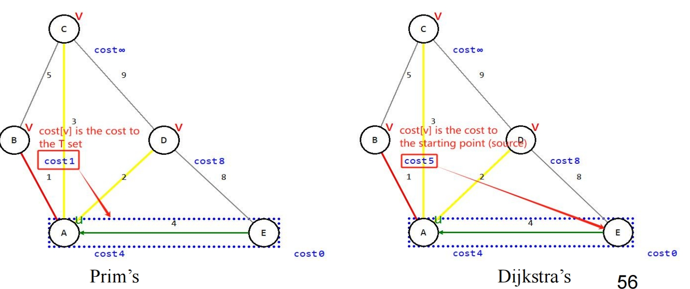

OVERALL

The goal of Prim’s algorithm is to **connect all vertices with the minimum total edge weight**

Prim 算法的目标是 **连接具有最小总边权重的所有顶点**

The goal of Dijkstra’s algorithm is to **find the shortest path from a source s to every other vertex**

Dijkstra算法的目标是 **找到从源s到其他顶点的最短路径**

从 F 点开始

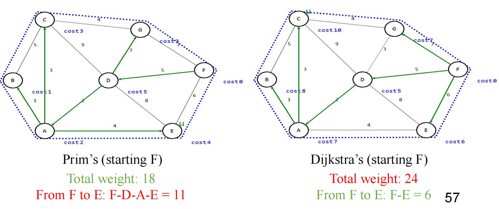

Shortest Path **实例代码**：

```java
/**
 * 获取从源顶点到所有其他顶点的最短路径（Dijkstra算法实现）
 * @param sourceVertex 源顶点索引
 * @return 最短路径树对象
 */
public ShortestPathTree getShortestPath(int sourceVertex) {
    // cost数组记录从源顶点到各顶点的最短路径代价
    double[] cost = new double[getSize()];
    // 初始化所有顶点的路径代价为无穷大
    for (int i = 0; i < cost.length; i++)
        cost[i] = Double.POSITIVE_INFINITY;
    cost[sourceVertex] = 0; // 源顶点到自身的代价为0
    
    // parent数组记录最短路径中每个顶点的前驱顶点
    int[] parent = new int[getSize()];
    parent[sourceVertex] = -1; // 源顶点没有前驱顶点，设为-1
    
    // T集合存储已找到最短路径的顶点
    List<Integer> T = new ArrayList<>();
    
    // 扩展T集合，直到包含所有顶点
    while (T.size() < getSize()) {
        // 在未确定最短路径的顶点中寻找当前代价最小的顶点u
        int u = -1; // 待确定的顶点
        double currentMinCost = Double.POSITIVE_INFINITY;
        for (int i = 0; i < getSize(); i++) {
            if (!T.contains(i) && cost[i] < currentMinCost) {
                currentMinCost = cost[i];
                u = i;
            }
        }
        
        T.add(u); // 将顶点u加入已确定集合
        
        // 松弛操作：更新u的邻接顶点的最短路径估计
        for (Edge e : neighbors.get(u)) {
            // 如果通过u到达v的路径比当前记录更短，则更新
            if (!T.contains(e.v) 
                && cost[e.v] > cost[u] + ((WeightedEdge)e).weight) {
                cost[e.v] = cost[u] + ((WeightedEdge)e).weight; // 更新路径代价
                parent[e.v] = u; // 更新前驱顶点
            }
        }
    }
    
    // 返回最短路径树对象，包含源顶点、前驱顶点数组、顶点集合和路径代价
    return new ShortestPathTree(sourceVertex, parent, T, cost);
}
```

其中 

```java
// Executes n times, where n = number of vertices
while (T.size() < getSize()) {   // while (T.size() < getSize())
    // n times for loop to find the min cost[v]
    // !T.contains(i) is O(n) per call, (since T is an ArrayList)
    // so n*n = O(n^2)
    for (int i = 0; i < getSize(); i++) {  // for (int i = 0; i < getSize(); i++)
        if (!T.contains(i) && cost[i] < min) {
            ... }
    }
    // n times to update neighbor values
    // !T.contains(i) is O(n) per call, (since T is an ArrayList)
    // so n*n = O(n^2)
    for (each neighbor v) {  // for (Edge e : neighbors.get(u))
        if (!T.contains(v) && ...) {
            ... }
    }
}
```

**Time complexity: O(n) × O(n^2) + O(n) × O(n^2) = O(n^3)**

**Similar in the Prim’s MST algorithm, but is this efficient?**

|   **对比项**   |               **Prim算法**               |             **Dijkstra算法**             |
| :------------: | :--------------------------------------: | :--------------------------------------: |
|    **用途**    |    求解 **无向图的最小生成树（MST）**    |   求解 **有向图/无向图的单源最短路径**   |
|    **目标**    |     连接所有顶点，使 **总边权最小**      |  从源点到其他顶点，使 **路径总权最小**   |
|  **数据结构**  |       优先队列（按 **边权** 排序）       |     优先队列（按 **路径距离** 排序）     |
|  **贪心策略**  |   每次选择 **当前最小权边** 加入生成树   |  每次选择 **当前最短路径顶点** 进行松弛  |
|  **更新规则**  |      更新未加入顶点的 **最小边权**       |    更新未确定顶点的 **最短路径估计**     |
|   **负权边**   |       **可以处理**（只要总权最小）       |      **不能处理**（结果可能不正确）      |
| **父节点数组** |     记录顶点在 **生成树中的父节点**      |   记录顶点在 **最短路径中的前驱节点**    |
|   **初始化**   |         源点 cost=0，其他 cost=∞         |         源点 cost=0，其他 cost=∞         |
|  **典型应用**  |    网络布线、道路规划（连通所有节点）    |     导航系统、路由算法（求最短路径）     |
| **时间复杂度** | O(V²)（邻接矩阵）或 O(E log V)（堆优化） | O(V²)（邻接矩阵）或 O(E log V)（堆优化） |
| **空间复杂度** |                   O(V)                   |                   O(V)                   |

