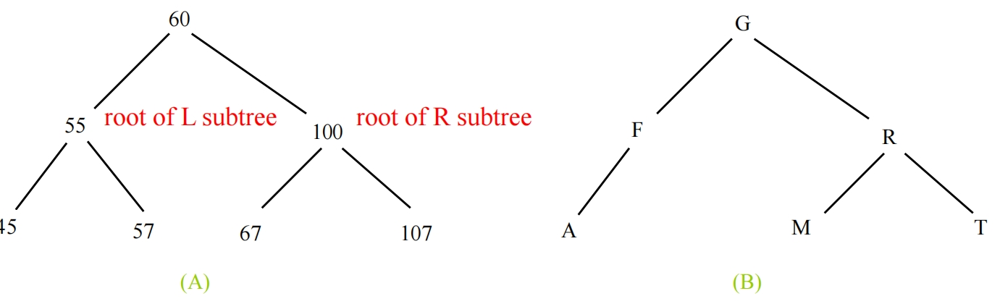
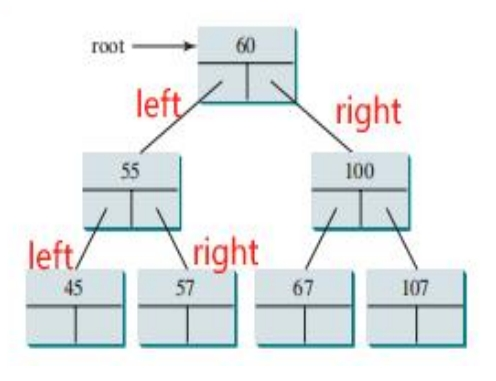
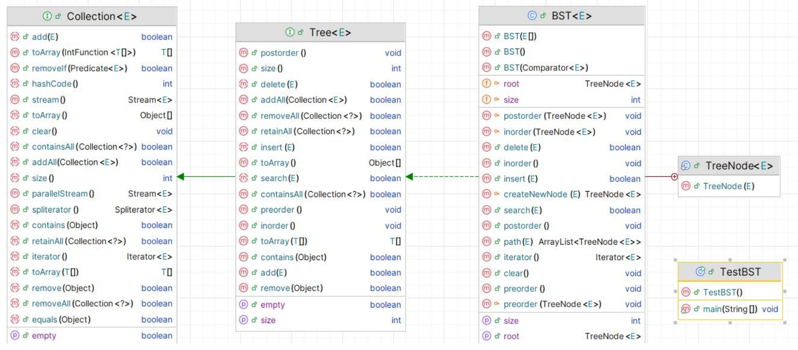
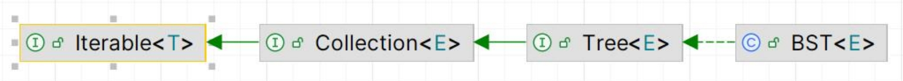
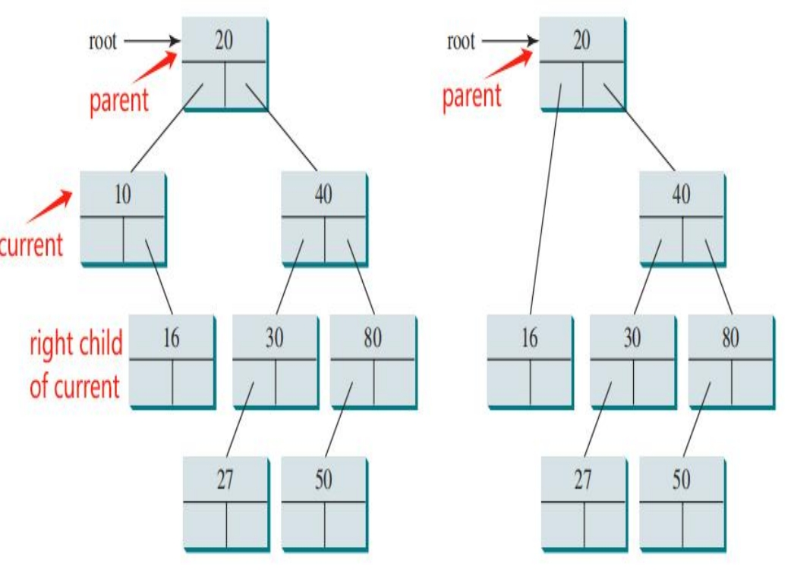
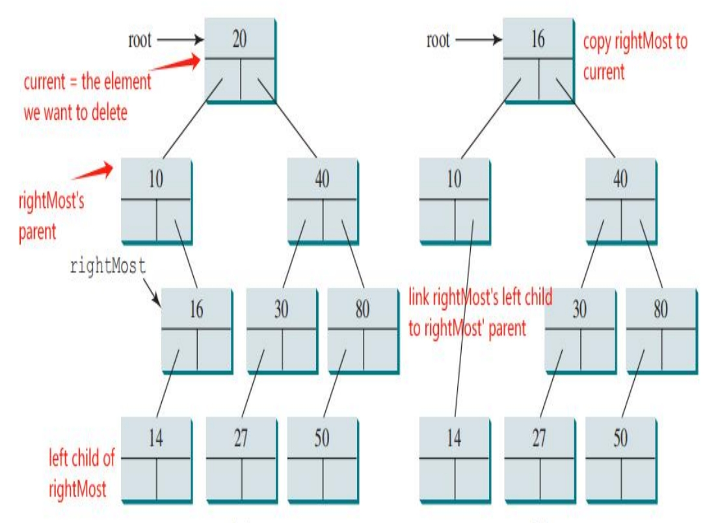
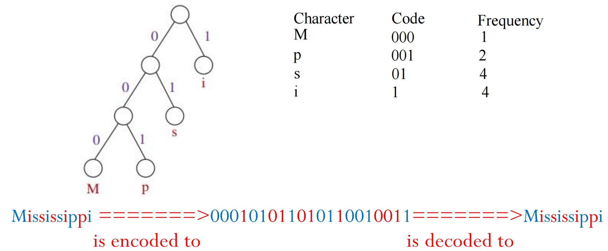
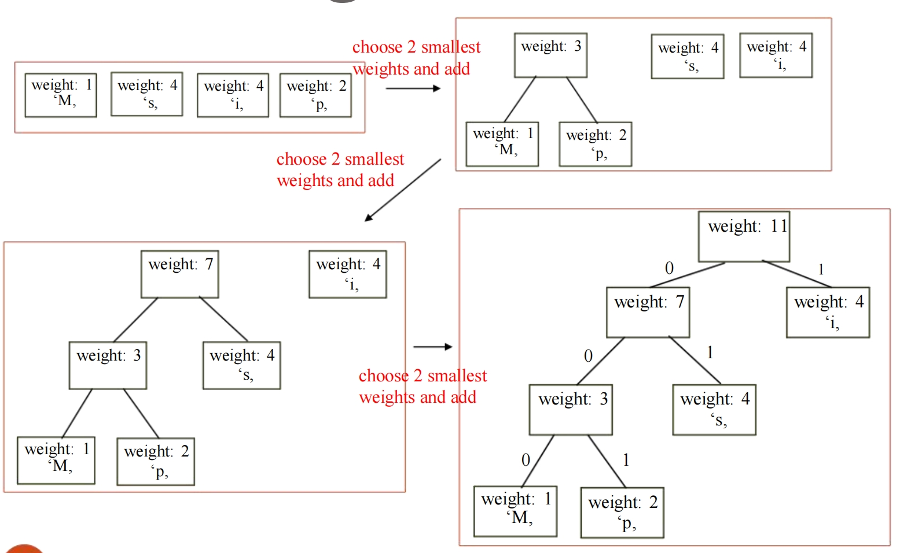
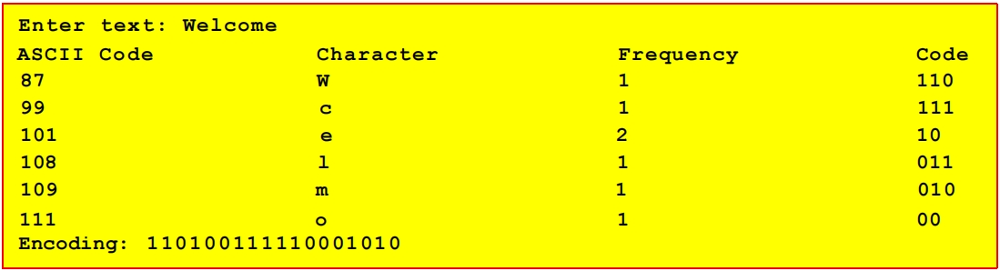

# Binary Search Tree 二分搜索树

## **Objectives**

- To **design and implement a binary search tree**

  设计和实现二叉搜索树

- To **represent binary trees using linked data structures**

  **使用链接数据结构表示二叉树**

- To **insert an element** into a binary search tree

  在二分查找树中 **插入元素**

- To **search an element** in binary search tree

  在二叉查找树中  **查找元素** 

- To **traverse elements** in a binary tree

  在二叉树中 **遍历元素**

- To **create iterators** for traversing a binary tree

  要 **创建迭代器** 以遍历二叉树

- To **delete elements** from a binary search tree

  从二叉搜索树中 **删除元素**

- To **implement Huffman coding** for compressing data using a binary tree

  **实现霍夫曼编码**，使用二叉树压缩数据

## Binary Tree 二叉树

- A **binary tree** is a **hierarchical** structure: it is either empty or consists of an element, called the **root**, and two distinct binary trees, called the **left subtree** and **right subtree**

  二叉树是 **层次结构**：它要么是空的，要么由一个称为 **根的元素** 和 **两个不同的二叉子树** 组成，称为 **左子树** 和 **右子树**

  - The root of left (right) subtree of a node is called a **left (right) child** of the node

    一个节点的 **左（右）子树** 的 **根** 称为该节点的 **left（right）child**

  - A node without children is called a **leaf**

    没有子节点的节点称为 **叶子节点**



## Representing Binary Tree 表示二叉树

A binary tree can be represented using a set of **linked nodes**: each node contains an **element** value and two links named **left** and **right** that reference the left child and right child

二叉树可以用一组 **链接节点** 来表示：每个节点包含一个 **元素值** 和两个名为 **left** 和 **right** 的链接，这两个链接引用了**左子节点**和**右子节点** （左小右大）

```java
class TreeNode<E> {
    // The value stored in this node (of generic type E)
    // 当前节点存储的元素
    E element;
    // Reference to the left and right child nodes
    // 左节点
    TreeNode<E> left;
    // 右节点
    TreeNode<E> right;
    // Constructor
    // initialize the node with a given value
    public TreeNode (E o) {
        element = o;
    }
}
```



## Binary Search Trees (BST) 二叉搜索树

A special type of binary trees, called **binary** **search** **tree** is a binary tree with

1. **no duplicate elements (by default)** and，

   **没有重复的元素**（默认情况下）

2. the property that **for every node in the tree** the value of any node in its **left subtree is less** than the value of the node and the value of any node in its **right subtree is greater** than the value of the node

   属性 **对于树中的每个节点** 其 **左子树** 中任何节点的值小于节点的值，并且其 **右子树** 中任何节点的值大于节点的值

### Inserting an Element to a Binary Search Tree 二叉搜索树插入操作

```java
/**
     * 将一个元素插入到二叉搜索树中。
     * 如果元素已存在，则不插入并返回 false。
     * 假设 E 实现了 Comparable 接口。
     * @param element 要插入的元素
     * @return 如果插入成功返回 true，如果元素已存在返回 false
*/
public boolean insert(E element) {
    // Condition 1: If the tree is empty (with no root), create the root node using the given element
    // 条件1：如果树为空（没有根），则使用给定的元素创建根节点
    if (root == null)
        root = new TreeNode(element);  // 创建新节点作为根
    else {
        // Locate the parent node
        // 树不为空，需要找到合适的插入位置
        // 从根节点开始进行查找
        Node<E> current = root, parent = null;  // 'current' 指针用于遍历树，从根开始
        // 如果当前的节点不是null
        while (current != null)
            // Condition 2: If the tree is not empty, create 2 pointers ‘current’ and ‘parent’ and use the while loop to find the location we want to insert
            // 条件2：如果树不为空，则创建2个指针“current”和“parent”，使用while循环查找要插入的位置
            // 如果待插入元素小于当前节点元素，则向左子树移动
            if (element < current.element) {
                parent = current;
                current = current.left;
            // 如果待插入元素大于当前节点元素，则向右子树移动
            } else if (element > current.element) {
                parent = current;
                current = current.right;
            } else
                // 元素已存在于树中，不允许重复插入
                return false;  // 插入失败，元素重复
        
        // After finding the parent node location, compare the element with the value of the parent node, and attach the newly created node to either left or right of the parent
        // 找到父节点位置后，将元素与父节点的值进行比较，并将新创建的节点附加到父节点的左侧或右侧
        if (element < parent.element)
            parent.left = new TreeNode(element);
        else
            parent.right = new TreeNode(element);
        return true; // Element inserted
    }
}
```

### Searching an Element in a Binary Search Tree 二叉搜索树搜索操作

```java
public boolean search(E element) {
    // Start from the root
    TreeNode<E> current = root;
    while (current != null)
        if (element < current.element) {
            current = current.left; // Go left
        } else if (element > current.element) {
            current = current.right; // Go right
        } else // Element matches current.element
            return true; // Element is found
    return false; // Element is not in the tree
}
```

- **Tree traversal** is the process of visiting each node in the tree exactly once. There are several ways to traverse a tree: **preorder, inorder**, **postorder**, **depth-first**, **breadth-first** traversals

  **树遍历**是访问树中每个节点一次的过程。遍历树有几种方法：**前序**、**中序**、**后序**、**深度优先**、**广度优先**遍历

  - With **preorder traversal**, the **current node** is visited first, then recursively the **left subtree** of the current node, and finally the **right subtree** of the current node recursively “Recursively ” : follow the same Node-Left-Right order in every subtree we will visit

    使用**前序遍历**，首先访问**当前节点**，然后递归访问当前节点的**左子树**，最后递归“递归”访问当前节点**右子树**：在我们将访问的每个子树中遵循相同的节点左右顺序

  - The **inorder traversal** is to visit the **left** subtree of the current node first recursively, then the **current node** itself, and finally the **right** subtree of the current node recursively (Left-Node-Right)

    **中序遍历** 是首先递归访问当前节点的 **左子树**，然后是 **当前节点** 本身，最后递归访问当前节点的 **右子树** （Left-Node-Right）

  - The **postorder traversal** is to visit the **left** subtree of the current node first, then the **right** subtree of the current node, and finally the **current node** itself (Left-Right-Node)

    **后序遍历** 是先访问当前节点的 **左子树**，然后是当前节点的 **右子树**，最后是 **当前节点** 本身 （Left-Right-Node）

  - The **breadth-first traversal** is to visit the nodes **level by level**: first visit the root, then all children of the root from left to right, then grandchildren of the root **from left to right**, and so on

    **广度优先遍历** 是逐级访问节点 **逐级访问**：首先访问根，然后从左到右访问根的所有子节点，然后 **从左到右** 访问根的孙子节点，以此类推

  - The **depth-first traversal** is to visit the nodes **branch by branch from left to right**

    **深度优先遍历** 是从左到右逐分支访问节点

- Inorder: Left, Node, Right

- Postorder: Left, Right, Node

- Preorder: Node, Left, Right

- Breadth-First: Level by level, left to right

- Depth-First: Branch by branch, left to right

- **O(n) for all traversals**

```java
// 中序遍历
@Override /** Inorder traversal from the root */
public void inorder() {
    inorder(root);
}
/** Inorder traversal from a subtree */
protected void inorder(TreeNode<E> root) {
    if (root == null) return;
    inorder(root.left); // first left substree
    System.out.print(root.element + " "); // then root
    inorder(root.right); // last subtree
}

// 后序遍历
@Override /** Postorder traversal from the root */
public void postorder() {
    postorder(root);
}
/** Postorder traversal from a subtree */
protected void postorder (TreeNode<E> root) {
    if (root == null) return;
    postorder(root.left);
    postorder(root.right);
    System.out.print(root.element + " ");
}

// 前序遍历
@Override /** Preorder traversal from the root */
public void preorder() {
    preorder(root);
}

/** Preorder traversal from a subtree */
protected void preorder(TreeNode<E> root) {
    if (root == null) return;
    System.out.print(root.element + " ");  // 先访问根节点
    preorder(root.left);                   // 再遍历左子树
    preorder(root.right);                  // 最后遍历右子树
}
```

A program that creates a binary tree using BST and adds strings into the binary tree and traverse the tree in inorder, postorder, and preorder:

一个使用 BST 创建二叉树并将字符串添加到二叉树中并以 inorder、postorder 和 preorder 遍历树的程序：

```java
public class TestBSTWithIterator {
    public static void main(String[] args) {
        // Create a BST
        BST<String> tree = new BST<>();
        tree.insert("George");
        tree.insert("Michael");
        tree.insert("Tom");
        tree.insert("Adam");
        tree.insert("Jones");
        tree.insert("Peter");
        tree.insert("Daniel");
        // Traverse tree
        System.out.print("\nPreorder: ");
        tree.preorder();
        System.out.print("Inorder (sorted): ");
        tree.inorder();
        System.out.print("\nPostorder: ");
        tree.postorder();

        // tree的大小
        System.out.print("\nThe number of nodes is " + tree.getSize ());
        
        // Search for an element 查找给定的元素是否存在
        System.out.print("\nIs Peter in the tree?" + tree.search("Peter"));
        
        // Get a path from the root to Peter 获取到达之情元素的路径
        System.out.print("\nA path from the root to Peter is: ");
        java.util.ArrayList<BST.TreeNode<String>> path = tree.path("Peter");
        for (int i = 0; path != null && i < path.size (); i++)
            System.out.print(path.get(i).element + " ");
        
        // Example
        Integer[] numbers = {2, 4, 3, 1, 8, 5, 6, 7};
        BST<Integer> intTree = new BST<>(numbers);
        System.out.print("\nInorder (sorted): ");
        // Inorder traversal of a BST outputs elements
        // in sorted (ascending) order
        intTree.inorder();
    }
}
```

In BST, **left<node<right**. In Inorder, first **left**, then **node**, then **right** So, using inorder(), we get the **sorted** BST, from the smallest to the largest

在 BST 中为 left。在 Inorder 中，首先是 left，然后是 node，然后是 right。所以，**使用 inorder（），我们得到 BST顺序是从小到大**

### Modelling for the insert(), search() and the traversal methods insert（）、search（） 和遍历方法的建模



- **Tree Interface** extends **Collection Interface** (for code reuse) 

  **树接口** 扩展了 **集合接口** （用于代码重用）

- **BST** implements **Tree Interface** for concrete implementation of BST-specific operations

  **BST** 实现 **树接口** 以具体实现特定于 **BST 的操作**

- **TreeNode** is an inner class to represent nodes in the BST and support BST-specific operations

  **TreeNode** 是一个内部类，用于表示 BST 中的节点并支持特定于 BST 的操作

- **TestBST** includes the main method where the program execution begins and all operations are tested.

  **TestBST** 包括程序执行开始和所有操作测试的主要方法。

### Using Iterator for Traversal  使用迭代器进行遍历

- The methods inorder(), preorder(), and postorder() **are limited to displaying** the elements in a tree. 

  inorder（）、preorder（）和postorder（）方法 **仅限于显示** 树中的元素。

  - If you wish to process the elements in a binary tree rather than just display them, these methods cannot be used

    如果您希望在二叉树中处理元素而不仅仅是展示它们，则不能使用这些方法

- **Iterator** is needed because it allows flexible and customizable **processing of tree elements, beyond just displaying them**

  需要 **Iterator** 是因为它允许灵活且可定制的 **树元素处理**，而不仅仅是显示它们

  - ```java
    for (String s: tree) // uses the iterator
    // process the elements while printing
    System.out.print(s.toUpperCase () + " ");
    ```

- The **Tree interface** extends **java.util.Collection**. Since **Collection** extends **java.lang.Iterable**, BST is also a subclass of Iterable. So we directly define an iterator class in BST to implement the java.util.Iterator interface.

  **树接口** 扩展了 java.util.Collection。由于 Collection 扩展了 java.lang.Iterable，因此 **BST 也是 Iterable** 的子类。所以我们**直接在 BST 中定义一个 iterator 类来实现 java.util.Iterator 接口**。



Test Example:

Use an **InorderIterator** to store elements in a list via inorder traversal, allowing flexible processing (e.g., uppercase printing)

使用 InorderIterator 通过中序遍历将元素存储在列表中，允许灵活的处理（例如，大写打印）

```java
public class TestBSTWithIterator {
    public static void main(String[] args) {
        BST<String> tree = new BST<String>();
        tree.insert("George");
        tree.insert("Michael");
        tree.insert("Tom");
        tree.insert("Adam");
        tree.insert("Jones");
        tree.insert("Peter");
        tree.insert("Daniel");
        // uses the iterator
        for (String s: tree)
            System.out.print(s.toUpperCase())
    }
}

/** Obtain an iterator. Use inorder. */
// 获取迭代器。使用 inorder
public java.util.Iterator<E> iterator() {
    return new InorderIterator();
}
// Inner class InorderIterator in outer class BST
// 外部类 BST 中的内部类 InorderIterator
private class InorderIterator implements java.util.Iterator<E> {
    // Store the elements in a list
    // 将元素存入一个list
    private java.util.ArrayList<E> list = new java.util.ArrayList<>();
    private int current = 0;
    // constructor for the object
    public InorderIterator() {
        inorder();
    }
    
    /** Initiates an inorder traversal starting from the root node.*/
    // 启动从根节点开始的中序遍历
    private void inorder() {
        inorder(root);
    }
    
    /** Recursively performs an inorder traversal from the given subtree root */
    // 从给定的子树根递归执行中序遍历
    private void inorder(TreeNode<E> root) {
        if (root == null) return;
        inorder(root.left);
        list.add(root.element);
        inorder(root.right);
    }
    
    // 接下来是否还有待处理的元素
    @Override /** More elements for traversing? */
    public boolean hasNext() {
        return true;
        return false;
    }
    
    // 移动到下一个元素
    @Override /** Get the current element and move to the next */
    public E next() {
        return list.get(current++);
    }
    
    // 移除当前读取到的元素
    @Override /** Remove the current element */
    public void remove() {
        BST.this.delete(list.get(current));
        list.clear(); // Clear the list
        inorder(); // Rebuild the list
    }
}

/** Remove all elements from the tree */
public void clear() {
    root = null;
    size = 0;
}
```

### Deleting Elements in a Binary Search Tree  删除二叉搜索树中的元素

- To delete an element from a binary tree, you need to **first locate the node that contains the element** and **also its parent** node

  要从二叉树中删除元素，您需要 **首先找到包含该元素的节点** 以及 以及它的 **父节点**

  - Let **current** point to the node that contains the element to be deleted in the binary tree and **parent** point to the parent of the current node

    让 **current** 指向包含二叉树中要删除的元素的节点，让 **parent** 指向当前节点的父节点

  - The **current** node may be a **left** child **or** a **right** child of the **parent** node

    current 节点可以是 **父节点的左子树或右子树**

  - There are two cases to consider:

    有两种情况需要考虑：

    - Case 1:The current node does not have a left child

      案例 1：当前节点没有 left child

    - Case 2:The current node has a left child

      案例 2：当前节点有一个 left child

**Case 1: The current node does not have a left child 当前节点没有左子节点**

- Simply connect the parent with the right child of the current node. 

  只需将父节点与当前节点的正确子节点连接起来。

  - For example, to delete node 10 connect the parent of node 10 with the right child of node 10

    例如，要删除节点 10，请将节点 10 的父节点与节点 10 的右侧子节点连接起来



- Let current = the element we want to delete

  让 current= 我们要删除的元素

- Let parent = the parent of current

  设parent =当前的父对象

- IF current has no left child

  如果当前没有左子树

- Directly connect the current’s right child to current’s parent

  将当前的右子节点直接连接到当前的父节点

- The current (the element need to be deleted) is then eliminated **(because it is no longer referenced by any other node)**

  然后消除当前（需要删除的元素）（**因为它不再被任何其他节点引用**）

**Case 2: The current node has a left child  当前节点有一个左子节点** (删除 20)



- Let current = the element we want to delete

  设 current = 我们要删除的元素

- Find the rightMost node in current’s left subtree （左子树的rightMost节点实际上就是左子树中最大的数）

  在 current 的 left 子树中找到 rightMost 节点，也就是被删除元素的前半部分进行中序遍历中最接近的值

- Find the rightMost’s parent 

  查找 rightMost 的父级

- Copy rightMost to current *(the element we want to delete has been deleted now)*

  将rightMost 复制到 current，代表我们要删除的元素现在已经被删除了

- Remove the orginal rightMost by linking rightMost’s left child to rightMost’s parent

  通过将 rightMost 的 left child 链接到 rightMost 的父级来删除原始的 rightMost

**Why use rightMost, instead of other nodes?**

为什么使用rightMost而不是其他节点？

- The rightMost node is the largest value in the left subtree, ensuring that after replacement, no node in the left subtree becomes larger than the root, thus preserving the BST structure.

  **最右边的节点是左子树中的最大值**，确保替换后左子树中没有节点变得大于根，从而保留BST结构。

```java
/**
 * 从二叉搜索树中删除指定元素
 * @param e 要删除的元素
 * @return 如果元素存在并成功删除返回true，否则返回false
 */
public boolean delete(E e) {
    // 定位要删除的节点及其父节点
    TreeNode<E> parent = null;
    TreeNode<E> current = root;
    
    // 搜索要删除的节点
    while (current != null) {
        if (e.compareTo(current.element) < 0) {
            parent = current;
            current = current.left; // 目标元素在左子树
        } else if (e.compareTo(current.element) > 0) {
            parent = current;
            current = current.right; // 目标元素在右子树
        } else {
            break; // 找到目标节点，current指向它
        }
    }
    
    // 未找到要删除的节点
    if (current == null) {
        return false;
    }
    
    // 情况1：当前节点没有左子节点
    if (current.left == null) {
        if (parent == null) {
            root = current.right; // 删除的是根节点
        } else {
            // 将父节点的对应指针指向当前节点的右子节点
            if (e.compareTo(parent.element) < 0) {
                parent.left = current.right;
            } else {
                parent.right = current.right;
            }
        }
    } 
    // 情况2：当前节点有左子节点
    else {
        // 寻找左子树中的最大节点（最右节点）及其父节点
        TreeNode<E> parentOfRightMost = current;
        TreeNode<E> rightMost = current.left;
        
        // 一直向右寻找，找到左子树中的最大节点
        while (rightMost.right != null) {
            parentOfRightMost = rightMost;
            rightMost = rightMost.right;
        }
        
        // 用右最大节点的值替换当前节点的值
        current.element = rightMost.element;
        
        // 删除右最大节点
        if (parentOfRightMost.right == rightMost) {
            parentOfRightMost.right = rightMost.left;
        } else {
            // 特殊情况：右最大节点就是当前节点的左子节点
            parentOfRightMost.left = rightMost.left;
        }
    }
    
    size--; // 更新树的大小
    return true; // 删除成功
}
```

## Binary Tree Time Complexity 二叉树时间复杂度

- The time complexity for the inorder, preorder, and postorder traversals is **O(n)**, since each node is traversed only once

  由于每个节点只被遍历一次，因此**中序、前序和后序遍历的时间复杂度为O（n）**

- The time complexity for search, insertion and deletion is the **height of the tree**

  **搜索、插入和删除**的 **时间复杂度** 是 **树的高度**，**平均高度值是 O(logn)**

  - In the worst case, the height of the tree is **O(n)**

    在最坏的情况下，**树的高度为O（n）**，此时树已经退化成了链表

### Data Compression: Huffman Coding 数据压缩：霍夫曼编码

- In ASCII (American Standard Code for Information Interchange), every character is encoded in 8 bits (e.g., M -> 01001101)

  在ASCII（美国信息交换标准代码）中，每个字符都以8位编码（例如，M-&gt；01001101）

  - **Huffman coding** compresses data by using fewer bits to encode more frequently occurring characters

    霍夫曼编码通过使用更少的比特来编码更频繁出现的字符来压缩数据


- this example uses 22 bits (~3 bytes) instead of 11 bytes (for ASCII encoding)

  此示例使用22位（~3个字节）而不是11个字节（用于ASCII编码）

  - The codes for characters are constructed based on the occurrence of characters in the text using a binary tree, called the **Huffman coding tree**

    字符代码是使用二叉树（称为霍夫曼编码树）根据文本中**字符的出现情况**构建的

- The left and right edges of any node are assigned a value 0 or 1

  任何节点的左右边缘都被赋予值0或1

- Each character is a leaf in the tree

  每个字符都是树上的一片叶子

- The **code for a character** consists of the **edge values** in the path from the root to the leaf

  字符的代码由从根到叶的路径中的**边值**组成



### Constructing the Huffman Tree 构建霍夫曼树

- A **greedy algorithm** is an algorithmic paradigm that follows the problem solving heuristic of making the **locally optimal choice at each stage** with the intent of finding a global optimum

  **贪婪算法** 是一种算法范式，它遵循问题解决启发式方法，即在每个阶段做出 **局部最优选择**，以找到全局最优

  - In many problems, a greedy strategy does not usually produce an optimal solution, but nonetheless a greedy heuristic may yield locally optimal solutions that approximate a globally optimal solution in a reasonable amount of time

    **在许多问题中，贪婪策略通常不会产生最优解**，但贪婪启发式可能会产生局部最优解，这些解在合理的时间内近似于全局最优解

- To construct a Huffman coding tree, use a **greedy algorithm** as follows:

  要构建霍夫曼编码树，**请使用贪婪算法**，如下所示

  - Begin with a forest of trees where:

    从 forest 开始:

    - Each tree contains a single node for a character, and

      每个树包含一个角色的单个节点，以及

    - The weight of the node is the frequency of the character in the text

      节点的权重是文本中字符的出现频率

  - Repeat this step until there is only one tree:

    重复此步骤，直到只有一棵树：

    - **Choose two trees with the smallest weight** (using a priority queue implemented with a Heap) and create a new node as their parent **71**

      选择两棵权重最小的树（使用堆实现的优先级队列），并创建一个新节点作为其父节点71

      - The weight of the new tree is the sum of the weight of the subtrees

        新树的权重是子树权重的总和

  
  
  

```java
import java.util.Scanner;

public class HuffmanCode {
    public static void main(String[] args) {
        Scanner input = new Scanner(System.in);
        System.out.print("输入文本: ");
        String text = input.nextLine();
        
        // 步骤1：统计字符频率
        int[] counts = getCharacterFrequency(text);
        
        // 步骤2：构建霍夫曼树
        HuffmanTree tree = getHuffmanTree(counts);
        
        // 步骤3：生成霍夫曼编码表
        String[] codes = getCode(tree.root);
        
        // 打印编码表（只显示文本中出现的字符）
        System.out.printf("%-15s%-15s%-15s%-15s\n", 
            "ASCII码", "字符", "出现次数", "霍夫曼编码");
        for(int i = 0; i < codes.length; i++) {
            if(counts[i] != 0) { // 只显示文本中出现的字符
                System.out.printf("%-10d%-10s%-10d%-10s\n", 
                    i, (char)i + "", counts[i], codes[i]);
            }
        }
        
        // 步骤4：编码文本
        String encodedText = "";
        for(int i = 0; i < text.length(); i++) {
            encodedText += codes[text.charAt(i)];
        }
        System.out.println("编码结果: " + encodedText);
        
        // 解码功能（待实现）
        // System.out.println("解码结果: " + decode(tree, encodedText));
    }

    /**
     * 统计字符频率
     * @param text 输入文本
     * @return 长度为256的数组，索引对应ASCII码，值对应出现次数
     */
    public static int[] getCharacterFrequency(String text) {
        int[] counts = new int[256]; // ASCII字符范围0-255
        for (int i = 0; i < text.length(); i++) {
            counts[(int)text.charAt(i)]++; // 统计每个字符的出现次数
        }
        return counts;
    }

    /**
     * 构建霍夫曼树
     * @param counts 字符频率数组
     * @return 构建好的霍夫曼树
     */
    public static HuffmanTree getHuffmanTree(int[] counts) {
        // 使用优先队列（最小堆）来构建霍夫曼树
        Heap<HuffmanTree> heap = new Heap<HuffmanTree>();
        
        // 为每个出现过的字符创建单节点树
        for (int i = 0; i < counts.length; i++) {
            if (counts[i] > 0) {
                heap.add(new HuffmanTree(counts[i], (char)i));
            }
        }
        
        // 合并树直到只剩一棵树
        while (heap.getSize() > 1) {
            HuffmanTree t1 = heap.remove(); // 取出权重最小的树
            HuffmanTree t2 = heap.remove(); // 取出第二小的树
            heap.add(new HuffmanTree(t1, t2)); // 合并两棵树
        }
        
        return heap.remove(); // 返回最终的霍夫曼树
    }
    
    // In building a Huffman tree, the heap temporarily stores all the current trees during the merging process for efficiency.
    // 在构建霍夫曼树时，为了提高效率，堆在合并过程中临时存储所有当前树。

    /**
     * 霍夫曼树内部类
     */
    public static class HuffmanTree implements Comparable<HuffmanTree> {
        HuffmanNode root; // 树的根节点
        
        /**
         * 霍夫曼树节点内部类
         */
        public static class HuffmanNode {
            char element;    // 叶子节点存储的字符
            int weight;      // 节点权重（字符频率）
            HuffmanNode left;  // 左子树
            HuffmanNode right; // 右子树
            String code = "";  // 从根到该节点的编码
            
            /** 创建空节点 */
            public HuffmanNode() {}
            
            /** 创建叶子节点 */
            public HuffmanNode(int weight, char element) {
                this.weight = weight;
                this.element = element;
            }
        }
        
        /** 创建只含单个叶子节点的树 */
        public HuffmanTree(int weight, char element) {
            root = new HuffmanNode(weight, element);
        }
        
        /** 合并两棵子树创建新树 */
        public HuffmanTree(HuffmanTree t1, HuffmanTree t2) {
            root = new HuffmanNode();
            root.left = t1.root;
            root.right = t2.root;
            root.weight = t1.root.weight + t2.root.weight; // 权重为子树权重之和
        }

        /** 比较两棵树的权重（用于堆排序） */
        @Override
        public int compareTo(HuffmanTree t) {
            // 故意反转顺序以实现最小堆
            if (root.weight < t.root.weight) {
                return 1;
            } else if (root.weight == t.root.weight) {
                return 0;
            } else {
                return -1;
            }
        }
    }

    /**
     * 生成霍夫曼编码表
     * @param root 霍夫曼树根节点
     * @return 编码表数组，索引对应ASCII码，值对应霍夫曼编码
     */
    public static String[] getCode(HuffmanTree.HuffmanNode root) {
        if (root == null) return null;
        String[] codes = new String[256]; // 存储所有ASCII字符的编码
        assignCode(root, codes); // 递归分配编码
        return codes;
    }

    /**
     * 递归分配霍夫曼编码
     * @param root 当前节点
     * @param codes 编码表数组
     */
    private static void assignCode(HuffmanTree.HuffmanNode root, String[] codes) {
        if (root.left != null) {
            // 左分支编码加"0"
            root.left.code = root.code + "0";
            assignCode(root.left, codes);
            
            // 右分支编码加"1"
            root.right.code = root.code + "1";
            assignCode(root.right, codes);
        } else {
            // 叶子节点，将编码存入表
            codes[(int)root.element] = root.code;
        }
    }
}
```

