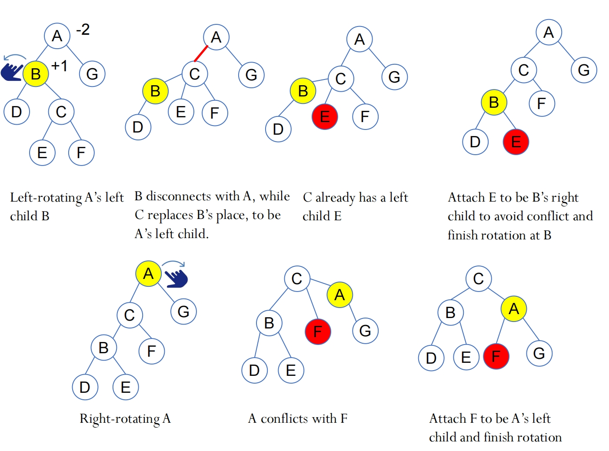

# 12.1 AVL_Tree

## Objectives

- To know what an **AVL tree** is

  了解 **AVL树是什么**

- To understand how to **rebalance** a tree using the **LL rotation**, **LR rotation**, **RR rotation**, and **RL rotation**

  了解如何使用**LL旋转**、**LR旋转**、**RR旋转**和**RL旋转**重新平衡树

- To know how to design the **AVLTree** class

  如何**设计 AVLTree** 类

- To **insert** elements into an AVL tree

  在AVL树中 **插入个元素**

- To implement node **rebalancing**

  实施节点 **再平衡**

- To **delete** elements from an AVL tree

  从AVL树中**删除个元素**

- To implement and test the **AVL Tree** class

  **实现和测试**AVLTree类

- To analyze the **complexity** of search, insert, and delete operations in AVL trees

  分析AVL树中搜索、插入和删除操作的**复杂性**

## Why AVL Tree 

The search, insertion, and deletion time for a binary search tree is dependent on the **height of the tree.** In the worst case, the height is **n**, so worst time complexity is **O(n)**

二叉搜索树 **BST** 的**搜索、插入和删除时间取决于树的高度**。在**最坏的情况下，高度是 n**，所以**最差的时间复杂度是 O（n）**；（也就是树退化成了链表），平均的时间复杂度是 **O(logn)**

Can we maintain a **perfectly balanced tree (i.e., complete binary tree)**, so that

我们能否维护一棵 **完美平衡的树**（即完全二叉树），使每一层：

- Level 1 (the root) holds at most 1 node (**2^0**)
- Level 2 holds at most 2 nodes (**2^1**)
- Level 3 holds at most 4 nodes (**2^2**)
- ......
- Level **h** holds at most **2^(h-1)** nodes

> n = 2^0 + 2^1 + 2^2 + ... + 2^(h-1) >= h  = **logn**

Note: Yes, but it would be very **costly,** as it requires rebuilding and nodes shifting very often during insertions/deletions

注意：可以，**但成本非常高**，因为AVL树需要重建，在插入/删除期间节点经常移动从而确保能够保持上述要求的平衡条件

Alternatively, we can maintain a **well-balanced tree---** **the heights of two subtrees for every node are about the same** **---** so that h≈log n, while less rebalancing efforts

或者，我们可以保持一个 **均衡的树**，即每个节点的两个子树的高度大致相同 --- 这样 **h≈log n**，同时减少再平衡工作。

## What are AVL Trees

**AVL trees** are **well-balanced (self-balanced BSTs)**. The difference between the heights of every node ’ s two subtrees will not be more than 1. 

AVL树平衡良好。**每个节点的两个子树的高度差不会超过1**。

> **| height(right subtree) - height(left subtree) | ≤ 1**

The **balance factor** of a node is the height of its **right subtree** minus the height of its **left subtree**

节点的 **平衡因子** 是其 **右子树** 的高度减去其 **左子树** 的高度


- A node is said to be **balanced** if its balance factor is -1, 0, or 1

  如果一个节点的 **平衡因子** 为-1、0或1，则称其为平衡

- Although still balanced, a node is said to be **left-heavy** if its balance factor is -1

  尽管节点仍处于平衡状态，但如果其 **平衡因子为 -1**，则称其为 **left-weight** 节点

- Although still balanced, a node is said to be **right-heavy** if its balance factor is +1

  尽管该节点仍处于平衡状态，但如果其 **平衡因子为 1**，则称该节点为 **right-weight**

## Balancing Tree 平衡树

- If a node is **not balanced** (i.e., its balance factor is not \- 1, 0, or 1) after an insertion or deletion operation, you need to rebalance it:

  如果一个节点是 **不平衡的** （即，它的平衡因子不是 -1，0或1）在插入或删除操作之后，您需要重新平衡它：

- The process of rebalancing a node is called a **rotation**

  重新平衡节点的过程称为 **旋转**

- There are four possible rotations:

  有**四种**可能的旋转：
  
  - **LL rotation** (**left-heavy left-heavy rotation**)
  - **RR rotation** (**right-heavy right-heavy rotation**)
  - **LR rotation** (**left-heavy right-heavy rotation**)
  - **RL rotation** (**right-heavy left-heavy rotation**)

### LL imbalancing and LL rotation

- An **left-heavy, left-heavy imbalance** occurs at a node **A** if **A** has a balance factor **-2 (left-heavy)** and its left child **B** has a balance factor **-1 (left-heavy)** or **0**
  
  如果 A 的 **平衡系数为 -2（左重）**，而其 **左子项 B** 的 **平衡系数为 -1（左重） 或 0**，则在节点 A 处出现 **left-heavy, left-heavy 不平衡**
  
  - **LL Rotation (a single right rotation at node A)**: 需要右旋

- Example:


- rotation 过程：


### RR imbalance and RR rotation

- An **RR imbalance** occurs at a node **A** if **A** has a balance factor **+2 **(right-heavy) and a right child **B** has a balance factor **+1 (right-heavy)** or **0**
  
  如果 A 的 **平衡因子  +2 （右重）** 且 **右子树 B** 的 **平衡因子  1 （右重） 或 0** ，则 **节点A** 处会出现 **RR 不平衡**
  
  - **RR Rotation (a single left rotation o node A)**: 需要左旋

- Example:


- Rotation 过程：


### LR imbalance and rotation

- **LR Rotation**: An **LR imbalance** occurs at a node **A** if **A** has a balance factor **-2 (left-heavy)** and a left child **B** has a balance factor **+1 (right-heavy)**
  
  LR 旋转：如果 A 的 **平衡因子 -2（左重）**，而 **左子项 B** 的 **平衡因子  1（右重）** ，则 **LR 不平衡** 发生在 **节点 A**
  
  - This type of imbalance can be fixed by performing a **double rotation**: first a single left rotation at **B** and then a single right rotation at **A**
  
    这种类型的不平衡可以通过执行 **双重旋转** 来解决：首先在 **B 处进行一次左旋转**，然后在 **A 处进行一次右旋转**

- Example:


- Rotation 过程



### RL imbalance and RL rotation

- **RL Rotation**:An **RL imbalance** occurs at a node **A** if **A** has a balance factor **+2 (right-heavy)** and a right child **B** has a balance factor **-1 (left-heavy)**.
  
  **RL 旋转**：如果 **A** 的 **平衡因子  2（右重）**，而 **右子树 B** 的 **平衡因子 -1（左重）**，则 **RL 不平衡** 发生在**节点 A** 处。
  
  - This type of imbalance can be fixed by performing a double rotation: first a single right rotation at **B** and then a single left rotation at **A**
  
    这种不平衡可以通过执行 **双旋转** 来修复：首先在**B处进行单次右旋转**，然后在**A处进行单次左旋转**

- Example:


- Rotation 步骤


### Sample Case 案例

**Inserting 25, 20, 5, 34, 50, 30, 10**


**Deleting 34, 30, 50, 5**


在每次删除之后，都需要检查当前的树是否仍然满足 AVL tree对于双边高度差不大于1的要求是否满足。

## Designing Classes for AVL Trees  设计AVL树的类

**An AVL is a binary search tree**, so we can define the **AVLTree** class to extend the **BST** class

**AVL是二叉查找树**，因此我们可以定义 **AVL Tree 类来扩展 BST 类**

**尽量记住代码中的转换逻辑，这样在考试的时候可以直接写代码转换逻辑当作答案**


```java
public class AVLTree<E extends Comparable<E>> extends BST<E> {
    /** AVLTreeNode is TreeNode plus height */
    // AVLTreeNode 是 TreeNode 加上高度
    protected static class AVLTreeNode<E extends Comparable<E>>
        extends BST.TreeNode<E> {
        protected int height = 0; // New data field
        
        /**
        * Need the height (a new data field) for the balance factor calculation
        */
        // 需要高度（新的数据字段）进行平衡因子计算
        public AVLTreeNode (E o) {
            super(o);
        }
    }
    
    /** Overriding createNewNode method in BST, ensuring the created nodes are AVL tree 	*	nodes (with heights).
    */
    // 重写 BST 类中的 createNewNode，确保新创建的节点属于 AVL 树节点（搭配高度）
    @Override /** Override createNewNode to create an AVLTreeNode */
    protected AVLTreeNode<E> createNewNode (E e) {
        // (in BST) return new TreeNode<>(e);
        return new AVLTreeNode<E>(e);
    }
    
    /** Create a default AVL tree */
    // Also provides 2 types of constructors for AVL trees
    public AVLTree () {
    }
    /** Create an AVL tree from an array of objects */
    public AVLTree (E[] objects) {
        super(objects);
    }
    
    // Overriding insert method in BST
    
    @Override /** Insert an element and rebalance if necessary */ 
    public boolean insert(E e) {
        boolean successful = super.insert(e);
        if (!successful)
            return false; // e is already in the tree
        else {
            // Calls the orginal BST insert method (super.insert(e)).
            balancePath(e); // 在这里会调用下面的平衡方法
        }
        return true; // e is inserted
    } // If the insertion is successful, calls the balancePath() for rebalance if needed.
```

### BalancePath

```java
    /**
     * 平衡从指定节点到根节点路径上的所有节点
     * @param e 新插入的元素
     */
    private void balancePath(E e) {
        ArrayList<TreeNode<E>> path = path(e); // 获取从根到插入节点的路径
        
        // 从插入节点向上检查平衡
        for (int i = path.size() - 1; i >= 0; i--) {
            AVLTreeNode<E> A = (AVLTreeNode<E>)(path.get(i));
            updateHeight(A); // 更新当前节点高度
            
            AVLTreeNode<E> parentOfA = (A == root) ? null : 
                (AVLTreeNode<E>)(path.get(i - 1));
            
            // 根据平衡因子进行旋转
            switch(balanceFactor(A)) {
                case -2: // 左子树过高
                    if (balanceFactor((AVLTreeNode<E>)A.left) <= 0) {
                        balanceLL(A, parentOfA); // LL型旋转
                    } else {
                        balanceLR(A, parentOfA); // LR型旋转
                    }
                    break;
                case +2: // 右子树过高
                    if (balanceFactor((AVLTreeNode<E>)A.right) >= 0) {
                        balanceRR(A, parentOfA); // RR型旋转
                    } else {
                        balanceRL(A, parentOfA); // RL型旋转
                    }
            }
        }
    }

    /**
     * 更新节点高度
     * @param node 需要更新高度的节点
     */
    private void updateHeight(AVLTreeNode<E> node) {
        if (node.left == null && node.right == null) {
            node.height = 0; // 叶子节点高度为0
        } else if (node.left == null) {
            node.height = 1 + ((AVLTreeNode<E>)(node.right)).height; // 只有右子树
        } else if (node.right == null) {
            node.height = 1 + ((AVLTreeNode<E>)(node.left)).height; // 只有左子树
        } else {
            // 取左右子树高度的较大值
            node.height = 1 + Math.max(
                ((AVLTreeNode<E>)(node.right)).height,
                ((AVLTreeNode<E>)(node.left)).height);
        }
    }

    /**
     * 计算节点的平衡因子
     * @param node 需要计算平衡因子的节点
     * @return 平衡因子值
     */
    private int balanceFactor(AVLTreeNode<E> node) {
        if (node.right == null) {
            return -node.height; // 只有左子树
        } else if (node.left == null) {
            return +node.height; // 只有右子树
        } else {
            // 右子树高度减去左子树高度
            return ((AVLTreeNode<E>)node.right).height - 
                   ((AVLTreeNode<E>)node.left).height;
        }
    }
```

### /\** Balance LL \*/

```java
    /** Balance LL */
	private void balanceLL(TreeNode<E> A, TreeNode<E> parentOfA) {
        // Define A’s left child to be B to facilitate the rotation
        TreeNode<E> B = A.left;
        // B replaces A’s position in the tree
        if (A == root) {
            root = B;
        } else { // link B to A’s parent (If A has one)
            if (parentOfA.left == A) {
                parentOfA.left = B;
            } else {
                parentOfA.right = B;
            }
        }
        // Attach B’s right subtree
        // to A’s left subtree
        A.left = B.right;
        // Attach A to be B’s right child
        B.right = A;
        // Update height of A and B
        updateHeight((AVLTreeNode<E>)A);
        updateHeight((AVLTreeNode<E>)B)
    }
```


### /\** Balance RR \*/

```java
    /** Balance RR */
    private void balanceRR(TreeNode<E> A, TreeNode<E> parentOfA) {
        TreeNode<E> B = A.right; // A is right-heavy and B is right-heavy
        if (A == root) {
            root = B;
        } else {
            if (parentOfA.left == A) {
                parentOfA.left = B;
            } else {
                parentOfA.right = B;
            }
        }
        A.right = B.left;
        B.left = A;
        updateHeight((AVLTreeNode<E>)A);
        updateHeight((AVLTreeNode<E>)B);
    }
```

### /\** Balance LR \*/

```java
    /** Balance LR */
    private void balanceLR(TreeNode<E> A, TreeNode<E> parentOfA) {
        // Define A's left child to be B, and B's right child to be C
        TreeNode<E> B = A.left;
        TreeNode<E> C = B.right;
        // C replaces A’s position directly
        if (A == root) {
            root = C;
        } else { // Link C to A’s parent (if A has one)
            if (parentOfA.left == A) {
                parentOfA.left = C;
            } else {
                parentOfA.right = C;
            }
        }
        // Rearrange the connections
        B.right = C.left;
        A.left = C.right;
        C.left = B;
        C.right = A;
        // Adjust heights
        updateHeight((AVLTreeNode<E>)A);
        updateHeight((AVLTreeNode<E>)B);
        updateHeight((AVLTreeNode<E>)C);
    }
```

这里所展示的方法和上面在介绍 RR 的时候使用的两次旋转的方法得到的结果是一样的


// Rearrange the connections


### /\** Balance RL \*/

```java
    /** Balance RL */
    private void balanceRL(TreeNote<E> A, TreeNode<E>, parentOfA) {
        TreeNode<E> C = B.left;
        if (A == root) {
            root = C;
        } else {
            if (parentOfA.left == A) {
                parentOfA.left = C;
            } else {
                parentOfA.right = C;
            }
        }
        A.right = C.left;
        B.left = C.right;
        C.left = A;
        C.right = B;
        updateHeight((AVLTreeNode<E>)A);
        updateHeight((AVLTreeNode<E>)B);
        updateHeight((AVLTreeNode<E>)C);
    }
```

### Deletion

```java
	@Override
    public boolean delete(E element) {
        if (root == null) {
            return false; // 树为空
        }
        
        // 定位要删除的节点及其父节点
        TreeNode<E> parent = null;
        TreeNode<E> current = root;
        while (current != null) {
            if (element.compareTo(current.element) < 0) {
                parent = current;
                current = current.left;
            } else if (element.compareTo(current.element) > 0) {
                parent = current;
                current = current.right;
            } else {
                break; // 找到目标节点
            }
        }
        
        if (current == null) {
            return false; // 未找到元素
        }
        
        // 情况1：当前节点没有左子节点
        if (current.left == null) {
            if (parent == null) {
                root = current.right;
            } else {
                if (element.compareTo(parent.element) < 0) {
                    parent.left = current.right;
                } else {
                    parent.right = current.right;
                }
                balancePath(parent.element); // 平衡路径
            }
        } else {
            // 情况2：当前节点有左子节点
            TreeNode<E> parentOfRightMost = current;
            TreeNode<E> rightMost = current.left;
            
            while (rightMost.right != null) {
                parentOfRightMost = rightMost;
                rightMost = rightMost.right;
            }
            
            current.element = rightMost.element; // 替换元素
            
            if (parentOfRightMost.right == rightMost) {
                parentOfRightMost.right = rightMost.left;
            } else {
                parentOfRightMost.left = rightMost.left;
            }
            
            balancePath(parentOfRightMost.element); // 平衡路径
        }
        
        size--;
        return true;
    }
}
// 这里才是上面 AVLTree class 的终止位置，之前的都是内部的方法

```

**Main**

```java
public class TestAVLTree {
    public static void main(String[] args) {
        // Create an AVL tree
        AVLTree<Integer> tree = new AVLTree<>(new Integer[]{25, 20, 5});
        System.out.print("After inserting 25, 20, 5:");
        printTree (tree);
        tree.insert(34);
        tree.insert(50);
        System.out.print("\nAfter inserting 34, 50:");
        printTree (tree);
        tree.insert(30);
        System.out.print("\nAfter inserting 30");
        printTree (tree);
        tree.insert(10);
        System.out.print("\nAfter inserting 10");
        printTree (tree);
        tree.delete (34);
        tree.delete (30);
        tree.delete (50);
        System.out.print("\nAfter removing 34, 30, 50:");
        printTree (tree);
        tree.delete (5);
        System.out.print("\nAfter removing 5:");
        printTree (tree);
        System.out.print("\nTraverse the elements in the tree: ");
        for (int e: tree) { // inorder: 10 20 25
            System.out.print(e + " ");
        }
    }
    public static void printTree (BST tree) {
        // Traverse tree
        System.out.print("\nPreorder: ");
        tree.preorder();
        System.out.print("\nInorder (sorted): ");
        tree.inorder();
        System.out.print("\nPostorder: ");
        tree.postorder();
        System.out.print("\nThe number of nodes is " + tree.getSize ());
        System.out.println();
    }
}
```


## AVL Tree Time Complexity Analysis 时间复杂度分析

- In the balancePath(), we have:

  在 balancePath() 中，我们有：

  - **for (int i = path.size () - 1; i >= 0; i--)**

- Given the height of the AVL tree is **O(log n)**, the number of nodes on the path (from the newly inserted/delete one to the root) is **O(log n)**

  对于一个包含 n 个节点的 AVL 树，其高度 h 总是 **O(logn)**。这意味着无论树中有多少节点，从根到任何叶子节点的最长路径长度（边的数量）都不会超过 **logn** 的常数倍。(The number of nodes on the longest path would be **h+1**)

- The operations, such as updating heights and calculating balance factors (which apply to single nodes), and rotations (which involve a small constant number of nodes), do not depend on the size of the tree => **O(1)**

  更新高度和计算平衡因子（适用于单个节点）以及旋转（涉及少量常数节点）等操作不依赖于树的大小=**O(1)**

- So, the time complexity of AVL tree is

  因此，**AVL 树的时间复杂度**为
  
  > **O(log n) × O(1) = O(log n)**

完整代码

```java
/**
 * AVL树实现类，继承自二叉搜索树(BST)
 * @param <E> 可比较的元素类型
 */
public class AVLTree<E extends Comparable<E>> extends BST<E> {
    /**
     * AVL树节点类，扩展了TreeNode，增加了height属性
     */
    protected static class AVLTreeNode<E extends Comparable<E>> extends BST.TreeNode<E> {
        protected int height = 0; // 节点高度，用于计算平衡因子

        public AVLTreeNode(E o) {
            super(o);
        }
    }

    @Override
    protected AVLTreeNode<E> createNewNode(E e) {
        return new AVLTreeNode<E>(e); // 创建AVL树节点
    }

    /** 默认构造函数 */
    public AVLTree() {}
    
    /** 通过对象数组构造AVL树 */
    public AVLTree(E[] objects) {
        super(objects);
    }

    @Override
    public boolean insert(E e) {
        boolean successful = super.insert(e); // 先执行BST的插入
        if (!successful) {
            return false; // 元素已存在
        } else {
            balancePath(e); // 平衡插入路径上的节点
        }
        return true;
    }

    /**
     * 平衡从指定节点到根节点路径上的所有节点
     * @param e 新插入的元素
     */
    private void balancePath(E e) {
        ArrayList<TreeNode<E>> path = path(e); // 获取从根到插入节点的路径
        
        // 从插入节点向上检查平衡
        for (int i = path.size() - 1; i >= 0; i--) {
            AVLTreeNode<E> A = (AVLTreeNode<E>)(path.get(i));
            updateHeight(A); // 更新当前节点高度
            
            AVLTreeNode<E> parentOfA = (A == root) ? null : 
                (AVLTreeNode<E>)(path.get(i - 1));
            
            // 根据平衡因子进行旋转
            switch(balanceFactor(A)) {
                case -2: // 左子树过高
                    if (balanceFactor((AVLTreeNode<E>)A.left) <= 0) {
                        balanceLL(A, parentOfA); // LL型旋转
                    } else {
                        balanceLR(A, parentOfA); // LR型旋转
                    }
                    break;
                case +2: // 右子树过高
                    if (balanceFactor((AVLTreeNode<E>)A.right) >= 0) {
                        balanceRR(A, parentOfA); // RR型旋转
                    } else {
                        balanceRL(A, parentOfA); // RL型旋转
                    }
            }
        }
    }

    /**
     * 更新节点高度
     * @param node 需要更新高度的节点
     */
    private void updateHeight(AVLTreeNode<E> node) {
        if (node.left == null && node.right == null) {
            node.height = 0; // 叶子节点高度为0
        } else if (node.left == null) {
            node.height = 1 + ((AVLTreeNode<E>)(node.right)).height; // 只有右子树
        } else if (node.right == null) {
            node.height = 1 + ((AVLTreeNode<E>)(node.left)).height; // 只有左子树
        } else {
            // 取左右子树高度的较大值
            node.height = 1 + Math.max(
                ((AVLTreeNode<E>)(node.right)).height,
                ((AVLTreeNode<E>)(node.left)).height);
        }
    }

    /**
     * 计算节点的平衡因子
     * @param node 需要计算平衡因子的节点
     * @return 平衡因子值
     */
    private int balanceFactor(AVLTreeNode<E> node) {
        if (node.right == null) {
            return -node.height; // 只有左子树
        } else if (node.left == null) {
            return +node.height; // 只有右子树
        } else {
            // 右子树高度减去左子树高度
            return ((AVLTreeNode<E>)node.right).height - 
                   ((AVLTreeNode<E>)node.left).height;
        }
    }

    /**
     * LL型旋转（右旋）
     * @param A 不平衡节点
     * @param parentOfA A的父节点
     */
    private void balanceLL(TreeNode<E> A, TreeNode<E> parentOfA) {
        TreeNode<E> B = A.left; // B是A的左子节点
        
        if (A == root) {
            root = B; // 如果A是根节点，B成为新根
        } else {
            if (parentOfA.left == A) {
                parentOfA.left = B;
            } else {
                parentOfA.right = B;
            }
        }
        
        A.left = B.right; // B的右子树成为A的左子树
        B.right = A; // A成为B的右子节点
        updateHeight((AVLTreeNode<E>)A); // 更新A的高度
        updateHeight((AVLTreeNode<E>)B); // 更新B的高度
    }

    /**
     * RR型旋转（左旋）
     * @param A 不平衡节点
     * @param parentOfA A的父节点
     */
    private void balanceRR(TreeNode<E> A, TreeNode<E> parentOfA) {
        TreeNode<E> B = A.right; // B是A的右子节点
        
        if (A == root) {
            root = B;
        } else {
            if (parentOfA.left == A) {
                parentOfA.left = B;
            } else {
                parentOfA.right = B;
            }
        }
        
        A.right = B.left; // B的左子树成为A的右子树
        B.left = A; // A成为B的左子节点
        updateHeight((AVLTreeNode<E>)A);
        updateHeight((AVLTreeNode<E>)B);
    }

    /**
     * LR型旋转（先左旋后右旋）
     * @param A 不平衡节点
     * @param parentOfA A的父节点
     */
    private void balanceLR(TreeNode<E> A, TreeNode<E> parentOfA) {
        TreeNode<E> B = A.left;
        TreeNode<E> C = B.right;
        
        if (A == root) {
            root = C;
        } else {
            if (parentOfA.left == A) {
                parentOfA.left = C;
            } else {
                parentOfA.right = C;
            }
        }
        
        B.right = C.left;
        A.left = C.right;
        C.left = B;
        C.right = A;
        
        updateHeight((AVLTreeNode<E>)A);
        updateHeight((AVLTreeNode<E>)B);
        updateHeight((AVLTreeNode<E>)C);
    }

    /**
     * RL型旋转（先右旋后左旋）
     * @param A 不平衡节点
     * @param parentOfA A的父节点
     */
    private void balanceRL(TreeNode<E> A, TreeNode<E> parentOfA) {
        TreeNode<E> B = A.right;
        TreeNode<E> C = B.left;
        
        if (A == root) {
            root = C;
        } else {
            if (parentOfA.left == A) {
                parentOfA.left = C;
            } else {
                parentOfA.right = C;
            }
        }
        
        A.right = C.left;
        B.left = C.right;
        C.left = A;
        C.right = B;
        
        updateHeight((AVLTreeNode<E>)A);
        updateHeight((AVLTreeNode<E>)B);
        updateHeight((AVLTreeNode<E>)C);
    }

    // 删除
    @Override
    public boolean delete(E element) {
        if (root == null) {
            return false; // 树为空
        }
        
        // 定位要删除的节点及其父节点
        TreeNode<E> parent = null;
        TreeNode<E> current = root;
        while (current != null) {
            if (element.compareTo(current.element) < 0) {
                parent = current;
                current = current.left;
            } else if (element.compareTo(current.element) > 0) {
                parent = current;
                current = current.right;
            } else {
                break; // 找到目标节点
            }
        }
        
        if (current == null) {
            return false; // 未找到元素
        }
        
        // 情况1：当前节点没有左子节点
        if (current.left == null) {
            if (parent == null) {
                root = current.right;
            } else {
                if (element.compareTo(parent.element) < 0) {
                    parent.left = current.right;
                } else {
                    parent.right = current.right;
                }
                balancePath(parent.element); // 平衡路径
            }
        } else {
            // 情况2：当前节点有左子节点
            TreeNode<E> parentOfRightMost = current;
            TreeNode<E> rightMost = current.left;
            
            while (rightMost.right != null) {
                parentOfRightMost = rightMost;
                rightMost = rightMost.right;
            }
            
            current.element = rightMost.element; // 替换元素
            
            if (parentOfRightMost.right == rightMost) {
                parentOfRightMost.right = rightMost.left;
            } else {
                parentOfRightMost.left = rightMost.left;
            }
            
            balancePath(parentOfRightMost.element); // 平衡路径
        }
        
        size--;
        return true;
    }
}
```


