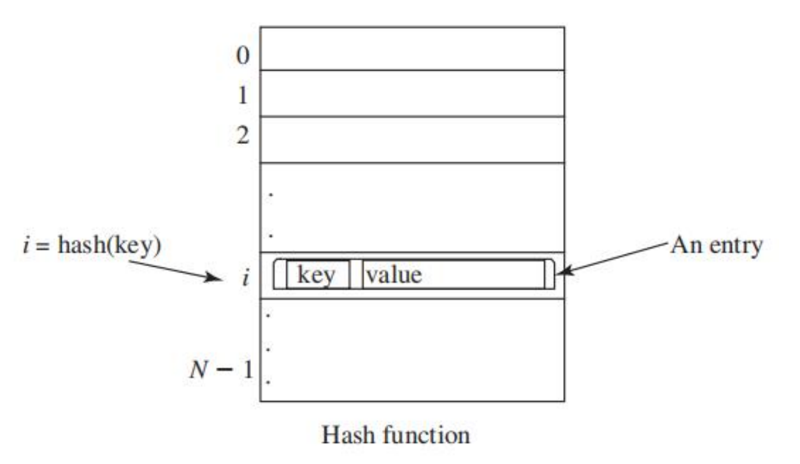
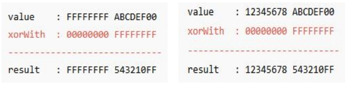
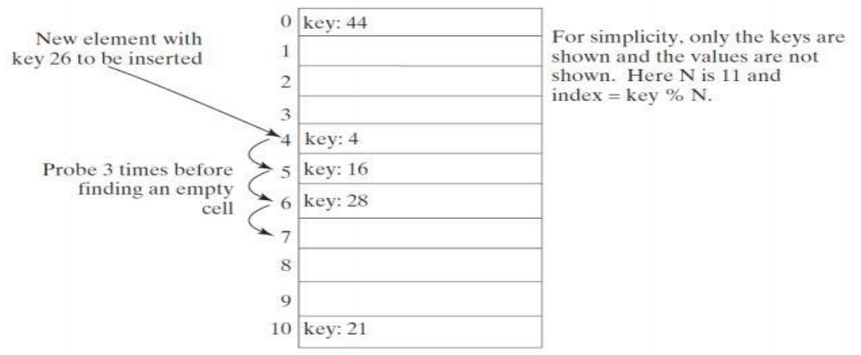
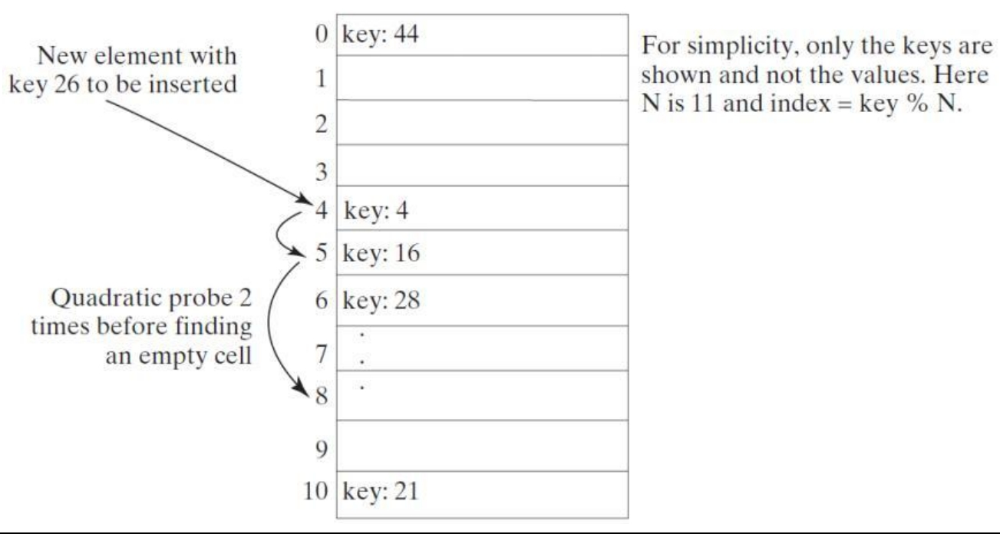
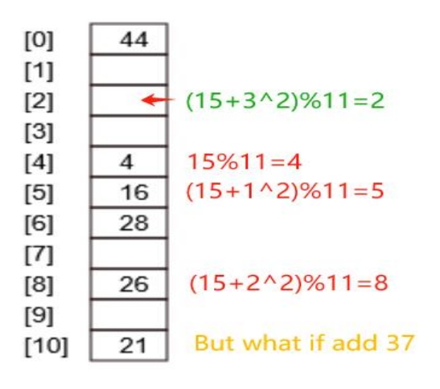
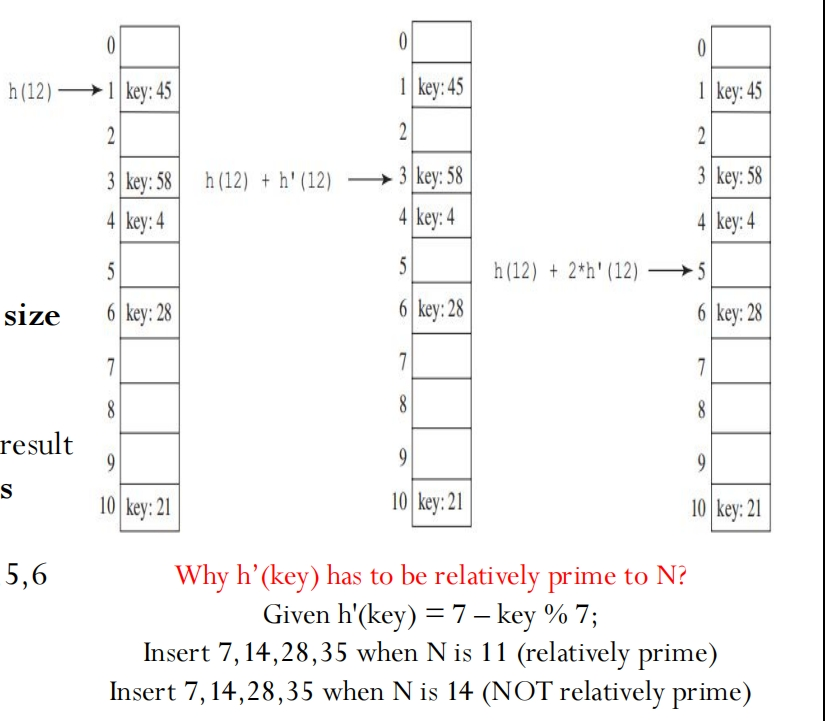
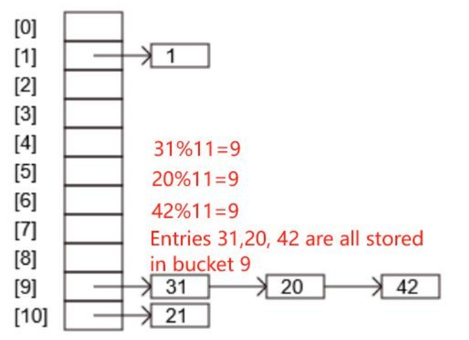
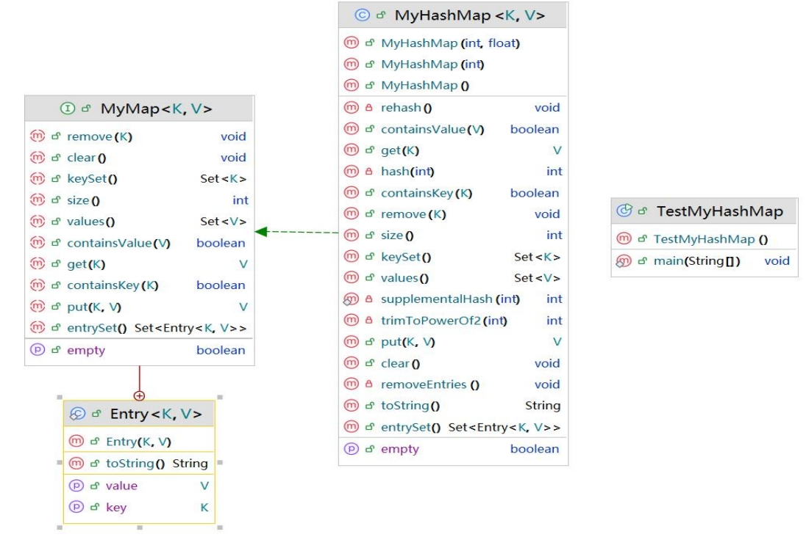
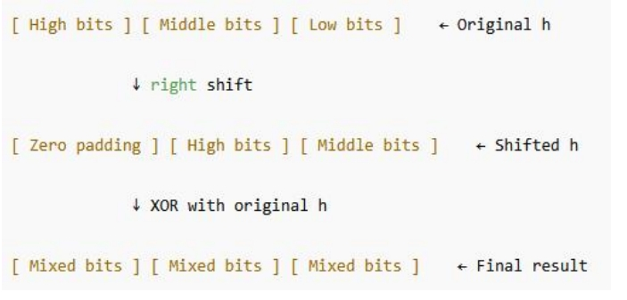
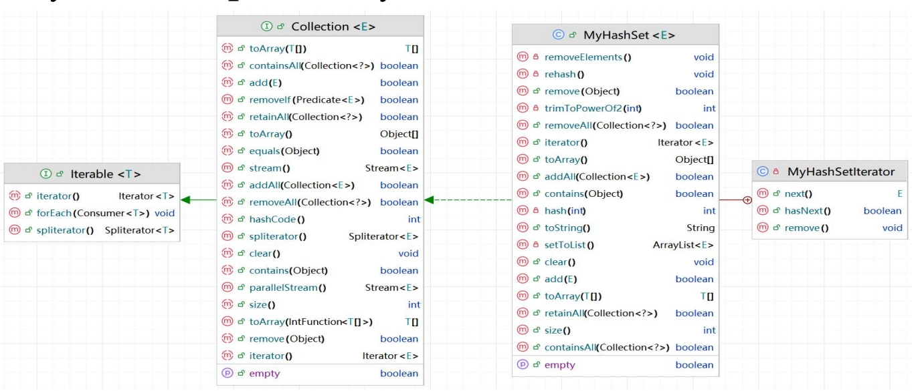

# 12.2 Hashing 哈希

## Objectives

- To understand what **hashing** is and what hashing is used for

  了解什么是**哈希**以及哈希的用途

- To obtain the hash code for an object and design the hash function to map a key to an index

  获取对象的哈希码，并设计哈希函数将键映射到索引

- To **handle collisions (conflicts) using open addressing**

  使用 **开放寻址** 处理冲突

- To know the differences among **linear probing**, **quadratic** **probing**, and **double hashing**

  了解 **线性探测**、**二次探测** 和 **双重散列** 之间的差异

- To **handle collisions using separate chaining**

  要  **使用单独的链接处理冲突** 

- To understand the **load factor** and the need for **rehashing**

  了解 **负载系数** 和 **重新哈希** 的必要性

- To implement **MyHashMap** using hashing

  使用哈希实现 **MyHashMap**

## Why Hashing 为什么要哈希

- Hashing is used for sets and maps:
  
  哈希用于集合和映射：
  
  - A **set** is a container that contains unique elements (no order considered)
  
    **set** 是一个包含唯一元素的容器（不考虑顺序）
  
  - A **map** (**dictionary**, **hash table**, or **associative array**) is a data structure that stores data in pairs: **a key and a value.** 
  
    **map（**字典、哈希表或 关联数组）是一种按照**键值对存储数据**的数据结构：**键搭配一个值**。
  
  - **Without hashing:** checking whether an element exists in a set or retrieving a value from a map would require searching through the entire collection
  
    **如果没有哈希**： 那么检查元素是否存在于集合中或从 map 中 **检索值需要搜索整个集合**
  
  - **With hashing:** A hash function allow us to map each element or key to a specific index, so that we can jump directly to the location where the element or key should be
  
    **使用哈希**： 哈希函数允许我们将每个元素或键映射到特定的索引，这样我们就可以直接跳转到元素或键应该在的位置。这样 **单点查询的时间复杂度就是 O(1)**
  
  - **The main advantage of hashing is speed.** 
  
    **哈希的主要优点是查询速度**
  
- We can search, insert, and delete elements in O(1) time on average (no need to search and compare)

  我们平均可以在**O(1)时间内搜索、插入和删除元素**（无需搜索和比较）

## How is Hashing Implemented 哈希的实现

- Remember **Arrays**: If you know the index of an element in the array, you can retrieve/update the element using the **index** in **O(1)** time

  记住**数组**：如果你知道数组中某个元素的索引，你可以在**O（1）**时间内**使用索引检索/更新该元素**

- Follow this idea, we have:

  如此，我们得到

  - The array that stores the values is called a **hash table**

    存储值的数组称为 **哈希表**

  - The function that maps a key to an index in the hash table is called a **hash function**

    将键映射到哈希表中索引的函数称为 **哈希函数**




## Hash Functions and Hash Codes 哈希函数和哈希码

- To eventually get the index, we first need to use the **hash function** to convert a search key to an **integer** value called a **hash code,** then compresses the hash code into an index to the hash table.

  要最终得到索引，我们首先需要使用 **哈希函数** 将 **search key** 转换为称为 **hashcode 的整数值**，然后**将位数长的哈希码进行压缩，从而得对应的哈希表长度的索引**

  - **Hashfucntion:SearchKey → HashCode (asinteger)**
  
    **Compressing: HashCode (asinteger) → Index**

- Example:

  - Java ’ s root class **Object** has a **hashCode** method, which returns an integer hash code

    Java 的根类 **Object** 有一个 **hashCode** 方法，该方法 **返回一个整数哈希码**

    - **Object o = new Object();**

      **System.out.println(o.hashCode());**

      **366712642 (decimal representation 十进制表示， 哈希码)**

  - And then, do the compressing on the hashcode for the index *(because we do not usually have a hash table containing over 300000000 places for storage)*

    然后，对索引的哈希码进行压缩 *（因为我们通常没有包含超过 300000000 个存储位置的哈希表）*

## Hash Codes for Primitive Types 原始数据类型的哈希码

For search keys of the types **byte**, **short**, **char** and **int** are simply converted into an **int**

对于 byte、short、char 和 int 类型的搜索键，只需将其都转换成整数即可

> **E.g., char a = ‘A’;** **int** **charHash =** **(int)** **a;**

- For a **Float type**, use *Float.floatToIntBits(f)* to convert the float value into its raw integer bit representation, which is then used as the hash code.

  对于 **Float 类型**，使用 Float.floatToIntBits（f） 将 float 值转换为其原始整数位表示形式，然后将其用作哈希码。

  - **System.out.println(Float.floatToIntBits(1.23f))** **//1067282596**
  - 如果 `float` 是 `NaN`（非数字），则统一返回 `0x7fc00000`（标准 `NaN` 的位模式）。

- For a **long type** (64 bits), we generate the hash code by combining the higher 32 bits and lower 32 bits using **XOR (exclusive-or operation)**, so that the result fits into an int

  对于 long 类型（64 位），我们通过使用 **XOR（异或运算）**组合较高的 32 位和较低的 32 位来生成哈希码，以便结果适合 int。 （同时这样也能确保 long 类型的所有位数都参与了哈希的计算）

  - **将 `long` 右移 32 位**（`l >>> 32`）：

    - 获取 `long` 的高 32 位。

    - ```java
      long l = 123456789L;
      long highBits = l >>> 32; // 获取高 32 位
      ```

  - **与原 `long` 进行 XOR（异或）**：

    - 将高 32 位与低 32 位混合，减少冲突。

    - ```java
      int hash = (int)(l ^ (l >>> 32)); // 压缩为 32 位
      // ^ 是异或逻辑运算符
      // 如果 两位相同（均为 0 或均为 1），结果为 0。
      // 如果 两位不同（一个 0，一个 1），结果为 1
      ```

  - `l >>> 32`：将 `long` 的 **高 32 位** 移动到 **低 32 位**，高 32 位补 `0`。

  - `l ^ (l >>> 32)`：将 **原始 `long` 与右移后的 `long` 进行按位异或，目的是混合高 32 位和低 32 位**。

  - `(int)`：将结果截断为 `int`（32 位），丢弃高 32 位。

  - **Problem: Direct convert to int will discard (ignore) the higher 32 bits and only keep the lower 32 bits**

    long value1 = 0xFFFFFFFFABCDEF00L;

    long value2 = 0x12345678ABCDEF00L;

    (int)value1 → ABCDEF00L

    (int)value2 → ABCDEF00L

  - **Solution:**

    int hashCode = **(int)(key ^ (key >> 32))**;

    i >> n 等价于 i / 2^n
    
    i << n 等价于 i * 2^n
    
    
    
    - i >> n 和 i >>> n 得到的结果是一样的，都是内容向右移动 n 位，但是 i >> 的最高位的符号位会根据原有的值填充，而第 i >>> n 则属于无符号填充，直接填入0.

- For **double type** (64 bits as well), first convert it to a long value using the Double. doubleToLongBits method, then perform the same XOR.

  对于 double 类型 （也是 64 位），首先使用 Double 将其转换为 long 值。doubleToLongBits 方法，然后执行相同的 XOR 运算。

  - **long bits = Double.doubleToLongBits(value);**

    int hashCode = **(int)(bits ^ (bits >> 32))**;

- **String's hashCode** is calculated by starting from 0 and, for each character in the string, multiplying the current hash value by a fixed prime number (e.g., 31, 33,41, etc) and adding the character ’ s integer value. This process accumulates the effect of each character, making the hash sensitive to both the characters and their order.

  **String 的 hashCode** 的计算方法是从 0 开始，对于字符串中的每个字符，将当前哈希值乘以固定的素数（例如，31、33、41 等），然后加上字符的整数值。此过程会累积每个字符的效果，使哈希对字符及其顺序都敏感。

  - **int hashCode = 0;**

    **for (int i = 0; i < length; i++)**

    **{ hashCode = 31 \* hashCode + charAt(i); }**

## Compressing Hash Codes 压缩哈希码

- **Hashfucntion:SearchKey→HashCode (asinteger)**

  **Compressing: HashCode (asinteger)→Index**

- The hash code for a key can be a large integer that is out of the range for the hash table index

  键的哈希代码可以是超出哈希表索引范围的大整数

  - E.g., a table of size 11 (index 0-10), the hashcode may be a large integer like 366712642

    例如，一个大小为 11 的表（索引 0-10），哈希码可能是一个大整数，如 366712642

  - We need to scale it down to fit in the index’s range

    我们需要缩小规模，以适应索引的范围

- Assume the index for a hash table is between **0** and **N-1** --- the most common way to scale an integer is

  假设哈希表的索引介于 0 和 N-1 之间 --- 缩放整数的最常见方法是

  - **h(hashCode)=hashCode % N** （通过求余数的方式，让余数作为较长的哈希值对应在哈希表中的索引位置）

    - **%** is called **modulus operator**, it gets the remainder. E.g., 7 % 3 =1 => 7/3=2...**1**

      **%** 这个是求余数符号

    - **N** is the size (capacity) of the hash table, which defines how many slots are available for storing elements.Usually choos e a **prime number for N (e.g., 11, 13, 31, etc)** to ensure the indices are spread evenly

      **N 是哈希表的大小（容量）**，它定义可用于存储元素的槽数。**通常为 N 选择一个 质数**（例如，11、13、31 等）以确保索引均匀分布

## Handling Collisions 解决哈希冲突

- A **hashing collision** (or *collision*) occurs when two different keys are mapped to the same index in a hash table

  当两个不同的键映射到哈希表中的同一索引时，会发生 **哈希冲突** （或 冲突 ）

- There are two ways for handling collisions: **open addressing** and **separate chaining**

  有两种方式处理冲突： **开放寻址** 和 **链接法**

- **Open addressing** is the process of finding an open location in the hash table in the event of a collision

  **开放寻址法** 是在发生冲突时在哈希表中查找开放位置的过程

  - **Open addressing** has several variations: **linear probing**, **quadratic probing** and **double hashing**

    开放寻址有几种变体：**线性探测**、**二次探测** 和 **再哈希**

- **Separate chaining** places all entries with the same hash index into the same location in a **LinkedList**

  **链接法** 将具有相同哈希索引的所有条目放在列表中的相同位置，使用**链表**进行存储

| No   | 链地址法                                           | 开放地址法                                                   |
| :--- | :------------------------------------------------- | :----------------------------------------------------------- |
| 1    | 易于实现                                           | 需要更多的计算                                               |
| 2    | 使用链地址法，哈希表永远不会填充满，不用担心溢出。 | 哈希表可能被填满，需要通过拷贝来动态扩容。                   |
| 3    | 对于哈希函数和装载因子不敏感                       | 需要额外关注如何规避聚集以及装载因子的选择。                 |
| 4    | 适合不知道插入和删除的关键字的数量和频率的情况     | 适合插入和删除的关键字已知的情况。                           |
| 5    | 由于使用链表来存储关键字，缓存性能差。             | 所有关键字均存储在同一个哈希表中，所以可以提供更好的缓存性能。 |
| 6    | 空间浪费（哈希表中的有些链一直未被使用）           | 哈希表中的所有槽位都会被充分利用。                           |
| 7    | 指向下一个结点的指针要消耗额外的空间。             | 不存储指针。                                                 |

### Linear Probing 线性探查

- When a collision occurs during the **insertion** of an entry to a hash table, linear probing finds the next available location sequentially

  当在将条目 **插入** 到哈希表期间发生冲突时，线性探测会按顺序查找下一个可用位置

- If a collision occurs at **hashTable[key % N]**, check whether **hashTable[(key+1) % N]** is available

  如果 **hashTable[key % N]** 发生冲突，请检查 **hashTable[（key + 1） % N]** 是否可用

- If not, check **hashTable[(key+2) % N]** and soon, until an available cell is found

  如果+1之后仍然没有空位，请检查 **hashTable[（key + 2） % N]** ，直到向后找到可用的单元格



- To **remove** an entry from the hash table, search the entry that matches the key

  要从哈希表中 **删除** 条目，请搜索与**键**匹配的条目

  - 步骤示例：加入我需要删除 26，但是在定位的时候 hashkey[26 % 11] = 4, index 这里已经被占用了，所以继续按照 linear probing 的规则，尝试 hashkey[(26 + 1) % 11] = 5, 也已经被 16 占用了，接着测试 hashkey[(26 + 2) % 11] = 6, 依然不是 26，继续 hashkey[(26+3) % 11] = 7，此时找到了26，然后就可以将这一个 bucket 进行标记，代表数据已经被删除可以被插入新的数据。

  - If the entry is found, place a special marker **marked** to denote that the entry is deleted, but available for insertion of other values

    如果找到该条目，请放置一个特殊的 **记号** 标记，表示该条目已被删除，但可用于插入其他值

    - Each cell in the hash table has three possible states: **occupied**, **marked**, or **empty**

      哈希表中的每个单元格都有三种可能的状态：**occupied**、**marked** 或 **empty**

      - a marked cell is also available for **insertion**

        标记的单元格也可用于插入

- Linear probing tends to cause groups of consecutive cells in the hash table to be occupied -- each group is called a **cluster**

  **线性探测往往会导致哈希表中连续的单元格组被占用**——一组紧密聚集的数据称为**簇**

  - Linear probing causes **clustering** because when collisions occur, **new elements are always placed into nearby empty slots (k%N, (k+1)%N, (k+2)%N)...)**, causing occupied cells to accumulate and form clusters

    线性探测会导致**元素聚集**，因为当发生冲突时，**新元素总是被放置在附近的空槽中（k%N，（k+1）%N、（k+2）%N）。..）**，导致被占用的元素积聚并形成簇

  - Each cluster is actually a probe sequence that you must search when retrieving,  adding, or removing an entry. This is a big disadvantage of linear probing

    每个簇实际上都是一个探测序列，在检索、添加或删除条目时必须搜索该序列。这是线性探测的一大缺点

### Quadratic Probing 二次探测

- Quadratic probing looks at the cells at indices **(key+j^2)%N** for **j >= 0**, that is, 

  - **key%N**, 
  - **(key+1)%N**, 
  - **(key+4)%N,**
  - **(key+9)%N**, 
  - **(key+16)%N**, and so on。
  - j 代表当前迭代的次数，第一次额外循环就是 1*1, 第二次迭代循环就是 2\*2, 第三次迭代就是 3\*3 以此类推
  
  二次探测查看索引 **(key+j^2)%N** 处的单元格 j >= 0，即 **key%N**, **(key+1)%N**, **(key+4)%N, (key+9)%N**, **(key+16)%N**，依此类推



- Quadratic probing works in the same way as linear probing for retrieval, insertion and deletion, except for the change in the search sequence (the ‘ step ’ it takes for finding an open location)

  二次探测与线性探测在检索、插入和删除方面的工作方式相同，除了搜索顺序的变化（查找开放位置所需的“步骤”）

- **Quadratic probing** can avoid the clustering problem in linear probing **for consecutive keys**

  二次探测 可以避免线性探测中有关 **连续键** 的聚类问题 

  - It still has its own clustering problem, called **secondary clustering** for **keys that collide with the occupied entry** using the same probe sequence

    这种方法仍然有自己的聚类问题，称为 **二次聚类**，用于使用相同的探测序列与占用的条目碰撞的键



### Double Hashing 二次哈希

- **Double hashing** uses a secondary hash function **h′(key)**on the keys to **determine the increments to avoid the clustering** problem

  双散列在键上使用辅助散列函数**h′(key)**来**确定增量**，以避免聚类问题， **h'(key) 应该尽量和N互质**，并且 h'(key) 不能等于0。（通常h'(key)是自己定义的备用哈希函数)

- Double hashing looks at the cells at indices **(h(key)+j\*h′(key))%N** for **j>=0**, that is,

  - (**h(key)+0\*h’(key))%N**, 
  - **(h(key)+1\*h′(key))%N**, 
  - **(h(key)+2\* h′(key))%N**, 
  - **(h(key)+3\*h′(key))%N**, and so on

- Example:

  - h(key) = key % 11;

    h'(key) = 7 – key % 7;

  - h(key) = key % 11 determines the **initial position** in the hash table.

    h（key） = key % 11 确定哈希表中的 **初始位置**。

  - h'(key) = 7 - key % 7 determines the **step size for probing** in case of a collision

    h'（key）=7 key%7确定 **碰撞情况下探测的步长**

  - h'(key) can be other formulas as long as its result ensures the **step size is never zero** and **is relatively prime to the table size (N)** E.g., 6 - key % 6, step sizes can be 1,2,3,4,5,6 And 1,2,3,4,5,6 is relatively prime to 11

    h'（键）可以是其他公式，只要其结果确保步长永远不会为零并且相对于表大小 （N） 相对质数例如，6 - key % 6，步长可以是 1,2,3,4,5,6， 1,2,3,4,5,6 相对质数为 11



### Handling Collisions Using Separate Chaining 避免碰撞

- The **separate chaining scheme** places all entries with the same hash index into the same location, rather than finding new locations

  **单独链接方案** 将具有相同哈希索引的所有条目放置在相同的位置，而不是找到新的位置

  - Each location in the separate chaining scheme is called a **bucket,** which can be implemented using an **array, ArrayList, or LinkedList** (in the example below)

    单独链接方案中的每个位置都称为 bucket，可以使用 array、ArrayList 或 LinkedList 实现（在下面的示例中）

  - A **bucket** is a container that holds multiple entries:

    bucket是一个包含多个条目的容器：



### 三种开放定址法的代码实现

假设我们有一个 `Entry<K,V>[] table` 用于 `MyHashMap`，并且 `null` 表示空槽位，一个特殊的 `DELETED_ENTRY` 对象表示已删除的槽位。

1.  Linear Probing

```java
// 概念性 put 方法 (MyHashMap)
public V putLinear(K key, V value) {
    int initialHash = hash(key.hashCode()); // 原始哈希函数
    int index = initialHash;
    int i = 1; // 探测步数

    do {
        if (table[index] == null || table[index] == DELETED_ENTRY) { // 找到空位或可重用位
            table[index] = new MyMap.Entry<>(key, value);
            size++;
            // checkRehashIfNeeded(); // 检查是否需要rehash
            return value;
        }
        if (table[index].getKey().equals(key)) { // 键已存在，更新值
            V oldValue = table[index].getValue();
            table[index].value = value;
            return oldValue;
        }
        index = (initialHash + i) % capacity; // 线性探测
        i++;
    } while (i <= capacity); // 避免无限循环，如果表满了应该有处理

    throw new RuntimeException("HashTable is full or error in probing.");
}

// 概念性 get 方法 (MyHashMap)
public V getLinear(K key) {
    int initialHash = hash(key.hashCode());
    int index = initialHash;
    int i = 1;

    do {
        if (table[index] == null) { // 遇到真正的空位，说明键不存在
            return null;
        }
        if (table[index] != DELETED_ENTRY && table[index].getKey().equals(key)) {
            return table[index].getValue();
        }
        index = (initialHash + i) % capacity; // 线性探测
        i++;
    } while (table[index] != null && i <= capacity); // 继续探测直到找到元素或空位

    return null; // 未找到
}
```

2. Quadratic Probing

```java
// 概念性 put 方法 (MyHashMap)
public V putQuadratic(K key, V value) {
    int initialHash = hash(key.hashCode()); // 原始哈希函数
    int index = initialHash;
    int i = 1; // 探测步数

    do {
        if (table[index] == null || table[index] == DELETED_ENTRY) {
            table[index] = new MyMap.Entry<>(key, value);
            size++;
            // checkRehashIfNeeded();
            return value;
        }
        if (table[index].getKey().equals(key)) {
            V oldValue = table[index].getValue();
            table[index].value = value;
            return oldValue;
        }
        index = (initialHash + i * i) % capacity; // 平方探测 (c1=0, c2=1)
        // 或者 index = (initialHash + c1*i + c2*i*i) % capacity;
        // 为了简单，这里使用 i*i。更稳健的平方探测会使用 +/- i*i 或确保能探测全表。
        i++;
    } while (i <= capacity); // 需要确保平方探测能覆盖所有槽位或有循环检测

    throw new RuntimeException("HashTable is full or error in probing (Quadratic).");
}

// 概念性 get 方法 (MyHashMap)
public V getQuadratic(K key) {
    int initialHash = hash(key.hashCode());
    int index = initialHash;
    int i = 1;

    do {
        if (table[index] == null) {
            return null;
        }
        if (table[index] != DELETED_ENTRY && table[index].getKey().equals(key)) {
            return table[index].getValue();
        }
        index = (initialHash + i * i) % capacity; // 平方探测
        i++;
    } while (table[index] != null && i <= capacity);

    return null;
}
```

3. Double Hashing

```java
// 需要第二个哈希函数
private int hash2(int hashCode) {
    // 必须确保 hash2 的结果不为0，并且与 capacity 互质（通常 capacity 是2的幂，则 hash2 返回奇数即可）
    // 例如：
    int step = 5 - (hashCode % 5); // 一个简单的例子，5 是一个素数
    if (step == 0) step = 1; // 确保步长不为0
    return step;
    // 更常见的做法是 R - (key % R) 其中 R 是小于表大小的素数。
}


// 概念性 put 方法 (MyHashMap)
public V putDoubleHashing(K key, V value) {
    int initialHash = hash(key.hashCode()); // h1(k)
    int stepSize = hash2(key.hashCode());   // h2(k)
    int index = initialHash;
    int i = 0; // 探测次数

    do {
        if (table[index] == null || table[index] == DELETED_ENTRY) {
            table[index] = new MyMap.Entry<>(key, value);
            size++;
            // checkRehashIfNeeded();
            return value;
        }
        if (table[index].getKey().equals(key)) {
            V oldValue = table[index].getValue();
            table[index].value = value;
            return oldValue;
        }
        i++;
        index = (initialHash + i * stepSize) % capacity; // 双重哈希
    } while (index != initialHash && i < capacity); // 如果绕回原点或探测次数过多

    throw new RuntimeException("HashTable is full or error in probing (Double Hashing).");
}

// Concept性 get 方法 (MyHashMap)
public V getDoubleHashing(K key) {
    int initialHash = hash(key.hashCode()); // h1(k)
    int stepSize = hash2(key.hashCode());   // h2(k)
    int index = initialHash;
    int i = 0;

    do {
        if (table[index] == null) {
            return null;
        }
        if (table[index] != DELETED_ENTRY && table[index].getKey().equals(key)) {
            return table[index].getValue();
        }
        i++;
        index = (initialHash + i * stepSize) % capacity; // 双重哈希
    } while (table[index] != null && index != initialHash && i < capacity);

    return null;
}
```

## Load Factor and Rehashing 负载因子以及再哈希

- As λ increases, the probability of a collision increases

  如果 λ 增加，碰撞的概率也将会增加

  - Because the **load factor** measures how full a hash table is

    因为 **负载因子** 衡量哈希表的填充程度

  - You should maintain the load factor under **0.5** for the open addressing schemes and under **0.9** for the separate chaining scheme

    对于开放寻址方案，应将负载系数保持在 **0.5** 以下，对于独立链接方案，应将负载系数保持在 **0.9** 以下

    - In the implementation of the **java.util.HashMap** class, the threshold is usually set to be **0.75**

      在 java.util.HashMap 类的实现中，阈值通常设置为 **0.75**

    - If the load factor is **exceeded**, we **increase** the hash table size and **reload** the entries into a new larger hash table -> this is called **rehashing**

      如果 超出  负载因子，我们需要更大的哈希表，因此需要将将条目 **重新加载** 到一个新的更大的哈希表中，这称为 **重新哈希**

      - We need to change the hash functions, since the hash-table size (N) has been changed

        我们需要更改哈希函数，因为哈希表大小 （N） 已更改

      - To reduce the likelihood ofrehashing, since it is costly, you should at least **double** the hash-table size

        为了降低重新哈希的可能性，因为它的成本很高，您应该**至少将哈希表的大小增加一倍**



- **MyMap<K,V>** is the Interface defining what a map can do, such as put(), get(), containsKey(), etc. 

  MyMap 是定义 map 可以做什么的接口，例如 put（）、get（）、containsKey（） 等。

- **MyHashMap<K,V>** implements MyMap, providing the concrete implementation of the abstract methods (e.g., put(), etc) while also implementing the hashing-related operations (e.g., hash(int),  rehash(int), etc) 

  MyHashMap 实现 MyMap，提供抽象方法的具体实现（例如 put（） 等），同时还实现与哈希相关的操作（例如 hash（int）、rehash（int） 等）

- **Entry<K,V>** is an inner class in MyMap, serving as the data container that is used by the hashing related operations

  Entry K，V  是MyMap中的内部类，作为哈希相关操作使用的数据容器

- **TestMyHashMap** contains the main method for testing

  TestMyHashMap 包含测试的主要方法

代码详见 Lab12_Code

- **MyMap** Interface defines the common behaviors a map can do

  MyMap接口定义了 map 可以执行的常见行为

- **MyMap** Interface also has the **Entry<K,V>** inner class, which serves as the data conatiner used by the hashing-related implementations

  MyMap Interface 还具有 Entry<K, V> 内部类，该类用作哈希相关实现使用的数据转换器

- **MyHashMap** implements **MyMap** Interface, first defining the core attributes for the hashing operations, such as the default hash table size, max size, etc

  MyHashMap 实现 MyMap 接口，首先定义哈希运算的核心属性，比如默认哈希表大小、最大大小等

- **MyHashMap** implements the methods defined in the **MyMap** Interface.

  MyHashMap 实现了 MyMap 接口中定义的方法。

- The **supplementalHash()** attempts to avoid collision by shifting high bits to lower positions (e.g., h>>>20) and mixing them using XOR (^)

  supplementalHash（） 试图通过将高位移动到较低位置（例如 h>>>20）并使用 XOR （^） 混合它们来避免冲突



- Afterwards, the **hash()** will take the calculated hashcode with the *&(capacity-1)* operation to ensure the final index is always within the valid range of the table size

  之后，hash() 将使用 &(capacity-1) 操作获取计算出的哈希码，以确保最终索引始终在表大小的有效范围内

## HashMap vs HashSet



在上面展示的 HashHashMap 和 MyHashSet 之间的的实现差异。

- MyHashMap uses **MyMap** for key-value pairs with entrySet traversal
- MyHashSet uses **Collection** with direct iterator() for elements.

### HashSet 和 HashTable，HashMap之间的异同

|      **对比项**       |             **HashSet**             |               **HashTable**                |                   **HashMap**                    |
| :-------------------: | :---------------------------------: | :----------------------------------------: | :----------------------------------------------: |
|     **实现接口**      |           实现 `Set` 接口           |              实现 `Map` 接口               |                 实现 `Map` 接口                  |
|     **存储内容**      |       存储唯一对象（不重复）        |          存储键值对（Key-Value）           |             存储键值对（Key-Value）              |
|  **是否允许 `null`**  |      **允许** 1 个 `null` 元素      |          **不允许** `null` 键或值          |     **允许** 1 个 `null` 键和多个 `null` 值      |
|    **线程安全性**     |             非线程安全              | **线程安全**（方法用 `synchronized` 修饰） |                    非线程安全                    |
|       **性能**        |      高（基于 `HashMap` 实现）      |               低（同步开销）               |                 高（无同步开销）                 |
|     **迭代顺序**      |         不保证顺序（无序）          |                 不保证顺序                 | 不保证顺序（Java 8+ 优化了哈希冲突时的链表顺序） |
| **初始容量/负载因子** |     默认容量 16，负载因子 0.75      |         默认容量 11，负载因子 0.75         |            默认容量 16，负载因子 0.75            |
|     **继承关系**      |  基于 `HashMap` 实现（值存于 Key）  |      继承自 `Dictionary` 类（已过时）      |               继承自 `AbstractMap`               |
|     **扩容机制**      | 当元素数 > 容量×负载因子时扩容 2 倍 |                同 `HashMap`                |                   同 `HashSet`                   |
|     **适用场景**      |       需要存储唯一元素的集合        |    多线程环境下的键值存储（已较少使用）    |              单线程下的高效键值存储              |
|     **Java 版本**     |                1.2+                 |                1.0+（旧版）                |                       1.2+                       |
|     **替代方案**      |                  -                  |         推荐用 `ConcurrentHashMap`         |                        -                         |

### HashMap的 entrySet， keySet, values 

#### (1) `entrySet()`

- **作用**：返回所有键值对（`Map.Entry<K,V>`）的集合。

- 实现原理：

  - 基于 `HashMap` 的 `table` 数组，遍历所有桶中的节点。
  - 返回一个 `EntrySet` 内部类实例，通过迭代器访问所有 `Entry`。

- 关键代码：

  ```java
  public Set<Map.Entry<K,V>> entrySet() {
      Set<Map.Entry<K,V>> es;
      return (es = entrySet) == null ? (entrySet = new EntrySet()) : es;
  }
  
  final class EntrySet extends AbstractSet<Map.Entry<K,V>> {
      public Iterator<Map.Entry<K,V>> iterator() {
          return new EntryIterator(); // 返回遍历所有 Entry 的迭代器
      }
      // 其他方法（size、contains等）也基于 table 实现
  }
  ```

- 特点：

  - 直接操作 `HashMap` 的底层数据，修改 `EntrySet` 会影响原 `HashMap`。
  - 迭代时遍历所有非空桶中的节点（链表或红黑树）。

#### (2) `keySet()`

- **作用**：返回所有键（`Key`）的集合。

- 实现原理：

  - 基于 `entrySet()`，但只提取 `Entry` 中的 `key`。
  - 返回一个 `KeySet` 内部类实例，通过迭代器访问所有键。

- 关键代码：

  ```java
  public Set<K> keySet() {
      Set<K> ks;
      return (ks = keySet) == null ? (keySet = new KeySet()) : ks;
  }
  
  final class KeySet extends AbstractSet<K> {
      public Iterator<K> iterator() {
          return new KeyIterator(); // 返回遍历所有 Key 的迭代器
      }
      // 其他方法（size、contains等）委托给 entrySet()
  }
  ```

- 特点：

  - 是 `entrySet` 的“键”视图，无需额外存储，节省内存。
  - 删除 `keySet` 中的元素会同步删除 `HashMap` 中的对应键值对。

#### (3) `values()`

- **作用**：返回所有值（`Value`）的集合（注意：不是 `Set`，而是 `Collection`）。

- 实现原理：

  - 基于 `entrySet()`，但只提取 `Entry` 中的 `value`。
  - 返回一个 `Values` 内部类实例，通过迭代器访问所有值。

- 关键代码：

  ```java
  public Collection<V> values() {
      Collection<V> vs;
      return (vs = values) == null ? (values = new Values()) : vs;
  }
  
  final class Values extends AbstractCollection<V> {
      public Iterator<V> iterator() {
          return new ValueIterator(); // 返回遍历所有 Value 的迭代器
      }
      // 其他方法（size、contains等）委托给 entrySet()
  }
  ```

- 特点：

  - 是 `entrySet` 的“值”视图，允许重复值（因为 `value` 可以重复）。
  - 修改 `values` 集合不会直接影响 `HashMap`，但通过迭代器删除值会删除对应键值对。