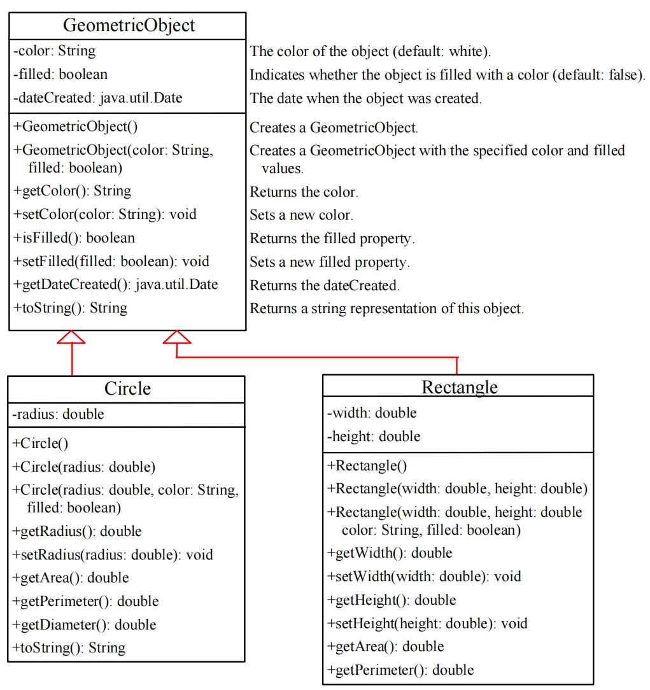
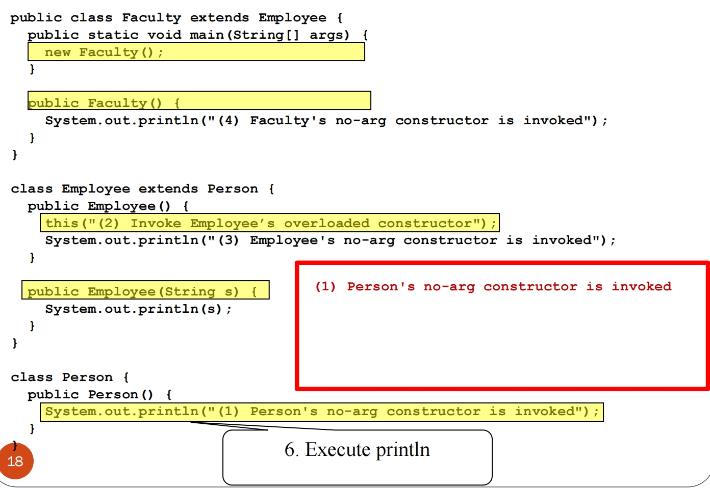
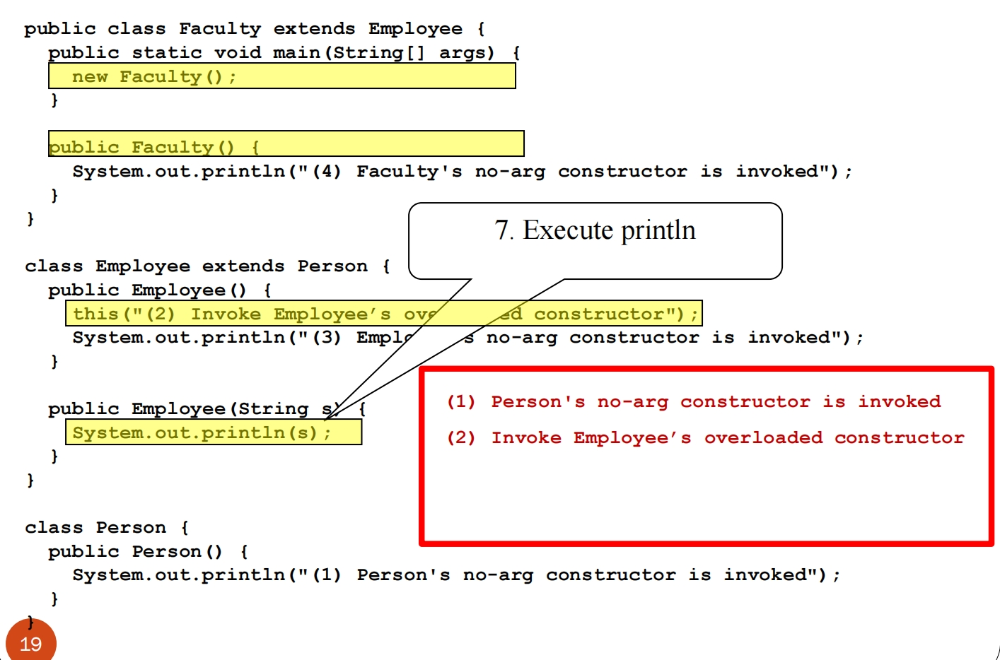

# 2.2 Inheritance and Polymorphism 继承和多态

- Model classes with similar properties and methods:

  具有相似属性和方法的模型类：

  - Circles, rectangles and triangles have many common features and behaviors (i.e., data fields and methods):

    圆形、矩形和三角形具有许多常见的特征和行为（即数据字段和方法）:
  
    - **color: String, isFilled: boolean, dateCreated:Date**
  
    - **getArea(): double**
  
    - **getPerimeter(): double**
  
- **Inheritance** is the mechanism of basing a **sub-class** on **extending** another **super-class**

  **继承** 是将一个 **子类** 建立在 extends 另一个 **超类** 之上的机制

  - Inheritance will help us design and implement classes so to avoid redundancy

    继承将帮助我们设计和实现类，从而避免冗余

### Superclasses and Subclasses



## Declaring a Subclass  声明子类

- A subclass **extends**/inherits properties and methods from the superclass.

  子类扩展/继承超类的属性和方法。

- 子类还可以

  - Add new properties

    添加新的属性

  - Add new methods

    添加新的方法

  - Override the methods of the superclass

    重写父类的方法

### Are superclass’s Constructor Inherited? 父类的构造器会被继承吗

**No**. They are not inherited **不能，父类的构造器不会被继承**

**They are invoked explicitly or implicitly**

父类的构造器会被被**显式**或**隐式**调用

- **Explicitly** using the **super** keyword and the arguments of the superclass constructors

  **显式**: 使用 super 关键字和超类构造函数的参数

- **Implicitly**: if the keyword **super** is not explicitly used, the superclass's **no-arg constructor** is automatically invoked as the first statement in the constructor, unless another constructor is invoked with the keyword **this** (in this case, the last constructor in the chain will invoke the superclass constructor)

  **隐式**：如果关键字 super 没有显式使用，则超类的**无参构造器**作为构造函数中的第一个语句自动调用，除非使用关键字 this 调用另一个构造函数（在这种情况下，该类中的最后一个构造函数将调用超类构造函数）


### `Super` 关键字

- The keyword **super** refers to the superclass of the class in which **super** appears

  指使用 **super** 的类的 **超类**

- This keyword is used in two ways:

  此关键字以两种方式使用：

  - To call a superclass constructor (through **constructor chaining**)

    调用超类构造函数（通过构造函数链接）

  - To call a superclass method (hidden by the overriding method)

    调用超类方法（被重写过的方法隐藏）

### Constructor Chain 构造器链

**Constructor chaining** : constructing an instance of a class invokes all the superclasses’ constructors along the inheritance chain.

**构造函数链接** ：构造类的实例会调用继承链上的所有超类的构造函数。

Step 1:


Step 2:


Step 3:


Step 4:


Step 5:


Step 6；



Step 7：



Step 8:


Step 9:


End

#### Calling Superclass Methods with super 通过super调用超类

```java
public abstract class GeometricObject {
...
    public String toString() {
        return "color: " + color + ", filled: " + filled 
        + ", date created: " + getDateCreated();
    }
}
class Circle extends GeometricObject {
    ...
    public String toString() {
        return "Circle with radius " + radius 
        + ", " + super.toString();
    }
}
```

## Overriding is different than Overloading 重写和重载不同

### Overriding Methods in the Superclass 重写超类的方法

**Method overriding**: modify in the subclass the implementation of a method defined in the superclass:

**方法重写**：在子类中修改超类中定义的方法的实现：

- ```java
  public abstract class GeometricObject {
      ...
      public String toString() {
          return "color: " + color + ", filled: " + filled 
          + ", date created: " + getDateCreated();
      }
  }
  class Circle extends GeometricObject {
      ...
      public String toString() {
          return "Circle with radius " + radius 
          + ", " + super.toString();
      }
  }
  ```

**Method overloading** (discussed in Methods) is the ability to create multiple methods of the same name, but with different signatures and implementations:

**方法重载**（在方法中讨论）是创建多个**同名方法**但具有不同签名和实现的能力：

- Method overriding requires that the subclass has the same method signature as in the superclass.

  方法重写要求**子类具有与超类相同的方法签名**。

- ```java
  public class Overloading {
      public static int max(int num1, int num2) {
          if (num1 > num2)
              return num1;
          return num2; 
      }
      public static double max(double num1, double num2) { 
          if (num1 > num2)
              return num1;
          return num2;
      }
      public static void main(String[] args) {
          System.out.println(max(1, 2)); // 2 (as an int)
          System.out.println(max(1, 2.3)); // 2.3 (as a double)
      }
  }
  ```

The **Object** Class and Its Methods

**Object** 类及其方法

- Every class in Java is descended from the **java.lang.Object** class

  Java 中的每个类都是从 **java.lang.Object** 类派生而来的

  - If no inheritance is specified when a class is defined, the superclass of the class is **java.lang.Object**

    如果在定义类时未指定继承，则该类的超类默认为 **java.lang.Object**

### Method Matching vs. Binding  方法匹配与绑定

- For **overloaded methods**, the compiler finds a **matching** method according to parameter type, number of parameters, and order of the parameters at compilation time.

  对于重载方法，编译器在编译时根据**参数类型**、**参数数量**和**参数顺序**查找 **匹配** 方法。

- For **overridden methods**, the Java Virtual Machine **dynamically binds** the implementation of the most specific **overridden** method implementation at runtime.

  对于被覆盖的方法，Java 虚拟机在运行时 **动态绑定** <u>最具体（也就是最接近的子类的实现）</u>的 **被覆盖** 方法实现的实现。


### Dynamic Binding 动态绑定

假设对象 o 是类 C1（o=new C1 ()） 的实例，其中 C1 是 C2 的子类，C2 是 C3 的子类，...，Cn-1 是 Cn 的子类。Cn 是最通用的类（即 Object），C1 是最具体的类（即 o 的具体类型）。使用**动态绑定**：如果 o 调用了一个方法 m，JVM 会在 C1 、 C2 、 ...、 Cn-1 和 Cn 中搜索方法 m 的实现，按照这个顺序，直到找到为止，搜索停止，调用第一个找到的实现


### The toString() method in Object

- The **toString()** method returns a string representation of the object

  toString（） 方法返回对象的字符串表示形式

- The default **Object** implementation returns a string consisting of a class name of which the object is an instance, the @ ("at") sign, and a number representing this object

  默认的 Object 实现返回一个字符串，该字符串由一个类名（该对象是该类的实例）、@ （“at”） 符号和一个表示该对象的数字组成

  > **Loan loan = new Loan();**

  > **System.out.println(loan.toString());**

- The code displays something like **Loan@12345e6**

  代码显示类似于 Loan@12345e6 的内容

  - you should override the **toString()** method so that it returns an informative string representation of the object

    应该重写 toString（） 方法，以便它返回对象的信息性字符串表示形式

### Casting Objects 类型转换

**Casting** can be used to convert an object of one class type to another within an inheritance hierarchy

**Casting** 可用于将继承层次结构中的一种类型的对象转换为另一种类型的对象

```java
m(new Student())
// is equivalent to:
Object o = new Student(); // Implicit casting (a instance of Student is automatically an instance of Object)
m(o);
```

#### Explicit Casting Is Necessary 显式强制转换是必需的

有时我们需要进行向下的类型转换，这样我们就可以使用子类

> Student b = o; // Syntax Error

A compilation error would occur because an **Object o** is not necessarily an instance of **Student**. We must use **explicit casting** to tell the compiler that **o** is a **Student** object

之所以会出现编译错误，是因为 **Object o** 不一定是 **Student** 的实例。我们必须使用 **显式转换** 来告诉编译器 o 是一个 Student 对象

> **Student b = (Student)o;** 

显式强制转换语法类似于用于在原始数据类型之间进行强制转换的语法

显式强制转换可能并不总是成功（即，如果对象不是子类的实例），此时我们需要使用 `instanceOf` 方法来进行验证.

```java
public class CastingDemo{
    public static void main(String[] args){
        Object object1 = new Circle(1);
        Object object2 = new Rectangle(1, 1);
        displayObject(object1);
        displayObject(object2);
    }
    public static void displayObject(Object object) {
        // 判断传入的对象的实际类型是否属于给定的类型
        if (object instanceof Circle) {
            System.out.println("The circle radius is "+((Circle)object).getRadius());
            System.out.println("The circle diameter is "+((Circle)object).getDiameter());
        }else if (object instanceof Rectangle) {
            System.out.println("The rectangle width is "+((Rectangle)object).getWidth());
        }
    }
}
```

### `equaqls` method

The **equals()**method compares the **contents** of two objects - the default implementation of the **equals** method in the **Object** class is as follows:

equals（） 方法比较两个对象的 contents：Object 类中 equals 方法的默认实现如下：

```java
public boolean equals(Object o) {
    if (o instanceof Circle) 
    	return radius == ((Circle)o).radius; // && super.equals(o);
    else return false;
}
```

### Generic Programming  泛型编程

polymorphism allows methods to be used generically for a wide range of object arguments:  

多态性允许方法通用于各种对象参数：

- if a method’s parameter type is a superclass (e.g.,Object), **you may pass an object to this method of any of the parameter’s subclasses** (e.g., Student or String) and the particular implementation of the method of the object that is invoked is determined dynamically

  如果方法的参数类型是超类（例如，Object），则可以在此方法中传入任意的对象类型，并且所调用的对象的方法的特定实现是动态确定的

- very useful for data-structures  对数据结构非常有用

## ArrayList Class

You can create arrays to store objects - But the array’s size is fixed once the array is created. 

您可以创建数组来存储对象但是，一旦创建数组，数组的大小是固定的。

Java provides the **java.util.ArrayList** class that can be used to store an unlimited finite number of objects:

Java 提供了 **java.util.ArrayList** 类，可用于存储无限数量的对象：

### Methods

- ArrayList()

  - Creates an empty list.

    创建一个空列表。

- add(o: Object) : void

  - Appends a new element o at the end of this list.

    在此列表的末尾附加一个新元素 o。

- add(index: int, o: Object) : void

  - Adds a new element o at the specified index in this list.

    在此列表中的指定索引处添加新元素 o。

- clear(): void

  - Removes all the elements from this list.

    从此列表中删除所有元素。

- contains(o: Object): boolean

  - Returns true if this list contains the element o.

    如果此列表包含元素 o，则返回 true。

- get(index: int) : Object

  - Returns the element from this list at the specified index.

    返回此列表中指定索引处的元素。

- indexOf(o: Object) : int

  - Returns the index of the first matching element in this list

    返回此列表中第一个匹配元素的索引

- isEmpty(): boolean

  - Returns true if this list contains no elements.

    如果此列表不包含任何元素，则返回 true。

- lastIndexOf(o: Object) : int

  - Returns the index of the last matching element in this list.

    返回此列表中最后一个匹配元素的索引。

- remove(o: Object): boolean

  - Removes the element o from this list

    从此列表中删除元素 o

- size(): int

  - Returns the number of elements in this list.

    返回此列表中的元素数。

- remove(index: int) : Object

  - Removes the element at the specified index.

    删除指定索引处的元素。

- set(index: int, o: Object) : Object

  - Sets the element at the specified index

    在指定索引处设置元素

An example of ArrayList

```java
public class TestArrayList {
    public static void main(String[] args) { // 如果直接这么用编译器会展示Warnings（但是仍然可以运行，就是不是规范写法）
        java.util.ArrayList cityList = new java.util.ArrayList();
        cityList.add("London");cityList.add("New York");cityList.add("Paris");
        cityList.add("Toronto");cityList.add("Hong Kong");
        System.out.println("List size? " + cityList.size());
        System.out.println("Is Toronto in the list? " + 
                           cityList.contains("Toronto"));
        System.out.println("The location of New York in the list? " +
                           cityList.indexOf("New York"));
        System.out.println("Is the list empty? " + cityList.isEmpty()); // false
        cityList.add(2, "Beijing");
        cityList.remove("Toronto");
        for (int i = 0; i < cityList.size(); i++)
            System.out.print(cityList.get(i) + " ");
        System.out.println();

        // 创建一个存储两个 Circle 对象的 ArrayList
        java.util.ArrayList list = new java.util.ArrayList();
        list.add(new Circle(2));
        list.add(new Circle(3));
        System.out.println( ((Circle)list.get(0)).getArea() );
    }

    // 规范的方法是采用泛型
    public static void main(String[] args) {
        java.util.ArrayList<String> cityList=new java.util.ArrayList<String>();
        cityList.add("London");cityList.add("New York");cityList.add("Paris");
        cityList.add("Toronto");cityList.add("Hong Kong");
        System.out.println("List size? " + cityList.size());
        System.out.println("Is Toronto in the list? " + 
                           cityList.contains("Toronto"));
        System.out.println("The location of New York in the list? " +
                           cityList.indexOf("New York"));
        System.out.println("Is the list empty? " + cityList.isEmpty()); // false
        cityList.add(2, "Beijing");
        cityList.remove("Toronto");
        for (int i = 0; i < cityList.size(); i++)
            System.out.print(cityList.get(i) + " ");
        System.out.println();
        // Create a list to store two circles
        java.util.ArrayList<Circle> list = new java.util.ArrayList<Circle>();
        list.add(new Circle(2));
        list.add(new Circle(3));
        System.out.println( list.get(0).getArea() ); // no casting needed
    }
}
```

## MyStack Class - Custom Stack

A stack to hold any objects.

用于保存任何对象的堆栈。

### Methods

- isEmpty(): boolean

  - Returns true if this stack is empty.

    如果此堆栈为空，则返回 true。

- getSize(): int

  - Returns the number of elements in this stack.

    返回此堆栈中的元素数。

- peek(): Object

  - Returns the top element in this stack.

    返回此堆栈中的 top 元素。

- pop(): Object

  - Returns and removes the top element in this stack.

    返回并删除此堆栈中的 top 元素。

- push(o: Object): void

  - Adds a new element to the top of this stack.

    将新元素添加到此堆栈的顶部。

- search(o: Object): int

  - Returns the position of the first element in the stack from the top that matches the specified element.

    返回堆栈中与指定元素匹配的第一个元素的位置。

```java
public class MyStack {
    private java.util.ArrayList list = new java.util.ArrayList();
    public void push(Object o) {
        list.add(o);
    }
    public Object pop() {
        Object o = list.get(getSize() - 1);
        list.remove(getSize() - 1);
        return o;
    }
    public Object peek() {
        return list.get(getSize() - 1);
    }
    public int search(Object o) {
        return list.lastIndexOf(o);
    }
    public boolean isEmpty() {
        return list.isEmpty();
    }
    public int getSize() {
        return list.size();
    }
    public String toString() {
        return "stack: " + list.toString();
    }
}
```

## Modifier  受保护的修饰符

### Visibility Modifiers  可见性修饰符

A **protected** data or a protected method in a public class can be accessed by any class in the same package or its subclasses, even if the subclasses are in a different package

同一包或其子类中的任何类都可以访问公共类中的 **protected** 数据或受保护方法，即使子类位于不同的包中


### UML class design

**Visibility:**

\+ = public

\- = private

~ = default/package

\# = protected

underlined = static


### A Subclass Cannot Weaken the Accessibility  子类不能削弱可访问性

- A subclass may override a **protected** method in its superclass and change its visibility to **public**.

  子类可以覆盖其超类中的 protected 方法，并将其可见性更改为 public。

- However, a subclass cannot weaken the accessibility of a method defined in the superclass.

  但是，子类不能削弱超类中定义的方法的可访问性。

  - For example, if a method is defined as **public** in the superclass, it must be defined as **public** in the subclass.

    例如，如果一个方法在超类中定义为 public，则必须在子类中将其定义为 public。

### Overriding Methods in the Subclass 重写子类的方法

- An instance method can be overridden only if it is accessible

  仅当实例方法可访问时，才能重写实例方法

  - A **private** method cannot be overridden, because it is not accessible outside its own class

    **无法覆盖 private 方法**，因为它无法在自己的类之外访问

    - If a method defined in a subclass is **private** in its superclass, the two methods are completely unrelated

      **如果子类中定义的方法在其超类中是 private，则这两个方法完全不相关**

- A **static** method can be inherited

  **可以继承 static 方法**

  - A **static** method cannot be overridden

    **不能覆盖 static 方法**

    - If a **static** method defined in the superclass is redefined in a subclass, the method defined in the superclass is hidden

      **如果在超类中定义的 static 方法在子类中重新定义，则超类中定义的方法将被隐藏**

### The `final` Modifier

- Remember that a final variable is a constant: final static double PI = 3.14159;

  请记住，最终变量是一个常数：final static double PI = 3.14159;

- A final method cannot be overridden by its subclasses

  **final 方法不能被其子类覆盖**

- A final class cannot be extended:

  **final修饰的类不能被继承**

  final class Math {

  ...

  }

## Questions

**Abstract Class and Abstract Methods**

- Select the **incorrect** statement:

  - Abstract classes can have constructors, but cannot be instantiated

    抽象类可以有构造函数，但不能实例化

  - **All methods in an abstract class must be abstract**

    **抽象类中的所有方法都必须是抽象的**

  - Abstract methods do not have a body and must be implemented by subclasses

    抽象方法没有主体，必须由子类实现

  - Abstract methods must be declared inside an abstract class

    抽象方法必须在抽象类中声明

  - A subclass that does not implement/override all abstract methods from its abstract superclass must be declared abstract

    不实现/覆盖其抽象超类中所有抽象方法的子类必须声明为 abstract

  Answer: No.2

  - **抽象类不能被直接实例化**：
    抽象类本身是抽象的，不能通过 `new` 关键字直接创建对象。

  - **构造器由子类调用**：
    抽象类的构造器只能在其子类实例化时被调用，子类通过 `super()` 显式或隐式地调用抽象类的构造器。

  - **构造器的存在是合理的**：
    即使抽象类不能被实例化，构造器的存在仍然有意义，因为它可以用于初始化抽象类的状态，供子类使用。

  - ```java
    abstract class Animal {
        private String name;
    
        // 抽象类的构造器
        public Animal(String name) {
            this.name = name;
        }
    
        public String getName() {
            return name;
        }
    
        // 抽象方法
        public abstract void makeSound();
    }
    
    class Dog extends Animal {
        // 子类调用抽象类的构造器
        public Dog(String name) {
            super(name);
        }
    
        // 实现抽象方法
        @Override
        public void makeSound() {
            System.out.println(getName() + " says: Woof!");
        }
    }
    
    public class Main {
        public static void main(String[] args) {
            // 抽象类不能被直接实例化
            // Animal animal = new Animal("Unknown"); // 编译错误
    
            // 子类可以实例化，并调用抽象类的构造器
            Dog dog = new Dog("Buddy");
            dog.makeSound(); // 输出: Buddy says: Woof!
        }
    }
    ```

- Overloading 重载 & Overriding重写

  ```java
  // Example 1
  public class Test {
      public static void main(String[] args) {
          B a = new A();
          a.p(10.0);  // 20.0
          a.p(10);  // 20.0 重点！
          // a.p(10);：参数是 int 类型，B 类中没有 p(int i) 方法，但 A 类中有 p(int i) 方法。
  		//由于引用类型是 B，编译时会检查 B 类中是否有匹配的方法。B 类中没有 p(int i)，但有一个 p(double i) 可以接受 int 参数（因为 int 可以隐式转换为 double），因此调用 B 类中的 p(double i)。
      }   
  }
  
  public class B {
      public void p(double i) {
          System.out.println(i * 2);
      }
  }
  
  // 这里是重载 Overloading
  public class A extends B {
      public void p (int i) {
          System.out.println(i);
      }
  }
  
  // Example 2
  public class Test {
      public static void main(String[] args) {
          B a = new A();
          a.p(10.0); // 10.0
          a.p(10);  // 10.0 (自动类型转换int小转换成double大)
      }   
  }
  
  public class B {
      public void p(double i) {
          System.out.println(i * 2);
      }
  }
  
  // 这里是重写
  @Overriding
  public class A extends B {
      public void p (double i) {
          System.out.println(i);
      }
  }
  ```

- Select the **incorrect** statement about correct `equals()`implementation:

  - Method signature is public boolean equals (Object obj)
  - **Returns true if obj is not null** (return true only when two objects contain the same values 只有在两个对象完全相等的时候才会返回true，其他情况下都不能直接定义为true)
  - Checks if this and obj refer to the same object
  - Uses instanceof to check if obj is of the same type
  - Compares each field relevant to equality after casting obj

  Answer: B