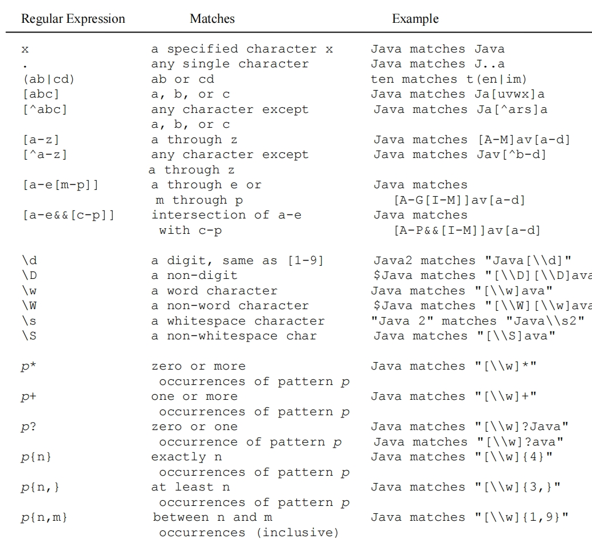

# 2.1 Thinking in Objects

## Immutable Object 不可变对象

- A class with all private data fields and without mutators(set) is not necessarily immutable!

  所有的属性都是 private 且没有 mutator 的类不一定是不可变的

- An **immutable class**:

  一个**不可变类**一定具有的特点

  1. It must mark all data fields `private`!

     **它必须将所有数据字段标记为私有！**

  2. Provide no mutator (set) methods!

     **不提供 mutator （set） 方法！**

  3. Provide **no accessor methods** that would return a reference to a mutable data field object!

     **不提供会返回对可变数据字段对象的引用的访问方法！**

练习：检查下面的类，判断它所创建的对象是否是可变的？

```java
public class Student {
    private int id;
    private Birthday birthDate;
    
    public Student(int ssn, int year, int month, int year) {
        id = ssn;
        birthDate = new BirthDate(year, month, day);
    }
    
    public int getId() {
        return id;
    }
    
    // 这里直接获取了对象的引用
    public BirthDate getBirthDate() {
        return birthDate;
    }
}

public class BirthDate {
    private year;
    private month;
    private day;
    
    public BirthDate(int newYear, int newMonth, in newDay) {
        this.year = newYear;
        this.month = newMonth;
        this.day = newDay;
    }
    
    // Getter & Setter of attributes
}
```

Answer：是的，这个类的对象时`mutable`的，因为`getBirthDate`这个方法返回的是对引用类型的变量birthDate的引用指针，所以你可以直接得到该属性存储的对象通过地址指针，并且 BirthDate 这个类还包含了set 和 get 属性的方法

> 例如：student.getBirthDate().year = 2050;

修改为`Immutable`:

```java
public class Student {
    private int id;
    private Birthday birthDate;
    
    public Student(int ssn, int year, int month, int year) {
        id = ssn;
        birthDate = new BirthDate(year, month, day);
    }
    
    public int getId() {
        return id;
    }
    
    // 修改为返回一个复制了原本对象内容的新对象，即使做修改也只是修改了新对象里的值
    public BirthDate getBirthDate() {
        return new birthDate(birthDate.getYear(), birthDate.getMonth(), birthDate.getDay());
    }
}
```

## Scope of Variables 变量的范围

- The scope of a **local variable** starts from its declaration and continues to the end of the block that contains the variable

  **局部变量**的范围从代码块声明开始，一直到包含该变量的代码块的末尾

  - Also a local variable must be **initialized** explicitly before it can be used.

    此外，局部变量必须在使用之前显式 **初始化** 。

- **Data Field Variables** can be declared anywhere inside a class

  **数据字段变量** 可以在类内的任何位置声明

  - The scope of instance and static variables is the entire class!

    实例变量和静态变量的范围是整个类！

  - Initialized with default values.

    **使用默认值初始化**。

## `this` 关键字

- The **this** keyword is the name of a reference that refers to an object itself

  **this** 关键字是引用对象本身的引用的名称

- Common uses of the **this** keyword: 

  关键字 this 的常见用法：

  1. Reference a class’s “**hidden**” data fields.

     可以用来与方法传入的与成员变量相同属性名的形参进行区分。

  2. To enable a constructor to **invoke another constructor** of the same class as the first statement in the constructor.

     能够用来代指当前对象的构造器

### Reference the Hidden Data Fields  引用隐藏的数据字段

```java
public class Foo {
	private int i = 5;
	private static double k = 0;
    
    void setI(int i) {
        this.i = i; 
    }
    
    static void setK(double k) {
        Foo.k = k;
    }
}

// Suppose that f1 and f2 are two objects of Foo.
// 假设 f1 和 f2 是 Foo 的两个对象
// Invoking f1.setI(10) is to execute 
this.i = 10; // where this refers f1
// Invoking f2.setI(45) is to execute 
this.i = 45; // where this refers f2
```

### Invoke another constructor 声明另一个构造器

```java
public class Circle {
    private double radius;
    public Circle(double radius) {
        // initialize the object with the pass value as radius.
    	this.radius = radius;
 	}
 	public Circle() {
        // calling overloaded constructuor
        // Invoke another constructor to set a default value of radius to the new object
        // 这里就是调用另一个有参构造器去设置初始值
		this(1.0);
 	}
 	public double getArea() {
        // this reference the object
		return this.radius * this.radius * Math.PI;
 	}
}
```

## Class Abstraction and Encapsulation 类抽象和封装

**Class Abstraction** = separate class implementation from the use of the class (API)

**类抽象** = 将类实现与类 （API） 的使用分开

- The creator of the class provides a description of the class and let the user know how the class can be used.

  类的创建者提供类的描述，并让用户知道如何使用该类。

- The user does not need to know how the class is implemented: it is **encapsulated** (private fields and only the public API is used).

  用户不需要知道类是如何实现的：它是 **封装的** （私有字段，仅使用公共 API）。

### Example of a Loan class


```java
public class Loan {
    private double annualInterestRate;
    private int numberOfYears;
    private double loanAmount;
    private java.util.Date loanDate;
    public Loan() {
        this(2.5, 1, 1000);
    }
    public Loan(double annualInterestRate, int numberOfYears,
                double loanAmount) {
        this.annualInterestRate = annualInterestRate;
        this.numberOfYears = numberOfYears;
        this.loanAmount = loanAmount;
        loanDate = new java.util.Date();
    }
    public double getMonthlyPayment() {
        double monthlyInterestRate = annualInterestRate / 1200;
        double monthlyPayment = loanAmount * monthlyInterestRate / (1 - (Math.pow(1 / (1 + monthlyInterestRate), numberOfYears * 12)));
        return monthlyPayment; 
    }
    public double getTotalPayment() {
        double totalPayment = getMonthlyPayment() * numberOfYears * 12;
        return totalPayment; 
    } ...
}
```

### Example of BML class


```java
public class BMI {
    private String name;
    private int age;
    private double weight; // in pounds
    private double height; // in inches
    public static final double KILOGRAMS_PER_POUND = 0.45359237; 
    public static final double METERS_PER_INCH = 0.0254; 
    public BMI(String name, int age, double weight, double height) {
        this.name = name; this.age = age; this.weight = weight; this.height = height;
    }
    public double getBMI() {
        double bmi = weight * KILOGRAMS_PER_POUND / ((height * METERS_PER_INCH) * (height * METERS_PER_INCH));
        return Math.round(bmi * 100) / 100.0;
    }
    public String getStatus() {
        double bmi = getBMI();
        if (bmi < 16) return "seriously underweight";
        else if (bmi < 18) return "underweight";
        else if (bmi < 24) return "normal weight";
        else if (bmi < 29) return "over weight";
        else if (bmi < 35) return "seriously over weight";
        else return "gravely over weight";
    } 
    public String getName() { return name; } 
    public int getAge() { return age; }
    public double getWeight() { return weight; }
    public double getHeight() { return height; }
}
```

### Example of Course class


```java
public class Course {
    private String courseName;
    private String[] students = new String[100];
    private int numberOfStudents;
    public Course(String courseName) {
        this.courseName = courseName;
    }
    public void addStudent(String student) {
        if(numberOfStudents >= students.length){
            String[] temp = new String[students.length * 2];
            System.arrayCopy(students, 0, temp, 0, students.length);
            students = temp;
        }
        students[numberOfStudents++] = student;
    }
    public String[] getStudents() {
        return students;
    }
    public int getNumberOfStudents() {
        return numberOfStudents;
    } 
    public String getCourseName() {
        return courseName;
    } 
}
```

### Example of  designing a **StackOfIntegers** Class 设计一个存储整数的栈


```JAVA
// 实现一个基本的 stack
public class StackOfIntegers {
    private int[] elements;
    private int size;
    public static final int DEFAULT_CAPACITY = 16;
    public StackOfIntegers() {
        this(DEFAULT_CAPACITY);
    }
    public StackOfIntegers(int capacity) {
        elements = new int[capacity];
    }
    public void push(int value) {
        if (size >= elements.length) {
            int[] temp = new int[elements.length * 2];
            System.arraycopy(elements, 0, temp, 0, elements.length);
            elements = temp;
        }
        elements[size++] = value;
    }
    public int pop() {
        return elements[--size];
    }
    public int peek() {
        return elements[size - 1];
    }
    public int getSize() {
        return size;
    }
}
```


## String 字符串

`String` 是 **Immutable Object**. 他本身带有 **final** 修饰符，因此实际上一个String对象在被创建之后是不会修改的，平时所使用的String之间的拼接实际上是通过创建一个新的String对象来接收拼接过后的对象。

因为String的使用非常频繁，因为为了方便创建，可以将 `String s = new String("Hello World"); `简写为 `String s = "Hello World"` // an Interned String;


### Interned Strings 内部字符串

- **String interning** is a method of storing only one copy of each distinct compile-time constant/explicit string in the source code stored in a string intern pool (e.g., s1 and s3).

  **字符串暂存** 是一种在存储在字符串暂存池（例如 s1 和 s3）中的源代码中仅存储每个不同编译时常量/显式字符串的一个副本的方法。

- If we use the **new** operator, then a new object is created in heap (e.g., s2).

  如果我们使用 **new** 运算符，则会在堆中创建一个新对象（例如，s2）。

```java
String s1 = "Welcome to Java";
String s2 = new String("Welcome to Java");
String s3 = "Welcome to Java";

System.out.println("s1 == s2 is " + (s1 == s2));
System.out.println("s1 == s3 is " + (s1 == s3));

// displays: s1 == s3 is true
// s1 == s2 is false
```


### String 的方法

#### Compare strings (equals, compareTo) 比较字符串

主要就是`equals`和`==`的区别要去分清楚。`==`被用来对比基本数据类型的时候对比的是两个属性的值是否相等，但是当被应用到引用数据类型的时候，将会对比两个对象的引用地址是否相等，也就是说即使两个对象的属性完全相同也不会返回true因为这可能是两个独立的对象。

因此在很多时候我们实际上想要对比的是两个对象之间所包含的属性是否都相同，所以这个时候我们需要重写`equals`方法来实现比较两个对象的属性值而不是对象的引用地址。（其实这个时候还需要额外修改`hashcode`方法，道理是一样的，两个不同地址的对象即使值相等生成的散列值也不会相等，这样仍然无法判断对象的属性值是否都相等。）

```java
equals(Object object):
String s1 = new String("Welcome");
String s2 = "Welcome";
if (s1.equals(s2)){ // true
    // s1 and s2 have the same contents 
}
if (s1 == s2) { // false
    // s1 and s2 have different references 
}
```

```java
equals(Object object):
String s1 = "Welcome";
String s2 = "Welcome";
if (s1.equals(s2)){ // true
    // s1 and s2 have the same contents 
}
if (s1 == s2) { // true
    // s1 and s2 have the same reference 
}
```

```java
compareTo(Object object):
String s1 = new String("Welcome");
String s2 = new String("Welcome");
if (s1.compareTo(s2) > 0) { 
    // s1 is greater than s2 
}else if (s1.compareTo(s2) == 0) { 
    // s1 and s2 have the same contents 
}else{
    // s1 is less than s2
}
```


- equals(s1: String): boolean
  - Returns true if this string is equal to string s1.

    如果该字符串等于字符串s1，则返回true。
  
- equalsIgnoreCase(s1: String): boolean
  - Returns true if this string is equal to string s1 case insensitive （不区分大小写）.

    如果此字符串等于字符串 s1，则返回 true，不区分大小写
  
- compareTo(s1: String): int
  - Returns an integer greater than 0, equal to 0, or less than 0 to indicate whether this string is greater than, equal to, or  less than s1.

    返回一个大于 0、等于 0 或小于 0 的整数，以指示此字符串是大于、等于还是小于 s1。
  
- compareToIgnoreCase(s1: String): int
  - Same as compareTo except that the comparison is case insensitive.

    与compareTo相同，只不过不区分大小写。
  
- regionMatches(toffset: int, s1: String, offset: int, len: int): boolean
  - Returns true if the specified subregion of this string exactly matches the specified subregion in string s1.
  
    如果此字符串的指定子区域与字符串s1中的指定子区域完全匹配，则返回true。
  
- regionMatches(ignoreCase: boolean, toffset: int, s1: String, offset: int, len: int): boolean
  - Same as the preceding method except that you can specify whether the match is case-sensitive.

    与上述方法相同，但您可以指定匹配是否区分大小写。
  
- startsWith(prefix: String): boolean
  - Returns true if this string starts with the specified prefix.

    如果此字符串以指定的前缀开头，则返回true。
  
- endsWith(suffix: String): boolean
  - Returns true if this string ends with the specified suffix.
  
    如果此字符串以指定的后缀结尾，则返回true。

#### Obtaining String length (length(): int) 获取字符串长度


#### Retrieving Individual Characters in a string (charAt(index: int): char)

根据提供的索引值检索字符串中的单个字符

- Use **string_message.charAt(index)**→ **char**
- Index starts from 0


#### String Concatenation (concat(s1: String): String)

字符串拼接

#### Substrings (substring(beginIndex: int): String 或者 substring(beginIndex: int, endIndex: int): String)

获取连续子串；注意如果提供了结尾的索引，最后子串截止的地方应该是 **endIndex - 1**；


```java
String s1 = "Welcome to Java";

String s2 = s1.substring(0, 11) + "HTML";
```


#### Finding a Character or a Substring in a String 从字符串中找到特定的字符或连续子串


- indexOf(ch: char): int

  - Returns the index of the first occurrence of ch in the string. Returns -1 if not matched.

    返回字符串中第一次出现的 ch 的索引。如果不匹配，则返回 -1。

- indexOf(ch: charfromIndex: int): int

  - Returns the index of the first occurrence of ch after fromIndex in the string. Returns -1 if not matched.

    返回字符串中 fromIndex 之后第一次出现的 ch 的索引。如果不匹配，则返回 -1。

- indexOf(s:String):int

  - Returns the index of the first occurrence of string s in this string. Returns -1 if not matched.

    返回此字符串中第一次出现的字符串 s 的索引。如果不匹配，则返回 -1。

- indexOf(s: String, fromIndex:int): int

  - Returns the index of the first occurrence of string s in this string after fromIndex. Returns -1 if not matched.

    返回此字符串中 fromIndex 之后首次出现的字符串 s 的索引。如果不匹配，则返回 -1。

- lastIndexOf(ch: int): int

  - Returns the index of the last occurrence of ch in the string. Returns -1 if not matched.

    返回字符串中最后一次出现的 ch 的索引。如果不匹配，则返回 -1。

- lastIndexOf(ch: int,fromIndex: int): int

  - Returns the index of the last occurrence of ch before fromIndex in this string. Returns -1 if not matched.

    返回此字符串中 fromIndex 之前最后一次出现的 ch 的索引。如果不匹配，则返回 -1。

- lastIndexOf(s: String): int

  - Returns the index of the last occurrence of string s. Returns -1 if  not matched.

    返回字符串 s 的最后一次出现的索引。如果不匹配，则返回 -1。

- lastIndexOf(s: String, fromIndex: int): int

  - Returns the index of the last occurrence of string s before fromIndex. Returns -1 if not matched.

    返回 fromIndex 之前最后一次出现的字符串 s 的索引。如果不匹配，则返回 -1。

- 

#### Matching, Replacing and Splitting by Patterns 匹配，替换和按照规律分割

- matches(regex: String): boolean

  - Returns true if this string matches the pattern.

    如果此字符串与模式匹配，则返回 true。

- replaceAll(regex: String, replacement: String): String

  - Returns a new string that replaces all matching substrings with the replacement.

    返回一个新字符串，该字符串将所有匹配的子字符串替换为替换项。

- replaceFirst(regex: String, replacement: String): String

  - Returns a new string that replaces the first matching substring with the replacement.

    返回一个新字符串，该字符串将第一个匹配的子字符串替换为替换项。

- split(regex: String): String[]

  - Returns an array of strings consisting of the substrings split by the matches.

    返回一个字符串数组，该数组由按匹配项拆分的子字符串组成。

#### Converting Characters and Numeric Values to Strings() 将字符和数字转换为字符串

- toLowerCase(): String

  - Returns a new string with all characters converted to lowercase.

    返回一个新字符串，其中所有字符都转换为小写。

- toUpperCase(): String

  - Returns a new string with all characters converted to uppercase.

    返回一个新字符串，其中所有字符都转换为大写。

- trim(): String

  - Returns a new string with blank characters trimmed on both sides.

    返回一个新字符串，其中两边都修剪了空白字符。

- replace(oldChar: char, newChar: char): String

  - Returns a new string that replaces all matching character in this string with the new character.

    返回一个新字符串，该字符串将此字符串中的所有匹配字符替换为新字符。

- replaceFirst(oldString: String, newString: String): String

  - Returns a new string that replaces the first matching substring in  this string with the new substring.

    返回一个新字符串，该字符串将此字符串中的第一个匹配子字符串替换为新子字符串。

- replaceAll(oldString: String, newString: String): String

  - Returns a new string that replace all matching substrings in this string with the new substring.

    返回一个新字符串，该字符串将此字符串中的所有匹配子字符串替换为新子字符串。

- split(delimiter: String): String[]

  - Returns an array of strings consisting of the substrings split by the delimiter.

    返回一个字符串数组，该数组由由分隔符分割的子字符串组成。(传入的值为分割符，最终的结果里不会携带)

#### Splitting a String 分割字符串

```java
String[] tokens = "Java#HTML#Perl".split("#");

for(int i = 0; i < tokens.length; i++) 
    System.out.println(tokens[i]);

// display
Java 
HTML 
Perl
```

#### Matching, Replacing and Splitting by Patterns 正则表达式

- The replaceAll, replaceFirst, split and matches methods can be used with a **regular expression (a sequence of characters that specifies a search pattern)**

  - Example: the following statement returns a new string that replaces \$, +,or # in "a+b$#c" by the string NNN.

  - ```java
    String s = "a+b$#c".replaceAll("[$+#]", "NNN");
    System.out.println(s);
    
    // display
    aNNNbNNNNNNc
    ```

  - The regular expression [\$+#] specifies a pattern that matches $, +, or #


- 正则表达式



- The following statement splits the string into an array of strings delimited by some punctuation marks:

  以下语句将字符串拆分为由一些标点符号分隔的字符串数组：

```java
String[] tokens = "Java,C;C#.C++".split("[,;.]");

for (int i = 0; i < tokens.length; i++)
    System.out.println(tokens[i]);

// display:
Java
C
C#
C++
```

```java
String s = "Java Java Java".replaceAll("v\\w", "wi") ;
// “Jawi Jawi Jawi”
String s2 = "Java Java Java".replaceFirst("v\\w", "wi") ;
// “Jawi Java Java”
String[] s3 = "Java1HTML2Perl".split("\\d");
// [“Java”, “HTML”, “Perl”]
```

#### Command-Line Parameters 命令行参数

- 案例

  ```java
  public class AddNumbers {
      public static void main(String[] args) {
          if (args.length != 2) {
              System.out.println("Usage: java AddNumbers <num1> <num2>");
              return;
          }
  
          try {
              // 这里是 arg[n] 代表的是命令行输入的顺序
              int num1 = Integer.parseInt(args[0]);
              int num2 = Integer.parseInt(args[1]);
              int sum = num1 + num2;
              System.out.println("Sum: " + sum);
          } catch (NumberFormatException e) {
              System.out.println("Invalid input. Please enter integers.");
          }
      }
  }
  
  // 然后再命令行输入
  javac Calculator.java
  java AddNumbers 10 20
  // 程序会自动捕捉到要传入的两个参数然后最终输出30
  ```

### StringBuilder & StringBuffer

- The **StringBuilder/StringBuffer** classes are alternatives to the **String** class:

  是 String 类的替代项：

  - **StringBuilder/StringBuffer** can be used wherever a string is used

    可以在使用字符串的任何地方使用

    - **StringBuffer** is **synchronized** i.e. thread safe. It means two threads can't call the methods of **StringBuffer** simultaneously.

      StringBuffer 是**同步**的，即线程安全的。这意味着两个线程不能同时调用 StringBuffer 的方法。
  
    - **StringBuilder** is **non-synchronized** i.e. not thread safe. It means two threads can call the methods of StringBuilder simultaneously.
  
      StringBuilder 是**非同步**的，即不是线程安全的。这意味着两个线程可以同时调用 StringBuilder 的方法。
  
  - **StringBuilder/StringBuffer** is more flexible than **String**
  
    StringBuilder/StringBuffer 比 String 更灵活
    
    - You can **add**, **insert**, or **append** new contents into a string buffer, whereas the value of a **String** object is fixed once the string is created
    
      您可以将新内容 **添加、插入 或 附加** 到字符串缓冲区中，而 String 对象的值在创建字符串后是固定的

### StringBuilder Constructor


### StringBuilder的一些方法

- append(data: char[]): StringBuilder

  - Appends a char array into this string builder.

    将 char 数组追加到此字符串生成器中。

- append(data: char[], offset: int, len: int): StringBuilder

  - Appends a subarray in data into this string builder.

    将 data 中的子数组追加到此字符串生成器中。

- append(v: aPrimitiveType): StringBuilder

  - Appends a primitive type value as a string to this builder.

    将原始类型值作为字符串附加到此生成器。

- append(s: String): StringBuilder

  - Appends a string to this string builder.

    将字符串追加到此字符串生成器。

- delete(startIndex: int, endIndex: int):StringBuilder

  - Deletes characters from startIndex to endIndex.

    删除从 startIndex 到 endIndex 的字符。

- deleteCharAt(index: int): StringBuilder

  - Deletes a character at the specified index.

    删除指定索引处的字符。

- insert(index: int, data: char[], offset: int,len: int): StringBuilder

  - Inserts a subarray of the data in the array to the builder at the specified index.

    将数组中数据的子数组插入到生成器的指定索引处。

- insert(offset: int, data: char[]):StringBuilder

  - Inserts data into this builder at the position offset.

    在位置偏移处将数据插入到此生成器中。

- insert(offset: int, b: *aPrimitiveType*):StringBuilder

  - Inserts a value converted to a string into this builder.

    将转换为字符串的值插入到此构建器中。

- insert(offset: int, s: String): StringBuilder

  - Inserts a string into this builder at the position offset.

    在位置 offset 处插入字符串到此构建器中。

- replace(startIndex: int, endIndex: int, s:String): StringBuilder

  - Replaces the characters in this builder from startIndex to endIndex with the specified string.

    将此生成器中从 startIndex 到 endIndex 的字符替换为指定的字符串。

- reverse(): StringBuilder

  - Reverses the characters in the builder.

    反转生成器中的字符。

- setCharAt(index: int, ch: char): void

  - Sets a new character at the specified index in this builder.

    在此构建器中的指定索引处设置新字符。

#### Modifying StringBuilder(s)

```java
StringBuilder stringBuilder = new StringBuilder();
stringBuilder.append("Java");  // Java
stringBuilder.insert(2,"HTML and ");  // JaHTML and va
stringBuilder.delete(3, 4);  // JaHML and va
stringBuilder.deleteCharAt(5);  // JaHMLand va
stringBuilder.reverse();   // av dnaLMHaJ
stringBuilder.replace(4, 8, "HTML");  // av dHTMLHaJ
stringBuilder.setCharAt(0, 'w');  // wv dHTMLHaJ
```

#### The toString, capacity, length, setLength, and charAt Methods


### Character类


#### equals() and compareTo()

```java
Character charObject = new Character('b');

charObject.equals(new Character('b')) 
returns true
    
charObject.equals(new Character('d')) 
returns false
    
charObject.compareTo(new Character('a')) 
returns 1
    
charObject.compareTo(new Character('b')) 
returns 0
    
charObject.compareTo(new Character('c')) 
returns –1
    
charObject.compareTo(new Character('d') 
returns –2
```

### intern() 方法

- **String interning** is a method of storing only one copy of each distinct compile-time constant/explicit string in the source code stored in a string intern pool (e.g., s1 and s3).

  **字符串暂存** 是一种在存储在字符串暂存池（例如 s1 和 s3）中的源代码中仅存储每个不同编译时常量/显式字符串的一个副本的方法。

- If we use the **new** operator, then a new object is created in heap (e.g., s2).

  如果我们使用 new 运算符，则会在堆中创建一个新对象无论此时字符串常量池中是否存在与之相同的字符（例如，s2）。


`intern` 方法详解:

```java
String s1 = new String("Hello"); // 在堆中创建一个新的字符串对象
String s2 = s1.intern();        // 将 s1 的内容添加到字符串常量池，并返回常量池中的引用
String s3 = "Hello";            // 直接使用字符串常量池中的引用

System.out.println(s1 == s2);   // false，s1 是堆中的对象，s2 是常量池中的引用
System.out.println(s2 == s3);   // true，s2 和 s3 都指向常量池中的同一个对象
```

1. **new String("Hello")**：
   - 在堆内存中创建一个新的字符串对象，即使字符串常量池中已经存在 `"Hello"`。
2. **s1.intern()**：
   - 检查字符串常量池中是否存在 `"Hello"`。
   - 如果存在，则返回常量池中的引用。
   - 如果不存在，则将 `"Hello"` 添加到常量池中，并返回常量池中的引用。
3. **"Hello"**：
   - 直接使用字符串常量池中的引用。

## Design a Class 设计一个类

- **Coherence**: A class should describe a single entity

  **一致性**：一个类应该描述一个实体

  - Separating responsibilities: A single entity with too many responsibilities can be broken into several classes to separate responsibilities

    职责分离：可以将具有过多职责的单个实体分为多个类来分离职责

- **Reuse**: Classes are designed for reuse!

  **重用**：类是为重用而设计的！

- Follow standard Java programming style and naming conventions:

  遵循标准的 Java 编程样式和命名约定：

  - Choose informative names for classes, data fields, and methods

    为类、数据字段和方法选择信息性名称

- Place the data declaration before the constructor,and place constructors before methods.

  将数据声明放在构造函数之前，并将构造函数放在方法之前。

- Provide a **public no-arg constructor** and override the **equals** method and the **toString** method (returns a **String**) whenever possible

  提供公共 no-arg 构造函数，并尽可能覆盖 equals 方法和 toString 方法（返回 String）

## Questions

- What is the output of the following code:

  ```java
  String s1 = "Hello World";
  String s2 = new String("Hello World");
  String s3 = "Hello World";
  System.out.println((s1 == s2) + " " + (s1.equals(s2)));
  ```

  Answer: 输出的应该是 `false true` (String类的`equals`方法用于比较两个字符串对象的内容值，而不是它们的引用地址。)

- What is the output of the following code:

  ```java
  String s1 = "Hello World";
  String s2 = new String("Hello World");
  String s3 = "Hello World";
  System.out.println((s1 == s3) + " " + (s1.equals(s3)));
  ```

  Answer: 输出的应该是`true true`, 因为`s1` 和 `s3` 指向的是**字符串常量池**中的同一个对象，它们的引用（地址）相同。而String的`equals`方法已经被重写为只对比两个对象的值，而不是地址。

