# 3 Abstract Class 抽象类

## Introduction

GeometricObject class:

```java
public abstract class GeometricObject {
    private String color = "white";
    private boolean filled;
    private java.util.Date dateCreated;
    
    protected GeometricObject() {
    	dateCreated = new java.util.Date();
    }
    
    protected GeometricObject(String color, boolean filled) {
        dateCreated = new java.util.Date();
        this.color = color;
        this.filled = filled;
    }
    public String getColor() { return color; }
    
    public void setColor(String color) { this.color = color; }
    
    public boolean isFilled() { return filled; }
    
    public void setFilled(boolean filled) { this.filled = filled; }
    
    public java.util.Date getDateCreated() { return dateCreated; }
    
    public String toString() {
        return "created on " + dateCreated + "\ncolor: " + color +
        " and filled: " + filled;
    }
    /** Abstract method getArea */
    public abstract double getArea();
    
    /** Abstract method getPerimeter */
    public abstract double getPerimeter();
}
```

Circle Class:

```java
public class Circle extends GeometricObject {
    private double radius;
    
    public Circle() { }
    
    public Circle(double radius) {
    	this.radius = radius; 
    }
    
    public double getRadius() {
    	return radius;
    }
    
    public void setRadius(double radius) {
    	this.radius = radius; 
    }
    
    public double getArea() {
    	return radius * radius * Math.PI;
    }
    
    public double getPerimeter() {
    	return 2 * radius * Math.PI;
    }
    
    public double getDiameter() {
    	return 2 * radius;
    }
}
```

Rectangle Class:

```java
public class Rectangle extends GeometricObject {
    private double width;
    private double height;
    
    public Rectangle() { 
    // super();
    }
    
    public Rectangle(double width, double height) {
        this();
        this.width = width;
        this.height = height;
    }
    
    public Rectangle(double width, double height, String color, 
    boolean filled) {
        super(color,filled);
        this.width = width;
        this.height = height;
    }
    
    public double getWidth() { return width; }
    
    public void setWidth(double width) { this.width = width; }
    
    public double getHeight() { return height; }
    
    public void setHeight(double height) { this.height = height; } 
    
    public double getArea() {
        return width * height;
    }
    
    public double getPerimeter() {
        return 2 * (width + height);
    }
}
```

TestGeometricObject1 Class

```java
public class TestGeometricObject1 {
    public static void main(String[] args) {
        // Declare and initialize two geometric objects
        // 声明两个 geObject 对象，这里使用了不同的构造器方法
        GeometricObject geoObject1 = new Circle(5);
        GeometricObject geoObject2 = new Rectangle(5, 3);
        // Display circle
        displayGeometricObject(geoObject1);
        // Display rectangle
        displayGeometricObject(geoObject2);
        System.out.println("The two objects have the same area? " +
        equalArea(geoObject1, geoObject2));
    }
    /** A method for displaying a geometric object */
    public static void displayGeometricObject(GeometricObject object) {
        System.out.println(object); // object.toString()
        System.out.println("The area is " + object.getArea());
        System.out.println("The perimeter is " + object.getPerimeter());
    }
    /** A method for comparing the areas of two geometric objects */
    public static boolean equalArea(GeometricObject object1,GeometricObject object2) {
        return object1.getArea() == object2.getArea();
    }
}
```

## Abstract classes

### Abstract methods in abstract classes 抽象类中的抽象方法

**An abstract method can only be contained in an abstract class.**

**抽象方法只能包含在抽象类中。**

### Subclasses of abstract classes 抽象类的子类

- In a nonabstract (a.k.a., concrete) subclass extended from an abstract super-class, all the abstract methods **MUST** be implemented

  在从抽象超类扩展的非抽象(又称具体)子类中,**必须实现所有**抽象方法

- In an abstract subclass extended from an abstract super-class, we can choose:
  
  在从抽象超类扩展而来的抽象子类中，我们可以选择：(详见问题1)
  
  - to implement the inherited abstract methods OR
  
    实现继承的抽象方法，或者
  
  - to postpone the constraint to implement the abstract methods to its nonabstract subclasses.
  
    将约束推迟到其非抽象子类中实现抽象方法。

<hr>

### General rules of abstract classes 抽象类的一般规则

- A subclass can be abstract even if its superclass is concrete.

  一个子类可以是抽象的,即使它的超类是具体的。

  - For example, the **Object** class is concrete, but a subclass, **GeometricObject**, is abstract

    例如,Object 类是具体的,但子类 GeometricObject 是抽象的。

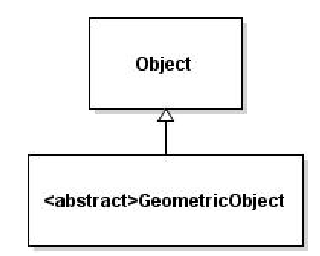

- A subclass can override a method from its concrete superclass to define it **abstract**

  子类可以覆盖其具体超类的方法通过在超类中定义该方法为 **抽象**

  - useful when we want to **force** its subclasses to implement that method, or

    通常需要在超类中定义抽象方法的情景是，我们要  **强制**  子类实现该方法时,或者

  - the implementation of the method in the superclass is invalid in the subclass

    想让在超类中实现的方法在子类中改变用途

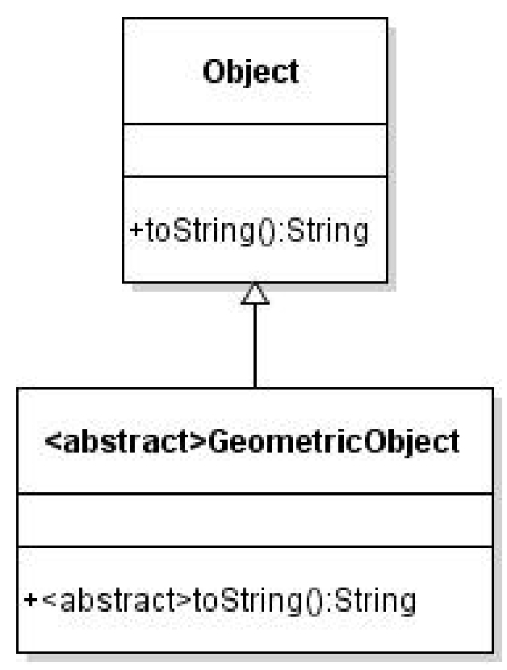

- It is possible to define an abstract class that contains no abstract methods.

  可以定义一个不包含抽象方法的抽象类。

  - **This class is used as a base class for defining new subclasses.**

    此类用作定义新子类的基类。

- An object **cannot** be created from abstract class:

  一个对象**不能**从抽象类创建:

  - An abstract class cannot be instantiated using the **new** operator:

    **抽象类不能使用 new 运算符实例化:**

    > GeometricObject o = ~~new GeometricObject();~~

  - We still define its constructors, which are invoked in the constructors of its subclasses through **constructor chaining**.

    我们仍然定义它的构造函数,这些构造函数通过 **构造函数链** 在它的子类的构造函数中被调用。

    - For instance, the constructors of **GeometricObject** are invoked by the constructors in the **Circle** and the **Rectangle** classes.

      例如，我们没办法直接调用GeometricObject的构造器来创建该类，但是 GeometricObject 的构造函数会被 Circle 和 Rectangle 类中的构造函数调用。

### Abstract classes as type

- An abstract class can be used as a data type:

  **抽象类可以用作数据类型:**

  - **GeometricObject c = new Circle(2);**

- We can create an array whose elements are of **GeometricObject** type:

  我们可以创建一个元素为 GeometricObject 类型的数组:

  **GeometricObject[] geo = new GeometricObject[10];**

  - There are only **null** elements in the array until they are initialized with concrete objects:

    在数组中的元素初始都是 null, 直到它们被具体对象初始化:

  - **geo[0] = new Circle();**

  - **geo[1] = new Rectangle();**

### The abstract Calendar class and its GregorianCalendar subclass

- An instance of **java.util.Date** represents a specific instant in time with millisecond precision

  java.util.Date 的实例表示具有毫秒精度的特定时刻

- **java.util.Calendar** is an abstract base class for extracting detailed information such as **year**, **month**, **date**,**hour**, **minute** and **second** from a **Date** object for a specific calendar

  java.util.Calendar 是一个抽象基类，用于从特定日历的 日期 对象中提取详细信息，例如 年、月、日期、小时、分钟 和 秒

  - Subclasses of **Calendar** can implement specific calendar systems such as Gregorian calendar, Lunar Calendar and Jewish calendar.
  
    Calendar 的子类可以实现特定的日历系统，例如公历、农历和犹太历。
  
  - **java.util.GregorianCalendar** is for the modern Gregorian calendar
  
    java.util.GregorianCalendar 适用于现代格里高利历

#### The GregorianCalendar Class

- Java API for the **GregorianCalendar** class: http://docs.oracle.com/javase/8/docs/api/java/util/GregorianCalendar.html

  - **new GregorianCalendar()** constructs a default **GregorianCalendar** with the current time

    new GregorianCalendar（） 使用当前时间构造一个默认的 GregorianCalendar

  - **new GregorianCalendar(year, month,** **date)** constructs a **GregorianCalendar** with the specified **year**, **month**, and **date**
  
    新的 GregorianCalendar（year， month， date） 构造一个具有指定 年、月 和 日期 的 GregorianCalendar
  
  - The **month** parameter is 0-based, i.e., 0 is for January, 1is for February, …, 11 is for December.
  
    month 参数从 0 开始，即 0 表示 1 月，1 表示 2 月，...，11 表示 12 月。

#### The abstract Calendar class and its GregorianCalendar subclass

**java.util.Calendar**：

- Calendar()

  - Constructs a default calendar.

    构造默认日历。

- get(field: int): int

  - Returns the value of the given calendar field.

    返回给定 calendar 字段的值。

- set(field: int, value: int): void

  - Sets the given calendar to the specified value.

    将给定的日历设置为指定的值。

- set(year: int, month: int, dayOfMonth: int): void

  - Sets the calendar with the specified year, month, and date. The month parameter is 0-based, that is, 0 is for January

    使用指定的年、月和日期设置日历。month 参数从 0 开始，即 0 表示 1 月

- getActualMaximum(field: int): int

  - Returns the maximum value that the specified calendar field could have.

    返回指定日历字段可以具有的最大值。

- add(field: int, amount: int): void

  - Adds or subtracts the specified amount of time to the given calendar field

    向给定的日历字段添加或减去指定的时间量

- getTime(): java.util.Date

  - Returns a Date object representing this calendar’s time value (million second offset from the Unix epoch).

    返回一个 Date 对象，该对象表示此日历的时间值（与 Unix 纪元的偏移量为百万秒）。

- setTime(date: java.util.Date): void （这里放入具体的日期类型然后根据传入的日期类型来生成时间）

  - Sets this calendar’s time with the given Date object.

    使用给定的 Date 对象设置此日历的时间。

**java.util.GregorianCalendar**

- GregorianCalendar()

  - Constructs a GregorianCalendar for the current time.

    构造当前时间的 GregorianCalendar。

- GregorianCalendar(year: int, month: int, dayOfMonth: int)

  - Constructs a GregorianCalendar for the specified year, month, and day of month.

    为指定的年、月和月中的日期构造 GregorianCalendar。

- GregorianCalendar(year: int, month: int, dayOfMonth: int, hour:int, minute: int, second: int)

  - Constructs a GregorianCalendar for the specified year, month, day of month, hour, minute, and second. The month parameter is 0-based, that is, 0 is for January.

    为指定的年、月、月、日、小时、分钟和秒构造 GregorianCalendar。month 参数从 0 开始，即 0 表示 1 月。

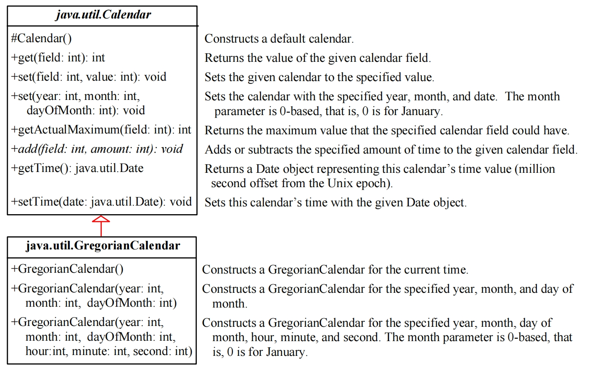

#### The get Method in the Calender Class

The get(int field) method defined in the Calendar class is useful to extract the date and time information from a Calendar object.

在 Calendar 类中定义的 get（int field） 方法可用于从 Calendar 对象中提取日期和时间信息。

The fields are defined as constants in Calendar:

日历类中的元素被声明为常量

- YEAR	The year of the calendar.
- MONTH	The month of the calendar with 0 for January.
- DATE	The day of the calendar.
- HOUR	The hour of the calendar (12-hour notation). 
- HOUR_OF_DAY 	The hour of the calendar (24-hour notation). 
- MINUTE 	The minute of the calendar.
- SECOND 	The second of the calendar.
- DAY_OF_WEEK 	The day number within the week with 1 for Sunday.
- DAY_OF_MONTH 	Same as DATE.
- DAY_OF_YEAR	The day number in the year with 1 for the first day of the year.
- WEEK_OF_MONTH 	The week number within the month.
- WEEK_OF_YEAR	The week number within the year.
- AM_PM	Indicator for AM or PM (0 for AM and 1 for PM).

Code Example:

```java
import java.util.*;
public class TestCalendar {
    public static void main(String[] args) {
        // Construct a Gregorian calendar for the current date and time
        Calendar calendar = new GregorianCalendar();
        System.out.println("Current time is " + new Date());
        System.out.println("YEAR:\t" + calendar.get(Calendar.YEAR));
        System.out.println("MONTH:\t" + calendar.get(Calendar.MONTH));
        System.out.println("DATE:\t" + calendar.get(Calendar.DATE));
        System.out.println("HOUR:\t" + calendar.get(Calendar.HOUR));
        System.out.println("HOUR_OF_DAY:\t" + calendar.get(Calendar.HOUR_OF_DAY));
        System.out.println("MINUTE:\t" + calendar.get(Calendar.MINUTE));
        System.out.println("SECOND:\t" + calendar.get(Calendar.SECOND));
        System.out.println("DAY_OF_WEEK:\t" + calendar.get(Calendar.DAY_OF_WEEK));
        System.out.println("DAY_OF_MONTH:\t" + calendar.get(Calendar.DAY_OF_MONTH));
        System.out.println("DAY_OF_YEAR: " + calendar.get(Calendar.DAY_OF_YEAR));
        System.out.println("WEEK_OF_MONTH: " + calendar.get(Calendar.WEEK_OF_MONTH));
        System.out.println("WEEK_OF_YEAR: " + calendar.get(Calendar.WEEK_OF_YEAR));
        System.out.println("AM_PM: " + calendar.get(Calendar.AM_PM));
        // Construct a calendar for January 1, 2020
        Calendar calendar1 = new GregorianCalendar(2020, 0, 1);
        System.out.println("January 1, 2020 is a " + 
        dayNameOfWeek(calendar1.get(Calendar.DAY_OF_WEEK)) );
    } 
    
    public static String dayNameOfWeek(int dayOfWeek) {
        switch (dayOfWeek) {
            case 1: return "Sunday“; case 2: return "Monday“; case 3: return "Tuesday“; 
            ... case 7: return "Saturday";
            default: return null;
        }
    }
}
```

## Interfaces 接口

- An **interface** is a class-like construct that contains **only abstract methods and constants**. (如果在1.8之后，还可以包含 default methods, and static methods，注意一定要是 default methods 而不是 instance methods)

  接口是一种类状结构，**仅包含抽象方法和常量**。

- Why is an interface useful?

  为什么接口有用？

  - An interface is similar to an abstract class, but the intent of an interface is to **specify behavior** for objects.

    接口类似于抽象类，但接口的目的是指定对象的**行为**。

    - For example: specify that the objects are **comparable**, **edible**, **cloneable**, …

      例如：指定对象是 comparable、edible、cloneable、...

  - Allows multiple inheritance: a class can implement multiple interfaces.

    **允许多重继承：一个类可以实现多个接口。**

**几个主要的接口很有可能出现在考试中, 例如 comparable**

### interface Example 接口案例

```java
// The Edible interface specifies whether an object is edible
public interface Edible {
	public abstract String howToEat();
}

// The class Chicken implements the Edible interface:
class Chicken extends Animal implements Edible {
    public String howToEat() {
    	return "Chicken: Fry it";
    }
}
```

进阶案例: (搭配下方问题2)

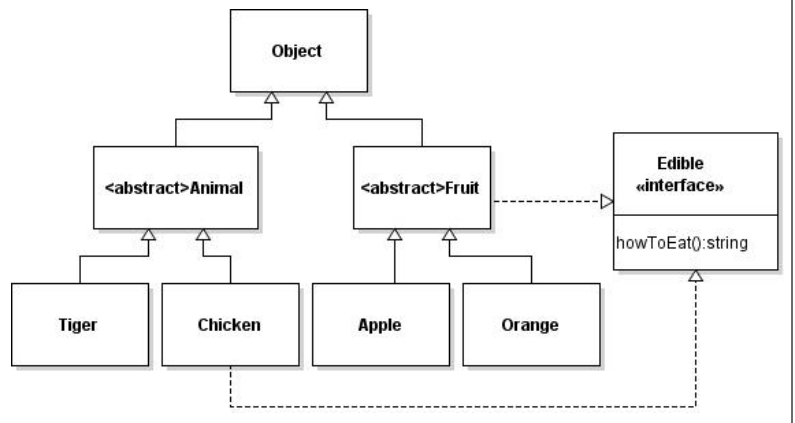

```java
interface Edible {
	public abstract String howToEat(); /** Describe how to eat */
}

// 动物
abstract class Animal { }

// 鸡
class Chicken extends Animal implements Edible {
    public String howToEat() {
    	return "Chicken: Fry it";
    }
}

// 老虎 没有 implements Edible
class Tiger extends Animal { }

// 水果
abstract class Fruit implements Edible { }

// 苹果
class Apple extends Fruit {
    public String howToEat() {
        return "Apple: Make apple cider";
    }
}

// 橙子
class Orange extends Fruit {
    public String howToEat() {
    	return "Orange: Make orange juice";
    }
}

public class TestEdible {
    public static void main(String[] args) {
        Object[] objects = {new Tiger(), new Chicken(), new Apple()};
        for (int i = 0; i < objects.length; i++) {
            if (objects[i] instanceof Edible)
            	System.out.println(((Edible)objects[i]).howToEat());
        }
    }
}
```

### Omitting Modifiers in Interfaces  在接口中省略修饰符

In an interface:

在接口中

- All data fields are **public static final**

  所有的变量的访问修饰符都默认是 **public static final**

- All methods are **public abstract**

  所有方法的访问修饰符都是 **public abstract**	

- These modifiers can be omitted:

  在接口中的常量可以直接通过`InterfaceName.ConstantFieldName` 获取到。

  ```java
  public interface T1 {
      public static final int K = 1;
      public abstract void p();
  }
  
  // 可以直接简写为
  public interface T1 {
      int K = 1;
      void p();
  }
  ```

- An interface is treated like a **special class** in Java:

  接口被视为 Java 中的**特殊类**：

  - Each interface is compiled into a separate bytecode file just like a regular class.

    每个接口都编译成一个单独的字节码文件，就像常规类一样。

  - Like an abstract class, you cannot create an instance from an interface using the **new** operator

    **与抽象类一样，不能使用 new 运算符从接口创建实例**

  - Uses of interfaces are like for abstract classes:

    接口的用法与抽象类类似：

    - as a **data type** for a variable

      作为变量的数据类型

    - as the result of **casting**

      作为类型转换的结果

### The Comparable Interface

The **Comparable** interface is defined in the **java.lang** package and it is used by **Arrays.sort**

Comparable 接口在 java.lang 包中定义，并由 Arrays.sort 使用

```java
package java.lang;
public interface Comparable {
	int compareTo(Object o);
}
```

Many classes in the Java library implement **Comparable** (e.g., **String** and **Date**) to define a **natural order** for the objects:

Java 库中的许多类都实现了 Comparable（例如，String 和 Date）来定义对象的**自然顺序**：

```java
new String() instanceof String // true
new String() instanceof Comparable // true
new java.util.Date() instanceof java.util.Date // true
new java.util.Date() instanceof Comparable // true
```

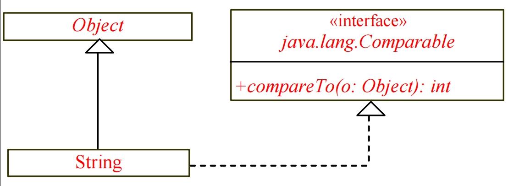

**String类继承了Object类，同时也实现了Comparable 接口中的 compareTo 方法**

#### Comparable 接口实现：

max 方法的返回值为 Comparable 类型。因此，我们需要将其显式转换为 String 或 Date。

限定传入的类型是实现了 Comparable 接口的类

```java
// 写法1
// Max.java: Find a maximum object
// 找到最大的对象
public class Max {
    /** Return the maximum of two objects */
    public static Comparable max (Comparable o1, Comparable o2) {
        if (o1.compareTo(o2) > 0)
        	return o1;
        else
        	return o2;
    }
}

String s1 = "abcdef";
String s2 = "abcdee";
// 这里需要把 Comparable 的结果转换为 String 类型
String s3 = (String)Max.max(s1, s2);

// 写法2
// Max.java: Find a maximum object
public class Max {
    /** Return the maximum of two objects */
    public static Object max (Object o1, Object o2) {
        if (((Comparable)o1).compareTo(o2) > 0)
        	return o1;
        else
        	return o2;
    }
}

Date d1 = new Date();
Date d2 = new Date();
// 这里需要把 Comparable 结果转换成 Date 类型
Date d3 = (Date) Max.max(d1, d2);
```

##### Define Classes to Implement Comparable  定义要实现 Comparable 的类

- We cannot use the max method to find the larger of two instances of Rectangle, because Rectangle does not implement Comparable

  我们不能使用 max 方法查找 Rectangle 的两个实例中的较大者，因为 Rectangle 没有实现 Comparable

- We can define a new rectangle class ComparableRectangle that implements Comparable: the instances of this new class are comparable

  我们可以定义一个新的矩形类 ComparableRectangle 来实现 Comparable：这个新类的实例是可比较的

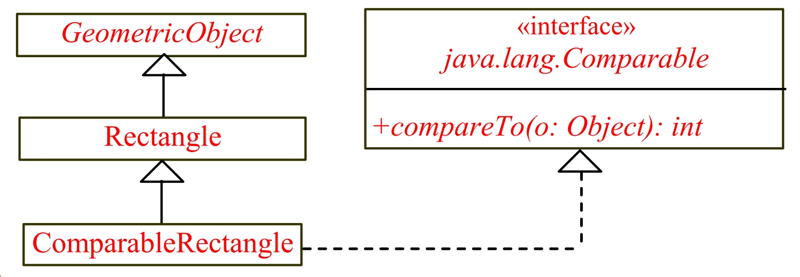

```java
public class ComparableRectangle extends Rectangle implements Comparable {
    /** Construct a ComparableRectangle with specified properties */
    public ComparableRectangle(double width, double height) {
        super(width, height);
    }
    /** Implement the compareTo method defined in Comparable */
    public int compareTo(Object o) {
        if (getArea() > ((ComparableRectangle)o).getArea())
        	return 1;
        else if (getArea() < ((ComparableRectangle)o).getArea())
        	return -1;
        else
        	return 0;
    }
    public static void main(String[] args) {
        ComparableRectangle rectangle1 = new ComparableRectangle(4, 5);
        ComparableRectangle rectangle2 = new ComparableRectangle(3, 6);
        System.out.println(Max.max(rectangle1, rectangle2));
    }
}
```

实际上Comparable进行自然排序的方法就是同意比较当前对象和传入对象指定属性的大小。如果当前对象**大于**传入的对象，则返回正数，如果当前的对象**等于**传入的对象，则返回0，如果当前对象**小于**传入对象，则返回负数。

### The Cloneable Interface

- **Marker Interface**: is an **empty interface** (does not contain constants or methods), but it is used to denote that a class possesses certain desirable properties to the compiler and the JVM.

  **标记接口**：是一个**空接口**（不包含常量或方法），但它用于表示一个类具有编译器和 JVM 的某些理想属性。（其他主要的标记接口包括，java.io.Serializable, java.util.RandomAccess, java.rmi.Remote）

```java
package java.lang;
public interface Cloneable { }
```

- A class that **implements** the **Cloneable** interface is marked cloneable:

  实现 **可克隆** 接口的类被标记为可克隆：

  - its objects can be cloned using the **clone()** method defined in the **Object** class, and we can **override** this method in our classes

    它的对象可以使用 Object 类中定义的 clone（） 方法进行克隆，我们可以在类中覆盖此方法

- 例如，上面所说的 Calender 类就继承了 Cloneable接口：

  下面的代码创建了两个对象，一个是原生的 calender 对象，另一个是克隆过后得到的 calenderCopy 对象

  ```java
  Calendar calendar = new GregorianCalendar(2022, 1, 1);
  Calendar calendarCopy = (Calendar)(calendar.clone());
  System.out.println("calendar == calendarCopy is "+(calendar == calendarCopy));
  ```

  - 如果使用 `==` 方法来判定，calendar == calendarCopy 结果是 **false**
  - 如果使用 `equals` 方法来判定，calendar.equals(calendarCopy) 结果是 **true**
  - 因为 calenderCopy 是 calender 的复制

- If we try to create a clone of an object instance of a class that does not implement the **Cloneable** interface, it throws **CloneNotSupportedException**

  如果我们尝试创建未实现 Cloneable 接口的类的对象实例的克隆，系统会抛出 **CloneNotSupportedException** 异常

- The **clone()** method in the **Object** class creates a new instance of the class of this object and initializes all its fields with exactly the contents of the corresponding fields of this object, as if by assignment (using a technique named **reflection**); the contents of the reference data fields are not cloned.

  **Object 类中的 clone() 方法创建此对象类的新实例**，并使用此对象的相应字段的内容初始化其所有字段，就像通过赋值一样（使用名为 reflection（反射） 的技术）;不会克隆引用数据字段的内容。

  - The **clone()** method returns an **Object** that needs to be casted

    clone（） 方法**返回一个需要强制转换的 Object**

- We can override the **clone()** method from the **Object** class to create custom clones

  我们可以从 Object 类中重写 clone（） 方法以创建自定义克隆

图例解释浅拷贝和深拷贝：

```java
public class House implements Cloneable, Comparable {
    private int id;
    private double area;
    private java.util.Date whenBuilt;
    
    public House(int id, double area) {
        this.id = id; 
        this.area = area;
    	whenBuilt = new java.util.Date();
    }
    
    public double getId() { 
        return id;
    }
    public double getArea() { 
        return area;
    }
    
    public java.util.Date getWhenBuilt() { 
        return whenBuilt;
    }
    
    /** Override the protected clone method defined in the Object
    class, and strengthen its accessibility */
    // 覆盖 Object 类中定义的受保护克隆方法，并增强其可访问性
    @Override
    public Object clone() {
        try {
        	return super.clone(); 
        }catch (CloneNotSupportedException ex) {
        	return null;
        }
    }
    
    /** Implement the compareTo method defined in Comparable */
    // 实现 comparaTo 方法
    @Override
    public int compareTo(Object o) {
        if (area > ((House)o).area)
            return 1;
        else if (area < ((House)o).area)
            return -1;
        else
            return 0;
    }
}
```

#### Shallow Copy 浅拷贝：

```java
House house1 = new House(1, 1750.50);
House house2 = (House)(house1.clone());
```

在这里，浅拷贝只会复制一份原本对象的指向存储的数据的引用，而不是专门在方法区的内容存储处再复制一份一模一样的内容。所以内容还是一份，但是多了一个指向这个内容的引用。

- 如果字段是**基本数据类型**（如 `int`, `double`, `boolean`），则直接复制其值。

- 如果字段是**对象引用类型**（如 `String`, `Date`, 或者任何其他自定义对象），则**只复制该引用的值（即内存地址）**，而**不是**复制引用所指向的对象本身。
- **默认 `Object.clone()` (通过 `super.clone()` 调用，且类实现 `Cloneable`):**
  - 创建**新的顶层对象** `cloned_a`。
  - `cloned_a == a` 为 `false`。
  - 进行浅拷贝：
    - 基本类型字段值被复制。
    - 引用类型字段的**引用地址**被复制。`cloned_a.someObjectField == a.someObjectField` 为 `true`（如果 `someObjectField` 是引用类型），意味着它们共享内部的 `someObjectField`所指向的对象

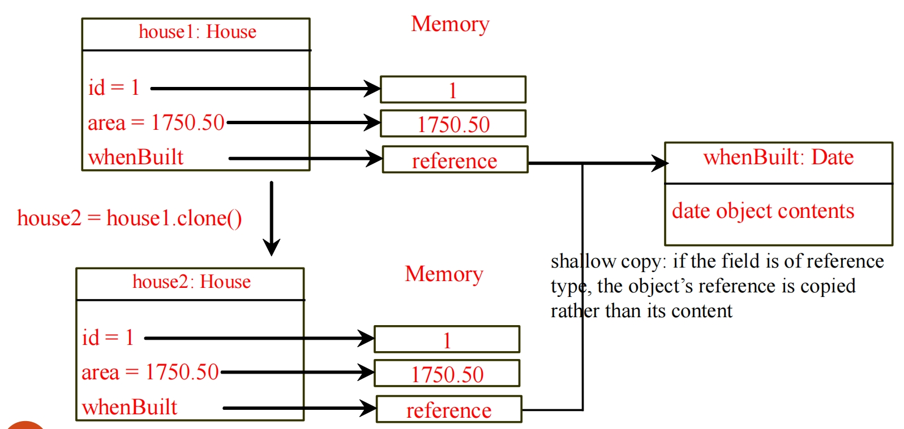

#### Deep Copy 深拷贝:

深拷贝是通过改写原本的 clone 方法来自定义实现的。

```java
public class House implements Cloneable {
    ...
    public Object clone() { // deep copy
        try {
            House h = (House)(super.clone());
            // 引用数据类型需要重新复制一份
            h.whenBuilt = (Date)(whenBuilt.clone());
            return h;
        }catch (CloneNotSupportedException ex) {
        	return null;
        }
    }
    ...
}

// output
Original: House{id=1, area=100.0, whenBuilt=Wed Oct 18 14:30:00 CST 2023}
Cloned: House{id=1, area=100.0, whenBuilt=Wed Oct 18 14:30:00 CST 2023}

After modifying cloned.whenBuilt:
Original: House{id=1, area=100.0, whenBuilt=Wed Oct 18 14:30:00 CST 2023}
Cloned: House{id=1, area=100.0, whenBuilt=Thu Jan 01 08:00:00 CST 1970}
```

- 创建**新的顶层对象** `cloned_a`。

- `cloned_a == a` 为 `false`。

- 其复制行为（浅拷贝或深拷贝）由类的设计者决定，目标是创建一个有意义的、独立的副本。

  - 对于 `Calendar`，它会确保新对象有自己独立的日期时间状态，即使这可能涉及到对其内部某些可变对象的复制（或者这些内部对象本身是不可变的）。

  - 如果一个类重写了 `clone()` 并且想要实现**深拷贝 (Deep Copy)**，它会在调用 `super.clone()` 得到浅拷贝副本后，进一步**对浅拷贝副本中的可变对象引用字段进行递归的克隆**。

### Conflicting interfaces 冲突接口

- Errors detected by the compiler:

  编译器检测到的错误：

  - If a class implements two interfaces with conflicting information, like:

    如果一个类实现了两个信息冲突的接口，例如

    - two same constants with different values, or

      **两个相同的常量具有不同的值**，或者

    - two methods with same signature but different return type

      **两个签名相同但返回类型不同的方法**

## Interfaces VS. Abstract Class 接口和抽象类

- In an interface, the data fields must be constants; an abstract class can have variable data fields

  在接口中，数据字段必须是常量;抽象类可以具有可变数据字段

- Interfaces don't have constructors; all abstract classes have constructors

  接口没有构造函数;所有抽象类都有构造函数

- Each method in an interface has only a signature without implementation (i.e., only abstract methods); an abstract class can have concrete methods

  接口中的每个方法只有一个签名，没有实现（即，只有抽象方法）;抽象类可以具有具体方法

|                | Variables                            | Constructors                                                 | Methods                            |
| -------------- | ------------------------------------ | ------------------------------------------------------------ | ---------------------------------- |
| Interfaces     | 所有的变量必须为 public static final | 没有构造器，无法使用 new 运算符实例化接口。                  | 所有的方法必须都是 public abstract |
| Abstract Class | 没有限制，可以向正常的一样           | 构造函数由子类通过构造函数链接调用。  抽象类不能使用 new 运算符实例化。 | 没有限制                           |

## Inheritance: Interfaces & Classes 继承中的接口与类

- An interface can extend any number of other interfaces

  接口可以扩展任意数量的其他接口

- There is no root for interfaces

  接口没有根的概念

- A class can implement any number of interfaces

  一个类可以实现任意数量的接口

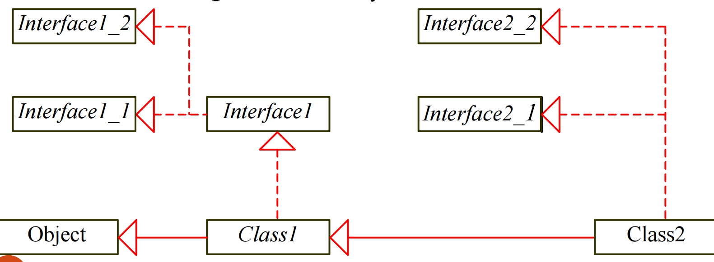

## Whether to use a class or an interface 是否要使用类或者接口

- **Strong is-a**: a relationship that clearly describes a parent child relationship (通常对应类继承)

  Strong is-a：明确描述父子关系的关系

  - For example: a student is a person

    例如：学生是一个人

  - Should be modeled using class inheritance

    应该使用类继承进行建模

- **Weak is-a** (or is-kind-of): indicates that an object possesses a certain property （通常对应接口实现）

  Weak is-a （或 is-kind-of）：表示对象具有某种属性

  - For example: all strings are comparable, all dates are comparable

    例如：所有字符串都是可比的，所有日期都是可比的

  - Should be modeled using interface

    应使用接口进行建模

- You can also use interfaces to circumvent single inheritance restriction if multiple inheritance is desired

  如果需要多个继承，您还可以**使用接口来规避单个继承限制**

## Wrapper Classes 包装类

- Primitive data types in Java ➔ **Better performance**

  Java 中的原始数据类型 ➔ 更好的性能

  - However, data structures (ArrayList) expect objects as elements

    但是，集合类例如数据结构 （ArrayList） 期望对象作为元素

- Each primitive type has a wrapper class: Boolean, Character, Short, Byte, Integer, Long, Float, Double

  每个基本数据类型都有一个包装类：Boolean、Character、Short、Byte、Integer、Long、Float、Double

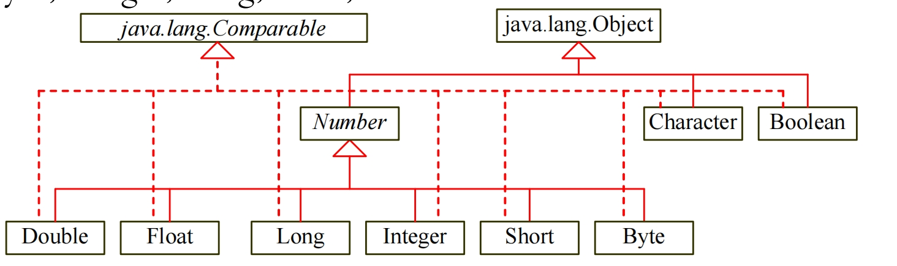

- The wrapper classes **do not have no-arg constructors**

  包装类**没有无参构造函数**

- The instances of all wrapper classes are **immutable**: their internal values cannot be changed once the objects are created

  所有包装类的实例都是**不可变的**：一旦创建了对象，就无法更改其内部值

- Each wrapper class **overrides** the **toString** and **equals** methods defined in the **Object** class

  每个包装类都 overrides 了 Object 类中定义的 toString 和 equals 方法

- Since these classes implement the **Comparable** interface, the **compareTo** method is also implemented in these classes

  由于这些类实现了 Comparable 接口，因此 compareTo 方法也在这些类中实现

## The Number class: 数字类

- Each numeric wrapper class extends the abstract Number class:

  每个数字包装器类都扩展了抽象的 Number 类：

  - The abstract **Number** class contains the methods **doubleValue**, **floatValue**, **intValue**, **longValue**, **shortValue**, and **byteValue** to “convert” objects into primitive type values

    抽象的 Number 类包含方法 doubleValue、floatValue、intValue、longValue、shortValue 和 byteValue，用于将对象“转换”为基础数据类型值

  - The methods **doubleValue**, **floatValue**, **intValue**, **longValue** are **abstract**

    方法 doubleValue、 floatValue、 intValue、 longValue 是 **抽象的**

    - The methods **byteValue** and **shortValue** are **not abstract**, which simply return **(byte)intValue()** and **(short)intValue()**, respectively

      方法 byteValue 和 shortValue **不是 abstract**，它们分别简单地返回 （byte）intValue（） 和 （short）intValue（）

    - Each numeric wrapper class implements the abstract methods **doubleValue**, **floatValue**, **intValue** and **longValue**

      每个数值包装类都实现了抽象方法 doubleValue、floatValue、intValue 和 longValue

案例，Integer and Double class：

这两个包装类都是继承了 Number 类， 同时也实现了 Comparable 接口中的 compareTo 方法

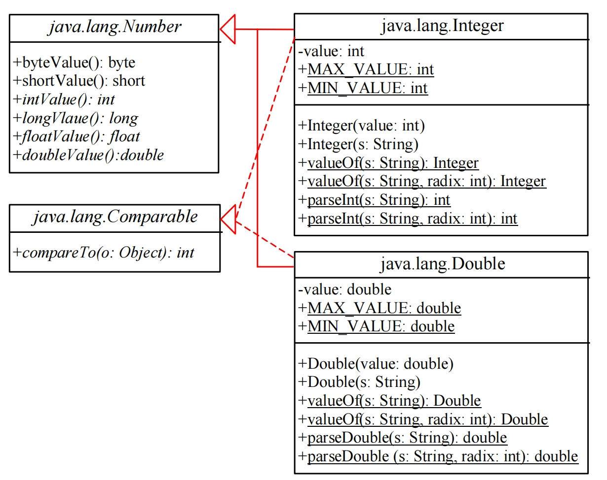

- You can construct a wrapper object either from a primitive data type value or from a string representing the numeric value

  您可以从原始数据类型值或表示数值的字符串构造包装器对象

- The constructors for **Integer** and **Double** are:

  Integer 和 Double 的构造函数是：

  - **public Integer(int value)**
  - **public Integer(String s)**
  - **public Double(double value)**
  - **public Double(String s)**

### Numeric Wrapper Class Constants  数字包装类常量

#### MAX_VALUE & MIN_VALUE

Each numerical wrapper class has the constants **MAX_VALUE** and **MIN_VALUE**:

每一个数字包装类都有**最大值**和**最小值**这两个极值常量，方便快速调用

- **MAX_VALUE** represents the maximum value of the corresponding primitive data type

  MAX_VALUE 表示相应原始数据类型的最大值

- For **Float** and **Double**, **MIN_VALUE** represents the minimum positive **float** and **double** values

  对于 Float 和 Double，MIN_VALUE 表示最小正 float 和 double 值

- The maximum integer: 2,147,483,647

  最大整数：2,147,483,647

- The minimum positive float: 1.4E-45

  最小单浮点数：1.4E-45

- The maximum double floating-point number: 1.79769313486231570e+308d

  最大双浮点数：1.79769313486231570e+308d

#### The static valueOf methods 静态的 valueOf 方法

- The numeric wrapper classes have a **static** method **valueOf(String s)** to create a new object initialized to the value represented by the specified string:

  数字包装器类有一个 static 方法 valueOf（String s） 来创建一个初始化为指定字符串表示的值的新对象：

  ```java
  Double doubleObject = Double.valueOf("12.4");
  
  Integer integerObject = Integer.valueOf("12");
  ```

- Each numeric wrapper class has overloaded parsing methods to parse a numeric string into an appropriate numeric value:

  每个数字包装器类都有重载的解析方法，用于将数字字符串解析为适当的数字值：

  ```java
  double d = Double.parseDouble("12.4");
  
  int i = Integer.parseInt("12");
  ```

#### 原始数据类型和包装类的数据转换

- Automatic Conversion Between Primitive Types and Wrapper Class Types:

  基元类型和包装类类型之间的自动转换：

  - Since JDK 1.5, Java allows primitive type and wrapper classes to be converted automatically:

    从 JDK 1.5 开始，Java 允许自动转换原始类型和包装类：

    - **boxing** of primitive types into wrapper types when objects are needed

      当需要对象时，将原始类型**装箱**到包装类型中

      ```java
      Integer[] intArray = {2, 4, 3};
      
      // 等价于
      Integer[] intArray = {new Integer(2), new Integer(4), new Integer(3)};  // 装包
      ```

    - **unboxing** of wrapper types into primitive types when primitive types are needed

      当需要原始类型时，将包装器类型**拆箱**为原始类型
      
      ```java
      int n = intArray[0] + intArray[1] + intArray[2]; // 解包
      ```

## Array and Objects 数组与对象

- Arrays are objects:

  数组是对象：

  - An array is an instance of the **Object** class

    数组是 **Object 类**的实例

    **new int[10] instanceof Object** 	**true**

- If **A** is a subclass of **B**, every instance of **A[]** is an instance of **B[]**

  **如果 A 是 B 的子类，则 A[] 的每个实例都是 B[] 的实例**

  **new GregorianCalendar[10] instanceof Calendar[]** 	**true**

  **new Calendar[10] instanceof Object[]** 	**true**

  **new Calendar[10] instanceof Object** 	**true**

- Although an **int** value can be assigned to a **double** type variable, **int[]** and **double[]** are two incompatible types because they are not classes:

  **尽管可以将 int 值分配给 double 类型变量，但 int[] 和 double[] 是两种不兼容的类型**，因为它们不是类：

  - We cannot assign an **int[]** array to a variable of **double[]** array: compiler error: **double[] a = new int[10];**

    我们不能将 int[] 数组分配给 double[] 数组的变量：**编译器错误：double[] a = new int[10];**

### Sorting an Array of Objects 数组排序

- Java provides a **static sort** method for sorting an array of **Object** in the **java.util.Arrays** class that uses the **Comparable** interface: util包下的Arrays工具类

  Java 提供了一种 **静态排序** 方法，用于在使用 Comparable 接口的 java.util.Arrays 类中对 Object 数组进行排序：**java.util.Arrays.sort(intArray);**

The objects are instances of the Comparable interface and they are compared using the compareTo method.

**这些 Object 是 Comparable 接口的实例，并使用 compareTo 方法对它们进行比较。**

- `Arrays.sort(int[] array)`: 直接处理基本类型 `int` 数组。

- `Arrays.sort(Integer[] array)`: 将 `Integer[]` 视为 `Object[]` 处理，并利用 `Integer` 类实现的 `Comparable` 接口进行排序。

```java
public class GenericSort {
    public static void main(String[] args) {
        Integer[] intArray={new Integer(2),new Integer(4),new Integer(3)};
        sort(intArray); // or Arrays.sort(intArray);
        printList(intArray); 
    }
    // 因为这个方法允许接收的是 Object[] 所以把 Integer 换成其他的包装类该方法仍然可以正常运行
    public static void sort(Object[] list) {
        Object currentMax;
        int currentMaxIndex;
        for (int i = list.length - 1; i >= 1; i--) {
            currentMax = list[i]; 
            currentMaxIndex = i; // Find the maximum in the list[0..i]
            for (int j = i - 1; j >= 0; j--) {
                if (((Comparable)currentMax).compareTo(list[j]) < 0) {
                currentMax = list[j];
                currentMaxIndex = j;
            	}
        	}
            list[currentMaxIndex] = list[i];
            list[i] = currentMax;
    	}
	}
    public static void printList(Object[] list) {
        for (int i=0;i<list.length;i++) 
            System.out.print(list[i]+" ");
    }
}
```

## BigInteger and BigDecimal

- **BigInteger** and **BigDecimal** classes in the **java.math** package:

  java.math 包中的 BigInteger 和 BigDecimal 类：

  - For computing with very large integers or high precision floating-point values

    用于使用非常大的整数或高精度浮点值进行计算

    - **BigInteger** can represent an integer of any size

      BigInteger 可以表示任何大小的整数

    - **BigDecimal** has no limit for the precision (as long as it’s finite=terminates)

      BigDecimal 对精度没有限制（只要它是 finite=terminates）

  - Both are **immutable**

    两者都是 **不可变的**

  - Both extend the **Number** class and implement the **Comparable** interface.

    两者都扩展了 Number 类并实现了 Comparable 接口。

**对于 `BigInteger`**：它会把非常长的整数看作是一个“大”进制的数（例如，把每9个十进制位看作一个 `int` 存储在数组的一个元素中，或者直接存储二进制表示的各个部分）。符号（正负）会单独存储。

**对于 `BigDecimal`**：它更复杂一点，除了一个表示所有数字的“大整数”（通常是 `BigInteger` 或 `long`，称为 unscaled value）外，它还需要一个额外的整数来记录**小数点的位置（称为 scale）**。例如，`123.45` 可以被存储为 unscaled value `12345` 和 scale `2`。

```java
BigInteger a = new BigInteger("9223372036854775807");
BigInteger b = new BigInteger("2");
BigInteger c = a.multiply(b); // 9223372036854775807 * 2
System.out.println(c); 
// 结果：18446744073709551614

BigDecimal a = new BigDecimal(1.0);
BigDecimal b = new BigDecimal(3);
BigDecimal c = a.divide(b, 20, BigDecimal.ROUND_UP);
System.out.println(c);
// 结果：0.33333333333333333334

import java.math.*;
public class LargeFactorial {
    public static void main(String[] args) {
        System.out.println("50! is \n" + factorial(50));
    }
    public static BigInteger factorial(long n) {
        BigInteger result = BigInteger.ONE;
        for (int i = 1; i <= n; i++)
        	result = result.multiply(new BigInteger(i+""));
        return result;
    }
}
// 结果：30414093201713378043612608166064768844377641568960512000000000000
```

## Rational Class 有理数类

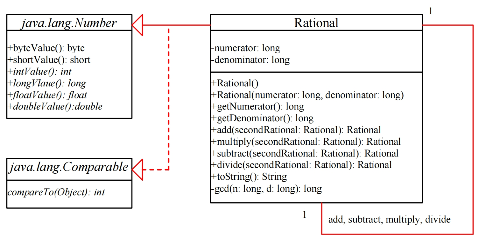

```java
public class Rational extends Number implements Comparable {
    // 分子，默认为0
    private long numerator = 0;
    // 分母，默认为1
    private long denominator = 1;
    
    // 无参构造器
    public Rational() { this(0, 1); }
    
    // 全参构造器
    public Rational(long numerator, long denominator) {
        long gcd = gcd(numerator, denominator);
        this.numerator = ((denominator > 0) ? 1 : -1) * numerator / gcd;
        this.denominator = Math.abs(denominator) / gcd;
    }
    // 最大公约数计算
    private static long gcd(long n, long d) {
        long n1 = Math.abs(n); 
        long n2 = Math.abs(d);
        int gcd = 1;
        for (int k = 1; k <= n1 && k <= n2; k++) {
            if (n1 % k == 0 && n2 % k == 0)
            	gcd = k;
        }
    	return gcd;
    }
    
    // 加法操作 (a/b) + (c/d) = (ad+bc)/bd
    public Rational add(Rational secondRational) {
        long n = numerator * secondRational.getDenominator() +
        denominator * secondRational.getNumerator();
        long d = denominator * secondRational.getDenominator();
        return new Rational(n, d);
    }
    
    // 减法操作
    public Rational subtract(Rational secondRational) {
    	… // or implement inverse and use add method
        // (a/b) - (c/d) = (ad-bc)/bd
        // -(a/b) = (-a) / b
        // 计算新分数的分子和分母
    	long n = numerator * secondRational.getDenominator() -
             denominator * secondRational.getNumerator();
    	long d = denominator * secondRational.getDenominator();
    	// 返回一个新的 Rational 对象
    	return new Rational(n, d);
    }
    
    // multiply, divide
    /** Override the abstract intValue method in java.lang.Number */
    // 这里重写了 Number 类中的 intValue 方法，也就是将小数强转成整数
    public int intValue() { 
        return (int)doubleValue(); 
    }
    
    // 返回一个双精度小数
    public double doubleValue() {
    	return ((double)numerator)/denominator; 
    }
    
    // ... Override all the abstract *Value methods in java.lang.Number
    /** Override the compareTo method in java.lang.Comparable */
    // 重写 Comparable 接口的注册 comparaTo 方法
    public int compareTo(Object o) {
        if ((this.subtract((Rational)o)).getNumerator() > 0) return 1;
        else if ((this.subtract((Rational)o)).getNumerator()<0) return -1;
        else return 0;
    }
    
    // 主程序
    public static void main(String[] args) {
        Rational r1 = new Rational(4, 2);
        Rational r2 = new Rational(2, 3);
        System.out.println(r1 + " + " + r2 + " = " + r1.add(r2)); 
    }
}
```

## Question

1. What will happen when executing this program

   ```java
   abstract class x {
       abstract void methodX {}
   }
   
   class y extends x {
       
   }
   
   class z extends y {
       void methodX() {}
   }
   ```

   - **compile error because Y is not abstract** (非抽象类继承抽象类之后，必须要将继承的所有的抽象方法都实现)
   - compile error because Z is not abstract
   - runtime error because an abstract class is instantiated
   - object obj is created

   ```java
   // 正确答案1
   abstract class x {
       abstract void methodX {}
   }
   
   class y extends x {
       void methodX() {}
   }
   
   class z extends y {
       
   }
   
   // 正确答案2
   abstract class x {
       abstract void methodX {}
   }
   
   abstract class y extends x {
       
   }
   
   class z extends y {
       void methodX() {}
   }
   ```

2. What is **wrong** with the class Banana

   ```java
   public class Banana extends Edible {
       String howToEat() {
           return 'Peel and eat';
       }
   }
   ```

   - implements instead of extends (Edible 是一个接口)
   - howToEat() must be public （实现接口中的方法的时候不能使用比原本方法更严格，或者说范围更小的访问修饰符；例如接口里方法是public，那么实现该接口方法的时候不能使用范围低于public的访问修饰符，此时实际上也只剩下了public可以选择）
   - howToEat() must return a String (实现接口方法，必须要保证返回的类型相同，方法名相同，方法接收的参数也必须相同)
   - **all the above**

   Answer: **All the above**

3. What is an equivalent implementation of compareTo() for Student

   ```java
   public class Student implements Comparable {
       int id;
       
       public int compareTo (Object 0) {
           if (this.id > ((Student) o).id) {
               return 1;
           }
           if (this.id == ((Stuident)o).id) {
               return 0;
           }
           return -1;
       }
   }
   ```

   - return this.id + ((Student)o).id;
   - **return this.id - ((Student)o).id;**
   - return this.id * ((Student)o).id;
   - return this.id / ((Student)o).id;

   Answer: B, use subtraction. 效果和 compareTo 中直接使用大于小于对比的方法逻辑相同。

4. Automatic Unboxing, what happens to the following program when it is executed?

   ```java
   public class AutomaticUnboxing {
       public static void main (String[] args) {
           Integer num = null;
           int x = num;  // 这里会报错
           System.out.println(x);
       }
   }
   ```

   - compile error at line 3
   - runtime error at line 3
   - **compile error at line 4** （因为Integer为null，所以装箱的时候会报 compiler error: NullPointerException）
   - runtime error at line 4

   ## Tutorial
   
   ### Exercise 3.4
   
   1. Consider the following code snippet. Will it compile successfully? If not, what is the reason?
   
      ```java
      public interface Animal {
          String name;
          void makeSound();
      }
      ```
   
      No, the code will not successfully compile. In Java, interfaces cannot have instance variables (non-static fields). Therefre, the line `String name` is invalid, we need to give a initial value, such as `String name = "小明";`
   
   2. Consider the following code snippet. Will it compile successfully? If not, what is the reason?
   
      ```java
      public interface MyInterface2 {
          // Abstract method without implementation
          void method1();
          // Abstract method without implementation
          void method2();
          
         	void method3() {
              // concrete method with implementation
              System.out.println("Method 3 implementation");
              
          }
      }
      ```
   
      No, if you want to implement the method, you need to add `default`
   
   3. What is the issue in the following code snippet. How it should be solved?
   
      ```java
      public abstract class MyClass {
          public MyClass() {
              System.out.println("Abstract class constructor");
          }
          public static void main(String[] args) {
              MyClass obj = new MyClass();
          }
      }
      ```
   
      抽象类不能直接通过自身的构造器创建实例，抽象类的实例都是用来给子类调用的。
