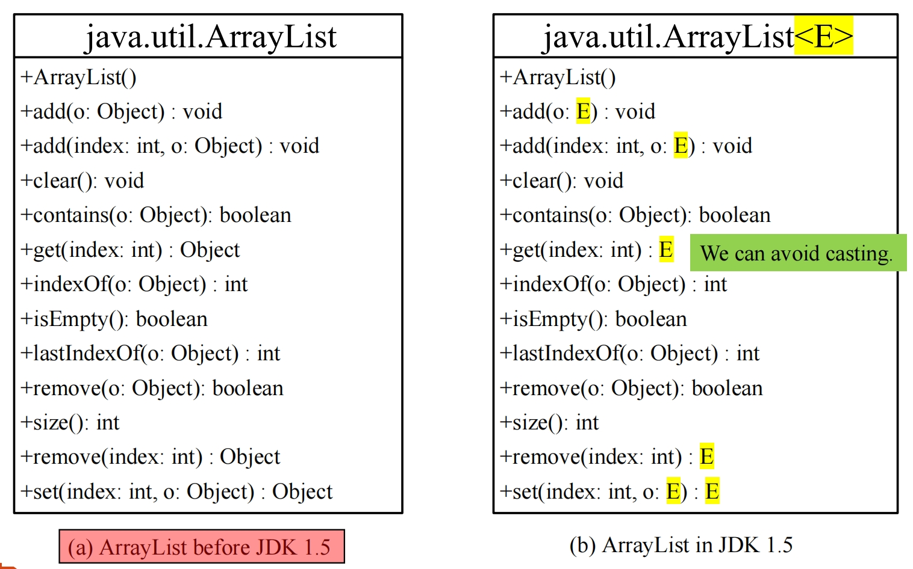
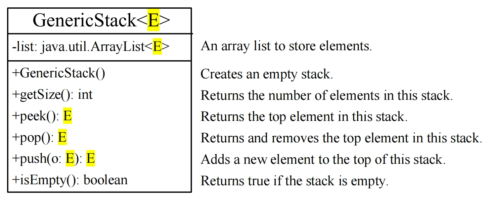
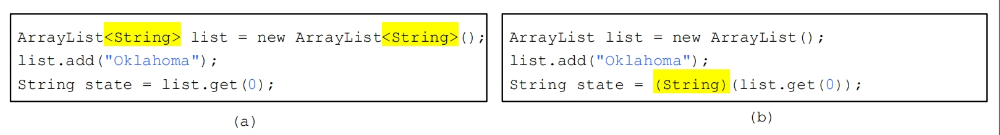
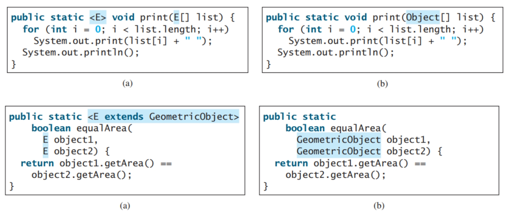

# 4 Generics 泛型

- **静态检查（Static Checking）**：
  - 在程序运行之前，通过分析源代码本身来检测潜在的错误和问题。
  - 不需要执行程序，通常在编译阶段进行。
- **动态检查（Dynamic Checking）**：
  - 在程序运行时，通过监控程序的执行过程来检测错误和异常。
  - 需要实际执行代码，通常在运行时环境中进行。

## 包装类

在下面的案例当中，没有编译错误，但是会有运行时异常，因为字符"1"不是整型

```java
public class ShowUncheckedWarning {
    public static void main(String[] args) {
        java.util.ArrayList list = new java.util.ArrayList();
        list.add("1");
        // No Compiler Errors
        // Runtime error because "1" is a String
        Integer i = (Integer)(list.get(0));
    }
}
```

如果想要在编写代码的时候就能直接展示编译异常，那么就需要可以引入泛型的概念，提前告诉程序当前集合类中要存储的数据类型

```java
public class ShowCompilerError {
    public static void main(String[] args) {
        java.util.ArrayList<Integer> list = new java.util.ArrayList<Integer>();
        // Compiler error on this line
        list.add("1");
        // 如果不想让上面报错，可以修改为下面的写法
        list.add(new Integer(1));
    }
}
```

## What is Generics？什么是泛型

- **Generics** is the capability to **parameterize types**

  **泛型是能让参数化类型的能力**

  - With this capability, you can define a class or a method with generic types that can be substituted using concrete types by the compiler

    有了这个功能,你可以用泛型类型定义一个类或方法,编译器可以用具体类型来替换。

  - You may define a generic stack class that stores the elements of a generic type

    例如你可以定义一个 stack 类用来存储一个专门的数据类型

    - From this generic class, you may create:

      使用泛型，你可以生成

      - a stack object for holding Strings

        一个只装有 String 的 Stack 类

      - a stack object for holding numbers 

        一个只装有数字的 Stack 类

      - Strings and numbers are concrete types that replace the generic type

        在这里 String 或者数字都是用来代表当前的传入的泛型类型

## Why Generics? 为什么需要泛型

- The key benefit of generics is to enable errors to be detected at compile time rather than at runtime

  **泛型的关键好处是能够在编译时而不是运行时检测到错误**

  - A generic class or method permits you to specify allowable types of objects that the class or method may work with

    泛型类或方法允许您指定类或方法可以使用的允许对象类型

    - We still do **code reuse**, e.g., write a single implementation for a special kind of data structure, like a single implementation of a generic stack and its standard methods

      我们仍然会**代码重用**,例如,为一种特殊的数据结构编写一个单一的实现,比如一个通用堆栈及其标准方法的单一实现，通过使用泛型那么则可以允许在不同情景下用于存储不同的数据类型。（但是要注意，一个集合类型内只能存储一种数据类型，不同的对象之间可以根据泛型传入不同的类型）

  - Most important advantage: If you attempt to use the class or method with an incompatible object, a **compile error** occurs. (compilor)

    最重要的优点：如果您尝试将类或方法与不兼容的对象一起使用，则会发生 **编译错误**。起到类型检查的作用

## Generic Type 泛型类型

原始写法，不支持泛型只能使用Object类来涵盖所有的类

```java
// Java 1.5 之前
package java.lang;
public interface Comparable {
	public int compareTo(Object o)
}

// Runtime error
Comparable c = new Date();
System.out.println(c.compareTo("red"));
```

使用泛型，**<T>** represents a formal generic type, which can be replaced later with an actual concrete type. This is called **Generic Instantiation** (表示正式的泛型类型，稍后可以替换为实际的具体类型。这称为 **泛型实例化**)

```java
package java.lang;
public interface Comparable<T> {
	public int compareTo(T o)
}

// Compiler error
Comparable<Date> c = new Date();
System.out.println(c.compareTo("red"));
```



JDK 引入泛型之后的集合类

### Advantages: Compiler Errors instead of Runtime Errors 编译时异常比运行时异常的优势

1. 可以直接在代码编写阶段就被IDE提醒类型错误，而不需要等到运行代码的时候才知晓

```java
ArrayList<Integer> list = new ArrayList<>();

// You can now add only Integers into the list
list.add(new Integer(1));

// If you attempt to add a non-Integer, then a 
// compiler error will occur.
list.add("1"); // Compiler Error
```

2. 如果直接使用Object，那么实际上相比于使用泛型需要多一步类型强转（casting）

```java
// Casting is not needed:
ArrayList<Integer> list = new ArrayList<>();

list.add(new Integer(1));

// Prior to JDK 1.5, without using generics, you 
// would have had to cast the return value to
// Integer as:
Integer i = (Integer)(list.get(0));

// Since JDK 1.5
Integer i = list.get(0);
```

### 装包与解包

**不允许使用原始数据类型，需要使用其对应的包装类**

- However, generic types **must be** reference types! 

  但是,泛型类型**必须是**引用类型!

  - You cannot replace a generic type with a primitive type such as int, double, or char

    不能用诸如 int、double 或 char 之类的原始类型替换通用类型

    - The following statement is wrong (i.e., a compiler error):

      下面的这个代码就是**错误的示例**

```java
ArrayList<int> intList = new ArrayList<>();
// But you can use the wrapper types:
ArrayList<Integer> intList = new ArrayList<>();
// You can still add an int value to intList by Boxing:
// Java automatically wraps 1 into: new Integer(1)
intList.add(1);
```

基本数据类型和包装类之间可以直接自动转换:

自动装箱：

```java
ArrayList<Double> list = new ArrayList<Double>();
list.add(5.5); // 5.5 is automatically boxed/ 
// converted to new Double(5.5)
list.add(3.0); // 3.0 is automatically boxed/ 
// converted to new Double(3.0)
Double doubleObject = list.get(0); 
// No casting is needed
```

自动拆箱：

```java
// Unboxing: Automatic conversion to double
double d = list.get(1); 
```

## Using Generic Class 使用泛型

定义一个泛型集合类 **GenericStack.java**



```java
public class GenericStack<E> {
    private java.util.ArrayList<E> list = new java.util.ArrayList<E>();
    public int getSize() {
    	return list.size();
    }
    public E peek() {
    	return list.get(getSize() - 1);
    }
    public void push(E o) {
    	list.add(o);
    }
    public E pop() {
    	E o = list.remove(getSize() - 1);
    	return o;
    	// OR just: return list.remove(getSize() - 1);
    }
    public boolean isEmpty() {
    	return list.isEmpty();
    }
    @Override // Java annotation: also used at compile time to detect override errors
    // Java 的注解，用来在编译的时候检查重写错误
    public String toString() {
    	return "stack: " + list.toString();
    }
}
```

使用这个泛型集合类

```java
public static void main(String[] args){
    // Integer
    GenericStack<Integer> s1;
    s1 = new GenericStack<>();
    s1.push(1);
    s1.push(2);
    System.out.println(s1);
    
    // Double
    GenericStack<String> s2 = new GenericStack<>();
    s2.push("Hello");
    s2.push("World");
    System.out.println(s2);
}

// Output:
stack: [1, 2]
stack: [Hello, World]
```

### Generic Static Method 静态泛型方法修饰符位置

To declare a generic method, **you place the generic type immediately after the keyword static** in the method header:

如果是要定义一个泛型静态方法，那么需要将**泛型的修饰符添加在 `static` 关键字之后**：(非static方法就不需要)

```java
public class GenericMethods1 {
    public static <E> void print(E[] list) {
        for (int i = 0; i < list.length; i++) 
            System.out.print(list[i] + " ");
            System.out.println();
    }
    public static void main(String[] args) {
        String[] s3 = {"Hello", "again"};
        GenericMethods1.<String>print(s3); 
        // OR simply:
        print(s3);
    }
}
```

### Bounded Generic Types 有界泛型类型

- **A generic type can be specified as a subtype of another type:**

  **一个泛型类型可以被指定为另一种类型的子类型：**

  - consider Circle and Rectangle extend GeometricObject

    例如，Circle 类和 Rectangle 类可以同时集成 GeometricObject 类

```java
public class GenericMethods2 {
    public static <E extends GeometricObject> boolean
        equalArea(E object1, E object2) {
        return object1.getArea() == object2.getArea();
    }
    public static void main(String[] args ) {
        // 在这个案例当中，虽然集合类中定义的泛型是 GeometricObject 类型，但是其子类仍然可以直接被存入该集合类中
        Rectangle rectangle = new Rectangle(2, 2);
        Circle circle = new Circle(2);
        System.out.println("Same area? " + equalArea(rectangle, circle));
    } // Note: see https://www3.cs.stonybrook.edu/~pfodor/courses/cse160.html
} // for GenericObject, Circle and Rectangle
```

## Sorting an Array of Objects 排序对象数组

We can develop a generic method for sorting an array of **Comparable** objects:

我们可以开发一种通用方法来对 **Comparable** 对象数组进行排序：

用来实现对通用的泛型列表进行排序的方法

```java
public class GenericSelectionSort {
    public static <E extends Comparable<E>> void genericSelectionSort(E[] list) {
        E currentMin;
        int currentMinIndex;
        for (int i = 0; i < list.length - 1; i++) {
            // Find the minimum in the list[i...list.length-1]
            // 找到列表中最小的数组，以及其对应的索引下标
            currentMin = list[i];
            currentMinIndex = i;
            for (int j = i + 1; j < list.length; j++) {
                if (currentMin.compareTo(list[j]) > 0) {
                    currentMin = list[j];
                    currentMinIndex = j;
                }
    		}
            // Swap list[i] with list[currentMinIndex] 
            // if necessary;
            if (currentMinIndex != i) {
            list[currentMinIndex] = list[i];
            list[i] = currentMin;
    		}
    	}
	}
    
    public static void main(String[] args) {
        // Create an Integer array
        // 创建一个整形数组
        Integer[] intArray = { new Integer(2), new Integer(4), new Integer(3) };
        // Sort the array，调用静态的 sort 方法
        GenericSelectionSort.<Integer>genericSelectionSort(intArray);
        // Display the sorted array
        System.out.print("Sorted Integer objects: ");
        printList(intArray); // Sorted Integer objects: 2 3 4
        Double[] doubleArray = { new Double(3.4), new Double(1.3) };
        GenericSelectionSort.<Double>genericSelectionSort(doubleArray);
        // same for Character, String, etc.
    }
    
    /** Print an array of objects */
    public static void printList(Object[] list) {
        for (int i = 0; i < list.length; i++)
            System.out.print(list[i] + " ");
            System.out.println();
    }
}
```

在上面的方法中，`public static <E extends Comparable<E>> void genericSelectionSort(E[] list)` 能够传达两个信息：

- 首先，这个指明 E 必须是 Comparable 的子类型 （E must be a subtype of Comparable，例如基本数据类型的装箱之后的引用类型，如 Integer，Double，Character，String 等都实现了 Comparable 接口，除了 Void，所以这些类型都可以使用 comparaTo 方法）
- 其次，它指定要比较的元素也属于 E 型

上面的 genericSelectionSort 方法中就是用 comparaTo 方法实现的值的大小的对比

## Raw Type and Backward Compatibility 原始类型和向下兼容性

- A generic class or interface used without specifying a concrete type, called a raw type, enables **backward compatibility** with earlier versions of Java

  一个泛型类或者泛型接口在不专门指定一个数据类型的时候，被称为 raw type，可以向下兼容 JDK 1.5 之前的 Java 代码

  - In JDK1.5 and higher, the **Raw type:** 在 1.5 及 之后的原始类型中：

    > ArrayList list = new ArrayList() 相当于 ArrayList<Object> list = new ArrayList<Object>();

  - 因此，所有写在 1.5 版本之前的代码仍然可以执行

注意：向下兼容的含义其实就是老的技术放在新的规定中仍然能够运行

### Raw type is unsafe 原始类型不安全

```java
public class Unsafe {
    // Return the maximum between two objects
    // 返回两个对象之间最大的那个
    public static Comparable max1(Comparable o1, Comparable o2) {
        if (o1.compareTo(o2) > 0)
       		return o1;
        else
        	return o2;
    }
    public static void main(String[] args) {
        System.out.println(max1("Welcome", 23));
    }
}
```

**Comparable o1** and **Comparable o2** are raw type declarations

因为没有限定类型，所以可以接收任何类型的数据，但是两个类型不同的数据在一起就没办法使用 comparaTo 方法。上面的代码不汇报编译错误，但是会有**运行时异常**

### How can we make it safe? 我们怎么让其变得安全

```java
public class Safe {
    // Return the maximum between two objects
    // 返回两个对象之间的最大值
    public static <E extends Comparable<E>> E max2(E o1, E o2) {
        if (o1.compareTo(o2) > 0)
        	return o1;
        else
        	return o2;
    }
    public static void main(String[] args) {
    	System.out.println(max2("Welcome", 23));
    }
}
```

上面的方法就限定了传入的 max2 方法的两个值必须都要是相同的类型，所以这个时候在传入两个不同类型的值的以后就会直接报**编译异常**。

## Wildcards 通配符

- **一个待解决的问题**

  - **Integer** is a subclass of **Number**, but **GenericStack<Integer>** is not a subclass of **GenericStack<Number>**
    
    - 因此可以使用 unbounded wildcards, bounded wildcards, or lower-bound wildcards 来定义可以接受的泛型的范围
      - ？				  unbounded wildcard: any class （可以是任何类型）
      - **? extends T** 		bounded wildcard: any **subclass** of T (including T) （必须是T或者T的子类）
      - **? super T**		     lower bound wildcard: any **superclass** of T (including T) （必须是T或者T的父类）
    
  - **<? extends Number>** is a wildcard type that represents **Number** or a subtype of **Number**
  
    **<? extends Number>** 就代表 Number 或者 Number 的子类
  
  - **GenericStack<Integer>** is a subclass of **GenericStack<? extends Number>**

Examples 1:

```java
public class WildCardDemo1 {
    /** // It expects GenericStack<Number>
    * Find the maximum in a stack of numbers
    */
    // 这里的 GenericStack<Number> 不能直接被传入 GenericStack<Integer>
    public static double max(GenericStack<Number> stack) {
        double max = stack.pop().doubleValue(); // initialize max
        while (!stack.isEmpty()) {
            double value = stack.pop().doubleValue();
            if (value > max) 
            max = value;
    	}
    	return max;
    }
    public static void main(String[] args) {
        GenericStack<Integer> intStack = new GenericStack<Integer>();
        intStack.push(1); // 1 is autoboxed into new Integer(1)
        intStack.push(2);
        intStack.push(-2);
        System.out.print("The max number is " + max(intStack));
        // Compile Error: max cannot be applied to GenericStack<Integer>
        // 编译错误：不能直接将 GenericStack<Integer> 应用到 GenericStack<Number>
    }
}
// Integer is a subclass of Number, but GenericStack<Integer> is not a subclass of GenericStack<Number>
```

Example 2:

```java
public class WildCardDemo1B {
    /**
    * Find the maximum in a stack of numbers
    */
    // 这种写法才是正确的
    public static double max(GenericStack<? extends Number> stack) {
        double max = stack.pop().doubleValue(); // initialize max
        while (!stack.isEmpty()) {
            double value = stack.pop().doubleValue();
            if (value > max) 
            max = value;
        }
        return max;
    }
    public static void main(String[] args) {
        GenericStack<Integer> intStack = new GenericStack<Integer>();
        intStack.push(1); // 1 is autoboxed into new Integer(1)
        intStack.push(2);
        intStack.push(-2);
        System.out.print("The max number is " + max(intStack));
    }
}

// Output: 
The max number is 2.0
```

Example 3:

```java
public class WildCardDemo2 {
    /**
    * Print objects and empties the stack
    */
    // 或者直接使用通配符 ?
    public static void print(GenericStack<?> stack) { 
        while (!stack.isEmpty()) 
        	System.out.print(stack.pop() + " ");
    }
    public static void main(String[] args) {
        GenericStack<Integer> intStack = new GenericStack<Integer>();
        intStack.push(1); // 1 is autoboxed into new Integer(1)
        intStack.push(2);
        intStack.push(-2);
        print(intStack);
    }
}

// Output (Stack 是先进后出)
-2 2 1
```

Example 4:

```java
public class WildCardDemo3 {
    // Add stack1 TO stack2: the type of elements in stack2 must be a SUPERTYPE of the type of elements in stack1
    // stack 1中的类型必须是stack 2的类型或者stack 2中类型的子类
    public static <T> void add(GenericStack<? extends T> stack1, GenericStack<T> stack2){
        while (!stack1.isEmpty()) {
            stack2.push(stack1.pop());
        }
    }
    public static void print(GenericStack<?> stack) { 
        while (!stack.isEmpty()) {
        	System.out.print(stack.pop() + " ");
        }
    }
    public static void main(String[] args) {
        GenericStack<String> stack1 = new GenericStack<String>();
        GenericStack<Object> stack2 = new GenericStack<Object>();
        stack2.push("Java");
        stack2.push(2);
        stack1.push("Sun");
        add(stack1, stack2);
        print(stack2);
    }
}

// output
Sun 2 Java
```

Example 5:

```java
public class WildCardDemo4 {
    // Add stack1 TO stack2: the type ofelements in stack2 must be a SUPERTYPE of the type of elements in stack1
    // stack 1 中的类型必须是 stack 2中的类型或者是其父类
        public static <T> void add(GenericStack<T> stack1, GenericStack<? super T> stack2) {
        while (!stack1.isEmpty()) {
        	stack2.push(stack1.pop());
        }
    }
    
    public static void print(GenericStack<?> stack) { 
        while (!stack.isEmpty()) {
        	System.out.print(stack.pop() + " ");
        }
    }
    
    public static void main(String[] args) {
        GenericStack<String> stack1 = new GenericStack<String>();
        GenericStack<Object> stack2 = new GenericStack<Object>();
        stack2.push("Java");
        stack2.push(2);
        stack1.push("Sun");
        add(stack1, stack2);
        print(stack2);
    }
}

// output
Sun 2 Java
```

## Erasure and Restrictions on Generics  泛型的擦除和限制

泛型在 Java 的实现中会用到一个叫做 **类型擦除（type erasure）** 的机制：

- The compiler uses the generic type information to compile the code, but erases it afterwards

  编译器使用泛型类型信息来编译代码，但之后会将其擦除

  - This approach enables the generic code to be backward-compatible with the legacy code that uses raw types

    此方法使泛型代码能够向后兼容使用原始类型的旧代码

- So **the generic information is not available at run time**

  这样在运行的时候，泛型信息就不需要被使用了

- Once the compiler confirms that a generic type is used safely, it converts the generic type back to a raw type **Object**

  通过在编译器编译阶段对传入的泛型类型进行检查，如果通过了检查，那么就会直接**将泛型类型转化为Object**

  - For example, the compiler checks whether the following code in (a) uses generics correctly and then translates it into the equivalent code in (b) for runtime use. The code in (b) uses the raw type **Object**

    例如，编译器检查 （a） 中的以下代码是否正确使用泛型，然后将其转换为 （b） 中的等效代码以供运行时使用。（b） 中的代码使用原始类型 Object

    （a）中代表编译时的操作，（b）中代表运行时的操作
  
  - 

More examples:



The generic class is shared by all its instances regardless of its actual generic type

泛型类由其所有实例共享，而不管其实际泛型类型如何实现

>**GenericStack<String> stack1 = new GenericStack<String>();**
>
>**GenericStack<Integer> stack2 = new GenericStack<Integer>();**

- Although **GenericStack<String>** and **GenericStack<Integer>** are two types, but there is only one class **GenericStack** loaded into the JVM 

  虽然 GenericStack<String> 和 GenericStack<Integer> 是两种类型，但只有一个类 GenericStack 加载到 JVM 中

- These are **true**:

  - **System.out.println(stack1 instanceof GenericStack);** 

    **System.out.println(stack2 instanceof GenericStack);**

- These are **compile errors**: 因为传入的数据类型在编译时检查完之后就会被修改为Object了，所以**在运行时是看不到具体的类型信息的**。

  - **System.out.println(stack1 instanceof GenericStack<String>);**

    **System.out.println(stack2 instanceof GenericStack<Integer>);**

since **GenericStack<String>** and **GenericStack<Integer>** are not stored as separate classes in the JVM, using them at runtime makes no sense

由于 GenericStack<String> 和 GenericStack<Integer> 没有作为单独的类存储在 JVM 中，因此在运行时使用它们没有意义

### Restrictions on Generics 泛型的限制

- Because generic types are erased at runtime, there are certain restrictions on how generic types can be used:

  由于泛型类型在运行时被擦除，因此对泛型类型的使用方式存在某些限制：

  - **Restriction 1:** Cannot Create an Instance of a Generic Type (i.e., **new E()**). For example, the following statement is wrong: **E object = new E();**

    **限制 1**：不能创建泛型类型的实例（即 new E（））。例如，以下语句是错误的：E object = new E（）;

    - The reason is that **new E()** is executed at runtime, but the generic type **E** is not available at runtime

      原因是 new E（） 在运行时执行，但泛型类型 E 在运行时不可用

  - **Restriction 2:** Generic Array Creation is Not Allowed (i.e., **new E[100]**). For example, the following statement is wrong: **E[] elements = new E[capacity];**

    **限制 2**： 不允许创建泛型数组（即 new E[100]）。例如，以下语句是错误的： E[] elements = new E[capacity];

  - **Restriction 3:** Since all instances of a generic class have the same runtime class, the static variables and methods of a generic class are shared by all its instances. 

    **限制 3**：由于泛型类的所有实例都具有相同的运行时类，因此泛型类的静态变量和方法由其所有实例共享。

    - Therefore, it is illegal to refer to a generic type parameter for a class in a static method, field, or initializer

      因此，在静态方法、字段或初始值设定项中引用类的泛型类型参数是非法的

    ```java
    public class DataStructure<E> {
        public static void m(E o1) { 
            // Illegal
        }
        public static E o1; // Illegal
        static {
        	E o2; // Illegal
        }
    }
    ```

  - **Restriction 4:** Exception Classes Cannot be Generic

    **限制 4**：例外类不能是泛型

    - A generic class may not extend **java.lang.Throwable**, so the following class declaration would be illegal: **public class MyException<T> extends Exception { … }**

      泛型类不能扩展 java.lang.Throwable，因此以下类声明是非法的： public class MyException<T> extends Exception { ... }

    - If it were allowed, you would have a catch clause for **MyException<T>** as follows:

      如果允许，您将有一个 MyException<T> 的 catch 子句，如下所示：
    
      ```java
      try {
      	...
      } catch (MyException<T> ex) {
      	...
      }
      ```

    - The JVM has to check the exception thrown from the try clause to see if it matches the type specified in a catch clause. 

      JVM 必须检查从 try 子句引发的异常，以查看它是否与 catch 子句中指定的类型匹配。

    - **This is impossible, because the type information is not present at runtime.**
    
      这是不可能的，因为类型信息在运行时不存在。

### 补充

1. `public static <E> void method(E[] list)`

- **区别：** 这个方法签名在 `static` 关键字之后、返回类型 `void` 之前，声明了一个**类型参数 `<E>`**。

- 含义：

   这个 <E> 声明了一个方法级别的泛型。这意味着 E  是这个 method 方法自己定义的、只在这个方法内部有效的泛型类型。它告诉编译器：

  - 这是一个泛型方法。
  - `E` 是一个占位符，代表在调用此方法时将由调用者指定的实际类型。
  - `list` 参数的类型 `E[]` 是指由这个方法自身定义的泛型类型 `E` 的数组。

- **为什么被接受：** 这是一个**正确的泛型方法声明语法**。当一个静态方法需要使用泛型时，它必须在自己的方法签名中声明这个泛型类型参数。因为静态方法不依赖于类的实例，所以它们无法直接使用类级别定义的泛型类型参数（如果类本身是泛型的）。

2. `public static void method(E[] list)`

- **区别：** 这个方法签名**没有在 `static` 关键字之后声明类型参数 `<E>`**。

- 含义：

   编译器看到 E[] list 时，它会尝试查找 E 这个类型。

  - 如果它在一个**泛型类**中（例如 `class MyClass<E>`），那么这个 `E` 会被认为是类级别的类型参数。在这种情况下，这个方法签名是合法的。
  - 但是，如果它在一个**非泛型类**中（例如 `class MyClass`），那么编译器就不知道 `E` 是什么。它会认为 `E` 是一个未定义的类型，从而导致编译错误。

- 为什么不被接受：

  - 如果 `method` 方法所在的类不是泛型类，那么 `E` 就没有被声明，编译器无法识别。
  - 如果 `method` 方法所在的类是泛型类（例如 `class SomeContainer<T>`），但这个静态方法试图直接使用类级别的泛型参数 `T` (或 `E`)，这也是不行的。**静态方法不能直接使用类级别的泛型类型参数**，因为静态方法在类加载时就存在，不依赖于任何具体的类实例，而类级别的泛型参数是在创建类的实例时才确定具体类型。
