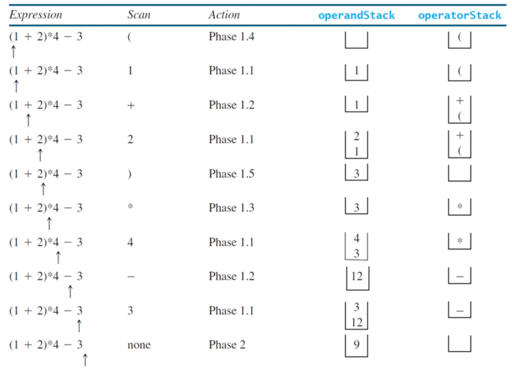

# Case Study: Evaluating Expression 使用数据结构实现算式

## Stack Algorithm for Parsing

**Stacks** can be used to evaluate expressions

**栈** 可以被用来分析算法

- **Phase 1: Scan the expression with infix operators from left to right to extract operands, operators, and the parentheses and compute the value of the expression**

  **阶段 1：使用中缀运算符从左到右扫描表达式，以提取作数、运算符和括号，并计算表达式的值**

  - 1.1. If the extracted item is an operand, push it to **operandStack**

    如果提取的项是**操作数**，则将其推送到 **operandStack**

  - 1.2. If the extracted item is a + or - operator, process all the operators on the **operatorStack** and push the extracted operator to **operatorStack**

    如果提取的项是 **+ 或 - 运算符**，则**处理 operatorStack 上的所有运算符**，并**将提取的运算符推送到 operatorStack**

  - 1.3. If the extracted item is a * or / operator, process the * or / operators at the top of **operatorStack** and push the extracted operator to **operatorStack**

    如果提取的项是 ***  或 / 运算符**，**处理 operatorStack 顶部的 *  或 / 运算符**，并**将提取的运算符推送到 operatorStack**

  - 1.4. If the extracted item is a ( symbol, push it to **operatorStack**

    如果提取的项是 **（** 符号，请将其**推送到 operatorStack**

  - 1.5. If the extracted item is a ) symbol, repeatedly process the operators from the top of **operatorStack** until seeing the ( symbol on the stack.

    如果提取的项目是 **）** 符号，则**从 operatorStack 的顶部重复处理运算符**，**直到在堆栈上看到 （ 符号**。   

- **Phase 2**: Clearing the stack

  第 2 阶段：清理堆栈

  - Repeatedly process the operators from the top of **operatorStack** until **operatorStack** is empty.

    从 operatorStack 的顶部开始重复处理运算符，直到 operatorStack 为空。



代码实现

```java
import java.util.Stack;
public class EvaluateExpression {
    public static void main(String[] args) {
        // Check number of arguments passed
        // 检查传递的参数数量
        if (args.length != 1) {
            System.out.println("Usage: java EvaluateExpression \"expression\"");
            System.exit(1);
    	}
        try {
        	System.out.println(evaluateExpression(args[0]));
        }
        catch (Exception ex) {
        	System.out.println("Wrong expression: " + args[0]);
        }
    }
    /** Evaluate an expression */
    // 分析表达式
    public static int evaluateExpression(String expression) {
        // Create operandStack to store operands
        // 创建 operandStack 以存储操作数
        Stack<Integer> operandStack = new Stack<>();
        
        // Create operatorStack to store operators
        // 创建 operatorStack 以存储操作符
        Stack<Character> operatorStack = new Stack<>();
        
        // Insert blanks around (, ), +, -, /, and *
        // 在 （、）、、-、/ 和 * 两边插入空格
        expression = insertBlanks(expression);
        
        // Extract operands and operators
        // 提取操作数和运算符
        String[] tokens = expression.split(" ");
        
        // Phase 1: Scan tokens
        
        // 阶段 1：扫描所有的 tokens
        for (String token: tokens) {
        	if (token.length() == 0) // Blank space 空
                // 返回 while 循环以提取下一个令牌
        		continue; // Back to the while loop to extract the next token
        	else if (token.charAt(0) == '+' || token.charAt(0) == '-') {
        		// Process all +, -, *, / in the top of the operator stack 
                // 处理在栈顶的所有的操作符
        		while (!operatorStack.isEmpty() &&
                    (operatorStack.peek() == '+' || 
                    operatorStack.peek() == '-' ||
                    operatorStack.peek() == '*' ||
                    operatorStack.peek() == '/')) {
                    processAnOperator(operandStack, operatorStack);
       			}
                // Push the + or - operator into the operator stack
                // 推入低级运算符 + 或 -
                operatorStack.push(token.charAt(0));
        	}
            else if (token.charAt(0) == '*' || token.charAt(0) == '/') {
                // Process all *, / in the top of the operator stack 
                // 处理所有栈顶的 * / 运算符
                while (!operatorStack.isEmpty() &&
                    (operatorStack.peek() == '*' ||
                    operatorStack.peek() == '/')) {
                    processAnOperator(operandStack, operatorStack);
                }
                // Push the * or / operator into the operator stack
                // 将 * 或 / 操作符推入栈顶
                operatorStack.push(token.charAt(0));
            } 
            else if (token.trim().charAt(0) == '(') {
            	operatorStack.push('('); // Push '(' to stack 将'（'推入堆栈
            } 
            else if (token.trim().charAt(0) == ')') {
                // Process all the operators in the stack until seeing '('
                // 处理堆栈中的所有运算符，直到看到 '（'
                while (operatorStack.peek() != '(') {
                	processAnOperator(operandStack, operatorStack);
                }
                // 从堆栈中弹出 '（' 符号
                operatorStack.pop(); // Pop the '(' symbol from the stack
            } else { // An operand scanned 扫描的操作数
                // Push an operand to the stack
                // 将操作数压入堆栈
                operandStack.push(new Integer(token));
            }
        }
        // Phase 2: process all the remaining operators in the stack 
        // 阶段2：处理堆栈中所有剩余的操作符
        while (!operatorStack.isEmpty()) {
        	processAnOperator(operandStack, operatorStack);
        }
        // Return the result
        // 返回结果
        return operandStack.pop();
    }
    
    /** Process one operator: Take an operator from operatorStack and
    * apply it on the operands in the operandStack */
    // 处理一个运算符：从operatorStack中获取一个运算符，并将其应用于operandStack中的操作数
    public static void processAnOperator(Stack<Integer> operandStack, Stack<Character> operatorStack) {
        char op = operatorStack.pop();
        int op1 = operandStack.pop();
        int op2 = operandStack.pop();
        if (op == '+') 
        	operandStack.push(op2 + op1);
        else if (op == '-') 
        	operandStack.push(op2 - op1);
        else if (op == '*') 
        	operandStack.push(op2 * op1);
        else if (op == '/') 
        	operandStack.push(op2 / op1);
    }
    
    // 插入空白
    public static String insertBlanks(String s) {
        String result = "";
        for (int i = 0; i < s.length(); i++) {
        	if (s.charAt(i) == '(' || s.charAt(i) == ')' || s.charAt(i) == '+' || s.charAt(i) == '-' ||
            	s.charAt(i) == '*' || s.charAt(i) == '/')
        		result += " " + s.charAt(i) + " ";
        else
        	result += s.charAt(i);
        }
        return result;
    }
}
```

