# 5 Lists, Stacks, Queues, and Priority Queues

## Data Structure 数据结构

- A **data structure** or **collection** is a collection of data organized in some fashion 
  
  **数据结构** 或 **集合** 是以某种方式组织的数据集合

  - not only **stores** data but also supports **operations** for accessing and manipulating the data
    
    不仅**存储数据**，还支持访问和控制数据的**操作**
    
    - 为特定任务选择最佳数据结构和算法是开发高性能软件的关键之一
  
- In object-oriented thinking, a data structure, also known as a **container**, is an object that stores other objects, referred to as **elements**

  在面向对象的思维中，数据结构，也称为 **容器**，是存储其他对象的对象（**元素**）

## Java Collection Framework hierarchy 集合类框架层级

- Java provides several data structures that can be used to organize and manipulate data efficiently, commonly known as **Java** **Collections Framework**

  Java 拥有丰富并且全面的集合类，统称为 **Java 集合框架**

- The Java Collections Framework supports **two types of containers:** 

  Java 支持**两种类型的集合框架**：

  - One for **storing** a collection of **elements**, simply called a **collection**

    一个用于 **存储元素** 集合，简称为 **集合**

    - **Lists** store an ordered collection of elements

      **列表** 可以有序地存储一组元素，允许重复

    - **Sets** store a group of nonduplicate elements

      **Set** 存储一组没有重复数据的元素

    - **Stacks** store objects that are processed in a last-in, first-out fashion

      **栈** 存储的元素需要按照先进后出的原则来取用

    - **Queues** store objects that are processed in a first-in, first-out fashion

      **队列** 存储的元素需要按照先进先出的原则来取用

    - **PriorityQueues** store objects that are processed in the order of their priorities

      **优先级队列(Heap)** 中的元素会按照优先级来进行排序

  - One for storing **key/value pairs**, called a **map**

    另一种是**键值对**，被称为 **map**：

    - Note: this is called a **dictionary** in Python
    
      Java 的 map 在 Python 中相当于“字典”

- 所有的 Java 集合类都被存放在 **java.util** 包中，Java 的集合类提供了非常优秀的接口、抽象类和实体类的使用案例
  - The **interfaces** define the framework/general API
  
    **接口**用来定义基本的框架以及通用的 API
  
  - The **abstract classes** provide partial implementation
    
    **抽象类**用来进行局部的实现
    
    - Providing an abstract class that partially implements an interface makes it convenient for the user to write the code for the specialized containers
      
      提供实现部分接口方法的抽象类可以**方便用户为专用容器编写代码**
      
      - **AbstractCollection** is provided for convenience (for this reason, it is called **a** **convenience abstract class**)
      
        **AbstractCollection** 是为了方便而提供的（因此，它被称为 一个 **方便的抽象类**）它提供了除了add, size 和 iterator 之外的通用方法的实现
  
- The **concrete classes** implement the interfaces with concrete data structures

  **实例类**的任务就是实现接口并设置具体的数据结构

- The **Collection** interface is the **root interface** for manipulating a collection of objects
  
  **Collection 接口**是用于作对象集合的 **根** 接口
  
  - The **AbstractCollection** class provides **partial implementation** for the **Collection** interface (all the methods in **Collection** except the **add**, **size**, and **iterator** methods)
  
    AbstractCollection类提供了Collection接口的**部分实现**（Collection中的所有方法，除了add、size和迭代器方法）
  
- Note: the **Collection** interface implements the **Iterable** interface 
  
  **Collection** 接口实现了 **Iterable** 接口，因此事实上所有的**集合类都是可以使用迭代器**的
  
  - We can obtain an **Iterator** object for traversing elements in the collection
    
    我们可以获取一个 **Iterator 对象** 来遍历集合中的元素
    
    - Also used by for-each loops
    
      当然 For-each 增强 for 循环也可以，并且理论上来讲增强 for 循环的效率更高，只不过 iterator 更方便并且适合 stream 操作。

Java 集合类继承关系图

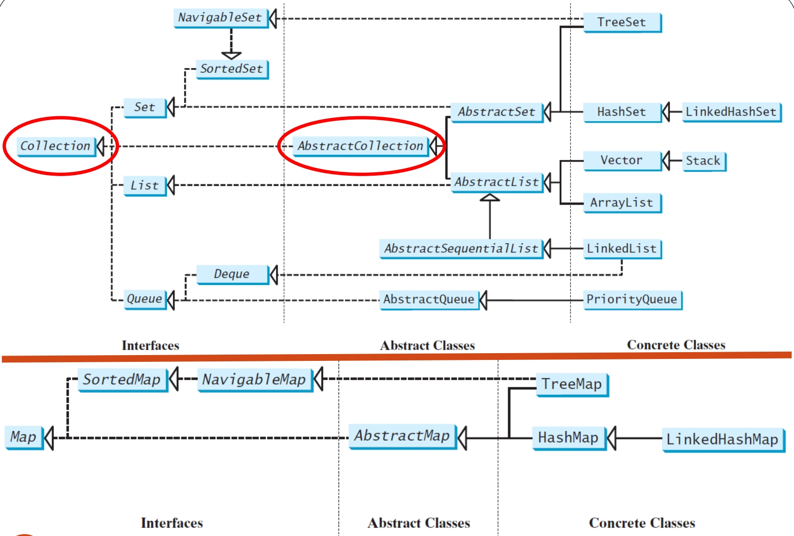

Java Collections 接口和 Iterable 接口之间的关系

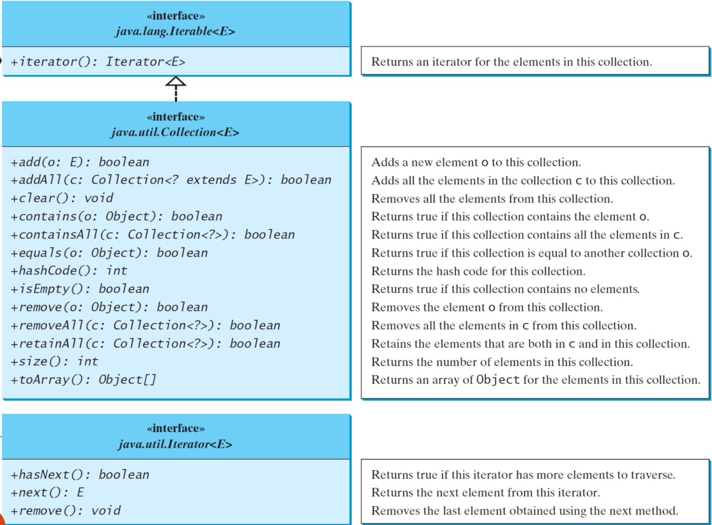

### Example of using the methods in the Java Collection Framework

```java
import java.util.*;
public class TestCollection {
    public static void main(String[] args) {
        ArrayList<String> collection1 = new ArrayList<>();
        collection1.add("New York"); // add
        collection1.add("Atlanta"); 
        collection1.add("Dallas"); 
        collection1.add("Madison"); 
        // 打印当前列表中的内容
        System.out.println("A list of cities in collection1:");
        System.out.println(collection1);
        /**
        * A list of cities in collection1: collections1中的城市列表信息
        * [New York, Atlanta, Dallas, Madison]
        */
        
        // the Collection interface’s contains method
        // Collection 接口的 contains 方法
        System.out.println("\nIs Dallas in collection1? " + collection1.contains("Dallas")); // contains
        /**
        * Is Dallas in collection1? true
        */
        
        // the Collection interface’s remove method
        collection1.remove("Dallas"); // remove
        
        // the Collection interface’s size method
       // Collection 接口的 size 方法
        System.out.println("\n" + collection1.size() + " cities are in collection1 now");
        /**
        * 3 cities are in collection1 now
        */
        
        Collection<String> collection2 = new ArrayList<>();
        collection2.add("Seattle"); 
        collection2.add("Portland"); 
        System.out.println("\nA list of cities in collection2:");
        System.out.println(collection2);
        /**
        * A list of cities in collection2:
        * [Seattle, Portland]
        */
        
        // clone 两者的并集
        ArrayList<String> c1 = (ArrayList<String>)(collection1.clone()); // clone
        c1.addAll(collection2); // addAll
        System.out.println("\nCities in collection1 or collection2:");
        System.out.println(c1);
        /**
        * Cities in collection1 or collection2:
        * [New York, Atlanta, Madison, Seattle, Portland]
        */
        
        // retain 两者之间的交集
        c1 = (ArrayList<String>)(collection1.clone());
        c1.retainAll(collection2); // retainAll
        System.out.print("\nCities in collection1 and collection2:");
        System.out.println(c1);
        /**
        * Cities in collection1 and collection2:[]
        */
        
        // remove在1中但是不在2中
        c1 = (ArrayList<String>)(collection1.clone());
        c1.removeAll(collection2); // removeAll
        System.out.print("\nCities in collection1, but not in 2: ");
        System.out.println(c1);
        /**
        * Cities in collection1, but not in 2: [New York, Atlanta, Madison]
        */
    }
}
```

- All the concrete classes in the Java Collections Framework implement the **java.lang.Cloneable** and **java.io.Serializable** interfaces except that **java.util.PriorityQueue** does not implement the **Cloneable** interface

  Java Collections Framework 中的所有具体类都实现了 Java.lang.Cloneable 和 Java.io.serializable 接口，**除了 Java .util. priorityqueue 没有实现 Cloneable 接口**

- Some of the methods in the **Collection** interface cannot be implemented in the concrete subclass (e.g., the read-only collections cannot add or remove)

  Java 中的 `Collection` 接口定义了一些通用的方法（如 add、remove 等），但这些方法在某些具体的子类中可能**无法真正实现**，因为子类的特性限制了这些方法的行为。

  - In this case, the method would throw **java.lang.UnsupportedOperationException**, like this:
  
    对于只读或不可变集合来说，修改操作（如 add、remove）是不合理的，因此它们会抛出 **UnsupportedOperationException** 来表示这些操作不被支持。
    
    ```java
    public void someMethod() {
    	throw new UnsupportedOperationException("Method not supported");
    }
    ```

## Iterators 迭代器

- Each collection is **Iterable**

  每个集合都是可以使用**迭代器**

  - **Iterator** is a classic design pattern for walking through a data structure without having to expose the details of how data is stored in the data structure

    Iterator 是一种经典的设计模式，用于遍历数据结构，而不必公开数据在数据结构中存储方式的详细信息

    - Also used in for-each loops: 
    
      使用 for-each 循环的前提是当前对象 implements 了 Iterable 接口（不属于标记接口，因为其明确要求需要实现iterator()方法）
      
      ```java
      // 增强 for 循环
      for(String element: collection) 
          System.out.print(element + " ");
      ```

- The **Collection** interface extends the **Iterable** interface
  
  Collection 接口扩展了 Iterable 接口
  
  - You can obtain a collection **Iterator** object to traverse all the elements in the collection with the **iterator()** method in the **Iterable** interface which returns an instance of **Iterator**
    
    您可以使用 **Iterable** 接口中的 **iterator()** 方法获取一个集合 **Iterator** 对象，以遍历集合中的所有元素，该方法返回 **Iterator**  的实例
    
    - The **Iterable** interface defines the **iterator** method, which returns an **Iterator**
    
      **Iterable** 接口定义了 **iterator** 方法，该方法返回一个 **Iterator** 对象

```java
import java.util.*;
public class TestIterator {
    public static void main(String[] args) {
        Collection<String> collection = new ArrayList<>();
        collection.add("New York"); 
        collection.add("Atlanta"); 
        collection.add("Dallas"); 
        collection.add("Madison"); 
        // 创建集合对象的迭代器
        // List 实现了 Iterable
        Iterator<String> iterator = collection.iterator();  // 获取 Iterator
        // 循环迭代当前集合，通过iterator
        while (iterator.hasNext()) {
            // 获取读取到的下一个值，并且修改为全大写
        	System.out.print(iterator.next().toUpperCase() + " ");
        }
        System.out.println();
    }
}

// Output: NEW YORK ATLANTA DALLAS MADISON
```

1. 创建和初始化列表
   - 我们创建了⼀个 ArrayList 并添加了⼀些城市名称。

2.  获取 **ListIterator** 
   - 对象使⽤ list.listIterator() ⽅法获取 ListIterator 对象。

3.  使⽤ **nextIndex()** ⽅法遍历列表 
   - 使⽤ hasNext() 和 next() ⽅法遍历列表，并在每次迭代中输出当前元素及其下⼀个元素的索引。

4. 使⽤  **previousIndex()** ⽅法逆向遍历列表
   - 使⽤ hasPrevious() 和 previous() ⽅法逆向遍历列表，并在每次迭代中输出当前元素及其上⼀个元素的索引。

5. 使⽤ **add()** ⽅法插⼊新元素
   - 使⽤ add() ⽅法在遇到 "Dallas" 元素时，在其前⾯插⼊ "Houston"。

6. 输出修改后的列表
   - 最后，遍历列表并输出所有元素，显⽰插⼊新元素后的列表。

使用增强 for 循环的优势就是我们不需要知道当前的集合内的数据的数量

案例：

```java
import java.util.ArrayList;
import java.util.Iterator;
import java.util.List;
import java.util.NoSuchElementException; // 迭代器没有更多元素时抛出的异常

/**
 * 自定义一个可迭代的集合类，用于存储字符串。
 * 实现 Iterable 接口，以便可以使用增强 for 循环进行迭代。
 */
public class MyCollection implements Iterable<String> {

    private List<String> elements; // 内部使用 ArrayList 存储元素
    private int currentSize; // 集合中元素的实际数量

    /**
     * 构造函数，创建一个空的 MyCollection。
     */
    public MyCollection() {
        this.elements = new ArrayList<>();
        this.currentSize = 0;
    }

    /**
     * 向集合中添加一个字符串元素。
     * @param item 要添加的字符串。
     */
    public void add(String item) {
        this.elements.add(item);
        this.currentSize++;
    }

    /**
     * 返回集合中元素的数量。
     * @return 元素的数量。
     */
    public int size() {
        return currentSize;
    }

    /**
     * MyCollection 必须实现此方法，以便支持增强 for 循环。
     * 它返回一个 MyCollectionIterator 实例。
     *
     * @return 一个 Iterator 对象，用于遍历集合中的元素。
     */
    @Override
    public Iterator<String> iterator() {
        return new MyCollectionIterator();
    }

    /**
     * 这是一个私有的内部类，实现了 Iterator 接口。
     * 它负责定义 MyCollection 如何被遍历。
     */
    private class MyCollectionIterator implements Iterator<String> {
        private int currentIndex = 0; // 迭代器当前指向的元素的索引

        /**
         * 检查是否还有下一个元素可以迭代。
         * @return 如果有下一个元素，则返回 true；否则返回 false。
         */
        @Override
        public boolean hasNext() {
            // 只要当前索引小于集合的实际大小，就说明还有元素
            return currentIndex < currentSize;
        }

        /**
         * 返回迭代序列中的下一个元素，并将迭代器向前推进。
         * @return 迭代序列中的下一个元素。
         * @throws NoSuchElementException 如果没有下一个元素。
         */
        @Override
        public String next() {
            // 如果没有下一个元素，根据 Iterator 规范，抛出 NoSuchElementException
            if (!hasNext()) {
                throw new NoSuchElementException("没有更多元素了。");
            }
            // 返回当前索引的元素，并将索引向前移动一位
            return elements.get(currentIndex++);
        }

        /**
         * (可选操作) 从底层集合中移除上次 next() 返回的元素。
         * 在这个例子中我们不实现它，所以会抛出 UnsupportedOperationException。
         * 如果需要实现，要确保正确处理底层集合的修改以及 currentIndex 的调整。
         */
        @Override
        public void remove() {
            // 对于简单的只读迭代，通常不需要实现 remove()
            throw new UnsupportedOperationException("此迭代器不支持 remove 操作。");
        }
    }

    // --- 主方法，用于演示和测试 ---
    public static void main(String[] args) {
        System.out.println("--- 演示 Iterable 和 Iterator ---");

        MyCollection myStrings = new MyCollection();
        myStrings.add("Apple");
        myStrings.add("Banana");
        myStrings.add("Cherry");
        myStrings.add("Date");

        System.out.println("集合大小: " + myStrings.size());

        // --- 方式一：使用增强 for 循环进行迭代 (推荐) ---
        // 编译器会在背后调用 myStrings.iterator() 来获取 Iterator，
        // 然后使用 hasNext() 和 next() 遍历。
        System.out.println("\n--- 使用增强 for 循环 (foreach) 迭代打印 ---");
        for (String fruit : myStrings) {
            System.out.println("元素: " + fruit);
        }

        // --- 方式二：手动使用 Iterator 进行迭代 ---
        // 这展示了增强 for 循环背后发生的事情。
        System.out.println("\n--- 手动使用 Iterator 迭代打印 ---");
        Iterator<String> manualIterator = myStrings.iterator();
        while (manualIterator.hasNext()) {
            String fruit = manualIterator.next();
            System.out.println("元素: " + fruit);
        }

        // --- 演示没有更多元素时的情况 ---
        System.out.println("\n--- 演示 NoSuchElementException ---");
        try {
            // 再次获取迭代器
            Iterator<String> emptyIterator = myStrings.iterator();
            // 快速遍历到末尾
            while (emptyIterator.hasNext()) {
                emptyIterator.next();
            }
            // 尝试获取不存在的下一个元素
            emptyIterator.next();
        } catch (NoSuchElementException e) {
            System.out.println("成功捕获异常: " + e.getMessage());
        }

        // --- 演示 remove() 不支持 ---
        System.out.println("\n--- 演示 UnsupportedOperationException for remove() ---");
        try {
            Iterator<String> removeIterator = myStrings.iterator();
            if (removeIterator.hasNext()) {
                removeIterator.next(); // 移动到第一个元素
                removeIterator.remove(); // 尝试调用 remove()
            }
        } catch (UnsupportedOperationException e) {
            System.out.println("成功捕获异常: " + e.getMessage());
        }
    }
}
```

## List 接口

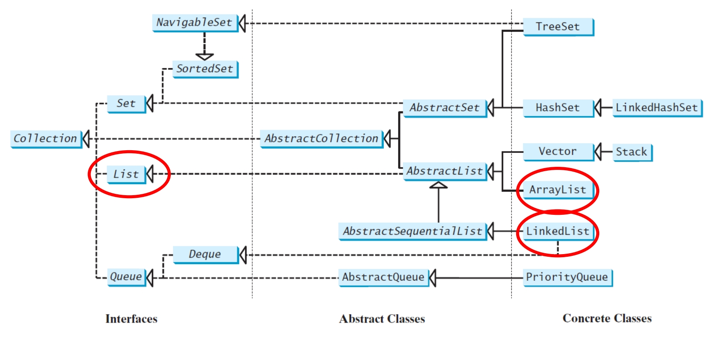

- A **list** collection stores elements in a **sequential** order, and allows the user to specify where the element is stored

  list 集合按 **顺序** 有序存储元素，并允许用户**指定元素的存储位置**

- The user can also access the elements by **index**

  用户还可以通过 **索引** 访问元素

- The **List** interface stores elements in sequence and permits duplicates

  List接口按顺序存储元素，并**允许重复元素**

- Two concrete classes in Java Collections Framework: **ArrayList** and **LinkedList**

  Java集合框架中的两个具体类：**ArrayList** 和 **LinkedList**

Java List 的继承关系

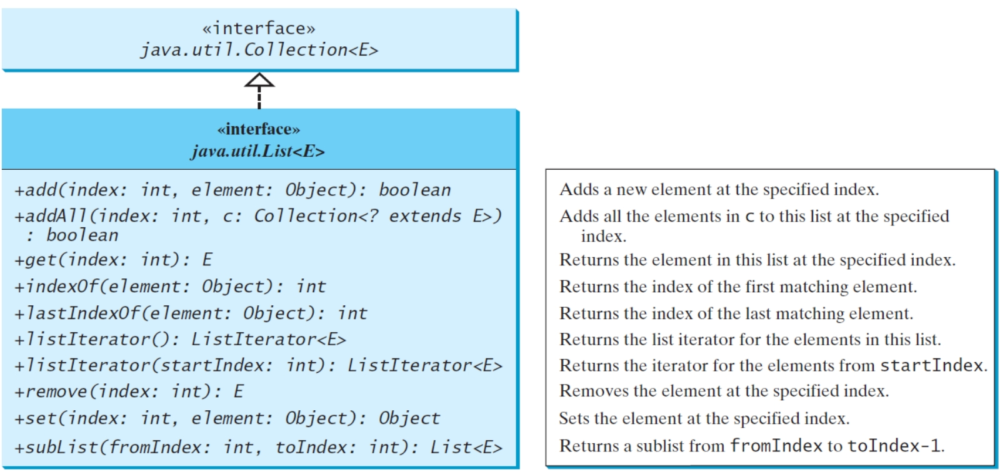

### ListIterator

- The **listIterator()** and **listIterator(startIndex)** methods return an instance of **ListIterator**

  **listIterator()** 和 **listIterator(startIndex)**  方法返回 **ListIterator** 的实例

- The **ListIterator** interface extends the **Iterator** interface for bidirectional traversal of the list and add elements to the list

  **Listtiterator** 接口扩展了 **Iterator** 接口，用于**双向遍历列表并向列表中添加元素**

- The **nextIndex()** method returns the index of the next element in the iterator, and the **previousIndex()** returns the index of the previous element in the iterator

  **nextIndex()** 方法返回迭代器中下一个元素的索引，**previousIndex()** 方法返回迭代器中前一个元素的索引

- The **add(element)** method inserts the specified element into the list immediately before the next element that would be returned by the **next()** method defined in the **Iterator** interface

  **add(element)** 方法在 **Iterator** 接口中定义的 **next()** 方法返回的下一个元素之前插入指定的元素到列表中

  ```java
  List<String> list = new ArrayList<>(Arrays.asList("A", "B", "C"));
  ListIterator<String> iterator = list.listIterator();
  
  iterator.next(); // 游标移动到 "A" 的后面，指向 "B"
  iterator.add("X"); // 在 "B" 之前插入 "X"
  System.out.println(list); // 输出 [A, X, B, C]
  ```

Java 中 ListIterator 是怎么拓展 Iterator 接口的

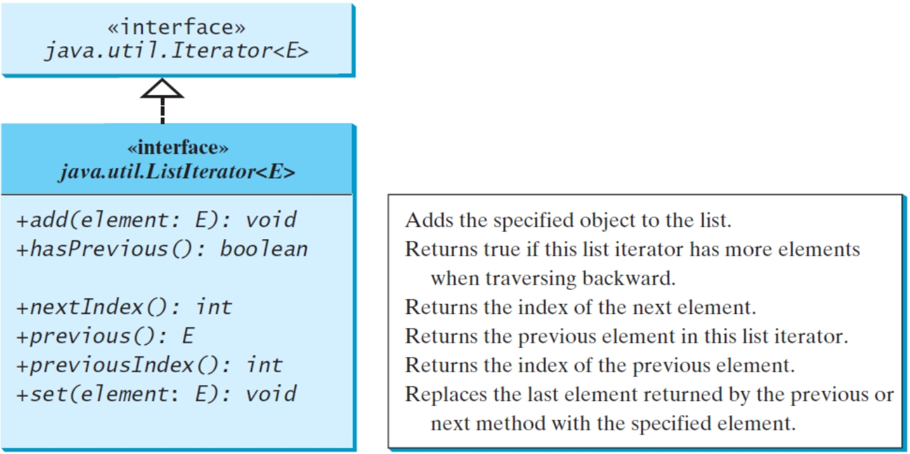

code example:
```java
public class ListIteratorExample {

    public static void main(String[] args) {
        List<String> fruits = new ArrayList<>();
        fruits.add("Apple");
        fruits.add("Banana");
        fruits.add("Cherry");
        fruits.add("Date");
        fruits.add("Elderberry");

        System.out.println("原始列表: " + fruits);

        // --- 1. 从列表开头开始向前遍历 ---
        System.out.println("\n--- 从头开始向前遍历 (nextIndex) ---");
        ListIterator<String> forwardIterator = fruits.listIterator();

        while (forwardIterator.hasNext()) {
            // nextIndex() 返回下一个要被 next() 返回的元素的索引
            int currentIndex = forwardIterator.nextIndex();
            String element = forwardIterator.next();
            System.out.println("索引 " + currentIndex + " - 元素: " + element);
        }
        // 此时，迭代器已经到达列表的末尾。
        // forwardIterator.nextIndex() 会是列表的大小 (fruits.size())。
        // forwardIterator.previousIndex() 会是列表的大小 - 1。


        // --- 2. 从列表末尾开始向后遍历 ---
        System.out.println("\n--- 从尾开始向后遍历 (previousIndex) ---");
        // listIterator(int index) 构造一个ListIterator，使其处于指定索引位置之前。
        // 因此，listIterator(fruits.size()) 会将迭代器设置在列表末尾之后，
        // 这样第一次调用 previous() 就会返回最后一个元素。
        ListIterator<String> backwardIterator = fruits.listIterator(fruits.size());

        while (backwardIterator.hasPrevious()) {
            // previousIndex() 返回下一个要被 previous() 返回的元素的索引
            int currentIndex = backwardIterator.previousIndex();
            String element = backwardIterator.previous();
            System.out.println("索引 " + currentIndex + " - 元素: " + element);
        }
        // 此时，迭代器已经到达列表的开头。


        // --- 3. 在中间位置进行双向遍历和索引检查 ---
        System.out.println("\n--- 从中间开始双向遍历 (nextIndex & previousIndex) ---");
        // 从索引 2 开始 (即在 "Cherry" 之前)
        ListIterator<String> mixedIterator = fruits.listIterator(2);

        System.out.println("初始位置: nextIndex() = " + mixedIterator.nextIndex() + ", previousIndex() = " + mixedIterator.previousIndex());

        // 向前走一步
        if (mixedIterator.hasNext()) {
            String nextElement = mixedIterator.next();
            System.out.println("向前一步: 获取到 '" + nextElement + "'");
            System.out.println("当前位置: nextIndex() = " + mixedIterator.nextIndex() + ", previousIndex() = " + mixedIterator.previousIndex());
            // 此时 nextIndex() 应该是 3 (Date 的索引)，previousIndex() 应该是 2 (Cherry 的索引)
        }

        // 向后走一步
        if (mixedIterator.hasPrevious()) {
            String prevElement = mixedIterator.previous();
            System.out.println("向后一步: 获取到 '" + prevElement + "'");
            System.out.println("当前位置: nextIndex() = " + mixedIterator.nextIndex() + ", previousIndex() = " + mixedIterator.previousIndex());
            // 此时 nextIndex() 应该是 2 (Cherry 的索引)，previousIndex() 应该是 1 (Banana 的索引)
        }

        // 再次向前走几步
        System.out.println("继续向前...");
        while (mixedIterator.hasNext()) {
            System.out.println("索引 " + mixedIterator.nextIndex() + " - 元素: " + mixedIterator.next());
            if (mixedIterator.nextIndex() == 4) break; // 走到 "Date" 之后停止
        }
        System.out.println("当前位置: nextIndex() = " + mixedIterator.nextIndex() + ", previousIndex() = " + mixedIterator.previousIndex());

        // 再次向后走几步
        System.out.println("继续向后...");
        while (mixedIterator.hasPrevious()) {
            System.out.println("索引 " + mixedIterator.previousIndex() + " - 元素: " + mixedIterator.previous());
            if (mixedIterator.previousIndex() == 1) break; // 走到 "Banana" 之后停止
        }
        System.out.println("当前位置: nextIndex() = " + mixedIterator.nextIndex() + ", previousIndex() = " + mixedIterator.previousIndex());
    }
}
```

### ArrayList and LinkedList

- The **ArrayList** class and the **LinkedList** class are concrete implementations of the **List** interface

  **ArrayList 类**和 **LinkedList 类**是 **List 接口**的**具体实现**

  - A list can grow or shrink dynamically 

    列表可以动态增大或收缩

    - While an array is fixed once it is created
  
      当数组在创建起长度就是固定的
    
      - If your application does not require insertion or deletion of elements, the most efficient data structure is an **array**
      
        如果读多写少，那么 Array 类型会比 List 类型更合适

- Which of the two classes **ArrayList** class and the **LinkedList** class you use depends on your specific needs:

  使用两个类中的哪一个 ArrayList 类和 LinkedList 类取决于您的具体需求：

  - The critical difference between them pertains to internal implementation, which affects their performance.

    它们之间的关键区别在于内部的实现方式，这会影响它们的性能。

    - If you need to support random access through an index **without inserting or removing** elements from any place **other than the end**, **ArrayList** offers the most efficient collection

      如果需要支持通过索引的**随机访问**，而不需要从末尾以外的任何位置插入或删除元素，那么**ArrayList提供了最有效的集合**
    
    - If your application requires the insertion or deletion of elements from **at the beginning of the list**, you should choose **LinkedList**
    
      如果应用程序需要**插入或删除列表开头的元素**，您应该选择**LinkedList**

- The **get(i)** method is available for a **linked list**, but it is a more time-consuming operation to find each element

  ArrayList 实现了 **RamdomAccess** 接口，所以可以直接通过索引定位，但是 LinkedList 没有，所以每次查找都需要从头开始。

  - 建议在通过 LinkedList 查找的时候，通过 for-each 或者 iterator 来进行查找。所以虽然两者查询的时间复杂度都是 O(n) ，但是ArrayList 的平均步长更短
  
  - LinkedList 使用 get(i) 方法非常耗时，所以建议使用 for-each loop 以及 iterator方法来迭代
  
    ```JAVA
    for(int i = 0; i < list.size(); i++) {
        // process list.get(i) 不要选用
    }
    
    for (listElementType s: list) {
        // process s
    }
    ```

- 注解在定义 List 的时候就设置初始的列表存放的内容：

  - ```java
    List<Integer> arr = new ArrayList<>(Arrays.asList(1, 2, 3));
    ```

  - ```java
    List<Integer> arr = new ArrayList<>(); // 先创建一个空的 ArrayList
    Collections.addAll(arr, 1, 2, 3); // 然后添加元素
    ```

#### java.util.ArrayList

Java 中 ArrayList 的结构

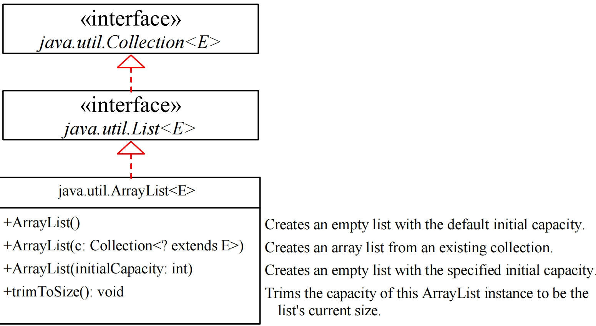

Implemented with **arrays**, e.g., before inserting a new element at a specified index, shift all the elements after the index to the right and increase the ArrayList size by 1

使用 **数组** 实现，例如，在指定索引处插入新元素之前，将索引后的所有元素向右移动，并将 ArrayList 大小增加 1(size方法可以得到列表中元素的总数，列表的容量只能通过反射来获取)

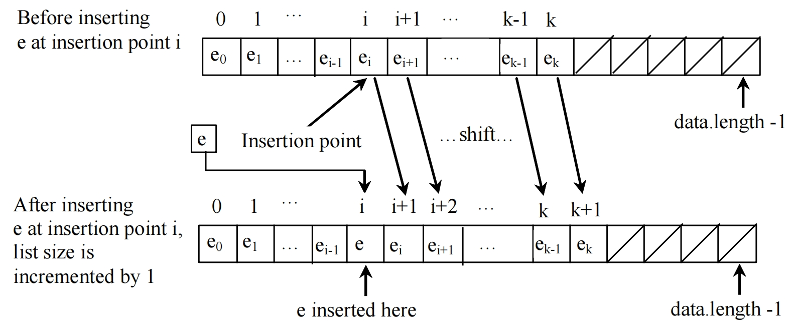

#### java.util.LinkedList

Java 中 LinkedList 的结构

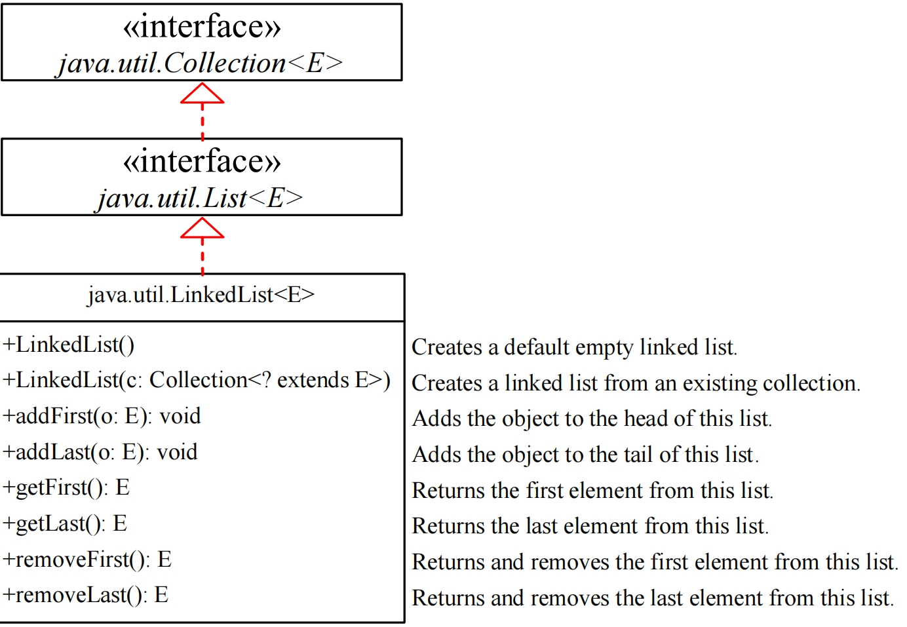

LinkedList 是通过**链表**实现的，主要是通过运用**指针**，从当前节点指向下一个或者上一个节点。

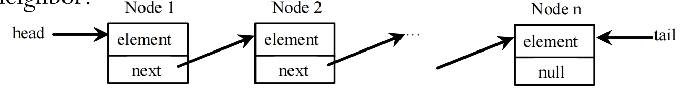

一个节点通常包含：只想上一个节点的指针，该节点存储的值，指向下一个阶段的指针

```java
class Node<E> {
    E element;
    Node<E> next;
    public Node(E o) {
    	element = o;
    }
}
```

### Example usage of ArrayList and LinkedList

```java
public class TestArrayAndLinkedList {
    public static void main(String[] args) {
        // 创建一个 ArrayList 实例，然后填入数字，并在指定位置插入新的元素
        List<Integer> arrayList = new ArrayList<>();
        arrayList.add(1); // 1 is autoboxed to new Integer(1)
        arrayList.add(2);
        arrayList.add(3);
        arrayList.add(1);
        arrayList.add(4);
        arrayList.add(0, 10);
        arrayList.add(3, 30);
        System.out.println("A list of integers in the array list:");
        System.out.println(arrayList);
        
        // 创建一个 LinkedList 实例，然后从一个指定的位置remove一个元素
        LinkedList<Object> linkedList = new LinkedList<>(arrayList);
        linkedList.add(1, "red");
        linkedList.removeLast();
        linkedList.addFirst("green");
        // 倒序打印 LinkedList，通过索引
        System.out.println("Display the linked list backward with index:");
        for (int i = linkedList.size() - 1; i >= 0; i--) {
        	System.out.print(linkedList.get(i) + " ");
        }
        
        // 正序打印 LinkedList
        System.out.println();
        System.out.println("Display the linked list forward:");
        ListIterator<Object> listIterator = linkedList.listIterator();
        
        while (listIterator.hasNext()) {
        	System.out.print(listIterator.next() + " ");
        }
        
        // 倒序打印 LinkedList
        System.out.println();
        System.out.println("Display the linked list backward:");
        listIterator = linkedList.listIterator(linkedList.size()); 
        
        while (listIterator.hasPrevious()) {
        	System.out.print(listIterator.previous() + " ");
    	}
	}
}

A list of integers in the array list:
[10, 1, 2, 30, 3, 1, 4]

Display the linked list backward with index:
1 3 30 2 1 red 10 green 
    
Display the linked list forward:
green 10 red 1 2 30 3 1 
    
Display the linked list backward:
1 3 30 2 1 red 10 green
```

## Comparator 接口

- Sometimes you want to compare the elements that are not instances of **Comparable** or by a **different criteria** than **Comparable**

  有时，想要比较**不是 Comparable 实例的元素**，或者根据**与 Comparable 不同的标准**的比较元素

- You can define a **Comparator** to compare these elements 

  可以定义一个 **Comparator** 来比较这些元素

  - Define a class that implements the **java.util.Comparator<T>** interface

    定义一个实现 **java.util.Comparator<T>** 接口的类

  - The **Comparator** interface has two methods: **compare** and **equals**

    Comparator 接口有两种方法： **compare** 和 **equals**

    >  **public int compare(T element1, T element2)**

    - Returns a negative value if **element1** is less than **element2** a positive value if **element1** is greater than **element2**, and zero if they are equal

      如果 element1 小于 element2，则返回负值，如果 element1 大于 element2，则返回正值，如果它们相等，则返回零

```java
import java.util.Comparator;
public class GeometricObjectComparator implements Comparator<GeometricObject>, java.io.Serializable {
    // It is generally a good idea for comparators to implement 
    // Serializable, as they may be used as ordering methods in 
    // serializable data structures.
    public int compare(GeometricObject o1, GeometricObject o2) {
        double area1 = o1.getArea();
        double area2 = o2.getArea();
        if (area1 < area2)
        return -1;
        else if (area1 == area2)
        return 0;
        else
        return 1;
    }
}

public class TestComparator {
    public static void main(String[] args) {
        GeometricObject g1 = new Rectangle(5, 5);
        GeometricObject g2 = new Circle(5);
        // 输入两个要对比的对象，以及定义好的对比方法
        GeometricObject g = max(g1, g2, new GeometricObjectComparator());
        System.out.println("The area of the larger object is " + g.getArea());
    }
    public static GeometricObject max(GeometricObject g1, GeometricObject g2, 
        Comparator<GeometricObject> c) {
        if (c.compare(g1, g2) > 0)
            return g1;
        else
            return g2;
    }
}
```

## Static Methods for Lists and Collections  列表和集合的静态方法

- The **java.util.Collections** class contains static methods to perform common operations in a collection or a list

  java.util.Collections 类包含用于在集合或列表中执行常见作的静态方法

  - **max**, **min**, **disjoint**, and **frequency** methods for collections

  - **sort**, **binarySearch**, **reverse**, **shuffle**, **copy**, and **fill** methods for lists
  
    ```java
    static <T extends Comparable<? super T>> void sort(List<T> list)
    ```

    uses the **compareTo** method in the **Comparable** interface
  
    ```java
    static <T extends Comparator<? super T>> void sort(List<T> list, Comparator<T> c)
    ```
  
    uses the **compare** method in the **Comparator** interface

### Collections

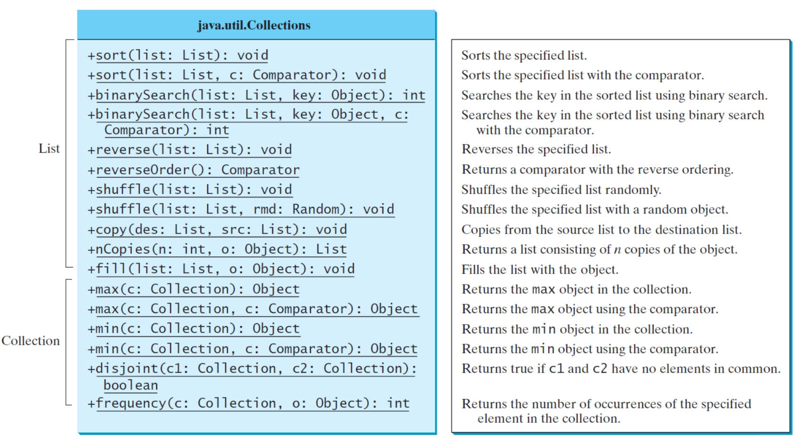

### Other Collections class useful static methods Collections 类中其他一些实用方法

- **rotate(List list, int distance)** - Rotates all of the elements in the list by the specified distance.

  将列表中的所有元素旋转指定的距离。

- **replaceAll(List list, Object oldVal, Object newVal)** - Replaces all occurrences of one specified value with another.

  将一个指定值的所有匹配项替换为另一个指定值。

- **indexOfSubList(List source, List target)** - Returns the index of the first sublist of source that is equal to target.

  返回 source 中第一个等于 target 的子列表的索引。

- **lastIndexOfSubList(List source, List target)** - Returns the index of the last sublist of source that is equal to target.

  返回等于 target 的 source 的最后一个子列表的索引。

- **swap(List, int, int)** - Swaps the elements at the specified positions in the specified list.

  在指定列表中的指定位置交换元素。

- **addAll(Collection<? super T>, T...)** - Adds all of the elements in the specified array to the specified collection.

  将指定数组中的所有元素添加到指定的集合中。

### Static Method for List 列表的静态方法

#### Sorting 排序

```java
// 升序排序
List<String> list = Arrays.asList("red", "green", "blue");
Collections.sort(list);
System.out.println(list);

// The output is: [blue, green, red]
```

- To sort it in descending order, you can simply use the **Collections.reverseOrder()** method to return a **Comparator** object that orders the elements in reverse of their natural order

  要按降序排序，您可以简单地使用 **Collections.reverseOrder()** 方法返回一个 Comparator 对象，该对象按元素的自然顺序**倒序**排序

```java
// 倒序排序
Collections.sort(list, Collections.reverseOrder());
System.out.println(list);

// The output is [yellow, red, green, blue]
```

#### Binary Search 二分搜索

- You can use the **binarySearch** method to search for a key in a sorted list

  您可以使用 Collections 自带的 **binarySearch()** 方法在排序列表中搜索键

  - To use this method, the list must be sorted in **increasing** order 

    要使用此方法，必须按**升序**对列表进行排序

  - If the **key** is not in the list, the method returns **- (insertion point + 1)**

    如果 **key** 不在列表中，该方法返回  **- (该内容的插入位置 + 1)**

```java
List<Integer> list1 = Arrays.asList(2, 4, 7, 10, 11, 45, 50, 59, 60, 66);
System.out.println("(1) Index: " + Collections.binarySearch(list1, 7)); //2
// 这里没有9，如果有9的话应该插入在7,10之间，所以位置应该是-(3 + 1)
System.out.println("(2) Index: " + Collections.binarySearch(list1, 9)); //-4

List<String> list2 = Arrays.asList("blue", "green", "red");
System.out.println("(3) Index: " + Collections.binarySearch(list2, "red")); //2
// 这里没有 cyan，如果有应该在 blue 和 green 之间，所以位置应该是 -(1 + 1)
System.out.println("(4) Index: " + Collections.binarySearch(list2, "cyan")); //-2
```

#### Reverse 反转

可以使用 Collections 自带的 reverse 方法

```java
List<String> list = Arrays.asList("yellow", "red", "green", "blue");
Collections.reverse(list);

System.out.println(list);

// [blue, green, red, yellow]
```

#### Shuffle 洗牌

可以使用 Collections 自带的 shuffle 方法

```java
List<String> list = Arrays.asList("yellow", "red", "green", "blue");
Collections.shuffle(list);

System.out.println(list);
```

- You can also use the **shuffle(List, Random)** method to randomly reorder the elements in a list with a specified **Random** object. 

  您还可以使用 **shuffle(List， Random)** 方法对具有指定 Random 对象的列表中的元素进行**随机**重新排序。

  - Using a specified **Random** object is useful to shuffle another list with an identical sequences of elements

    使用指定的 **Random** 对象可用于 shuffle 另一个具有相同元素顺序的列表

```java
import java.util.Arrays;
import java.util.Collections;
import java.util.List;
import java.util.Random;
public class SameShuffle {
    public static void main(String[] args) {
        List<String> list1 = Arrays.asList("yellow", "red", "green", "blue");
        List<String> list2 = Arrays.asList("Y", "R", "G", "B");
        Collections.shuffle(list1, new Random(20));
        Collections.shuffle(list2, new Random(20));
        System.out.println(list1);
        System.out.println(list2);
    }
}

// [blue, yellow, red, green]
// [B, Y, R, G]
```

#### Copy(dest, src)

**copy** all the elements from a source list to a destination list on the same index

将源列表中的所有元素**复制**到**同一索引**上的目标列表，将dest对应索引上的内容给替换成src上的

```java
List<String> list1 = Arrays.asList("yellow", "red", "green", "blue");
List<String> list2 = Arrays.asList("white", "black");
Collections.copy(list1, list2);

System.out.println(list1);

// [white, black, green, blue]
```

- The **copy** method performs a **shallow** copy: only the references of the elements from the source list are copied

  copy 方法执行 **浅复制**：**仅复制源列表中元素的引用**

- If the destination list is **smaller** than the source list then we get a **runtime error**

  如果复制的目标列表数量小于复制源列表 （dest < src），那么就会产生**运行时异常**

```java
List<String> list2 = Arrays.asList("yellow", "red", "green", "blue");
List<String> list1 = Arrays.asList("white", "black");
Collections.copy(list1, list2);

Runtime error: 
java.lang.IndexOutOfBoundsException: Source does not fit in destination
```

### Arrays工具类 和 ArrayList类

Java provides the static **asList** method for creating a list from a variable-length list of arguments

Java 提供了静态 **asList** 方法，**用于从可变长度的参数列表创建列表**

```java
List<String> list1 = Arrays.asList("red", "green", "blue");
List<Integer> list2 = Arrays.asList(10, 20, 30, 40, 50);
```

returns a **List** reference of inner class object defined within **Arrays** :

返回在数组中定义的内部类对象的List引用

> **java.util.Arrays$ArrayList**, which is also called **ArrayList** but it is just a wrapper for an array
>
> java.util.Arrays$ArrayList，也称为 ArrayList，但它只是一个数组的包装器

#### nCopies(int n, Object o)

This method is used to create an **immutable list** that consists of **n copies of the specified object**

此方法用于创建由**指定对象的n个副本**组成的**不可变列表**

```java
List<GregorianCalendar> list1 = Collections.nCopies(3,new GregorianCalendar(2022,0,1));
```

- **list1** is a list with three **Calendar** objects. 

  在上面的例子中，有三个 Calendar 类

- The list created from the **nCopies** method is immutable, so you cannot **add/remove** elements in the list ---All the elements have the same reference!

  从 **nCopies** 方法创建的**列表是不可变的**，因此你 **不能添加/删除** 列表中的元素 ---**所有元素都有相同的引用**！

```java
import java.util.*;
public class Test {
    public static void main(String[] args) {
        List<GregorianCalendar> list1 = Collections.nCopies(3,new GregorianCalendar(2022,0,1));
        // 只能修改在堆中存放的被引用对象的值，而不能直接对列表中存放的地址引用进行增删修改
        list1.get(0).set(Calendar.YEAR, 2024);
        
        for(GregorianCalendar g:list1)
        	System.out.println(g.get(Calendar.YEAR));
    }
}

// Output
// 由于列表中的引用的对象相同，所以通过一个元素更改之后的结果其他的元素也都可见
2024
2024
2024
```

list1 is an instance of an inner class of Collections: class **java.util.Collections$CopiesList**:

```java
List<GregorianCalendar> list1 = Collections.nCopies(3,new GregorianCalendar(2020,0,1));
```

#### fill(List list, Object o)

This method **replaces all the elements in the list** with the **specified element**

此方法将列表中的**所有元素替换为指定的元素**

```java
List<String> list = Arrays.asList("red","green","blue");Collections.fill(list, "black");
System.out.println(list);

// [black, black, black]
```

#### max, min

The **max** and **min** methods find the maximum and minimum elements in a collection

**max** 和 **min** 方法查找集合中的最大和最小元素

```java
Collection<String> collection = Arrays.asList("red", "green", "blue");
System.out.println(Collections.max(collection));
System.out.println(Collections.min(collection));
```

#### disjoint(collection1, collection2)

This method returns **true** if the two collections have no elements in common

如果两个集合**没有共同的元素**，则此方法返回 **true**

```java
Collection<String> collection1 = Arrays.asList("red", "cyan");
Collection<String> collection2 = Arrays.asList("red", "blue");
Collection<String> collection3 = Arrays.asList("pink", "tan");

System.out.println(Collections.disjoint(collection1, collection2)); // false
System.out.println(Collections.disjoint(collection1, collection3)); // true
```

#### frequency(collection, element)

This method finds the number of occurrences of the **element** in the **collection**

此方法查找 **element** 在 **collection** 中**出现的次数**

```java
Collection<String> collection = Arrays.asList("red", "cyan", "red");
System.out.println(Collections.frequency(collection,"red"));

// return 2

Collection<String> collection = Arrays.asList(new String("red"), "cyan", new String("red"), "red");
System.out.println(Collections.frequency(collection,"red"));

// return 3
```

## Vector and Stack

- The Java Collections Framework was introduced with Java 2 (JDK1.2) 

  是在 Java 2 （JDK1.2） 中引入的

  - Several data structures were supported prior to Java 2

    其实很多数据结构都是在 Java 2 之前就已经支持的

    - Among them are the **Vector** class and the **Stack** class 

      - These classes were redesigned to fit into the Java Collections Framework, but their old-style methods are retained for compatibility

        这些类经过重新设计以适应 Java Collections Framework，但为了兼容，保留了它们的旧式方法

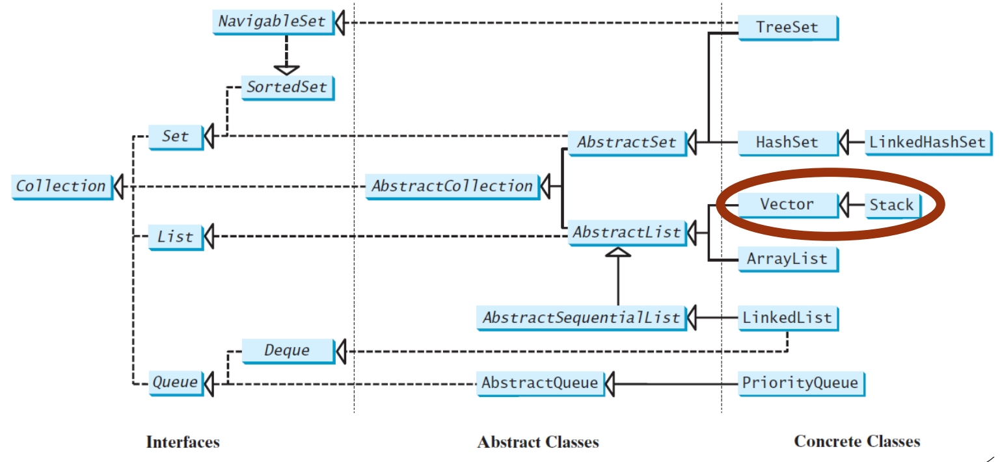

### Vector

- **Vector** is the same as **ArrayList**, except that it contains **synchronized** methods for accessing and modifying the vector

  Vector 本身和 ArrayList 很类似，但是Vector 额外使用了 **synchronized** 关键字，从而能够实现现成安全，满足多线程操作

  - **Synchronized methods** can prevent data corruption when a vector is accessed and modified by two or more threads concurrently

    同步方法可以**防止两个或多个线程同时访问和修改向量时数据损坏**

    - None of the classes discussed until now are synchronized

      到目前为止讨论的所有类都没有synchronized；主要的synchronized 类包含 Vector 和 HashTable

  - For many applications that do not require synchronization, using **ArrayList** is more efficient than using **Vector**

    对于许多**不需要同步**的应用程序，使用 **ArrayList 比使用 Vector 更有效** 

- Method retained from Java 2:

  Java 2 中保留的方法：

  - **addElement(Object element)** is the same as the **add(Object element)** method, except that the **addElement** method is synchronized

    addElement（Object element） 与 add（Object element） 方法相同，只是 **addElement 方法是同步的**

Java 中 Vector 的数据结构

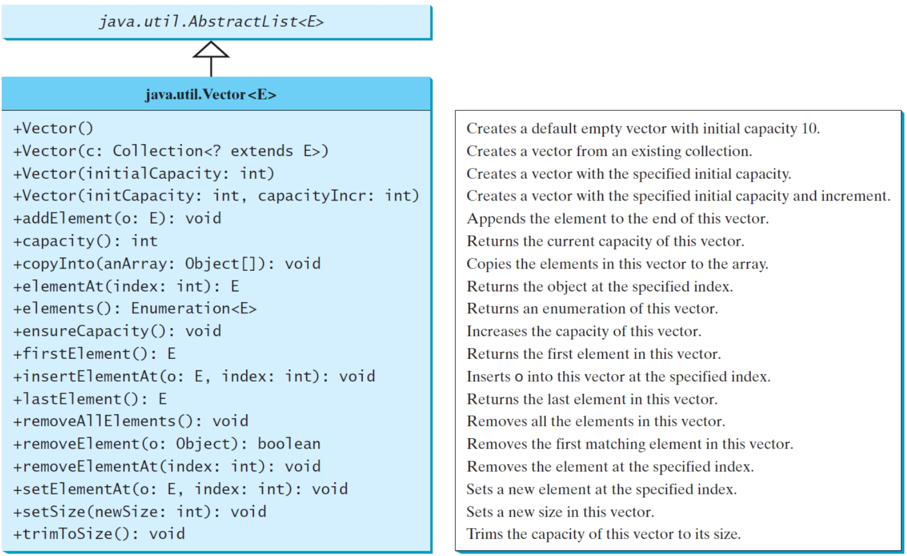

### Stack

- The **Stack** class represents a **last-in-first-out** stack of objects

  Stack 类表示对象的 **后进先出** 堆栈

  - The elements are accessed only from the **top of the stack**

    这些元素只能从**堆栈**的顶部访问

    - You can insert with **push(o:E)**, retrieve with **peek()** and remove with **pop()** (all from the top of the stack)

      您可以使用 **push（o：E）** 插入，使用 **peek（）** 进行检索，使用 **pop（）** 删除（全部从堆栈顶部开始）

  - **Stack** is implemented as an extension of **Vector**

    **Stack 作为 Vector 的扩展实现**

    - Method retained from Java 2:

      Java 2 中保留的方法

      - **empty()** method is the same as **isEmpty()**

        empty（） 方法与 isEmpty（） 相同

Java 中 Stack的数据结构

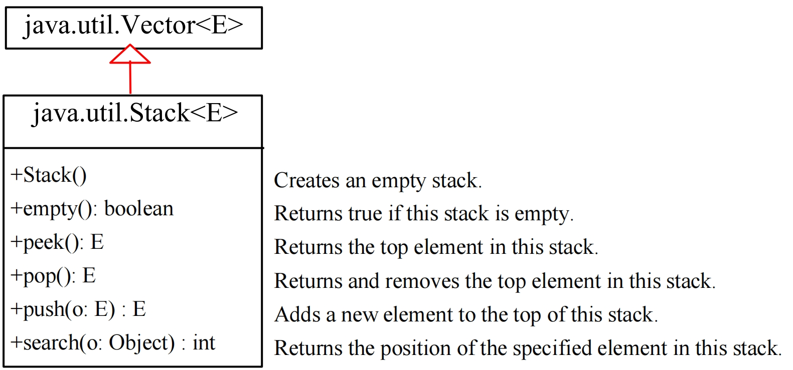

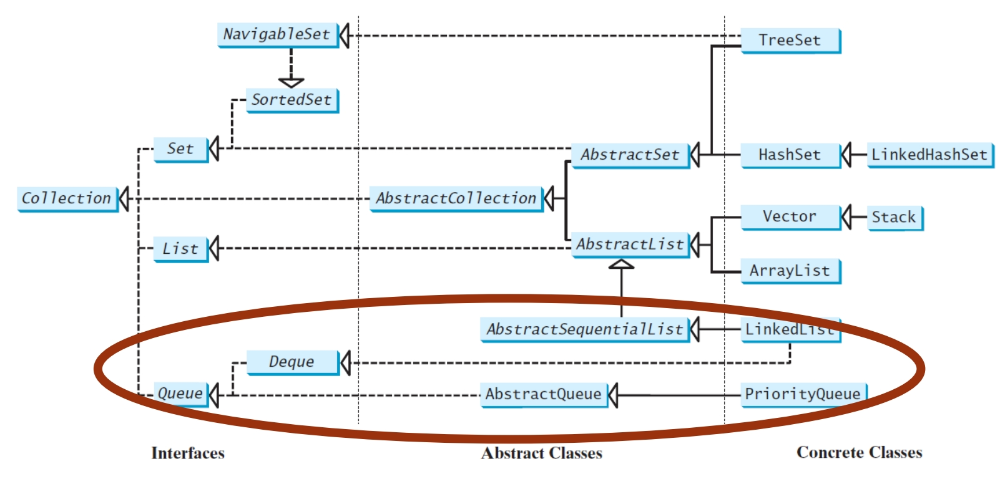

## Queue and Priority Queue

- A **queue** is a **first-in/first-out** data structure:

  队列 是一种 **先进先出** 数据结构：

  - Elements are appended to the end of the queue and are removed from the beginning of the queue

    **元素将附加到队列的末尾，并从队列的开头删除**

    - The **offer(o:E)** method is used to add an element to the queue

      该方法 **offer（o：E）** 用于将元素添加到队列中

      - This method is similar to the **add** method in the **Collection** interface, but the **offer** method is preferred for queues

        此方法类似于 **Collection** 接口中的 **add** 方法，但 **offer 方法更适合队列**
      
      - **add()** 方法失败会抛出 **IllegalStateException** 的异常，而 **offer()** 则返回 false

  - The **poll** and **remove** methods are similar, except that **poll()** returns **null** if the queue is empty, whereas **remove()** throws an exception

    **poll 和 remove 方法类似**，不同之处在于 **poll() 如果队列为空，则返回 null，而 remov() 会引发异常 NoSuchElementException** 

  - The **peek** and **element** methods are similar, except that **peek()** returns **null** if the queue is empty, whereas **element()** throws an exception

    **peek 和 element 方法类似**，不同之处在于 **peek() 如果队列为空，则返回 null，而 element() 会引发异常 NoSuchElementExceptiion**

- In a **priority queue**, elements are assigned **priorities** 

  在 priority queue 中，元素被分配**优先级**

  - When accessing elements, the element with the highest priority is removed first

    访问元素时，**首先删除优先级最高的元素**

**Queue** interface extends **java.util.Collection** with additional insertion, extraction, and inspection operations

**队列接口通过额外的插入、提取和检查作扩展了 java.util.Collection**

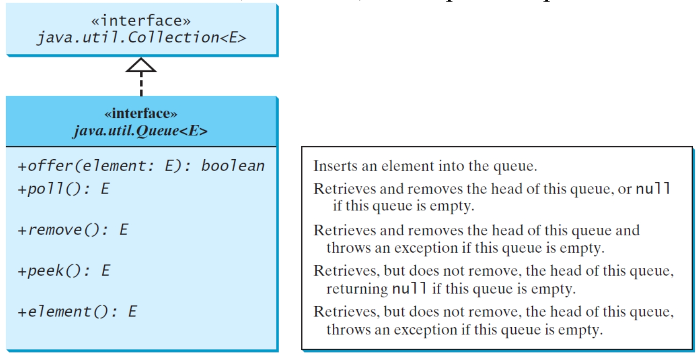

The **LinkedList** class implements the **Deque** interface, which extends the **Queue** interface

**LinkedList 类实现了 Deque 接口，该接口扩展了 Queue 接口**

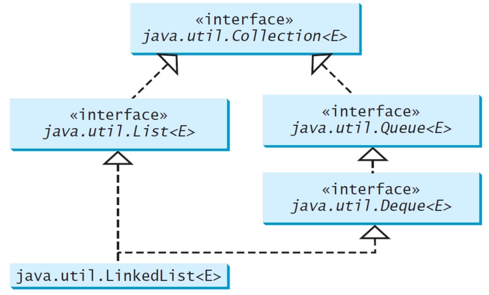

### Queue

- **Deque** interface supports element insertion and removal at both ends

  **Deque** 接口支持两端的元素插入和移除

  - The name deque is short for “double-ended queue”

    名称 deque 是 “double-ended queue” 的缩写

- The **Deque** interface extends **Queue** with additional methods for inserting and removing elements from both ends of the queue

  **Deque 接口扩展了 Queue，增加了从队列两端插入和删除元素的方法**

- The methods include:

  - **addFirst(e)**
  - **removeFirst()**
  - **addLast(e)**
  - **removeLast()**
  - **getFirst()**
  - **getLast()**

```java
java.util.Queue<String> queue = new java.util.LinkedList<>();
queue.offer("Oklahoma");
queue.offer("Indiana");
queue.offer("Georgia");
queue.offer("Texas");
while (queue.size() > 0)
	System.out.print(queue.remove() + " ");

// Oklahoma Indiana Georgia Texas
```

**LinkedList** is the concrete class for queue and it supports inserting and removing elements from both ends of a list

**LinkedList 是 queue 的具体类**，它支持在 list 的两端插入和删除元素

### Priority Queue 优先级队列

- **java.util.PriorityQueue<T>**

  - By default, the priority queue orders its elements according to their natural ordering using **Comparable**

    默认情况下，优先级队列使用 **Comparable** 根据其**自然顺序**对其元素进行排序

  - The element with the **least value** is assigned the **highest priority** and thus is removed from the queue first

    具有 **最小值** 的元素被分配 **最高优先级**，因此首先从队列中删除

  - If there are several elements with the same highest priority, the tie is broken arbitrarily

    如果有多个元素具有相同的最高优先级，则断开任意的连接

  - You can also specify an ordering using **Comparator** in the constructor

    您还可以在构造函数中**使用 Comparator 指定顺序**

> **PriorityQueue(initialCapacity,comparator)**

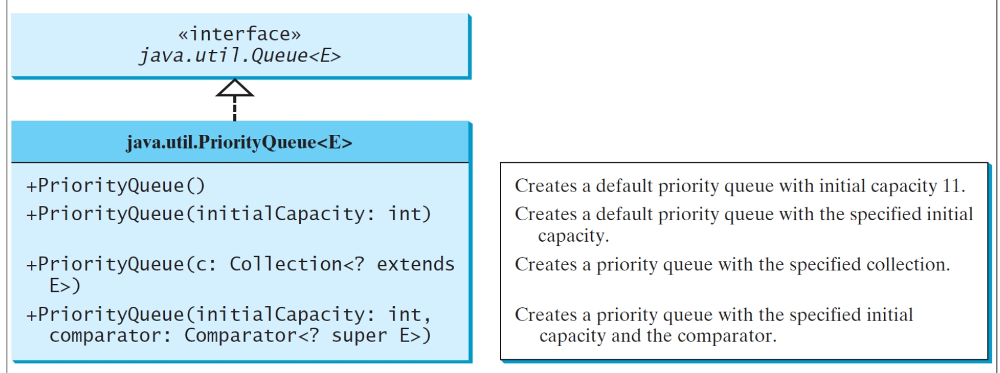

如果对比的对象是字符串的话，那么默认就是对比开头字母的顺序，字母（数字）越靠前具有的优先级越高

```java
import java.util.*;
public class PriorityQueueDemo {
    // 由于插入的是优先级队列，因此不会完全按照插入的顺序来决定元素所存储的顺序
    public static void main(String[] args) {
        // 正向优先级列表，从最高的优先级开始
        PriorityQueue<String> queue1 = new PriorityQueue<>();
        queue1.offer("Oklahoma");
        queue1.offer("Indiana");
        queue1.offer("Georgia");
        queue1.offer("Texas");
        System.out.println("Priority queue using Comparable:");
        
        while (queue1.size() > 0) {
        	System.out.print(queue1.remove() + " ");
        } // Georgia Indiana Oklahoma Texas 
        
        // 反向优先级列表，从最低优先级开始
        PriorityQueue<String> queue2 = new PriorityQueue<>(4,Collections.reverseOrder());
        queue2.offer("Oklahoma");
        queue2.offer("Indiana");
        queue2.offer("Georgia");
        queue2.offer("Texas");
        System.out.println("\nPriority queue using Comparator:");
        while (queue2.size() > 0) {
            System.out.print(queue2.remove() + " ");
        } // Texas Oklahoma Indiana Georgia
    }
}
```

