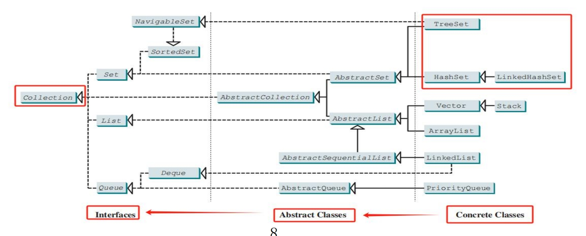
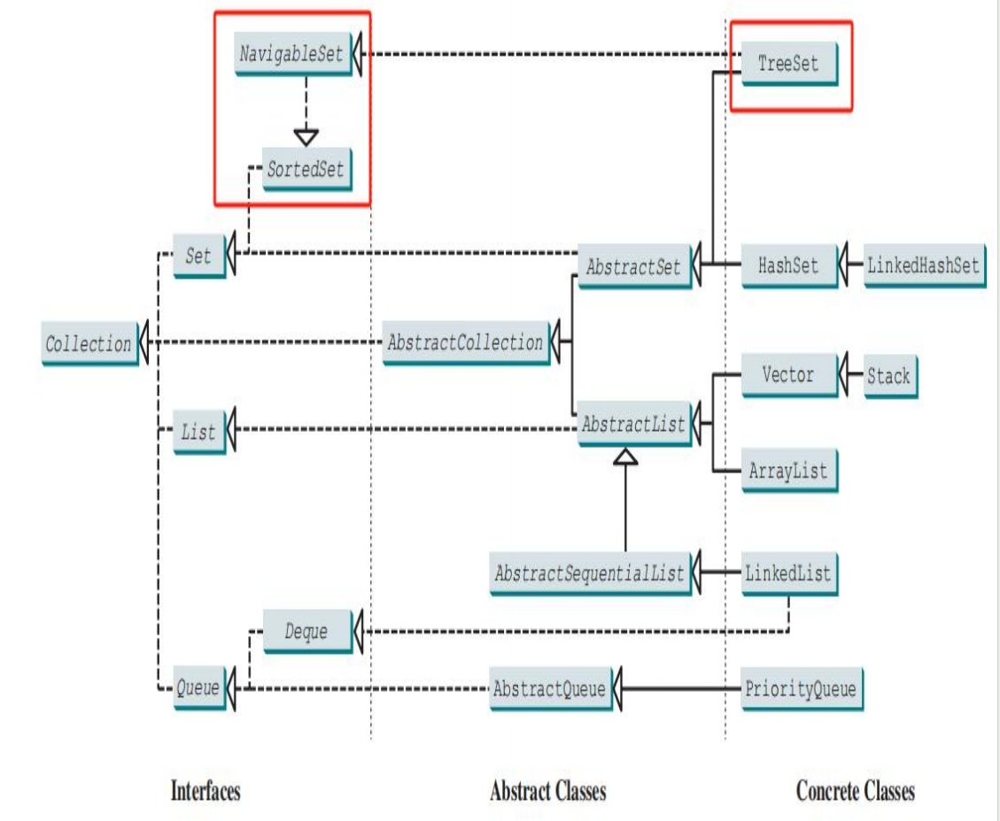
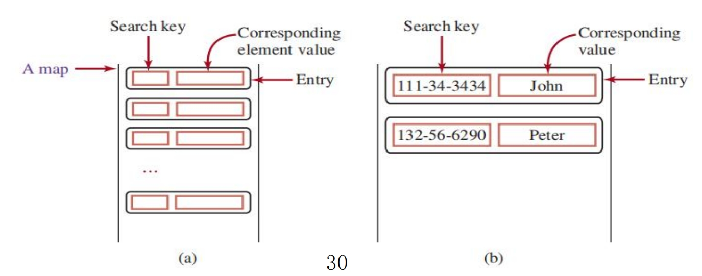
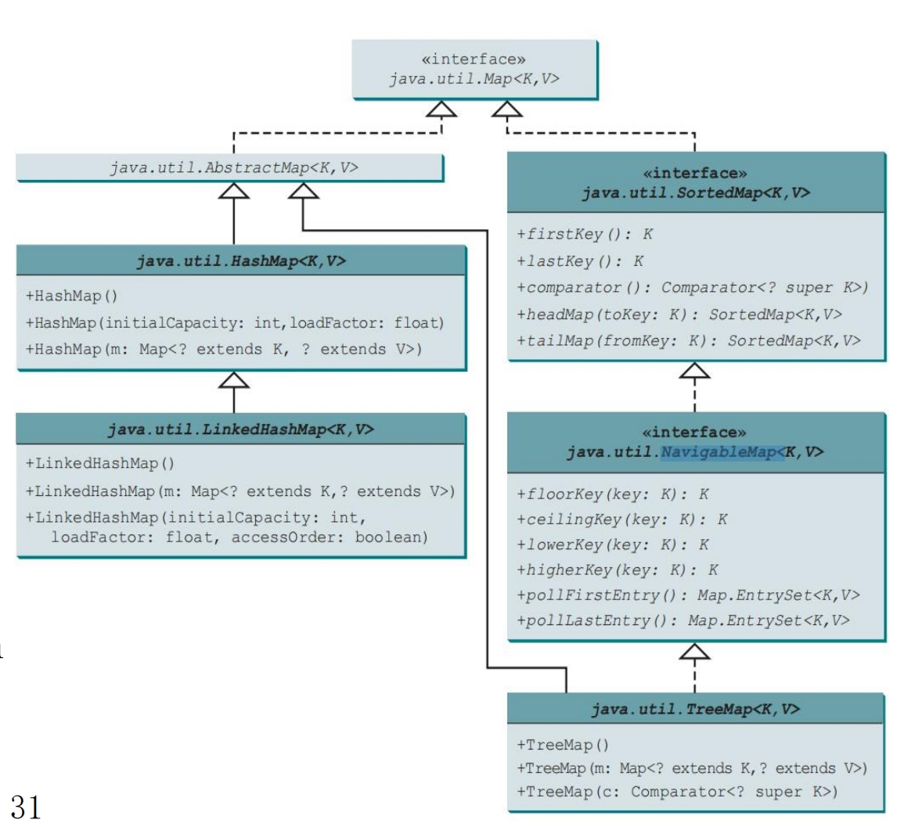

# Set and Map

## Set

### The Basic Information

- **Set interface** is a sub-interface of **Collection**

  Set 是 Collection 接口的一个**子接口**

- It extends the **Collections,** but does not introduce new methods or constants. 

  Set 拓展了 **Collections**，但是**没有引入新的方法或者常量**

- However, the **Set interface stipulates** that an instance of **Set contains no duplicate elements**

  但是，Set 接口规定 Set 的实例不包含重复的元素

- That is, **no two elements e1**and **e2** can be in the set such that **e1.equals(e2)** is true

  也就是说，集合中不能有 e1和 e2 两个元素完全相等， 也就 **e1.equals(e2)** 需要输出为 false

- You can create a set using one of its three concrete classes: **HashSet**, **LinkedHashSet**, or **TreeSet**

  您可以使用其三个具体类之一创建集合：**HashSet**、**LinkedHashSet** 或 **TreeSet**

- The concrete classes that implement Set must ensure that **no duplicate elements** can be added to the set

  实现 Set 的具体类必须确保 **没有重复的元素** 可以添加到 Set 中

- HashSet & LinkedHashSet use: **hashcode()** + **equals()** 

  - 步骤 1：计算哈希值（hashCode）
    当向 HashSet 中添加一个元素时，HashSet 首先会调用该元素的 hashCode() 方法，计算出一个哈希值（整数）。这个**哈希值决定了元素在哈希表中的存储位置**（即桶的位置）。

  - 步骤 2：定位桶
    根据计算出的哈希值，HashSet 会定位到哈希表中对应的桶（Bucket）。哈希表本质上是一个数组，每个数组元素是一个链表或红黑树（Java 8 之后，当链表长度超过一定阈值（>8 && HashSet.length ≥ 64）时会转换为红黑树，否则扩容）。

  - 步骤 3：检查重复
    在定位到的桶中，HashSet 会遍历该桶中的所有元素，依次调用 equals() 方法，将新元素与当前桶中的每个元素进行比较：
    - 如果发现某个元素与新元素 equals() 返回 true，则认为新元素是重复的，不会将其添加到集合中。
    
    - 如果没有找到重复元素，则将新元素添加到桶中。
  
- HashSet 实际上是基于 HashMap 实现的，实际上 HashSet 存放的值就相当于 HashMap 中的键，然后给每一个键都使用 new Value() 来填充对应的值。

- TreeSet use: **compareTo()** or **Comparable**

  TreeSet 使用 comparaTo 或者 Comparable

### HashSet 

#### 创建 HashSet

The **HashSet class** is a concrete class that implements **Set**

HashSet 是 Set 的实例类

1. You can **create an empty hash set using its no-arg constructor**

   可以创建一个空的 HashSet 通过**无参构造器**

   > HashSet<Integer> hashset = new HashSet<>();

   - The **first diamond operation** ("<>") is called a type parameter or generic type. It specifies the type of elements that the HashSet will store. In this case, the HashSet is specified to store objects of type Integer. 

     第一个菱形（“<>”）称为类型参数或泛型类型。它指定了 HashSet 将存储的元素类型。在这种情况下，指定 HashSet 来存储 Integer 类型的对象。

   - In the **2nd diamond operation** ("<>"),the compiler infers the generic type from the context, which is typically the same as the type specified in the first diamond operator (Just in simple cases)

     在第 2 个菱形 （“<>”） 中，编译器从上下文中推断泛型类型，该类型通常与第一个 diamond 运算符中指定的类型相同（仅在简单情况下）

   - **The parentheses**("()") is used for calling the constructor of the HashSet class. In this case, it is calling the no- argument constructor of the HashSet class, which creates an empty set.

     括号（“()”） 用于调用 HashSet 类的构造函数。在本例中，它调用 HashSet 类的无参构造器，该构造函数将创建一个空集。

2. You can create a hash set from an existing collection

   > List<String> list = Arrays.asList("Apple");
   >
   > HashSet<String> hashSet = new HashSet<>(list);

   - We have a List of strings

     可以直接通过传入一个 List 给 HashSet 来赋值

   - <String>, because of the list type

     要存储的数据类型

   - <> ,still same as the pre-specified type above

     第二个尖括号和前面的尖括号内的值默认是相同的

   - the list (Not List), will be passed to the **parentheses**

     列表（非列表），将被传递到  **括号** 

3. and 4. You can create an empty HashSet with the specified initial capacity only (case 3) or **initial capacity** plus **loadFactor** (case 4)

   可以手动定义 HashSet 的容量和扩容因子

   > int initialCapacity = 16;
   >
   > float loadFactor = 0.75f;
   >
   > HashSet<String> hashSet1 = new HashSet<>(initialCapacity);
   >
   > HashSet<String> hashSet2 = new HashSet<>(initialCapacity, loadFactor);

   - By **default**, the initial capacity is **16** and the load factor is **0.75**

     HashSet 的初始默认长度是 **16**， 然后扩容因子是 **0.75**

   - Loadfactor ranges from 0.0 to 1.0, measuring how full the set is allowed to be before its capacity is increased (doubled; x2)

     负载因子可以从 0 ~ 1 之间选择，然后当数据容量到达负载因子的标准时，会将当前的容量 * 2

   - E.g., the capacity is **16**and load factor is **0.75**, when the size reaches **12**(**16\*0.75 = 12**) the capacity will be doubled to **32 (16x2)**

     例如，容量为 16，负载系数为 0.75，当大小达到 12（16\*0.75 = 12） 时，容量将翻倍至 32 （16x2）

#### HashSet的方法



The interfaces(e.g., Collection) and abstract classes(e.g., AbstractSet) will be implemented/extended by the concrete classes(i.e., HashSet, LinkedHashSet, TreeSet). So, all the declared methods(e.g., add(), remove(), etc) can be called in a set instance.

接口（例如 Collection）和抽象类（例如 AbstractSet）将由具体类（即 HashSet、LinkedHashSet、TreeSet）实现/扩展。因此，所有声明的方法（例如 add（）、remove（） 等）都可以在 set 实例中调用。

##### add()

```java
HashSet<String> set = new HashSet<>();

set.add("London");
set.add("Paris");
set.add("New York");
set.add("San Francisco");
set.add("New York");
set.add("Beijing");

System.out.println(set);

// 只会保留一个 New York
// 每次打印结果的顺序都一样，但是其最终顺序不一定会按照插入的顺序
// [San Francisco, Beijing, New York, London, Paris]
```

- Adding elements to set

  将一组元素添加到 set 中

- 如果按照上面的顺序插入这组内容到 set 中，实际上打印出来的顺序可能并不是插入的顺序 

  - 正常情况下，打印顺序可能并不等于插入顺序，但是每次打印的结果之间应该是一致的（如果哈希表的内部结构没有变化（例如没有发生扩容或重新哈希））

- A hash set is **unordered** (because of hashing, W13)

  HashSet 是**没有顺序**的，因为每个元素的索引都是通过 hashcode 方法计算的所在的桶的位置

- 如果向 HashSet 中插入的是自己定义的 Person 类，那么如果此时插入两个内容相同的 Person 类，那么应该根据是否已经重写了 Person 类中的 equals 以及 hashcode 方法来判断，不重写使用默认方法判断，也就是 equals 判断两个对象引用是否指向相同的对象，hashcode 返回两个对象的内存地址的哈希值。此时即使两个对象内容是完全相同的，也允许插入；但是如果重写了这两个方法的判断条件为内部存储的值是否完全相等，则不会添加。

```java
class Person {
    private String name;
    private int age;

    public Person(String name, int age) {
        this.name = name;
        this.age = age;
    }

    @Override
    public boolean equals(Object o) {
        if (this == o) return true;
        if (o == null || getClass() != o.getClass()) return false;
        Person person = (Person) o;
        return age == person.age && Objects.equals(name, person.name);
    }

    @Override
    public int hashCode() {
        return Objects.hash(name, age);
    }

    @Override
    public String toString() {
        return "Person{name='" + name + "', age=" + age + "}";
    }
}

public class HashSetExample {
    public static void main(String[] args) {
        HashSet<Person> set = new HashSet<>();
        Person p1 = new Person("Alice", 25);
        Person p2 = new Person("Alice", 25);

        set.add(p1);
        set.add(p2);

        System.out.println("HashSet: " + set);
    }
}

// output 
HashSet: [Person{name='Alice', age=25}]
```

#### HashSet 循环

##### 增强 for 循环

Collection interface extends the **Iterable** interface (Textbook Page 778), so the elements in a set are iterable

Collection 接口扩展了 **Iterable** 接口，因此集合中的元素是可迭代的

```java
// 增强 for 循环
for (declaration : expression) {
	// Statements
}

for (String s: set) {}
```

- **Declaration:** the part where you declare a variable that will hold an element of the array or collection you're iterating over

  声明： 声明一个变量的部分，该变量将保存你正在迭代的数组或集合的元素

- **Expression:** the collection or array you want to iterate over; the target

  表达式： 你想要迭代的集合或数组; 被迭代的目标

- Enhanced for loop is used because a hash set is unordered without index (No [i])

  使用增强的for循环，因为散列集是无序的，没有索引（No [i]）；换句话说，Set 和 Map 都不可以使用 for i 循环

##### forEach

**A default method in the Iterable interface**

**Lambda 表达式**

```java
HashSet<String> hashset = new HashSet<>();
set.forEach(e -> System.out.print())
```

- **e** is the parameter passed to the lambda expression. It represents the current element of the set

  e 是传递给 Lambda 表达式的参数。它表示集合的当前元素

- **->** is the lambda arrow which separates the parameters of the lambda expression from its body

  -> 是将 lambda 表达式的参数与其主体分开的 lambda 箭头

#### 其他常见方法

```java
// remove: Delete a String from set1
// 移除 set 中指定的一个元素
set1.remove("London");
System.out.println("\nest1 is " + set1);

// size():the size of the set
// 返回 set 的大小
System.out.println(set1.size() + " element in set1");

// contains(): if the set contains a certain element, return T/F
// 判断一个 set 中是否包含某个元素
System.out.println("\nIs Taipei in set2? " + set2.contains("Taipei"));

// (!) addAll(): add the elements in set1 and set2 together. NO Duplication!
// 将 set1 和 set2 中所有的元素合并在一起，但是前提是要避免重复
// hashcode() and equals() are called
set1.addAll(set2);
System.out.println("\nAfter adding set2 to set1, set1 is " + set1);

// removeAll():  removing the elements in set 2 from set1
// 从 set1 中删除所有 set2 中包含的内容
set1.removeAll(set2);
System.out.println("After removing set2 from set1, set1 is " + set1);

// (?) retainAll(): What is the printed result in this case?
// 保留 set1 和 set2 中的公共元素
set1.retainALl(set2);
System.out.println("After retaining common elements in set1 and set2, set1, is " + set1);
```

### LinkedHashSet

#### Basis

- LinkedHashSet extends HashSet with a linked list implementation that supports an ordering of the elements in the set

  LinkedHashSet 使用链表实现扩展了 HashSet，该链表实现支持对集合中的元素的插入顺序进行记忆

- Very similar to HashSet, those we have acquired previously (e.g., the set creation and the methods can be called) are applicable to LinkedHashSet

  与 HashSet 非常相似，我们之前获取的那些（例如，集合创建和方法可以调用）也适用于 LinkedHashSet

- **Significant Difference:** The elements in a LinkedHashSet can be retrieved in the order in which they were inserted into the set

  显著差异： LinkedHashSet 中的元素可以按照它们**插入到集合中的顺序**来检索。元素存放的顺序仍然类似于 HashSet 是根据哈希值来决定的，但是每个元素之间都保留了一个双向链表指针来保存插入的顺序

Example:

```java
LinkedHashSet<String> set = new LinkedHashSet<>();

set.add("London");
set.add("Paris");
set.add("New York");
set.add("San Francisco");
set.add("New York");
set.add("Beijing");

System.out.println(set);

// Output
// [London, Paris, New York, San Francisco, Beijing]
```

### TreeSet



#### Basis

- **TreeSet** is a concrete class that implements the **SortedSet** and **NavigableSet** interfaces

  TreeSet 是一个实现 **SortedSet** 和 **NavigableSet** 接口的具体类

- **SortedSet** is a sub-interface of **Set**, which guarantees that the elements in the set are sorted

  SortedSet 是 Set 的子接口，保证 Set 中的元素是有序的

- **NavigableSet** extends **SortedSet** to provide navigation methods (e.g., **lower(e)**, **floor(e)**,etc)

  NavigableSet 扩展了 SortedSet 以提供导航方法（例如，lower（e）、floor（e） 等）

####  TreeSet 创建

- Empty tree set without argument, which will be sorted in ascending order according to the **natural ordering** of its elements. (Due to the implementation of **SortedSet** interface)
  
  不带参数的空树集，将根据其元素的 **自然顺序升序** 排序。（由于 **SortedSet 接口** 被实现）
  
  - TreeSet<String> treeSet = new TreeSet<>();
  
- Tree set with other collections, being sorted by the natural ordering. 
  
  与其他集合一起的树集，按自然顺序排序。（构造器同样支持直接传入一个list来创建）
  
  - TreeSet<String> treeSet = new TreeSet<>(list)
  
- Tree set with customized comparator,where we can define the orders
  
  带有自定义比较器的树集，我们可以在其中定义排序（可以通过 reverseOrder 变成倒序）
  
  - TreeSet<String> treeSet = new TreeSet<>(Comparator.reverseOrder())
  
- Tree set with the same elements and the same ordering as the specified sorted set

  当树集与指定的排序集具有相同的元素和顺序

  ```java
  // If we already have a set sorted according to a specific rule
  // 不区分大小写
  SortedSet<String> originalSet = new TreeSet<>(String.CASE_INSENSITIVE_ORDER);
  // (这里是默认按照字典顺序（lexicographical order）来比较字符串，但是会忽略大小写)
  
  // We take this way to create another tree set with same elements and same ordering
  // 可以直接生成一个拥有相同元素和相同排序规则的新 TreeSet
  TreeSet<String> copiedSet = new TreeSet<>(originalSet)
  ```

TreeSet 的构造器：

- TreeSet();
- TreeSet(c: Collention<? extends E>)
- TreeSet(comparator: Comparator<? super E>)
- TreeSet(s: SortedSet<E>)

#### TreeSet方法

##### add

- Similar to a hash set, the duplicted elements would not be added to the tree set

  与 HashSet 类似，重复的元素不会添加到树集中

- Instead of hashcode() and equals(), this is because the “built-in” compareTo() in String and Integer and other wrapper classes in Java's standard library. 

  但不是基于 hashcode() 或者 equals() 方法，而是通过内置在 String 或者 Integer 包装类中的 **compareTo()** 方法，通过 Java 的基本库实现。

- The difference is due to the bottomed data structure, hash set -> Hashing (W13), tree set -> Tree (11&12).

  差异是由于底部数据结构、hash set -> Hashing (W13), tree set -> Tree (11&12) 造成的。

#### 其他常见方法

##### Common methods in SortedSet

- first(): return the first element in the set

  返回列表中的第一个元素

- last(): return the last element in the set

  返回集合中的最后一个元素

- headSet(): find the elements that are less than or equal to the given toElement (i.e., “New York”)

  找到集合中**小于或者等于**提供的值的元素

- tailSet(): find the elements that are equal to or bigger than the given toElement (i.e., “New York”)

  找到集合中**大于或者等于**提供的值的元素

- More intuitivelly, consider the following:

  ```java
  TreeSet<Integer> numbers = new TreeSet<>(Arrays.asList(1, 2, 3, 4, 5, 6, 7, 8, 9));
  
  SortedSet<Integer> headSet = numbers.headSet(5);
  // output: 1, 2, 3, 4, 5
  
  Sorted<Integer> tailSet = numbers.tailSet(5);
  // output: 5, 6, 7, 8, 9
  ```
  

##### Common Methods in Navigable

- **lower():** Returns the greatest element in this set strictly less than the given element (4)

  lower（）: 返回此集合中**严格小于**给定元素 （4） 的最大元素

- **higher():** Returns the least element in this set strictly greater than the given element (?)

  higher（）: 返回此集合中**严格大于**给定元素 （？） 的最小元素

- **floor():** Returns the greatest element in this set less than or equal to the given element (5)

  floor（）: 返回此集合中**小于或等于**给定元素 （5） 的最大元素

- **ceiling():** Returns the least element in this set greater than or equal to the given element (?)

  ceiling（）: 返回此集合中**大于或等于**给定元素 （？） 的最小元素

- **pollFirst():** Retrieves and removes the first (lowest) element

  pollFirst（）: 检索并**删除第一个（最低）**元素

- **pollLast():** Retrieves and removes the last (highest) element

  pollLast（）: 检索并删除**最后一个（最高）**元素

### TreeSet 与 LinkedHashSet 的区别

虽然两者都各自维护了不同的元素间顺序

#### TreeSet 排序实现

- 排序规则：

  - 默认按元素的**自然顺序**（Comparable 接口）排序。

  - 或通过构造时传入的 Comparator 自定义排序规则。

- **底层实现**：红黑树（自平衡二叉搜索树）
- **特点**：
  - 元素**始终有序**（无论是插入、删除还是遍历，都按排序规则输出）。
  - 不支持插入 null（除非 Comparator 显式处理 null）。
  - 查找、插入、删除的时间复杂度为 **O(log n)**。

#### LinkedHashSet 排序实现

- 排序规则：
  - **严格维护元素的插入顺序**（遍历时按先入先出的顺序输出）。
  - 不依赖元素的自然顺序或比较器。
- **底层实现**：哈希表（快速查找） + 双向链表（维护插入顺序）。
- **特点**：
  - 保留插入顺序，但**不主动排序**。
  - 允许插入 null。
  - 查找、插入、删除的时间复杂度为 **O(1)**（平均情况）。

## Performance of Sets and Lists

- Sets are more efficient than lists for storing **nonduplicate elements**

  Set 比 List 更有效地存储 **非重复元素**

- Lists are useful for accessing **elements through the index**

  列表对于通过 **索引访问元素** 很有用

- Sets **do not support indexing** because the elements in a set are unordered

  **集合不支持索引**，因为集合中的元素是无序的

  - To traverse all elements in a set, use a **for-each** loop or iterator

    要遍历集合中的所有元素，请使用 **for-each** 循环或迭代器

（如果移除 shuffle 会得到不同的答案）

```java
import java.util.*;

public class SetListPerformanceTest {
    static final int N = 5000;

    public static long getTestTime(Collection<Integer> c) {
        long startTime = System.currentTimeMillis();
        // Test if a number is in the collection
        for (int i = 0; i < N; i++) {
            c.contains((int) (Math.random() * 2 * N));
        }
        return System.currentTimeMillis() - startTime;
    }

    publiuc static long getRemoveTime(Collection<Integer> c) {
        long startTime = System.currentTimeMillis();

        for (int i = 0; i < N; i++) {
            c.remove(i);
        }
        return System.currentTimeMillis() - startTime();
    }

    public static void main(String[] args) {
        // add numbers 0, 1, 2, ...., N - 1 to an array list
        // to populate all data structures
        List<Integer> list = new ArrayList<>();
        for (int i = 0; i < N; i++) {
            list.add(i);
        }
        Collections.shuffle(list); // Shuffle the array list

        // Create a hash set, and test its performance
        Collection<Integer> set1 = new HashSet<>(list);
        System.out.println("Member test time for hash set is " + getTimeTestTime(set1) + " milliseconds");
        System.out.println("Remove element time for hash set is " + getRemoveTime(set1) + " milliseconds");

        // Create a linked hash set, and test its performance
        Collection<Integer> set2 = new LinkedHashSet<>(list);
        System.out.println("Memeber test time for linked hash set is " + getTestTime(set2) + " milliseconds");
        System.out.println("Remove element time for linked hash set is " + getRemoveTime(set2) + " milliseconds");

        // Create a tree set, and test its performance
        Collection<Integer> set3 = new LinkedHashSet<>(list);
        System.out.println("Memeber test time for tree set is " + getTestTime(set3) + " milliseconds");
        System.out.println("Remove element time for tree set is " + getRemoveTime(set3) + " milliseconds");

        // Create an array list, and test its performance
        Collection<Integer> list1 = new ArrayList<>(list);
        System.out.println("Memeber test time for array list is " + getTestTime(list1) + " milliseconds");
        System.out.println("Remove element time for array list is " + getRemoveTime(list1) + " milliseconds");

        // Create an linked list, and test its performance
        Collection<Integer> list2 = new LinkedList<>(list);
        System.out.println("Memeber test time for array list is " + getTestTime(list2) + " milliseconds");
        System.out.println("Remove element time for array list is " + getRemoveTime(list2) + " milliseconds");
    }
}

// Output
Member test time for hash set is 20 milliseconds
Remove element time for hash set is 27 milliseconds

Member test time for linked hash set is 27 milliseconds
Remove element time for Linked hash set is 26 milliseconds
    
Member test time for tree set is 47 milliseconds
Remove element time for tree set is 34 milliseconds

Member test time for array list is 39802 milliseconds
Remove element time for array list is 16196 milliseconds
    
Member test time for linked list is 52197 milliseconds
Remove element time for linked list is 14870 milliseconds
```

- `Collections.shuffle(list)` 会随机打乱 `list` 中的元素顺序。如果没有它，`list` 中的元素是按顺序排列的（`0, 1, 2, ..., N-1`），这会导致：
  - **`HashSet` / `LinkedHashSet` 的哈希冲突增加**（因为 `Integer.hashCode()` 直接返回整数值，连续数字会导致哈希分布不均匀）。
  - **`TreeSet` 退化成链表**（如果数据是有序的，红黑树的平衡性变差）。
  - **`ArrayList` / `LinkedList` 的 `contains()` 和 `remove()` 性能不受影响**（但 `remove()` 仍然较慢）

## Quick Summary

HashSet, LinkedHashSet, and TreeSet are all implementations of the Set interface in Java, which means they all share the fundamental characteristic of **not allowing duplicate elements**. 

HashSet、LinkedHashSet 和 TreeSet 都是 Java 中 Set 接口的实现，这意味着它们都具有 **不允许重复元素** 的基本特征。

- **HashSet:**

  - Ordering: It does not guarantee any order of iteration. 

    排序：不保证任何迭代顺序。

  - Internal Structure: Backed by a **hash table**. 

    内部结构：由 **哈希表** 支持。

- **LinkedHashSet:**

  - Ordering: Maintains a doubly-linked list running through all its entries, which defines the iteration ordering, which is normally the order in which elements were inserted into the set (insertion-order). 

    排序：维护一个贯穿其所有元素的**双向链表**，该列表定义迭代顺序，这通常是将 **元素插入到集合中的顺序** （insertion-order）。

  - Internal Structure: Backed by a **hash table** with a **linked list** running through it

    内部结构：由 **哈希表** 支持，其中有一个**链表**

- **TreeSet:**

  - Ordering: Guarantees that elements will be sorted in ascending element order, according to the natural ordering of the elements, or by a Comparator provided at set creation time. 

    排序：保证元素将根据元素的 **自然顺序的升序排列** 或由在设置创建时提供的 **Comparator** 。
  
  - Internal Structure: Backed by a tree
  
    内部结构：**树形结构**

## Map

- A **map** is a container object that stores a collection of key/value pairs. 

  map 是一个容器对象，用于存储 **键/值对** 的集合。

- It enables fast retrieval, deletion, and updating of the pair through the key. A map stores the values along with the keys. 

  它支持**通过 key 快速检索**、删除和更新 value。映射将**值与键**一起存储在 hashcode 计算之后对应的桶中。

- In List, the indexes are integers. In Map, the keys can be **any objects**. 

  在 List 中，索引是整数。在 Map 中，键可以是任何对象。

  - A map cannot contain duplicate keys. 
  
    映射不能包含重复的键。
  
  - Each key maps to one value.
  
    每个键映射到一个值。



### Three Types

There are three types of maps: **HashMap**, **LinkedHashMap**, and **TreeMap**. 

有三种类型的映射：**HashMap**、**LinkedHashMap** 和 **TreeMap**。

- Still, they ensure the map instances **non-duplicated** using hashcode() and equals() (for HashMap and LinkedHashMap) as well asthe compareTo()/Comparator (for TreeMap). 

  尽管如此，他们使用 **hashcode（**） 和 **equals（）**（用于 HashMap 和 LinkedHashMap）以及 compareTo（）/ Comparator（用于 TreeMap）来确保映射实例 **不重复**。

- The HashMap, LinkedHashMap, and TreeMap classes are three concrete implementations of the Map interface, with TreeMap additionally implements SortedMap and NavigableMap

  HashMap、LinkedHashMap 和 TreeMap 类是 Map 接口的三个具体实现，其中 TreeMap 还实现了 SortedMap 和 NavigableMap



### Map创建

- We can create new hash/linked hash/tree maps with arguement (m: Map<? extends K,? extends V>)

  我们可以使用参数创建新的 HashMap/LinkedHashMap/TreeMap 来映射。需要**分别定义键和值的类型** 

  - > m： Map<？ extends K，？ extends V>

- It indicates that the constructor accepts a Map <X, Y> (i.e.,**smallMap**) where X is a subclass of K, and Y is a subclass of V (See figure). 

  上面表达式代表构造函数接受 Map<X, Y> （即 **smallMap**），其中 X 是 K 的子类，Y 是 V 的子类。

- It would also work when X is exactly K, and Y is exactly V

  当 X 正好是 K，而 Y 正好是 V 时，它也会成功创建

  - > Map<Integer, String> smallMap = new HashMap<>();

  - > Map<Integer, String> largerMap = new HashMap<>(smallMap);

  - 必须注意，在将一个 map 传给另一个 map 的时候，新的 map 的键和值如果是旧的 map 的键和值的**父类**，那么也可以正常创建

    ```java
    Public static void main(String[] args) {
        // Create a map with Integer keys and String values
        Map<Integer, String> smallMap = new HashMap<>();
        smallMap.put(10, "Ten");
        smallMap.put(20, "Twenty");
        
        // Crate a new HashMap using the constructor that accepts another map
        // In this case, smallMap's keys and values are instances of Number and Object
        // 这里新的 Map 的键值就是旧的 Map 的父类
        // ArrayList<Number> largeList = new ArrayList<>(new ArrayList<Integer>()); 也可以
        Map<Number, Object> largerMap = new HashMap<>(smallMap);
        
        System.out.println("Contents of largerMap: " + largerMap);
    }
    
    //output
    Contents of largerMap: {20=Twenty, 10=Ten};'
    ```

- Usually, and similar to LinkedHashSet, LinkedHashMap extends HashMap with a linked-list implementation that supports retrieving elements in the **insertion order**. 

  通常，与 LinkedHashSet 类似，LinkedHashMap 使用支持按元素插入顺序检索元素的链表实现来扩展 HashMap。

- In LinkedHashMap, there is a constructor argument (initialCapacity: int, loadFactor: float, accessOrder: boolean)

  在 LinkedHashMap 中，有一个**构造函数参数 （initialCapacity： int， loadFactor： float， accessOrder： boolean）**

- Once it is set to be LinkedHashMap(initialCapacity, loadFactor, **true**), the created LinkedHashMap would allow us to retrieve elements in the order in which they were last accessed, from least recently to most recently accessed (**access order**)

  一旦它被设置为 LinkedHashMap（initialCapacity， loadFactor， true），创建的 LinkedHashMap 将允许我们按照元素上次访问的顺序检索元素，**从最久访问到最近访问（访问顺序）**

  - ```java
    Public static void main(String[] args) {
        // Create a LinkedHashMap
        Map<String, Integer> linkedHashMap = new LinkedHashMap<>(16, 0.76f, true)
        linkedHashMap.put("Smith", 30);
        linkedHashMap.put("Anderson", 31);
        linkedHashMap.put("Lewis", 29);
        linkedHashMap.put("Cook", 29);
        
        // Display the map before any element is accessed
        // 在任何访问之前先打印结果
        System.out.println("\nDisplay before any access");
        System.out.println(linkedHashMap);
        // Access Lewis to get his Age
        System.out.println("\nThe age for Lewis is " + linkedHashMap.get("Lewis"));
        
        // Display the map after an elementr is accessed
        System.out.println("After an element is accessed the entries in LinkedHashMap are\n\n");
        System.out.println(linkedHashMap);   
        
        // Display each entry with name and age
        System.out.prinbtln("\nNames and ages are ");
        linkedHashMap.forEach((name, age) -> System.out.println(name + ": " + age))
    
    }
    
    // Output
    Display before any access
    {Smith = 30, Anderson = 31, Lewis = 29, Cook = 29}
    
    The age for Lewis is 29
        
    After an element is accesed the entries in linkedHashMap are
    // 根据最新访问的顺序进行排序
    {Smith = 30, Anderson = 31, Cook = 29, Lewis = 29}
    ```

### Map方法

- **A hash map** is unordered, similar to a hash set

  哈希映射 是无序的，类似于哈希集

- **A tree map** is ordered by the keys of the involved elements (alphabetically in this case)

  树状图 按所涉及元素的键排序（在本例中为字母顺序）

- **A linked hash map** can be ordered by the insertion order, and by the access order (accessOrder: True)

  链接的哈希映射可以按广告顺序和访问顺序 （accessOrder： True） 排序

- **get():** Returns the value to which the specified key is mapped

  get（）: 返回指定键映射到的值

- **forEach():**Performs the given action for each entry in this map until all entries have been processed or the action throws an exception.  

  forEach（）： 对映射中的每个条目执行给定的操作，直到所有条目都被处理完或者操作抛出异常。

  >  void forEach(BiConsumer<? super K, ? super V> action)

  - return nothing (void), just perform the action

  - K is the map’s key, V is the map’s value

  - Basically, forEach( (key,value) -> action )

HashMap Methods:

- containsKey(key)
- containsValue(value)
- Set<Map.Entry<String, Integer>> entries = hashMap.entrySet();

TreeSet Methods:

- firstKey()
- lastKey()
- headMap(toKey)
- tailMap(fromKey)
- lowerKey()
- floorKey()
- ceilingKey()
- higherKey()
- pollFirstEntry()
- pollLastEntry()

### 不同 Map 类型之间的差异

| 特性 / 类              | HashTable                           | HashMap                                           | LinkedHashMap                                     | TreeMap                                                 |
| ---------------------- | ----------------------------------- | ------------------------------------------------- | ------------------------------------------------- | ------------------------------------------------------- |
| 底层数据结构           | 数据 + ；链表 （哈希表）            | 数据 + 链表/红黑树（哈希表）                      | 数组 + 链表 + 双向链表 （哈希表）                 | 红黑树 (平衡二叉搜索树)                                 |
| 同步性                 | 线程安全 (synchronized)             | 非线程安全(Non-synchronized)                      | 非线程安全(Non-synchronized)                      | 非线程安全(Non-synchronized)                            |
| 键 / 值是否允许为 null | 键和值都不允许为 null               | 键和值都允许为 null （但是键里只能包含一个 null） | 键和值都允许为 null （但是键里只能包含一个 null） | 键不允许为 null，值允许为 null                          |
| 键的顺序               | 无序                                | 无序（遍历顺序不确定）                            | 保持插入顺序 或 访问顺序                          | 键的自然顺序 或 自定义比较器顺序                        |
| 迭代器失效             | 否（迭代器是 fail-fast）            | 是 (迭代器是 fail-fast)                           | 是 (迭代器是 fail-fast)                           | 是 (迭代器是 fail-fast)                                 |
| 继承关系               | extends Dictionary, implements  Map | extends AbstractMap, implements Map               | extends HashMap, implements Map                   | extends AbstractMap, implements SortedMap, NavigableMap |
| 首次出现版本           | Java1.0                             | Java1.2                                           | Java1.4                                           | Java1.2                                                 |


