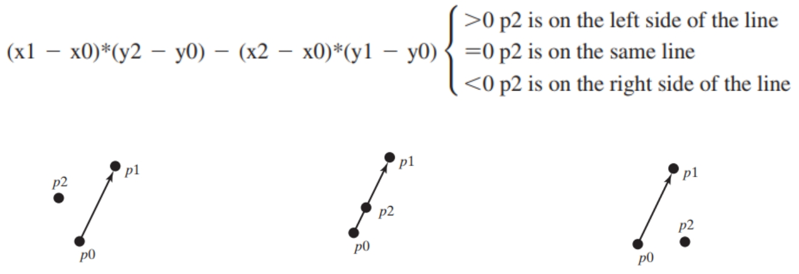

# 8 Developing Efficiency Algorithm

## Algorithms 算法

- An **algorithm** is a finite sequence of well-defined, computer-implementable instructions, typically to solve a class of problems or to perform a computation.

  **算法** 是定义明确、计算机可实现的指令的有限序列，通常用于解决一类问题或执行计算。

- **Algorithm analysis** is the process of finding the **computational complexity** of algorithms, that is: the execution time and the storage growth rate, or other resources needed to execute them.

   **算法分析**  是寻找算法的  **计算复杂度**  的过程，即：算法的执行时间和存储增长率，或者执行算法所需的其他资源。

- **Algorithm design** is the process of developing an algorithm for solving a problem.

  **算法设计** 是为解决一个问题而开发算法的过程。

### Execution Time 执行时间

除了直接使用 JAVA 虚拟机运行程序然后记录时间之外，还可以根据输入的数据量大小或者并发/并行的程度来推断。然而在这种情况下，准确地判断详细的执行时间不太现实。

#### Measuring Algorithms Using **Big-O Notation**

To overcome this problem, a "**theoretical" approach** was developed to analyze algorithms **independent** of specific inputs and computers (i.e., system load or hardware: CPU speed, memory, multiple cores, etc.)

为了克服这个问题，开发了一种 **“理论性”方法** 来分析算法，这种分析将特定输入作为 **独立** 项，与计算机（即系统负载或硬件：CPU速度、内存、多核等）无关。

- This approach approximates **the effect of a change on the size of the input** in the execution time, i.e., the **Growth Rate**

  这种方法近似计算了输入大小的变化对执行时间的影响，即 **增长率**。

  - How fast an algorithm’s execution time increases as the **input size increase**,  so we can compare two algorithms by **examining their growth rates on any inputs or computers**

    算法的执行时间随 **输入规模的增加** 而增长的速度有多快，因此我们可以通过 **检查它们在任何输入或计算机上的增长率** 来比较两个算法。

## Big-O Notation 大O表示法

Consider the linear search for an input array of **size n**:

考虑对大小为 n 的输入数组的线性搜索：

```java
// 线性搜索
public static int linearSearch(int[] list, int key) {
    for (int i = 0; i < list.length; i++)
    	if (key == list[i])
    		return i;
    return -1;
}
```

- Linear search for an array of size **n**:

  在一个长度为 **n** 的数组上进行线性搜索

  - The linear search algorithm compares the **key** with the **elements** in the array **sequentially** until the **key** is found or the array is exhausted.

    线性搜索算法将 **搜索值** 与数组中的 **元素** 按 **顺序** 进行比较，直到找到 **搜索值** 或者遍历完整个数组。

    - If the **key is not in the array**, it requires **n** comparisons

      如果搜索值 **不在数组中**，那么需要**n次**对比

    - If the **key is in the array**, it requires "**on average" n/2** comparisons

      如果搜索键 **在数组中**，**“平均”需要 n/2** 次比较 。

  - The algorithm’s execution time is **proportional** to the size of the array:

    算法的执行时间与数组的大小成**正比例关系**：

    - If you double the size of the array **2*n**, you will expect the number of comparisons to double.

      如果将数组的大小**加倍 2*n**，则预期比较次数也将加倍

      - If the key is not in the array, it requires **2*n** comparisons.
      
        如果键 **不在数组中**，则需要进行 **2*n** 次比较。
      
      - If the key is in the array, it requires "**on average" 2*n/2=n** comparisons
      
        如果键 **在数组中**，则需要**“ 平均”2*n/2=n** 次比较

- This algorithm **grows** at a **linear** rate

  这个算法以**线性速率**增长

  - The growth rate has **an order of magnitude** **growth rate** of **n**

    增长率为 **n 个 数量级** 增长率

  - Computer scientists use the **Big O** notation to abbreviate for “**order of magnitude**”

    Big-O 用来表示 **数量级**
  
  - Using this notation, the complexity of the linear search algorithm is **O(n)**, pronounced as “order of **n**” - (also called "**linear**" time)
  
    使用这个符号，线性搜索算法的复杂度是 **O（n）**，读作 **“order of n”**（也称为“linear”时间）

### Best, Worst, and Average Cases 最好、最差、平均情况

- For the same input size, an algorithm’s execution time may vary, depending on the input:

  对于相同的输入规模，算法的执行时间也许会变化

  - An input that results in the **shortest execution time** is called the **best-case input**

    导致  **最短执行时间**  的输入称为  最佳情况输入 

  - An input that results in the **longest execution time** is called the **worst-case input**

    导致 **最长执行时间** 的输入称为最坏情况输入

- Best-case and worst-case are not representative, but worst-case analysis is very useful

  最好情况和最坏情况不具有代表性，但**最坏情况对分析非常有用**

  - Because <u>the algorithm will **never be slower** than the worst-case</u>

    因为 <u>算法永远不会比最坏的情况</u> 

- An **average-case analysis** attempts to determine the average amount of time among all possible inputs of the same size

  **平均情况分析**试图确定所有可能的相同大小的输入之间的平均时间量

  - Average-case analysis is **ideal**, but difficult to perform, because it is hard to determine or estimate the relative probabilities and distributions of various input instances for many problems.

    平均情况分析是  **理想的** ，实际上很难执行，因为很难确定或估计许多问题的各种输入实例的相对概率和分布。

  - In most cases the average-case growth matches the worst-case growth rate.

    **在大多数情况下，平均增长率与最坏情况下的增长率相匹配**。

- **Worst-case analysis is easier to obtain**

   最坏情况分析更容易获得 
  
  - So, the analysis is generally conducted for the worst-case.
  
    因此，通常针对最差情况进行分析。

### Ignoring Multiplicative Constant 忽略乘法常数

- The multiplicative constants have no impact on growth rates!
  
  **乘法常数**对增长率没有影响！
  
  - The growth rate for **n/2** or **100\*n** is the same as **n**, i.e., **O(n) = O(n/2) = O(100n)**
  
    **n/2** 或 **100\*n** 的增长率与 n 相同，即，时间复杂度：**O（n）= O（n/2）**

- For example: the linear search algorithm requires **n** comparisons in the worst-case and **n/2** comparisons in the average-case.

  例如：线性搜索算法在最坏情况下需要 **n** 次比较，在平均情况下需要 **n/2** 次比较。

  - Using the **growth rate** Big **O** notation, both cases require **O(n)** time
  
    使用增长率大 O 表示法，这两种情况**都需要 O（n） 时间**
  
  - The multiplicative constant (**1/2**) can be omitted
  
    **乘法常数（1/2）可以省略**

### Ignoring Non-Dominating Terms 忽略非主导次项

- Consider the algorithm for finding the **maximum** number in an array of **n** elements

  考虑在 **n** 个元素的数组中寻找 **最大数** 的算法

  - If **n** is **2**, it takes one comparison to find the maximum number.

    如果 n 是 2，则需要一次比较才能找到最大值。

  - If **n** is **3**, it takes two comparisons to find the maximum number.

    如果 n 是 3，则需要两次比较才能找到最大值。

  - In general, it takes **n-1** times of comparisons to find maximum number in a list of **n** elements.

    所以一般来说，需要 **n-1** 次比较才能在 n 个元素的列表中找到最大数量。

- **Algorithm analysis is for large input sizes**

   算法分析适用于大输入大小 

  - If the input size is small, there is no significance to estimate an algorithm’s efficiency.

    如果输入规模很小，则估计算法的效率没有意义。

  - As **n** grows larger, the **n** part in the expression **n-1** dominates the complexity.

    随着 n 变大，表达式 n-1 中的 n 部分控制复杂度。

  - The Big **O** notation allows you to **ignore the non-dominating part** (e.g., **-1** in the expression **n-1**) and highlights the important part (e.g., **n**).

    大O表示法允许 **忽略非主导部分** （例如，表达式 n-1 中的 -1 ）并突出显示重要部分（例如，n）。

- So, the complexity of this algorithm is **O(n).**

  因此，该算法的复杂度为O（n）

### Input size and constant time 输入规模和持续时间

- The Big O notation estimates the execution time of an algorithm in relation to the input size
  
  大O表示法估计算法的执行时间与输入大小的关系
  
  - If the time is not related to the input size, the algorithm is said to take **constant time** with the notation **O(1)**:
    
    如果时间**与输入大小无关**，则该算法被称为采用  **常数时间** ，记法为 **O（1）**：
    
    - For example, retrieving an element at a given index in an array takes constant time, because **the time does not grow as the size of the array increases**
    
      例如，**在数组中检索给定索引处的元素需要恒定的时间**，因为 **时间不会随着数组大小的增加而增加** 

### Space complexity 空间复杂度

**Space complexity** measures the amount of memory space used by an algorithm 

**空间复杂度**  衡量算法使用的内存空间量

- We can also measure space complexity using the Big-O notation

  我们还可以使用Big-O符号来度量空间复杂度

- The space complexity for most algorithms presented in our lectures is **O(n)**, i.e., they exhibit linear growth rate to the input size
  
  在我们的 Lecture 中提出的大多数算法的空间复杂度是 O（n），即，它们**输入的大小呈现线性增长率**
  
  - For example, the space complexity for linear search is **O(n)** （程序中最大的数据类型是一维数组）
  
    例如，一维数组的空间复杂度是 O（n）

### Addition: Useful Mathematic Summations 有用的累加式转换

$$
1+2+3+...+(n-1)+n=\frac{n(n+1)}{2} \\ a^0+a^1+a^2+...+a^{(n-1)}+a^n=\frac{a^{(n+1)} - 1}{a-1} \\ 2^0+2^1+2^2+...+2^{(n-1)}+2^n=\frac{2^{(n+1)-1}}{2-1}
$$

### Determining Big-O 常见代码形式的大O复杂度

#### Repetition 重复循环

**Simple Loop** 简单循环

```java
for (i = 1; i <= n; i++) {
    k = k + 5;
}
```

Time complexity:

T(n) = (a constant c) * n = cn = **O(n)** ；（忽略掉其中的乘数常数 “c”）

线性算法性能：

```java
public class PerformanceTest {
    public static void main(String[] args) {
        getTime(1000000);
        getTime(10000000);
        getTime(100000000);
        getTime(1000000000);
    }
    public static void getTime(long n) {
        long startTime = System.currentTimeMillis();
        long k = 0;
        for (int i = 1; i <= n; i++) {
            k = k + 5;
        }
        long endTime = System.currentTimeMillis();
        System.out.println("Execution time for n = " + n
                + " is " + (endTime - startTime) + " milliseconds");
    }
}

/**
执行时间如下：
对于 n=1,000,000，执行时间为6毫秒。
对于 n=10,000,000，执行时间为61毫秒。
对于 n=100,000,000，执行时间为610毫秒。
对于 n=1,000,000,000，执行时间为6048毫秒。
从输出结果可以看出，执行时间与输入规模n成线性关系。具体来说：
当n增加 10 倍时，执行时间也大约增加10倍。

*/
```

**Nested Loop **嵌套循环

```java
for (i = 1; i <= n; i++) {
    for (j = 1; j <= n; j++) {
        k = k + i + j;
    }
}
```

Time complexity:

T(n) = c + 2c + 3c + ... + nc = cn(n+1)/2 = (c/2)n<sup>2</sup> = **O(n<sup>2</sup>)**；（忽略掉其中的乘数常数 “c”）

#### Sequence 根据顺序

```java
// O(n)
for (j = 1; j <= 10; j++) {
    k = k + 4;
}

// O(n^2)
for (i = 1; i <= n; i++) {
    for (j = 1; j <= 20; j++) {
        k = k + i + j;
    }
}
```

Time complexity:

T(n) = c *10 + 20 * c * n =  **O(n)**

#### Selection 选择判断

```java
if (list.contains(e)) 
    System.out.println(e);
else
    for (Object t: list) 
        System.out.println(t);
```

Time complexity:

T(n) = **test time + worst case** (if, else)

​	= O(n) + O(n)

​	= **O(n)**

## Logarithmic Time 对数时间 logn

```java
result = 1;
for (int i = 1; i <= n; i++)
	result *= a;
```

Without loss of generality, assume **n = 2<sup>k</sup> <=> k = log<sub>2</sub>n** .

> result = a * a * … * a , n times
> 	= (…((a * a) * (a * a))  * ((a * a) * (a * a)) …)

Therefore, we can improve the algorithm using the following scheme:

因此，我们可以使用以下方案改进算法：

```java
result = a;
for (int i = 1; i <= k; i++)
    result = result * result;
```

Time complexity:

T(n) = k (times) = log n = **O(log n)**

## Common Search and Sort Algorithms 常见搜索、排序算法

### Analyzing Binary Search 二分搜索 O(logn)

```java
public static int binarySearch(int[] list, int key) {
    int low = 0;
    int high = list.length - 1;
    while (high >= low) {
        int mid = (low + high) / 2;
        if (key < list[mid])
            high = mid - 1;
        else if (key == list[mid])
            return mid;
        else
            low = mid + 1;
    }
    return -1 - low;
}
```

每次对比结束之后，都只会取原数组一半长度的内容继续下一轮对比，因此，b为1/2，a为1，然后对比操作复杂度假设为 c

**T(n)** = T(n/2) + c 

​	= T(n/2<sup>2</sup> + c + c) 

​	= T(n/2<sup>k</sup>) + kc

​	= T(1) + c logn = 1 + (logn)c

​	= O(logn)

在对数时间的复杂度内，**log的底不会对对数的增长率造成明显的影响**，所以通常会被忽略掉。

随着问题规模的增长，对数时间复杂度的增长率依然很慢。就比如在上面的二分搜索中，当你讲输入的数组扩大一倍之后，实际上最多也只会多一次对比操作；如果对任何对数时间算法的输入大小进行平方，则执行时间只会增加一倍；所以 对数时间复杂度 可以被认为是 **efficiency** 的。

### Analyzing Selection Sort 选择排序 O(n<sup>2</sup>)

```java
public static void selectionSort(double[] list) {
    // 外层循环，将所有的数字循环对比一遍
    for (int i = 0; i < list.length; i++) {
        // Find the minimum in the list[i..list.length-1]
        // 找到当前外循环中最小的数字以及其下标
        double currentMin = list[i];
        int currentMinIndex = i;
        // 将找到的最小数赋值给 currentMin 以及对应的下标赋值给 currentMinIndex
        for (int j = i + 1; j < list.length; j++) {
            if (currentMin > list[j]) {
                currentMin = list[j];
                currentMinIndex = j;
            }
        }
        // Swap list[i] with list[currentMinIndex] if necessary;
        // 和当前外循环循环到的数进行对比，如果找到了更小的数则进行位置交换
        if (currentMinIndex != i) {
            list[currentMinIndex] = list[i];
            list[i] = currentMin;
        }
    }
}
```

- Selection sort finds the smallest element in the list and swaps it with the first element

  选择排序在列表中查找最小的元素，并将其与第一个元素交换

  - It then finds the smallest element remaining and swaps it with the first element in the remaining list, and so on until the remaining list contains only one element left to be sorted.

    然后，它会找到剩余的最小元素，并将其与剩余列表中的第一个元素交换，依此类推，直到剩余列表只包含一个需要排序的元素。

  - The number of comparisons is **n - 1** for the first iteration, **n - 2** for the second iteration, and so on

    第一次迭代的比较次数为 n -1，第二次迭代的比较次数为 n - 2，依此类推

  - **T(n)** denote the complexity for selection sort and **c** denote the total number of other operations such as assignments and additional comparisons in each iteration

    **T（n）** 表示选择排序的复杂程度，c 表示每次迭代中其他作（如赋值和其他比较）的总数

每次循环结束都只会剔除一个元素

T(n) = (n - 1) + c + (n - 2) + c + ... + 2 + c + 1 + c

​	= (n - 1)(n - 1+ 1)/2 = c(n - 1)

​	= n<sup>2</sup>/2 - n/2 + cn - c

​	= **O(n<sup>2</sup>)** (quadratic time 二次时间复杂度)

#### Quadratic Time 二次时间复杂度

- An algorithm with the **O(n^2)** time complexity is called a **quadratic algorithm**

  时间复杂度为 O（n^2） 的算法称为  **二次算法** 

- The quadratic algorithm grows quickly as the problem size increases

  二次型算法随着问题规模的增大而快速增长

- If you double the input size, the time for the algorithm is **quadrupled**

  如果将输入大小加倍，则算法的时间为  **四倍** 

- Algorithms with a nested loop are often quadratic

  带有嵌套循环的算法通常是二次的

### Insertion Sort 插入排序 O(n<sup>2</sup>)

最好情况：这个数组本身已经是排列好的

最坏情况：这个数组是倒序排列的

插入排序算法通过将未排序的元素重复插入排序的子列表中，直到整个列表排序完毕，对值列表进行排序。

移动的过程，需要先将移动的数存在一个临时变量中


```java
int currentElement = list[i];
int k;
for (k = i - 1; k >= 0 && list[k] > currentElement; k--) {
    list[k + 1] = list[k];
}
// Insert the current element into list[k + 1]
// 这里注意替换的是 list[k + 1]
list[k + 1] = currentElement;

// 完整写法
public class InsertionSort {
    public static void main(String[] args) {
        int size = 100000;
        int[] a = new int[size];
        randomInitiate(a);
        long startTime = System.currentTimeMillis();
        insertionSort(a);
        long endTime = System.currentTimeMillis();
        System.out.println((endTime - startTime) + "ms");
    }
    private static void randomInitiate(int[] a) {
        for (int i = 0; i < a.length; i++)
            a[i] = (int) (Math.random() * a.length);
    }
    public static void insertionSort(int[] list) {
        for (int i = 1; i < list.length; i++) {
            int currentElement = list[i];
            int k;
            for (k = i - 1; k >= 0 && list[k] > currentElement; k--)
                list[k + 1] = list[k];
            // Insert the current element into list[k + 1]
            list[k + 1] = currentElement;
        }
    }
}
```

To insert the first element, we need 1 comparison and at most 1 swap

为了插入第一个元素，我们需要1次比较和最多1次交换

To insert the last element, we need *n*−1 comparisons and at most *n*−1 swaps

要插入最后一个元素，我们需要n-1次比较和最多n−1次交换

**c** denotes the total number of other operations such as assignments and additional comparisons in each iteration

c表示每次迭代中其他操作的总数，如赋值和额外比较

T(n) = (2+c) + (2 * 2 + c) + ... + (2 * (n - 1) + c)

​	= 2(1 + 2 + 3 + ... + n - 1) + c(n - 1)

​	= 2(n-1)n/2 + cn - c = n<sup>2</sup> - n + cn - c

​	= O(n<sup>2</sup>)

## Polynomial Complexity 多项式复杂度 n<sup>k</sup>

- An algorithm is said to be of **polynomial** time if its running time is upper bounded by a polynomial expression in the size of the input for the algorithm, i.e., **T(n) = O(n**<sup>**k**</sup> **)** for some positive constant k

  一个算法被称为  **多项式**  时间，如果它的运行时间的上限是一个多项式表达式的大小输入的算法，即，**T（n）= O（n<sup>k</sup>）** 对于某个正的常数k

- The concept of polynomial time leads to several complexity classes in computational complexity theory:

  多项式时间的概念导致了计算复杂性理论中的几个复杂性类别：

  - **P** = The complexity class of decision problems that can be solved on a **deterministic** Turing machine in polynomial time.

    **P** = 决策问题的复杂度类，可以在多项式时间内在  **deterministic**  图灵机上解决。

  - **NP (nondeterministic polynomial time)** = The complexity class of decision problems that can be solved on a **non-deterministic** Turing machine in polynomial time.

    **NP（nondeterministic polynomial time，非确定性多项式时间）** = 可以在多项式时间内在  **non-deterministic**  图灵机上解决的决策问题的复杂度。

  - It means that a given solution can be **verified** in polynomial time.

    这意味着给定的解决方案可以在多项式时间内  **验证** 。

### NP-completeness

- Although a solution to an NP problem **can be verified "quickly" (in polynomial time)**, there is **no known way** **to find such a solution quickly**.

  虽然NP问题的解可以“快速”（在多项式时间内）验证，但没有已知的方法可以快速找到这样的解。

- **NP-hard** ("non-deterministic polynomial acceptable problems") = the class of problems which are at least as hard as the hardest problems in NP

  NP-hard （“非确定性多项式可接受问题”） = **至少与 NP 中最难的问题一样难的问题类别**

  - A problem is said to be **NP-hard** if everything in NP can be transformed into it in polynomial time.

    如果NP中的所有内容都可以在多项式时间内转换为问题，则该问题被称为 **NP-hard**。

  - NP-hard 不一定属于 NP

- A problem is **NP-complete** if it is both in NP and NP hard.

  一个问题是  **NP-complete**  的，如果它同时是 NP 和 NP-hard。

- P = NP 是一个没有证明的问题，通常情况下会被认为是不相等的，但是没有严谨的数学证明

**一些比较典型的 NP-complete 问题:**

- Boolean satisfiability problem (SAT)

- Knapsack problem

- Hamiltonian path problem

- Traveling salesman problem

- Graph coloring problem

- Subgraph isomorphism problem

- Subset sum problem

- Clique problem

- Vertex cover problem

- Independent set problem

- Dominating set problem

#### Boolean satisfiability problem 布尔可满足性问题

- **Boolean satisfiability problem** (SAT) (sometimes called **propositional satisfiability problem** and abbreviated **SATISFIABILITY**, **SAT** or **B-SAT**) is the problem of determining if there exists an interpretation (i.e., truth assignment) that satisfies a given Boolean formula (built from boolean variables, operators AND (conjunction, ∧), OR (disjunction, ∨), NOT (negation, ¬), and parentheses).

  **布尔满足性问题 （SAT）**（有时称为命题满足性问题，缩写为SATISFIABILITY、SAT 或 B-SAT）是确定是否存在满足给定布尔公式（由布尔变量、运算符 AND（合词，∧）、OR（析取，∨）、NOT（否定，¬）和括号构建的解释（即真值分配）的问题。

- A formula is said to be **satisfiable** if it can be made TRUE by assigning appropriate logical values (i.e. TRUE, FALSE) to its propositional variables.

  如果可以通过为其命题变量分配适当的逻辑值（即 TRUE、FALSE）来使公式为 TRUE，则称该公式为 **satisfiable**。

#### 3-satisfiability problem  满足性问题

Determine the satisfiability of a formula in conjunctive normal form where each clause is limited to at most three literals (l1 ∨ l 2 ∨ l 3 ) ∧ (l4 ∨ l 5 ∨ x6 ) ∧ ⋯ ∧ (ln−2 ∨ l n−1 ∨ l n )

确定合取范式公式的满足性，其中每个子句最多限制为三个文字

#### Knapsack decision problem 背包问题

given a set of items, each with a weight and a value, determine the number of each item to include in a collection so that the total weight is less than or equal to a given limit without exceeding a given weight.

给定一组物品，每个物品都有一个权重和一个值，确定要包含在集合中的每个物品的数量，以便总权重小于或等于给定的限制，而不会超过给定的权重。

- The optimization problem is to get the total value as large as possible

  优化问题是让总值尽可能大

#### Graph coloring problem  图着色问题

Is there an assignment of labels (traditionally called "colors") to elements of a graph subject to certain constraints?

是否有标签（传统上称为“颜色”）分配给受某些约束的图形元素？

- Its simplest form, called **vertex coloring**, asks if there is a way of coloring the vertices of a graph such that no two adjacent vertices are of the same color.

  其最简单的形式称为顶点着色，它询问是否有一种方法可以对图的顶点进行着色，使得没有两个相邻的顶点具有相同的颜色。

#### Hamiltonian path problem 哈密顿路径问题

Determining whether a Hamiltonian path (i.e., a path in an undirected or directed graph that visits **each vertex exactly once**) or a Hamiltonian cycle exists in a given graph (whether directed or undirected).

确定给定图中是否存在哈密顿路径（即**无向或有向图中访问每个顶点恰好一次的路径**）或哈密顿循环（无论是有向还是无向）。

- **Traveling salesman problem** (the decision version): Given a list of cities and the distances between each pair of cities, what is the possible route that visits each city exactly once and returns to the origin city?

  旅行推销员问题（决策版本）：给定一个城市列表和每对城市之间的距离，恰好访问每个城市一次并返回原始城市的可能路线是什么？

  - The optimization problem is to find the shortest path:

    优化问题是找到最短路径：

    - This is an optimization problem, and hence cannot be in NP.

      这是一个优化问题，因此不可能是NP问题。

## Exponential Complexity 指数复杂性 k<sup>n</sup>

#### Towers of Hanoi 汉诺塔

- There are n disks labeled 1, 2, 3,..., n, and three towers labeled A, B, and C.

  有n个磁盘标记为1，2，3，...，n，以及三个标为A、B和C的塔。

- No disk can be on top of a smaller disk at any time.

  任何时候，任何磁盘都不能位于较小的磁盘之上。

- All the disks are initially placed on tower A.

  所有磁盘最初都放置在塔A上。

- Only one disk can be moved at a time, and it must be the top disk on the tower

  一次只能移动一个磁盘，并且必须是塔上的顶部磁盘

The Towers of Hanoi problem can be decomposed into three subproblems:

汉诺塔问题可以分解为三个子问题：

- Move the first n - 1 disks from A to C with the assistance of tower B.

  在塔B的帮助下，将前n个磁盘从A移动到C。

- Move the disk n from A to B.

  将磁盘n从A移动到B。

- Move n - 1 disks from C to B with the assistance of tower A

  在A塔的帮助下，将n个磁盘从C移动到B


```java
import java.util.Scanner; 

// 汉诺塔问题解决代码
public class TowersOfHanoi {
    public static void main(String[] args) {
        Scanner input = new Scanner(System.in);
        System.out.print("Enter number of disks: ");
        int n = input.nextInt(); System.out.println("The moves are:");
        moveDisks(n, 'A', 'B', 'C');
    }
    public static void moveDisks(int n, char fromTower, char toTower, char auxTower) {
        if (n == 1) // Stopping condition
            System.out.println("Move disk " + n + " from " + fromTower + " to " + toTower);
        else {
            moveDisks(n - 1, fromTower, auxTower, toTower);
            System.out.println("Move disk " + n + " from " + fromTower + " to " + toTower);
            moveDisks(n - 1, auxTower, toTower, fromTower);
        }
    }
}
```

- Towers of Hanoi problem recursively moves **n** disks from tower **A** to tower **B** with the assistance of tower **C:**

  汉诺塔问题在塔 **C**： 的帮助下递归地将 n 个圆盘从塔 **A** 移动到塔 **B**

  - Move the first **n - 1** disks from **A** to **C** with the assistance of tower **B**

    在塔 B 的帮助下，将前 n 1 个圆盘从 A 移动到 C
  
  - Move disk **n** from **A** to **B**
  
    将磁盘 n 从 **A** 移动到 **B**
  
  - Move **n - 1** disks from **C** to **B** with the assistance of tower **A**
  
    在塔 **A** 的帮助下，将 **n - 1** 个磁盘从 **C** 移动到 **B**
  
- The complexity of this algorithm is measured by the number of moves.

  该算法的复杂性通过移动次数来衡量。

  - Let **T(n)** denote the number of moves for the algorithm to move **n** disks from tower **A** to tower **B:**

    让T（n）表示算法将n个磁盘从塔A移动到塔B的移动次数：

T(n) = T(n - 1) + 1 + T(n - 1)

​	= 2T(n - 1) + 1

​	= 2(2(T(n - 2) + 1) + 1

​	= 2<sup>n - 1</sup>T(1) + 2<sup>n-2</sup> + .. + 2 + 1

​	= 2<sup>n - 1</sup> + 2<sup>n - 2</sup> + .. + 2 + 1 = (2<sup>n</sup> - 1) = **O(2<sup>n</sup>)**

- An algorithm with **O(2<sup>n</sup>)** time complexity is called an **exponential** algorithm, and it exhibits an exponential growth rate (i.e., as the input size increases, the time for the exponential algorithm grows exponentially; e.g., adding each one extra disk results in double the execution time).

  时间复杂度为**O(2<sup>n</sup>)**的算法称为指数算法，它表现出指数增长率（即，随着输入大小的增加，指数算法的时间呈指数增长；例如，每增加一个磁盘，执行时间就会加倍）。

  - Exponential algorithms are not practical for large input sizes

    指数算法不适用于大输入量
  
  - Suppose the disk is moved at a rate of 1 per second
    - To move 32 disks would take: 232/(365days\*24hours\*60min\*60sec) = 136 years;
    - To move 64 disks would take 264/(365\*24\*60\*60sec) = 585 billion years

### Recursive Fibonacci Numbers 递归斐波那契问题

fib(0) = 0;

fib(1) = 1;

fib(index) = fib(index -1) + fib(index -2); index >=2

Fibonacci series:   0 1 1 2 3 5 8 13 21 34 55 89…

​		  indices: 0 1 2 3 4 5 6  7   8   9  10  11

```java
import java.util.Scanner;
public class Fibonacci2 {
    public static void main(String[] args) {
        Scanner input = new Scanner(System.in);
        System.out.print("Enter the Fibonacci index: ");
        int n = input.nextInt();
        System.out.println("fib(" + n + ") = " + fib(n));
        System.out.println("steps: " + steps);
    }
    static int steps = 0;
    public static int fib(int index) {
        steps++;
        if (index == 0) // Base case
            return 0;
        else if (index == 1) // Base case
            return 1;
        else // Reduction and recursive calls
            return fib(index - 1) + fib(index - 2);
    }
}
// Output
Enter the Fibonacci index: 20
fib(20) = 6765
steps: 21891
    
Enter the Fibonacci index: 30
fib(30) = 832040
steps: 2692537
```

Let **T(n)** denote the complexity for the algorithm that finds **fib(n)**

让 T(n) 表示找到 fib(n) 的算法的复杂度


Therefore, the recursive Fibonacci method takes **O(2<sup>n</sup>)** This algorithm is **not efficient**.

因此，递归斐波那契方法采用 **O(2^(n))** 此算法效率不高。

相比之下，**非递归方式解决斐波那契数列**就会简单很多,时间复杂度会减为 **O(n)**:

```java
// The time complexity of this new algorithm is O(n)
// This is a tremendous improvement over the recursive algorithm.
public static int fib(int n) {
    if (n == 0)
        return 0;
    else if (n == 1 || n == 2)
        return 1; 
    int f0 = 0; // For fib(0)
    int f1 = 1; // For fib(1)
    int f2 = 1; // For fib(2)
    for (int i = 3;i <= n;i++){
        f0 = f1;
        f1 = f2;
        f2 = f0 + f1;
    }
    return f2;
}

// Output
Enter the Fibonacci index: 10
fib(10) = 55
steps: 11
    
Enter the Fibonacci index: 30
fib(30) = 832040
steps: 31
```

## Common Recurrence Relations  常见递归关系

Recurrence relations are a useful tool for analyzing algorithm complexity

递归关系是分析算法复杂性的有用工具


## Comparing Common Growth Functions 比较常见的增长函数


## Algorithm Design 算法设计

Typical steps in the development of algorithms:

算法开发的典型步骤：

1. Problem definition

   问题定义

2. Development of a model

   模型的开发

3. Specification of the algorithm

   算法规范

4. Designing an algorithm

   设计一个算法

5. Checking the correctness of the algorithm

   检查算法的正确性

6. Analysis of algorithm

   算法分析

7. Implementation of algorithm

   算法的实现

8. Program testing

   程序测试

9. Documentation preparation

   文档准备

## Algorithm Techniques 算法分类

- Techniques for designing and implementing algorithm designs are called **algorithm design patterns**

  设计和实现算法设计的技术称为**算法设计模式**

  - **Brute-force** or **exhaustive search**: the naive method of trying every possible solution to see which is best.

     **蛮力搜索**  或  **穷举搜索** ：尝试所有可能的解决方案，看看哪个是最好的天真方法。

  - **Divide and conquer**: repeatedly reduces an instance of a problem to one or more smaller instances of the same problem (usually recursively) until the instances are small enough to solve easily.

    **分而治之**：反复将一个问题的实例缩减为同一问题的一个或多个较小的实例（通常是递归），直到实例足够小，可以轻松解决。

    - An example of divide and conquer is merge sorting: divide the data into 2 halves and sort them, then the conquer phase of merging the segments

      分而治之的一个例子是 **合并排序**：将数据分成两半并对其进行排序，然后是合并段的归并阶段

  - **Dynamic programming:** when the same subproblems are used to solve many different problem instances, dynamic programming avoids recomputing solutions that have already been computed.

    **动态规划**： 当使用相同的子问题来解决许多不同的问题实例时，动态规划避免了重新计算已经计算过的解决方案。

    - The main difference between dynamic programming and divide and conquer is that **subproblems are more independent in divide and conquer, whereas subproblems overlap in dynamic programming**.

      动态规划和分治的主要区别在于，**分治中的子问题更加独立，而动态规划中的子题重**叠。

    - The difference between dynamic programming and straightforward recursion is in caching or memorization of recursive calls.

      动态编程和直接递归之间的区别在于递归调用的缓存或记忆。

    - **Non-recursive Fibonacci** is an example of dynamic programming

      非递归斐波那契是动态规划的一个例子

    - **Dynamic Programming** is a method for solving complex problems by breaking them down into simpler subproblems where these subproblems overlap, unlike in **Divide and Conquer** method where subproblems are more independent.

       动态规划  是一种解决复杂问题的方法，它将复杂问题分解为更简单的子问题，这些子问题重叠，不像  分治  方法中的子问题更加独立。

  - **Greedy algorithms** follow the problem-solving heuristic of making the **locally optimal choice** at each stage.

     **贪婪算法**  遵循在每个阶段做出  局部最优选择  的问题解决启发式。

    - Example: a greedy strategy for the **traveling salesman problem** (which is of a high computational complexity) is to follow the heuristic: **"At each step of the journey, visit the nearest unvisited city."**

      示例：旅行商问题（计算复杂度很高）的贪婪策略是遵循启发式方法：**“在旅程的每一步，访问最近的未访问城市。”**

      - This heuristic does not intend to find a best solution, but it terminates in a reasonable number of steps.

        这种启发式方法并不打算找到最佳解决方案，但它以合理数量的步骤结束。

        - Finding an optimal solution to such a complex problem typically requires unreasonably many steps.

          为这样一个复杂的问题找到一个最佳解决方案，通常需要许多不合理的步骤。
  
  - **Backtracking**: multiple solutions are built incrementally and abandoned when it is determined that they cannot lead to a valid full solution.
  
    **回溯**：逐步构建多个解决方案，并在确定它们无法产生有效的完整解决方案时放弃。

### Dynamic Programming 动态规划

The non-recursive algorithm for computing Fibonacci numbers is an example of **dynamic programming**

用于计算**斐波那契数列的非递归算法**是 **动态规划** 的一个例子

```java
import java.util.Scanner;
public class Fibonacci4 {
    public static void main(String[] args) {
        Scanner input = new Scanner(System.in);
        System.out.print("Enter the Fibonacci index: ");
        int n = input.nextInt();
        f = new long[n+1];
        System.out.println("fib(" + n + ") = " + fib(n));
    }
    public static long[] f;
    public static long fib(int index) {
        if (index == 0)
            return 0;
        if (index == 1) {
            f[1] = 1;
            return 1;
        }
        if (f[index] != 0)
            return f[index];
        else // Reduction and recursive calls
            f[index] = fib(index - 1) + fib(index - 2);
        return f[index];
    }
}

// Output
Enter the Fibonacci index: 10
fib(10) = 55
```

- The Fibonacci algorithm solves subproblems, then combines the solutions of subproblems to obtain an overall solution

  斐波那契算法求解子问题，然后将子问题的解组合在一起得到整体解

  - This naturally leads to original **recursive solution**

    这自然会导致原始的递归解决方案

  - However, it is **inefficient to use just recursion**, because the **subproblems overlap**

    然而，仅使用递归是低效的，因为**子问题重叠**

- Recognize Dynamic programming:

  动态规划思想赋能斐波那契：

  - The solution of subproblems are used in many places

    子问题的解在许多地方都有使用

  - The key idea behind dynamic programming is to **solve each subprogram only once** and **store the results** for subproblems for later use to avoid redundant computing of the subproblems

    动态规划背后的关键思想是**只求解每个子程序一次**，**存储结果以备以后使用**，从而避免子问题的冗余计算

#### Analyzing GCD Algorithms 分析最大公约数算法

```java
// version 1
public static int gcd(int m, int n) {
    int gcd = 1;
    for (int k = 2; k <= m && k <= n; k++) {
        if (m % k == 0 && n % k == 0)
            gcd = k;
    }
    return gcd;
}
// The complexity of this algorithm is O(n)

// version 2
for (int k = n; k >= 1; k--) {
    if (m % k == 0 && n % k == 0) {
        gcd = k;
        break;
    }
}
// The worst-case time complexity of this algorithm is O(n)

// version 3
public static int gcd(int m, int n) {
    int gcd = 1;
    if (m == n) return m;
    for (int k = n / 2; k >= 1; k--) {
        if (m % k == 0 && n % k == 0) {
            gcd = k;
            break;
        }
    }
    return gcd;
}
// The worst-case time complexity of this algorithm is O(n)
```

#### Euclid’s algorithm  欧几里得算法 O(logn)

- A more efficient algorithm for finding the GCD was discovered by Euclid around 300 b.c

  公元前300年左右，欧几里得发现了一种更有效的算法来寻找最大公约数

- Let gcd(m, n) denote the gcd for integers m and n:

  设gcd（m，n）表示整数m和n的最大公约数：

  - If m % n is 0, gcd (m, n) is n.

    如果m%n为0，则gcd（m，n）为n。

  - Otherwise, gcd(m, n) is gcd(n, m % n)

    否则，gcd（m，n）等于gcd（n，m%n）

If you divide **m** by **n: m = n*k + r** if p is a divisor of both m and n, it must be divisor of **r: m/p = n/p *k + r/p**

如果将 m 除以 n： m = n\*k + r 如果 p 是 m 和 n 的约数，则它必须是 r： m/p = n/p*k + r/p 的除数

```java
import java.util.Scanner;
public class GCD4 {
    public static void main(String[] args) {
        Scanner input = new Scanner(System.in);
        System.out.print("Enter the numbers: ");
        int n1 = input.nextInt();
        int n2 = input.nextInt();
        System.out.println("gcd(" + n1 + "," + n2 + ") = " + gcd(n1, n2));
    }
    public static int gcd(int m, int n) {
        if (m % n == 0)
            return n;
        else
            return gcd(n, m % n);
    }
}

// output
Enter the numbers: 5 40
gcd(5,40) = 5
```

- Time Complexity **Proof:**

  时间复杂度证明

  - In the best case when **m % n** is 0, the algorithm takes just one step to find the GCD.

    在m%n为0的最佳情况下，该算法只需一步即可找到GCD。

  - The worst-case time complexity is **O(log n):**

    最坏情况下的时间复杂度为**O（log n）**：

    - Assuming **m >= n**, we can show that **m % n < m / 2**, as follows:

      假设m >= n，我们可以证明m%n < m/2，如下所示：

      - If **n <= m / 2**, then **m % n < m / 2** since the remainder of **m** divided by **n** is always less than **n**.

        如果 n = m / 2，则 m % n m / 2，因为 m 除以 n 的余数总是小于 n。

      - If **n > m / 2**, then **m % n = m – n < m / 2**.

        如果 n > m / 2，则 m % n = m-n < m / 2。

      - Therefore, **m % n < m / 2**.

        因此，m % n < m / 2。

  - Euclid’s algorithm recursively invokes the gcd method: it first calls **gcd(m, n)**, then calls **gcd(n, m % n)**, and **gcd(m % n, n % (m % n))**, and so on.

    欧几里得的算法递归调用gcd方法：它首先调用gcd（m，n），然后调用gcd（n，m%n）和gcd(m % n, n % (m % n))。

  - Since **m % n < m / 2** and **n % (m % n) < n / 2**, the argument passed to the **gcd** method is reduced by half after every two iterations.
  
    由于m%n < m/2 和 n%（m%n%）< n/2，传递给gcd方法的参数在每两次迭代后减半。


#### Efficient Algorithms for Finding Prime Numbers  寻找质数的有效算法

- An integer greater than 1 is **prime** if its only positive divisors are 1 and itself.

  如果一个大于 1 的整数唯一的正约数是 1 和它自己，那么它是 **质数** 。

- We will compare three versions of an algorithm to find all the prime **number**s less than some number **n**:

  - Brute-force (不能)

  - Check possible divisors up to **Math.sqrt(number)**

  - Check **possible** prime divisors up to **Math.sqrt(number)**

**Brute-force Finding Prime Numbers 暴力寻找素数 ** **O(n<sup>2</sup>)**

```java
import java.util.Scanner;

public class Primes {
    public static void main(String[] args) {
        // 创建Scanner对象用于读取用户输入
        Scanner input = new Scanner(System.in);
        
        // 提示用户输入一个整数n，程序将找出所有小于等于n的素数
        System.out.print("Find all prime numbers <= n, enter n: ");
        int n = input.nextInt(); // 读取用户输入的整数n
        
        final int NUMBER_PER_LINE = 10; // 每行显示的素数个数
        int count = 0; // 用于统计素数的总数
        int number = 2; // 从2开始检查，因为2是最小的素数
        
        System.out.println("The prime numbers are:"); // 打印提示信息
        
        // 主循环：检查从2到n的每个数字是否是素数
        while (number <= n) {
            // 假设当前数字是素数
            boolean isPrime = true; // 标记当前数字是否为素数
            
            // 检查当前数字是否为素数：只需检查2到sqrt(number)之间的除数
            for (int divisor = 2; divisor <= (int) (Math.sqrt(number)); divisor++) {
                if (number % divisor == 0) { // 如果能被整除，说明不是素数
                    isPrime = false; // 标记为非素数
                    break; // 提前结束循环
                }
            }
            
            // 如果当前数字是素数，则打印并计数
            if (isPrime) {
                count++; // 素数总数加1
                
                // 控制每行打印的素数个数
                if (count % NUMBER_PER_LINE == 0) {
                    // 如果已经打印了10个素数，换行
                    System.out.printf("%7d\n", number);
                } else {
                    // 否则在同一行继续打印
                    System.out.printf("%7d", number);
                }
            }
            
            number++; // 检查下一个数字
        }
        
        // 打印最终的统计结果
        System.out.println("\n" + count + " prime(s) less than or equal to " + n);
    }
}
```

1. **输入处理**：使用`Scanner`读取用户输入的整数n。
2. **常量定义**：`NUMBER_PER_LINE`控制每行输出的素数个数。
3. **素数检查逻辑**：
   - 从2开始逐个检查每个数字。
   - 只需检查2到√n之间的除数（数学优化）。
   - 如果能被整除，则标记为非素数并提前退出循环。
4. **输出格式化**：
   - 使用`printf`控制输出宽度（`%7d`保证对齐）。
   - 每行打印10个素数后换行。
5. **统计与最终输出**：统计素数总数并打印结果

**Algorithm improvements 改进上面的算法之后的时间复杂度:** **O（n√n）**

**改进建议**

- The program is **not efficient** if you have to compute **Math.sqrt(number)** for every iteration of the **for** loop.

  如果您必须为for循环的每次迭代计算 Math.sqrt（number），则该程序效率不高。

- A good compiler should evaluate **Math.sqrt(number)** only once for the entire **for** loop

  一个好的编译应该在整个for循环中只计算一次 Math.sqrt（number）

- In fact, there is no need to actually compute **Math.sqrt(number)** for every **number**

  事实上，没有必要为每个数字实际计算 Math.sqrt（number）

  - For all the numbers between 36 and 48, inclusively, their **(int)(Math.sqrt(number))** is 6.

    对于36到48之间的所有数字，它们的 （int）（Math.sqrt（number）） 是6。

  - We only need to look for the perfect squares such as 4, 9, 16, 25, 36, 49, and so on.

    我们只需要寻找完美的平方，如4，9，16，25，36，49等。

因此进行优化，添加下面的查找质数的代码：

```java
int squareRoot = 1;
// Repeatedly find prime numbers
while (number <= n) {
    // Assume the number is prime
    boolean isPrime = true; // Is the current number prime?
    if (squareRoot * squareRoot < number) squareRoot++;
    // 添加这个 if 判断
    if (squareRoot * squareRoot < number) squareRoot++;
    // Test if number is prime
    // 修改 for 循环中的终止条件
    for (int divisor = 2; divisor <= squareRoot; divisor++) {
        if (number % divisor == 0) { // If true, number is not prime
            isPrime = false; // Set isPrime to false
            break; // Exit the for loop
        }
    }
}
```

- Since it takes **√i** steps in the for loop to check whether number **i** is prime, the algorithm takes **√2+√3+√4+…+√n** steps to find all the prime numbers less than or equal to **n**.

  由于在for循环中需要√i步来检查数字i是否为素数，因此该算法需要√2+√3+√4+…+√n步来找到所有小于或等于n的素数。

  - **√2+√3+√4+…+√n <= n√n**

  - Therefore, the time complexity for this algorithm is **O(n√n)**

    因此，该算法的时间复杂度为**O（n√n）**

**但是实际上优化的结果要它的理论复杂度更低：**

- We can prove that if **i** is not prime, there must exist a prime number **p** such that **i = pq** and **p <= q**.

  我们可以证明，如果 i 不是素数，则必须存在一个素数 p，使得 i = pq 和 p <= q。

  - Let **π(i)** denote the number of prime numbers less than or equal to **i**.

    设π（i）表示小于或等于i的素数的数量。

  - **π(2)** is 1, **π(3)** is 2, **π(6)** is 3, and **π(20)** is 8

    π（2） 是1，π（3） 是2，π（6） 是3，并且 π（20） 是8

  - It has been proved that **π(i)** is approximately **i/log i**

    已经证明 π（i） 近似为 i/log i

  - The number of the prime numbers less than or equal to **√i** is

    小于或等于√i的素数的数量为

    

  - Moreover, prime numbers are relatively uniformly distributed

    此外，质数分布相对均匀
  
  

**Sieve of Eratosthenes方法查找质数**

是一种用于高效查找所有小于给定整数 **n** 的质数的经典算法

- use an array named **primes** of **n** Boolean

  存放n个布尔的数组

  - initially all values are **true**

    初始所有的值都是 true

  - the multiples of 2 are not prime, set **primes[ 2 * i ]** to **false** for all **2 ≤ i ≤ n/2**

    2的倍数不是素数，对于所有 2 ≤ i ≤ n/2，将 primes[ 2 * i ] 设为 false

  - Since the multiples of 3 are not prime, set **primes[ 3 * i ]** to **false** for all **3 ≤ i ≤ n/3**
  
    由于 3 的倍数不是素数，因此将所有 3 ≤ 0 ≤ n/3 的 primes[ 3  i ] 设置为 false

算法步骤：

1. **初始化列表**
   - 创建一个长度为 n+1 的布尔数组 is_prime，初始时所有元素设为 True（假设所有数都是质数）。
   - 将 is_prime[0] 和 is_prime[1] 设为 False（因为 0 和 1 不是质数）。
2. **筛选非质数**
   - 从第一个质数p=2开始，遍历到 √n：
     - 如果 is_prime[p] 为 True，则 p 是质数。
     - 将所有 **p** 的倍数（从 p2 开始，到 n 为止）标记为 False（因为它们能被 p 整除，不是质数）。
3. **收集结果**
   - 遍历数组 is_prime，所有值为 True 的索引即为质数。

示例：（查找 n=30 以内的质数）

1. 初始化列表：[False, False, True, True, ..., True]（共 31 个元素）。
2. 从 p=2 开始：
   - 标记 4, 6, 8, ..., 30 为 False。
   - 下一个未标记的数是 3，标记 9, 12, 15, ..., 30 为 False。
   - 继续到 p = 5，标记 25, 30 为 False。
   - 当 p > 30 ≈ 5.48 时停止。
3. 剩余 `True` 的索引：[2, 3, 5, 7, 11, 13, 17, 19, 23, 29]

```java
import java.util.Scanner;

public class SieveOfEratosthenes {
    public static void main(String[] args) {
        // 创建Scanner对象用于读取用户输入
        Scanner input = new Scanner(System.in);
        
        // 提示用户输入一个整数n，程序将找出所有小于等于n的素数
        System.out.print("Find all prime numbers <= n, enter n: ");
        int n = input.nextInt(); // 读取用户输入的整数n

        // 初始化布尔数组primes，用于标记数字是否为素数（默认全部标记为true）
        boolean[] primes = new boolean[n + 1]; // 数组索引0~n，表示数字0~n
        
        // 初始时假设所有数字都是素数（true表示素数）
        for (int i = 0; i < primes.length; i++) {
            primes[i] = true; 
        }

        // 埃拉托斯特尼筛法核心逻辑：从2开始筛选
        for (int k = 2; k <= n / k; k++) { // 只需检查到√n（优化为k <= n/k避免浮点运算）
            if (primes[k]) { // 如果k是素数
                // 标记k的所有倍数为非素数（从k*k开始，因为更小的倍数已被之前的素数标记过）
                for (int i = k; i <= n / k; i++) {
                    primes[k * i] = false; // k * i是合数
                }
            }
        }

        // 输出结果：每行显示10个素数
        final int NUMBER_PER_LINE = 10; // 每行显示的素数个数
        int count = 0; // 统计素数的总数
        
        // 遍历数组，输出所有标记为true的素数
        for (int i = 2; i < primes.length; i++) {
            if (primes[i]) { // 如果i是素数
                count++;
                // 控制每行输出10个素数
                if (count % NUMBER_PER_LINE == 0) {
                    System.out.printf("%7d\n", i); // 换行
                } else {
                    System.out.printf("%7d", i); // 不换行
                }
            }
        }

        // 打印最终的素数统计结果
        System.out.println("\n" + count + " prime(s) less than or equal to " + n);
    }
}
```

时间复杂度： **O(nloglogn)**, n 是你想要查找质数的上限。

- For each prime number **k**, the algorithm sets **primes[k\*i]** to **false** 

  - This is performed **n/k – k + 1** times in the for loop (i = k; i<=n/ k; i++) primes[k * i] = false; so:

  对于每个素数 k，算法将 primes[k * i] 设置为 false，这在 for 循环中执行 n/k – k + 1 次 （i = k; i<=n/ k; i++） primes[k * i] = false; 所以：

  

- This upper bound is very loose: The actual time complexity is much better

  这个上限非常宽松：实际时间复杂度要好得多

  - The Sieve of Eratosthenes algorithm is good for a **small n** such that the array **primes** can fit in the memory.

    该算法适用于**较小**的**n**，这样数组素数就可以放在内存中。

### Divide and Conquer 分而治之

- The **divide-and-conquer** approach divides the problem into subproblems, solves the subproblems, then combines the solutions of subproblems to obtain the solution for the entire problem.

  **分而治之**方法将问题分解为子问题，解决子问题，然后将子问题的解组合起来，得到整个问题的解。

  - Unlike the dynamic programming approach, the subproblems in the divide-and-conquer approach **don’t overlap**.

    与动态规划方法不同，分治方法中的子问题  **不重叠** 。

  - subproblem is like the original problem with a smaller size, so you can apply recursion to solve the problem.

    子问题就和原来的问题的处理方式一样，只是规模较小，所以你可以应用递归来解决这个问题。

    - In fact, all the recursive problems follow the divide-and-conquer approach.

      事实上，**所有的递归问题都遵循分而治之的方法**。

#### Finding the Closest Pair of Points Using Divide-and-Conquer  使用分而治之法找到最接近的一对点

- Given a set of points, the **closest-pair problem** is to find the two points that are nearest to each other

  给定一组点， **最近对问题**  是找到彼此最近的两个点

  - A brute-force algorithm for finding the closest pair of points that computes the distances between all pairs of points and finds the one with the minimum distance takes **O(n<sup>2</sup>)**

    用于查找最近对点的蛮力算法计算所有点对之间的距离并找到距离最小的点需要 **O(n<sup>2</sup>)**

- **Divide-and-conquer** divides the problem into subproblems, solves the subproblems, then combines the solutions of the subproblems to obtain the solution for the entire problem

  **分而治之** 将问题划分为多个子问题，解决各个子问题，然后结合各个子问题的解，得到整个问题的解

步骤：

- Step 1: Sort the points in increasing order of **x**-coordinates.

  步骤1：按x坐标的升序对点进行排序。

  - For the points with the same **x**-coordinates, sort on **y**-coordinates.

    对于具有相同 x 坐标的点，按 y-坐标排序。

  - This results in a sorted list **S** of points.

    这将产生一个排序后的分数列表S。

- Step 2: Divide **S** into two subsets, **S1** and **S2**, of equal size using the midpoint **mid** in the sorted list.

  第 2 步：使用排序列表中的中点 mid 将 S 分成两个大小相等的子集 S1 和 S2。

  - Let the midpoint **mid** be in **S1**.

    让中点mid位于S1。

  - Recursively find the closest pair in **S1** and **S2**.

    递归地找到S1和S2中最接近的一对。

  - Let **d1** and **d2** denote the distance of the closest pairs in the two subsets,respectively.

    设 d1 和 d2 分别表示两个子集中最近的对的距离。

  - Compute **d = min(d1, d2)**

    Compute d = min(d1, d2)

- Step 3: Find the closest pair between a point in **S1** and a point in **S2** with **y**-coordinate in the range [middle point **x**-coordinate – **d,** middle point **x**-coordinate + **d**] and denote their distance as **d3**

  第 3 步：找到 S1 中的点与 S2 中的点之间最近的对，其中 y 坐标在 [中点 x 坐标 – d， 中点 x 坐标 + d] 范围内，并将它们的距离表示为 d3

  - The closest pair is the one with the distance **min(d1,d2,d3)**

    最接近的对是距离为 min（d1，d2，d3） 的对

**Analysis**

- Step 1: can be done in **O(n log n)**

  步骤1：可以在**O（n log n）**中完成

  - it is just sorting

    它只是排序

- Step 3: can be done in **O(n)**

  步骤3：时间复杂度：O（n）

  - Let **d = min(d1, d2)**

  - For a point in **S1** and a point in **S2** to form the closest pair in **S**, the left point MUST be in **stripL** and the right point in **stripR** (sorted by Y-coordinate)

    要使 S1 中的点和 S2 中的点形成 S 中最近的对，左点必须在 stripL 中，右点在 stripR 中（按 Y 坐标排序）


##### Algorithm for Obtaining stripL and stripR  获取 stripL 和 stripR 的算法

```java
for each point p in pointsOrderedOnY
    if (p is in S1 and mid.x - p.x <= d)
        append p to stripL;
    else if (p is in S2 and p.x - mid.x <= d)
        append p to strpR
```


##### Algorithm for Finding the Closest Pair in Step 3  在步骤 3 中查找最接近对的算法

```java
d = min(d1, d2);

r = 0; // r is the index of a point in stripR
for (each point p in stripL) {

    // skip the points in stripR below p.y - d
    while (r < stripR.length && q[r].y <= p.y - d)
        r++;
    let r1 = r;

    while (r1 < stripR.length && |q[r1].y -p.y| <= d) {
        // check if (p, q[r1]) is a possible closest pair
        if (distance(p, 1[r1]) < d) {
            d = distance(p, q[r1]);
            (p, q[r1]) is now the current closest pair;
        }
        r1 = r1 + 1;
    }

}
```


##### Finding the Closest Pair of Points Using Divide-and-Conquer


```java
import java.util.*;

public class ClosestPair {
    // 存储所有点的二维数组，每行代表一个点的x和y坐标
    private double[][] points;
    // 存储最近点对的两个点
    Point p1, p2;

    public static void main(String[] args) {
        // 生成500个随机点，x和y坐标在0-100之间
        double[][] points = new double[500][2];
        for (int i = 0; i < points.length; i++) {
            points[i][0] = Math.random() * 100;
            points[i][1] = Math.random() * 100; 
        }
        
        // 创建ClosestPair对象并计算最近点对
        ClosestPair closestPair = new ClosestPair(points);
        System.out.println("shortest distance is " + closestPair.getMinimumDistance());
        System.out.print("(" + closestPair.p1.x + ", " + closestPair.p1.y + ") to ");
        System.out.println("(" + closestPair.p2.x + ", " + closestPair.p2.y + ")"); 
    }

    // 构造函数，初始化点集
    public ClosestPair(double[][] points) {
        this.points = points;
    } 
    
    // 获取最近点对距离的主方法
    public double getMinimumDistance() { 
        // 将点按x坐标排序
        Point[] pointsOrderedOnX = new Point[points.length];
        for (int i = 0; i < pointsOrderedOnX.length; i++)
            pointsOrderedOnX[i] = new Point(points[i][0], points[i][1]);
        Arrays.sort(pointsOrderedOnX);
        
        // 检查是否存在重合点（距离为0）
        if (checkIdentical(pointsOrderedOnX))
            return 0;
            
        // 克隆并按y坐标排序，用于分治过程中的垂直分割
        Point[] pointsOrderedOnY = pointsOrderedOnX.clone();
        Arrays.sort(pointsOrderedOnY, new Comparator<Point>() {
            public int compare(Point p1, Point p2) {
                return Double.compare(p1.y, p2.y);
            }
        });
        
        // 调用分治算法计算最近距离
        return distance(pointsOrderedOnX, 0, pointsOrderedOnX.length - 1, pointsOrderedOnY);
    }
    
    // 检查是否存在重合点
    public boolean checkIdentical(Point[] pointsOrderedOnX) {
        for (int i = 0; i < pointsOrderedOnX.length - 1; i++) {
            if (pointsOrderedOnX[i].compareTo(pointsOrderedOnX[i + 1]) == 0) {
                p1 = pointsOrderedOnX[i];
                p2 = pointsOrderedOnX[i + 1];
                return true; 
            }
        }
        return false;
    }

    // 计算两点间距离
    public static double distance(Point p1, Point p2) {
        return Math.sqrt((p2.x - p1.x) * (p2.x - p1.x) + (p2.y - p1.y) * (p2.y - p1.y));
    }

    // 分治递归函数
    public double distance(Point[] pointsOrderedOnX, int low, int high, Point[] pointsOrderedOnY) {
        // 基本情况1：区间内无点或只有一个点
        if (low >= high) 
            return Double.MAX_VALUE;
        // 基本情况2：区间内只有两个点
        else if (low + 1 == high) {
            p1 = pointsOrderedOnX[low];
            p2 = pointsOrderedOnX[high];
            return distance(pointsOrderedOnX[low], pointsOrderedOnX[high]);
        }
        
        // 分治：将点集分为左右两部分
        int mid = (low + high) / 2;
        
        // 分割按y排序的数组为左右两部分
        Point[] pointsOrderedOnYL = new Point[mid - low + 1];
        Point[] pointsOrderedOnYR = new Point[high - mid];
        int j1 = 0, j2 = 0;
        for (int i = 0; i < pointsOrderedOnY.length; i++) {
            if (pointsOrderedOnY[i].x <= pointsOrderedOnX[mid].x)
                pointsOrderedOnYL[j1++] = pointsOrderedOnY[i];
            else
                pointsOrderedOnYR[j2++] = pointsOrderedOnY[i];
        }
        
        // 递归计算左右两部分的最近距离
        double d1 = distance(pointsOrderedOnX, low, mid, pointsOrderedOnYL);
        double d2 = distance(pointsOrderedOnX, mid + 1, high, pointsOrderedOnYR);
        double d = Math.min(d1, d2);
        
        // 收集中线附近（距离中线不超过d）的点
        List<Point> stripL = new ArrayList<>();
        List<Point> stripR = new ArrayList<>();
        for (Point p : pointsOrderedOnYL) 
            if (p.x >= pointsOrderedOnX[mid].x - d) 
                stripL.add(p);
        for (Point p : pointsOrderedOnYR) 
            if (p.x <= pointsOrderedOnX[mid].x + d) 
                stripR.add(p);
        
        // 检查中线附近的点对
        double d3 = d;
        int j = 0;
        for (Point pL : stripL) {
            // 跳过y坐标差距过大的点
            while (j < stripR.size() && pL.y > stripR.get(j).y + d)
                j++;
            
            // 检查当前点与后续最多6个点的距离
            int k = j;
            while (k < stripR.size() && stripR.get(k).y <= pL.y + d) {
                double dist = distance(pL, stripR.get(k));
                if (dist < d3) {
                    d3 = dist;
                    p1 = pL;
                    p2 = stripR.get(k);
                }
                k++;
            }
        }
        
        return Math.min(d, d3);
    }

    // 点类，实现Comparable接口以便排序
    static class Point implements Comparable<Point> {
        double x, y;
        
        Point(double x, double y) {
            this.x = x;
            this.y = y;
        }
        
        // 按x坐标排序，x相同则按y排序
        public int compareTo(Point p2) {
            if (this.x < p2.x)
                return -1;
            else if (this.x == p2.x) {
                if (this.y < p2.y)
                    return -1;
                else if (this.y == p2.y)
                    return 0;
                else
                    return 1;
            } else 
                return 1;
        }
    }
}
```

### Backtracking 回溯

#### Eight Queens 八皇后问题

- The Eight Queens problem is to find a solution to place a queen in each row on a chessboard such that no two queens can attack each other.

  八皇后问题是找到一个解决方案，在棋盘上的每一行放置一个皇后，这样就没有两个皇后可以互相攻击。

  - The problem can be solved using **recursion**

    这个问题可以用 **递归** 来解决。

  - Assign **j** to **queens[i]** to denote that a queen is placed in row **i** and column **j**

    将j赋值给 queen[i]，表示皇后被放置在 i 行和 j 列


- The search starts from the first row with **k = 0**, where **k** is the index of the current row being considered. The algorithm checks whether a queen can be possibly placed in the **j** th column in the row for **j = 0, 1, …, 7**, in this order.

  搜索从 k = 0 的第一行开始，其中 k 是正在考虑的当前行的索引。该算法检查是否可以按此顺序将皇后放置在 j = 0， 1， ...， 7 行的第 j 列中


- If successful, it continues to search for a placement for a queen in the next row.

  如果成功，它将继续寻找下一排女王的位置。

- If the current row is the last row, a solution is found

  如果当前行是最后一行，则找到解决方案

- If not successful, it backtracks to the previous row and continues to search for a new placement in the next column in the previous row.

  如果不成功，它将回溯到前一行，并继续在前一行的下一列中搜索新的位置。

- If the algorithm backtracks to the first row and cannot find a new placement for a queen in this row, no solution can be found.

  如果算法回溯到第一行，并且无法在此行中找到 Queen 的新位置，则无法找到解决方案。

- This algorithm is called **backtracking**.

  该算法称为回溯。

```java
public class NQueens {
    static final int SIZE = 8; // 定义棋盘大小（8皇后问题）
    private int[] queens = new int[SIZE]; // 存储每行皇后的列位置，queens[i]表示第i行皇后所在的列

    public static void main(String[] args) {
        NQueens nq = new NQueens(); // 创建NQueens实例
        nq.search(); // 搜索解决方案
        print(nq.queens); // 打印最终解
    }

    // 打印皇后位置数组
    private static void print(int[] queens) {
        System.out.print("[");
        for(int q : queens)
            System.out.print(q + " "); // 打印每行皇后所在的列号
        System.out.println("]");
    }

    // 构造函数（无操作）
    public NQueens() {
    }

    /** 搜索解决方案（非递归回溯法） */
    private boolean search() {
        // k表示当前正在处理的行号（0-based）
        // k-1表示已放置的皇后数量
        int k = 0;
        
        // 主循环：逐行尝试放置皇后
        while (k >= 0 && k < SIZE) {
            // 在第k行寻找可放置皇后的列位置
            int j = findPosition(k);
            
            if (j < 0) {
                // 未找到合适位置，回溯到上一行
                queens[k] = -1; // 重置当前行
                k--; // 回溯
            } else {
                // 找到合适位置，放置皇后并处理下一行
                queens[k] = j;
                k++;
            }
        }
        
        // 根据k值判断是否找到解
        if (k == -1)
            return false; // 无解
        else
            return true; // 找到解
    }

    /** 在第k行寻找可放置皇后的列位置 */
    public int findPosition(int k) {
        int start = queens[k] + 1; // 从上一次尝试的位置+1开始搜索
        
        // 遍历当前行所有可能的列
        for (int j = start; j < SIZE; j++) {
            if (isValid(k, j))
                return j; // 返回第一个有效位置
        }
        return -1; // 无有效位置
    }

    /** 检查(row, column)位置是否可以放置皇后 */
    public boolean isValid(int row, int column) {
        // 检查与之前所有已放置皇后的冲突
        for (int i = 1; i <= row; i++) {
            // 列冲突检查
            if (queens[row - i] == column || 
                // 左上对角线冲突检查（行差=列差）
                queens[row - i] == column - i || 
                // 右上对角线冲突检查（行差=列差）
                queens[row - i] == column + i)
                return false; // 存在冲突
        }
        return true; // 无冲突
    }
}
```

#### Convex Hull 凸包

- Given a set of points, a *convex hull* is a smallest convex polygon that encloses all these points.

  给定一组点，凸包是包围所有这些点的最小凸多边形。

- A polygon is *convex* if every line connecting two vertices is inside the polygon.

  如果连接两个顶点的每条线都在多边形内，则多边形是凸的。

- A convex hull has many applications in pattern recognition, image processing, game programming, etc.

  凸包在模式识别、图像处理、游戏编程等领域有着广泛的应用。


##### The Gift-Wrapping Algorithm 礼物包装算法

- Set a list **H** initially empty. **H** will hold all points in the convex hull after the algorithm is finished.

  设置一个最初为空的列表H算法完成后，H将保持凸包中的所有点。

- **Step 1:** Given the set of points **S**, let the points in **S** be labeled **s0** , **s1** , ..., **sk** , select the **rightmost lowest** point **h0** . 

  第一步：给定一组点S，将S中的点标记为s0、s1、sk，选择最**右侧最低点**h0。将h0添加到列表H。

- Add **h0** to list **H**.

  将h0添加到列表H。

- Let **t0** be **h0** . 

  设t0为h0。

- **Step 2:** Let **t1** be any point not yet seen. For every point **p** in **S**, if **p** is on the right side of the direct line from **t0** to **t1** , then let **t1** be **p**

  第二步：设t1为任何尚未看到的点。对于S中的每个点p，如果p位于从t0到t1的直线的右侧，则设t1为p

- After Step 2, no points lie on the right side of the direct line from **t0** to **t1**

  在步骤2之后，从t0到t1的直线右侧没有点


##### Geometry: point position relative to a directed segment 几何图形：相对于有向线段的点位置

Given a directed line from point p0(x0, y0) to p1(x1, y1), you can use the following condition to decide whether a point p2(x2, y2) is on the left of the line, on the right, or on the same line:

给定一条从点p0（x0，y0）到p1（x1，y1）的有向直线，您可以使用以下条件来确定点p2（x2，y2）是在直线的左侧、右侧还是在同一直线上：



- **Step 3:** If **t1** is **h0** , done.

   第三步： 如果 t1 为 h0，则完成。

- **Step 4:** Let **t0** be **t1** , go to Step 2.

   步骤4： 设 t0 为 t1，执行步骤2。

   - The convex hull is expanded incrementally.

     凸包逐渐膨胀。

   - The correctness is supported by the fact that no points lie on the right side of the direct line from **t0** to **t1** after Step 2.

     在步骤2之后，从t0到t1的直线右侧没有点，这一事实支持了正确性。

     - This ensures that every segment with two points in **S** falls **inside** the polygon

       这确保了**S**中每个有两个点的线段都落在**多边形内**

   - Finding the rightmost lowest point in Step 1 can be done in **O(n)** time

      在步骤 1 中找到最正确的最低点可以在 **O（n）** 时间内完成

   - Whether a point is on the left side of a line, right side, or on the line can be determined in **O(1)** time

   - 一个点是在直线的左侧、右侧还是在直线上，可以在**O（1）**时间内确定


Step 2 is repeated **h** times, where **h** is the size of the convex hull. 

步骤 2 重复 h 次，其中 h 是凸包的大小。

In Step 2, we iterate over every point in **S**.

在步骤2中，我们迭代S中的每个点。

Therefore, the algorithm takes **O(hn)** time. In the worst-case, **h** is **n**. 

因此，该算法需要 **O（hn）** 时间。在最坏的情况下， h 是 n。

So, the complexity of this algorithm is **O(n^2)**

因此，该算法的复杂度为**O（n^2）**


##### Graham scan 格雷厄姆扫描

- **Step 1**: Select the rightmost lowest point and name it p0 in the set S.

  第 1 步： 选择最右边的最低点并将其命名为集合 S 中的 p0。

- **Step 2**: Sort the points in **S** angularly along the x-axis with **p0** as the center.

  第 2 步：以 p0 为中心，沿 x 轴对 S 中的点进行角度排序。

  - If there is a tie and two points have the same angle, discard the one that is closest to p0 .

    如果存在平局并且两个点具有相同的角度，则丢弃最接近 p0 的点。

  - The points in S are now sorted as p0, p1, p2, ..., pn-1 .

    S 中的点现在排序为 p0、p1、p2、...、pn-1 。

- **Step 3**: Push p0 , p1 , and p2 into stack H. 

  步骤 3：将 p0 、 p1 和 p2 推入堆栈 H。

- **Step 4**:

  ```java
  i = 3; 
  while (i < n) { 
      // Let t1 and t2 be the top first and second element in stack H; 
      if (pi is on the left side of the direct line from t2 to t1 ) { 
          Push pi to H; 
          i++; // Consider the next point in S. 
      } else 
          Pop the top element off stack H. 
  }
  ```

- **Step 5**: The points in H form a convex hull

  第 5 步：H 中的点形成凸包。

<hr>

- Finding the rightmost lowest point in Step 1 can be done in **O(n)** time.

  在步骤 1 中找到最右边的最低点可以在 **O（n）** 时间内完成。

- The angles can be computed using trigonometry functions, however, we can sort the points/compare the angles without actually computing their angles:

  可以使用三角函数计算角度，但是，我们可以对点进行排序/比较角度，而无需实际计算它们的角度：

  - Observe that a point **p2** would make a greater angle than a point **p1** if and only if **p2** lies on the left side of the line from **p0** to **p1**. 

    请注意，当且仅当 p2 位于从 p0 到 p1 的线的左侧时，点 p2 会比点 p1 产生更大的角度。

- Sorting in Step 2 can be done in **O(n log n)**.

  步骤 2 中的排序可以在 O（n log n） 中完成。

- Step 3 is done in **O(1)**.

  步骤 3 在 O（1） 中完成。

- Step 4 is done in **O(n)** time.

  第 4 步在 O（n） 时间内完成。

- Therefore, the algorithm takes **O(n logn)** time.

  因此，该算法需要 O（n logn） 时间。


```java
import java.util.*;

class Point {
    int x, y;
    
    public Point(int x, int y) {
        this.x = x;
        this.y = y;
    }
    
    // 用于排序时比较（按y升序，y相同时按x升序）
    public static Comparator<Point> YX_COMPARATOR = (p1, p2) -> {
        if (p1.y != p2.y) return p1.y - p2.y;
        return p1.x - p2.x;
    };
}

public class ConvexHull {
    
    /** 计算叉积 (p2-p0) × (p1-p0) */
    private static int crossProduct(Point p0, Point p1, Point p2) {
        return (p1.x - p0.x) * (p2.y - p0.y) - (p2.x - p0.x) * (p1.y - p0.y);
    }
    
    /** 计算两点距离的平方（避免开方） */
    private static int distanceSquared(Point p1, Point p2) {
        int dx = p1.x - p2.x;
        int dy = p1.y - p2.y;
        return dx * dx + dy * dy;
    }
    
    /** Graham Scan算法求解凸包 */
    public static List<Point> findConvexHull(Point[] points) {
        if (points.length < 3) return Arrays.asList(points);
        
        // 1. 找到y坐标最小的点（作为基准点p0）
        Point p0 = Collections.min(Arrays.asList(points), Point.YX_COMPARATOR);
        
        // 2. 按极角排序（若极角相同，则按距离p0的距离升序）
        Arrays.sort(points, (p1, p2) -> {
            int cross = crossProduct(p0, p1, p2);
            if (cross != 0) return -cross; // 逆时针方向
            return distanceSquared(p0, p1) - distanceSquared(p0, p2);
        });
        
        // 3. 构建凸包
        Stack<Point> stack = new Stack<>();
        stack.push(points[0]);
        stack.push(points[1]);
        
        for (int i = 2; i < points.length; i++) {
            Point top = stack.pop();
            // 如果新点导致凹陷（非左转），则弹出栈顶直到满足凸性
            while (crossProduct(stack.peek(), top, points[i]) <= 0) {
                top = stack.pop();
            }
            stack.push(top);
            stack.push(points[i]);
        }
        
        return new ArrayList<>(stack);
    }
    
    public static void main(String[] args) {
        Point[] points = new Point[]{
            new Point(0, 3), new Point(1, 1), new Point(2, 2),
            new Point(4, 4), new Point(0, 0), new Point(1, 2),
            new Point(3, 1), new Point(3, 3)
        };
        
        List<Point> hull = findConvexHull(points);
        System.out.println("凸包顶点：");
        hull.forEach(p -> System.out.printf("(%d, %d) ", p.x, p.y));
    }
}
```


## Question:

1. What is the primary purpose of Big O notation?

   Big-O notation的主要目的是什么？

   ○ To measure actual execution time

   ○ To estimate worst-case memory usage

   ○ **To describe algorithm growth rate as input size increases**

   ○ To calculate the average execution time on a machine

   Answer: C

2. Which of the following can be ignored in Big O notation?

   在计算 Big-O notation 的时候，下面那些内容可以被忽略？

   ○ Input size

   ○ Dominant term

   ○ Number of recursive calls

   ○ **Constant multipliers and lower-order terms**

   Answer: Constant multipliers and lower-order terms.

3. Which of the following algorithms has logarithmic time complexity?

   ○ Linear search O(n)

   ○ **Binary search** O(logn)

   ○ Insertion sort O(n^2)

   ○ Selection sort O(n^2)

4. How does the performance of recursive Fibonacci compare to its Dynamic 

   Programming version?

   ○ They have the same efficiency

   ○ Recursive version is faster

   ○ **Dynamic programming avoids redundant computation and is faster**

   ○ Recursive version uses less memory and is better

### P, NP, NP-hard, NP-complete 补充

**P (Polynomial time) 问题**

- **定义：** 可以在**多项式时间 (Polynomial time)** 内解决的判定问题（Decision Problem）。
- **“解决”意味着：** 存在一个确定的算法，对于任何规模为 `n` 的输入，其运行时间都限制在一个以 `n` 为变量的多项式函数内（例如 O(n), O(n2), O(n3) 等）。
- **直观理解：** 对于计算机来说，这些问题被认为是**“容易解决”**或**“可高效求解”**的。

**NP (Nondeterministic Polynomial time) 问题**

- **定义：** 可以在**多项式时间**内**验证 (verify)** 一个给定解的判定问题。这里的“N”指的是非确定性（Nondeterministic），而不是非多项式时间。
- **“验证”意味着：** 如果有人给你一个“可能”的答案（称为“证书”或“猜测”），你可以在多项式时间内检查这个答案是否正确。
- **直观理解：** 这些问题可能很难找到答案，但如果你有了答案，就很容易检查它是否正确。
- **注意：** NP 问题不一定意味着不能在多项式时间内解决，它只要求能在多项式时间内验证。

**NP-hard (Nondeterministic Polynomial-time hard) 问题**

- **定义：** 如果所有 NP 问题都可以在多项式时间内**归约 (reduce)** 到这个问题，那么这个问题就是 NP-hard 问题。
- **“归约”意味着：** 任何 NP 问题都可以通过一个多项式时间的转换，变成一个 NP-hard 问题的实例，并且原问题的解可以从 NP-hard 问题的解中获取。
- **直观理解：** NP-hard 问题至少和所有 NP 问题一样难，甚至可能更难。解决一个 NP-hard 问题意味着你就能解决所有 NP 问题。
- **注意：** NP-hard 问题**不一定**是 NP 问题。它可能不是一个判定问题，或者它的解无法在多项式时间内验证。

**NP-complete (Nondeterministic Polynomial-time complete) 问题**

- 定义：

   同时满足两个条件的判定问题：

  1. 它是一个 **NP 问题** (解可以在多项式时间内验证)。
  2. 它是一个 **NP-hard 问题** (所有 NP 问题都可以在多项式时间内归约到它)。

- **直观理解：** NP-complete 问题是 NP 问题中最难的那些问题，如果能找到一个 NP-complete 问题的多项式时间算法，那么所有 NP 问题都能在多项式时间内解决（即 P=NP）。

- **这是计算复杂性理论中最大的未解之谜：P = NP 吗？** 大多数计算机科学家认为 P ≠ NP
