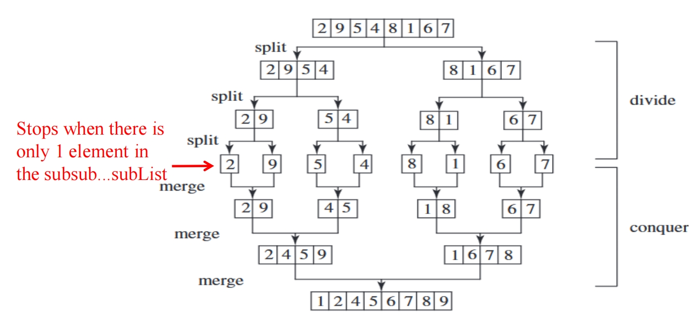
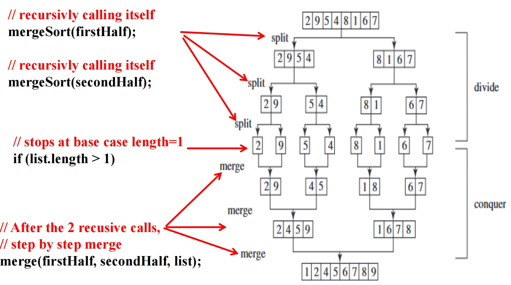
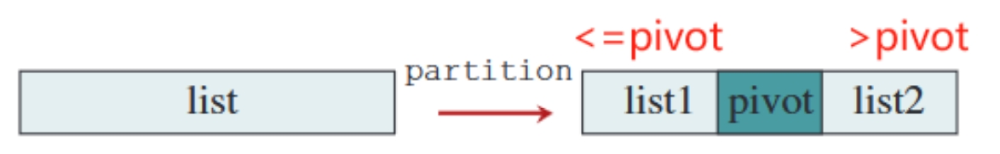
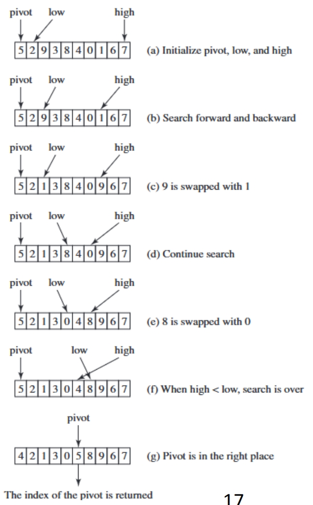
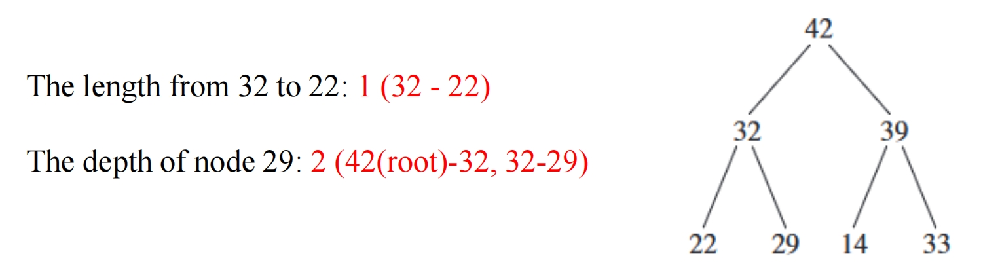
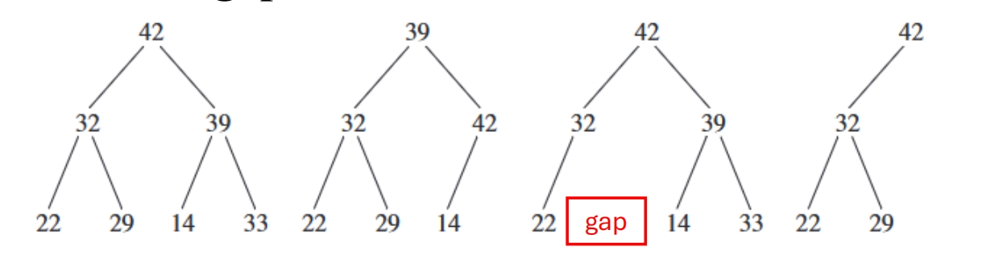
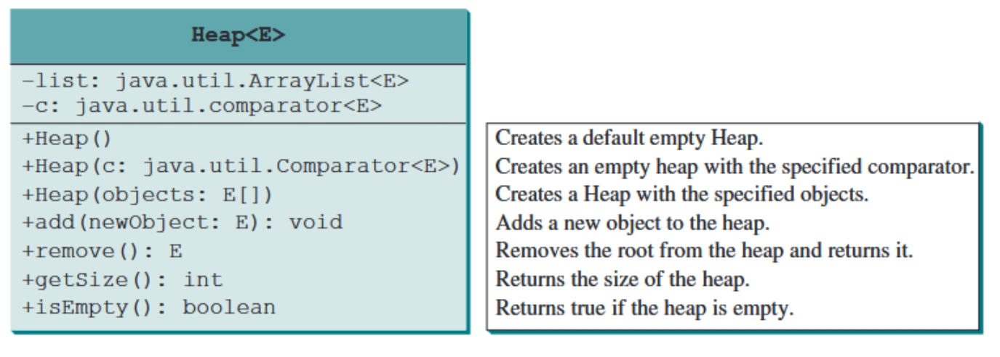
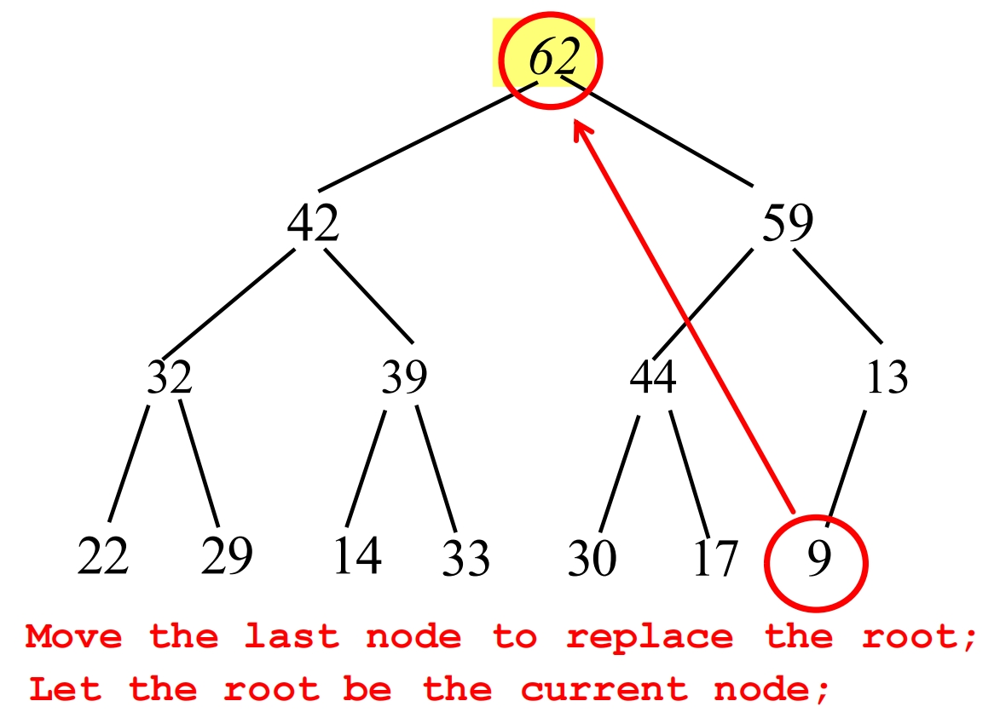
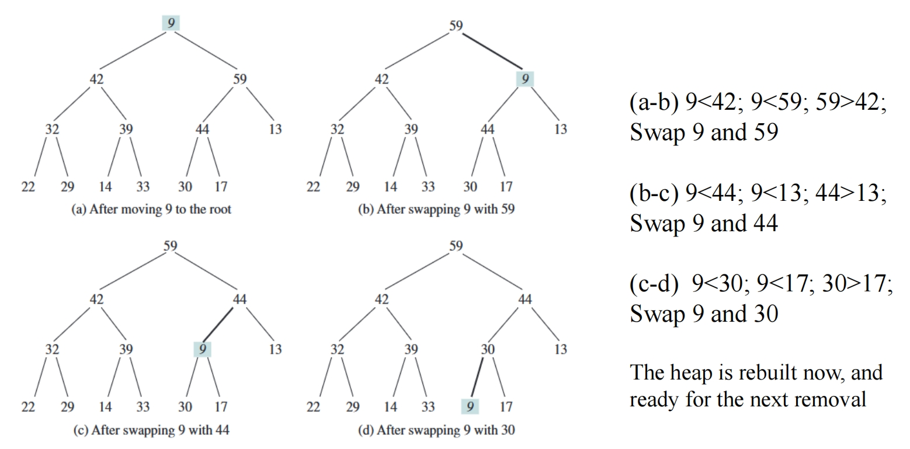

# 9 Sorting

## Bubble Sort 冒泡排序 O(n) ~ O(n<sup>2</sup>)

Repeatedly steps through the list to be sorted, compares each **pair of adjacent items** and swaps them if they are in the wrong order.

重复遍历要排序的列表，比较**每对相邻项**，如果它们的顺序错误，则交换它们。

但是潜在的情况是如果列表本身就已经是排序好的，但是最初的算法设计中没有检测中断的机制，因此会一直循环下去知道直到到达循环的终止条件，但实际上由于已经排序好了，所以迭代的过程中并没有发生位置转换。因此可以考虑添加一个中断判断。

```java
boolean needNextPass = true;
for (int k = 1; k < list.length && needNextPass; k++) {
    // Array may be sorted and next pass not needed 
    needNextPass = false;
    for (int i = 0; i < list.length - k; i++){
        if (list[i] > list[i + 1]){
            //swap list[i] with list[i + 1];
            needNextPass = true;
        }
    }
}
```

添加一个参数 **needNextPass**，如果每进入一轮外循环就将值设置为 false，然后如果再当前整个内循环过程中都没有满足过 if (list[i] > list[i + 1])，那么就不会修改 needNextPass，这样就不会开启下一轮的外循环。这样假如列表是是先排序好的，那么实际上只会进行完最开始的一轮遍历之后就结束了

### Time complexity of Bubble Sort 冒泡排序的时间复杂度

- **Best case**: Since the number of comparisons is **n - 1** in the first pass, the best- case time for a bubble sort is **O(n)**.

  **最佳情况**：由于第一次比较的次数为n - 1，因此冒泡排序的最佳时间为**O(n)**。

- **Worst case**: example: Initial list: [5,4,3,2,1]

  **最差情况**

  - [5,4,3,2,1] -> [4,3,2,1,5] - 1st pass, 4 comparsions (5 v.s. 4,3,2,1, 5 is sorted)
  
  - [4,3,2,1,5] -> [3,2,1,4,5] - 2nd pass, 3 comparsions (4 v.s. 3,2,1, 4 is sorted)
  
  - [3,2,1,4,5] -> [2,1,3,4,5] - 3rd pass, 2 comparsions (3 v.s. 1,2, 3 is sorted)
  
  - [2,1,3,4,5] -> [1,2,3,4,5] - 4th pass, 1 comparisons (2 v.s. 1, 2 is sorted)
  
  - So, 5 elements, we do 4+3+2+1 comparisons
    - If **n** elements, in the worst case, we compare **(n - 1) + (n - 2) + ... + 2 + 1 = n(n - 1) / 2** times. The Big(O) is **O(n^2)**
    
      如果有 n 个元素，在最坏的情况下，我们比较 （n - 1）+（n - 2）+... + 2 + 1 = n（n -1）/ 2 次。时间复杂度**O（n^2）**

```java
public class BubbleSort {
    /**
     * 冒泡排序算法实现
     * @param list 待排序的数组
     */
    public static void bubbleSort(int[] list) {
        boolean needNextPass = true; // 标志位，判断是否需要下一轮扫描
        
        // 外层循环控制排序轮次，最多需要n-1轮
        for (int k = 1; k < list.length && needNextPass; k++) {
            // 假设数组已经有序，不需要下一轮扫描
            needNextPass = false;
            
            // 内层循环进行相邻元素比较和交换
            // 每轮结束后，最大的元素会"冒泡"到数组末尾，所以比较范围递减
            for (int i = 0; i < list.length - k; i++) {
                if (list[i] > list[i + 1]) {
                    // 交换相邻元素
                    int temp = list[i];
                    list[i] = list[i + 1];
                    list[i + 1] = temp;
                    
                    // 发生交换说明数组尚未完全有序，需要下一轮扫描
                    needNextPass = true;
                }
            }
        }
    }
    
    public static void main(String[] args) {
        int size = 100000; // 测试数组大小
        int[] a = new int[size]; // 创建测试数组
        
        randomInitiate(a); // 随机初始化数组
        
        // 记录排序开始时间
        long startTime = System.currentTimeMillis();
        bubbleSort(a); // 执行排序
        long endTime = System.currentTimeMillis(); // 记录结束时间
        
        // 输出排序耗时
        System.out.println((endTime - startTime) + "ms");
    }
    
    /**
     * 随机初始化数组
     * @param a 需要初始化的数组
     */
    private static void randomInitiate(int[] a) {
        for (int i = 0; i < a.length; i++)
            a[i] = (int) (Math.random() * a.length); // 生成0到a.length-1的随机数
    }
}
```

## Merge Sort 归并排序 O(nlogn)

The merge-sort algorithm can be described recursively as follows: 

合并排序算法可以递归地描述如下：

- The algorithm divides the array into two halves and applies a merge sort on each half recursively.

  该算法将数组分为两半，并递归地对每一半应用合并排序。

- After the two halves are sorted, the algorithm then merges them.

  在对两半部分进行排序后，算法会将它们合并。



```java
public class MergeSortTest {
    // 拆分排序
    public static void mergeSort(int[ ] list) {
        if (list.length > 1) { // Recursive base case: stop when condition unsatisfied
            // Split the 1st half (recursive step)
            int[] firstHalf = new int[list.length / 2];
            System.arraycopy(list,0,firstHalf,0,list.length / 2);
            mergeSort(firstHalf);
            // Split the 2nd half (recursive step)
            int secondHalfLength = list.length - list.length / 2;
            int[ ] secondHalf = new int[secondHalfLength] ;
            System.arraycopy(list,list.length / 2 ,secondHalf, 0 ,
                             secondHalfLength);
            mergeSort(secondHalf);
            // SortMerge (only happens AFTER both recursive calls 
            finish)
                merge( firstHalf, secondHalf, list) ;
        }
    }

    // 合并
    public static void merge(int[] list1, int[] list2, int[] temp){
        int current1 = 0; // Current index in list1, the first half
        int current2 = 0; // Current index in list2, the 2nd half
        int current3 = 0; // Current index in temp, storing data temporarily
        // While the indices are in the list
        while (current1 < list1.length && current2 < list2.length) {
            if (list1[current1] < list2[current2])
                // If current element in list1 is smaller, add it to temp
                temp[current3++] = list1[current1++];
            else
                // Otherwise, add the current element in list2 to temp
                temp[current3++] = list2[current2++];
        }
        // list2 finished, but there are remaining elements in list1, add 
        them to temp
            while (current1 < list1.length)
                temp[current3++] = list1[current1++];
        // list1 finished, but there are remaining elements in list2, add 
        them to temp
            while (current2 < list2.length)
                temp[current3++] = list2[current2++];
    }

    public static void main(String[] args) {
        int size = 100000;
        int[] a = new int[size];
        randomInitiate(a);
        long startTime = System.currentTimeMillis();
        mergeSort(a);
        long endTime = System.currentTimeMillis();
        System.out.println( (endTime - startTime) + "ms" ) ;
    }

    private static void randomInitiate(int[] a) {
        for (int i = 0; i < a.length; i++)
            a[i] = (int) (Math.random() * a.length);
    }
}
```



### Time complexity of merge sort 归并排序的时间复杂度

- Let **T(n)** denote the time required for sorting an array of **n** elements using merge sort.

  设**T（n）**表示使用归并排序对n个元素数组进行排序所需的时间。

- $$
  T(n) = T(\frac{n}{2}) + T(\frac{n}{2}) + 2n-1 
  $$

- The first **T(n/2)** is the time for sorting the first half of the array and the second **T(n/2)** is the time for sorting the second half

  第一个 T（n/2） 是对数组的前半部分进行排序的时间，第二个 T（n/2） 是对后半部分进行排序的时间

- Merging cost **2n-1** because **n - 1** comparisons (for comparing the elements of the two subarrays) and **n** moves (to place each element into the temporary array)

  合并成本为 2n-1，因为 n - 1 比较（用于比较两个子数组的元素）和 n 移动（将每个元素放入临时数组中）

- Repeatedly substitute T(n/2) into the formula we will find the time complexity of merge sort is **O(nlogn)**.

  在公式中反复代入 T（n/2），我们会发现归并排序的时间复杂度为 **O（nlogn）**

## Quick Sort 快速排序 O(nlogn) ~ O(n<sup>2</sup>)

- A quick sort works as follows:

  快速排序的工作原理如下

  - The algorithm selects an element, called the **pivot**, in the array. 

    该算法在数组中选择一个名为 **枢轴** 的元素。
  
  - It partitions (divides) the array into two parts so all the elements in the **first part** are less than or equal to the pivot, and all the elements in the **second part** are greater than the pivot. 
  
    它将数组划分为两部分，因此 **第一部分** 中的所有元素都小于或等于枢轴，**第二部分** 中所有元素都大于枢轴。
  
  - The quick-sort algorithm is then **recursively** applied to the first part and then the second part to sort them out.
  
    然后 **递归地** 将快速排序算法应用于第一部分，然后再应用于第二部分以对其进行排序。



```java
import java.util.Arrays; // 导入 Arrays 工具类，用于打印数组等
import java.util.Random; // 导入 Random 类，用于随机数生成

public class QuickSortTest {

    /**
     * 快速排序的入口方法。
     * 对整个数组进行排序。
     *
     * @param list 待排序的整数数组。
     */
    public static void quickSort(int[] list) {
        // 调用递归的快速排序方法，初始范围是整个数组。
        // first 为起始索引，last 为结束索引。
        quickSort(list, 0, list.length - 1);
    }

    /**
     * 快速排序的递归实现。
     * 对数组的指定子范围进行排序。
     *
     * @param list  待排序的整数数组。
     * @param first 当前子数组的起始索引。
     * @param last  当前子数组的结束索引。
     */
    public static void quickSort(int[] list, int first, int last) {
        // 基本情况：如果子数组的结束索引大于起始索引，说明子数组中至少有两个元素，需要排序。
        // 如果 last <= first，表示子数组为空或只有一个元素，已经有序，无需排序。
        if (last > first) {
            // 调用 partition 方法对当前子数组进行分区操作。
            // partition 方法会选择一个枢轴元素，并将其放到正确的位置，
            // 使得枢轴左边的元素都小于等于枢轴，右边的元素都大于枢轴。
            // pivotIndex 是枢轴最终所在的索引位置。
            int pivotIndex = partition(list, first, last);

            // 递归地对枢轴左边的子数组进行快速排序。
            // 范围是从 first 到 pivotIndex - 1。
            quickSort(list, first, pivotIndex - 1);

            // 递归地对枢轴右边的子数组进行快速排序。
            // 范围是从 pivotIndex + 1 到 last。
            quickSort(list, pivotIndex + 1, last);
        }
    }

    /**
     * 对数组的指定子范围进行分区操作 (partition)。
     * 选择第一个元素作为枢轴，并将数组分为两部分：
     * 小于等于枢轴的元素放在左边，大于枢轴的元素放在右边。
     * 最后将枢轴放到正确的位置。
     *
     * @param list  待分区的数组。
     * @param first 当前子数组的起始索引（包含）。
     * @param last  当前子数组的结束索引（包含）。
     * @return 枢轴元素最终所在的位置索引。
     */
    public static int partition(int[] list, int first, int last) {
        // 选择子数组的第一个元素作为枢轴 (pivot)。
        int pivot = list[first];
        // low 指针从枢轴的下一个位置开始向右移动。
        int low = first + 1;
        // high 指针从子数组的最后一个位置开始向左移动。
        int high = last;

        // 当 low 指针还没有越过 high 指针时，循环继续。
        while (high > low) {
            // low 指针向右移动，直到找到一个大于枢轴的元素，或者 low 越过 high。
            // 条件 1: low 必须小于等于 high，防止越界。
            // 条件 2: list[low] 必须小于等于 pivot，表示该元素在正确的一边，low 可以继续向右。
            while (low <= high && list[low] <= pivot) {
                low++;
            }

            // high 指针向左移动，直到找到一个小于等于枢轴的元素，或者 high 越过 low。
            // 条件 1: low 必须小于等于 high，防止越界。
            // 条件 2: list[high] 必须大于 pivot，表示该元素在正确的一边，high 可以继续向左。
            while (low <= high && list[high] > pivot) {
                high--;
            }

            // 如果 high 指针仍然在 low 指针的右边 (即 low 和 high 没有越过对方)，
            // 说明 low 指向的元素大于枢轴，high 指向的元素小于等于枢轴，需要交换它们。
            if (high > low) {
                int temp = list[high];
                list[high] = list[low];
                list[low] = temp;
            }
        }

        // --- 修正或注意点开始 ---
        // 循环结束后，high 指针可能指向的是一个小于等于枢轴的元素，也可能是 low 指针越过了 high。
        // 关键是找到枢轴最终的正确位置，这个位置应该确保其左边都小于等于枢轴，右边都大于枢轴。

        // 调整 high 指针，使其最终指向第一个小于或等于枢轴的元素的位置（从右向左数）
        // 这是一个额外的步骤，确保 high 指针最终落在枢轴的正确归位点上。
        // 如果 low 和 high 越过，且 low > high，high 此时指向的元素可能已经小于等于枢轴。
        // 此处的判断逻辑 `list[high] >= pivot` 在某些情况下可能会将 high 移动过多，
        // 一个更常见的做法是直接检查 `list[high]` 与 `pivot` 的关系来确定最终位置。
        while (high > first && list[high] >= pivot){ // 注意：此处的条件可能导致 high 移动到不理想位置
            high--;
        }
        // --- 修正或注意点结束 ---

        // 最终，将枢轴元素 (list[first]) 与 list[high] 交换。
        // 理论上，high 指针此时应该指向枢轴最终的正确位置，
        // 使得其左边的元素都小于等于枢轴，右边的都大于枢轴。
        if (pivot > list[high]) { // 检查枢轴是否真的大于 high 指针指向的元素，以便交换
            list[first] = list[high]; // 将 list[high] 移到枢轴原来的位置
            list[high] = pivot;       // 将枢轴放到 high 指针的最终位置
            return high;              // 返回枢轴的新位置
        } else { // 如果枢轴没有大于 list[high] (例如，枢轴是最小的元素，或数组已经排序)
            // 枢轴保持在 first 位置，且 first 处的元素比 high 处的元素小或者相等
            // 此时，first 就是枢轴的正确位置。
            return first;
        }
    }

    /**
     * 主方法，用于测试快速排序算法的性能。
     * 创建一个大型数组，填充随机数，然后测量排序时间。
     *
     * @param args 命令行参数（未使用）。
     */
    public static void main(String[] args) {
        int size = 100000; // 定义数组大小为 100,000
        int[] a = new int[size]; // 创建一个指定大小的整数数组

        // 随机初始化数组元素
        randomInitiate(a);

        // 记录排序开始时间（毫秒）
        long startTime = System.currentTimeMillis();

        // 调用快速排序方法对数组进行排序
        quickSort(a);

        // 记录排序结束时间（毫秒）
        long endTime = System.currentTimeMillis();

        // 打印排序所花费的总时间
        System.out.println("排序 " + size + " 个随机整数耗时: " + (endTime - startTime) + "ms");

        // 可以在这里添加代码来验证数组是否已排序（例如，遍历并检查相邻元素）
        // for (int i = 0; i < a.length - 1; i++) {
        //     if (a[i] > a[i+1]) {
        //         System.out.println("排序错误！");
        //         break;
        //     }
        // }
    }

    /**
     * 辅助方法，用于随机初始化整数数组。
     *
     * @param a 待初始化的整数数组。
     */
    private static void randomInitiate(int[] a) {
        Random rand = new Random(); // 创建 Random 对象用于生成随机数
        for (int i = 0; i < a.length; i++) {
            // 为数组的每个元素生成一个 0 到 a.length-1 之间的随机整数。
            a[i] = rand.nextInt(a.length);
        }
    }
}
```

这个 quickSort()  定义了 Quick Sort 的递归结构，因为它不断调用自身。partition() 也会在进程中递归调用，直到基本情况 （last>first）。这确保了列表可以递归地分为左和右子列表、子子列表、子子子列表......



### Time Complexity of Quick Sort 快速排序的时间复杂度

- To partition an array of **n** elements, it takes **n** comparisons and **n** moves. Thus, the time required for partition is **O(n)**.

  要对一个包含 **n** 个元素的数组进行分区，需要进行 **n** 次比较和 **n** 次移动。因此，分区所需的时间是 **O（n）**。

- In the **best case,** each time the pivot divides the array into two parts of the same size. **O(nlogn)**

  在  **最好的情况**下， 每次pivot将数组分成大小相同的两部分。**O（nlogn）**

- In the **average case**, maybe not exactly the same, but the size of the two sub arrays are very close. **O(nlogn)**

  在 **平均情况** 下，可能不完全相同，但两个子数组的大小非常接近 **O（nlogn）**

- In the **worst case**,  the pivot divides the array each time into one big subarray **with the other array empty**. The size of the big subarray is one less than the one before divided. **O(n<sup>2</sup>)**
  
  在 **最坏的情况** 下，枢轴每次将数组划分为一个大子数组，另一个数组为空。大子阵列的大小比分割前的小一个 **O(n<sup>2</sup>)**
  
  - For example (assuming the 1st element is the pivot for partition):
    
    例如（假设第一个元素是分区的枢轴）：
    
    - [1,2,3,4,5...n], size=n
    - In the first partition, pivot=1, we have -> 
      - left: [empty], right [2,3,4,5...n], right sub array size = n-1
    - In the next partition, pivot=2, we have -> 
      - left: [empty], right [3,4,5,6...n], right sub array size = n-2
    - … continues this way, we will have to recursively divide the arrary **n-1** times till the sub array size =1
    - Recall that the time complexity of each partition is O(n), as it compares all elements during each division.
    - So we did **n-1** times **O(n)**, so, we get the **worst time complexity** to be **O(n^2)**

## Heap Sort: Binary Tree 堆排序 O(nlogn)

- A **binary tree** is a hierarchical structure: it either is empty or it consists of an element, called the **root**, and two distinct binary trees, called the **left subtree** and **right subtree**

   **二叉树**  是一种层次结构：它要么是空的，要么由一个元素（称为 **根** ）和两个不同的二叉树（称为 **左子树** 和 **右子树**）组成。

  - The **length** of a path is the number of the edges in the path
  
    路径的 **长度** 是路径中的边数
  
  - The **depth** of a node is the length of the path from the root to that node
  
    节点的 **深度** 是从根节点到该节点的路径长度



### Complete Binary Tree 完全二叉树

A binary tree is **complete** if:

如果满足以下条件，二叉树是 **complete**

- All levels are completely filled except **possibly** the last level

  除可能最后一级外，所有上层级别都已完全填满

- Even though the last level may not be full, it must be filled from left to right, **without gaps**

  即使最后一关可能没有填满，也必须从左到右填满，**没有空隙**



- 1st - complete, as all levels are completely filled

  因为所有级别都已完全填满

- 2nd - complete, although the last level is not full (missing one node next to 14), it is filled from left to right, without gaps

  尽管最后一级没有填满（缺少14旁边的一个节点），但它是从左到右填充的，没有间隙

- 3rd, incomplete, a gap from left to right (next to node 22)

  从左到右存在间隙（在节点 22 旁边）

- 4th, incomplete, the 2nd level is not full, while we only allow the last level (level 3 in this case) not to be full

  第二级未满，而我们只允许最后一级（本例中为第3级）未满

### Binary Heap 二叉堆

- A **binary heap** is a binary tree with the following properties:

  二进制堆是具有以下属性的二叉树

  - It is a **complete binary tree**, and
  
    它是一个 完全二叉树
  
  - **Each node** is greater than or equal to any of its children
    
    每个节点都**大于或等于**其任何**子节点** (Max Heap)



### Heap Sort 堆排序

- **Heap sort** uses a binary heap and the process consists of **two** main phases:

  **堆排序**使用二叉堆，该过程由**两个**主要阶段组成：

  - **Heap construction:** 

    堆构造：

    - All the elements are first inserted into a max heap

      首先将所有元素插入到最大堆中

  - **Repeated removal:** 

    重复移除 ：

    - Repeatedly remove the **root node**, which is the current largest element in the heap. The removed element is actually moved to the end of the array, forming a sorted array that grows from the back.

      重复删除 **根**节点，这是堆中当前最大的元素。删除的元素实际上被移动到数组的末尾，形成一个从后面增长的排序数组。

Example:

- For example: [10,5,3,4,1]

  - 1st removal: [..., 10]

  - 2nd removal: [..., 5, 10]

  - 3rd removal: [..., 4, 5, 10]

  - (do removal repeatedly)

  - Final: [1,3,4,5,10]

### Sorting a Heap 对一个堆进行排序

- A heap can be stored in an **ArrayList** or an **array** if the heap size is known in advance

  如果堆大小预先已知，则可以将堆存储在 **ArrayList** 或 **数组** 中

  - For a node at position **i**, its left child is at position **2i+1** and its right child is at position **2i+2**, and its parent is at index **(i-1)/2**  [root位于position 1]

    对于位于位置 **i** 的节点，其左子节点位于位置 **2i+1**，右子节点位于地址 **2i+2**，其父节点位于索引**（i-1）/2**

  - For example: the for a nood at position **4**, and its two children are at positions 2 * 4+1=**9** and 2 * 4+2 =**10**, and its parent is at index (4-1)/2=**1** **(not 1.5, integer division)**

    举例来说：对于位置为 4 节点，其两个子节点位于位置2 * 4+1=9 和2 * 4+2 =10，其父节点位于索引（4-1）/2=1 （不是1.5，整数除法，向下取整）

#### Adding elements to a Heap 向堆中添加一个元素

- To add a new node to a heap, first add it to the end of the heap and then rebuild the tree with this algorithm:

  要将新节点添加到堆中，请先将其添加到堆的末尾，然后使用以下算法重建树：

```java
// Let the last node be the current node;
while (the current node is greater than its parent) { 
    Swap the current node with its parent;
    Now the current node is one level up;
}
```

#### Removing the Root and Rebuild the Heap 从堆中移除根并重构堆

- Often we need to remove the maximum element, which is the **root in a heap**

  通常我们需要删除最大元素，即 **堆中的根**

- After the root is removed, the tree must be rebuilt to **maintain the heap property (e.g., parent>=child)** using this algorithm:

  删除根后，必须使用以下算法重建树以 **维护堆属性**（例如，parent>=child）：

```java
Move the last node to replace the root;
Let the root be the current node;
while (the current node has children and the current node is smaller than one of its children)
{ Swap the current node with the larger of its children;
 Now the current node is one level down;
}
```

Example:

- Removing root 62 from the heap (replaces it with the last node in the heap: 9)



```java
while (the current node has children and the
       current node is smaller than one of its children)
{ Swap the current node with the larger of its
    children;
}
```



```java
/**
 * 堆数据结构实现，使用数组列表存储元素
 * @param <E> 可比较的元素类型
 */
public class Heap<E extends Comparable> {
    // 使用ArrayList来存储堆中的元素
    private java.util.ArrayList<E> list = new java.util.ArrayList<E>();
    
    /** 创建一个空堆 */
    public Heap() {
    }
    
    /** 
     * 从对象数组创建堆 
     * @param objects 要构建堆的数组
     */
    public Heap(E[] objects) {
        for (int i = 0; i < objects.length; i++)
            add(objects[i]);
    }
    
    /** 
     * 向堆中添加新对象 
     * @param newObject 要添加的新对象
     */
    public void add(E newObject) {
        list.add(newObject); // 将新元素添加到堆的末尾
        int currentIndex = list.size() - 1; // 获取新添加元素的索引
        
        // 向上调整堆结构，维持堆的性质
        while (currentIndex > 0) {
            int parentIndex = (currentIndex - 1) / 2; // 计算父节点索引
            
            // 如果当前节点大于父节点，则交换它们
            if (list.get(currentIndex).compareTo(list.get(parentIndex)) > 0) {
                E temp = list.get(currentIndex);
                list.set(currentIndex, list.get(parentIndex));
                list.set(parentIndex, temp);
            } else
                break; // 如果不需要交换，说明堆已经满足条件
            
            currentIndex = parentIndex; // 继续向上检查
        }
    }
    
    /** 
     * 移除并返回堆顶元素（最大值）
     * @return 堆顶元素，如果堆为空则返回null
     */
    public E remove() {
        if (list.size() == 0) return null;
        
        E removedObject = list.get(0); // 保存堆顶元素
        list.set(0, list.get(list.size() - 1)); // 将最后一个元素移到堆顶
        list.remove(list.size() - 1); // 移除最后一个元素
        
        int currentIndex = 0;
        
        // 向下调整堆结构，维持堆的性质
        while (currentIndex < list.size()) {
            int leftChildIndex = 2 * currentIndex + 1; // 左子节点索引
            int rightChildIndex = 2 * currentIndex + 2; // 右子节点索引
            
            // 如果没有左子节点，说明已经到达叶子节点
            if (leftChildIndex >= list.size())
                break;
                
            int maxIndex = leftChildIndex; // 假设左子节点是较大的
            
            // 如果有右子节点且比左子节点大，则更新maxIndex
            if (rightChildIndex < list.size())
                if (list.get(maxIndex).compareTo(list.get(rightChildIndex)) < 0)
                    maxIndex = rightChildIndex;
                    
            // 如果当前节点小于较大的子节点，则交换它们
            if (list.get(currentIndex).compareTo(list.get(maxIndex)) < 0) {
                E temp = list.get(maxIndex);
                list.set(maxIndex, list.get(currentIndex));
                list.set(currentIndex, temp);
                currentIndex = maxIndex; // 继续向下检查
            }
            else
                break; // 如果不需要交换，说明堆已经满足条件
        }
        
        return removedObject;
    }
    
    /** 
     * 获取堆中元素的数量 
     * @return 堆的大小
     */
    public int getSize() {
        return list.size();
    }
}

/**
 * 堆排序实现类
 */
public class HeapSort {
    /**
     * 使用堆排序算法对数组进行排序
     * @param <E> 可比较的元素类型
     * @param list 要排序的数组
     */
    public static <E extends Comparable> void heapSort(E[] list) {
        // 创建一个堆
        Heap<E> heap = new Heap<E>();
        
        // 将数组元素逐个添加到堆中
        for (int i = 0; i < list.length; i++)
            heap.add(list[i]);
            
        // 从堆中依次取出最大元素，放入数组的末尾向前填充
        for (int i = list.length - 1; i >= 0; i--)
            list[i] = heap.remove();
    }
    
    /** 测试方法 */
    public static void main(String[] args) {
        Integer[] list = {2, 3, 2, 5, 6, 1, -2, 3, 14, 12};
        heapSort(list); // 对数组进行堆排序
        
        // 打印排序后的数组
        for (int i = 0; i < list.length; i++)
            System.out.print(list[i] + " ");
    }
}
```

### Time complexity of Heap Sort 堆排序的时间复杂度

Heap SortTime: **O(nlog n)**

- **Space Complexity** 

  - Both merge and heap sorts require O(n logn) time. 

    合并和堆排序都需要O（n logn）时间。

  - A **merge sort** requires a temporary array for merging two subarrays; a **heap sort** does not need additional array space. 

    合并排序需要一个临时数组来合并两个子数组；堆排序不需要额外的数组空间。

  - Therefore, a heap sort is more **space efficient** than a merge sort.

    因此，**堆排序比合并排序更节省空间**。

## Life-Long Learning and EDI

### Life-Long Learning in OOP  OOP 中的终身学习

**Definition:**

- **Life-long learning** refers to the continuous, voluntary, and self-motivated pursuit of knowledge for personal or professional development. 

   **终身学习**  是指为个人或专业发展而持续、自愿和自我激励地追求知识。

- In the context of Object-Oriented Programming (OOP), life-long learning encourages developers to stay updated with evolving concepts, techniques, and tools to become proficient in designing, implementing, and maintaining  software systems.

  在面向对象编程 （OOP） 的背景下，终身学习鼓励开发人员与不断发展的概念、技术和工具保持同步，以熟练地设计、实施和维护软件系统。

**Importance:**

- **Ever-evolving Technology Landscape:** Life-long learning ensures that developers keep up with the latest best practices, frameworks, and design patterns.

  **不断发展的技术环境**： 终身学习确保开发人员跟上最新的最佳实践、框架和设计模式。

- **Increased Professional Competence:** Lifelong learning enhances your ability to solve complex problems, optimize code, and design robust systems. 

  **提高专业能力**： 终身学习可以提高您解决复杂问题、优化代码和设计健壮系统的能力。

- **Adaptation to New Tools:** Learning new tools in OOP keeps you agile and opens up new career opportunities.

  **适应新工具**： 在 OOP 中学习新工具可以让你保持敏捷并开辟新的职业机会。

- **Personal Growth:** Continuously improving your OOP skills not only enhances your technical expertise but also develops other valuable skills such as critical thinking,  problem-solving, and effective communication.

  **个人成长**： 不断提高您的 OOP 技能不仅可以增强您的技术专业知识，还可以发展其他有价值的技能，例如批判性思维、解决问题和有效沟通。

### Recording and Reflecting on Your Learning 记录和反思

- **Maintain a reflective journal/log where you document:**

  在记录的位置维护一个反思日志/日志：

  - Key takeaways from each learning session.

    每次学习会议的关键收获。

  - Insights and thoughts gained after solving coding challenges.

    解决编码挑战后获得的见解和想法。

  - Questions or areas where you need further clarification.

    您需要进一步说明的问题或领域。

  - Code snippets and examples you’ve worked on. A journal helps consolidate your learning and provides a reference for future problems.

    您处理过的代码片段和示例。日记有助于巩固您的学习并为未来的问题提供参考。

- **Regular Self-Assessment:**

  定期自我评估：

  - Regularly evaluate your progress against your set goals. Are you mastering the basics, or do you need to revisit certain concepts.

    定期根据设定的目标评估您的进度。您是否掌握了基础知识，或者您是否需要重新审视某些概念。

  - Be honest about your challenges. Do you struggle with complex design patterns or the implementation of advanced OOP principles? Focus on these areas next.

    诚实地面对你的挑战。您是否为复杂的设计模式或高级 OOP 原则的实现而苦恼？接下来关注这些领域。

  - Recognize your achievements. Completing a course or contributing to an OOP project is a big milestone worth celebrating.

    认可你的成就。完成课程或为 OOP 项目做出贡献是一个值得庆祝的重要里程碑。

- **Join Communities and Forums**

  加入社区和论坛

  - Join OOP-focused communities on platforms like StackOverflow, Reddit, or GitHub.

    加入 StackOverflow、Reddit 或 GitHub 等平台上以 OOP 为重点的社区。

  - Participate in discussions, ask questions, and share your knowledge with others.

    参与讨论、提出问题并与他人分享您的知识。

### EDI Principles in OOP  OOP 中的 EDI 原则

Equality, Diversity, and Inclusion (EDI) are essential principles that promote fairness, representation, and a welcoming environment within the software development community. These principles are crucial in the context of Object-Oriented Programming to ensure that:

平等、多样性和包容性 （EDI） 是在软件开发社区中促进公平、代表性和友好环境的基本原则。这些原则在面向对象编程的上下文中至关重要，可以确保：

- All individuals have equal access to opportunities, regardless of background.

  无论背景如何，所有人都有平等的机会。

- Diverse perspectives contribute to the improvement of the field.

  不同的观点有助于该领域的改进。

- Everyone feels welcome, valued, and respected in the development process.

  在开发过程中，每个人都感到受欢迎、被重视和被尊重。

#### **Description:**

- **Equality** in OOP means ensuring that all developers, regardless of their gender, race, sexual orientation, or disability, have equal access to career opportunities and the ability to contribute to the software development process.

  OOP 中的 **平等** 意味着确保所有开发人员，无论其性别、种族、性取向或残疾如何，都有平等的机会获得职业机会和为软件开发过程做出贡献的能力。

- **Diversity** in OOP enriches problem-solving by bringing together people from various backgrounds, experiences, and perspectives. This diversity leads to more creative and innovative solutions to complex software design challenges.

  OOP 中的 **多样性** 通过将来自不同背景、经验和观点的人聚集在一起，丰富了解决问题的能力。这种多样性为复杂的软件设计挑战带来了更具创造性和创新性的解决方案。

- **Inclusion** in OOP goes beyond representation and equality; it emphasizes creating an environment where everyone feels respected and valued.

  OOP 中的 **包容性** 超越了代表性和平等;它强调创造一个让每个人都感到受到尊重和重视的环境。

#### **Practical Ways to Incorporate EDI into OOP Practices**  将EDI纳入OOP实践的方法

**Adopt Inclusive Coding Practices:** 采用包容性编码实践：

- Use inclusive language in code, comments, and documentation. Avoid terms or practices that could inadvertently alienate or exclude individuals.

  在代码、注释和文档中使用包容性语言。避免使用可能无意中疏远或排斥个人的术语或做法。

**Implement Accessible Design Patterns:** 实现可访问的设计模式：

- Ensure that the software designs you build are accessible to a wide audience. Incorporate accessibility features such as customizable UI options, voice recognition, and high-contrast themes.

  确保您构建的软件设计可供广泛的受众访问。整合辅助功能，例如可自定义的UI选项、语音识别和高对比度主题。

**Encourage Collaboration Across Diverse Teams:** 鼓励不同团队之间的协作：

- Actively seek out team members from diverse backgrounds and experiences. This could mean promoting women in tech, supporting LGBTQ+ individuals, or working with teams that include people from different ethnicities and cultures.

  积极寻找来自不同背景和经验的团队成员。这可能意味着在科技领域推广女性，支持 LGBTQ 个人，或与来自不同种族和文化的人合作。

**Leverage EDI-Focused Resources:** 利用以 EDI 为中心的资源：

- Utilize resources, courses, and materials that focus on diversity and inclusion in the software development community. These resources help developers become more aware of potential biases in their coding practices and provide strategies to mitigate them.

  利用软件开发社区中注重多样性和包容性的资源、课程和材料。这些资源可帮助开发人员更加了解其编码实践中的潜在偏见，并提供减轻这些偏见的策略。

### Development with the AI-assisted Management Tools

Develop advanced software components as a member or a leader of a software development team, **incorporating AI-assisted features.** (LO-C)

作为软件开发团队的成员或领导者开发高级软件组件，结合 AI 辅助功能。

**Basic Requirements:**

- Show your planning board

  显示您的规划板

- Make it detailed

  详细化

- Screentshots+descriptions should just work

  截屏+描述应该实现什么样的工作

