# Database Development Structure

- Classification:
  - volatile storage: loses contents when power us switched off
  - non-volatile storage:
    - Contents persist even when power if off
      - Includes secondary and tertiary storage
- Factors affecting choices of storage media include
  - Speed with which data can be assessed
  - Cost per unit of data
  - Reliability

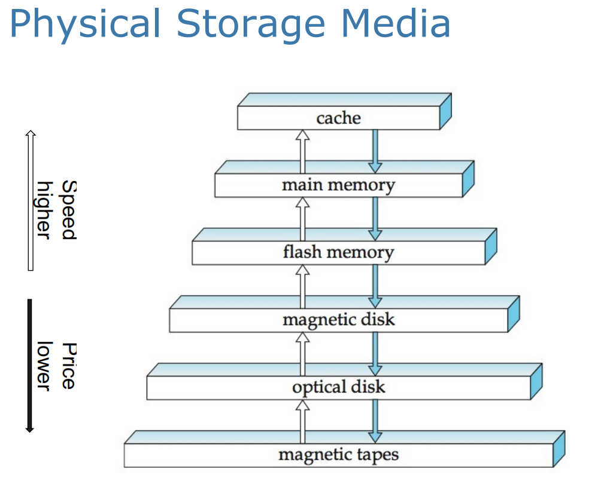

- **Primary storage**: fastest media but volatile (cache, main memory)

  主存储：最快的媒体，但易失性（缓存、主内存）

- **Secondary storage**: next levels in hierarchy, non-volatile, moderately fast access time

  **二级存储**：层次结构的下一层，非易失性，适中快的访问时间

  - also called on-line storage 

    也称为在线存储

  - e.g. flash memory, magnetic disks

    例如闪存、磁盘

- **Tertiary storage**: lowest levels in hierarchy, non-volatile, slow access time

  **三级存储**：层次结构中的最低级别，非易失性，访问时间慢

  - also called off-line storage and used for archival storage 

    也称为离线存储，用于存档存储

  - e.g. magnetic tape, optical storage

    例如磁带、光存储

## Magnetic Disk

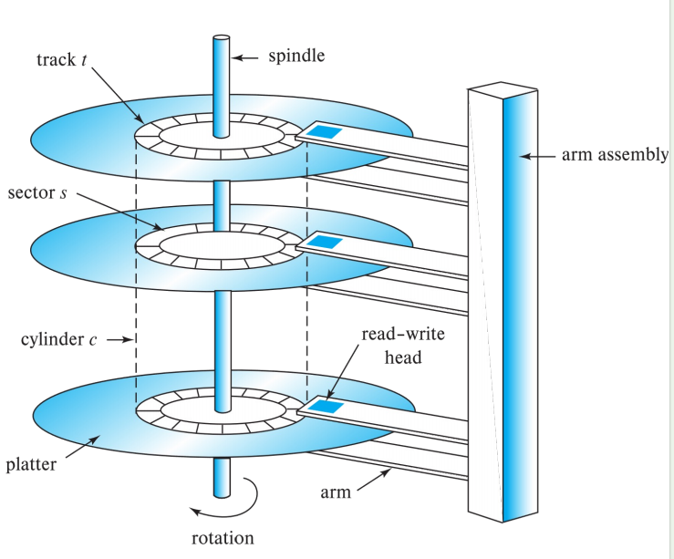

Sector is the smallest unit of data that can be read or write.

Disk arm Swing摆动 for the track

Disk arm head spin旋转 for the sector

## Access Time 访问时间计算！！！

- **Access time** is the time it takes from when read or write a block request is issued to when data transfer begins (or ends).

  访问时间是从发出读取或写入数据块请求到数据传输开始（或结束）所花费的时间。

- **Access time** = <u>**Seek time + Rotational latency + (Transfer time)**</u>

  访问时间 = 寻道时间 + 旋转延迟 +（传输时间）

- **Seek time** – time it takes to position the arm over the right track. 

  寻道时间 – 将机械臂定位在正确轨道上所需的时间。

  - Average seek time is about 1/2 of the worst case seek time (e.g. from the innermost to the outermost)

    平均寻道时间大约是最坏情况下寻道时间的 1/2（例如，从最内层到最外层）

- **Rotational latency** – time it takes for the sector to be accessed to appear under the head. 

  Rotational latency （旋转延迟） – 访问扇区后显示在 head 下方所需的时间。

  - Average latency is about 1/2 of the worst case latency (e.g. nearly 360 degree rotation)

    平均延迟大约是最坏情况延迟（例如，近 360 度旋转）的 1/2

- **Transfer time** – time to actually read/write the data in the sector once the head is positioned. That is, the time for the disk to rotate over the sectors. 

  转换时间 – 磁头定位后，在扇区中实际读/写数据的时间。即磁盘在扇区上旋转的时间。

- **Rotational latency time** 旋转等待时间 - 一单读写头叨叨了所需的磁道，等待访问的扇区出现在读写头下所花费的时间。 

- In most cases, transfer time is much less than the seek time and rotational latency.

### Disk Block 磁盘块

- A **contiguous sequence of sectors** from a single track 

  来自单个磁道的连续扇区串行

- Data is transferred between disk and main memory in blocks 

  数据以块的形式在磁盘和主内存之间传输

- Sizes range from 512 bytes to several kilobytes

  大小范围从 512 字节到几千字节

  - **Smaller blocks**: more transfers from disk

    **更小的块**：从磁盘传输更多数据

  - **Larger blocks**: more space wasted due to partially filled blocks

    **更大的区块**：由于部分填充的区块而浪费了更多的空间

  - Typical block sizes today range from 4 to 16 kilobytes

    目前的典型数据块大小从 4 KB 到 16 KB 不等

### Optimization of Disk-Block Access  优化磁盘块访问

- Disk-arm-scheduling algorithms order pending accesses to tracks so that disk arm movement is minimized.

  磁盘臂调度算法对对磁道的待处理访问进行排序，以便最大限度地减少磁盘臂移动。

- The Elevator algorithm: 

  - Moves disk arm in one direction (from outer to inner tracks or vice versa), 

  - Processes next request in that direction, till no more requests in that direction, then

  - Reverses direction and repeat

## Flash Memory and SSDs 快闪和SSD

- Two types of flash memory: NOR and NAND 

  两种类型的闪存：NOR 和 NAND

- NOR快闪循序随机访问内容中的耽搁字，并且拥有和主存可媲美的读取速度。

- NAND flash predominantly used for data storage. 

  NAND 闪存主要用于数据存储。也就是提取到主存储器中

  - Reading from NAND requires an entire page, commonly 4,096 bytes; 

    从 NAND 读取需要整个页面，通常为 4,096 字节;

  - Pages in a NAND flash similar to sectors in a magnetic disk.

    NAND 中的页面闪存类似于磁盘中的扇区。

- Solid-state disks (SSDs) are built using NAND flash and provide the same block-oriented interface as disk storage. 

  固态磁盘 （SSD） 使用 NAND 闪存构建，并提供与磁盘存储相同的面向块的接口。

### SSD

- Much faster random access, but more expensive compares to HDDs

  随机访问速度更快，但与 HDD 相比成本更高

  - Used as the primary boot drive in personal computers nowadays. 

    现在用作个人电脑的主引导驱动器。

  - Latency to retrieve a page ranges from 20 to 100 microseconds

    检索页面的延迟范围为 20 到 100 微秒

  - Data transfer rate ranges from 

    数据传输速率范围从

    - Around 500 megabytes per second with SATA interfaces

      每秒约 500 兆字节，带 SATA 接口

    - Up to 3 gigabytes per second using NVMe PCIe interfaces

      高达 3 GB/秒，使用 NVMe PCIe 接口

- Write to a page of flash memory typically takes about 100 microseconds. 

  写入闪存页通常需要大约 100 微秒。

  - However, a page has to be erased first and rewritten subsequently. 

    但是，必须先擦除页面，然后再重写。

### RAID

- RAID (**R**edundant **A**rrays of **I**ndependent **D**isk) 独立磁盘冗余阵列

  - Have a large number of disks in a system

    系统中有大量磁盘

  - Independent reads or writes can be performed in parallel

    可以并行执行独立读取或写入

  - Achieve improved performance and reliability

    实现更高的性能和可靠性

- Improvement of **Reliability** via **Redundancy**

  通过冗余提高可靠性

  - Store extra information that is not needed normally but can be used in the event of failure of a disk to rebuild the lost information. 

    存储通常不需要的额外信息，但可以在磁盘发生故障时使用以重建丢失的信息。

  - e.g. mirroring or shadowing

    例如，镜像或阴影

- Improvement in **Performance** via **Parallelism**: 
  
  通过并行性提高性能
  
  - Improve data transfer rate by striping data across multiple disks.
  
    通过跨多个磁盘对数据进行条带化来提高数据传输速率。

## File Organization

- Logically, a database is stored as a collection of files; each file is a sequence of records; a record is a sequence of fields. Physically, each file is partitioned into blocks (pages).

  从逻辑上讲，数据库存储为文档集合;每个文档都是一个记录串行;记录是一系列字段。在物理上，每个文档都被分区为块（页）。

- File organisation: optimise block access time by organising the blocks to correspond to how data will be accessed.

  文档组织：通过组织数据块以对应于数据的访问方式来优化块访问时间。

- Assumption: **no record is larger than a block, i.e. each record is entirely contained in a single block.**

  假设： **没有记录大于一个区块，即每条记录都完全包含在一个区块中。**

- Two ways for storing records  两种存储记录的方式

  - **Fixed-length records** 固定长度记录

  - **Variable-length records**  可变长度记录

### Fixed-length records 固定长度记录

假设在下面的表中，每个字符占一个字节，numeric占8个字节。假设我们为每个属性ID，name和dept_name分配可以容纳的最大的字节数，而不是分配可变的字节数。于是每条记录都占53个字节。一个简单的方法是使用前53个字节来存储第一条记录，接下来的53个字节存储第二条记录，以此类推

上述方法存在的问题：

- 除非块的大小恰好是53的倍数（一般不太可能），否则一些记录会跨过块的边界，即一条记录的一部分存储在一个块中，而另一部分存储在另一个块中。于是，读写这样一条记录需要两次块访问
- 从这个机构中删除一条记录十分困难。删除的记录所占的空间必须由文件中的其他记录来填充，或者我们必须用一种方法标记删除的记录使得它可以被忽略

可行的解决方案:

- 第一个问题，在一个块中只分配它能够完整容纳下的最大的记录数（这个数字可以很容易通过块大小除以记录大小计算出来，并且废除小数部分，也就是计算出来之后只取整）。每个块中余下的字节就不使用了
- 第二个问题，当中间一条记录被删除的时候，可以把紧跟其后的记录移动到被删除的记录曾经占据的空间，以此类推，直到被删记录后面的每一条记录都向前做了移动。但是这种方法需要移动大量的记录。因此，简单地将文件的最后一条记录移动到被删记录所占据的空间更容易一些。

问题二案例：

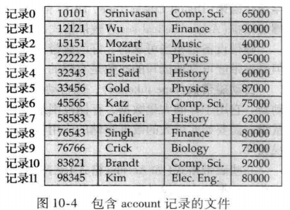

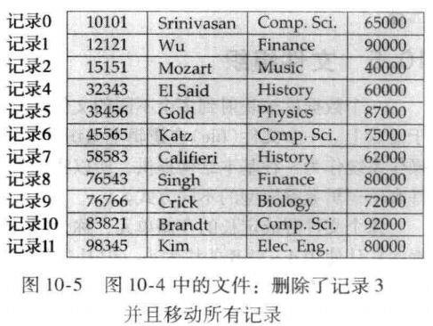

显然下面这种只讲新增的记录填充到被删除的3号记录的位置更加简单

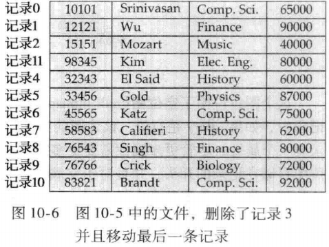

- 问题二解决方法的技巧：分配一定量的字节作为**文件头**(file head)。文件头将包含有关文件的各种信息。假如我们一次性删掉了记录1，4，6那么最终的记录会形成一个箭头穿起来的链表，成为**空闲列表**(free list)，用来让后面新增的内容直接先填充这些空闲列表中被删掉的内容

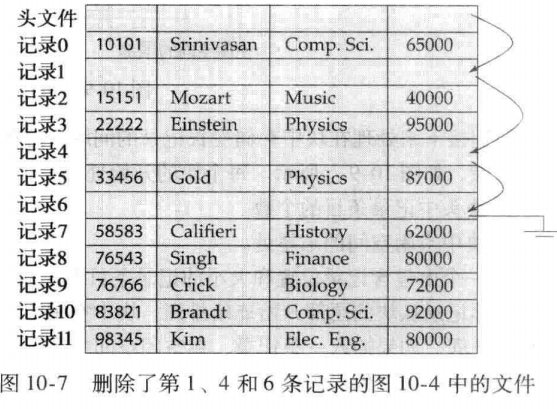

### Variable-length records 变长记录

- Representation of a record with variable length attributes has two parts: 

  具有可变长度属性的记录的表示包括两个部分：

  - an initial part with fixed length information, and

    具有固定长度信息的初始部分，以及

  - data for variable-length attributes

    可变长度属性的数据

- Variable-length attributes are represented in the initial part of the record by a pair (offset, length) 

  可变长度属性在记录的初始部分由一对 （offset， length） 表示

  - offset denotes where the data for that attribute begins within the record

    offset 表示该属性的数据在记录中的开始位置

  - length is the length in bytes of the variable-sized attribute.

    length 是 variable-sized 属性的长度（以字节为单位）。

空位图 Null bitmap

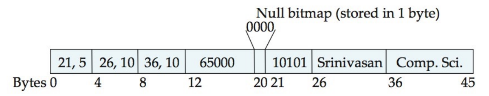

在这里，Null bitmap用来展示哪个属性是控制。在这个特定的记录中，如果salary是控制，该位图中的第20位就会被标记，然后存储在12~19中的salary会被忽略。该记录中的空位图只占用一个字节。

### Slotted-page structure 分槽的页结构

每个块开头都有一个块头，包含如下信息：

- 块头中记录条目的个数
- 块中空闲空间的末尾处
- 一个由包含记录位置和大小的记录条目组成的数组

实际记录从块的尾部开始**连续排列**。块中空闲空间是连续的，在块头数组的**最后一个条目和第一条记录之间**。

如果插入一条记录，在空闲空间的尾部给这条记录分配空间，并且将包含这条记录大小和位置的条目添加到块头中。

如果删除记录，则会释放它占用的空间。  此外，将移动已删除记录之前的块中的记录，以便所有可用空间再次位于块头数组中的最后一个条目和第一条记录之间。块头中的空闲空间指针也要进行适当的修改

(Large objects are often represented using B+-tree file organisations (SQL supports Blob or Clob) (in future lectures) 大型对象通常使用 B+ 树文档组织表示（SQL 支持 Blob 或 Clob）) 

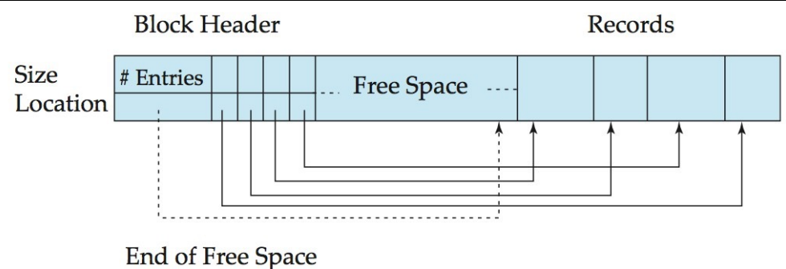

## Organization of Records in Files

- Heap – a record can be placed anywhere in the file where there is space.

  堆文件组织 – 记录可以放置在文档中有空间的任何位置。

- Sequential – store records in sequential order, based on the value of the search key of each record.

  顺序文件组织 – 根据每条记录的搜索键值，按顺序存储记录。

- Multi-table clustering - records of several different relations can be stored in the same file.

  多表聚簇文件组织 - 多个不同关系的多表聚类记录可以存储在同一个文档中。

- B+-tree - provide efficient ordered access to records even with large number of insert, delete, or update operations (more in next lecture).

  B+ 树提供对记录的高效有序访问，即使有大量的插入、删除或更新操作（下讲将详细介绍）。

- Hashing – a hash function computed on search key; the result specifies in which block of the file the record should be placed (more in next lecture).

  散列文件组织 – 在搜索键上计算的哈希函数;结果指定记录应放置在文档的哪个块中（更多内容将在下一讲中介绍）。

### Heap File Organization 

- Records can be placed anywhere in the file where there is free space; usually do not move once allocated.

  记录可以放置在文档中有可用空间的任何位置;通常一旦分配就不要移动。

- Important to be able to efficiently find free space within file

  能够有效地在文档中查找可用空间非常重要

- **Free-space map**

  - Array with 1 entry per block. Each entry is a few bits to a byte, and stores fraction of block that is free.

  - In example below, 3 bits per block, value divided by 8 indicates fraction of block that is free.
  - Free space map written to disk periodically

### Sequential File Organization

- Suitable for applications that require sequential processing of the entire file.

  适用于需要按顺序处理整个文档的应用进程。

- The records in the file are ordered by a search-key (ID in the following example).

  文档中的记录按搜索键（以下示例中的 ID）排序。

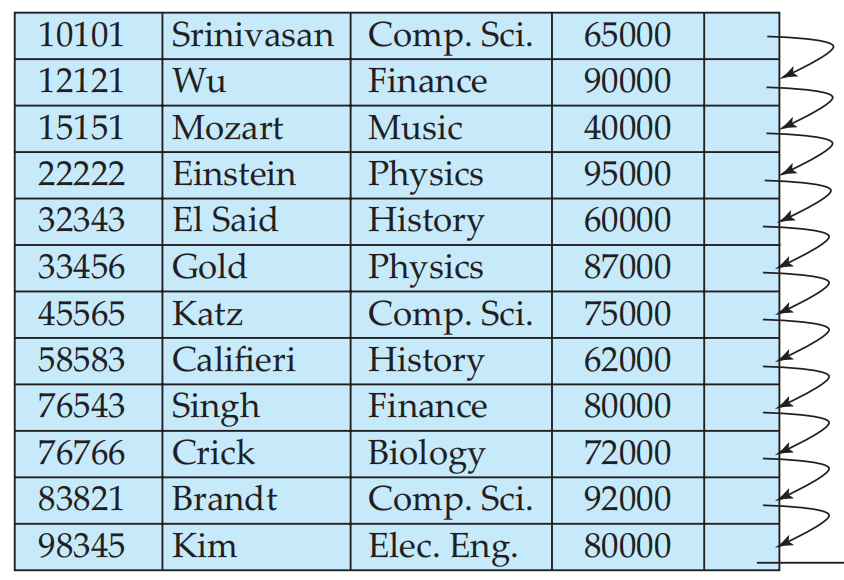

插入和删除记录时维护记录的物理顺序是十分困难的，因为一次单独的插入或者删除操作导致移动很多记录是代驾很高的。可以根据之前的链表模式来管理

- 在文件中定位按搜索吗顺序处于待插入记录之前的那条记录
- 如果这条记录所在的块中有一条空闲记录（即删除后留下来的空间），就在这里插入新的记录。否则，降薪记录插入到一个一溢出块中。如下图所示

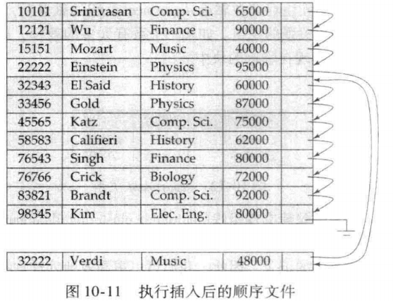

但是这种情况会导致搜索码顺序和物理顺序之间的一致性可能会完全丧失，在这种情况下，顺序处理将变得效率十分低下。此时，文件应该重组(reorganized)，使得它再一次在物理上顺序存放

### Multi-table Clustering File Organization 多表集群文档组织

- Store several different relations in one file  在一个文档中存储多个不同的关系
- 是一种在每一块中存储两个或者更多关系的相关记录的文件结构。因为，我们可以更高效地处理这种特殊的查询。

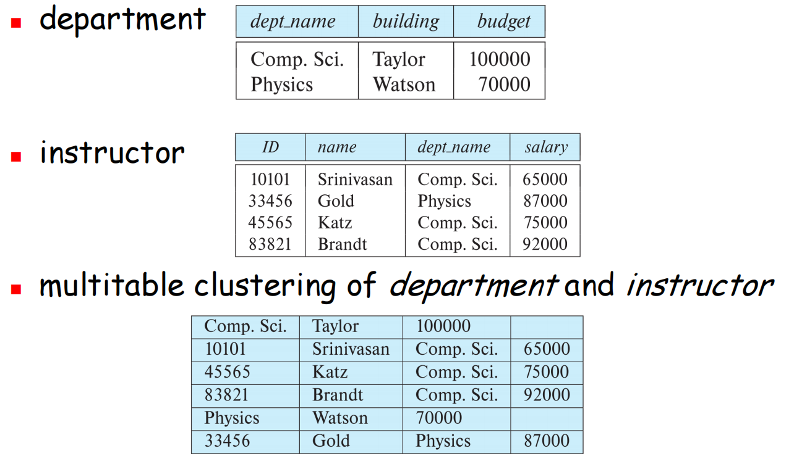

- Good for queries involving join (e.g. *department* and *instructor*)

  适用于涉及 join 的查询（例如 *department* 和 *instructor*）

- Bad for queries involving only one relation

  对于仅涉及一个关系的查询来说，这是个坏事

- Results in variable size records

  生成可变大小的记录

- Can add pointer chains to link records of a particular relation

  可以添加指针链以链接特定关系的记录

