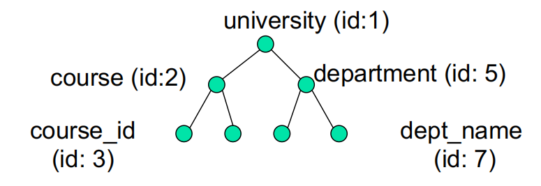

# Web Technologies 1

## RoadMap

- Structure of XML Data

- XML Document Schema

- Query and Transformation

- Application Program Interfaces to XML

- Storage of XML Data

- XML Applications

## XML Introduction 介绍

- XML: E**x**tensible **M**arkup **L**anguage

  可拓展标记语言

- Defined by the WWW Consortium (W3C)

  由 WWW 联盟 （W3C） 定义

- Derived from SGML (Standard Generalized Markup Language), but simpler

  源自 SGML（标准通用标记语言），但更简单

- Documents have tags giving extra information about sections of the document

  文档具有标签，提供有关文档各部分的额外信息

  - e.g. <title> XML </title> <slide> Introduction …</slide>

- **Extensible**, unlike HTML

  **可扩展**，与 HTML 不同

- Users can define and add new tags, and *separately* specify how the tag should be handled for display

  用户可以定义和添加新标签，并 *单独* 指定应如何处理标签以供显示

- The ability to specify new tags, and to create nested tag structures make XML a great way to **store** and **exchange data**.

  指定新标签和创建嵌套标签结构的能力使 XML 成为 **存储** 和 **交换数据** 的好方法。

- Tags make data (relatively) **self-documenting** (to humans)

  标签使数据(相对)自我记录(对人类)

```xml
<university>
    <department>
        <dept_name> Comp. Sci. </dept_name>
        <building> Taylor </building>
        <budget> 100000 </budget>
    </department>
    <course>
        <course_id> CS-101 </course_id>
        <title> Intro. to Computer Science </title>
        <dept_name> Comp. Sci </dept_name>
        <credits> 4 </credits>
    </course>
</university>
```

### XML: Motivation  使用动机

- Data interchange is critical in a networked world

  数据交换在网络化的世界中至关重要

- Each application area has its own set of standards for representing information

  每个应用进程区域都有自己的一组表示信息的标准

- Examples:

  案例

  - Banking: funds transfer

    银行:资金转账

  - Order processing (especially inter-company orders)

    订单处理(尤其是公司间的订单)

  - Scientific data

    科学数据

    - Chemistry: ChemML

    - Math: MathML

    - Genetics: BSML (Bio-Sequence Markup Language), …

- XML has been the basis for all new generation data interchange formats

  XML 是所有新一代数据交换格式的基础

- Earlier generation formats were based on plain text with line headers indicating the meaning of fields

  早期生成的格式基于纯文本,行标题表示字段的含义

  - Similar in concept to email headers

    类似于电子邮件标头的概念

  - Does not allow for nested structures, no standard “type” language

    不允许嵌套结构,没有标准的"类型"语言

  - Tied too closely to low level document structure (lines, spaces, etc)

    与低级文档结构(线条、空格等)过于紧密地联系在一起

- Each XML based standard defines what are valid elements, using

  每个基于 XML 的标准都定义了什幺是有效的元素, 使用

  - XML type specification languages to specify the syntax

    XML 类型规范语言来指定语法

    - **DTD** (Document Type Descriptors)

      DTD(文档类型描述符)

    - **XML Schema**

  - Plus textual descriptions of the semantics

    加上语义的文本描述

- XML allows new tags to be defined as required

  XML 允许根据需要定义新的标签

- A variety of tools is available for parsing, browsing and querying XML documents/data

  有多种工具可用于解析、浏览和查询 XML 文档/数据

### Comparison with Relational Data  与关系数据的比较

- **Inefficient**: tags, which represent schema information, are repeated

  效率低下:代表模式信息的标签被重复使用

- **Better** than relational tuples as a data **exchange** format

  作为数据交换格式优于关系元组

  - Self-documenting due to presence of tags

    由于标签的存在而自我记录

  - Non-rigid format: new tags can be added

    非刚性格式:可以添加新的标签

  - Allows nested structures

    允许嵌套结构

  - Wide acceptance

    广泛接受

    - not only in database systems, but also in browsers, tools, and applications

      不仅在数据库系统中，而且在浏览器、工具和应用进程中

## Structure of XML Data XML语法

- **Tag**: label for a section of data

  **标签**:数据部分的标签

- **Element**: section of data beginning with <tag> and ending with matching </tag>

  **元素**：以 标签头<tag> 开头并以匹配的 标签尾结束 </tag> 

- Elements must be **properly nested**

  元素必须 **正确嵌套**

  - Proper nesting

    适当的嵌套

    <course> … <title> …. </title> </course> 

  - Improper nesting 

    嵌套不当

    <course> … <title> …. </course> </title> 

  - Formally: every start tag **must** have a unique matching end tag, that is in the context of the same parent element.

    正式地：每个开始标签 **必须** 有一个唯一匹配的结束标签，即在同一个父元素的上下文中。

- Every document must have a single **top-level element**

  每个文档都必须有一个**顶级元素**

#### Attributes 属性

- Elements can have **attributes**

  元素可以具有 **属性**

```xml
<course course_id= “CS-101”>
	<title> Intro. to Computer Science</title>
	<dept name> Comp. Sci. </dept name>
	<credits> 4 </credits>
</course>
```

- Attributes are specified by **name=value** pairs inside the **starting tag** of an element

  属性由元素起始标签内的 name=value 对指定

- An element may have several attributes, but each attribute name can only occur once

  一个元素可以有多个属性，但每个属性名称只能出现一次

  <course course_id = “CS-101” credits=“4”>

#### Attributes vs. Subelements

- Distinction between subelement and attribute

  子元素和属性之间的区别

  - In the context of documents, attributes are part of markup, while subelement contents are part of the basic document contents

    在文档的上下文中，属性是标记的一部分，而子元素内容是基本文档内容的一部分

  - In the context of data representation, the difference is unclear and may be confusing

    在数据表示的上下文中，差异不清楚，可能会令人困惑

    - Same information can be represented in both ways

      相同的信息可以用两种方式表示

      - <course course_id= “CS-101”> … </course>

      - <course> 

        ​    <course_id>CS-101</course_id> …

        </course>

- Suggestion: use attributes for **identifiers** of elements, and use subelements for **contents**

  建议：对元素的标识符使用属性，对内容使用子元素

### Namespace  命名空间

- XML data has to be exchanged between organisations

- Same tag name may have different meaning in different organisations, causing confusion on exchanged documents

- Specifying a unique string as an element name avoids confusion

- Better solution: use **unique-name:element-name**

- Avoid using long unique names all over document by using **XML Namespaces**

```xml
<university xmlns:yale="http://www.yale.edu">
	… 
    <yale:course>
    	<yale:course_id> CS-101 </yale:course_id>
        <yale:title> Intro.to.Computer.Science </yale:title>
		<yale:dept_name> Comp. Sci. </yale:dept_name> 
    	<yale:credits> 4 </yale:credits>
	</yale:course> 
	…
</university>
```

## XML Document Schema  XML文档架构

### Definition

- XML schema languages **define structure** and **constrain contents** of XML documents 

  XML 架构语言 **定义 XML 文档的结构** 和 **约束内容**

  - They are **not** required to have an associated schema

    它们 **不需要** 具有关联的架构

  - However, they are important for XML data exchange

    但是，它们对于 XML 数据交换非常重要

- Two languages (or mechanisms) for specifying XML schema

  用于指定 XML 架构的两种语言（或机制）

  - **Document Type Definition (DTD)**

  - **XML Schema**

### Document Type Definition (DTD)

- The type of an XML document can be specified using a DTD

  可以使用 DTD 指定 XML 文档的类型

- DTD constraints **structure** of XML data

  XML 数据的 DTD 约束 **结构**

  - What elements can occur

    那些元素可以出现

  - What attributes can/must an element have

    那些属性 能/必须 出现在元素中

  - What subelements can/must occur inside each element and how many times

    每个元素中可以/必须出现哪些子元素以及出现次数

- DTD does **not** constrain data types

  DTD 不限制数据类型

  - All values represented as **strings** in XML

    在 XML 中所有的值都表示为 **strings** 

- DTD syntax 语法

  - <!ELEMENT element (subelements-specification) >

  - <!ATTLIST element (attributes) >

#### Element Specification in DTD  DTD 中的元素规范

- Subelements can be specified as

  子元素可以指定为

  - names of elements, followed by

    元素名称，后跟

  - #PCDATA (parsed character data), i.e. character strings, or

    #PCDATA（解析的字符数据），即字符串，或

  - EMPTY (no subelements) or ANY (anything can be a subelement)

    EMPTY （无子元素） 或 ANY （任何东西都可以是子元素）

- Example

  <! ELEMENT department (dept_name, building, budget)>

  <! ELEMENT dept_name (#PCDATA)>

  <! ELEMENT budget (#PCDATA)>

- Subelement specification may have regular expressions

  子元素规范可以具有正则表达式

  <!ELEMENT university ( ( department | course | instructor | teaches )+)>

  - Notation: 

    - “|” - alternatives

    - “+” - 1 or more occurrences

    - “*” - 0 or more occurrences

#### Attributes Specification in DTD  DTD中的属性规范

- Attribute specification: for each attribute 

  属性规范：针对每个属性

  - Name

    名字

  - Type of attribute 

    属性类别

    - CDATA

    - ID (identifier) or IDREF (ID reference) or IDREFS (multiple IDREFs) 

  - Whether 

    - mandatory (#REQUIRED)

    - has a default value (value), 

    - or neither (#IMPLIED)

- Examples

  - <!ATTLIST course course_id CDATA #REQUIRED>

  - <!ATTLIST course course_id

    ID #REQUIRED

    dept_name IDREF #REQUIRED

    instructors IDREFS #IMPLIED >

**定义：**
DTD 是一种早期的 XML 验证技术，用于定义 XML 文档的合法结构和元素间的关系。

**特点：**

1. **基于声明：**
   使用非 XML 的语法定义 XML 文档的结构和约束。
2. **不支持数据类型：**
   DTD 仅能验证元素是否存在及其结构，但不支持具体的数据类型约束（如数字范围、日期格式等）。
3. **较简单：**
   适用于简单的 XML 文档结构。
4. **兼容性强：**
   由于其历史悠久，广泛支持但功能有限。

**用途：**

- 定义元素、属性和嵌套关系。
- 验证 XML 文档结构是否正确。

```dtd
<!DOCTYPE person [
  <!ELEMENT person (name, age)>
  <!ELEMENT name (#PCDATA)>
  <!ELEMENT age (#PCDATA)>
]>
<person>
  <name>John</name>
  <age>30</age>
</person>
```

参数

- **PCDATA** 是 "Parsed Character Data" 的缩写。

  - 表示 **元素的内容是文本数据**，并且这些数据可以包含由 XML 解析器处理的字符数据（例如，特殊字符会被解析）。

  - 这是 XML 中最常见的内容类型之一，表明该元素内部只能包含文本，而不能包含子元素。

```dtd
<!ELEMENT name (#PCDATA)>
<name>John Doe</name>
```

这里，`<name>` 元素的内容必须是纯文本，例如 `John Doe`。

- **REQUIRED** 表示该属性是 **必需的**，即每个相关的元素都必须指定这个属性。

```dtd
<!ATTLIST 元素名 属性名 属性类型 #REQUIRED>

<!ELEMENT book EMPTY>
<!ATTLIST book isbn CDATA #REQUIRED>
```

这里，`<book>` 元素必须包含一个 `isbn` 属性，例如：<book isbn="1234567890" />

如果缺少isbn，则无效

- **IMPLIED** 表示该属性是 **可选的**，即可以省略它。如果没有指定值，XML 文档依然是合法的。

```dtd
<!ATTLIST 元素名 属性名 属性类型 #IMPLIED>

<!ELEMENT book EMPTY>
<!ATTLIST book 
  publisher CDATA #IMPLIED>
```

这里，`<book>` 元素可以选择包含 `publisher` 属性，例如：<book publisher="Oxford Press" /> 或 <book />

- **ID** 表示一个唯一标识符。

  - 每个元素中最多只能有一个属性被声明为 `ID` 类型，并且它的值在整个 XML 文档中必须是唯一的。

  - 值必须是一个以字母或下划线开头的合法 XML 名称。

```dtd
!ATTLIST 元素名 属性名 ID #REQUIRED>

<!ELEMENT student EMPTY>
<!ATTLIST student id ID #REQUIRED>

合法案例
<student id="S001" />
<student id="S002" />

不合法案例
<student id="S001" />
<student id="S001" /> <!-- 错误：重复的ID -->
```

- **IDREF** 是一个引用，用来指向文档中已定义的 `ID`。
  - 它表示该属性的值必须与文档中某个元素的 `ID` 属性的值一致。

```dtd
<!ATTLIST 元素名 属性名 IDREF #REQUIRED>

<!ELEMENT enrollment EMPTY>
<!ATTLIST enrollment student_id IDREF #REQUIRED>

合法案例
<student id="S001" />
<enrollment student_id="S001" />

不合法案例
<enrollment student_id="S003" /> <!-- 错误：没有S003的ID -->
```

- **IDREFS** 是多个 IDREF 的集合。
  - 它的值可以包含多个以空格分隔的 `ID` 引用，每个引用都必须指向文档中的一个有效 `ID`。

```dtd
<!ATTLIST 元素名 属性名 IDREFS #REQUIRED>

<!ELEMENT project EMPTY>
<!ATTLIST project team_members IDREFS #REQUIRED>

合法案例
<student id="S001" />
<student id="S002" />
<student id="S003" />
<project team_members="S001 S002 S003" />

不合法案例
<project team_members="S001 S004" /> <!-- 错误：没有S004的ID -->
```

#### Limitation of DTDs  DTD 的限制

- **No typing** of text elements and attributes

  **无需键入** 文本元素和属性

  - All values are strings, no integers, reals, etc.

    所有值都是字符串，没有整数、实数等。

- Difficult to specify **unordered** sets of subelements

  难以指定 **无序** 子元素集

  - (A | B)* allows specification of an unordered set, but Cannot ensure that each of A and B occurs only once

    （A |B）* 允许指定无序集，但无法确保 A 和 B 中的每一个都只出现一次

- IDs and IDREFs are **untyped**

  ID 和 IDREF 是 **untypeed**

  - The *instructors* attribute of a course may contain a reference to another course, which is meaningless

    课程的 *instructors* 属性可能包含对另一门课程的引用，这毫无意义

    - *instructors* attribute should ideally be constrained to refer to instructor elements

      理想情况下，应将 *instructors* 属性限制为引用 instructor 元素

### XML Schema

- XML Schema is a powerful while sophisticated schema language which addresses the drawbacks of DTDs.

  XML Schema 是一种功能强大但复杂的架构语言，它解决了 DTD 的缺点。

  - **Typing** of values

    值的 **键入**

    - e.g. integer, string, etc

      例如，整数、字符串等

    - Also, constraints on min/max values

      此外，对 min/max 值的约束

  - User-defined, **complex** types (objects)

    用户定义的 **复杂** 类型（对象）

  - Many more features, including

    更多功能，包括 -

    - **uniqueness** and foreign key constraints, inheritance, etc

      **唯一性** 和外键约束、继承等

- XML Scheme is integrated with namespaces 

  XML Scheme 与命名空间集成

- XML Schema is itself specified in **XML syntax**, unlike DTDs

  XML 架构本身是用 **XML 语法**指定的，这与 DTD 不同

  - More-standard representation, but verbose

    更标准的表示形式，但冗长

  - XML Schema is significantly more complicated than DTDs

    XML 架构比 DTD 复杂得多

## Querying and Transforming XML Data  查询和转换XML数据

- **Query** and **transformation** of XML data are closely related, and handled by the same set of tools

  XML 数据的 **查询** 和 **转换** 密切相关，并由同一组工具处理

  - Transformation: translate information from one XML to another (with different schemas)

    转换：将信息从一个 XML 转换为另一个 XML（具有不同的架构）

- Standard XML querying/transformation languages

  标准 XML 查询/转换语言

  - **XPath**

    - Simple language consisting of path expressions

      由路径表达式组成的简单语言

  - **XSLT**

    - Simple language designed for translation from XML to XML and XML to HTML

      专为从 XML 到 XML 和 XML 到 HTML 的翻译而设计的简单语言

  - **XQuery**

    - An XML query language with a rich set of features

      具有丰富功能集的 XML 查询语言

#### Tree Model of XML Data  XML 数据的树模型

- Query and transformation languages are based on a **tree model** of XML data

  查询和转换语言基于 XML 数据的 **树模型**

- An XML document is modeled as a **tree**, with **nodes** corresponding to **elements** and **attributes**

  XML 文档被建模为 **tree**，其中 **nodes** 对应于元素和属性

  - Element nodes have child nodes, which can be attributes or subelements

    元素节点具有子节点，这些子节点可以是属性或子元素

  - Text in an element is modeled as a text node child of the element

    元素中的文本建模为元素的子文本节点

  - Children of a node are ordered according to their order in the XML document

    节点的子节点根据它们在 XML 文档中的顺序进行排序

  - Element and attribute nodes (except for the root node) have a single parent, which is an element node

    元素和属性节点（根节点除外）具有单个父节点，即元素节点

  - The root node has a single child, which is the root element of the document

    根节点有一个子节点，它是文档的根元素

### Storage of XML Data

- XML data can be stored in 

  XML 数据可以存储在

  - **Non-relational data stores**

    非关系数据存储

    - **Flat files**

      平面文档

      - Natural for storing XML

        自然用于存储 XML

      - But has all problems, e.g. no concurrency, no recovery

        但是存在所有问题，例如没有并发、没有恢复

    - **XML database**

      XML 数据库

      - Database built specifically for storing XML data, supporting DOM model and declarative querying, e.g. eXist-db.

        专为存储 XML 数据而构建的数据库，支持 DOM 模型和声明式查询，例如 eXist-db。

  - Relational databases

    关系数据库

    - **String** Representation

      **字符串**表示

    - **Tree** Representation

      **树** 表示

    - **Map to** relations

      **映射到** 关系

    - Data must be translated into relational form

      数据必须转换为关系形式

      - Advantage: uses mature database systems

        优点：使用成熟的数据库系统

      - Disadvantages: overhead of translating data and queries

        缺点：翻译数据和查询的开销

## Application Program Interface  应用进程接口

- There are two standard application programming interfaces to XML data:

  有两种标准的 XML 数据应用进程编程接口:

  - **SAX** (Simple API for XML)

    **SAX** （用于 XML 的简单 API）

    - Based on parser model, user provides handlers for parsing events 

      基于 parser 模型，用户提供用于解析事件的处理进程

      - e.g. start of element, end of element

        例如，元素的开头、元素的结尾

  - **DOM** (Document Object Model)

    **DOM** （文档对象模型）

    - **XML** data is parsed into a tree representation 

      **XML** 数据被解析为树表示

    - Variety of functions provided for traversing the DOM tree

      为遍历 DOM 树提供了多种函数

    - e.g. Java DOM API provides Node class with methods

      例如，Java DOM API 提供带有 Method 的 Node 类

      getParentNode( ), getFirstChild( ), getNextSibling( ), getAttribute( ), getData( ), getElementsByTagName( ) …

    - Also provides functions for updating DOM tree

      还提供更新 DOM 树的函数

### XML Applications  应用进程

- Data **mediation**: storing and exchanging **data with complex structures**

  数据 **中介**：存储和交换 **具有复杂结构的数据**

  - Common data representation format to bridge different systems

    通用数据表示格式，用于桥接不同系统

  - Open Document Format (ODF) format standard for storing Open Office, and Office Open XML (OOXML) format standard for storing Microsoft Office documents

    用于存储 Open Office 的 Open Document Format （ODF） 格式标准，以及用于存储 Microsoft Office 文档的 Office Open XML （OOXML） 格式标准

  - Numerous other standards for a variety of applications

    适用于各种应用的众多其他标准

    - ChemML, MathML, SensorML, etc

- Standards for data exchange in SOAP **Web services**

  SOAP **Web 服务**中的数据交换标准

  - Remote method invocation over HTTP protocol

    通过 HTTP 协议进行远程方法调用

  - A (SOAP) Web *service* provides a collection of SOAP procedures

    （SOAP） Web *服务* 提供 SOAP 过程的集合

    - **Simple Object Access Protocol (SOAP)** standard: invocation of procedures across applications

      **简单对象访问协议 （SOAP）** 标准：跨应用进程调用过程

    - Described using the **Web Services Description Language (WSDL)**

      使用 **Web 服务描述语言 （WSDL） ** 进行描述

    - Directories of Web services are described using the Universal Description, **Discovery, and Integration (UDDI)** standard

      Web 服务的目录使用通用描述、**发现和集成 （UDDI）** 标准进行描述

    - More from *https://www.w3.org/2002/ws*

<hr>

# 补充

## String Representation

- Store each top level element as a string field of a tuple in a relational database

  将每个顶级元素存储为关系数据库中元组的字符串字段

  - Use a single relation to store all elements, or

    使用单个关系存储所有元素，或者

  - Use a separate relation for each top-level element type

    对每个顶级元素类型使用单独的关系

    - e.g. account, customer, depositor relations

      例如：账户、客户、存款人关系

      - Each with a string-valued attribute to store the element

        每个都有一个字符串值属性来存储元素

- Indexing: 索引

  - Store values of subelements/attributes to be indexed as extra fields of the relation, and build indices on these fields

    存储要作为关系的额外字段编制索引的子元素/属性的值，并在这些字段上构建索引

    - e.g. customer_name or account_number

      例如 customer_name 或 account_number

  - Some database systems support **function indices**, which use the result of a function as the key value. 

    某些数据库系统支持 **函数索引**，它使用函数的结果作为键值。

    - The function should return the value of the required subelement/attribute

      该函数应返回所需子元素/属性的值

- Benefits:  优势

  - Can store any XML data even without DTD

    即使没有 DTD,也可以存储任何 XML 数据

  - Allows fast access to individual elements.

    允许快速访问单个元素。

- Drawback**:** 劣势

  - Need to parse strings to access values inside the elements

    需要解析字符串以访问元素内部的值

  - Parsing is slow

    解析速度慢

## Tree Representation

- Model XML data as tree and store using relations

  使用关系将 XML 数据建模为树和存储

  *nodes(id, parent_id, type, label, value)*



- Each element/attribute is given a unique identifier

  每个元素/属性都有一个唯一的标识符

- Type indicates element/attribute

  Type表示elementattribute

- Label specifies the tag name of the element/name of attribute

  Label 指定元素的标签名称/属性的名称

- Value is the text value of the element/attribute

  Value 是元素/属性的文本值

- Can add an extra attribute *position* to record ordering of children

  可以添加一个额外的属性 *position* 来记录子项的顺序

- Benefit: 优势

  - Can store any XML data, even without DTD

    可以存储任何 XML 数据，即使没有 DTD -

- Drawbacks: 劣势

  - Data is broken up into too many pieces, increasing space overheads

    数据被分解成太多的片段，增加了空间开销

  - Even simple queries require a large number of joins, which can be slow

    即使是简单的查询也需要大量的联接，这可能会很慢

## Mapping XML Data to Relations

- Relation created for each element type whose schema is known:

  为其架构已知的每个元素类型创建的关系：

  - An id attribute to store a unique id for each element

    一个 id 属性，用于存储每个元素的唯一 ID

  - An attribute corresponding to each element attribute

    一个 id 属性，用于存储每个元素的唯一 ID

  - A parent_id attribute to keep track of parent element

    用于跟踪父元素的 parent_id 属性

    - As in the tree representation

      与树表示形式相同

    - Position information (i th child) can be store

      可以存储位置信息（第 i 个子项）

- All subelements that occur only once can become relation attributes

  所有只出现一次的子元素都可以成为关系属性

  - For text-valued subelements, store the text as attribute value

    对于文本值子元素，将文本存储为属性值

  - For complex subelements, can store the id of the subelement

    对于复杂的子元素，可以存储子元素的 id

- Subelements that can occur multiple times represented in a separate table

  可以在单独的表中多次出现的子元素

  - Similar to handling of multivalued attributes when converting ER diagrams to tables

    类似于将 ER 图转换为表时处理多值属性

## XPath

- XPath is used to address (select) parts of documents using **path expressions**

  XPath 用于使用 **path 表达式** 对文档的某些部分进行寻址 （select）

- A path expression is a sequence of steps separated by “/”

  路径表达式是由 “/” 分隔的步骤串行

  - Think of file names in a directory hierarchy

    考虑目录层次结构中的文档名

- Result of path expression: set of values that along with their containing elements/attributes match the specified path 

  路径表达式的结果：与其包含元素/属性匹配的值集

- E.g., /university-3/instructor/name evaluated on the university-3 data we saw earlier returns (see the examples in textbook)

  例如，根据我们之前看到的 university-3 数据评估 /university-3/instructor/name 返回（参见教科书中的示例）

​	<name>Srinivasan</name>

​	<name>Brandt</name>

- E.g., /university-3/instructor/name/text( ) returns the same names, but without the enclosing tags

  例如，/university-3/instructor/name/text（ ） 返回相同的名称，但没有封闭的标签

## XSLT

- A **stylesheet** stores formatting options for a document, usually separately from document

  **样式表** 存储文档的格式选项，通常与文档分开

  - e.g. an HTML style sheet may specify font colors and sizes for headings, etc.

    例如，HTML 样式表可以指定标题的字体颜色和大小等。

- The **XML Stylesheet Language (XSL)** was originally designed for generating HTML from XML

  **XML 样式表语言 （XSL）** 最初是为从 XML 生成 HTML 而设计的

- XSLT is a general-purpose transformation language 

  XSLT 是一种通用转换语言

  - Can translate XML to XML, and XML to HTML

    可以将 XML 转换为 XML，将 XML 转换为 HTML

- XSLT transformations are expressed using rules called **templates**

  XSLT 转换使用称为 **templates** 的规则表示

  - Templates combine selection using XPath with construction of results

    模板将使用 XPath 进行选择与结果构建相结合

## XQuery

- XQuery is a general purpose query language for XML data 

  XQuery 是一种用于 XML 数据的通用查询语言

- Standardised by the World Wide Web Consortium (W3C)

  由万维网联盟 （W3C） 标准化

  - The textbook description is based on a January 2005 draft of the standard. The final version may differ, but major features likely to stay unchanged.

    教科书描述基于 2005 年 1 月的标准草案。最终版本可能会有所不同，但主要功能可能会保持不变。

- XQuery is derived from the Quilt query language, which itself borrows from SQL, XQL and XML-QL

  XQuery 源自 Quilt 查询语言，而 Quilt 查询语言本身借鉴了 SQL、XQL 和 XML-QL

- XQuery uses **FLWOR** (i.e., **for … let … where … order by** **…return**…) syntax

  XQuery 使用 **FLWOR**

  - **for** <=> SQL **from**

  - **let** allows temporary variables, and has no equivalent in SQL

  - **where** <=> SQL **where**

  - **order by** <=> SQL **order by**
  - **return** <=> SQL **select**

## SQL Extensions – Example on SQL Output in XML  

## XML中的 SQL 输出示例

- **xmlelement** creates XML elements

- **xmlattributes** creates attributes

  ```sql
  select xmlelement (name “course”,
  	xmlattributes (course id as course id, dept name as dept name),
  	xmlelement (name “title”, title),
  	xmlelement (name “credits”, credits))
  from course
  ```

- **Xmlagg** creates a forest of XML elements

  ```sql
  select xmlelement (name “department”, 
  	dept_name,
  	xmlagg (xmlforest(course_id)
  			order by course_id))
  from course
  group by dept_name
  ```

## Storing XML Data in Relational Systems  在关系系统中存储 XML 数据

- Applying above ideas to department elements in university-1 schema, with nested course elements, we get 

  将上述想法应用于 university-1 模式中的部门元素，使用嵌套的 course 元素，我们得到

  *department*(*id*, *dept_name*, *building*, *budget*)*course*(*parent id*, *course_id*, *dept_name*, *title*, *credits*)

- **Publishing**: process of converting relational data to an XML format

  **发布**：将关系数据转换为 XML 格式的过程

- **Shredding**: process of converting an XML document into a set of tuples to be inserted into one or more relations

  **Shredding**：将 XML 文档转换为一组元组以插入到一个或多个关系中的过程

- XML-enabled database systems support automated publishing and shredding

  支持 XML 的数据库系统支持自动发布和切碎

- Many systems offer *native storage* of XML data using the xml data type. Special internal data structures and indices are used for efficiency

  许多系统使用 xml 数据类型提供 XML 数据的 * 本机存储* 。使用特殊的内部数据结构和索引以提高效率

## XPath Continued

- The initial “/” denotes root of the document (above the toplevel tag)

  首字母 “/” 表示文档的根（在 toplevel 标签上方）

- Path expressions are evaluated left to right

  路径表达式从左到右计算

  - Each step operates on the set of instances produced by the previous step

    每个步骤都对上一步生成的实例集进行操作

- Selection predicates may follow any step in a path, in [ ]

  选择谓词可以遵循路径中的任何步骤，位于 [ ] 中

  - E.g., /university-3/course[credits >= 4] 

    - Returns elements with a value greater than 4

      返回值大于 4 的元素

    - /university-3/course[credits] returns account elements containing a credits subelement

      /university-3/course[credits] 返回包含 credits 子元素的 account 元素

- Attributes are accessed using “@”

  使用 “@” 访问属性

  - E.g., /university-3/course[credits >= 4]/@course_id

    - returns the course identifiers of courses with credits >= 4

      返回学分为 >= 4 的课程的课程标识符

  - IDREF attributes are not dereferenced automatically (more on this later)

    IDREF 属性不会自动取消引用（稍后将详细介绍）

### Functions XPath

- XPath provides several functions

  XPath 提供了多种功能

  - The function count() at the end of a path counts the number of elements in the set generated by the path

    路径末尾的函数 count（） 计算路径生成的集合中的元素数

    - E.g., /university-2/instructor[count(./teaches/course)> 2]

      - Returns instructors teaching more than 2 courses (on university-2 schema)

        返回教授 2 门以上课程的教师（在 university-2 架构上）

  - Also function for testing position (1, 2, ..) of node w.r.t. siblings

    也可用于测试节点 w.r.t. 兄弟姐妹的位置 （1， 2， ..）

- Boolean connectives and and or and function not() can be used in predicates

  布尔连接词 and and and or 和 function not（） 可以在谓词中使用

- IDREFs can be referenced using function id()

  可以使用函数 id（） 引用 IDREF

  - id() can also be applied to sets of references such as IDREFS and even to strings containing multiple references separated by blanks

    id（） 还可以应用于引用集，例如 IDREFS，甚至包含多个引用的字符串，用空格分隔

  - E.g., /university-3/course/id(@dept_name)

    - returns all department elements referred to from the dept_name attribute of course elements.

      返回从 Course 元素的 dept_name 属性引用的所有 Department 元素。

### More XPath Features

- Operator “|” used to implement union 

  用于实现 union 的运算符 “|”

  - E.g., /university-3/course[@dept name=“Comp. Sci”] |/university-3/course[@dept name=“Biology”]

    - Gives union of Comp. Sci. and Biology courses

      提供 Comp. Sci. 和 Biology 课程的联合

    - However, “|” cannot be nested inside other operators.

      但是，“|” 不能嵌套在其他运算符中。

- “//” can be used to skip multiple levels of nodes 

  “//” 可用于跳过多级节点

  - E.g., /university-3//name 

    - finds any name element *anywhere* under the /university-3 element, regardless of the element in which it is contained.

      在 /university-3 元素下查找 /anywhere* 任何 name 元素，而不管它包含在哪个元素中。

- A step in the path can go to parents, siblings, ancestors and descendants of the nodes generated by the previous step, not just to the children

  路径中的一个步骤可以转到上一步生成的节点的父项、同级项、祖先和后代，而不仅仅是子项

  - “//”, described above, is a short from for specifying “all dscendants”

    “//”，如上所述，是指定 “all dscendants” 的缩写

  - “..” specifies the parent.

    “..” 指定父级。

- doc(name) returns the root of a named document

  doc（name） 返回命名文档的根目录

## FLWOR Syntax in XQuery 

- For clause uses XPath expressions, and variable in for clause ranges over values in the set returned by XPath

  For 子句使用 XPath 表达式，并且 for 子句中的变量范围大于 XPath 返回的集合中的值

- Simple FLWOR expression in XQuery 

  XQuery 中的简单 FLWOR 表达式

  - find all courses with credits > 3, with each result enclosed in an <course_id> .. </course_id> tag

    查找所有学分> 3 的课程，每个结果都包含在 .. 标签

    **for** $x **in** /university-3/course

    **let** $courseId := $x/@course_id

    **where** $x/credits > 3

    **return** <course_id> { $courseId } </course id>

  - Items in the **return** clause are XML text unless enclosed in {}, in which case they are evaluated

- Let clause not really needed in this query, and selection can be done In XPath. Query can be written as:

  此查询中不需要 Let 子句，可以在 XPath 中进行选择。Query 可以写成：

  **for** $x **in** /university-3/course[credits > 3] 

  **return** <course_id> { $x/@course_id } </course_id>

## Joins

- Joins are specified in a manner very similar to SQL

```sql
for $c in /university/course,
	$i in /university/instructor,
	$t in /university/teaches
where $c/course_id= $t/course id **and** $t/IID = $i/IID
return <course_instructor> { $c $i } </course_instructor>
```

- The same query can be expressed with the selections specified as XPath selections:

```sql
for $c in /university/course,
	$i in /university/instructor,
	$t in /university/teaches[ $c/course_id= $t/course_id 
                              and $t/IID = $i/IID]	
return <course_instructor> { $c $i } </course_instructor>
```

## Nested Queries

The following query converts data from the flat structure for university information into the nested structure used in university-1

以下查询将数据从 university 信息的平面结构转换为 university-1 中使用的嵌套结构

```sql
<university-1> 
{ for $d in /university/department
	return <department>
			{ $d/ * }
			{ for $c in /university/course[dept name = $d/dept name]
				return $c }
			</department>
}
{ for $i in /university/instructor
  return <instructor>
		{ $i/ * }
		{ for $c in /university/teaches[IID = $i/IID]
			return $c/course_id }
		</instructor>
}
</university-1>
```

## Sorting in XQuery 

- The **order by** clause can be used at the end of any expression. E.g. to return instructors sorted by name

  **order by** 子句可用于任何表达式的末尾。例如，返回按姓名排序的讲师

```sql
for $i in /university/instructor
order by $i/name
return <instructor> { $i/* } </instructor>
```

- Use **order by** $i/name **descending** to sort in descending order

  使用 **order by** $i/name **descending** 按降序排序

- Can sort at multiple levels of nesting (sort departments by dept_name, and by courses sorted to course_id within each department)

  可以在多个嵌套级别进行排序（按 dept_name 排序，并按每个部门内course_id的课程排序）

```sql
<university-1> {
for $d in /university/department
order by $d/dept name
return
	<department>
	{ $d/ * }
	{ for $c in /university/course[dept name = $d/dept name]
	order by $c/course id
	return <course> { $c/ * } </course> }
	</department>
} </university-1>
```

## Functions and Other XQuery Features  XQuery 函数和其他特性

- User defined functions with the type system of XML Schema

  具有 XML Schema 类型系统的用户定义函数

```sql
declare function local:dept_courses($iid as xs:string) 
	as element(course)* 
{
	for $i in /university/instructor[IID = $iid],
		$c in /university/course[dept_name = $i/dept name]
	return $c
}
```

- Types are optional for function parameters and return values

  类型对于函数参数和返回值是可选的

- The (as in decimal) indicates a sequence of values of that type

  （如 decimal 中所示）表示该类型的值串行

- Universal and existential quantification in where clause predicates

  where 子句谓词中的通用和存在量化

  - **some** $e **in** *path* **satisfies** *P*

  - **every** $e **in** *path* **satisfies** *P*

  - Add **and fn:exists($e)** to prevent empty $e from satisfying **every** clause

- XQuery also supports If-then-else clauses

  XQuery 还支持 If-then-else 子句
