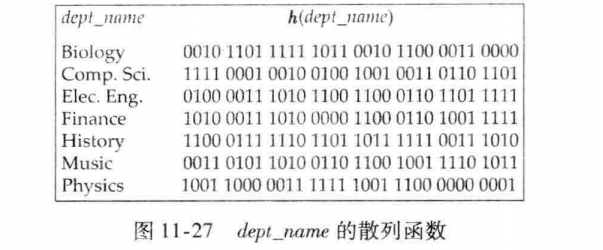

# Hash Indexing

详见书本第11.7 动态散列；书签321页

## Structure of Static Hash 静态哈希结构

- A **bucket** is a unit of **storage containing** one or more records (a bucket is typically a disk block). 

  存储桶是包含一个或多个记录的存储单元（存储桶通常是一个磁盘块）。

- **Hash function *h*** is a function from the set of all search-key values K to the set of all bucket addresses B.

  哈希函数 *h* 是从所有搜索键值 K 的集合到所有存储桶地址集合 B 的函数。

- Hash function is used to locate records for access, insertion as well as deletion.

  Hash 函数用于查找记录以进行访问、插入和删除。

- Records with different search-key values may be mapped to the same bucket; thus entire bucket has to be searched sequentially to locate a record.

  具有不同 search-key 值的记录可以映射到同一个存储桶;因此，必须按顺序搜索整个存储桶才能找到记录。

  - In a hash index, buckets store entries with pointers to records.

    在哈希索引中，存储桶存储带有指向记录的指针的条目。

  - In a hash file organization buckets store records.

    在哈希文档中，存储桶存储记录。

### Hash Function

- Worst hash function maps all search-key values to the same bucket; this makes access time proportional to the number of search-key values in the file.

  最差哈希函数将所有搜索键值映射到同一个存储桶;这使得访问时间与文档中 search-key 值的数量成正比。

- An ideal hash function is uniform, i.e. each bucket is assigned the same (more or less) number of search-key values from the set of all possible values.

  理想的哈希函数是 uniform，即每个存储桶从所有可能值的集合中分配相同（或多或少）数量的搜索键值。

- Ideal hash function is random, i.e. it does not depend on the actual distribution of search-key values in the file.

  理想的哈希函数是随机的，即它不依赖于文档中 search-key 值的实际分布。

- If we have N buckets, numbered 0 to N-1, a hash function *h* of the following form works well in practice.

  如果我们有 N 个桶，编号为 0 到 N-1，那幺以下形式的哈希函数 *h* 在实践中效果很好。

  - *h*(value) = (a*value + b) mod N 

#### Example of Hash File Organization

Hash file organization of *instructor* file, using *dept_name* as key; assume there are 8 buckets

instructor文档的哈希文档组织，使用 *dept_name* 作为键;假设有 8 个存储桶

The binary representation of the *i* th character is assumed to be the integer *I*

第 i 个字符的二进制表示形式被假定为整数 *I*

The hash function returns the sum of the binary representations of the characters modulo 8

hash 函数返回以 8 为模数(求和8的余数)的字符的二进制表示之和，根据单词每个字母对应的数字和相加求与8的余数

- e.g. h(Music) = 1; h(History) = 2; h(Physics) = 3; h(Elec. Eng.) = 3

- h(Music) = (13+21+19+9+3) mod 8 = 65 mod 8 = 1

### Handling of Bucket Overflows  存储桶溢出的处理

- Bucket overflow can occur because of 

  存储桶溢出可能是由于

  - Insufficient buckets 

    桶数不足

  - Skew in distribution of records. This can occur due to two reasons:

    记录分布偏斜。这可能是由于两个原因造成的：

    - multiple records have same search-key value

      多条记录具有相同的 search-key 值

    - chosen hash function produces non-uniform distribution of key values

      Chosen Hash Function 产生键值的不均匀分布

- Although the probability of bucket overflow can be reduced, it cannot be eliminated; it is handled by using overflow buckets.

  虽然可以降低桶溢的概率，但不能消除;它是通过使用溢出桶来处理的

- **Overflow chaining** – the overflow buckets of a given bucket are chained together in a **linked list**.

  **溢出链接** – 给定存储桶的溢出存储桶在**链接列表**中链接在一起。

**桶溢出示例图：**

### Hash Index

- Hashing can be used not only for file organization, but also for index-structure creation. 

  哈希不仅可以用于文档组织，还可以用于创建索引结构。

- A hash index organizes the search keys, with their associated record pointers, into a hash file structure.

  哈希索引将搜索键及其关联的记录指针组织到哈希文档结构中。

- Strictly speaking, hash indices are always **secondary indices.**

  严格来说，哈希索引始终是 **二级索引**。也就是有两级的多级索引。

Example:

- Hash index on *instructor,* on attribute *ID*

  对 *instructor表、* 使用属性 *ID* 作为哈希索引

- The hash function h used here computes the sum of digits of ID modulo by 8, e.g. h(15151)=13 mod 8=5.

  这里使用的哈希函数 h 计算 ID 模数的位数和以 8 为单位，例如 h（15151）=13 mod 8=5。

### Deficiencies of Static Hashing  静态哈希的缺陷

- In static hashing, function *h* maps search-key values to a fixed set of B of bucket addresses. Databases grow or shrink with time. 

  在静态哈希中，函数 *h* 将搜索键值映射到一组固定的 B 个存储桶地址。数据库会随着时间的推移而增长或收缩。

  - If initial number of buckets is too small, and file grows, performance will degrade due to too many overflows.

    如果初始存储桶数太小，并且文档增长，则性能将因溢出过多而降低。

  - If space is allocated for anticipated growth, a significant amount of space will be wasted initially (and buckets will be underfull).

    如果为预期增长分配空间，则最初将浪费大量空间（并且存储桶将不足）。

  - If database shrinks, again space will be wasted.

    如果数据库收缩，将再次浪费空间。

- One solution: periodic re-organisation of the file with a new hash function

  一种解决方案：使用新的哈希函数定期重新组织文档

  - Expensive, disrupts normal operations

    成本高昂，会扰乱正常运营

- Better solution: allow the number of buckets to be modified dynamically - **Dynamic Hashing!**

  更好的解决方案：允许动态修改 Bucket 的数量 **Dynamic Hashing**！

## Dynamic Hashing  动态哈希

- Good for database that grows and shrinks in size

  适用于大小增大和缩小的数据库

- Allows the hash function to be **modified dynamically**

  允许 hash 函数被 **动态修改**

- **Extendable hashing** – one form of dynamic hashing

  **可扩展哈希** – 一种形式的动态哈希 

  - Hash function generates values over a large range — typically b-bit integers, e.g. b = 32.

    哈希函数生成大范围的值 — 通常是 b 位整数，例如 b = 32。

  - At any time use only a **prefix** of the hash function to index into a table of bucket addresses.

    在任何时候，都只需使用 hash 函数的 **prefix** 即可对存储桶地址表进行索引。 

  - Let the length of the prefix be i bits, 0 <= i <= 32. 

    设前缀的长度为 i 位，0 <= i <= 32。

    - **Bucket address table size** = 2i, initially i = 0.

      **存储桶地址表大小** = 2i，初始 i = 0。

    - Value of **i** grows and shrinks as the size of the database grows and shrinks.

      值 **i** 会随着数据库大小的增大和缩小而增大和缩小。

  - Multiple entries in the bucket address table may point to the same bucket.

    存储桶地址表中的多个条目可能指向同一个存储桶。

  - Thus, actual number of buckets is **< 2i**

    因此，实际桶数为 **< 2i**

    - The number of buckets also changes dynamically due to **coalescing** and **splitting** of buckets. 

      由于 Bucket 的 **合并** 和 **分裂** ，存储桶的数量也会动态变化。

### Example of Binary Representation  二进制表示示例

i=3

- 000, 001, 010, 011, 100, 101, 110, 111

i=4

- 0000, 0001, 0010, 0011, 0100, 0101, 0110, 0111, 1000, 1001, 1010, 1011, 1100, 1101, 1110, 1111

### Extendable Hash Structure

i = 2的时候，代表只看前两位

#### Use of Extendable Hash Structure

- Let the length of the prefix be i bits (write it on the top left of the bucket-address-table)

  让前缀的长度为 i 位（写在 bucket-address-table 的左上角）

- Each bucket j stores a value ij (write it on the top left of the bucket)

  每个存储桶 j 存储一个值 ij（写在存储桶的左上角）

- All the entries in the bucket address table that point to the same bucket have the same hash values on the first ij bits. The number of bucket address table entries that point to bucket *j* is: **2i - ij**

  存储桶地址表中**指向同一存储桶**的所有条目在前 ij 位上具有相同的哈希值。指向存储桶 *j* 的存储桶地址表条目数为：**2i - ij**

### Queries

To locate the bucket containing search-key Kj.:

要查找包含搜索键 Kj 的存储桶，请执行以下操作：

1. Compute h(Kj) = X
2. 计算 h（Kj） = X

2. Use the first i high order bits of X as a **displacement into bucket address** table, and follow the pointer to appropriate bucket

   使用X的前i位高阶位作为**桶地址表**的位移，并跟随指针到相应的桶

#### Queries Example:

- Assume *h*(x) = x mod 8; look up search key 5

- *h*(5) = 5 mod 8 = 5 = 101

- i=2; only look at first two bits (always from the left), **10**1

### Insertion

- To insert a record with search-key value Kj

  插入搜索键值为 Kj

  - Follow same procedure as look-up and locate the bucket, say j. 

    按照与查找相同的过程找到存储桶，比如 j。

  - If there is room in the bucket j insert record in the bucket. 

    如果存储桶中有空间，则 j 在存储桶中插入记录。

  - Else the bucket must be split and insertion reattempted (next slide)

    否则，必须拆分桶并重新尝试插入（下一张幻灯片）

    - Overflow buckets used instead in some cases (will see shortly)

      在某些情况下使用溢出存储桶（稍后将看到）

- To split a bucket j when inserting record with search-key value Kj.:

  在插入搜索键值为 Kj. 的记录时拆分存储桶 j：

  - If **i > ij** (more than one pointer to bucket j)

    如果 **i > ij**（指向存储桶 j 的多个指针）

    - allocate a new bucket z, and set ij = iz = (ij + 1)

      分配一个新的存储桶 z，并设置 ij = iz = (ij + 1)

    - Update the second half of the bucket address table entries originally pointing to j, to point to z

      将最初指向 j 的桶地址表条目的后半部分更新为 z

    - remove each record in bucket j and reinsert (possibly in j or z)

      删除存储桶 j 中的每条记录并**重新插入**（可能在 j 或 z 中）

    - re-compute new bucket for Kj and insert record in the bucket (further splitting is required if the bucket is still full)

      为 Kj 并在 bucket 中插入记录（如果 bucket 仍然满，则需要进一步切分）

- If **i > ij** (only one pointer to bucket j)

  如果 **i > ij**（只有一个指针指向存储桶 j）

  - If i reaches some limit b, or too many splits have happened in this insertion but still cannot insert, create an overflow bucket.

    如果 i 达到某个限制 b，或者此插入中发生了太多分片但仍无法插入，请创建一个溢出存储桶。

  - Else

    - increment i and double the size of the bucket address table

      增加 i 并使存储桶地址表的大小增加一倍

    - replace each entry in the bucket address table by two entries that point to the same bucket.

      将 Bucket Address 表中的每个条目替换为指向同一存储桶的两个条目。

    - re-compute new bucket address table entry for Kj

      重新计算 Kj

    - now i > ij so use the **first case** above.

      现在i > ij 所以使用上面的**第一种情况**。

### Deletion

- To delete a key value,

  删除键值 

  - locate it in its bucket and remove it. 

    在其存储桶中找到它并将其删除。

  - The bucket itself can be removed if it becomes empty (with appropriate updates to the bucket address table). 

    如果存储桶本身变为空，则可以将其删除（对存储桶地址表进行适当的更新）。

  - Coalescing of buckets can be done (can coalesce only with a “buddy” bucket having same value of ij and same ij –1 prefix, if it is present) 

    可以进行存储桶的合并（只能与具有相同值 ij 和相同 ij –1 前缀的“伙伴”存储桶合并，如果存在）

  - Decreasing bucket address table size is also possible

    还可以减小存储桶地址表的大小

    - Note: decreasing bucket address table size is an **expensive operation** and should be done only if number of buckets becomes much smaller than the size of the table 

      注意：减小 Bucket 地址表大小是一项**成本高昂**的操作，仅当 Bucket 数量远小于表的大小时，才应执行此操作

#### Insertion Example1

Consider the extendable hashing with hash function h(x) = x mod 8 and a bucket can hold three records. Draw the hash index after inserting 13. Initial hash index shown below.

考虑使用哈希函数 h（x） = x mod 8 的可扩展哈希，一个桶可以容纳三条记录。插入 13 后绘制哈希索引。初始哈希索引如下所示。

Insertion of 13

- h(13) = 13 mod 8 = 5 = 101, 13 should be in bucket 2, but there is no space and bucket 2 also can’t be split so we have to extend the hash index structure.

  h（13） = 13 mod 8 = 5 = 101,13 应该在桶 2 中，但没有空间，桶 2 也不能拆分，所以我们必须扩展哈希索引结构。

- **Double** the size of bucket address table

  **加倍** 桶地址表的大小

- Split bucket 2 and redistribute the entries in it 

  拆分存储桶 2 并重新分配其中的条目

- Re-insert search key 13

  重新插入搜索键 13

**Double Bucket Address Table:  双桶地址表**

- The intermediate hash index is shown below after doubling the size of the bucket address table.

  将 bucket 地址表的大小增加一倍后，中间哈希索引如下所示

- Search key 13 should be inserted to Bucket 2.

  应将搜索键 13 插入到存储桶 2 中。

**Split Bucket 2: 分裂桶2**

- Split the original ”bucket 2”.

  拆分原来的 “bucket 2”。

- Increment ij for Bucket 2 and 3.

  增量 ij 用于存储桶 2 和 3。

- n Reinsert search keys 4, 5 and 7

  n 重新插入搜索键 4、5 和 7

**Final result:**

- Re-insert search key 13.

#### Insertion Example2

Insert another record with search key *Comp.Sci.*

插入另一条搜索键为 *Comp.Sci.* 的记录

**因为同属于Comp.Sci搜索键，因此必须插入同一个bucket，但是一个bucket最多只能放2条数据，即使扩大bucket address table也无法改变这个事实，所以这个时候只能使用overflow bucket链接在原本的Comp.Sci桶之后**

**Use overflow bucket!  使用溢出存储桶**

### Examples

假设一个桶只能存储两条记录，首先插入记录(10101, Srinivason, Comp.Sci, 65000)。桶地址包含一个指向桶的指针，系统插入该条记录。接着，插入(12121, Wu, Finance, 90000)。

当试图插入下一条记录的时候(15151, Mozart, Music, 40000)时，桶已经满了。由于i=i0因此需要增加所使用的散列值中的位数。现在我们使用1位，允许有21 = 2个桶。这一位数的增加使桶地址表的大小必须加倍。

## Extendable Hashing vs. Other Schemes

- Benefits of extendable hashing: 

  可扩展哈希的好处

  - Hash performance does not degrade with growth of file

    哈希性能不会随着文档的增长而降低

  - Minimal space overhead

    最小的空间开销

- Disadvantages of extendable hashing

  可扩展哈希的缺点

  - Extra level of indirection to find desired record

    用于查找所需记录的额外间接级别

  - Bucket address table may itself become very big (larger than memory)

    Bucket 地址表本身可能会变得非常大（大于内存）

    - Cannot allocate very large contiguous areas on disk either

      也无法在磁盘上分配非常大的连续区域

    - Solution: B+-tree structure to locate desired record in bucket address table

      解决方案：B+ 树结构，用于在桶地址表中查找所需记录

  - Changing size of bucket address table is an expensive operation

    更改存储桶地址表的大小是一项昂贵的操作

  - Linear hashing is an alternative mechanism (not covered here)

    线性哈希是一种替代机制（此处未涵盖）

## Comparison of Ordered Indexing and Hashing  有序索引和哈希的比较

- The choice depends on

  选择取决于

  - Cost of periodic re-organisation

    定期重组的成本

  - Relative frequency of insertions and deletions

    插入和删除的相对频率

  - Is it desirable to optimize average access time at the expense of worst-case access time?

    是否希望以牺牲最坏情况下的访问时间为代价来优化平均访问时间？

  - Expected type of queries

    预期的查询类型

- In practice:  在实践中：

  - Hash-indices are extensively used in-memory

    哈希索引在内存中广泛使用

  - But not used much on disk

    但在磁盘上用得不多

  - Oracle supports static hash organization, but not hash indices

    Oracle 支持静态哈希组织，但不支持哈希索引

  - SQL Server and PostgreSQL do not support hashing on disk

    SQL Server 和 PostgreSQL 不支持在磁盘上进行哈希处理

## Type of Queries and Indices  查询和索引类型

- For Queries of the form:

  对于表单的 Queries：

  - Hashing is generally better at retrieving records having a specified value of the key

    哈希通常更擅长检索具有指定键值的记录

    - select A1, A2, … An from r where Ai = c

- For Queries of the form:
  - If range queries are common, ordered indices are to be preferred
    - select A1, A2, … An from r where Ai ≥c2 and Ai ≤c1

# Advanced Indexing  高级索引

- Write optimized index

  写入优化索引

- Bitmap index

  位图索引

- Bloom Filter

  布隆过滤器

- Spatial Index

  空间索引

- Temporal Index

  时间索引

## Write Optimized Index  写入优化索引

- Performance of B+-trees can be poor for write-intensive workload, e.g.

  对于写入密集型工作负载，B+ 树的性能可能很差，例如

  - One I/O per leaf, assuming all internal nodes are in memory

    每个叶一个 I/O，假设所有内部节点都在内存中

  - With magnetic disks, < 100 inserts per second per disk

    使用磁盘时，每个磁盘每秒< 100 个插入

  - With flash memory, one page overwrite per insert

    使用闪存时，每次插入一次页面覆盖

- Two approaches to reducing cost of writes

  降低写入成本的两种方法

  - Log-structured merge (LSM) tree
  
    对数结构合并树
  
  - Buffer tree
  
    缓冲区树

### LSM Tree

- Consider only inserts/queries for now

  现在只考虑插入/查询

- Records inserted first into in-memory tree (L0 tree)

  首先插入到内存中树中的记录（L0 树）

- When in-memory tree is full, records moved to disk (L1tree)

  当内存中树已满时，记录将移动到磁盘 （L1tree）

  - B+-tree constructed using bottom-up built by merging existing L1 tree with records from L0 tree

    B+ 树使用自下而上构建的 B+ 树，通过将现有 L1 树与 L0 树中的记录合并而构建

- When L1 tree exceeds some threshold, merge into L2 tree

  当 L1 树超过某个阈值时，合并到 L2 树中

  - And so on for more levels

    以此类推，获取更多级别

  - Size threshold for Li+1 tree is *k* times size threshold for Li tree 

    Li+1 树的大小阈值是 Li 树的大小阈值的 *k* 倍

- **Benefits** of LSM approach

  LSM 方法的好处

  - Inserts are done using only sequential I/O operations

    仅使用顺序 I/O 操作完成插入

  - Leaves are full, avoiding space wastage

    叶子饱满，避免空间浪费

  - Reduced number of I/O operations per record inserted as compared to normal B+-tree (up to some size)

    与普通 B+ 树相比，每条插入的记录的 I/O 操作数减少（最多一些大小）

- **Drawback** of LSM approach

  LSM 方法的缺点

  - Queries have to search multiple trees

    查询必须搜索多个树

  - Entire content of each level copied multiple times

    多次复制每个关卡的全部内容

- Stepped-merge index

  阶梯合并索引

  - Variant of LSM tree with multiple trees at each level

    LSM 树的变体，每个级别都有多个树

  - Reduces write cost compared to LSM tree

    与 LSM 树相比，降低了写入成本

  - But queries are even more expensive

    但查询的成本更高

    - Bloom filters to avoid lookups in most trees 

      布隆过滤器以避免在大多数树中查找

- Deletion handled by adding special “delete” entries

  通过添加特殊的 “delete” 条目来处理删除

  - Lookups will find both original entry and the delete entry, and return only those entries that do not have matching delete entry.

    查找将同时找到原始条目和删除条目，并仅返回那些没有匹配的删除条目的条目。

  - When trees are merged, if we find a delete entry matching an original entry, both are dropped.

    合并树时，如果我们找到与原始条目匹配的 delete 条目，则会删除这两个条目。

- Update handled using insert+delete.

  使用 insert+delete 处理更新。

- LSM trees were introduced for disk-based indices

  为基于磁盘的索引引入了 LSM 树

  - But useful to minimize erases with flash-based indices

    但对于使用基于 Flash 的索引最大限度地减少擦除很有用

  - The stepped-merge variant of LSM trees is used in many BigData storage systems.

    LSM 树的阶梯合并变体用于许多 BigData 存储系统。

    - Google BigTable, Apache Cassandra, MongoDB

      Google BigTable、Apache Cassandra、MongoDB

    - And more recently in SQLite4, LevelDB, and MyRocks storage engine of MySQL.

      最近在 SQLite4、LevelDB 和 MySQL 的 MyRocks 存储引擎中。

### Buffer Tree

- Alternative to LSM tree

  LSM 树的替代方案

- Key idea: each internal node of B+-tree has a buffer to store inserts

  关键思想： B+ 树的每个内部节点都有一个缓冲区来存储插入

  - Inserts are firs inserted into the buffer of the root

    插入是插入到根缓冲区中的第一根

  - Inserts are moved to lower levels when buffer is full

    当缓冲池已满时，插入片段被移动到较低的水平

  - With a large buffer, many records are moved to lower level each time

    使用较大的缓冲区时，每次都会将许多记录移动到较低的级别

- **Benefits**

  - Less overhead on queries; per record I/O decreases correspondingly 

    查询开销更少;每条记录的 I/O 相应地减少

  - Can be used with any tree index structure
    
    可与任何树索引结构一起使用
    
    - Used in PostgreSQL Generalised Search Tree (GiST) indices
    
      用于 PostgreSQL 广义搜索树 （GiST） 索引

- **Drawback**: 

  - more random I/O than LSM tree

    比 LSM 树更多的随机 I/O

## Bitmap Index  位图索引

- A bitmap is simply an array of bits

  位图只是一个位数组

- Bitmap index is a special type of index designed for efficient query on multiple keys

  Bitmap index 是一种特殊类型的索引，旨在对多个 key 进行高效查询

- Records in a relation are assumed to be numbered sequentially 

  假定关系中的记录按顺序编号

- Applicable on attributes that take on a relatively **small number of distinct values**

  适用于具有相对 **少量不同值** 的属性

  - e.g. gender, country, state, …

    例如：gender， country， state， ...

  - e.g. income-level (income broken up into a small number of levels such as 0-9999, 10000-19999, 20000-50000, 50000-infinity)

    例如，收入水平（收入分为几个级别，例如 0-9999、10000-19999、20000-50000、50000-无穷大）

- In its simplest form, a bitmap index on an attribute has a bitmap for each value of the attribute

  在最简单的形式中，属性上的位图索引具有属性的每个值的位图

  - Bitmap has as many bits as records

    位图的位数与记录数一样多

  - In a bitmap for value v, the bit for a record is 1 if the record has the value v for the attribute, and is 0 otherwise

    在值 v 的位图中，如果记录的属性值为 v，则记录的位为 1，否则为 0

- Bitmap indices are useful for queries on multiple attributes 

  位图索引可用于对多个属性的查询

  - not particularly useful for single attribute queries

    对于单个属性查询不是特别有用

  - Bitmap indices generally very small compared with relation size

    与关系大小相比，位图索引通常非常小

- Queries are answered using bitmap operations: Intersection (and); Union (or); and Negation (not)

  使用位图操作回答查询：交集 （and）;联合 （或）;和 Negation （not）

- Example: a query takes two bitmaps and applies the operation on them to get the result, e.g.

  示例：查询采用两个位图并对其应用操作以获取结果，例如

  - For the query “males with income level L1”: 10010 AND 10100 = 10000

    对于查询“收入水平为 L1 的男性”：10010 AND 10100 = 10000

    - Can then retrieve required tuples.

      然后可以检索所需的元组。

    - Counting number of matching tuples is even faster

      计算匹配元组的数量甚至更快

## Bloom Filter  布隆过滤器

- A bloom filter is a probabilistic data structure used to check membership of a value in a set

  布隆过滤器是一种概率数据结构，用于检查集合中值的成员资格

  - May return true (with low probability) even if an element is not present

    即使元素不存在，也可以返回 true（概率较低）

  - But never returns false if an element is present

    但如果元素存在，则从不返回 false

  - Used to filter out irrelevant sets

    用于筛选出不相关的集合

- Key data structure is a single bitmap

  关键数据结构是单个位图

  - For a set with *n* elements, typical bitmap size is *10n*

    对于具有 *n* 个元素的集合，典型的位图大小为 *10n*

- With a single hash function *h*() with range=number of bits in bitmap:

  使用单个哈希函数 *h*（） 且 range=位图中的位数：

  - For each element *s* in set *S* compute *h*(*s*) and set bit *h*(*s*)

    对于集合 *S* 中的每个元素 *s* 计算 *h*（*s*） 和集合位 *h*（*s*）

  - To query an element *v* compute *h*(*v*), and check if bit *h*(*v*) is set

    要查询元素 *v* 请计算 *h*（*v*），并检查是否设置了位 *h*（*v*）

- Problem with single hash function: significant chance of false positive due to hash collision

  单个哈希函数的问题：由于哈希冲突，误报的可能性很大

  - 10% chance with *10n* bits

- Key idea of Bloom filter: reduce false positives by using multiple independent hash functions *h**() for *i* = 1..*k*

  布隆过滤器的关键思想：通过使用多个独立的哈希函数h*（） for *i* = 1..*k* 来减少误报

  - For each element *s* in set *S*; for each *i* compute *hi* (*s*) and set bit *hi* (*s*)

    对于集合 *S* 中的每个元素 *s*;对于每个 *i* 计算 *hi* （*s*） 并设置位 *hi* （*s*）

  - To query an element *v* *for each* *i* compute *hi* (*v*), and check if bit *hi* (*v*) is set

    要查询元素 *v* *for each* *i* 计算 *hi* （*v*），并检查是否设置了位 *hi* （*v*）
  
    - If bit *hi* (*v*) is set for every *i* then report *v* as present in set
  
      如果为每个 *i* 设置了位 *hi* （*v*），则报告集合中存在的 *v*
  
    - Else report *v* as absent
  
      否则报告 *v* 为 absent
  
  - With *10n* bits, and *k* = 7, false positive rate reduces to 1%
  
    当 *10n* 位且 *k* = 7 时，误报率降低到 1%

### Spatial Index  空间索引

- Databases can also store data types such as lines, polygons, in addition to raster images 

  除了光栅图像之外，数据库还可以存储数据类型，例如线条、多边形

  - allows relational databases to store and retrieve spatial information

    允许关系数据库存储和检索空间信息

  - Queries can use spatial conditions (e.g. contains or overlaps).

    查询可以使用空间条件（例如，包含或重叠）。

  - queries can mix spatial and non-spatial conditions 

    查询可以混合空间和非空间条件

- **Nearest neighbor queries** - given a point or an object, find the nearest object that satisfies given conditions.

  最近邻查询给定一个点或一个对象，查找满足给定条件的最近对象。

- **Range queries** - deal with spatial regions, e.g. ask for objects that lie partially or fully inside a specified region.

  范围查询处理空间区域，例如，请求部分或全部位于指定区域内的对象。

- Queries that compute intersections or unions of regions.

  计算区域的交集或并集的查询。

- **Spatial join** of two spatial relations, with the location playing the role of join attribute.

  两个空间关系的空间连接，位置起着连接属性的作用。

## K-d Tree

- Each level of a *k-d* tree partitions the space into two.

  *k-d* 树的每一级都将空间一分为二。

  - Choose one dimension (i.e. x axis) for partitioning at the root level of the tree.

    选择一个维度（即 x 轴）在树的根级别进行分区。

  - Choose another dimension for partitioning nodes at the next level and so on, cycling through the dimensions.

    选择另一个维度以在下一级别对节点进行分区，依此类推，循环浏览维度。

- In each node, approximately half of the points stored in the sub-tree fall on one side and half on the other.

  在每个节点中，子树中存储的点大约有一半位于一侧，另一半位于另一侧。

- Partitioning stops when a node has less than a given number of points.

  当节点的点数少于给定的点数时，分区将停止。

The k-d-B tree extends the *k-d* tree to allow multiple child nodes for each internal node; well-suited for secondary storage.

k-d-B 树扩展了 *k-d* 树，以允许每个内部节点使用多个子节点;非常适合辅助存储。

- **Range search** can be performed by the following **recursive** procedure, starting at the **root**:

  **范围搜索** 可以通过以下 **递归** 过程执行，从 **根** 开始：

- Suppose the node is an internal node, and let it be split on a particular dimension, say x, at a point xi . Entries in the left subtree have **x values < xi** , and those in the right subtree have **x values ≥ xi** . 

  假设节点是一个内部节点，并让它在特定维度（比如 x）上的点 xi 上进行拆分。左侧子树中的条目具有 x 值 < xi*，右侧子树中的条目具有 x 值≥ xi 。

- If the query range contains xi , search is recursively performed on **both** children. 

  如果查询范围包含 xi ，则会对两个子项递归执行搜索。

- If the query range is to the left of xi , search is recursively performed only on the **left** child.

  如果查询范围位于 xi 的左侧，则仅在左侧的子项上递归执行搜索。

- Otherwise it is performed only on the **right** subtree.

  否则，它仅在右侧子树上执行。

- If the node is a **leaf**, all entries that are contained in the query range are retrieved

  如果节点是叶节点，则检索查询范围中包含的所有条目

## Quadtree 四叉树

Each node of a quadtree is associated with a rectangular region of space; the top node is associated with the entire target space.

四叉树的每个节点都与空间的矩形区域相关联;顶部节点与整个目标空间相关联。

- Each non-leaf nodes divides its region into **four equal sized quadrants**

  每个非叶节点将其区域划分为四个大小相等的象限

  - each such node has four child nodes corresponding to the four quadrants and so on

    每个这样的节点都有四个子节点，对应于四个象限，依此类推

- Leaf nodes have between **zero** and some **fixed maximum numbe**r of points (set to 1 in example).

  叶节点的点数介于 **0** 和一些 **固定的最大数量**r 之间（在本例中设置为 1）。

## R- tree

- **R-tree** is useful for indexing sets of **rectangles** and other **polygons**.

  **R 树** 对于索引 **矩形** 和其他 **多边形** 的集合很有用

- Supported in many modern database systems, along with variants like R+-trees and R*-trees.

  在许多现代数据库系统中受支持，以及 R+-trees 和 R*-trees 等变体。

- Basic idea: instead of a range of values, a rectangular bounding box is associated with each tree node.

  基本思想：矩形边界框与每个树节点相关联，而不是值范围。

- The **bounding box** of a node is a minimum sized rectangle that contains all the rectangles/polygons associated with the node

  节点的 **边界框** 是一个最小大小的矩形，其中包含与该节点关联的所有矩形/多边形

  - Bounding boxes of children of a node are allowed to overlap

    允许节点的子项的边界框重叠

  - Consider only the two-dimensional case (*N* = 2) 

    仅考虑二维情况 （*N* = 2）

  - Generalization for *N* > 2 is straightforward, although R-trees work well only for relatively small N

    *N* > 2 的泛化很简单，尽管 R 树仅适用于相对较小的 N

- A set of rectangles (solid line) and the bounding boxes (dashed line) of the nodes of an R-tree for the rectangles.

  矩形的 R 树节点的一组矩形（实线）和边界框（虚线）。

- The R-tree is shown on the right

  R 树显示在右侧

  

- To find data items intersecting a given query point/region, do the following, starting from the root node:

  要查找与给定查询点/区域相交的数据项，请从根节点开始执行以下操作：

  - If the node is a leaf node, output the data items whose keys intersect the given query point/region.

    如果节点是叶节点，则输出其键与给定查询点/区域相交的数据项

  - Else, for each child of the current node whose bounding box intersects the query point/region, recursively search the child

    否则，对于当前节点的边界框与查询点/区域相交的每个子节点，递归搜索该子节点

- Can be very inefficient in worst case since multiple paths may need to be searched, but works acceptably in practice.

  在最坏的情况下可能非常低效，因为可能需要搜索多个路径，但在实践中可以接受。

## Temporal Index  时间索引

- Temporal data refers to data that has an associated time period (interval)

  时态数据是指具有关联时间段 （interval） 的数据

  - example: a temporal version of the *course* relation

    示例：关系的 *course* 的临时版本

- Time interval has a start and end time

  时间间隔有开始和结束时间

  - End time set to **infinity** (or large date such as 9999-12-31) if a tuple is currently **valid** and its validity end time is not currently known

    如果元组当前 **有效** 且其有效性结束时间当前未知，则结束时间设置为 **infinity** （或大日期，如 9999-12-31）

- Query may ask for all tuples that are valid at a point in time or during a time interval

  Query 可能会请求在某个时间点或某个时间间隔内有效的所有 Tuples

  - Index on valid time period speeds up this task

    根据有效时间段编制索引可加快此任务的速度

- To create a temporal index on attribute *a*:

  要在属性 *a* 上创建时间索引：

  - Use **spatial index**, such as R-tree, with attribute ***a*** as one dimension, and **time** as another dimension

    使用空间索引（如 R 树），将属性 *a* 作为一个维度，将时间作为另一个维度

  - Problems: end time is infinite or very large. 

    问题：结束时间是无限的或非常大的。

  - Solution:

    解决方案

    - Store all current tuples (with end time as infinity) in a separate index, indexed on **(*a, start-time*)**, using a B+Tree for example.

      将所有当前元组（结束时间为无穷大）存储在单独的索引中，以 **（*a， start-time*）** 为索引，例如使用 B+Tree
  
    - Non-current tuples would be a spatial index such as an R-tree.
    
      非当前元组将是空间索引，例如 R 树。
    
    - Lookups need to search on both indices.
    
      查找需要在两个索引上搜索。
    
    - To find tuples valid at a point in time *ti* in the current tuple index, search for tuples with a = v, and ts ≤ ti ,
    
      要在当前元组索引中查找在某个时间点 *ti* 有效的元组，请使用 a = v 搜索元组，并且 ts ≤ ti
