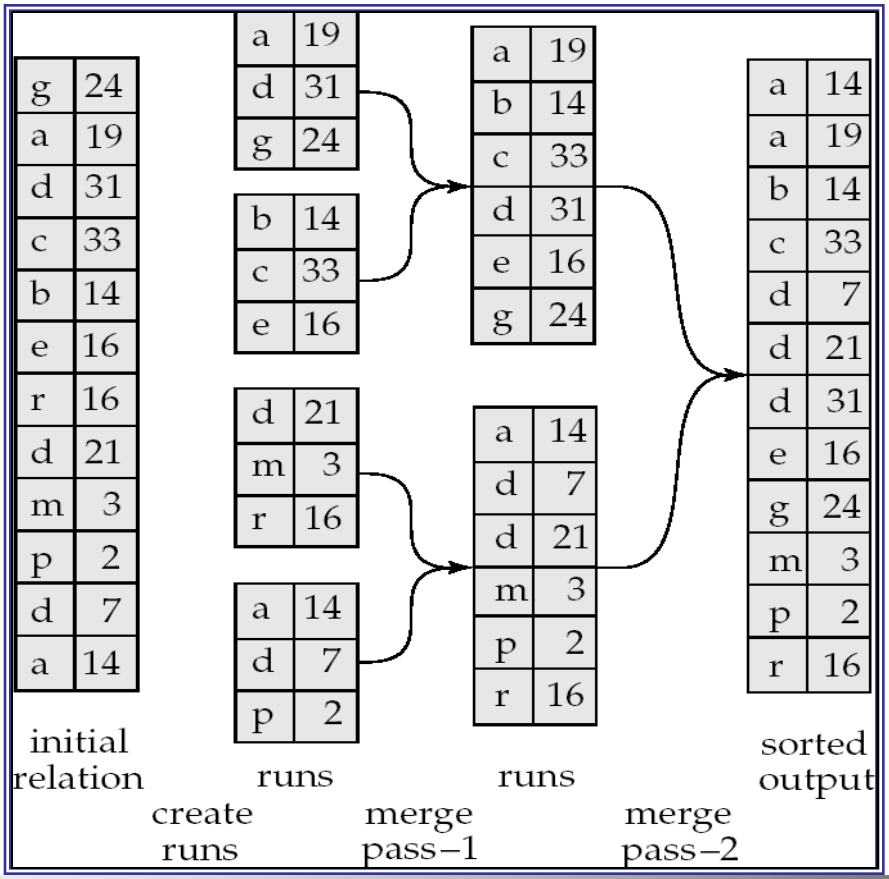
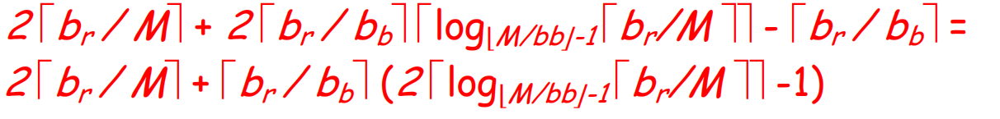
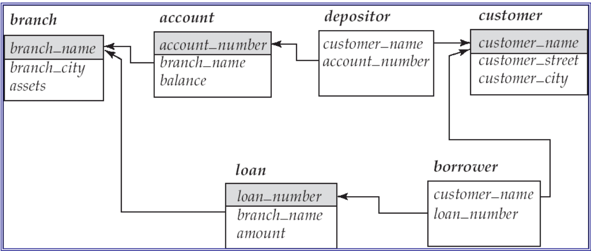
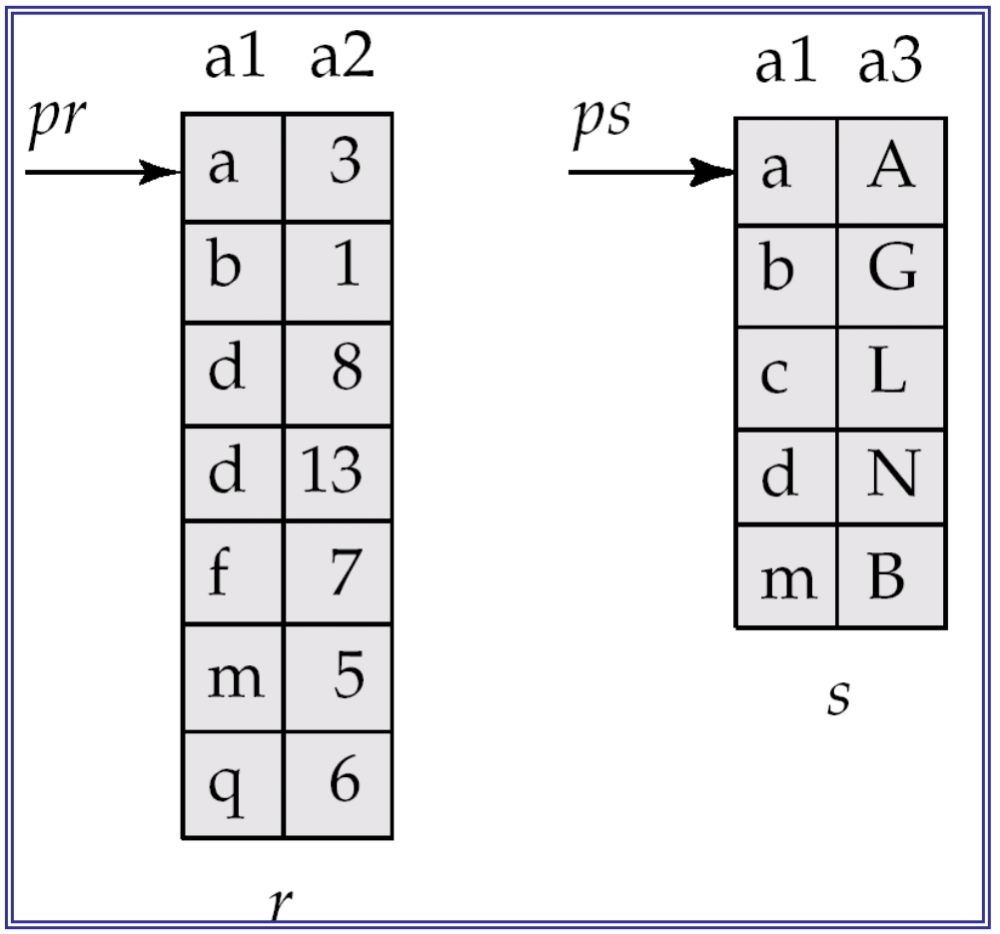
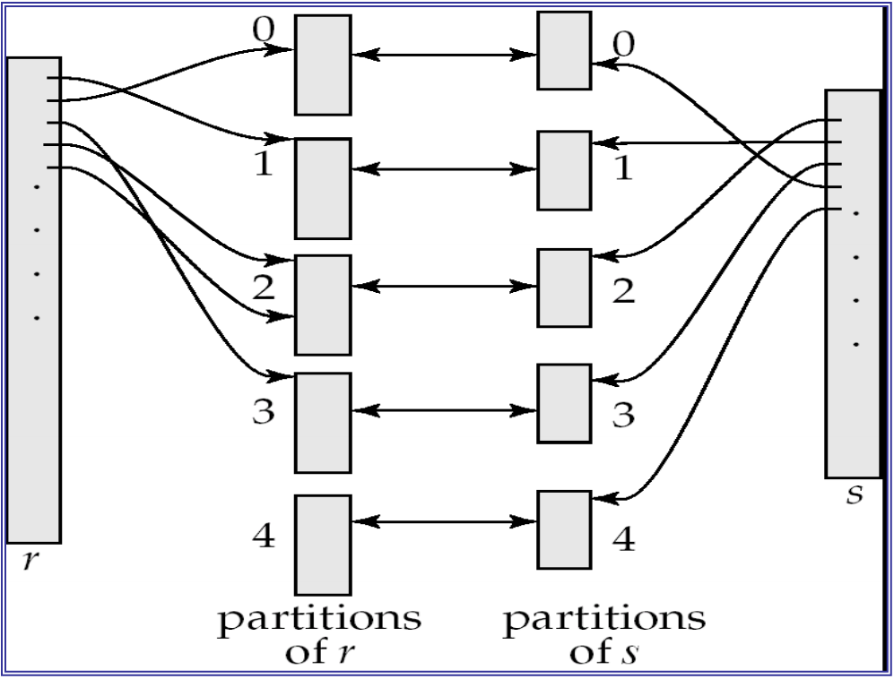

# Query Evaluation  查询分析

- **tT** – time to transfer one block

  **tT** – 转移一个区块的时间

- **tS** – time for one seek

  **tS** – 一次搜索的时间

- Cost for **b** block transfers plus **s** seeks

  **b** 块转移加上 **s** 次 seek 的成本

  **b \* tT+ S \* tS**

通常情况下，在B+树中，一个leaf node就是一个block

## Learning Outcomes

- Algorithms for evaluating selection 

  评估选择的算法

- Algorithms for evaluating projection

  用于评估投影的算法

- External Merge Sort

  外部合并排序

## Selection Operations  查询操作

- Notation: σp(*r*)

- *p* is called the **selection predicate**

  p称为 **选择谓词** （在数据库术语中，**selection predicate（选择谓词）**是用于指定查询条件的表达式，它决定了哪些记录（或元组）应被选择或保留在查询结果中，例如select * from employees where salary > 5000, 那么salary > 5000 就是一个选择谓词）

- Defined as:

  - *σp*(**r**) = {*t* | *t* ∈ *r* **and** *p(t)*}

  - Where *p* is a formula in propositional calculus consisting of **terms** connected by :  ∧(**and**), ∨(**or**), ¬(**not**)

  - Each term is one of:

    <attribute>*op* (<attribute> or <constant>)

     *op* is one of: =, ≠, >, ≥, <, ≤

  - Example of selection:

    - σbranch_name=“Perryridge”(account)

|      | Algorithm                                     | Cost                                                         | Reason                                                       |
| ---- | --------------------------------------------- | ------------------------------------------------------------ | ------------------------------------------------------------ |
| A1   | Linear Search                                 | ts + br * tT                | One initial seek plus br block transfers, where br denotes the number of blocks in the file.  一个初始查找加上 br 块传输，其中 br 表示文档中的块数。 |
| A1   | Linear Search, Equality on Key                | Average case: ts + (br / 2)  * rT | Since at most one record satisfies the condition, scan can be terminated as soon as the required record is found. In the worst case, br block transfers are still required.   由于最多一条记录满足条件，因此一旦找到所需的记录，就可以立即终止扫描。在最坏的情况下，仍然需要 br 块传输。 |
| A2   | Clustering B+ tree Index, Equality on Key     | (hi + 1) * (tT + tS)        | (Where hi denotes the height of the index.) Index lookup traverses the height of the tree plus one I/O to fetch the record; each of these I/O operations requires a seek and a block transfer.   （其中 hi 表示索引的高度。索引查找遍历树的高度加上一个 I/O 来获取记录;这些 I/O 操作中的每一个都需要一个 seek 和一个块传输 |
| A3   | Clustering B+ tree Index, Equality on Non-key | hi * (tT + tS) + tS + b * tT | One seek for each level of the tree, one seek for the first block. Here b is the num ber of blocks containing records with the specified search key, all of which are read. These blocks are leaf blocks assumed to be stored sequentially (since it is a clustering index) and don’t require additional seeks.  树的每一级都有一个寻道，一个寻道第一个块。这里 b 是包含具有指定搜索键的记录的块数，所有这些记录都被读取。这些块是假定按顺序存储的叶块（因为它是集群索引），不需要额外的查找。 |
| A4   | Secondary B+ Index, Equality on Key           | (hi + 1) * (tT + tS)        | This case is similar to clustering index.                    |
| A4   | Secondary B+ tree Index, Equality on Non-key  | (hi + n) * (tT + tS)        | (Where n is the number of records fetched.) Here, cost of index traversal is the same as for A3, but each record may be on a different block, requiring a seek per record. Cost is potentially very high if n  is large. （其中 n 是获取的记录数。在这里，索引遍历的开销与 A3 相同，但每条记录可能位于不同的块上，需要每条记录进行一次查找。如果 n 很大，则成本可能非常高。 |
| A5   | Clustering B+ tree Index, Comparison          | hi * (tT + tS) + tS + b * tT | Identical to the case of A3, equality on non-key.            |
| A6   | Secondary B+ Index, Comparison                | (hi + n) * (tT + tS)        | Identical to the case of A3, equality on non-key.            |

ts: 一次seek的时间

tT: 转移一个block的时间

br: relation *r* 中record的block数量

hi: 表示index的height

### Evaluation of Selection Operation 分析搜索操作

- **File scan** – search algorithms that scan files and retrieve records that fulfill a selection condition.

  **文档扫描** – 搜索算法，用于扫描文档并检索满足选择条件的记录。

  - blocks of a relation are stored contiguously

    关系的块是连续存储的

- **Index scan** – search algorithms that use an index

  **索引扫描** – 使用索引的搜索算法

  - selection condition must be on search-key of index.

    选择条件必须位于 index 的搜索键上。

#### Algorithm for Selection Operation (File scan: linear search)

- Scan each file block and test all records to see whether they satisfy the selection condition.

  扫描每个文档块并测试所有记录，查看是否满足选择条件。

  - **Cost estimate = *br* block transfers + 1 seek**

    **成本估算 = *br* 区块转移 + 1 次搜索**

    - br denotes number of blocks containing records from relation *r*

      br 表示包含关系 *r* 中记录的块数

- If selection is on a key attribute, can stop on finding record (Linear Search, Equality on Key)

  如果选择在键属性上，则可以在查找记录时停止（线性搜索、键相等）

  - **Average cost = (br /2) block transfers + 1 seek**

    **平均成本 = （br /2） 块转移 + 1 次搜索**

- This linear search can be always applied, regardless of:

  无论以下情况如何，始终可以应用此线性搜索：

  - selection condition or

    查询情况

  - ordering of records in the file, or 

    对文档中的记录进行排序

  - availability of indices

    指数的可用性

#### Algorithms for Selection Operation (File scan: binary search)

- Applicable only if the selection is an **equality** comparison on the attribute on which file is **ordered**. 

  仅当选择是对 **ordered** 文档所依赖的属性的 **相等** 比较时才适用。

  - Cost estimate (number of block transfers and seeks):

    成本估算（区块传输和寻道的数量）：

    - cost of locating the first tuple by a binary search on the blocks

      通过在块上进行二叉搜索来定位第一个元组的成本

      - ⌈log2(b2)⌉ block transfer + ⌈log2 (b2)⌉ seeks, or

      - ⌈log2(br)⌉ * (tT + tS)

    - If there are multiple records satisfying selection

      如果存在多条满足 selection 的记录

      - Add transfer cost of the number of blocks containing records that satisfy selection condition 

        添加包含满足选择条件的记录的块数的传输成本

      - Will see how to estimate this cost later
    
        稍后将了解如何估算此成本

- If *br* is not too big, then most likely binary search doesn’t pay.

  如果 *br* 不是太大，那幺二分搜索很可能没有回报。

  - Note that *tT* is several (say, 40) times smaller than *tS*; Note that *tT* is several (say, 40) times smaller than *tS*

    **请注意，*tT* 比 *tS*小**

  - Which of the two algorithms needs to be wisely chosen for a specific query at hands.

    需要为手头的特定查询明智地选择两种算法中的哪一种。

### Selection on Index 索引查询(等值搜索)

#### primary index on candidate key, equality A2  候选键的聚集索引，相等

- Retrieve a **single** record that satisfies the corresponding equality condition 

  检索满足相应相等条件的**单个记录**

- Primary index是针对数据库表中的**候选键（candidate key）**创建的索引，其中候选键是表中的列，能够唯一标识每一行（例如主键）。这意味着没有重复值。

  - **Cost** = (hi + 1) block transfer + (hi + 1) seeks, or

  - **In time** = (hi + 1) * (tT + tS)

    - hi代表索引树的层数，即从根节点到叶节点的跳数。在**候选键(candidate key)的情况下，查询等值匹配时索引树只需被遍历一次，因为候选键是唯一的**，每个键值只对应一条记录。

    - +1 代表从索引index跳转到数据页record的额外一步。在找到正确的索引项之后，还需要再访问一次数据页才能获取对应的记录。

    - (tT + tS)每一步的时间开销包括访问索引节点以及读取数据页的时间。

  - where hi denotes the **height** of the index

    其中 **hi** 表示索引的高度

- Recall that **the height of a B+-tree index is at most ⌈log⌈n/2⌉(K)⌉,** where n is the number of pointers per node and K is the number of search keys.

  回想一下，**B+ 树索引的高度最多为 ⌈log⌈n/2⌉(K)⌉**，其中 n 是每个节点的指针数，K 是搜索键的数量。

  - E.g. for a relation with 1,000,000 (1 million) different search keys, and with 100 index entries per node,  hi = 4

    例如，对于具有 1,000,000 （100 万）个不同搜索键且每个节点有 100 个索引条目的关系，hi = 4

  - Unless the relation is really small, this algorithms always “pays” when indexes are available.

    除非关系真的很小，否则当索引可用时，此算法总是 “有花费”。

#### primary index on nonkey, equality A3 聚集索引 非键列，相等

- Retrieve possibly **multiple** records. 

  检索可能的**多个**记录。

- Primary index在**非键值列（nonkey column）**上创建，非键值列可能包含重复值。这意味着索引中的一个值可能对应多行数据。可以定位到第一个匹配项，但由于非键值列可以有重复值，还需要进一步扫描后续记录以找到所有匹配项

- Records will be on consecutive blocks

  记录将位于**连续**的块上

- Let b = number of blocks containing matching records

  **设 b 为包含匹配记录的块数**

  - **Cost** = (hi + b) block transfers + (hi + 1) seeks, or  **（为什么这里seek只➕1？？？？）**
  - **In time**: hi * (tT+ tS) + tS + tT * b
    - hi * (tT+ tS) 首先，索引树需要被遍历以找到匹配的第一个记录。这部分与候选键相同。
    - tS 找到第一个匹配项后，需要一次磁盘I/O来读取该记录所在的数据页。
    - tT * b 由于非键值列可能有多个匹配的记录，所以在找到第一个匹配项后，还需要扫描多个额外的索引页以找到所有符合条件的记录，这部分的消耗是基于b（匹配项数量）。**(为什么这里不需要记上ts的时间)！！！！！！！！**

#### equality on key and non-key of secondary index A4 辅助索引 候选键或无键列，相等

- Secondary index是指为非主键列创建的索引，可以是唯一键（key）或非唯一键。在这种情况下，我们针对**键列**创建了次级索引，并执行等值查询。

- Retrieve a **single** record if the search-key is a candidate key

  如果 search-key 是候选 key，则大概率只会检索出来 **single** 记录

  - **Cost** = (hi + 1) block transfers + (hi + 1) seeks, or
    - 辅助索引树的遍历涉及 **hi** 次块传输和寻道。
    - **1 block transfer + 1 seek**：这是从辅助索引跳转到数据页的一次操作。

  - **In time** = (hi + 1) * (tT+ tS)

- Retrieve **multiple** records if search-key is not a candidate key

  如果 search-key 不是候选键，则会检索出来 **multiple** records（多条记录）

  - each of *n* matching records may be on a **different** block 

    最差条件：*n* 条匹配的记录中的每一条都可能位于不同的块上

  - ~~Cost at most is: (hi + n) * (tT+ tS)~~

  - Cost at most is: (hi + n) block transfers and (hi + n) seeks

    - 与在键上查找相同，首先需要在辅助索引中进行查找，这一步的开销是 **hi** 次块传输和hi 次寻道。
    - 由于是基于**非键（non-key）**的查询，辅助索引中的值可能不是唯一的，可能会有 **n** 条记录符合查询条件。每一条匹配项都需要一次块传输和一次寻道操作来读取数据页。**n block transfers + n seeks**：对于每一个匹配的记录，都需要一次磁盘I/O操作。
  
  - Can be very expensive if n is big! Note that it multiplies the time for seeks by *n*.
  
    如果 n 很大，可能会非常昂贵！请注意，它将 seek 的时间乘以 *n*。

### Comparative Selections 比较选择

#### σA≤V (r) or σA≥V(r) 

- 可以使用cluster indexing，因为可以只找到当前进行对比的v，然后由于满足cluster indexing的文档内容存储都是按照顺序的，因此将满足条件的v之前或者之后的内容就可以被选做是最终满足大于还是小于比较结果的值。

- Using a linear file scan or binary search just as before

  像以前一样使用线性文档扫描或二进制搜索

#### Primary Index, comparison A5

- Using **primary index A5**, comparison 

  使用**主索引**、比较

  - For σA≥V(r)  use index to find first **tuple** ≥ *v* and scan relation sequentially from there

    对于 σA≥V（r），使用 index 查找 *v* ≥第一个元组，并从那里按顺序扫描关系

  - For σA≤V (r) just scan relation sequentially till first tuple > *v;*

    对于 σA≤V （r） 只需按顺序扫描关系，直到第一个元组> *v;*

    - Using the index would be useless, and would require extra seeks on the index file.

      使用索引是无用的，并且需要在索引文档上进行额外的查找。

#### Secondary Index , comparison A6

- Using **secondary index A6**, comparison

  使用**二级索引**，比较

  - For σA≥V(r) use index to find first **index entry** ≥ *v* and scan index sequentially from there, to find pointers to records.

    对于 σA≥V（r），使用 index 查找 *v* ≥的第一个索引项，并从那里按顺序扫描索引，以查找指向记录的指针。

  - For σA≤V (r) **just scan leaf pages of index** finding pointers to records, till first entry > *v*

    对于 σA≤V （r） 只需扫描指向记录的查找索引指针的叶子页，直到第一个条目> *v*

  - In either case, retrieve records that are pointed to

    在任一情况下，检索指向

    - requires an I/O for each record (a lot!)

      每条记录都需要一个 I/O（很多！

    - Linear file scan may be much cheaper!

      线性文档扫描可能要便宜得多！

### Conjunctive Selection 合取选择 

#### σθ1 ∧ θ2 ∧. . . θqn(*r)*   

**θ（theta）**

- **using one index**

  **使用一个索引**

  - Select q*i* and previous algorithms that results in the **least** cost for σθi (r).

    选择 q*i* 和之前的算法，这些算法会导致 σθi （r） 的**成本最低**。

  - Test other conditions on tuple after fetching it into memory buffer.

    将 Tuple 提取到 memory buffer 后，在 Tuple 上测试其他条件。

  - In this case the **choice of the first condition is crucial!**

    在这种情况下，第一个条件的选择至关重要！

    - One must use estimates to know which one is the best.

      必须使用估计值来知道哪一个是最好的。

- **using multiple-key index**

  **使用多键索引**

  - Use appropriate composite (multiple-key) index if available

    使用适当的复合（多键）索引（如果可用）

### Disjunctive Selections 析取选择

#### σθ1 ∨ θ2 ∨. . . θqn(*r)*   

- Union of identifiers 

  标识符的联合

  - Use **linear scan**.

    使用线性扫描。

  - Or **index scan** if *some* conditions have available indices. 

    或者如果 *某些* 条件有可用索引，则进行索引扫描。

    - Use corresponding index for each condition, and take union of all the obtained sets of record pointers. 

      **为每个条件使用相应的索引，并获取所有获取的记录指针集的联合**。

    - Then fetch records from file

      然后从文档中获取记录

### Selections With Negation σ¬θ(r) 带否定的选择项

Use linear scan on file

对文档使用线性扫描

If an index is applicable to θ

如果索引适用于 θ

- Find satisfying records using index 

  使用 index 查找满意的记录

- σ¬θ(r) is simply the set of tuples in *r* that are not in σθ(r)

  σ¬θ（r） 只是 *r* 中不在 σθ（r） 中的元组集合

## Duplicate Elimination and Evaluating Projection  重复消除和评估投影

- Duplicate elimination can be implemented via **hashing** or **sorting**.

  重复消除可以通过 **hashing** 或 **sorting** 来实现。

  - On sorting, duplicates will come **adjacent** to each other, duplicates can be deleted. 

    在排序时，重复项将彼此 **相邻** ，重复项可以删除。

  - Hashing is similar; duplicates will come into the **same** bucket.

    哈希是类似的;重复项将进入 **相同** 存储桶。

- Projection **drops** columns not in the selected attribute list.

  投影 **删除** 不在所选属性列表中的列。

- The expensive part is removing duplicates.

  昂贵的部分是删除重复项。

## Sorting

- Sorting algorithms are important in query processing at least for two reasons:

  排序算法在查询处理中非常重要，至少有两个原因：

  - The query itself may require sorting (**order by** clause)

    查询本身可能需要排序（**order by** 子句）

  - Some algorithms for other operations, like join, set operations and aggregation, require that relations are previously sorted and duplicates removed.

    其他操作的某些算法（如 join、set 操作和 aggregation）要求对关系进行事先排序并删除重复项。

- To sort a relation:

  要对关系进行排序：

  - We may build an index on the relation, and then use the index to read the relation in sorted order. 

    我们可以在关系上构建索引，然后使用索引按排序顺序读取关系。

    - This only sorts the relation **logically**, not **physically**

      这只对关系 **逻辑上** 进行排序，而不是 **物理上**

    - May lead to one disk block access for each tuple.

      可能导致每个 Tuples 访问一个磁盘块。

  - For relations that fit in memory, sorting algorithms that you’ve studied before, like quicksort and insertion sort, can be used. 

    对于适合内存的关系，可以使用您之前学习过的排序算法，如 quicksort 和 insertion sort。

### External Sort-Merge  外部排序-合并

- For relations that don’t fit in memory, special algorithms that take into account the measures in terms of **block transfers and seeks**, are required.

  **对于不在内存中的表**，需要特殊的算法来考虑 **block transfers 和 seeks** 方面的措施。

- Let  **M** denote memory size: the number of disk blocks whose contents can be buffered in main memory

  设 **M** 表示内存大小：其内容可以在主内存中缓冲的磁盘块的数量

  - 在第一阶段，a number of sorted **runs** are **created**; each run is sorted but contains only some of the records of the relation.

    创建多个排序的 **runs**; 每个运行都经过排序，但仅包含关系的一些记录。

    - **Create sorted runs**. Let *i* be 0 initially.

      **创建排序运行**。最初设 *i* 为 0。

      Repeatedly do the following till the end of the relation: 

      重复执行以下操作，直到关系结束：

      ​	(a) Read *M* blocks of relation into memory; 

      ​	读取M个记录块到内存;

      ​	(b) Sort the in memory part of the relation

      ​	排序被读取到内存中的数据块的顺序

      ​	(c) Write sorted data to run file -memory blocks; Ri ;

      ​	写入排序后的数据以运行 file -memory blocks; Ri（Run(子序列)i） ;

      ​	(d) Increment i.

      ​	增加 i

      Let the final value of i be N (that is we have **N run files**)

      设 i 的最终值为 N（即我们有 N 个运行文档）

  - 在第二阶段，the **runs(已经排序好的子序列)** are **merged**. Suppose, for now, that the total number of runs, *N*, is less than *M*, so that we can allocate one block to each run and have space left to hold one block of output. The merge stage operates as follows：

    **N < M**
  
    runs被**merge**。现在，假设**runs的总数 N ＜ 内存大小 M**，**N** 是总数据量，**M** 是内存容量。在这种情况下，数据量小于可用内存，所有的数据都可以一次性加载到内存中进行排序，排序过程类似于标准的**内部排序**。因此我们可以为每次运行分配一个块，并留出空间来保存一个输出块。合并阶段的运行方式**重复**如下：
  
    - **选择所有缓冲区块中的第一个元组（按照排序顺序）**：
      - 作用：在每个缓冲区（每个子序列的当前部分）中，我们从多个已经排序好的子序列中找出最小的元组。这是为了保持全局顺序，每次选取当前缓冲区中最小的值。因为每个子序列都是有序的，所以我们只需要比较每个子序列的第一个值即可。
      - 例子：假设有三个子序列 `R1 = [2, 5]`，`R2 = [3, 7]`，`R3 = [1, 6]`，那么在这一步我们会选择值为`1`的元组（来自`R3`）作为最小的元组。
    - **将元组写入输出文件，并从缓冲区块中删除它**：
      - 作用：将当前选择的最小元组输出到结果文件中，并将其从相应的子序列的缓冲区中移除。这一步相当于将已经处理过的元组移出，让后续的元组能够参与比较。
      - 例子：如果我们选择了`1`，那么我们会将`1`写入输出文件，并从`R3`缓冲区中删除`1`
    - **如果某个子序列`Ri`的缓冲区块为空，且还没有到文件末尾，那么读取`Ri`的下一块到缓冲区中**：
      - 作用：每个子序列有一部分数据缓存在内存中的缓冲区中，当一个子序列的缓冲区块被耗尽时，我们从磁盘中读取该子序列的下一部分数据到内存缓冲区中，继续参与合并过程。这一步是为了保证可以从大文件中逐块处理数据，节省内存。
      - 例子：假设我们从`R3`读取了`1`和`6`，`1`已经被输出且删除了，这时`R3`缓冲区空了。我们就需要从磁盘中读取`R3`的下一部分（如果还有的话），这样合并过程可以继续。
    - **重复以上步骤，直到所有输入缓冲区块都为空**：
      - 作用：这一步说明循环会一直进行，直到所有子序列的所有数据都被处理完。每个子序列的数据被逐块读取并合并输出，直到所有元组都被写入输出文件。
      - 例子：最终，我们会输出所有的元组，从小到大依次写入输出文件
  
    直到`R1`、`R2`、`R3`的所有数据都被处理完。
  
  ​	**until** all input buffer blocks are empty  **直到** 所有 Input buffer 块都为空
  
  ​    **N ≥ M**
  
  - If **N ≥ M**, several merge passes are required.
  
    如果 **N≥ M**，则需要多次 *合并信道*。
  
    - **初始运行块（runs）的生成**：
  
      - 外部排序的第一步是将数据划分为多个块，每块大小不超过内存（M）容量。每个块在内存中进行排序，称为**初始运行块**（runs）。
      - 如果数据非常大，可能会生成超过M个运行块（N ≥ M）。在这种情况下，不能在一次归并操作中同时处理所有运行块。
    
      **归并的限制**：
    
      - 在归并阶段，需要将这些有序的运行块合并为一个最终的排序输出。每次归并时，内存需要为每个运行块分配一个缓冲区用于读取数据。
      - 由于内存有限，假设内存中最多可以容纳**M-1个缓冲区**（用于输入），剩下一个缓冲区用于输出。因此，每次归并只能处理最多M-1个运行块。
  
      **多次归并（多轮归并）**：
  
      - **第一轮归并**：将前M-1个运行块进行归并，生成一个新的较大的运行块；接着处理接下来的M-1个运行块，依此类推，直到所有初始运行块都经过第一次归并。
      - 经过第一轮归并后，生成的新运行块数量会减少到**原数量的1/(M-1)**。也就是说，每次归并后，运行块的数量减少，但每个运行块变得更大。
    
      **多轮归并重复进行**：
    
      - 如果经过第一轮归并后，新的运行块数量仍然大于M（也就是新的运行块数量仍超过内存可处理的数量），那么需要进行**第二轮归并**，再将这些新的运行块归并，减少运行块的数量。
      - 这个过程会重复进行，直到运行块的数量小于M，此时可以在内存中进行最后一次归并，生成最终的排序输出。
    
    - 举例子：
    
      假设内存大小M=5，可以容纳4个输入缓冲区（M-1个）。总共有12个初始运行块：
    
      - **第一轮归并**：
        1. 归并前4个运行块生成1个新的运行块。
        2. 归并接下来的4个运行块生成1个新的运行块。
        3. 归并最后的4个运行块生成1个新的运行块。 **结果**：经过第一轮归并后，现在有3个新的运行块（12个块缩减为3个）。
      - **第二轮归并**： 由于现在只有3个运行块，小于M，可以直接将它们归并，生成最终的排序输出。
    
    - For example, if M=11, and there are 90 runs, one pass reduces the number of runs to 9, each 10 times the size of the initial runs
    
      例如，如果 M=11，并且有 90 次运行，则一次传递会将运行次数减少到 9 次，每次运行次数是初始运行大小的 10 倍
    
    - Repeated passes are performed till all runs have been merged into one.
    
      重复，直到所有运行都合并为一个。
  

### Example when N ≥ M

Suppose that Memory holds at most **three** blocks, only one tuple fits in a block. The relation needs 12 blocks to store.

假设 Memory 最多包含三个块，一个块中只有一个 Tuples。该关系需要 12 个块来存储。

先讲原本没有顺序的内容进行分割，对每个分割过后的内容进行排序，然后再不断进行组合，每当进行一次组合就重新就当前内容进行排序，直到最终形成完整的有序排列。

### Cost Analysis  成本分析

- Assume relation in *b*r blocks, *M* memory size, **number of run file** ⌈br/M⌉

  假设 *b*r 块中的关联、*M* 内存大小、运行文档数量 ⌈br/M⌉

- **Buffer size *bb*** (read *bb* blocks at a time from each run and *bb* blocks for writing; before we assumed *bb* =1)

  缓冲区大小 *bb* （每次运行一次读取 *bb* 块和 *bb* 块进行写入;在我们假设 *bb* =1 之前）

- **br** denotes number of **blocks containing records from relation *r***

  br 表示包含关系 *r* 中记录的块数

- Cost of Block Transfer

  区块转移的成本

  - Each time can merge 每次可以合并多少**runs**： **⌊(M-bb)/bb⌋** runs*;* 

  - So total number of **merge passes** required **需要合并的总次数**: **⌈log⌊M/bb⌋-1⌈br / M⌉⌉**.  使用这个结果和题目提供的memory size进行对比

  - **Block transfers** for initial run creation as well as in each pass is **2*br*** (read/write all *br* blocks). 

  - Thus total **number of block transfers for external sorting** (For final pass, we don’t count write cost):
    
    外部排序所需要的**block转移数量公式**：
    
    - **2br + 2br ⌈log⌊M / bb⌋ - 1⌈br / M⌉⌉ - br = br(2⌈log⌊M / bb⌋ - 1 ⌈br / M⌉⌉ + 1)**
      - 减br的原因是不需要计算最后一次write的cost

- Cost of seeks

  查找成本

  - During run generation: one seek to read each run and one seek to write each run 2⌈br / M⌉

  - During the merge phase: need 2⌈br / bb⌉ seeks for each merge pass 
  
  - **Total number of seeks**:
    
    外部查找的成本：
    
    - 

### Example

Suppose that Memory hold at most 3 blocks, only one tuple fits in a block. The relation needs 12 blocks to store, m= 3, *assume bb* =1.

根据上面的图

Total block transfer = 

Total seeks = ?

# Query Evaluation 2

- Algorithms for evaluating join

  用于评估 join 的算法

  - Nested Loop Join 

    嵌套循环连接

  - Block Nested Loop Join

    块嵌套循环连接

  - Indexed Nested Loop Join

    索引嵌套循环联接

  - Merge Join

    合并联接

  - Hash Join

    哈希联接

- Algorithms for evaluating other expressions

  用于计算其他表达式的算法

### Natural-Join Operation 自然拼接操作

- Notation: r ⋈ s

  - Let *r* and *s* be relations on schemas *R* and *S,* respectively. Then, r ⋈ s is a relation on **schema *R* ∪ *S*** obtained as follows:

    设 *r* 和 *s* 分别是模式 *R* 和 *S，* 上的关系。然后，r ⋈ s 是架构 R ∪ S的关系，如下所示：

    - Consider each pair of tuples *tr* from *r* and ts from *s*. 

      考虑每对元组 *r* 的 *tr* 和 *s* 的 ts。

  - If tr and *ts* have the same value on each of the attributes in *R* ∩ *S*, add a tuple *t* to the result, where 

    如果 tr 和 *ts* 在 *R* ∩ *S* 中的每个属性上具有相同的值，则向结果中添加一个元组 *t*，其中

    - *t* has the same value as *tr* on *r*

      *t* 的值与 *r* 上的 *tr* 相同

    - *t* has the same value as *ts* on *s*

      t 的值与 *s* 上的 *ts* 相同

- Example:

  - R = (A, B, C, D)
  - S = (E, B, D)
  - Result schema = (A, B, C, D, E)
    - r ⋈ s is defined as:
    - ∏r.A, r.B, r.C, r.D, s.E (σr.B = s.B ∧ r.D = s.D  (r x s))

## Join Operation

- Several different algorithms to implement joins exist (not counting with the ones involving parallelism)

  存在几种不同的算法来实现连接（不包括涉及并行度的算法）

  - Nested-loop join

    嵌套循环联接

  - Block nested-loop join

    块嵌套循环连接

  - Indexed nested-loop join

    索引嵌套循环联接

  - Merge-join

    合并连接

  - Hash-join

    哈希联接

- The choice is based on cost estimate.

  选择基于成本估算。

- **外层循环**：从第一个表中读取一个块（该块包含多条记录）。

  **内层循环**：对于外层读取的每一条记录，依次扫描第二个表的块，找到匹配的记录。

### Banking Example

- Examples in rest slides use the following information:

  其余幻灯片中的示例使用以下信息：

  - Number of records of *customer*: 10,000

    顾客的记录数：10000

  - Number of blocks of *customer*: 400 

    *客户*的区块数量：400

  - Number of records of *depositor*: 5,000

    存款人记录数：5,000

  - Number of blocks of *depositor: 100*

    存款人的区块数量：100

### Nested-Loop Join  嵌套循环连接

The simplest join algorithms, that can be used independently of everything.

最简单的连接算法，可以独立于所有内容使用。

To compute the theta join: r ⋈ s

​	**for each** tuple *tr* **in** *r* **do begin**

​		**for each tuple** *ts* **in** *s* **do begin**

​			test pair (tT,tS) to see if they satisfy the join condition θ if they do, add *tr* *• ts* to the result.

​		**end**

​	**end**

- *r* is called the **outer relation** and *s* the **inner relation** of the join.

  *r* 称为 **outer relation**，而 *s* 称为 Join 的 **inner relation**。

- Quite expensive in general, since it requires to examine every pair of tuples in the two relations. 

  一般来说，这是相当昂贵的，因为它需要检查两个关系中的每一对 Tuples。

- In the **worst case**, if there is enough memory only to hold one block of each relation, *nr* is the number of tuples in relation *r*, and br and bs  is the number of blocks of r and s. The estimated cost is:

  在**最坏情况**中，如果内存仅足以容纳每个关系的一个块，则 ***nr* 是关系 *r* 的元组数，br和bs分别是 r 和 s 的块数**。估计费用为：

  - ***nr* * *bs* + *br* block transfers, plus**

    首先，将外表 R 的所有块（br）加载到内存中。这需要 **br 次块传输**，因为我们需要读取 R 表的所有块；对于外表 R 的每一条记录（nr），我们需要扫描内表 S 的所有块。这意味着对于每条记录，都需要从磁盘中读取 **bs 块**。总共有 nr 条记录，因此，内表扫描的块传输代价是 **nr \* bs**。

  - ***nr* + *br* seeks**

    读取外表 R 时，需要对每个块进行一次磁盘查找，因此，外表的查找代价是 **br** 次查找；对于外表的每一条记录，需要查找内表的块位置。由于外表有 **nr** 条记录，因此需要 **nr** 次查找。

- If the **smaller relation** fits entirely in memory, use that as the **inner** relation.

  如果较小的关系完全适合内存，则将其用作内部关系。

  - Reduces cost to *br* + *bs* block transfers and 2 seeks

    **将成本降低到 *br* + *bs* 区块转移和 2 次寻道**

- But in general, it is much better to have the smaller relation as the outer relation

  但一般来说，将较小的关系作为外部关系要好得多。通常情况下nr的数量要小于br

- The choice of the inner and outer relation strongly depends on the estimate of the size of each relation.

  内部和外部关系的选择在很大程度上取决于对每个关系大小的估计。

#### Nested-Loop Join Cost Example

- Assuming **worst case** memory availability cost estimate is

  假设 **最坏情况** 内存可用性成本估算为

  - with *depositor* as outer relation:

    以 *depositor* 作为外部关系：

    - 5,000 * 400 + 100 = 2,000,100 block transfers,

      5,000 * 400 + 100 = 2,000,100 次区块转移，

    - 5,000 + 100 = 5,100 seeks 

      5,000 + 100 = 5,100 次搜索

  - with *customer* as the outer relation 

    将 *customer* 作为外部关系

    - 10,000 * 100 + 400 = 1,000,400 block transfers and 10,400 seeks

      10,000 * 100 + 400 = 1,000,400 次区块转移和 10,400 次寻道

- If smaller relation (*depositor)* fits entirely in memory, the cost estimate will be 500 block transfers and 2 seeks

  如果较小的关系 （*depositor）* 完全适合内存，则成本估计将为 500 次区块传输和 2 次寻道

### Block Nested-Loop Join  块嵌套循环连接

Variant of nested-loop join in which every block of inner relation is paired with every block of outer relation.

嵌套循环连接的变体，其中每个内部关系块都与每个外部关系块配对。

**for each** block *Br* **of** *r* **do begin**

​	**for each** block *Bs* **of** **s** **do begin**

​		**for each** tuple *tr* **in** *Br* **do begin**

​			**for each** tuple *ts* **in** *Bs* **do begin**

​				Check if (*tr, ts)* satisfy the join condition if they do, add *tr* • *ts* to the result.

​			**end**

​		**end**

​	**end**

**end**

#### Block Nested-Loop Join Cost

**外表 R 分块读取**：将外表 R 的多个块一次性读入内存，处理这些块。

**内表 S 逐个扫描**：对于外表 R 中读入的每个块，扫描整个内表 S 的所有块，进行 Join 操作。

- **Worst case** estimate: ***br* * *bs* *+ br*** block transfers and **2 * *br*** seeks

  - Each block in the inner relation *s* is **read once** for each *block* in the outer relation (instead of once for each tuple in the outer relation).

    内部关系 *s* 中的每个块对于外部关系中的每个 *块* 都 **读取一次**（而不是对于外部关系中的每个元组读取一次）。

  - **（br）**：外表 R 的所有块必须读取一次，这里需要 **br** 次块传输；**（br \* bs）**：对于外表 R 的每个块，我们需要扫描内表 S 的所有块。这意味着对于每个外表块，都需要读取 S 的 **bs** 块。因为外表有 **br** 个块，所以内表的块传输代价是 **br \* bs**。

  - 在每次处理外表时，必须找到外表的块位置。由于外表 R 有 **br** 个块，需要 **br** 次查找；对于每个外表块，需要查找并扫描内表 S。由于我们需要扫描内表的每个块，所以内表查找的代价是 **br** 次查找。

- **Best case** (when smaller relation fits into memory): *br* + *bs* block transfers plus 2 seeks.

  最佳情况（当较小的关系放入内存时）：*br* + *bs* 块传输加上 2 个 seek。

- Some improvements to nested loop and block nested loop algorithms can be made:

  可以对嵌套循环和块嵌套循环算法进行一些改进：

  - Scan inner loop forward and backward alternately, to make use of the blocks remaining in buffer, reduce the number of disk access

    向前和向后交替扫描内部循环，以利用 buffer 中剩余的块，减少磁盘访问的数量

  - Use index on inner relation (if available) to quickly get the tuples which match the tuple of the outer relation.

    在内部关系上使用 index （如果可用） 快速获取与外部关系的 Tuples 匹配的 Tuples。

### Indexed Nested-Loop Join  索引嵌套循环联接

- Index lookups can replace file scans if

  如果满足以下条件，索引查找可以替换文档扫描

  - join is an equi-join or natural join and

    join 是等值联接或自然联接，

  - an **index** is available on the **inner** relation’s join attribute

    **index** 在 **inner** 关系的 join 属性上可用

    - In some cases, it pays to construct an index just to compute a join.

      在某些情况下，构造索引只是为了计算联接是值得的。

- For each tuple *tr* in the outer relation *r,* use the **index** on *s* to look up tuples in *s* that satisfy the join condition with tuple *tr*.

  对于外部关系 *r* 中的每个元组 *tr*，使用 *s* 上的索引来查找 *s* 中满足元组 *tr* 连接条件的元组。

- **Worst case**: buffer has space for only one page or one block of *r*, and, for each tuple in *r*, we perform an index lookup on *s.*

  最坏的情况：缓冲区只有一页或者一块 *r* 的空间，并且，对于 *r* 中的每个元组，我们在 *s* 上执行索引查找。

  - **Cost of the join: br + nr * *c* block transfers and br + nr * c seeks**

    **连接成本：br + nr * *c* 块转移和 br + nr * c次查找**

    - 外表 R 的所有块必须读取一次，总共需要 **br** 次块传输；对于外表 R 的每一条记录，我们需要通过索引查找内表 S 中的匹配记录。假设查找每条记录的代价是 **c**，那么总共需要 **nr \* c** 次块传输。
    - 读取外表 R 时，需要 **br** 次查找；每次从外表 R 查找一条记录时，通过索引在内表 S 中进行查找，每次查找的代价是 **c**。对于 **nr** 条记录，总共需要 **nr \* c** 次查找。

  - Where *c* is the cost of traversing index and fetching all matching s tuples for one tuple in *r*

    其中 *c* 是遍历索引并获取 *r* 中一个元组的所有匹配 s 元组的成本

  - *c* can be estimated as cost of a single selection on *s* using the join condition (usually quite low, when compared to the join)

    *c* 可以使用连接条件估算为 *s* 上单个选择的成本（与连接相比，通常相当低）

- If indices are available on join attributes of both *r* and s, use the relation with fewer tuples as the outer relation

  如果 *r* 和 s 的 join 属性上都有索引，则使用元组较少的关系作为外部关系

#### Example of Indexed Nested Loop Join Costs  索引嵌套循环连接成本示例

- Compute *depositor ⋈ customer,* with ***depositor*** as the **outer** relation.

  计算 *depositor ⋈ customer*，其中 *depositor* 作为外部关系。

- Let *customer* have a **primary B+-tree index** on the join attribute *customer-name,* with n=20.

- Since *customer* has 10,000 tuples, the **height of the tree is 4**, and one more access is needed to find the actual data

- *depositor* has 5,000 tuples

- **Nested loop join**: 2,000,100 block transfers and 5,100 seeks

- Cost of **block nested loops join**

  - 400*100 + 100 = 40,100 block transfers + 2 * 100 = 200 seeks

- Cost of **indexed nested loops join**

  索引嵌套循环联接的成本

  - 100 + 5,000 * (4+1) = 25,100 block transfers and seeks.

    100 + 5,000 *（4+1） = 25,100 次区块传输和搜索。

  - The number of block transfers is less than that for block nested loops join

    块传输次数小于块嵌套循环 join 的次数

  - But number of seeks is much larger

    但是 seek 的数量要大得多

  - In this case using the index doesn’t pay (this is specially so because the relations are small)

    在这种情况下，使用 index 不会有回报（因为关系很小，所以特别如此）

### Merge-Join  合并-联接

- Sort both relations on their join attribute 

  根据 join 属性对这两个关系进行排序

  - If not already sorted on the join attributes. 

    如果尚未对 join 属性进行排序。

  - Join step is similar to the merge stage of the sort merge algorithm. 

    Join 步骤类似于 sort merge 算法的 merge 阶段。

- Merge-join algorithm

  合并联接算法

  - Initialise two pointers point to r and s

    初始化两个指针指向 r 和 s

  - While not done

    未完成时

    - Pointers to r and s move through the relation. 

      指向 r 和 s 的指针在关系中移动。

    - A group of tuples of inner relation s with the same value on the join attributes is read into Ss . 

      在 join 属性上具有相同值的内部关系 s 的一组元组被读入 Ss 。

    - Do join on tuple pointed by pr and tuples in Ss;

      在 pr 指向的 Tuples 上加入 Ss 中的 Tuples;

  - End while

- **Can be used only for equi-joins and natural joins**

  只能用于等值联接和自然联接

- Each block needs to be read only once (assuming that all tuples for any given value of the join attributes fit in memory)

  每个块只需要读取一次（假设 join 属性的任何给定值的所有 Tuples 都适合内存）

#### Cost of merge join 合并连接的成本

注意不要跟Merge Sort搞混！！！

- Thus the cost of merge join is (where *bb* is the number of blocks allocated in memory for each relation): 

  因此，**合并连接的成本**是（其中 *bb* 是为每个关系在内存中分配的块数）：

  **Merge Join的block transfer花费和seeks的花费**：

  - **Cost**: br + bs block transfers + ⌈br / bb⌉ + ⌈bs / bb⌉ seeks 

  - Plus the cost of sorting if relations are unsorted.

    加上 EXCHANGE 未排序时的排序成本。

- Since seeks are much more expensive than data transfer, it makes sense to allocate multiple buffer blocks to each relation, provided extra memory is available.

  由于 seek 比数据传输昂贵得多，因此如果有额外的内存可用，则为每个关系分配多个缓冲区块是有意义的。

### Hash Join  哈希联接

- **Also only applicable for equi-joins and natural joins.**

  也仅适用于等值联接和自然联接。

- A hash function *h* is used to **partition tuples** of both relations 

  哈希函数 *h* 用于对两种关系的元组进行分区

- *h* maps *JoinAttrs* values to {0, 1, ..., *n*}, where *JoinAttrs* denotes the common attributes of *r* and *s* used in the natural join. 

  *h* 将 *JoinAttrs* 值映射到 {0， 1， ...， *n*}，其中 *JoinAttrs* 表示自然连接中使用的 *r* 和 *s* 的公共属性。

  - *r0*, r1*, . . ., rn* denote partitions of *r* tuples
    - Each tuple *tr* ∈ *r* is put in partition *ri.* where i = h(tr[JoinAttrs]).
  - *s0*, s1*. . ., sn* denotes partitions of *s* tuples
    - Each tuple *ts* ∈*s* is put in partition *si* , where i = h(ts [JoinAttrs]).

- General idea:

  - Partition the relations according to this

    根据此划分关系

  - Then perform the join on each partition *ri* and *si*
  
    然后在每个分区 *ri* 和 *si* 上执行连接
  
  - There is no need to compute the join between different partitions since an *r* tuple and an *s* tuple that satisfy the join condition will have the same value for the join attributes. If that value is hashed to some value *i*, the *r* tuple has to be in *ri* and the *s* tuple in *si* *.*
  
    无需计算不同分区之间的连接，因为满足连接条件的 *r* 元组和 *s* 元组将具有相同的连接属性值。如果该值被哈希为某个值 *i*，则 *r* 元组必须在 *ri* 中，而 *s* 元组必须在 *si* *.* 中。
    
    相同的数据必须在相同数字代表的partition块中

#### Hash-Join Algorithm  哈希连接算法

1. Partition the **relation *s*** using hashing function *h*. When partitioning a relation, some blocks of memory (*bb*) are reserved as the output buffer for each partition.

   使用哈希函数 *h* 对关系 *s* 进行分区。在对关系进行分区时，一些内存块 （*bb*） 被保留为每个分区的输出缓冲区。

2. **Partition r** similarly.

   分区 *r* 类似。

3. For each **partition i**:

   对于每个分区 *i：*

   1. Load *si* into memory and build an **in-memory hash index** on it using the join attribute. This hash index uses a **different hash** function than the earlier *h* for partitioning.

      将 *si* 加载到内存中，并使用 join 属性在其上构建内存中的哈希索引。此哈希索引使用与早期 *h* 不同的哈希函数进行分区。

   2. Read tuples in *r*i from the disk. For each tuple *tr* locate each matching tuple *ts* in *si* using the in-memory **hash index**. Output the concatenation of their attributes.

      从磁盘读取 *r*i 中的元组。对于每个元组 *tr* 使用内存中的哈希索引在 *si* 中找到每个匹配的元组 *ts* 。输出其属性的串联。

*Relation s is called the* **build input** *and r is called the* **probe input**.

关系 s 称为 **构建输入** ，r 称为 **探测输入**。

- The number of partitions *n* for the hash function *h* is chosen such that each *si* should fit in memory.

  哈希函数 *h* 的分区数 *n* 被选择，使得每个 *si* 都应该适合内存。

  - Typically n is chosen as ⌈bs/M⌉ * f, where f is a “fudge factor”, typically around 1.2, to avoid overflows

    通常选择 n 作为 ⌈bs/M⌉ * f，其中 f 是“模糊因子”，通常约为 1.2，以避免溢出

  - The probe relation partitions *ri* need not fit in memory

    探测关系分区 ri 不需要放入内存

#### Cost of Hash Join  哈希连接的成本

- The **cost of hash join 哈希join的成本** is 3(*br* + *bs*) + 4 * *nh* **block transfers**（或者 2(br + bs) + (br + bs) + 4 * nh), and 2( ⌈*br / bb*⌉ + ⌈*bs* */ bb*⌉) + 2 * *nh* **seeks**

  - each of the nh partitions could have a partially filled block that has to be written and read back

    每个 nh 分区都可能有一个部分填充的块，必须写入和读回

  - The build and probe phases require only one seek for each of the nh partitions of each relation, since each partition can be read sequentially. 

    构建和探测阶段只需要对每个关系的每个 nh 分区进行一次查找，因为每个分区都可以按顺序读取。

- If the entire build input can be kept in main memory (then no partitioning is required), **Cost estimate goes down to** *br* *+ bs* *and 2 seeks*.

  如果整个构建输入可以保存在主内存中（那幺不需要分区），成本估算会下降到 *br* *+ bs* 和 2 个搜索。

#### Example

- For the running example, assume that memory size is 20 blocks *bdepositor*= 100 and *bcustomer* = 400.

  对于正在运行的示例，假设内存大小为 20 个块 *bdepositor*= 100 且 *bcustomer* = 400。

- *depositor* is to be used as build input. Partition it into five partitions, each of size 20 blocks. This partitioning can be done in one pass. Similarly, partition *customer* into five partitions, each of size 80. This is also done in one pass.

  *depositor* 将用作构建输入。将其划分为 5 个分区，每个分区的大小为 20 个块。此分区可以一次性完成。同样，将 *customer* 划分为 5 个分区，每个分区的大小为 80。这也是一次性完成的。

- Assuming 3 blocks are allocated for the input buffer and each output buffer

  假设为 input buffer 和 each output buffer 分配了 3 个块

- Therefore total cost, ignoring cost of writing partially filled blocks:

  因此总成本，忽略写入部分填充区块的成本：

  - 3(100 + 400) = 1，500 block transfers + 2( ⌈100/3⌉ + ⌈400/3⌉) + 2*5 = 346 seeks

- We had up to here:

  - 40,100 block transfers plus 200 seeks (for block nested loop) 

    40,100 个块传输加上 200 个寻道（用于块嵌套循环）

  - 25,100 block transfers and seeks (for index nested loop).

    25,100 个区块传输和查找（用于索引嵌套循环）。

### Other Operations: Aggregation  其他操作：聚合

- **Aggregation** can be implemented similarly to duplicate elimination.

  **聚合** 可以像重复消除一样实现。

  - Sorting or hashing can be used to bring tuples in the same group together, and then the aggregate functions can be applied on each group.

    排序或哈希可用于将同一组中的 Tuples 放在一起，然后可以对每个组应用聚合函数。

  - *Optimisation:* combine tuples in the same group during run generation and intermediate merges, by computing partial aggregate values

    *优化：* 通过计算部分聚合值，在运行生成和中间合并期间将元组合并到同一组中

    - For count, min, max, sum: keep aggregate values on tuples found so far in the group. 

      对于 count， min， max， sum：保留到目前为止在组中找到的元组的聚合值。

    - For avg, keep sum and count, and divide sum by count at the end

      对于 avg，保留 sum 和 count，并在末尾将 sum 除以 count

### Other Operations: Set Operation  其他操作：集合操作

- **Set operations**  sorting, or variant of hash (∪, ∩ and – ): can either use variant of merge join. -join after 

  **集合操作** 排序或哈希的变体（∪、∩ 和 – ）：可以使用 merge join 的变体。-join after

- Set operations using hashing:  使用哈希的 Set 操作：

  - Partition both relations using the same hash function

    使用相同的哈希函数对两个关系进行分区

  - Process each partition *i* as follows. 

    按如下方式处理每个分区 *i*。

    - Using a **different hashing function**, build an **in-memory hash index** on ri

      使用 **不同的哈希函数**，在 ri

    - Process si as follows

      进程 si 如下所示

      - *r* ∪ *s*

        - Add tuples in *si* to the hash index if they are not in it. 

          如果 si 中的元组不在哈希索引中，则将其添加到哈希索引中。

        - At the end, add the tuples in the hash index to the result.

          最后，将哈希索引中的元组添加到结果中。

      - *r* ∩ *s*

        - output tuples in  hash index *si* to the result if they are already in the 

          将哈希索引 *si* 中的元组输出到结果中（如果它们已经位于

      - *r* – *s*

        - for each tuple in *si* *,* if it is in the hash index, delete it from the index. 

          对于 *si* *，* 中的每个元组，如果它在哈希索引中，请将其从索引中删除。

        - At the end, add remaining tuples in the hash index to  the result.

          最后，将哈希索引中的剩余元组添加到结果中。

​	