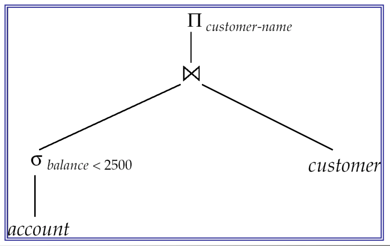
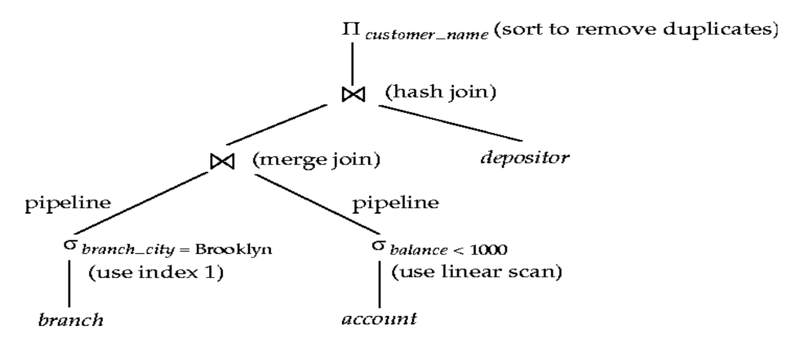
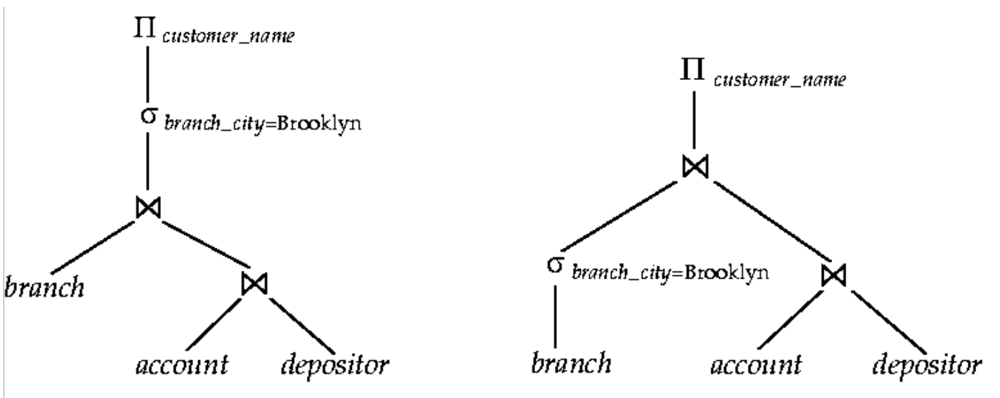
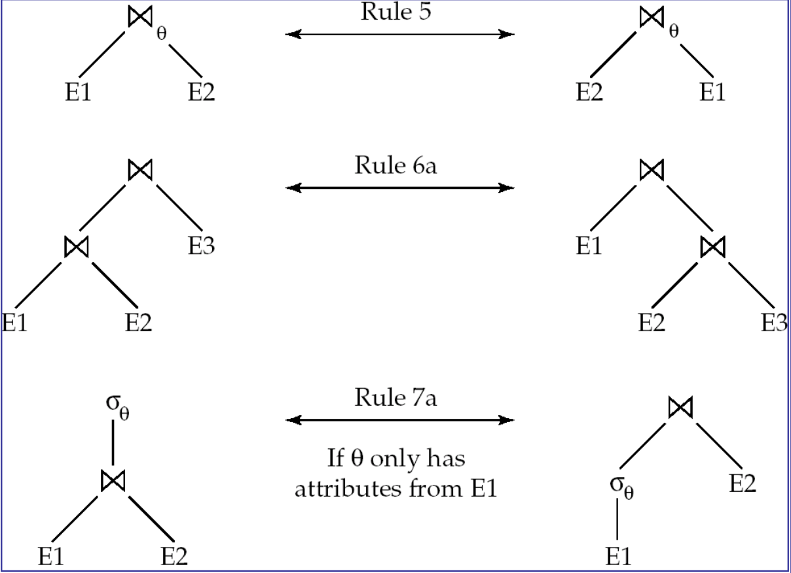
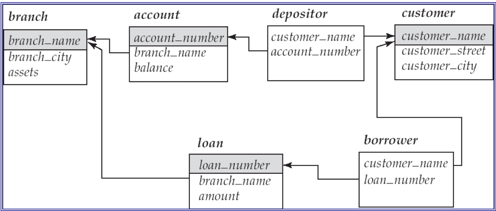
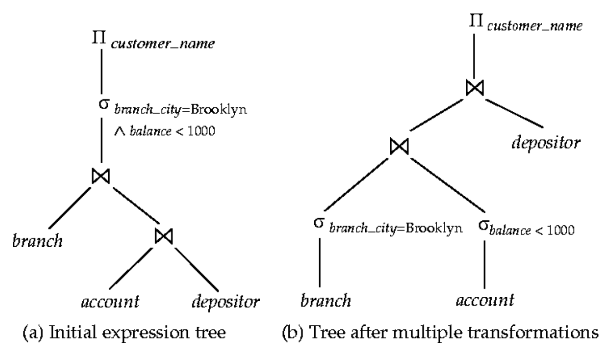
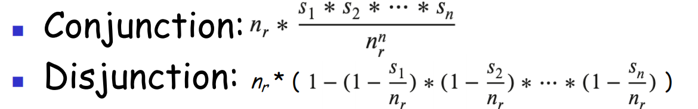

# Query Optimization  查询优化

- Introduction to Query Optimisation  查询优化简介
  - Transformation of Relational Expressions  关系表达式的转换

## Evaluation of Expressions  表达式的分析

- So far we have seen algorithms for individual operations

  到目前为止，我们已经看到了单个操作的算法

  - These have then to be combined to evaluate complex expressions, with multiple operations.

    然后必须将这些组合起来，以计算具有多个操作的复杂表达式。

- Alternatives for evaluating an entire expression tree

  用于评估整个表达式树的替代方法

  - **Materialisation**: generate results of an expression whose inputs are relations or relations that are already computed. Temporary relations must be **materialised**(stored) on disk.

    **物化**：生成表达式的结果，其输入是关系或已计算的关系。临时关系必须 **materialised**（存储）在磁盘上。

  - **Pipelining**: pass on tuples to parent operations even as the operation is being executed.

    **流水线**：将元组传递给父操作，即使操作正在执行。

## Materialisation  具体化

- Materialised evaluation**:** evaluate one operation at a time, starting at the lowest-level. Use intermediate results materialised into temporary relations to evaluate nextlevel operations

  具体化评估**:** 一次评估一个操作，从最低级别开始。使用具体化为临时关系的中间结果来评估下一级操作

  - e.g. in figure below, compute and store the selection (*treat it as a new relation*), then compute its join with *customer and* σbalance < 2500 and store the result*,* and finally compute the projections on ∏*customer-name.* 

    例如，在下图中，计算并存储选择（*将其视为新关系*），然后计算它与 *customer and* 的连接并存储结果，最后计算对 *customer-name* 的投影。

- Materialised evaluation is always applicable.

  具体化评估始终适用。

- It may require considerable storage space. Moreover, cost of writing results to disk and reading them back can be quite high

  它可能需要相当大的存储空间。此外，将结果写入磁盘并读回它们的成本可能相当高

  - Our cost formulas for operations **ignore** cost of writing the **final** results to disk, so:

    我们的操作成本公式**忽略**了将**最终结果**写入磁盘的成本，因此：

  - **Overall cost** = Sum of costs of individual operations + **cost of writing intermediate results to disk**

    **总成本** = 单个操作的成本总和 + **将中间结果写入磁盘的成本**

- Double buffering: use two output buffers for each operation, when one is full, write it to disk while the other is getting filled

  双缓冲：每个操作使用两个输出缓冲区，当一个缓冲区已满时，将其写入磁盘，而另一个已满

  - Allows overlap of disk writes with computation and reduces execution time

    允许磁盘写入与计算重叠，并缩短执行时间

## Piplining 管道

- **Pipelined evaluation**: evaluate several operations simultaneously, passing the results of one operation on to the next.

  **流水线评估**：同时评估多个操作，将一个操作的结果传递给下一个操作。

  - e.g. in previous expression tree, don’t store result ofthe selection 

    例如，在前面的表达式树中，不存储选择的结果

    - instead, pass tuples directly to the join.

      相反，将 Tuples 直接传递给 Join。

    - Similarly, don’t store result of join, pass tuples directly to projection. 

      同样，不要存储 join 的结果，将 Tuples 直接传递给 projection。

- It is much cheaper than materialisation: there is no need to store a temporary relation to disk.

  **它比 materialization 便宜得多**：不需要存储与 disk 的临时关系。

- Pipelining may **not** always be possible – e.g. external merge-sort and hash-join where a preliminary phase is required over the whole relations.

  流水线可能 **并非总是** 是可能的 —— 例如，外部合并排序和哈希连接，其中整个关系需要一个初步阶段。

- Pipelines can be executed in two ways: **demand driven** and **producer driven**.

  管道可以通过两种方式执行：**需求驱动**和**生产者驱动**。

### Producer-Driven Pipelining  生产驱动的流水线

从下到上

- In producer-driven (or eager or push) pipelining

  在生产者驱动（或预先或推送）流水线中

  - Operators produce tuples eagerly and pass them up to their parents

    运算符急切地生成元组并将其传递给它们的父组

    - buffer maintained between operators, child puts tuples in buffer, parent removes tuples from buffer

      运算符之间维护缓冲区，子级将元组放入缓冲区，父级从缓冲区中移出元组

    - if buffer is full, child waits till there is space in the buffer, and then generates more tuples

      如果 buffer 已满，则 child 会等待缓冲区中有空间，然后生成更多 Tuples

  - System schedules operations that have space in output buffer and can process more input tuples.

    系统计划在输出缓冲区中有空间并且可以处理更多输入元组的操作。

### Demand-Driven Pipelining  需求驱动的管道

从上到下

- In demand driven (or lazy, or pull) evaluation

  需求驱动（或延迟或拉取）评估

  - System repeatedly requests next tuple from top level operation

    系统从顶级操作重复请求 next tuples

  - Each operation requests next tuple from child operations as required, in order to output its next tuple

    每个操作都根据需要从子操作请求 next Tuples，以便输出其 next Tuples

  - In between calls, operation has to maintain “state” so it knows what to return next.

    在两次调用之间，操作必须保持 “state” ，以便它知道下一步要返回什幺。

### Evaluation Plan  评估计划

- An **evaluation plan** defines exactly what algorithm is used for each operation, and how the execution of the operations is coordinated.

  评估计划准确定义了每个操作使用的算法，以及如何协调操作的执行。
  
  一个join的两条边必须同时使用pipeline才行。要么就都不用，然后此时需要将结果先存储再分析

### Notes on Using Pipelining  使用 Pipelining 的注意事项

- If an edge in the evaluation tree is labelled with pipelining, then pipelining can be used

  如果评估树中的边缘标有 pipelining，则可以使用 pipelining

- For join operations, unless stated explicitly, ONLY nested loop join can always use pipelining

  **对于 join 操作，除非明确说明，否则只有 nested loop join 才能始终使用流水线**。

  - But if it is explicitly stated that a join operation can use pipelining, then pipelining should/can be used.

    但是，如果明确声明 join 操作可以使用流水线，那幺应该/可以使用流水线。

  - If an edge in the evaluation tree is NOT labelled with pipelining (unless nested loop join is used), then it is assumed that pipelining cannot be used.

    如果评估树中的一条边没有用 pipelining 标记（除非使用嵌套循环连接），则假定不能使用 pipelining。

### Cost-based Query Optimisation  基于成本的查询优化

- Cost difference between evaluation plans for a query can be enormous

  查询评估计划之间的成本差异可能很大

  - E.g. seconds vs. days in some cases

    例如，在某些情况下，秒与天

- **Cost-based query optimisation**

  **基于成本的查询优化**

  - Find logically equivalent expressions of the given expression (but more efficient to execute)

    查找给定表达式的逻辑等效表达式（但执行效率更高）

  - Select a detailed strategy for processing the query based on the cost of plans, such as choosing the algorithm to use for executing an operation or choosing the specific indices to use

    根据计划成本选择处理查询的详细策略，例如选择要用于执行操作的算法或选择要使用的特定索引

- Estimation of plan cost based on:

  计划成本估算基于：

  - **Statistical information** about relations, e.g. number of tuples, number of distinct values for an attribute

    有关关系的 **统计信息** ，例如 Tuples 数、属性的不同值数

  - **Statistical estimation for intermediate results** to compute cost of complex expressions

    **中间结果的统计估计** 用于计算复杂表达式的成本

  - **Cost formulae** for algorithms, computed using statistics

    算法的 **成本公式**，使用统计数据计算

- It should be noted that since the cost is an estimate, the selected plan is **not** necessarily the least-costly plan; however, as long as the estimates are good, the plan will not be much more costly than it.

  应该注意的是，由于成本是估计值，因此所选计划不一定是成本最低的计划;但是，只要估计是好的，该计划就不会比它贵多少。

### Equivalent expressions  等效表达式

- Alternative ways of evaluating a given query

  评估给定查询的替代方法

  - Equivalent expressions

    等效表达式

  - Different algorithms for each operation

    每个操作的不同算法

## Transformation of Relational Expressions  关系表达式的转换

- Two relational algebra expressions are said to be **equivalent** if the two expressions generate the same set of tuples on every legal database instance

  如果两个关系代数表达式在每个合法数据库实例上生成相同的元组集，则称这两个关系代数表达式是等效的

  - Note: order of tuples is irrelevant

    注意：元组的顺序无关紧要

  - In SQL, inputs and outputs are multisets of tuples

    在 SQL 中，输入和输出是 Tuples 的多组

  - Two expressions in the multiset version of the relational algebra are said to be equivalent if the two expressions generate the same multiset of tuples on every legal database instance. 

    如果关系代数的 multiset 版本中的两个表达式在每个合法数据库实例上生成相同的 multiset 元组，则称这两个表达式是等效的。

- An **equivalence rule** says that expressions of two forms are equivalent if

  等价规则表示，如果

  - Can replace expression of the first form by the second, or vice versa

    可以用第二种形式替换第一种形式的表达式，反之亦然

### Equivalence Rules  等价规则

- Rule 1: **Conjunctive** selection operations can be deconstructed into a sequence of individual selections.

  规则 1：联合选择操作可以解构为一系列单独的选择。

  σθ1θ2(E) = σθ1(σθ2(E))

- Rule 2: Selection operations are **commutative**.

  规则 2：选择操作是 **可交换的**。

  σθ1(σθ2(E) = σθ2(σθ1(E))

- Rule 3: Only the **last** one in a sequence of projection operations is needed, the others can be omitted.

  规则 3：只需要一系列投影操作中的 **最后** 一个，其他的可以省略。

  ∏L1(∏L2(...(∏Ln(E))...)) = ∏L1(E)

- Rule 4: Selections can be **combined** with Cartesian products and theta joins.

  规则 4：选择可以与 Cartesian 积和 theta 连接组合。

  - σθ(E1 X E2) = E1⋈θ E2
  -  σθ1(E1 ⋈θ2 E2) = E1⋈θ1∧θ2 E2

- Rule 5: Theta-join operations (and natural joins) are **commutative**.

  规则 5：Theta-join 操作（和自然连接）是 **可交换的**。

  - E1 ⋈θ E2 = E2 ⋈θ E1

- Rule 6: 

  规则六

  - (a) Natural join operations are **associative**:

    自然联接操作是 **associative**：

    (E1 ⋈ E2) ⋈ E3 = E1 ⋈ (E2 ⋈ E3)

  - (b) Theta joins are **associative** in the following manner:

    Theta 联接以以下方式 **结合** ：

    (E1 ⋈θ1 E2) ⋈θ2∧θ3 E3 = E1 ⋈θ1∧θ3 (E2 ⋈θ1 E3)
    
    where θ2 involves attributes from only E2 and E3.
    
    其中 θ2 仅涉及来自 E2 和 E3 的属性。

- Rule 7. The selection operation **distributes** over the theta join operation under the following two conditions:

  规则 7.在以下两种情况下，选择操作分布在 theta 连接操作上：

  - (a) When θ0 involves only the attributes of one of the expressions (*E*1) being joined.

    当 θ0 时 仅涉及要连接的表达式 （*E*1） 之一的属性。

    σθ0(E1 ⋈θ E2) = (σθ0 (E1)) ⋈θ E2

  - (b) When θ1 involves only the attributes of E1 and θ2 involves only the attributes of E2.

    σθ1∧θ2(E1 ⋈θ E2) = (σθ1(E1)) ⋈θ (σθ2 (E2))

  - Pictorial Depiction of Equivalence Rules:

    等价规则的图形描述

    

- Rule 8. The projection operation **distribute**s over the theta join operation as follows:

  投影操作 **distribute**s 在 theta join 操作上，如下所示：

  - (a) Let *L*1 and *L*2 be attributes from *E*1 and *E*2, if q involves only attributes from *L*1 ∪ *L*2:

    设 *L*1 和 *L*2 是 *E*1 和 *E*2 的属性，如果 q 只涉及 *L*1 ∪ *L*2 的属性：

    ∏L1 ∪ L2 (E1 ⋈θ E2) = (∏L1 (E1)) ⋈θ (∏L2 (E2))

  - (b) Consider join *E*1 ⋈θ *E*2.

    - let L1 and L2 be sets of attributes from E1 and E2, respectively. 
    
      设 L1 和 L2 分别是 E1 和 E2 的属性集

    - let L3 be attributes of E1 that are involved in join condition q, but are not in L1 ∪ L2, and
    
      设 L3 是 E1 的属性，这些属性涉及联接条件 q，但不在 L1 ∪ L2 中，并且
    
    - let L4 be attributes of E2 that are involved in join condition q, but are not in L1 ∪ L2
    
      设 L4 是 E2 的属性，这些属性涉及联接条件 q，但不在 L1 ∪ L2 中
    
    ∏L1∪L2 (E1 ⋈θ E2) = ∏L1∪L2 ((∏L1∪L3 (E1)) ⋈θ (∏L2∪L4 (E2)))

- Rule 9: The set operations union and intersection are **commutative** (set difference is not commutative)

  规则 9：集合操作 union 和 interchannel 是 **可交换的**（集合差异不是可交换的）

  E1 ∪ E2 = E2 ∪ E1

  E1 ∩ E2 = E2 ∩ E1

- Rule 10. Set union and intersection are **associative**.

  集合并和交集是有关联的

  (E1 ∪ E2) ∪ E3 = E1 ∪ (E2 ∪ E3)

  (E1 ∩ E2) ∩ E3 = E1 ∩ (E2 ∩ E3)

- Rule 11. The selection operation distributes over ∪, ∩ and –.

  选择操作分布在 ∪、∩ 和 – 上。

  σθ (E1 ∪ E2)  = σθ(E1) ∪ σθ(E2)

  σθ (E1 ∩ E2)  = σθ(E1) ∩ σθ(E2)

  σθ (E1 – E2)  = σθ(E1) – σθ(E2)

- Rule 12. The projection operation distributes over union

  规则 12.投影操作分布在 union 上

  ∏L(E1 ∪ E2) = (∏L(E1)) ∪ (∏L(E2))

### Continue with Banck Example

### Example: Pushing Selections 推送选择

- Query: Find the names of all customers who have an account at some branch located in Brooklyn.

  查找在位于 Brooklyn 的某个分行拥有帐户的所有客户的姓名

  ∏customer_name(σbranch_city = “Brooklyn” (branch ⋈ (account ⋈ depositor)))

- Transformation using rule 7a (distribute the selection).

  使用规则 7a （分布选区） 进行转换。

  ∏customer_name((σbranch_city = “Brooklyn” (branch)) ⋈ (account ⋈ depositor))

- **Performing the selection as early as possible reduces the size of the relation to be joined.** 

  尽早执行选择操作可减小要连接的关系的大小。

### Example: Multiple Transformations  多个交换

- Query: Find the names of all customers with an account at a Brooklyn branch whose account balance is over $1000.

  查询：查找在 Brooklyn 分行拥有账户且账户余额超过 1000 美元的所有客户的姓名。

  ∏customer_name(σbranch_city = “Brooklyn” ∧ balance>1000 (branch ⋈ (account ⋈ depositor)))

- Transformation using join associatively (Rule 6a and 7a):

  使用关联连接进行转换（规则 6a 和 7a）：

  ∏customer_name((σbranch_city = “Brooklyn” ∧ balance>1000 (branch ⋈ account)) ⋈ depositor)

- Second form provides an opportunity to apply the “perform selections early” (Rule 7b)

  第二种形式提供了应用“提前执行选择”的机会（规则 7b）

  σbranch_city = “Brooklyn” (branch) ⋈ σbalance > 1000 (account)

- Thus a sequence of transformations can be useful.

  因此，一系列转换可能很有用。

​	

### Transformation Example: Pushing Projections  推送投影

∏customer_name((σbranch_city = “Brooklyn” (branch) ⋈ account) ⋈ depositor)

- When we compute

  (σbranch_city = “Brooklyn” (branch) ⋈ account)

  we obtain a relation whose schema is:(branch_name, branch_city, assets, account_number, balance)

  我们得到一个表为：（branch_name， branch_city， assets， account_number， balance）

- Push projections using equivalence rules 8b; eliminate unneeded attributes from intermediate results to get:

  使用等价规则 8b 的推投影;从中间结果中消除不需要的属性以获得：

  ∏customer_name((∏account_number((σbranch_city = “Brooklyn” (branch) ⋈ account) ⋈ depositor))

  (HINT: L1 is null, L2 is customer_name; L3=L4=account_number) 

- Performing projection as early as possible reduces the size of the tuples to be joined. 

  尽早执行投影可以减小要连接的元组的大小。

### Joining Ordering Example

- For all relations r1, r2, and r3,

  (r1 ⋈ r2) ⋈ r3 = r1 ⋈ (r2 ⋈ r3)

- If *r*2 *r*3 is quite large and *r*1 *r*2 is small, we may **choose**

  （r1 ⋈ r2 ) ⋈ r3

 so that we compute and store a smaller temporary relation.

以便我们计算和存储一个较小的临时关系。

- Consider the expression  考虑一下表达式

  ∏customer_name((σbranch_city="Brooklyn"(branch)) ⋈ (account ⋈ depositor))

- Could compute "acccount ⋈ depositor" first, and join result with σbranch_city="Brooklyn"(branch).

  but “*account ⋈ depositor”* is likely to be a large relation.

- Only a small fraction of the customers are likely to have accounts in branches located in Brooklyn

  只有一小部分客户可能在位于布鲁克林的分行拥有账户

  it is better to compute first

  σ*branch_city* = “Brooklyn” (*branch) ⋈ account*

### Enumeration of Equivalent Expressions  等效表达式的枚举

Query optimisers use equivalence rules to systematically generate expressions equivalent to the given expression

查询优化工具使用等效规则系统地生成与给定表达式等效的表达式

The approach is very expensive in space and time

这种方法在空间和时间上都非常昂贵

# Query Optimisation 2

- Introduction to Query Optimisation

  查询优化简介

  - Catalog Information for Cost Estimation

    成本估算的目录信息

  - Cost-based optimisation

    基于成本的优化

## Catalog Information for Cost Estimation  成本估算的目录信息

nr: number of tuples in a relation *r*

关系中元组的数量 *r*

br: number of blocks containing tuples of *r.*

包含 *r* 元组的块数

lr: size of a tuple of *r*

一个*r*元组的大小

fr:  blocking factor of *r;* i.e. the number of tuples of *r* that fit into one block.

*r* 的阻塞因子，即可以在一个块中填入的关系r的元组数。

V(A, r): number of distinct values that appear in *r* for attribute *A;* same as the size of ∏*A*(*r*).

属性A中出现在 *r* 中的非重复值的数量与 ∏*A*（*r*）的大小相同。

If tuples of *r* are stored together physically in a file, then: br = ⌈nr / fr⌉

### Estimation of the Size of Selection

- σ*A=v*(*r*)

  - nr / V(A,r) : number of records that will satisfy the selection

    满足所选内容的记录数

  - Equality condition on a **key** attribute (primary key): size estimate = 1 if it exists

    **key** 属性（主键）的相等条件：size estimate = 1（如果存在）

- σA<=r(r) (case of σA>=V(r) is symmetric)

  - Let c denote the estimated number of tuples satisfying the condition. Let min(A,r) and max(A,r) denote the lowest and highest values for attribute A. 

    设 c 表示满足条件的估计元组数。设 min（A，r） 和 max（A，r） 表示属性 A 的最低值和最高值。

  - If min(A,r) and max(A,r) are available in catalog

    - c = 0 if v < min(A,r)
    - c = nr · (v=min(A, r) / max(A, r) - min(A, r))

  - If histograms available, can refine above estimate

    如果直方图可用，则可以优化上述估计

  - In absence of statistical information *c* is assumed to be nr/ 2.

    在没有统计信息的情况下，假定 *c* 为 nr/ 2。

### Estimation of the Size of Joins

- The Cartesian product r x s contains nr...ns tuples; each tuple occupies sr + ss bytes

- If R ∩ S = ∅, then r ⋈ s is the same as r x s. 

  如果 R ∩ S = ∅，则 r ⋈ s 与 r x s 相同。

- If R ∩ S is a **key** for relation R, then a tuple of s will join with at most one tuple from r

  如果 R ∩ S 是关系 R 的 **键**，则 s 的元组将与 r 中的最多一个元组联接

  - therefore, the number of tuples in *r s* is no greater than the number of tuples in *s.*

    因此，R、S中的元组数不大于 S中的元组数。

- If R ∩ S is a **foreign key** in S referencing R, then the number of tuples in r ⋈ s is exactly the **same as** the number of tuples in s.

  如果 R ∩ S 是 S 中引用 R 的 **外键**，则 r ⋈ s 中的元组数与 s 中的元组数完全相同。

  - The case for R ∩ S being a foreign key referencing S is symmetric.

    R ∩ S 是引用 S 的外键的情况是对称的。

- If R ∩ S = {A} is **not a key** for R or S.If we assume that every tuple t in R produces tuples in R ⋈ S,the number of tuples in R ⋈ S is estimated to be:
  
  如果我们假设 R ∩ S = {A} 不是 R 或 S 的键。如果我们假设 R 中的每个元组 t 都会在 R ⋈ S 中生成元组，则 R ⋈ S 中的元组数估计为： ( V(A, s) number of unique values of attribute A in relation S.)
  
  - nr * ns / V(A, s)
  
- If the reserve is true, the estimate obtained will be: 
  
  如果储备金为 true，则获得的估计值将为：
  
  - nr * ns / V(A, r)

The lower of these two estimates is probably the more accurate one.

这两个估计值中较低的一个可能更准确。

#### Join Operation: Running Example

- Running example: depositor ⋈ customer

  运行示例：存款人⋈客户

- Catalog information for join examples:

  联接示例的目录信息

  - ncustomer = 10000

  - ndepositor = 5000

  - fcustomer = 25, which implies that bcustomer = 10000/25 = 400

  - fdepositor = 50, which implies that bdepositr = 5000/50 = 100

  - V(customer_name, depositor) = 2,500

    - Implies that, on average, each customer has two accounts.

      意味着平均每个客户有两个账户。

    - customer_name in depositor is a foreign key on customer, so the size is 5,000.

      customer_name in depositor 是 customer 上的外键，因此大小为 5,000。

  - V(customer_name, customer) = 10,000 (primary key)

- Compute the size estimate for deposites for depositor ⋈ customer withour using information about foreign keys:

  使用有关外键的信息计算 depositor ⋈ customer 的存款大小估计：

  - V(customer_name, depositor) = 2,500, and

    V(customer_name, customer) = 10,000

  - The two estimates are:

    - nr * ns / V(A, s) = 5000 * 10000 / 2500 = 20000
    - nr * ns / V(A, r) = 5000 * 10000 / 10000 = 5000

  - We choose the lower estimate, which in this case, is the **same** as our earlier computation using foreign keys.

    我们选择较低的估计值，在本例中，它与我们之前使用外键的计算 **相同**。

### Size Estimation for Other Operations

- Projection: estimated size of ∏A(r) =V(A,r)

- Set operations

  - For unions/intersections of selections on the **same** relation: rewrite and use size estimate for selections

    对于同一关系上选择项的并集/交集：重写并选择项的大小估计

    - e.g. σθ1(r) ∪ σθ2(r) can be rewritten as σθ1∨θ2(r)
      - 
  
  - For operations on **different** relations:
  
    - estimated size of r ∪ s = size of r + size of s. 
  
      估计的 r ∪ s 的大小 = r 的大小 + S 的大小。
  
    - estimated size of r ∩ s = minimum size of r and size of s.
  
      r ∩ s 的估计大小 = r 的最小大小和 s 的大小。
  
    - estimated size of r – s = r.
  
      r 的估计大小 – s = r。
  
    - All the three estimates may be quite **inaccurate**, butprovide **upper bounds** on the sizes
  
      所有这三个估计值可能都非常不准确，但提供了大小的上限

### Estimation of Number of Distinct Values in Selection

- If θ forces A to take a specified value:V(A,σθq (r)) = 1.

  - e.g. A = 3

- If θ forces A to take on one of a specified set of values: 

  - V(A, σθ(r)) = number of specified values

  - (e.g. (A = 1 ∨ A = 3 ∨ A = 4 )), 

- If the selection condition θ is of the form A op v (op is \>, <, etc), s is the proportion of selection.
  - V(A, σθ(r)) = V(A,r) * s

- In all the other cases: use approximate estimate of **min(V(A, r), nσθ(r))**

**Joins: r ⋈ s**

- If all attributes in A are from r,

  - estimated V(A, r ⋈ s) = **min (V(A,r), nr⋈s)**

- If **A contains attributes A1 from r and A2 from s**, then estimated:

  - **V(A, r ⋈ s)** = min(V(A1,r) * V(A2 – *A*1, s), V(A1 – A2, r) * V*(*A2,s), nr⋈s)

  - More accurate estimate can be obtained using probability theory, but this one works fine generally

    使用概率论可以获得更准确的估计，但这个通常效果很好

## Choice of Evaluation Plans

- **Must** consider the **interaction** of evaluation techniques when choosing evaluation plans

  在选择评估计划时，**必须**考虑评估技术的 **相互作用**

  - **choosing the cheapest algorithm for each operation independently may not yield best overall algorithm**, e.g.

    **为每个操作单独选择最便宜的算法可能不会产生最佳的整体算法**，例如

    - merge-join may be costlier than hash-join, but may provide a sorted output which reduces the cost for an outer level aggregation.

      merge-join 可能比 hash-join 成本更高，但可以提供排序输出，从而降低外部级别聚合的成本。

    - nested-loop join may provide opportunity for **pipelining**

      嵌套循环连接可能为pipelining提供机会

- Practical query optimisers incorporate elements of the following two broad approaches:

  实用的查询优化器包含以下两种广泛方法的元素：

  - Search all the plans and choose the best plan in a cost based fashion.

    搜索所有计划并以基于成本的方式选择最佳计划。

  - Uses heuristics to choose a plan.

    使用启发式方法选择计划。

### Cost-Based Join Order Optimisation  基于成本的联接订单优化

- Consider finding the best join-order for  r1 ⋈ r2 ⋈ ... rn

- There are (2(n – 1))!/(n – 1)! different join orders for above expression. With n = 7, the number is 665280, with n = 10, the number is greater than 176 billion!

  有 （2（n – 1））！/（n – 1）！上述表达式的不同 join 顺序。当 n = 7 时，这个数字是 665280，当 n = 10 时，这个数字大于 1760 亿个！

- No need to generate all join orders. 

  无需生成所有连接订单。

- Using dynamic programming, the least-cost join order for any subset of {r1, r2, . . . rn} is computed only once and stored for future use.

  使用动态规划时，{*r*1， *r*2， . . . *rn*} 的任何子集的最小成本连接顺序仅计算一次并存储以备将来使用。

## Dynamic Programming in Join Order Optimisation

- To find best plan (join tree) for a set of n relations:

  要为n组 relations 找到最佳计划 （join tree）：

  - Consider all possible plans of the form: S1 ⋈ (S – S1), where S1 is any non-empty subset of S.

    考虑以下形式的所有可能计划：S1 ⋈ （S – S1），其中 S1 是 S 的任何非空子集。
  
  - Recursively compute cost for joining subsets of S to find the cost of each plan. Choose the cheapest of the alternatives.
  
    递归计算联接 S 子集的成本，以查找每个计划的成本。选择最便宜的替代方案。
  
  - **Base case** for recursion: single relation access plan
    
    递归的 **基本情况** ：单表访问计划
    
    - E.g. find the best selection strategy for a particular relation Ri
    
      例如，为特定关系 Ri
    
  - When plan for any subset is computed, store it and reuse it when it is required again, instead of recomputing it.
  
    计算任何子集的计划时，请存储它并在再次需要时重用它，而不是重新计算它。

### Join Order Optimisation Algorithm

// initialise bestplan[S].cost to ♾️

procedure findbestplan(S)

​	if (bestplan[S].cost ≠ ♾️)

​		**return** bestplan[S]

// else bestplan[S] has not been computed earlier, compute it now

**if** (S contains only 1 relation)

​		set bestplan[S].plan and bestplan[S].cost based on the best way 

​		of accessing S /* Using selections on S, e.g. indices on S */

**else for each** non-empty subset S1 of S such that S1 ¹ S

​		P1= findbestplan(S1)

​		P2= findbestplan(S - S1)

​		A = best algorithm for joining results of P1 and P2

​		cost = P1.cost + P2.cost + cost of A

​		**if** cost < bestplan[S].cost 

​			bestplan[S].cost = cost

​			bestplan[S].plan = “execute P1.plan; execute P2.plan;

​							join results of P1 and P2 using A”

**return** bestplan[S]

### Cost of Join Order Optimisation

- With dynamic programming time complexity of optimisation with bushy trees is O(3n).
  
  使用动态规划时间，使用bushy tree进行优化的复杂度为 O（3n）。
  
  - With n = 10, this number is 59000 instead of 176 billion!
  
    当 n = 10 时，这个数字是 59000 而不是 1760 亿！
  
- Space complexity is O(2n) as the number of subsets of the S is 2n.

  空间复杂度为 O（2n），因为 S 的子集数为 2n。

- Although both numbers still increase rapidly with n, commonly occurring joins usually have less than 10 relations, and can be handled easily.

  尽管这两个数字仍然随着 n 的增加而迅速增加，但常见的联接通常具有少于 10 个关系，并且可以轻松处理。

## Cost-Based Optimisation with Equivalence Rules  基于成本的优化与等价规则

- Many optimisers follow an approach based on

  许多优化器遵循基于

  - Using **heuristic transformations** to handle constructs other than joins

    使用启发式转换处理联接以外的构造

  - applying the cost-based **join order selection algorithm** to subexpressions involving only joins and selections

    将基于成本的连接顺序选择算法应用于仅涉及连接和选择项的子表达式

- General-purpose cost-based optimiser based on equivalence rules

  基于等价规则的通用基于成本的优化器

  - easy to extend the optimiser with new rules to handle different query constructs

    使用新规则轻松扩展优化器以处理不同的查询结构

  - but the procedure to enumerate all equivalent expressions is very expensive

    但是枚举所有等效表达式的过程非常昂贵

- To make the approach work efficiently requires the following:

  要使该方法有效工作，需要满足以下条件：

  - A space-efficient representation of expressions

    节省空间的表达式表示

  - Efficient techniques for detecting duplicate derivations of the same expression

    检测相同表达式的重复派生的有效技术

  - dynamic programming based on memoisation

    基于记忆的动态规划

  - avoid generating all possible equivalent plans

    避免生成所有可能的等效计划

## Heuristic Optimisation  启发式优化

- Cost-based optimisation is expensive, even with dynamic programming.

  基于成本的优化成本高昂，即使使用动态编程也是如此。

- Systems may use *heuristics* to reduce the number of choices that must be made in a cost-based fashion.

  系统可以使用 *启发式* 来减少必须以基于成本的方式做出的选择数量。

- Heuristic optimisation transforms the query-tree by using a set of rules that typically (but not in all cases) improve execution performance:

  启发式优化通过使用一组规则来转换查询树，这些规则通常（但并非在所有情况下）可以提高执行性能：

  - Perform selection early (reduces the number of tuples)

    尽早执行选择（减少 Tuples 的数量）

  - Perform projection early (reduces the number of attributes)

    提前执行投影（减少属性数量）

  - Perform the most restrictive selection and join operations (i.e. with smallest result size) before other similar operations.

    在其他类似操作之前执行限制性最强的 selection 和 join 操作（即具有最小的结果大小）。

- Some systems use only heuristics, others combine heuristics with partial cost-based optimisation.

  一些系统仅使用启发式方法，而另一些系统将启发式方法与基于部分成本的优化相结合。

### Other heuristics: Left Deep Join Trees

- In **left-deep join trees,** the right-hand-side input for each join is a relation, not the result of an intermediate join.

  在 **left-deep join trees** 中，每个连接的右侧输入是一个关系，而不是中间连接的结果。

### Cost of Left Deep Join Optimisation

- To find best left-deep join tree for a set of n relations:

  要为一组 n 个关系找到最佳的左深连接树：

  - Consider n alternatives with one relation as right-hand side input and the other relations as left-hand side input.

    考虑 n 个备选方案，其中一个关系作为右侧输入，其他关系作为左侧输入。

  - Modify dynamic programming optimisation algorithm:

    修改动态规划优化算法：

    - Replace “**for each** non-empty subset S1 of S such that S1 ≠ S”

      将 “**for each** non-empty subset S1 of S so that S1 ≠ S”

    - By: **for each** relation r in S, let S1 = S – r.

      通过：**对于 S 中的每个**关系 r，设 S1 = S – r。

- If only left-deep trees are considered, time complexity of finding best join order is O(n!), with dynamic programming this can be reduced to O(n 2n )

  如果只考虑左深树，则找到最佳连接顺序的时间复杂度为 O（n！），使用动态规划，这可以简化为 O（n 2n ）

  - Space complexity remains at O(2n) 

    空间复杂度保持在 O（2n）

- Cost-based optimisation is expensive, but worthwhile for queries on large datasets (typical queries have small n, generally < 10)

  基于成本的优化成本高昂，但对于大型数据集上的查询来说是值得的（典型查询具有较小的 n，通常< 10）

## Structure of Query Optimisers  查询优化器的结构

- Many optimisers considers only left-deep join orders.

  许多优化器只考虑 left-deep 连接顺序。

  - Plus heuristics to push selections and projections down the query tree

    加上启发式方法，可将选择项和投影推送到查询树中

  - Reduces optimisation complexity and generates plans amenable to pipelined evaluation.

    降低优化复杂性并生成适合管道评估的计划。

- Even with the use of heuristics, cost-based query optimisation imposes a substantial overhead.

  即使使用启发式方法，基于成本的查询优化也会带来大量开销。

  - But is worth for expensive queries

    但对于昂贵的查询来说是值得的 -

  - Optimisers often use simple heuristics for very cheap queries, and perform exhaustive enumeration for more expensive queries

    优化器通常对非常简单和轻量化的查询使用简单的启发式方法，而对更昂贵的查询执行详尽枚举

