# Transaction Management 1 事务管理

## Learning Outcomes

- Basic transaction concepts

- ACID

- Concurrent Execution of transactions

- Schedule

## DBMS Components revisited  重新审视 DBMS 组件

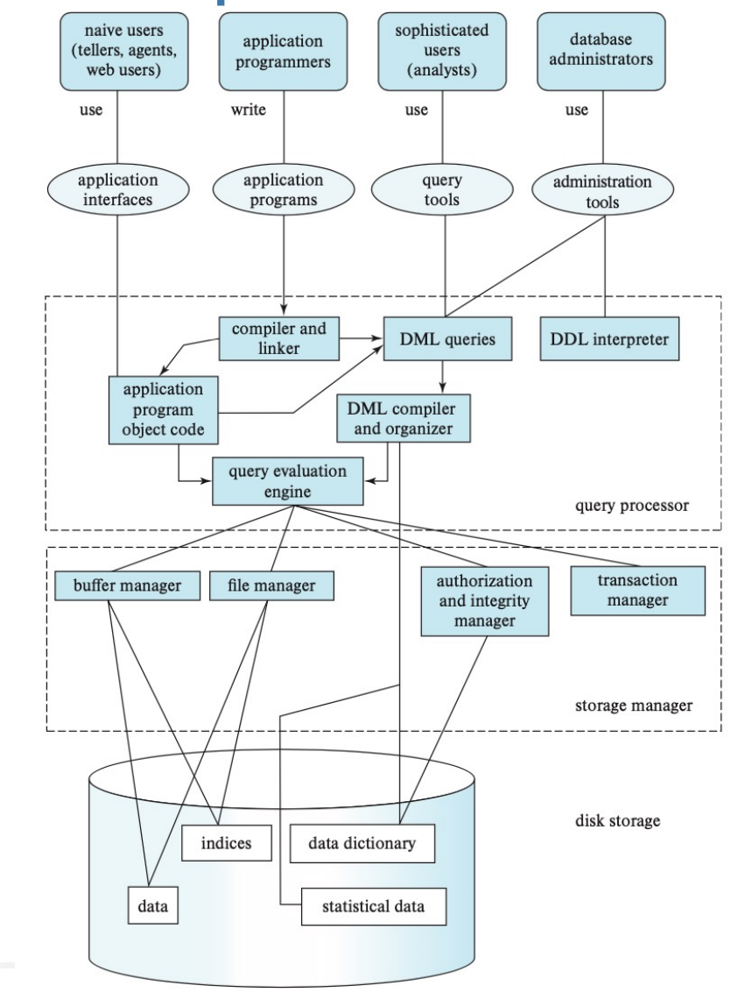

## Transaction 事务

- A **transaction** is a *unit* of program execution that accesses and possibly updates various data items.

  **事务** 是进程执行的 *单元* ，它访问并可能更新各种数据项。

- Two main issues in transaction management

  事务管理中的两个主要问题

  - **Concurrent execution** of multiple transactions

    多笔交易的 **并发执行**

    - Serialisability

      可串行化性

    - Two phase locking

      两相锁定

    - Two phase commit

      两阶段提交

- **Recovery from failures** of various kinds, such as hardware failures and system crashes

  **从各种故障中恢复**，例如硬件故障和系统崩溃

  - Recovery algorithms

    恢复算法

### ACID Properties for Transactions  事务的 ACID 属性

- **Atomicity**: Either all operations of the transaction are properly reflected in the database or none are.

  **原子性**：要幺事务的所有操作都正确反映在数据库中，要幺没有

- **Consistency**: Execution of a transaction in isolation preserves the consistency of the database.

  **一致性**：隔离执行事务可以保持数据库的一致性。

- **Isolation**: Although multiple transactions may execute concurrently, each transaction must be unaware of other concurrently executing transactions. Intermediate transaction results must be hidden from other concurrently executed transactions. 

  **隔离**：尽管多个事务可以并发执行，但每个事务必须不知道其他并发执行的事务。中间事务结果必须对其他并发执行的事务隐藏。

  - That is, for every pair of transactions Ti andTj , it appears toTi that eitherTj finished execution beforeTi started, or Tj started execution afterTi finished.

    也就是说，对于每对交易 Ti 和 Tj ，Ti 似乎 Tj 在 Ti 开始之前完成执行，或者 Tj 在 Ti 完成后开始执行。

- **Durability**: After a transaction completes successfully, the changes it has made to the database persist, even if there are system failures.

  **持久性**：事务成功完成后，即使出现系统故障，它对数据库所做的更改也会保留。

### Example of Fund Transfer 转账示例

The following is a transaction to transfer $50 from account A to account B:  以下是从账户 A 向账户 B 转账 50 美元的交易：

1. **read**(A)

2. A := A – 50

3. **write**(A)

4. **read**(B)

5. B := B + 50

6. **write**(B)

- **Atomicity requirement** — if the transaction fails after step 3 and before step 6, the system should ensure that its updates are not reflected in the database, else inconsistency will result. 

  原子性要求 — 如果事务在步骤 3 之后和步骤 6 之前失败，系统应确保其更新不会反映在数据库中，否则会导致不一致。

- **Consistency requirement** – the sum of A and B is unchanged by the execution of the transaction.

  **一致性要求** – A 和 B 的总和因事务的执行而保持不变。

- **Isolation requirement** — if between steps 3 and 6, another transaction is allowed to access the partially updated database, it will see an inconsistent database (the sum *A+B* will be less than it should be).

  **隔离要求** — 如果在步骤 3 和 6 之间，允许另一个事务访问部分更新的数据库，它将看到一个不一致的数据库（总和 *A+B* 将小于应有的）。

- **Durability requirement** — once the user has been notified that the transaction has completed (i.e. the transfer of the $50 has taken place, or the *commit* instruction has executed), the updates to the database by the transaction must persist despite failures.

  **持久性要求** — 一旦通知用户交易已完成（即 50 美元的转账已经发生，或者 *提交* 指令已经执行），交易对数据库的更新必须在失败的情况下持续存在。

### Transaction State

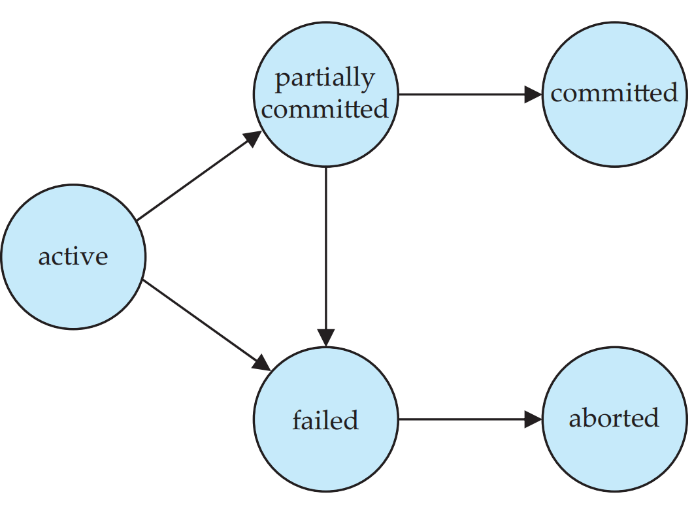

- **Active** – the initial state; the transaction stays in this state while it is executing.

  Active ― 初始状态;事务在执行时保持此状态。

- **Partially committed** – after the final statement has been executed (i.e. *commit* has not executed).

  部分提交 – 在最后一条语句执行之后（即 *commit* 尚未执行）。

- **Failed** – normal execution can no longer proceed.

  Failed – 无法再继续正常执行。

- **Aborted** – after the transaction has been **rolled back** and the database restored to its state prior to the start of the transaction.

  Aborted – 在事务被 *回滚* 并且数据库恢复到事务开始之前的状态之后。

- **Committed** – after successful completion.

  Committed （已提交） – 成功完成后。

## Concurrent Executions  并发执行

- Multiple transactions are allowed to run concurrently in the system. Advantages are:

  允许在系统中同时运行多个事务。优点是：

  - **increased processor and disk utilisation**, leading to better transaction *throughput:* one transaction can be using the CPU while another is reading from or writing to the disk

    **提高处理器和磁盘利用率**，从而获得更好的事务 *吞吐量：* 一个事务可以使用 CPU，而另一个事务正在读取或写入磁盘

  - **reduced average response time** for transactions: short transactions need not wait behind long ones.

    **减少交易的平均响应时间**：短交易不需要在长交易之后等待。

- **Concurrency control schemes** – mechanisms to achieve **isolation**; that is, to control the interaction among the concurrent transactions in order to prevent them from destroying the **consistency** of the database.

  **并发控制方案** – 实现 **隔离** 的机制;也就是说，为了控制并发事务之间的交互，以防止它们破坏数据库的 **一致性**。

## Schedules 事务

- **Schedule** – a sequence of instructions that specifies the chronological order in which concurrent transactions are executed

  **Schedule** – 指定并发事务执行的时间顺序的指令串行

  - a schedule for a set of transactions must consist of all instructions of those transactions

    一组交易的时间表必须包含这些交易的所有指令

  - must preserve the order in which the instructions appear in each individual transaction.

    必须保持指令在每笔交易中的显示顺序。

- A transaction that successfully completes its execution will have a **commit** instruction as the last statement (will be omitted if it is obvious)

  成功完成执行的事务将有一个 **commit** 指令作为最后一条语句（如果很明显，将省略）

- A transaction that fails to successfully complete its execution will have an **abort** instruction as the last statement (will be omitted if it is obvious)

  未能成功完成其执行的事务将具有 **abort** 指令作为最后一条语句（如果很明显，将省略）

### Data Access

- **Physical blocks** are blocks residing on the disk. 

  **物理块** 是驻留在磁盘上的块。

- **Buffer blocks** are blocks residing temporarily in main memory.

  **缓冲区块** 是临时驻留在主内存中的块。

- Block movements between disk and main memory are initiated through the following two operations:

  磁盘和主内存之间的块移动通过以下两个操作启动：

  - **input**(*B*) transfers physical block *B* to buffer.

    input（*B*） 将物理块 *B* 传输到缓冲区。

  - **output**(*B*) transfers buffer block *B* to disk and replaces the appropriate physical block there.

    **output**（*B*） 将缓冲区块 *B* 传输到磁盘，并替换那里相应的物理块。

- Each transaction has its **own working area but share** the same buffer.

  每个事务都有其 **自己的工作区 ，但共享**相同的缓冲区。

  - **read(X)** reads value of X from buffer to its working area.

    **read（X）** 将 X 的值从缓冲区读取到其工作区域。

  - **write(Y)** writes value of Y from its working area to the buffer.

    **write（Y**）将 Y 的值从其工作区域写入缓冲区。

- *Again, assume, for simplicity, that each data item* *fits in, and is stored inside, a single block.*

  同样，为简单起见，假设每个数据项都适合并存储在单个块中。

#### Example

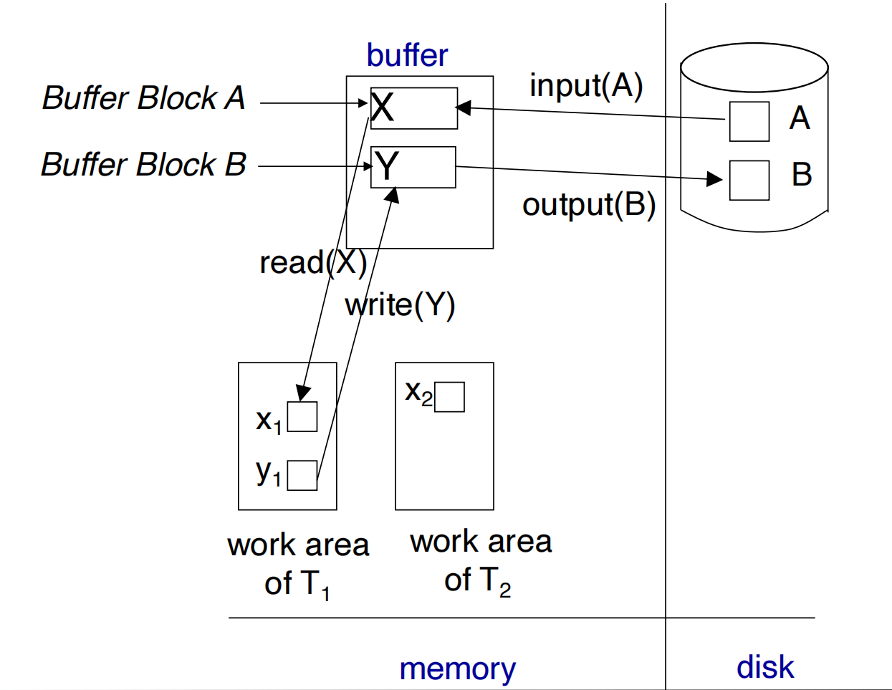

### Example of Schedule 1

Let A=1,000, B=2,000. Let T1 transfer $50 from A to B, and T2 transfer 10% of the balance from A to B.

设 A=1,000，B=2,000。让 T1 将 50 美元从 A 转移到 B ，T2 将余额的 10% 从 A 转移到 B。

- Example schedule 1 is a **serial** schedule (in which T1 is followed by T2)

  示例 Schedule 1 是一个 **serial** 计划（其中 T1 后跟 T2）

- How much is A?

  855

- How much is B?

  

- And how much is A+B?

  

  

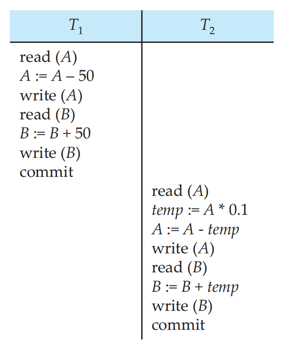

### Example of Schedule 2

Let A=1,000, B=2,000. Let T1 transfer $50 from A to B, and T2 transfer 10% of the balance from A to B.

设 A=1,000，B=2,000。让 T1 将 50 美元从 A 转移到 B ，T2 将余额的 10% 从 A 转移到 B。

- Example schedule 2 is also a **serial** schedule (in which T2 is followed by T1)

  示例 Schedule 2 也是一个 **serial** 计划（其中 T2 后跟 T1）

- How much is A?

  850

- How much is B?

  2150

- And how much is A+B?

  3000

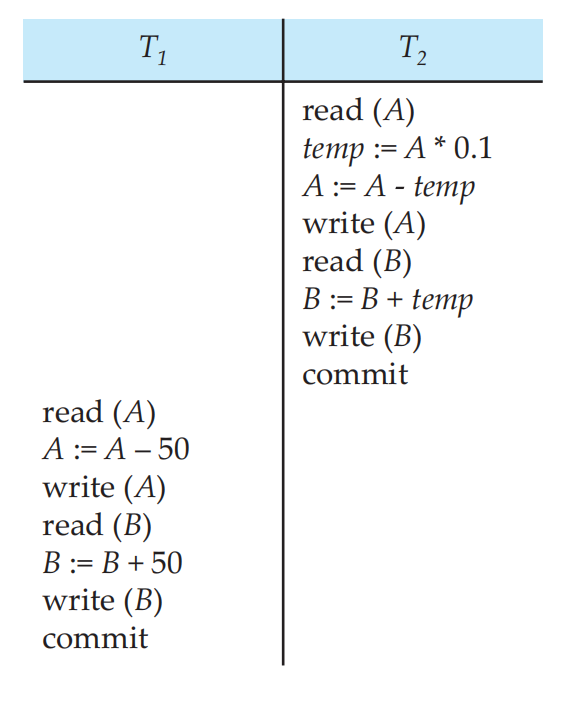

### Example of Schedule 3

Let A=1,000, B=2,000. Let T1 transfer $50 from A to B, and T2 transfer 10% of the balance from A to B

设 A=1,000，B=2,000。让 T1 将 50 美元从 A 转移到 B，T2 将 10% 的余额从 A 转移到 B

- Example schedule 3 is **not** a serial schedule

  示例 Schedule 3 不是 serial Schedule

- How much is A?

  855

- How much is B?

  2145

- And how much is A+B?

  3000

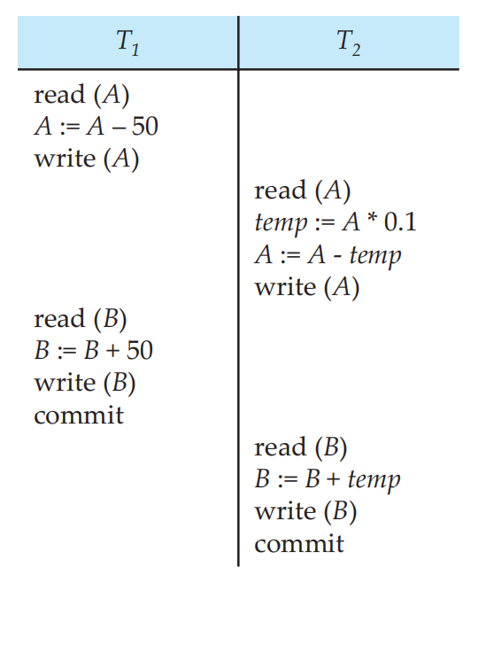

## Example Schedule 4

Let A=1,000, B=2,000. Let T1 transfer $50 from A to B, and T2 transfer 10% of the balance from A to B.

设 A=1,000，B=2,000。让 T1 将 50 美元从 A 转移到 B ，T2 将余额的 10% 从 A 转移到 B。

- Example schedule 4 is **not** a serial schedule

  示例 Schedule 4 不是 serial Schedule

- How much is A?

  950

- How much is B?

  2100

- And how much is A+B?

  3050

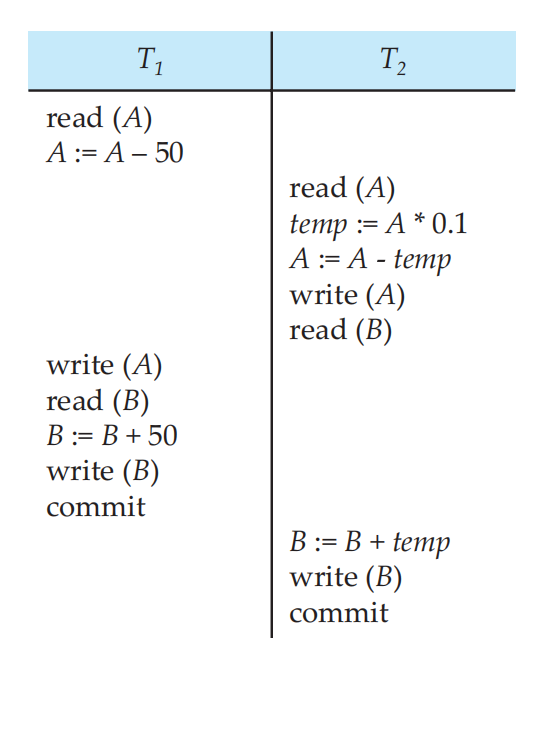

# Transaction Management 2

## Learning Outcomes

- Serialisability

- Testing for Serialisability

- Recoverability

- Cascadeless schedule

## Serialisability 适用性

- Basic Assumption – Each transaction preserves database consistency.

  Basic Assumption （基本假设） – 每个事务都保持数据库一致性。尽管事务是并发执行的，它们的执行效果与按某种顺序依次执行每个事务相同，不会产生不一致的结果

- A concurrent schedule is **serialisable** if it is equivalent to a **serial** schedule. Different forms of schedule equivalence give rise to the notions of:

  如果并发计划等效于 **serialisable**计划，则它是 **serialisable**。不同形式的进度等价产生了以下概念：

  - **conflict** serialisability

    **冲突** 可串行化性

  - **view** serialisability

    **查看** 可串行化性

- Assumptions:

  假设

  - We **ignore** operations other than read and write instructions for now for **simplicity**.

    为简单起见，我们暂时忽略 read 和 write 指令以外的操作。

  - We **assume** that transactions may perform arbitrary computations on data in local buffers in between reads and writes

    我们假设事务可以在读取和写入之间对本地缓冲区中的数据执行任意计算

### Conflicting Instructions 冲突条件

Instructions li and lj of transactions Ti and Tj , **conflict**, if and only if there exists some data item Q accessed by **both** li and lj , and **at least** one of these instructions is **write** Q. 

交易 Ti 和 Tj 的指令 li 和 lj 同时访问了内容Q ， 并且 **至少** 这些指令之一是 **write** Q。

**conflicts:**

- Three kinds of conflicts can be identified:  可以识别三种类型的冲突：

  - **write-read** (WR) conflict: reading uncommitted data (or *dirty read*)

    **write-read** （WR） 冲突：读取未提交的数据（或 *脏读*）

  - **read-write** (RW) conflict: unrepeatable reads

    **读写** （RW） 冲突：不可重复的读取

  - **write-write** (WW) conflict: overwriting uncommitted data (or *blind write*)

    **write-write** （WW） 冲突：覆盖未提交的数据（或 *盲写*）

Intuitively, a conflict between li and lj forces a (logical) temporal order between them.

直觉上，li 和 lj 之间的冲突迫使它们之间有一个（逻辑的）时间顺序。

If li and lj are **consecutive** in a schedule and they do not conflict, their results would remain the same even if they had been interchanged in the schedule, i.e.the two instructions can be **swapped**.

如果 li 和 lj 在计划中是 **连续的**，并且它们没有冲突，那幺即使它们在计划中被交换，它们的结果也将保持不变，即两条指令可以 **交换**。

### Write-Read (WR) Conflicts

- Transaction T2 reads a database object that has been modified by transaction T1 which has not committed (**“dirty read”**)

  事务 T2 读取已被事务 T1 修改的数据库对象，该事务尚未提交（“脏读”）

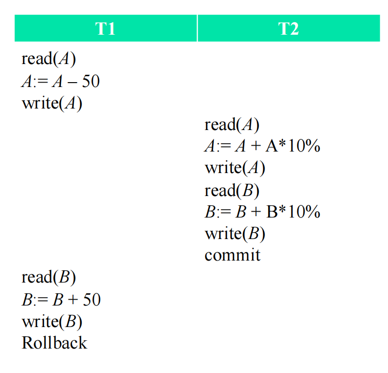

### Read-Write (RW) Conflicts

Transaction T2 could change the value of an object that has been read by a transaction T1, while T1 is still in progress. (**unrepeatable read**)

事务 T2 可以更改事务 T1 已读取的对象的值，而 T1 仍在进行中。（不可重复读取）

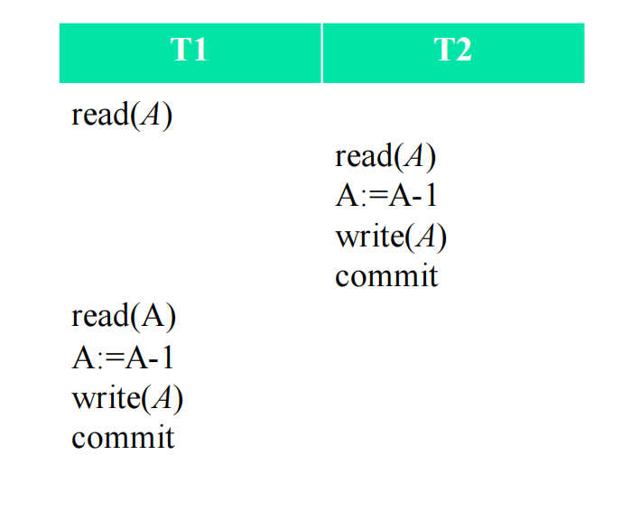

Let A=1 and assume that there is an integrity constraint that prevents A from becoming negative. T1 will get an error.

设 A=1 并假设存在防止 A 变为负的完整性约束。T1 将收到错误。

### Write-Write (WW) Conflicts 

- Transaction T2 could overwrite the value of an object which has already been modified by T1, while T1 is still in progress. (**Blind Write**)

  事务 T2 可以覆盖 T1 已修改的对象的值，而 T1 仍在进行中。（盲写）

- “Blind Write” example

  “盲写”示例

  - T1: set both Steven and Paul salaries at USD 1m.

    T1：将 Steven 和 Paul 的薪水都设置为 1m 美元。

  - T2: set both Steven and Paul salaries at RMB 1m.

    T2：将 Steven 和 Paul 的薪水都设置为 RMB 1m

- With this schedule

  使用此时间表

  - Steven has salary 1m RMB.

    Steven 的薪水是 1m RMB。

  - Paul has salary 1m USD.

    Paul 的薪水为 1m USD。

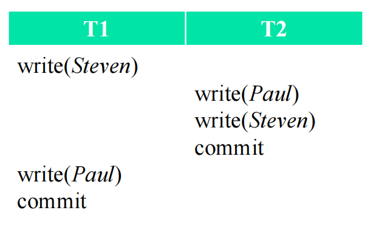

### Conflict Serialisability  冲突可串行化

If a schedule S can be transformed into a schedule S´ by a series of swaps of **non-conflicting** instructions, we say that Sand S´ are **conflict equivalent**. A schedule S is **conflict serialisable** if it is **conflict equivalent** to a **serial** schedule.

如果一个附表 S 可以通过一系列 **非冲突** 指令的交换转化为附表 S'，那幺我们说 Sand S' 是 **冲突等价的**。如果调度 S 与 **serial** 调度 **conflict 等效**，则该调度是 **conflict serialisable**。

- Example of a schedule that is not conflict serialisable

  不可冲突串行化的计划示例

- We are unable to swap instructions in the schedule to obtain either the serial schedule <*T*3, *T*4 >, or the serial schedule <*T*4, *T*3 >.

  我们无法交换附表 中的指示以获取系列附表 <*T*3、*T*4 > 或系列附表 <*T*4、*T*3 >。

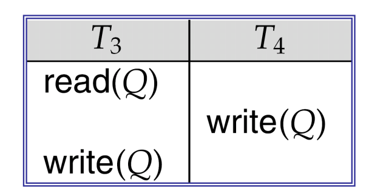

### Example: Conflict Equivalent Schedule

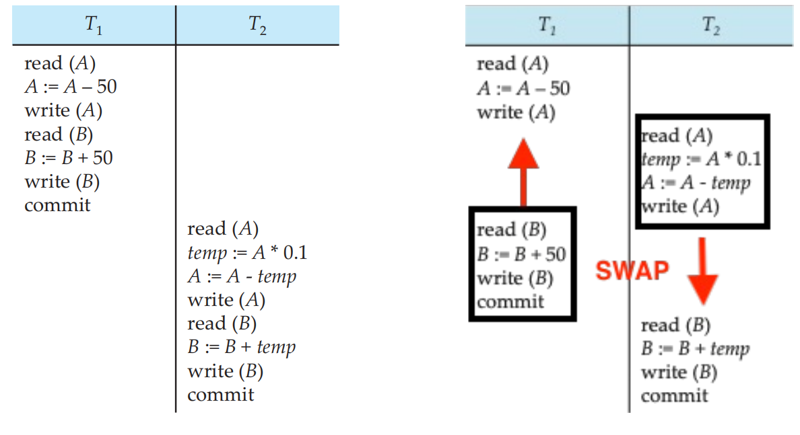

- In the previous lecture, the two example schedules produce the same results: A=855, B=2145, A+B=3000.

  在上一讲中，两个示例计划产生相同的结果：A=855、B=2145、A+B=3000。

- They are in fact **conflict equivalent** schedules.

  它们实际上是 **冲突等效** 计划。

## Test for Conflict Serialisability

- Consider a schedule with a set of transactionsT1, T2, ..., Tn

  考虑一个包含一组事务的计划T1、T2、...、Tn

- **Precedence graph** — a directed graph where （**考试常考！！！！！！**）
  
  **Precedence graph** — 有向图

  - vertices are the transactions (names).
  
    vertices 是事务 （名称）。
  
  - an arc (edge) is drawn from Ti to Tj if the two transactions conflict, and Ti accesses the **same** data item **before** Tj does
  
    如果两个事务冲突，则从 Ti 到 Tj 绘制一条弧（边），并且 Ti 访问相同的数据项 j 之前
  
- A schedule is conflict serialisable if and only if its precedence graph is acyclic (i.e. no loops).

  当且仅当其优先级图是非循环的（即没有循环）时，调度是可冲突串行化的。

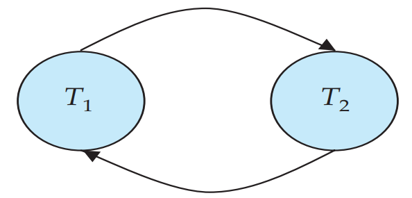

- Cycle-detection algorithms

  循环检测算法

  - Some take order n2 time, where n is the number of vertices in the graph.

    有些采用 n2 时间的顺序，其中 n 是图中的顶点数。 

  - Better ones take order n + e where e is the number of edges.

    更好的 s 采用 n + e 的顺序，其中 e 是边数。

- If precedence graph is acyclic, the serialisability order can be obtained by a **topological sorting** of the graph. 

  如果优先级图是非循环的，则可以通过图的 **拓扑排序** 来获得可串行化性顺序。

  - Could have **more than on**e serialisability orders

    可能有 **多个**e 可串行化订单

  - It is possible for two schedules to produce the same outcome, but are not conflict serialisable.

    两个调度可以产生相同的结果，但不能发生冲突串行化。

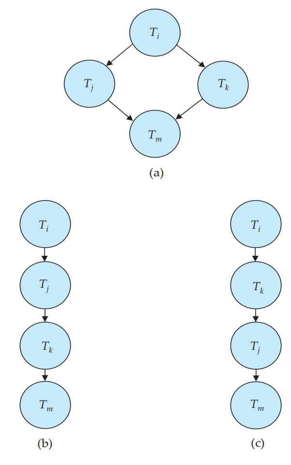

### View Serialisability  视图可串行化

- Let S and S´ be two schedules with the same set of transactions. S and S´ are **view equivalent** if the following **three** conditions are met, for each data item Q

  设 S 和 S' 是具有相同事务集的两个计划。对于每个数据项 Q，如果满足以下 **三个** 条件，则 S 和 S' 是 **视图等效的**

  - If in schedule S, transaction Ti reads the initial value of Q, then in schedule S’ also transaction Ti must read the initial value of Q.

    如果在计划 S 中，事务 Ti 读取 Q 的初始值，那幺在计划 S 中，事务 Ti 也必须读取 Q 的初始值。

  - If in schedule S, transaction Ti executes read(Q), and that value was produced by transaction Tj (if any), then in schedule S’ also transaction Ti must read the value of Q that was produced by the same write(Q) operation of transaction Tj .

    如果在计划表 S 中，事务 Ti 执行了 read(Q)，而该值是由事务 Tj（如果有）产生的，那么在计划表 S' 中，事务 Ti 也必须读取由事务 Tj 的同一写入(Q)操作产生的 Q 值。

  - The transaction (if any) that performs the final write(Q) operation in schedule S must also perform the final write(Q) operation in schedule S’.

    在计划表 S 中执行最后写入（Q）操作的事务（如果有）也必须在计划表 S' 中执行最后写入（Q）操作。

- As can be seen, view equivalence is also based purely on **reads** and **writes** alone.

  可以看出，视图等价性也纯粹基于 **reads** 和 **writes**。

- A schedule *S* is **view serialisable** if it is view equivalent to a serial schedule.

  如果时间表 *S* 的视图等同于串行时间表，那幺它是 **view serialisable**。

- **Every conflict serialisable schedule is also view serialisable but not vice versa.**

  每个冲突可串行化的计划也是可查看串行化的，但反之则不然。

  - Below is a schedule which is view-serialisable but not conflict serialisable.

    下面是一个可查看串行化但不可冲突串行化的计划。

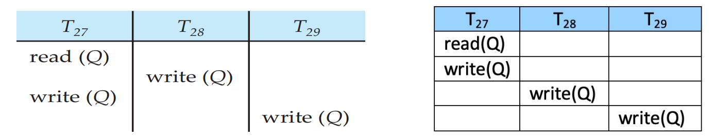

- What serial schedule is above equivalent to? 
  - Answer: <T27, T28, T29>

- Every view serialisable schedule that is not conflict serialisable has **blind writes**

  每个不冲突可串行化的视图可串行化调度都有 **盲写**

### Test for View Serialisability （课上SKIP了）

- The precedence graph test for conflict serialisability cannot be used directly to test for view serialisability.

  冲突可串行化性的优先图测试不能直接用于测试视图可串行化性。

  - Extension to test for view serialisability has cost **exponential** in the size of the precedence graph.

    用于测试视图可串行化性的扩展在优先级图的大小中具有指数成本。

- The problem of checking if a schedule is view serialisable falls in the class of **NP-complete** problems.

  检查调度是否为 view serialisable 的问题属于 NP-complete 问题类。 

  - Thus existence of an efficient algorithm is extremely unlikely.

    因此，存在有效算法的可能性极小。

- However practical algorithms that just check some **sufficient conditions** for view serialisability can still be used.

  但是，仍然可以使用仅检查视图可串行化性的一些充分条件的实用算法。

- It is not used in practice due to its high degree of computational complexity.

  由于计算复杂度高，因此在实践中不使用它。

## Recoverable Schedules  可恢复的调度

- Recoverable schedule — if a transaction Tj reads a data item previously written by a transaction Ti , then the commit operation of Ti appears before the commit operation of Tj .

  可恢复时间表 - 如果事务 Tj 读取了先前由事务 Ti 写入的数据项，则 Ti 的提交操作会出现在 Tj 的提交操作之前。

- The following schedule (Schedule 11) is **not** recoverable as T7commits immediately after the read

  由于 T7 会在读取后立即提交，因此**无法**恢复以下附表（附表 11

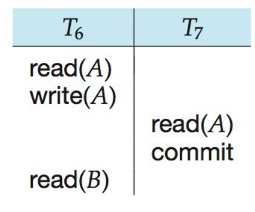

- If T6 should abort, T7 would have read (and possibly shown to the user) an inconsistent database state. 

  如果 T6 应该中止，T7 将读取（并可能向用户显示）不一致的数据库状态。

- Hence, database must ensure that schedules are recoverable

  因此，数据库必须确保计划是可恢复的

### Cascading Rollbacks  级联回滚

- **Cascading rollback** – a single transaction failure leads to a series of transaction rollbacks. Consider the following schedule where none of the transactions has yet committed.

  **级联回滚** – 单个事务失败会导致一系列事务回滚。请考虑以下计划，其中尚未提交任何事务。

- If T10 fails (aborted later and needs to roll back), T11 and T12must also be rolled back.

  如果T10失败（稍后中止并需要回滚），T11和T12也必须回滚。

- Can lead to the undoing of a significant amount of work.

  可能导致大量工作前功尽弃。

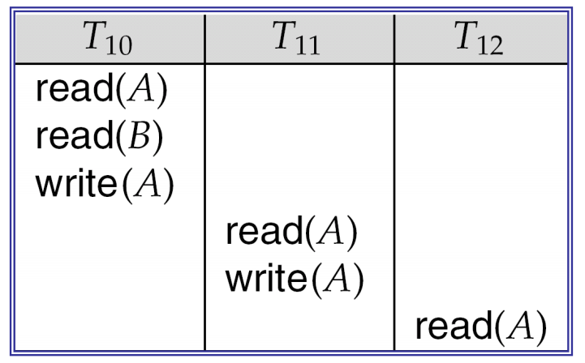

## Cascadeless Schedules 无级联时间表

在数据库管理系统中，多个事务通常会并发执行。当一个事务依赖于另一个事务的结果时，如果第一个事务失败并被回滚，第二个事务可能也需要回滚，这种情况被称为“级联回滚”。级联回滚不仅会增加系统的开销，还可能导致数据库的不一致性。

**Definition:**

**无级联调度**指的是一种调度，其中一个事务 **不能** 读取另一个事务尚未提交的写入数据。换句话说，一个事务在读取数据之前，必须确保这个数据已经由另一个事务提交。

- **Cascadeless schedules** — cascading rollbacks cannot occur; for each pair of transactions Ti and Tj such thatTj reads a data item previously written by Ti , the commit operation of Ti appears before the read operation of Tj .

  **无级联时间表** — 不能发生级联回滚;对于每对事务Ti和Tj使得Tj读取之前由Ti写入的数据项，Ti的提交操作出现在Tj的读取操作之前。

- Every **cascadeless** schedule is also **recoverable**, but **not** vice verse.

  每个 **无级联** 时间表也是 **可恢复的**，但 **不是** 反之。

- It is desirable to restrict the schedules to those that are **cascadeless**.

  最好将计划限制为 **无级联** 的计划。

**例子：**

**无级联调度**：

- 事务T1修改了数据项X，并提交。
- 事务T2读取了提交后的数据X，进行操作。

**有级联调度**（即脏读）：

- 事务T1修改了数据项X，但未提交。
- 事务T2读取了未提交的数据X（脏读），并进行操作。
- 如果事务T1最终回滚，那么事务T2所做的操作基于一个已经无效的数据，可能导致不一致性。

#### 关键点：

1. **避免读取未提交数据**：无级联调度的核心是防止事务读取其他事务的未提交数据（即“脏读”）。如果事务A正在对数据进行修改，事务B不能在事务A提交之前读取到这个修改后的数据。
2. **事务之间的隔离**：无级联调度保证了事务之间的隔离性，确保事务的并发执行不会互相干扰。
3. **不发生级联回滚**：如果事务B读取了事务A的数据，但事务A最终回滚，那么事务B就可能需要回滚，这种现象被称为级联回滚。无级联调度通过确保事务B只读取已经提交的数据，从而避免了这种情况。

