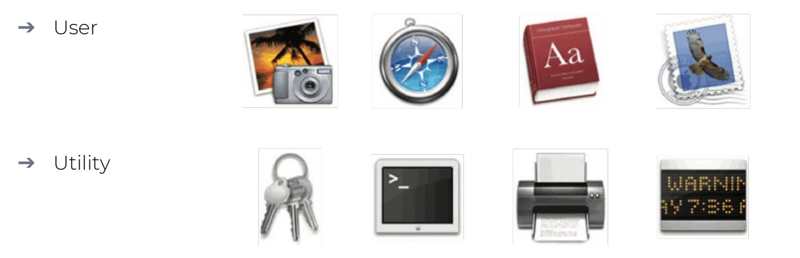

# Interfaces and Research Considerations

**这周的内容在考试中会被考察，尤其是后面有关界面的20种设计模式**

## Interface Metaphors  界面隐喻

- Interface designed to be similar to a physical entity but also has own properties

  界面设计为类似于物理实体，但也具有自己的属性

  - For example, desktop metaphor, and web portals

    例如，桌面隐喻和 Web 门户

- Can be based on activity, object, or a combination of both

  可以基于 **活动**、**对象** 或 **两者的组合**

- **Exploit user’s familiar knowledge**, helping them to understand ‘the unfamiliar’

  利用用户熟悉的知识，帮助他们理解“不熟悉的”

- Conjures up the essence of the unfamiliar activity, enabling users to leverage this to understand more aspects of the unfamiliar functionality

  结合不熟悉活动的本质，使用户能够利用这一点来了解不熟悉功能的更多方面

### Examples of interface metaphors 界面隐喻示例

- Conceptualizing what users are **doing**

  - For instance, **surfing** the Web

    例如上网可以被形容为“冲浪”

- A **conceptual model** instantiated at the **interface**

  - For example, the **desktop** and **card** metaphor

    例如电脑交互界面被称为 “桌面”

- Visualizing an **operation**
  
  可视化  **操作** 
  
  - For instance, an **icon of a shopping cart** into which the user places items
  
    例如，用户将商品放入**购物车** 的图标

### The card metaphor 卡片隐喻

- The card is a very popular UI. Why?

  为什么 卡片式 的设计在 UI 设计当中非常流行

  - It has familiar form factor

    它具有熟悉的外形规格

  - It can easily be flicked through, sorted, and themed

    它可以轻松浏览、排序和遵循一个特定的主题

  - It structures content into meaningful chunks (similar to how paragraphs are used to chunk a set of related sentences into distinct sections) 

    它将内容构建成有意义的块（类似于使用段落将一组相关句子分成不同的部分）

  - Its material properties give the appearance of the surface of paper

    它的材料特性赋予了近似于纸张表面的外观设计

### Benefits of interface metaphors 界面隐喻的好处

- Makes **learning** new systems easier

  使新系统的 **学习** 更容易

- Helps users understand the underlying **conceptual model**

  帮助用户理解底层  **概念模型** 

- Can be very **innovative** and enable the realm of computers and their applications to be made **more accessible** to a greater diversity of users

  可以非常 **创新**，并使计算机及其应用程序领域能够 **更易于访问** 更多种类的用户（不要掺杂 tricky words 或者过于花哨和复杂的交互，可以考虑迎合当前主流并且 **universal** 的设计）

### Problems with interface metaphors 界面隐喻的问题

- Break conventional and cultural rules

  打破传统和文化规则

  - For instance, recycle bin placed on desktop

    例如，将回收站放置在桌面上

- Can constrain designers in the way that they conceptualize a problem space

  会限制设计人员概念化问题空间的方式

- Conflicts with design principles

  与设计原则的冲突

- Forces users to understand only the system in terms of the metaphor

  迫使用户仅根据隐喻来理解系统

- Designers can inadvertently use bad existing designs and transfer the bad parts over

  设计师可能会无意中使用不良的现有设计，并将不良部分直接转移到最终产品上

- Limits designers’ imagination in coming up with new conceptual models

  限制了设计人员在提出新概念模型时的想象力

## Interaction Type 交互类型

### Interaction types 交互类型

1. Instructing

   指导

2. Conversing

   交谈

3. Manipulating

   操控

4. Exploring

   探索

5. Responding

   回应

More domain and context-specific activities, such as learning, working, socializing, playing, browsing, writing, problem-solving, decision-making, searching, driving, navigating, etc.

更多特定于域和上下文的活动，例如学习、工作、社交、玩耍、浏览、写作、解决问题、决策、搜索、驾驶、导航等。

#### 1. Instructing 指引

用户通过明确的指令（如输入命令、选择菜单）控制系统行为，系统按指令执行任务

- Where **users instruct a system** and tell it what to do

  **用户指示系统** 并告诉它该做什么

  - For example: Tell the time, print a file, or save a file

    例如：报时、打印文件或保存文件

- Very common conceptual model underlying a diversity of devices and systems

  非常常见的概念模型，通常所有的设备和系统都会支持这种交互

  - For instance: Word processors, and vending machines

    例如：文字处理器和自动售货机，用户可以告诉机器接下来需要进行的操作

- The main benefit is that instructing supports **quick and efficient** interaction

  主要好处是指导支持 **快速高效的** 交互

  - Good for repetitive kinds of actions performed on multiple objects

    适用于对多个对象执行的重复性作

- 应用场景

  - 命令行界面（CLI，如终端输入 `git commit`）。

  - 表单提交（填写后点击“提交”按钮）。

  - 传统菜单导航（如文件菜单中的“保存”）。

#### 2.Conversing 交谈

- Underlying model of having a conversation with another human

  与另一个人进行对话的底层模型

- Ranges from simple **voice recognition** menu-driven systems to more complex **‘natural language’** dialogs

  范围从简单的 **语音识别** 菜单驱动系统到更复杂的 **自然语言** 对话框。（例如现在的聊天大模型）

- Examples include timetables, search engines, advice-giving systems, and help systems

  示例包括提供时间表、搜索引擎、提供建议系统和系统操作帮助

- Also virtual agents, chatbots, toys, and pet robots designed to converse with you

  还有旨在与您交谈的虚拟代理、聊天机器人、玩具和宠物机器人

**Pros and cons of conversational model**

会话模型的 **优点和缺点**

- Allows users, especially **novices**, to interact with a system in a way that is familiar to them

  允许用户（尤其是新手）以他们熟悉的方式与系统交互

  - Can make them feel comfortable, at ease, and less scared

    可以让他们感到舒适、自在和不那么害怕

- **Misunderstandings** can arise when the system does not know how to parse what the user says

  当系统不知道如何解析用户所说的内容时，就会产生 **误解**

  - For example, voice assistants can misunderstand what children say

    例如，语音助手可能会误解孩子所说的内容

#### 3. Manipulating 操控

- Exploits users’ knowledge of how they **move and manipulate** in the physical world

  利用用户关于他们如何在物理世界中 **移动和操作** 的知识

- Involves dragging, selecting, opening, closing and zooming actions on virtual objects

  涉及对虚拟对象进行拖动、选择、打开、关闭和缩放的操作

- Can involve actions using **physical controllers** (e.g., Nintendo Switch) or **air gestures** (e.g., Microsoft Kinect) to control the movements of an on screen avatar

- **Tagged physical objects** (e.g., balls) that are manipulated in a physical world result in physical/digital events (e.g., animation being played)

**Direct Manipulation (DM)**

直接操作

- Ben Shneiderman (1983) coined the term DM

- Three core properties:
  
  三个核心原则：
  
  - **Continuous representation** of objects and actions of interest
  
    感兴趣的对象和动作的 **连续表示**
  
  - Rapid reversible actions with immediate feedback on object of interest
  
    快速可逆动作，对感兴趣的对象提供即时反馈
  
  - **Physical actions and button pressing** instead of issuing commands with complex syntax
  
     物理动作和按键 ，而不是发出复杂语法的命令
  
- Example: Drag and drop to move files

  示例：拖放以移动文件

**Benefits of direct manipulation**

直接操纵的好处

- Novices can learn the basic functionality quickly

  新手可以快速学习基本功能

- Experienced users can work extremely rapidly to carry out a wide range of tasks − even defining new functions

  经验丰富的用户可以非常快速地执行各种任务，甚至可以定义新功能

- Intermittent users can retain operational concepts over time

  间歇性用户可以随着时间的推移保留操作概念

- Error messages rarely needed

  很少需要错误消息

- Users can immediately see if their actions are furthering their goals, and if not, do something else

  用户可以立即看到他们的行为是否促进了他们的目标，如果没有，就做其他事情

- Users experience less anxiety

  用户体验到的焦虑会更少

- Users gain confidence and mastery and feel in control

  用户获得信心和掌控感

**Disadvantages of direct manipulation**

 直接操作的缺点 

- Some people take the metaphor of direct manipulation too **literally**

  有些人把直接操纵的比喻看得太 **字面** 了

  - E.g., playing guitar on iPad

    例如，在iPad上弹吉他

- Moving a cursor using a mouse or touchpad can be slower than pressing function keys to do the same actions

  使用鼠标或触摸板移动光标可能比按功能键执行相同操作要慢

  - E.g.,: find all and replace

    例如：查找全部并替换

  - Repetitive tasks are not well supported.

    重复性任务没有得到很好的支持。

- Some gestures can be more error-prone than typing.

  有些手势比打字更容易出错。
  
  - E.g., drag a drop a picture width to 2.00 cm.
  
    例如，将图片宽度拖放到2.00厘米。

#### 4. Exploring 探索

- Involves **moving** through virtual or physical environments

  涉及在虚拟或物理环境中 **移动**

  - Users can explore aspects of a virtual 3D environment

    用户可以探索虚拟3D环境的各个方面

  - Physical environments can also be embedded with sensors that when detect the presence of someone will trigger digital or physical events to happen

    物理环境还可以嵌入传感器，当检测到有人存在时，将触发数字或物理事件的发生

- Many examples of virtual environments, including cities, parks, buildings, rooms, and datasets

  许多虚拟环境示例，包括城市、公园、建筑物、房间和数据集

  - Enable users to fly over them and zoom in and out of different parts

    使用户能够飞越它们并放大和缩小不同的部分

#### 5. Responding 回应

- **System** takes the initiative to **alert user to something** that it “thinks” is of interest

  系统 **主动** 提醒用户注意它 “认为” 感兴趣的内容

- System does this by:

  系统通过以下方式实现：

  - Detecting the location and-or presence of someone in a vicinity and notifies them on their phone or watch

    检测附近某人的位置和/或存在，并通过手机或手表通知他们

  - What it has learned from their repeated behaviors

    从人们的重复的行为中学习

- Examples:

  案例

  - Alerts the user of a nearby coffee bar where some friends are meeting

    提醒用户附近有朋友正在聚会的咖啡馆

  - User’s fitness tracker notifies them of a milestone reached

    用户的健身追踪器会通知他们达到的里程碑

- Automatic system response without any requests made by the user

  自动系统响应，无需用户提出任何请求

### Choosing an interaction type

- **Direct manipulation** is good for ‘doing’ types of tasks, for example, designing, drawing, flying, driving, or sizing windows

   **直接操作**  适用于 “doing” 类型的任务，例如，设计、绘图、飞行、驾驶或调整窗口大小

  - 需要直观、实时反馈的操作
    - 图形设计（Photoshop拖拽图层）。
    - 3D建模（Blender中旋转物体）。
    - 游戏控制（《赛车游戏》方向盘操控）。
    - 界面调整（拖动窗口边缘改变大小）。
  - 优势：
    - **符合直觉**：模仿物理世界行为（如拖拽文件到垃圾桶）。
    - **即时反馈**：操作结果立即可见（如调整颜色滑块实时预览）。
    - **高控制感**：用户主导流程，减少认知负担。
  - 劣势
    - **学习成本高**：复杂工具需熟悉操作逻辑（如CAD软件快捷键）。
    - **功能局限性**：不适合抽象任务（如“批量重命名100个文件”）。
    - **空间要求**：依赖屏幕尺寸（移动端小屏可能操作困难）。

- Issuing **instructions** is good for **repetitive tasks**, for example, spell checking and file management

  发布  **指令**  有利于  **重复性任务** ，例如拼写检查和文件管理

  - 重复性/批量化任务：
    - 文件管理（命令行输入 `mv old.txt new.txt`）。
    - 文本处理（Word中“查找替换所有”）。
    - 自动化脚本（Python批量处理数据）。
  - 优势：
    -  **高效精准**：一条指令完成复杂操作（如 `grep "error" log.txt`）。
    - **可编程性**：支持脚本化（自动化工作流）。
    - **适合专家用户**：熟练后速度远超GUI。
  - 劣势：
    - **高门槛**：需记忆语法或菜单路径（如Linux命令）。
    - **容错性低**：错误指令可能导致严重后果（如 `rm -rf /`）。
    - **缺乏直观性**：无视觉反馈，依赖用户想象力。

- Having a **conversation** is good for **certain services**, for instance, finding information or requesting music.

  进行 **对话** 有利于 **某些特定的服务**，例如查找信息或请求音乐

  - **多功能系统**：需兼顾灵活性与效率，如：
    - 现代IDE（VS Code：命令行+GUI+插件对话）。
    - 智能家居控制（语音指令+APP拖拽+自动化规则）。
    - 办公软件（Excel：公式输入+鼠标操作+自然语言查询）。
  - 优势：
    - **低学习成本**：自然语言输入（如“明天天气怎么样？”）。
    - **包容性强**：适合非技术用户或移动场景。
    - **语境化**：支持多轮对话（如“再便宜一点的选项”）。
  - 劣势
    - **模糊性处理难**：需应对歧义（如“苹果”指水果还是品牌？）。
    - **效率瓶颈**：复杂任务需多次对话（如订机票需确认日期/座位）。
    - **技术限制**：NLP理解可能出错（方言、俚语）。

- **Hybrid conceptual models** are good for supporting multiple ways of carrying out the same actions.

  **混合概念模型** 有助于支持多种方式执行相同的操作
  
  - **多功能系统**：需兼顾灵活性与效率，如：
    - 现代IDE（VS Code：命令行+GUI+插件对话）。
    - 智能家居控制（语音指令+APP拖拽+自动化规则）。
    - 办公软件（Excel：公式输入+鼠标操作+自然语言查询）。
  - 优势
    - **覆盖多样需求**：不同用户选择偏好路径（新手用GUI，专家用CLI）。
    - **增强容错性**：一种方式失败时可切换（如语音识别失败改用手动输入）。
    - **适应复杂系统**：平衡效率与易用性。
  
  - 劣势
    - **设计复杂度高**：需统一不同模式的交互逻辑。
    - **可能造成混乱**：用户需理解多种交互方式（如“这个功能该用语音还是点击？”）。
    -  **开发成本大**：需整合多技术栈（NLP+GUI+API）。

### Interaction and interface 交互和页面

- Interaction:

  交互

  - A description of what the user is doing when interacting with a system

    描述用户在与系统交互时正在做什么

  - E.g., instructing, talking, browsing, or responding

    例如，指示、交谈、浏览或回复

- Interface:

  界面

  - **The kind of interface** used to support the interaction

    用于支持交互的 **接口类型**

  - E.g., command, menu-based, gesture, or voice

    例如，命令、基于菜单、手势或语音

## Interfaces 界面

### 20 interface types covered 20种界面类型

1. Command

2. Graphical
3. Multimedia
4. Virtual reality
5. Web
6. Mobile
7. Appliance
8. Voice
9. Pen
10. Touch
11. Gesture
12. Haptic
13. Multimodal
14. Shareable
15. Tangible 
16. Augmented reality
17. Wearables
18. Robots and drones
19. Brain–computer interaction
20. Smart

### 1. Command line interfaces 命令行界面

- Commands such as abbreviations typed in at the prompt to which the system responds (for example, 'ls' listing current files)

  在系统响应的提示符下键入的命令，如缩写（例如ls）（例如，列出当前文件）

- Some are hard wired at keyboard, while others can be assigned to keys

  有些是强绑定在键盘上的一些键位，而其他的命令可以分配到自定义的键位

- Efficient, precise, and fast

  高效、精确、快速

- Large overhead to learning set of commands

  学习命令集的开销很大（例如使用 vim 这种编辑器）

**Research and design considerations**

- Form, name types and structure are key research questions

  形式、名称类型和结构是关键的研究问题

- **Consistency** is the most important design principle
  
   **一致性**  是最重要的设计原则
  
  - For example, always use first letter of command
  
    例如，始终使用命令的第一个字母
  
- Command interfaces popular for web scripting

  web脚本编写的时候常常会用到命令行页面

### 2. Graphical user interfaces (GUIs) 图形用户界面

- Xerox Star first **WIMP** gave rise to GUIs

- **W**indows

  窗口

  - Sections of the screen that can be scrolled, stretched, overlapped, opened, closed, and moved around the screen using the mouse

    可以使用鼠标在屏幕上滚动、拉伸、重叠、打开、关闭和移动的屏幕部分

- **I**cons 

  图标

  - Pictograms that represent applications, objects, commands, and tools that were opened when clicked on

    表示单击时打开的应用程序、对象、命令和工具的象形图

- **M**enus 

  菜单

  - Lists of options that can be scrolled through and selected

    可滚动和选择的选项列表

- **P**ointing device 

  指针设备

  - A mouse controlling the cursor as a point of entry to the windows, menus, and icons on the screen

    一种鼠标，控制光标作为进入屏幕上窗口、菜单和图标的入口点

**Window design**

**窗口**设计

- Windows were invented to overcome the physical constraints of a computer display

  窗口的发明是为了克服计算机显示器的物理限制

  - They enable more information to be viewed and tasks to be performed

    它们允许查看更多信息和执行更多任务

- Scroll bars within windows enable more information to be viewed

  窗口内的滚动条允许查看更多信息

- Multiple windows can make it difficult to find desired one

  多个窗口可能会导致难以找到所需的窗口

  - **Listing, tabbing, and thumbnails** are techniques that can help

    **列表、标签和缩略图** 都是可以提供帮助的技术

**Menu styles**

菜单风格

- Flat list: Good for showing large number of options at the same time when display is small

  平面列表：适合在显示器较小时同时显示大量选项

- Drop down: Shows more options on same screen (for example, cascading)

  下拉：在同一屏幕上显示更多选项（例如，级联）

- Pop-up: When pressed, command key for relevant options

  弹出窗口：按下时，命令键显示相关选项

- Contextual: Provides access to often-used commands associated with a particular item

  上下文：提供对与特定项目关联的常用命令的访问

- Collapsible: Toggles between + and − icons on a header to expand or contract its contents

  可折叠：在标题上的+和-图标之间切换，以展开或收缩其内容

- Mega: All options shown using 2D drop-down layout

  Mega：使用2D下拉布局显示所有选项 （就是包含所有的内容）

**Research and design considerations**

研究和设计考虑因素

- Window management 
  
  窗口管理
  
  - Enables users to move fluidly between different windows (and monitors) 
  
    使用户能够在不同的窗口（和显示器）之间流畅地移动
  
- How to switch attention between windows without getting distracted

  如何在不分心的情况下在窗口之间转移注意力

- Design principles of spacing, grouping, and simplicity should be used

  应使用间距、分组和简单性的设计原则

- Which terms to use for menu options (for example, “front” versus “bring to front” )

  菜单选项应使用哪些术语（例如，“前”与“放在前面”）

- Mega menus are easier to navigate than drop-down ones

  巨型菜单比下拉菜单更容易导航

**Icon design**

图标设计

- Icons are assumed to be easier to learn and remember than commands

  图标被认为比命令更容易学习和记忆

- Icons can be designed to be compact and variably positioned on a screen

  图标可以设计得紧凑，在屏幕上的位置可以变化

- Now pervasive in every interface

  现在已渗透到每个界面中

- **Icons**

  - Since the Xerox Star days, icons have changed in their look and feel: 

    - Black and white

      黑白

    - Color, shadowing, photorealistic images, 3D rendering, and animation

      多配色、阴影、逼真图像、3D渲染和动画

  - Many designed to be very detailed and animated making them both visually attractive and informative

    许多设计是非常详细的和具有动画感的，这使他们既具备视觉吸引力，又包含足够的信息

  - Can be highly inviting, emotionally appealing, and feel alive

    可以极具吸引力，情感上有吸引力，感觉充满活力

**Icon forms**

图标格式

- The mapping between the representation and underlying referent can be:
  
  表示和底层引用之间的映射可以是
  
  - Similar (for example, a picture of a file to represent the object file)
  
    类似（例如，一个文件的图片来表示目标文件）
  
  - Analogical (for instance, a picture of a pair of scissors to represent ‘cut’)
  
    类比（例如，一把剪刀的图片代表“剪”）
  
  - Arbitrary (such as the use of an X to represent ‘delete’)
  
    任意（例如使用X表示“删除”）
  
- The most effective icons are similar ones

  最有效的图标是相似的图标

- Many operations are actions making it more difficult to represent them 
  
  许多操作都是使其更难表示的操作
  
  - Use a combination of objects and symbols that capture the salient part of an action
  
    使用物体和符号的组合来捕捉动作的突出部分

**2 types of icon styles**

- User
- Utility
- 

##### Research and design considerations

研究和设计考虑

- There is a wealth of resources for creating icons
  
  创建图标有丰富的资源
  
  - Guidelines, style guides, icon builders, libraries, online tutorials
  
    指南、样式指南、图标生成器、库、在线教程
  
- Text labels can be used alongside icons to help identification for small icon sets 

  文本标签可以与图标一起使用，以帮助识别小图标集

- For large icon sets (for instance, photo editing or word processing) can use the hover function

  对于大型图标集（例如，照片编辑或文字处理）可以使用悬停功能

### 3. Multimedia 多媒体

- Combines different media within a single interface with various forms of interactivity

  将不同的媒体与各种形式的交互性结合在一个界面中

  - Graphics, text, video, sound, and animation

    图形、文本、视频、声音和动画

- Users click on links in an image or text

  用户点击图片或文字中的链接

  - Another part of the program

    项目的另一部分

  - An animation or a video clip is played

    播放动画或视频片段

  - Users can return to where they were or move on to another place

    用户可以返回到他们所在的位置或移动到另一个地方

- Can provide better ways of presenting information than a single media can

  可以提供比单一媒体更好的信息呈现方式

**Pros and cons** 优劣

- Facilitates rapid access to multiple representations of information

  便于快速访问多种信息表示形式

- Can provide better ways of presenting information than can any media alone

  可以提供比任何单独的媒体更好的信息呈现方式

- Can enable easier learning, better understanding, more engagement, and more pleasure

  可以使学习更容易，更好地理解，更多的参与和更多的乐趣

- Can encourage users to explore different parts of a game or story

  可以鼓励用户探索游戏或故事的不同部分

- Tendency to play video clips and animations while skimming through accompanying text or diagrams

  倾向于播放视频剪辑和动画，同时浏览附带的文本或图表

**Research and design considerations**

- How to design multimedia to help users explore, keep track of, and integrate the multiple representations.

  如何设计多媒体来帮助用户探索、跟踪和整合多种表现形式。

- Provide hands-on interactivities and simulations that the user has to complete to solve a task
  
  提供用户必须完成以解决任务的动手交互和模拟
  
  - Provide quizzes, electronic notebooks, and games
  
    提供测验、电子笔记本和游戏
  
- Multimedia good for supporting certain activities, such as browsing, but less optimal for reading at length

  多媒体有利于支持某些活动，如浏览，但不太适合长时间的阅读

### 4. Virtual reality 虚拟现实

- Computer-generated graphical simulations providing: 
  
  计算机生成的图形模拟提供：
  
  - “the illusion of participation in a synthetic environment rather than external observation of such an environment” (Gigante, 1993)
  
    “参与一个合成环境的错觉，而不是对这种环境的外部观察”（Gigante，1993年）
  
- Provide new kinds of experience, enabling users to interact with objects and navigate in 3D space 

  提供新的体验，使用户能够与对象交互并在3D空间中导航

- Create highly-engaging user experiences

  创造高度吸引人的用户体验

#### Pros and cons 优劣

- Can have a higher level of fidelity with objects that they represent compared to multimedia

  与多媒体相比，它们所代表的对象可以具有更高的保真度

- Induces a sense of **presence** where someone is totally engrossed by the experience

  诱导一种 **在场** 的感觉，让人完全沉浸在体验中

  - “a state of consciousness, the (psychological) sense of being in the virtual environment” (Slater and Wilbur, 1999)

  “意识状态，在虚拟环境中的（心理）感觉”（Slater和Wilbur，1999）

- Provides different viewpoints: first and third person

  提供不同的视角：第一人称和第三人称

- Early head-mounted displays were uncomfortable to wear and could cause motion sickness and disorientation

  早期的头戴式显示器佩戴起来很不舒服，可能会导致晕车和定向障碍

- Lighter VR headsets are now available (for example, HTC Vive) with more accurate head tracking

  现在可以使用更轻便的VR头戴式设备（例如HTC Vive），具有更精确的头部跟踪功能

**Application areas**  应用范围

- Video games

  网络游戏

- Arcade games for social groups

  社交团体街机游戏

- Therapy for fears

  恐惧治疗

- Experience how others feel emotions
  
  体验他人的情绪感受
  
  - For example, empathy and compassion
  
    例如，同理心和同情心
  
- Enrich user’s planning experience for travel destinations

  丰富用户对旅游目的地的规划体验

- Architecture, design, and education

  建筑、设计和教育

**Research and design considerations**

- Much research on how to design safe and realistic VRs to facilitate training

  关于如何设计安全逼真的虚拟现实以促进培训的大量研究

  - For example, flying simulators

    例如，飞行模拟器

  - Help people overcome phobias (for example, spiders or talking in public)

    帮助人们克服恐惧症（例如，蜘蛛或在公共场合说话）

- Design issues

  设计问题

  - How best to navigate through them (for instance, first versus third person)

    如何最好地浏览它们（例如，第一人称与第三人称）

  - How to control interactions and movements (for example, by using head and body movements)
  
    如何控制交互和动作（例如，通过使用头部和身体运动）
  
  - How best to interact with information (for instance by using keypads, pointing, and joystick buttons)
  
    如何最好地与信息交互（例如，通过使用鼠标、指针和操纵杆按钮）
  
  - Level of realism to aim for to engender a sense of presence
  
    旨在产生存在感的现实主义水平

### 5. Website design 网页设计

- Early websites were largely text-based, providing hyperlinks 

  早期的网站主要是基于文本的，提供超链接

- Concern was with how best to structure information to enable users to navigate and access them easily and quickly

  关注的是如何最好地组织信息，使用户能够轻松快速地导航和访问它们

- Nowadays, more emphasis is on making pages distinctive, striking, and aesthetically pleasing

  如今，更强调的是使页面与众不同，引人注目，美观

- Need to think of how to design information for multiple platforms—keyboard or touch?
  
  需要考虑如何为多个平台设计信息-键盘或触摸？
  
  - For example, smartphones, tablets, and PCs
  
    例如，智能手机、平板电脑和PC

**Usability versus aesthetics?**  可用性与美学？

- Vanilla or multi-flavor design?

  香草味还是多个味道？

  - Ease of finding something versus aesthetic and enjoyable experience

    容易找到的东西与美学和愉快的体验

- Web designers are:

  网页设计师包括：

  - “thinking great literature”

    “思考伟大的文学”

- Users read the web like a:

  用户阅读网页的方式如下：

  - “billboard going by at 60 miles an hour” (Krug, 2014)

    “广告牌以每小时60英里的速度驶过”（Krug，2014）

- Need to determine how to brand a web page to catch and keep ‘eyeballs’

  需要确定如何对网页进行品牌化，以吸引并保持“眼球”

**Breadcrumbs for navigation**  用于导航的面包屑

- Breadcrumbs are category labels:

  面包屑是类别标签：

  - Enable users to look at other pages without losing track of where they have come from

    使用户能够查看其他页面，而不会忘记它们的来源

  - Very usable
  
    非常实用
  
  - Enable one-click access to higher site levels
  
    允许一键访问更高级别的站点
  
  - Attract first time visitors to continue to browse a website having viewed the landing page
  
    吸引首次访问者继续浏览已查看登录页面的网站

#### In your face Web ads 面对面网络广告

- Web advertising is often intrusive and pervasive 

  网络广告通常是侵入性的和普遍的

- Flashing, aggressive, persistent, and annoying

  闪烁的，咄咄逼人的，执着的，讨厌的

- Often requires action to get rid of

  通常需要采取行动来摆脱

- What is the alternative?
  - Use of ad blockers

**Research and design considerations**

- Many books and guidelines on website design

  许多关于网站设计的书籍和指南

- Veen’s (2001) three core questions to consider when designing any website:

  - Where am I? 

  - Where can I go?

  - What’s here?

### 6. Mobile interfaces 移动页面

- Handheld devices intended to be used while on the move

  移动时使用的手持设备

- Have become pervasive, increasingly used in all aspects of everyday and working life
  
  已经变得无处不在，越来越多地用于日常生活和工作生活的各个方面
  
  - For example, phones, fitness trackers, and smartwatches
  
    例如，手机、健身追踪器和智能手表
  
- Larger-sized tablets used in mobile settings
  
  移动设备中使用的较大尺寸平板电脑
  
  - Including those used by flight attendants, marketing professionals, learning in the classroom
  
    包括空乘人员、营销专业人员、课堂学习人员使用的

### 7. Appliances 应用

- Everyday devices in home, public places, or car 

  家庭、公共场所或汽车中的日常设备

  - For example, washing machines, remotes, toasters, printers, and navigation systems) 

    例如洗衣机、遥控器、烤面包机、打印机和导航系统）

- And personal devices 

  和个人设备

  - For instance, digital clock and digital camera 

    例如，数字时钟和数码相机

- Used for short periods 

  短期使用

  - For example, starting the washing machine, watching a program, buying a ticket, changing the time, or taking a snapshot 

    例如，启动洗衣机、观看节目、买票、更改时间或拍摄快照

- Need to be usable with minimal, if any, learning

  需要通过最少的学习（如果有的话）即可使用

**Research and design considerations**

- Need to design as transient interfaces with short interactions

  需要设计为短暂交互的瞬时接口

- Simple interfaces

  简单的接口

- Consider trade-off between soft and hard controls 

  考虑软控制和硬控制之间的权衡

  - For example, use of buttons or keys, dials, or scrolling

    例如，使用按钮或按键、拨号盘或滚动

### 8. Voice User Interfaces 语音用户界面

- Involves a person talking with a spoken language app, for example, timetable, travel planner, or phone service

  涉及使用口语应用程序（例如，时间表、旅行计划或电话服务）进行交谈的人员

- Used most for inquiring about specific information, for example, flight times or to perform a transaction, such as buying a ticket

  大多数用于查询特定信息，例如航班时间或执行交易，例如购买机票

- Also used by people with visual impairments
  
  也被视障人士使用
  
  - For example, speech recognition word processors, page scanners, web readers, and home control systems
  
    例如，语音识别文字处理器、页面扫描仪、网络阅读器和家庭控制系统

**Modeling human conversations**

- People often interrupt each other in a conversation

  人们在谈话中经常互相打断

  - Especially when ordering in a restaurant, rather than let the waiter go through all of the options

    尤其是在餐厅点餐时，不要让服务员把所有的选项都做完

- Speech technology has a similar feature called ‘barge-in’

  语音技术有一个类似的功能，叫做“闯入”

  - Users can choose an option before the system has finished listing all of the options available

    用户可以在系统列出所有可用选项之前选择一个选项

**Structuring VUI dialogs**  构建VUI对话框

- Directed dialogs are where the system is in control of the conversation

  定向对话是系统控制对话的地方

  - Where it asks specific questions and requires specific responses

    它提出具体的问题并要求具体的回答

- More flexible systems allow the user to take the initiative:

  更灵活的系统允许用户采取主动：

  - For example, “I’d like to go to Paris next Monday for two weeks.”

    例如，“我想下周一去巴黎呆两周。”

- But more chance of error, since caller might assume that the system is like a human 

  但错误的可能性更大，因为调用者可能会认为系统就像人一样

- Guided prompts can help callers back on track

  引导式提示可以帮助呼叫者重回正轨

  - For example, “Sorry I did not get all that. Did you say you wanted to fly next Monday?”

    例如，“对不起，我没有得到所有这些。你说你想下周一坐飞机吗？”

**Voice assistants (for example, Alexa)**

- Have become popular in many homes

  在许多家庭中很受欢迎

- Allow all to use rather than being single use 

  允许所有人使用，而不是单独使用

- Support families playing games, interactive storytelling, jokes, and so forth

  支持家庭玩游戏、互动讲故事、笑话等

- Can encourage social and emotional bonding

  可以促进社交和情感联系

- Young children (under 4), however, find it difficult to be understood by the voice assistants

  然而，年幼的儿童（4岁以下）很难被语音助手理解

  - Frustrating for them

    让他们感到沮丧

**Research and design considerations**

- How to design systems that can keep conversation on track

  如何设计能够使对话保持正轨的系统

  - Help people navigate efficiently through a menu system

    帮助人们通过菜单系统高效导航

  - Enable them to recover easily from errors

    使他们能够轻松地从错误中恢复

  - Guide those who are vague or ambiguous in their requests for information or services

    引导那些在要求信息或服务时含糊其辞或模棱两可的人

- Type of voice actor (for example, male, female, neutral, or dialect) 

  配音演员的类型（例如，男性、女性、中性或方言）

  - Do people prefer to listen to and are more patient with a female or male voice, a northern or southern accent?

    人们更喜欢听女声还是男声，北方口音还是南方口音？

### 9. Pen-based devices 智能笔

- Enable people to write, draw, select, and move objects at an interface using light pens or styluses

  使人们能够使用光笔或触控笔在界面上书写、绘制、选择和移动对象

  - Capitalize on the well-honed drawing skills developed from childhood

    利用从小培养的精湛绘画技巧

- Digital ink, for example, Anoto, use a combination of ordinary ink pen with digital camera that digitally records everything written with the pen on special paper

  数字墨水，例如，Anoto，使用普通墨水笔与数码相机的组合，数码记录在特殊纸张上用笔书写的一切

Example: Apple's digital "pencil", the function is switchable and diverse

示例：苹果的数码“铅笔”，功能可切换且多样化

**Advantages** 优势

- Allows users to annotate existing documents quickly and easily

  允许用户快速轻松地注释现有文档

- Can be used to fill in paper-based forms that can readily be converted to a digital record using standard typeface

  可用于填写纸质表格，这些表格可使用标准字体轻松转换为数字记录

- Can be used by remote teams to communicate and work on the same documents

  远程团队可以使用它来沟通和处理相同的文档

### 10. Touchscreens 触摸屏

- Single touchscreens are used in walk-up kiosks (such as ticket machines and ATMs) to detect the presence and location of a person’s touch on the display

  单触摸屏用于步行式信息亭（如售票机和ATM），以检测显示屏上人触摸的存在和位置

- Multi-touch surfaces support a range of more dynamic finger tip actions, for example, swiping, flicking, pinching, pushing, and tapping

  多点触控表面支持一系列更动态的指尖动作，例如，滑动、轻弹、捏、推和轻敲

- They do so by registering touches at multiple locations using a grid

  他们通过使用网格在多个位置注册触摸来实现这一点

- Now used for many kinds of displays, such as smartphones, iPods, tablets, and tabletops

  现在用于多种显示器，如智能手机，iPod，平板电脑和桌面

  - Supports one and two hand gestures, including tapping, zooming, stretching, flicking, dwelling, and dragging

    支持单手和双手手势，包括轻击、缩放、拉伸、轻弹、停留和拖动

Example: 多指触控技术

**Research and design considerations**

- Provides fluid and direct styles of interaction involving freehand and pen-based gestures for certain tasks

  为某些任务提供流畅和直接的交互风格，包括徒手和基于笔的手势

- Core design concerns include whether size, orientation, and shape of touch displays effect collaboration

  核心设计问题包括触摸显示屏的大小、方向和形状是否会影响协作

  - Much faster to scroll through wheels, carousels, and bars of thumbnail images or lists of options by finger flicking

    通过手指轻弹，可以更快地滚动滚轮、旋转木马和缩略图或选项列表

  - Gestures need to be learned for multi-touch, so a small set of gestures for common commands is preferable

    多点触摸需要学习手势，因此最好使用一小组手势来执行常见命令

  - More cumbersome, error-prone, and slower to type using a virtual keyboard on a touch display than using a physical keyboard

    在触摸屏上使用虚拟键盘比使用物理键盘更麻烦、更容易出错、打字速度更慢

### 11. Gesture-based systems

- Gestures involve moving arms and hands to communicate

  手势包括移动手臂和手来交流 

- Uses camera recognition, sensor, and computer vision techniques

  使用相机识别、传感器和计算机视觉技术

  - Recognize people’s arm and hand gestures in a room
  
    识别房间里人们的手臂和手势
  
  - Gestures need to be presented sequentially to be understood (compare with the way sentences are constructed)
  
    手势需要按顺序呈现才能被理解（与句子的构建方式相比）

**Research and design considerations**

- How does computer recognize and delineate user’s gestures?

  计算机如何识别和描绘用户的手势？
  
  - Start and end points?
  
    起点和终点？
  
  - Difference between a deictic gesture (a deliberate pointing movement) and hand waving (an unconscious gesticulation) 
  
    指示手势（有意指向的动作）和挥手（无意识的手势）之间的区别
  
  - How realistic must the mirrored graphical representation of the user be in order for them to be believable?
  
    用户的镜像图形表示必须有多真实才能让人相信？
  
  - 一些宗教或者文化所使用的代表手势

### 12. Haptic interfaces  触觉接口

- Provide tactile feedback

  提供触觉反馈

  - By applying vibration and forces to a person’s body, using actuators that are embedded in their clothing or a device they are carrying, such as a smartphone

    通过对人体施加振动和力，使用嵌入衣服或携带设备（如智能手机）的致动器

- Vibrotactile feedback can be used to simulate the sense of touch between remote people who want to communicate

  振动触觉反馈可用于模拟想要交流的远程人员之间的触觉

- Ultra haptics creates the illusion of touch in midair using ultrasound to make the illusion of 3D shapes

  超触觉技术利用超声波在半空中产生触觉错觉，从而产生3D形状的错觉

**Realtime vibrotactile feedback**  实时振动触觉反馈 

- Provides nudges when playing violin incorrectly

  当小提琴演奏不正确时提供轻推

- Uses motion capture to sense arm movements that deviate from model

  使用运动捕捉来感知偏离模型的手臂运动

- Nudges are short vibrations on arms and hands

  手臂和手上的轻微振动

- Exoskeleton with artificial muscles that uses bubble haptic feedback

  带有使用气泡触觉反馈的人造肌肉的外骨骼

**Research and design considerations**

- Where best to place actuators on body

  最好将执行器放置在车身上的位置

- Whether to use single or sequence of ‘touches’

  是否使用单一或序列的“触摸”

- When to buzz and how intense

  什么时候嗡嗡作响，有多激烈

- How does the wearer feel it in different contexts?

  佩戴者在不同的情境下会有什么感觉？

- What kind of new smartphone/smartwatch apps can use vibrotactile creatively?

  什么样的新智能手机/智能手表应用程序可以创造性地使用振动触觉？

  - For example, slow tapping to feel like water drops meant to indicate that it is about to rain, and heavy tapping to indicate a thunderstorm is looming

    例如，缓慢敲击感觉像水滴意味着即将下雨，而沉重的敲击表明雷暴即将来临

### 13. Multimodal Interfaces 多模式界面

- Provide enriched user experiences 

  提供丰富的用户体验

  - By multiplying how information is experienced and detected using different modalities, such as touch, sight, sound, and speech 

    通过使用不同的方式（如触摸、视觉、声音和语音）体验和检测信息的方式

  - Support more flexible, efficient, and expressive means of human computer interaction

    支持更加灵活、高效、富有表现力的人机交互手段

  - Most common is speech and vision

    最常见的是言语和视觉

- Can be combined with multi-sensor input to enable other aspects of the human body to be tracked

  可以与多传感器输入相结合，以跟踪人体的其他方面

  - For example, eye gaze, facial expression, and lip movements

    例如，眼睛注视、面部表情和嘴唇运动

  - Provides input for customizing user interfaces

    提供自定义用户界面的输入

**Tracking a person’s movements**  跟踪一个人的动作

- Kinect camera can detect multimodal input in real time using RGB camera for facial recognition and gestures, depth camera for movement tracking, and microphones for voice recognition

  Kinect摄像头可以实时检测多模式输入，使用RGB摄像头进行面部识别和手势识别，深度摄像头进行运动跟踪，麦克风进行语音识别

- Used to build model of person and represented as avatar on display programmed to move just like them

  用于构建人的模型，并在显示器上表示为化身，编程为像他们一样移动

**Research and design considerations**

- Need to recognize and analyze user behavior, for example, speech, gesture, handwriting, or eye gaze 

  需要识别和分析用户行为，例如语音、手势、手写或眼神

- Much harder to calibrate these than single modality systems

  校准这些比单一模态系统更难

- What is gained from combining different input and outputs

  将不同的输入和输出结合起来可以获得什么 

- Is talking and gesturing, as humans do with other humans, a natural way of interacting with a computer?

  像人类与其他人一样，说话和打手势是与计算机交互的自然方式吗？

### 14. Shareable interfaces  可共享接口

- Designed for more than one person to use: 

  专为多人使用而设计：

  - Provide multiple inputs and sometimes allow simultaneous input by co-located groups

    提供多个输入，有时允许同一地点的组同时输入

  - Large wall displays where people use their own pens or gestures 

    人们使用自己的笔或手势的大型墙壁展示

  - Interactive tabletops where small groups interact with information using their fingertips 

    互动桌面，小团体用指尖与信息互动
  
    - For example, Diamond Touch, Smart Table, and Surface
  
      例如，Diamond Touch、Smart Table和Surface

Benefits 优势

- Provide a large interactional space that can support flexible group working

  提供一个大的空间，可以支持灵活的团队工作

- Can be used by multiple users

  可供多个用户使用

  - Can point to and touch information being displayed

    可以指向和触摸正在显示的信息
  
  - Simultaneously view the interactions and have the same shared point of reference as others
  
    同时查看交互，并与其他人共享相同的参考点
  
  - Can support more equitable participation compared with groups using single PC
  
    与使用单台PC的团体相比，可以支持更公平的参与

**Research and design considerations**

- Core design concerns include whether size, orientation, and shape of the display have an effect on collaboration

  核心设计关注点包括显示屏的大小、方向和形状是否会影响协作

- Horizontal surfaces compared with vertical ones support more turn taking and collaborative working in co-located groups 

  与垂直表面相比，水平表面支持更多的轮流和协同工作在同一地点的群体

- Providing larger-sized tabletops does not improve group working but encourages more division of labor 

  提供更大尺寸的桌面并不能改善小组工作，而是鼓励更多的分工

- Having both personal and shared spaces enables groups to work on their own and in a group

  拥有个人和共享空间使团队能够独立工作和在团队中工作

  - Cross-device systems have been developed to support seamless switching between these, for example, SurfaceConstellations

    已经开发了跨设备系统来支持这些设备之间的无缝切换，例如，

### 15. Tangible Interfaces 可触式介面

- Type of sensor-based interaction, where physical objects, for example, bricks, are coupled with digital representations 

  基于传感器的交互类型，其中物理对象（例如砖块）与数字表示相结合

- When a person manipulates the physical object/s, it causes a digital effect to occur, for example, an animation

  当一个人操纵物理对象时，它会导致数字效果发生，例如动画

- Digital effects can take place in a number of media and places, or they can be embedded in the physical object

  数字效果可以在许多媒体和地方发生，也可以嵌入到物理对象中

Example:

- Urp

  - Physical models of buildings moved around on tabletop 

    建筑物的物理模型在桌面上移动

  - Used in combination with tokens for wind and shadows

    与风和阴影的令牌组合使用

  - Digital shadows surrounding them to change over time

    它们周围的数字阴影会随着时间而变化

- CubeMuseum AR

  立方体博物馆AR

  - Digital models of museum artifacts

    博物馆文物的数字模型
  
  - Physical cube for manipulation
  
    用于操作的物理立方体

**Benefits** 优势

- Can be held in one or both hands and combined and manipulated in ways not possible using other interfaces

  可以单手或双手握住，并以其他界面无法实现的方式进行组合和操作

  - Allows for more than one person to explore the interface together 

    允许多人一起浏览界面

  - Objects can be placed on top of each other, beside each other, and inside each other

    物体可以放置在彼此的顶部、旁边和内部

  - Encourages different ways of representing and exploring a problem space

    鼓励以不同的方式表示和探索问题空间

- People are able to see and understand situations differently

  人们能够以不同的方式看待和理解情况

  - Can lead to greater insight, learning, and problem-solving than with other kinds of interfaces

    与其他类型的界面相比，可以带来更好的洞察力、学习和解决问题的能力

  - Can facilitate creativity and reflection

    可以促进创造力和反思

**Research and design considerations**

- What kinds of conceptual frameworks to use to help identify novel and specific features

  使用什么样的概念框架来帮助识别新颖和特定的特征

  - What kind of coupling to use between the physical action and digital effect

  物理动作和数字效果之间使用什么样的耦合

  - If it is to support learning, then an explicit mapping between action and effect is critical

    如果它是为了支持学习，那么行动和效果之间的明确映射是至关重要的

  - If it is for entertainment, then it can be better to design it to be more implicit and unexpected

    如果是为了娱乐，那么最好把它设计得更含蓄、更出乎意料

- What kind of physical artifact to use 

  用什么样的物理神器

  - Bricks, cubes, and other component sets are most commonly used because of flexibility and simplicity

    砖块、立方体和其他组件集因其灵活性和简单性而最常用

  - Stickies and cardboard tokens can also be used for placing material onto a surface

    贴纸和纸板令牌也可用于将材料放置在表面上

- With what kinds of digital outputs should tangible interfaces be combined?

  有形接口应该与哪些类型的数字输出相结合？

### 16. Augmented Reality 增强现实

- Augmented reality: Virtual representations are superimposed on physical devices and objects 

  增强现实：虚拟表示叠加在物理设备和物体上

- Pokémon Go made it a household game

  《口袋妖怪Go》成为一款家庭游戏

  - Used smartphone camera and GPS to place virtual characters onto objects in the environment as if they really are there

    使用智能手机摄像头和GPS将虚拟角色放置在环境中的物体上，就像它们真的在那里一样

- Many other applications including medicine, navigation, air traffic control, games, and everyday exploring

  许多其他应用，包括医学、导航、空中交通管制、游戏和日常探索

#### Other examples

- In medicine

  在医学

- Virtual objects, for example, x-rays and scans, are overlaid on part of a patient’s body

  虚拟对象，例如，X射线和扫描，覆盖在患者身体的一部分上 

- Aid the physician’s understanding of what is being examined or operated 

  帮助医生了解正在检查或手术的内容

- In air traffic control

  空中交通管制

- Dynamic information about aircraft overlaid on a video screen showing the real planes, and so on landing, taking off, and taxiing

  叠加在显示真实飞机的视频屏幕上的飞机动态信息，如降落、起飞和滑行

- Helps identify planes difficult to make out

  帮助识别难以辨认的飞机

**AR that uses forward facing camera** 使用前向摄像头的 AR

- Enables virtual try-ons (for example, Snapchat filters)

  启用虚拟试用（例如，Snapchat滤镜）

- AT mirrors set up in retail stores for trying on make-up, sunglasses, jewelry

  在零售商店里安装的AT镜子，用于化妆，太阳镜，珠宝

  - Convenient, engaging, and easy to compare more choices

    方便、吸引人、易于比较更多选择

  - But cannot feel the weight, texture, or smell of what is being tried on

    但无法感受到所试穿物品的重量、质地或气味

- Can be used to enable users to step into a character (for example, David Bowie, Queen Victoria)

  可用于使用户能够进入角色（例如，大卫·鲍伊、维多利亚女王）

#### Research and design considerations

- What kind of digital augmentation?

  什么样的数字增强？

  - When and where in physical environment?

    在物理环境中何时何地？

  - Needs to stand out but not distract from ongoing task

    需要脱颖而出，但不要分散对正在进行的任务的注意力

  - Needs to be able to align with real world objects

    需要能够与现实世界中的对象对齐

  - What happens if the AR is slightly off?

    如果AR稍微偏离会发生什么？

- What kind of device?

  什么样的设备？

  - Smartphone, tablet, head up display or other?

    智能手机、平板电脑、抬头显示器或其他？

#### 17. Wearables 可穿戴设备

- First developments were head- and eyewear-mounted cameras that enabled user to record what was seen and to access digital information

  最初的发展是头戴式和眼镜式摄像机，使用户能够记录所看到的内容并访问数字信息

- Since then, jewelry, head-mounted caps, smart fabrics, glasses, shoes, and jackets have all been used

  从那时起，珠宝、头戴式帽子、智能面料、眼镜、鞋子和夹克都被使用了

  - Provides the user with a means of interacting with digital information while on the move

    为用户提供在移动中与数字信息交互的方法

- Applications include automatic diaries, tour guides, cycle indicators, and fashion clothing

  应用包括自动日记、导游、自行车指示器和时尚服装

**Google Glass (2014)**

Why was there so much excitement and concern about people filming what they could see right in front of them?

为什么人们会对拍摄他们眼前的东西感到如此兴奋和担忧？

**Research and design considerations**

- Comfort 安慰

  - Needs to be light, small, not get in the way, fashionable, and preferably hidden in the clothing

    需要轻便、小巧、不碍事、时尚，最好藏在衣服里    -

- Hygiene 卫生

  - Is it possible to wash or clean the clothing once worn? 

    是否可以清洗或清洁衣服一旦穿？

- Ease of wear 易于穿着

  - How easy is it to remove the electronic gadgetry and replace it?

    拆卸和更换电子设备有多容易？

- Usability 可用性

  - How does the user control the devices that are embedded in the clothing?

    用户如何控制嵌入衣服中的设备？

### 18. Robots 机器

- Remote robots used in hazardous settings

  用于危险环境的远程机器人

  - Can be controlled to investigate bombs and other dangerous materials

    可以控制调查炸弹和其他危险材料

- Domestic robots helping around the house

  家用机器人在家里帮忙

  - Can pick up objects and do daily chores like vacuuming

    可以捡起物体和做日常杂务，如吸尘

- Pet robots as human companions 

  宠物机器人作为人类伴侣

  - Have therapeutic qualities, helping to reduce stress and loneliness

    具有治疗作用，有助于减轻压力和孤独感

- Sociable robots that work collaboratively with humans 

  与人类合作的社交机器人

  - Encourage social behaviors

    鼓励社交行为

**Social robots: Mel and Paro**

- Cute and cuddly

  可爱

- Can open and close eyes and make sounds and movements

  能睁开和闭上眼睛并发出声音和动作

**Drones** 无人机

- Unmanned aircraft that are controlled remotely and used in a number of contexts

  能睁开和闭上眼睛并发出声音和动作

  - For example, entertainment, such as carrying drinks and food to people at festivals and parties 

    比如娱乐，比如在节日和聚会上给人们带饮料和食物

  - Agricultural applications, such as flying them over vineyards and fields to collect data about crops, which is useful to farmers

    农业应用，例如在葡萄园和田地上空飞行，收集有关作物的数据，这对农民很有用

  - Helping to track poachers in wildlife parks in Africa

    帮助追踪非洲野生动物园的偷猎者

- Can fly low and stream photos to a ground station where images can be stitched together into maps 

  可以低空飞行并将照片流式传输到地面站，在那里可以将图像拼接成地图

- Can be used to determine the health of a crop, or when it is the best time to harvest the crop

  可用于确定作物的健康状况，或何时是收获作物的最佳时机

Example:

Drone being used to survey the state of a vineyard

无人机被用来调查葡萄园的状态

**Research and design considerations**

- How do humans react to physical robots designed to exhibit behaviors (for example, making facial expressions) compared with virtual ones?

  与虚拟机器人相比，人类对设计用于展示行为（例如，做出面部表情）的物理机器人有何反应？

- Should robots be designed to be human-like or look like and behave like robots that serve a clearly-defined purpose?

  机器人应该被设计成像人类一样，还是看起来和行为都像机器人，为明确的目的服务？

- Should the interaction be designed to enable people to interact with the robot as if it was another human being or more human computer-like (for example, pressing buttons to issue commands)? 

  交互设计是否应该使人们能够与机器人进行交互，就好像它是另一个人或更像人类计算机（例如，按下按钮发出命令）？

- Is it acceptable to use unmanned drones to take a series of images or videos of fields, towns, and private property without permission or people knowing what is happening?

  使用无人驾驶飞机在未经许可或人们不知道发生了什么的情况下拍摄一系列田野，城镇和私人财产的图像或视频，这是可以接受的吗？

### 19. Brain-computer interfaces 脑机接口

- Brain-computer interfaces (BCI) provide a communication pathway between a person’s brain waves and an external device, such as a cursor on a screen

- Person is trained to concentrate on the task, for example, moving the cursor 

- BCIs work through detecting changes in the neural functioning in the brain

- BCIs apps:

  - Games (for example, Brain Ball)

  - Enable people who are paralyzed to control robots

Example:

A brain-computer interface being used by a woman who is paralyzed to select letters on the screen

一位瘫痪的女性使用脑机界面在屏幕上选择字母

### 20. Smart interfaces 智能接口

- Smart: phones, speakers, watches, cars, buildings, cites

  智能：手机、扬声器、手表、汽车、建筑物、城市

- Smart refers to having some intelligence and connected to the internet and other devices

  智能是指拥有一定的智能，并连接到互联网和其他设备

- Context-aware

  上下文感知

  - Understand what is happening around them and execute appropriate actions, for example, a Nest thermostat

    了解周围发生的事情并执行适当的操作，例如Nest恒温器

- Human-building interaction

  人机交互

  - Buildings are designed to sense and act on behalf of the inhabitants but also allow them to have some control and interaction with the automated systems

    建筑物的设计是为了感知和代表居民行事，但也允许他们与自动化系统进行一些控制和交互

### Which interface?

- Which interface to use will depend on task, users, context, cost, robustness, and so on

  使用哪个接口取决于任务、用户、上下文、成本、健壮性等

- Is multimedia better than tangible interfaces for learning?

  多媒体比有形的学习界面更好吗？ 

- Is speech as effective as a command-based interface? 

  语音和基于命令的界面一样有效吗？

- Is a multimodal interface more effective than a mono-modal interface? 

  多模式界面是否比单一模式界面更有效？

- Will wearable interfaces be better than mobile interfaces for helping people to find information in foreign cities? 

  在帮助人们在国外城市查找信息方面，可穿戴界面会比移动界面更好吗？

- Are virtual environments the ultimate interface for playing games? 

  虚拟环境是玩游戏的终极界面吗？

- Are shareable interfaces better at supporting communication and collaboration compared with using networked desktop PCs?

  与使用联网的台式电脑相比，可共享界面在支持通信和协作方面是否更好？

## Summary

- Many innovative interfaces have emerged in last 30 years, including speech, wearable, mobile, brain, and tangible

  在过去的30年里，出现了许多创新的界面，包括语音、可穿戴、移动的、大脑和有形的

- This raises many design and research questions as to decide which to use

  这就提出了许多设计和研究问题，以决定使用哪种

  - For example, how best to represent information to the user so that they can carry out ongoing activity or task

    例如，如何最好地向用户表示信息，以便他们可以执行正在进行的活动或任务

- New smart interfaces that are context-aware and monitor people

  具有上下文感知和监控功能的新智能界面

- Raising new ethical issues concerned with what data is being collected and what it is used for

  提出新的伦理问题，涉及收集的数据及其用途

