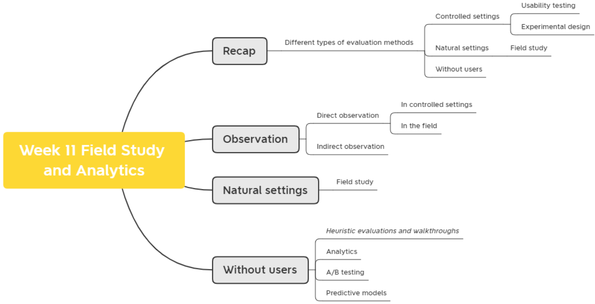

# Field Study and Analytics

主要分为两种

# Week11-**Field Study and Analytics**

## **Learning Outcomes**

1. To plan and carry out an **observation**
2. Understand the use of a **field study**
3. Explain the role of **analytics** in evaluation
4. Describe how **A/B testing** is used in evaluation
5. Understand the use of **predictive models**

### **Recap: Evaluation methods examples**

表格

## **Observations 观察**

### **Observation types**

- Direct observation
  - In the **field**
  - In **controlled environments**
- Indirect observation: tracking users’ activities
  - Diaries
  - Interaction logging
- Video and photographs collected remotely by drones or other equipment

### **A detailed framework (Robson, 2014) to guide observation**

- **Space**: What is the physical space like and how is it laid out?
- **Actors**: What are the names and relevant details of the people involved?
- **Activities**: What are the actors doing and why?
- **Objects**: What physical objects are present, such as furniture?
- **Acts**: What are specific individual actions?
- **Events**: Is what you observe part of a special event?
- **Time**: What is the sequence of events?
- **Goals**: What are the actors trying to accomplish?
- **Feelings**: What is the mood of the group and of individuals?

### **Direct observation in the field**

- Decide on how involved you will be
  - from **passive observer** to **active participant**
- How to gain **acceptance**
- How to handle **sensitive** topics, for example, culture, private spaces, and so on
- How to collect the data:
  - What data to collect
  - What equipment to use
  - When to stop observing

### **Research in the wild**

How would you conduct an **in-situ study** in your project?

### **Ethnography 民族志**

- Ethnography is a philosophy with a set of techniques that include **participant observation** and **interviews**
- **Ethnographers immerse themselves in the culture** that they study
- **Participation** is the key
- **Richer and more detailed** than other methods, but **expensive and challenging**

### **More on Ethnography**

- **Co-operation** of people being observed is required
- Informants are useful
- Data analysis is **continuous**
- **Questions get refined** as understanding grows
- Reports usually contain examples

### **Online Ethnography**

人们在线上的表现和线下的表现极大概率是不相同的

- Virtual, Online, Netnography
- Online and offline activity
- Interaction online differs from face-to-face
- **Virtual worlds** have a persistence that physical worlds do not have
- Ethical considerations and presentation of results are different

### **Observations and materials that might be collected 可能收集的观察结果和材料**

- **Activity** or job descriptions

- **Rules and procedures** that govern particular activities

- **Descriptions** of activities observed

- **Recordings** of the talk taking place between parties

- **Informal interviews** with participants explaining the detail of observed activities

- **Diagrams of the physical layout**, including the position of artifacts

- Other information collected when observing activities:

  在制作 Portfolio 的时候可以考虑引入更多的图像类内容，能够带来相较于文字来说更直观的解释。

  - **Photographs** of artifacts (documents, diagrams, forms, computers, and so forth)
  - **Videos** of artifacts
  - **Descriptions** of artifacts
  - **Workflow diagrams** showing the sequential order of tasks
  - **Process maps** showing connections between activities

### Observation Methods 观察方法

#### Direct Observation 直接观察

#### Indirect observations 间接观察

- Tracking users’ activities
  - Diaries
  - Interaction logs
  - Web analytics
- Video, audio, photos, and notes are used to capture data in both direct and indirect observations

## Field study 现场研究

- Field studies are done **in natural settings**

- **“In the wild”** is a term for prototypes being used freely in natural settings

- Seek to understand what users do **naturally** and how technology impacts them

- Field studies are used in product design to:

  - Identify opportunities for new technology

  - Determine design requirements

  - Decide how best to introduce new technology

  - Evaluate technology in use

Example:

